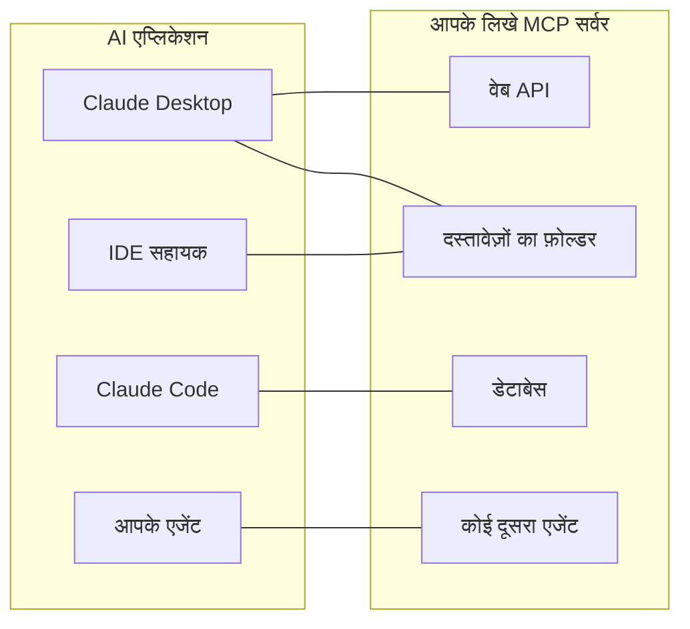
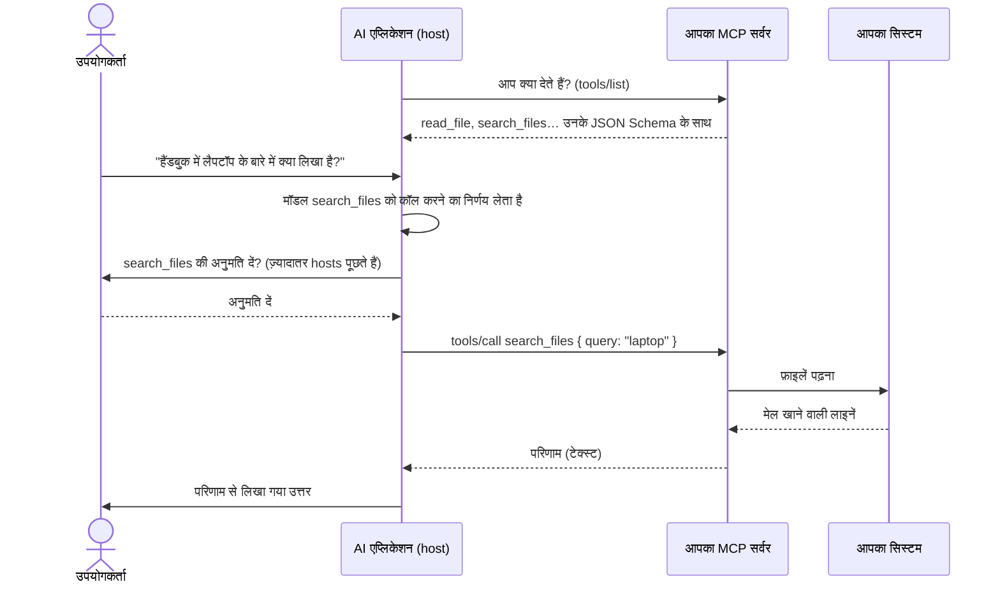
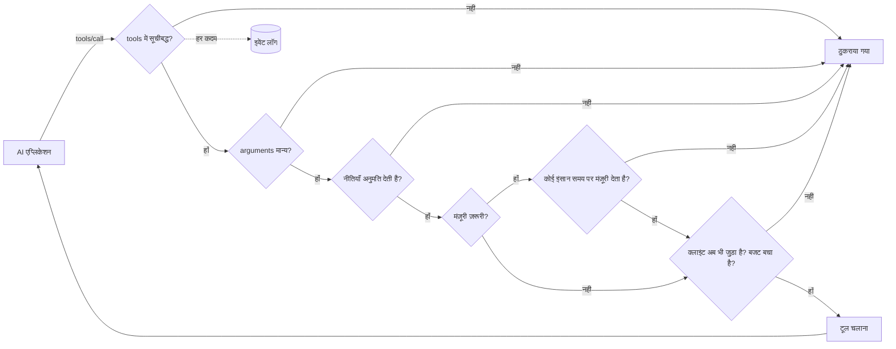

# MCP आसान भाषा में

**MCP किसी AI एप्लिकेशन — Claude Desktop, Claude Code, किसी IDE सहायक, आपके अपने एजेंट — को आपके सिस्टम इस्तेमाल करने देता है: एक API, दस्तावेज़ों का एक फ़ोल्डर, एक डेटाबेस, कोई दूसरा एजेंट।** यह पेज विचार और शब्दों को समझाता है। अगले पेज शून्य से एक काम करने वाले सर्वर तक ले जाते हैं:

1. [5 मिनट में आपका पहला MCP सर्वर](./mcp-first-server) — कदम-दर-कदम, एक खाली फ़ोल्डर से Claude Desktop तक।
2. [किसी भी चीज़ के लिए MCP सर्वर](./mcp-recipes) — किसी फ़ंक्शन, वेब API, फ़ोल्डर, डेटाबेस या एजेंट के लिए एक लाइन।
3. [डिप्लॉय करें, सुरक्षित करें और समस्या सुलझाएँ](./mcp-deploy) — HTTP डिप्लॉयमेंट, प्रमाणीकरण, मंज़ूरियाँ, और काम न करने पर क्या करें।

## विचार: हर AI ऐप के लिए एक प्लग {#the-idea-one-plug-for-every-ai-app}

MCP (Model Context Protocol) को **AI एप्लिकेशन के लिए USB-C** की तरह समझिए। USB से पहले, हर डिवाइस की अपनी केबल होती थी। MCP से पहले, हर AI एप्लिकेशन को हर उस सिस्टम के लिए अपना अलग जोड़ने वाला कोड चाहिए होता था जिससे वह बात करता था: Claude के लिए एक इंटीग्रेशन, आपके IDE के लिए दूसरा, आपके एजेंट के लिए तीसरा।

MCP के साथ, आप **अपने सिस्टम के सामने एक छोटा प्रोग्राम — एक MCP सर्वर —** लिखते हैं। फिर MCP बोलने वाला हर एप्लिकेशन उससे जुड़ सकता है, देख सकता है कि वह क्या देता है और उसे इस्तेमाल कर सकता है। आप सर्वर एक बार बनाते हैं; वह हर जगह काम करता है।



यह प्रोटोकॉल एक खुला मानक है, जो [modelcontextprotocol.io](https://modelcontextprotocol.io) पर प्रकाशित है। इसे Anthropic ने शुरू किया; कई AI एप्लिकेशन इसका समर्थन करते हैं।

## शब्द, एक-एक करके {#the-words-one-by-one}

| शब्द | आसान भाषा में | उदाहरण |
| --- | --- | --- |
| **Host** (AI एप्लिकेशन) | वह ऐप जिससे उपयोगकर्ता बात करता है। यह भाषा मॉडल चलाता है और तय करता है कि आपका सर्वर कब इस्तेमाल करना है। | Claude Desktop, Claude Code, VS Code |
| **MCP क्लाइंट** | host का वह हिस्सा जो एक सर्वर से कनेक्शन रखता है। यह आपको शायद ही कभी दिखता है। | Claude Desktop में हर सर्वर के लिए एक |
| **MCP सर्वर** | आपका छोटा प्रोग्राम। यह बताता है कि यह क्या देता है और माँगे जाने पर काम करता है। | `serveMcpOverStdio(sdk, { … })` |
| **टूल** (Tool) | एक कार्रवाई जिसे कॉल करने का निर्णय मॉडल ले सकता है, नाम वाले arguments के साथ। निर्णय लेने के लिए मॉडल इसका नाम, विवरण और arguments की सूची पढ़ता है। | `read_file`, `list_pets`, `query` |
| **रिसोर्स** (Resource) | एक दस्तावेज़ जिसे सर्वर पढ़ने के लिए देता है। टूल के उलट, इसे मॉडल नहीं, बल्कि **उपयोगकर्ता या ऐप** चुनता है (जैसे "attach" बटन से)। | `folder://handbook/onboarding.md` |
| **Prompt** | सर्वर द्वारा दिया गया पहले से बना संदेश-टेम्पलेट। यह SDK अभी इसे नहीं देता। | — |
| **ट्रांसपोर्ट** (Transport) | host और सर्वर के बीच संदेश कैसे आते-जाते हैं। | stdio, Streamable HTTP |
| **stdio** | host **आपके सर्वर को एक प्रोग्राम के रूप में उसी कंप्यूटर पर शुरू करता है** और उसके standard input और output के ज़रिए उससे बात करता है — जैसे उसमें टाइप करना और जो वह छापे उसे पढ़ना। नेटवर्क पर कुछ भी खुला नहीं होता। | Claude Desktop में लोकल सर्वर |
| **Streamable HTTP** | आपका सर्वर एक **वेब सेवा** है; hosts उसे HTTP अनुरोध भेजते हैं। किसी टीम के साथ एक सर्वर साझा करने के लिए इस्तेमाल होता है। | `https://mcp.example.com/mcp` |
| **JSON Schema** | किसी टूल के arguments का विवरण (नाम, टाइप, कौन-से ज़रूरी हैं) जिसे मॉडल पढ़ता है। SDK इसे आपके लिए लिखता है। | `{ "type": "object", "properties": { "path": { "type": "string" } } }` |
| **एनोटेशन** (Annotation) | hosts को दिखाया जाने वाला किसी टूल के बारे में संकेत, जैसे "यह टूल सिर्फ़ पढ़ता है"। hosts इसका इस्तेमाल यह तय करने में कर सकते हैं कि उपयोगकर्ता से पुष्टि कब माँगनी है। | `readOnlyHint: true` |

::: tip टूल बनाम रिसोर्स
**टूल** वह है जो मॉडल *करता* है ("हैंडबुक में 'laptop' खोजो")। **रिसोर्स** वह है जो उपयोगकर्ता *सौंपता* है ("इस बातचीत में onboarding.md जोड़ो")। फ़ोल्डर वाली रेसिपी एक ही फ़ोल्डर से दोनों देती है।
:::

## एक कॉल के दौरान क्या होता है {#what-happens-during-one-call}



दो बातें याद रखें:

- **मॉडल सिर्फ़ वही देखता है जो सर्वर सूचीबद्ध करता है**: नाम, विवरण, arguments के स्कीमा, और जो परिणाम उसे वापस मिलते हैं। विवरण साफ़ लिखें; उनमें कभी कोई गोपनीय जानकारी न रखें।
- **असल में क्या होता है, यह सर्वर तय करता है।** मॉडल एक कॉल प्रस्तावित करता है; आपका सर्वर उसे ठुकरा सकता है, सीमित कर सकता है, किसी इंसान से पूछ सकता है, या लॉग कर सकता है। यहीं यह SDK काम आता है।

## यह SDK क्या जोड़ता है {#what-this-sdk-adds}

आप सिर्फ़ आधिकारिक MCP SDK से भी MCP सर्वर लिख सकते हैं। यह SDK उसके ऊपर बैठता है और वह जोड़ता है जिसकी ज़रूरत सर्वर को **सुरक्षित रूप से, और एक लाइन में** चलाने के लिए होती है:

| | सिर्फ़ आधिकारिक MCP SDK के साथ | SDK AI Agents के साथ |
| --- | --- | --- |
| वेब API उपलब्ध कराना | हर endpoint के लिए एक handler लिखें | `openApiTools({ spec })` — हर operation के लिए एक टूल, डिफ़ॉल्ट रूप से केवल-पढ़ने-योग्य |
| फ़ोल्डर उपलब्ध कराना | पाथ की जाँचें खुद लिखें | `folderTools({ root })` — symbolic links और `..` फ़ोल्डर से बाहर नहीं जा सकते |
| डेटाबेस उपलब्ध कराना | SQL की सुरक्षा-जाँच खुद लिखें | `databaseTools({ database })` — एक SELECT, डेटाबेस के स्तर पर केवल-पढ़ने-योग्य (PostgreSQL पर read-only transaction, SQLite पर `query_only`), पंक्तियों की सीमा के साथ |
| एजेंट उपलब्ध कराना | — | `cognitiveAgentTool(agent)` — "Nicolas क्या सोचेगा?" एक टूल के रूप में |
| गलती से कुछ भी उपलब्ध न हो | आप पर निर्भर | सिर्फ़ वे टूल जो आप `tools` में सूचीबद्ध करते हैं |
| हर कॉल से पहले नियम | आप पर निर्भर | [नीतियाँ](./governed-agents), बजट, अनुमति-सूचियाँ |
| पहले कोई इंसान हाँ कहे | आप पर निर्भर | `requiresApproval` चिह्नित टूल `sdk.approveAction()` का इंतज़ार करते हैं; क्लाइंट के रद्द करने या डिस्कनेक्ट होने पर, और `approvalTimeoutMs` (डिफ़ॉल्ट रूप से 50 s) के बाद, मंज़ूरी रद्द हो जाती है |
| जानना कि क्या हुआ | आप पर निर्भर | हर कॉल और हर रिसोर्स को पढ़ना [इवेंट लॉग](./observability) में एक run है |



इसी क्रम में: अमान्य arguments वाली कॉल किसी से मंज़ूरी माँगे जाने से पहले ही ठुकरा दी जाती है, और कोई कॉल शुरू होते ही उसके बजट में गिन ली जाती है, उसका नतीजा चाहे जो हो।

MCP के ज़रिए की गई हर कॉल अपने अलग run के रूप में दर्ज होती है, `mcp:<server name>` पहचान के साथ: आप उसे पढ़ सकते हैं, उसकी लागत निकाल सकते हैं, उस पर अलर्ट लगा सकते हैं, ठीक किसी एजेंट run की तरह।

## दोनों दिशाएँ {#both-directions}

SDK दोनों तरफ़ MCP बोलता है:

- **सर्व करना**: अपने टूल, API, फ़ोल्डर, डेटाबेस और एजेंटों को MCP सर्वर में बदलें — अगले पेज।
- **इस्तेमाल करना**: अपने एजेंटों को किसी भी मौजूदा MCP सर्वर के टूल दें — नीचे।

### अपने एजेंटों में किसी MCP सर्वर के टूल इस्तेमाल करें {#use-the-tools-of-an-mcp-server-in-your-agents}

```ts
import { connectMcpServer } from '@sdk-ai-agents/core/mcp';

const crm = await connectMcpServer({
  name: 'crm',
  transport: { type: 'http', url: 'https://mcp.acme.internal/crm', headers: { Authorization: `Bearer ${token}` } },
  toolPrefix: 'crm_',                         // avoid collisions between servers
  include: ['lookup_customer', 'list_invoices'],
  metadata: { riskLevel: 'medium' },          // for every tool; a label no policy reads unless you write one
  retry: { maxRetries: 2 },
});

const tools = crm.tools.map((definition) => sdk.defineTool(definition));
const agent = sdk.createCognitiveAgent({ name: 'account-manager', model: 'gpt-4o', tools });

await agent.think({ problem: 'Should we offer customer c-42 a discount?' });
await crm.close();
```

| `transport.type` | इसे किसके लिए इस्तेमाल करें |
| --- | --- |
| `stdio` | प्रोसेस के रूप में शुरू किए जाने वाले लोकल सर्वर (`command`, `args`, `env`, `cwd`) |
| `http` | Streamable HTTP पर रिमोट सर्वर (`url`, `headers`) |
| `custom` | आपका बनाया कोई भी transport (WebSocket, टेस्ट के लिए in-memory…) |

इम्पोर्ट किए गए टूल सर्वर का JSON Schema रखते हैं, इसलिए मॉडल असली arguments देखता है। `sdk.defineTool` से परिभाषित होने के बाद, वे ठीक लोकल टूल की तरह व्यवहार करते हैं: अनुमति-सूचियाँ, नीतियाँ, मंज़ूरियाँ (`metadata: { requiresApproval: true }` हर कॉल को किसी इंसान के इंतज़ार में रखता है), बजट, दोबारा प्रयास और ट्रेस हर कॉल पर लागू होते हैं। अगर टूल की सूची लाना विफल हो जाए, तो error फेंके जाने से पहले कनेक्शन (और stdio प्रोसेस) बंद कर दिया जाता है।

::: warning सिर्फ़ उन्हीं सर्वरों से जुड़ें जिन पर आपको भरोसा है
इम्पोर्ट किए गए टूल के विवरण और परिणाम मॉडल तक शब्दशः पहुँचते हैं: कोई दुर्भावनापूर्ण सर्वर उनमें निर्देश लिख सकता है। सिर्फ़ भरोसेमंद सर्वरों से जुड़ें, हर एजेंट को सिर्फ़ वही टूल दें जिनकी उसे ज़रूरत है, और विनाशकारी टूल को मंज़ूरियों से सुरक्षित रखें।
:::

## जानने लायक बातें {#good-to-know}

- MCP समर्थन एक अलग entry point, `@sdk-ai-agents/core/mcp`, में है, इसलिए मुख्य पैकेज को `@modelcontextprotocol/sdk` की ज़रूरत तभी होती है जब आप इसे इस्तेमाल करें। टूल स्रोत (`openApiTools`, `folderTools`, `databaseTools`, `cognitiveAgentTool`, `webTools`…) मुख्य पैकेज में हैं: आपके एजेंट इन्हें MCP के बिना भी इस्तेमाल कर सकते हैं।
- सर्वर आधिकारिक MCP TypeScript SDK 1.30 पर बना है, जो प्रोटोकॉल के संशोधन 2024-10-07, 2024-11-05, 2025-03-26, 2025-06-18 और 2025-11-25 स्वीकार करता है (इसका `SUPPORTED_PROTOCOL_VERSIONS`, 2026-09-24 को जाँचा गया)। MCP साइट एक 2026-07-28 संशोधन का भी वर्णन करती है ([आर्किटेक्चर](https://modelcontextprotocol.io/docs/learn/architecture), 2026-09-24 को जाँचा गया), जिसे यह SDK अभी नहीं बोलता।
- यह SDK **टूल** और **रिसोर्स** सर्व करता है। Prompts, sampling और elicitation उपलब्ध नहीं हैं।

आगे: [अपना पहला सर्वर बनाएँ](./mcp-first-server)।
