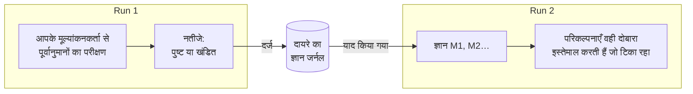

# runs के बीच स्मृति

::: tip आसान भाषा में
एक लैब नोटबुक के बारे में सोचिए, जिसे एक ही बेंच पर काम करने वाले सभी लोग साझा करते हैं। हर बार जब कोई प्रयोग किसी नियम की पुष्टि या खंडन करता है, तो उसे लिख लिया जाता है, साथ में यह कि क्या अपेक्षित था और क्या दिखा। अगला व्यक्ति शुरू करने से पहले नोटबुक पढ़ता है: जो टिका रहा उसे दोबारा इस्तेमाल करता है, और जो पहले ही विफल हो चुका है उसे उसी रूप में फिर से नहीं आज़माता।

एक संज्ञानात्मक एजेंट ऐसी नोटबुक रख सकता है। वह सिर्फ़ वही लिखता है **जिसका उत्तर किसी असली परीक्षण ने दिया**, कभी वह नहीं जो मॉडल या विचारक ने बस माना था।
:::

## यह क्या करता है {#what-it-does}



1. **किसी run के अंत में**, हर वह नियम या व्याख्या जिसके कम से कम एक पूर्वानुमान की आपके [परिणाम मूल्यांकनकर्ता](./evidence-and-verification#predictions-and-the-outcome-evaluator) ने पुष्टि या खंडन किया हो, एक **नतीजा (finding)** बन जाती है: कथन, उसका दायरा, वह नियम जिसे वह run के भीतर संशोधित करती है, और हर परीक्षण (क्या अपेक्षित था, क्या देखा गया, कौन-सा मूल्यांकनकर्ता)। नतीजे दायरे के **जर्नल** में जोड़े जाते हैं।
2. **उसी दायरे के अगले run की शुरुआत में**, सबसे प्रासंगिक आइटम **याद किए जाते हैं** और मानसिक स्थिति में `knowledge` के रूप में रखे जाते हैं, ids `M1`, `M2`… के साथ।
3. **run के दौरान**:
   - मॉडल हर आइटम को उसकी स्थिति और उसके ताज़ा परीक्षणों के साथ देखता है, और उससे कहा जाता है कि किसी सत्यापित नियम को उसके दायरे के भीतर हवाला देते हुए दोबारा इस्तेमाल करे;
   - जो परिकल्पना किसी **खंडित** आइटम को शब्दशः दोहराए (वही प्रकार, कथन और दायरा, बड़े-छोटे अक्षर और विराम-चिह्न छोड़कर), उसे इंजन ठुकरा देता है; मॉडल से कहा जाता है कि इसकी बजाय ऐसा वेरिएंट प्रस्तावित करे जो अपने आधार-वाक्यों में आइटम के `M` id का हवाला दे और खंडन को समझाए, लेकिन कोई भी दूसरा शब्द-चयन या दायरा एक नई परिकल्पना के रूप में स्वीकार किया जाता है;
   - जो परिकल्पना किसी **सत्यापित** या **विवादित** आइटम को दोहराए, वह अपने-आप उससे जुड़ जाती है (उसका `M` id आधार-वाक्यों में जोड़ दिया जाता है), ताकि तुलना वाला कदम पहले के परीक्षण देख सके।

## इसे चालू करें {#turn-it-on}

```ts
import { FileKnowledgeStore } from '@sdk-ai-agents/core';

const physicist = sdk.createCognitiveAgent({
  name: 'physicist',
  model: 'gpt-4o',
  evaluator: bench,   // without an evaluator, nothing is tested, so nothing is remembered
  knowledge: {
    store: new FileKnowledgeStore('./knowledge'),
    scope: 'inclined-plane',
  },
});

const first = await physicist.think({ problem: 'Does the rolling time depend on the ball?', observations });
const second = await physicist.think({ problem: 'Will a 250 g glass ball take as long as a steel one?' });

second.state.knowledge;
// [{ id: 'M1', status: 'refuted',  statement: 'Rolling time on this plane does not depend on the ball', … },
//  { id: 'M2', status: 'verified', statement: 'For rigid balls, rolling time on this plane does not depend on mass', … }]
```

| विकल्प | डिफ़ॉल्ट | अर्थ |
| --- | --- | --- |
| `store` | (ज़रूरी) | जर्नल कहाँ रखा जाता है: `FileKnowledgeStore`, `InMemoryKnowledgeStore` या आपका अपना |
| `scope` | (ज़रूरी) | ज्ञान किस बारे में है। runs जो सीखते हैं वह सिर्फ़ एक दायरे के भीतर साझा करते हैं। छोटे अक्षर, अंक, `.`, `-`, `_`: जो दो दायरे सिर्फ़ बड़े-छोटे अक्षरों में अलग हों, वे macOS और Windows पर एक ही फ़ाइल साझा करेंगे |
| `recallLimit` | `10` | run की शुरुआत में याद किए जाने वाले आइटम, 0 से 50 तक। `0` होने पर दर्ज होता है पर याद नहीं किया जाता |
| `record` | `true` | runs अपने परीक्षणों से स्थापित बातें दर्ज करें या नहीं |

`examples/rule-discovery.ts` इसका इस्तेमाल करता है: इसे दो बार चलाइए, और दूसरा run वहीं से शुरू होता है जो पहले ने स्थापित किया।

## क्या याद रखा जाता है, और क्या कभी नहीं {#what-is-remembered-and-what-never-is}

| याद रखा जाता है | कभी याद नहीं रखा जाता |
| --- | --- |
| ऐसे नियम और व्याख्याएँ जिनके किसी पूर्वानुमान की आपके मूल्यांकनकर्ता ने **पुष्टि** या **खंडन** किया | कार्रवाई के चुनाव (प्रस्ताव): वे इस पर निर्भर करते हैं कि कौन और कब निर्णय लेता है |
| क्या अपेक्षित था, क्या देखा गया, कौन-सा मूल्यांकनकर्ता और वर्ज़न | ऐसे पूर्वानुमान जो कभी परखे नहीं गए, या जिनका परीक्षण **अनिर्णायक** रहा |
| वह नियम जिसे कोई वेरिएंट संशोधित करता है, और क्या बदला | मॉडल ने क्या माना, उसने कितना समर्थन दिया, विचारक की पसंद |
| किन runs ने इसे दर्ज किया | run का अंतिम उत्तर |

जो run विफल हो जाए या रोक दिया जाए, वह भी अपने चलाए परीक्षण दर्ज करता है: माप मान्य रहता है, आगे चाहे जो हुआ हो।

## स्थितियाँ {#statuses}

| स्थिति | कब | मॉडल को क्या बताया जाता है |
| --- | --- | --- |
| `verified` | अब तक सिर्फ़ पुष्टियाँ | इसे इसके दायरे के भीतर दोबारा इस्तेमाल करो और हवाला दो; उस दायरे के बाहर यह फिर से परखने लायक एक परिकल्पना है |
| `refuted` | अब तक सिर्फ़ खंडन | इसे उसी रूप में दोबारा कभी प्रस्तावित मत करो; कोई वेरिएंट अपने आधार-वाक्यों में इसके `M` id का हवाला देता है और बताता है कि क्या अलग है |
| `contested` | पुष्टियाँ और खंडन, दोनों | यह सिर्फ़ कुछ स्थितियों में टिकता है: पता लगाओ कि किनमें |

एक ही दायरे में एक ही कथन एक ही आइटम है, चाहे उसके अक्षर बड़े-छोटे हों या विराम-चिह्न कुछ भी हों। परीक्षणों के डुप्लिकेट run और पूर्वानुमान के हिसाब से हटाए जाते हैं: एक ही run को दो बार दर्ज करने से कुछ नहीं जुड़ता।

## कौन-से आइटम याद किए जाते हैं {#which-items-are-recalled}

दायरे के आइटमों की रैंकिंग नियतात्मक तरीके से होती है:

1. समस्या के साथ सबसे ज़्यादा साझा शब्द (चार या ज़्यादा अक्षरों वाले शब्द, कथन और दायरे में);
2. फिर सबसे ज़्यादा परखे गए;
3. फिर सबसे नए।

पहले `recallLimit` आइटम याद किए जाते हैं। यह सीधा-सादा शब्द-मिलान है, सिमेंटिक खोज नहीं: समस्या से बहुत अलग शब्दों में लिखा गया नियम शायद सबसे पहले याद न किया जाए। दायरे संकरे रखें (एक बेंच, एक प्रोडक्ट, एक क्षेत्र) ताकि किसी दायरे की हर चीज़ प्रासंगिक हो।

## दायरे {#scopes}

दायरा एक सीमा है, सफ़ाई के लिए रखा गया फ़ोल्डर का नाम नहीं:

- runs जो सीखते हैं, वह सिर्फ़ एक दायरे के भीतर **साझा** करते हैं;
- हर उस बेंच, प्रोडक्ट, डेटासेट या क्षेत्र के लिए एक दायरा रखें जिसके नियम एक-दूसरे पर लागू होते हों: `inclined-plane`, `checkout-latency`, `churn-model-v3`;
- अगर क्लाइंट या tenants का डेटा अलग रहना ज़रूरी है, तो उन्हें कभी एक दायरे में न मिलाएँ।

## स्टोर {#stores}

| स्टोर | इसे किसके लिए इस्तेमाल करें |
| --- | --- |
| `FileKnowledgeStore(directory)` | हर दायरे के लिए एक फ़ाइल, `<directory>/<scope>.jsonl`, हर run की एक लाइन। लाइनें सिर्फ़ जोड़ी जाती हैं, इसलिए फ़ाइल पढ़ने योग्य इतिहास भी है। एक `FileKnowledgeStore` instance से होने वाले लेखन क्रम से होते हैं: एक प्रोसेस के एजेंटों के बीच एक ही instance साझा करें |
| `InMemoryKnowledgeStore()` | टेस्ट, प्रोटोटाइप, कम समय चलने वाले प्रोसेस |
| आपका अपना `KnowledgeStore` | कई प्रोसेस द्वारा साझा किया गया डेटाबेस |

अगर कई instances या प्रोसेस एक ही समय पर एक ही दायरे में लिखते हैं, तो उन्हें डेटाबेस इस्तेमाल करना चाहिए: पोर्ट के तीन methods लागू करें। बीच में रुके लेखन से अधूरी छूटी लाइन पढ़ते समय एक चेतावनी के साथ छोड़ दी जाती है, और अगली प्रविष्टि नई लाइन से शुरू होती है; जो लाइन मान्य JSON हो लेकिन मान्य प्रविष्टि न हो, वह अपनी लाइन संख्या के साथ पढ़ना रोक देती है, क्योंकि फ़ाइल में छेड़छाड़ हुई है।

```ts
import type { KnowledgeStore } from '@sdk-ai-agents/core';

const store: KnowledgeStore = {
  async recall({ scope, goal, limit }) { /* the most relevant items of the scope */ },
  async record({ scope, runId, recordedAt, findings }) { /* append one entry */ },
  async list(scope) { /* every item of the scope */ },
};
```

`projectKnowledge(entries)` जर्नल की प्रविष्टियों को आइटमों में बदलता है और `rankKnowledge(items, goal, limit)` उनकी रैंकिंग करता है, इसलिए एक कस्टम स्टोर को सिर्फ़ प्रविष्टियाँ रखनी होती हैं (जैसे हर run की एक पंक्ति) और इन दोनों का दोबारा इस्तेमाल करना होता है।

किसी भी समय देखें कि एक दायरा क्या जानता है:

```ts
for (const item of await store.list('inclined-plane')) {
  console.log(item.status, item.confirmations, item.refutations, item.statement);
}
```

## ऑडिट और रीप्ले {#audit-and-replay}

- याद किए गए आइटम `cognition.started` (`knowledge.scope`, `knowledge.items`) में दर्ज होते हैं, इसलिए `sdk.getMentalState(runId)` स्टोर को दोबारा पढ़े बिना ठीक-ठीक वह दोबारा बनाता है जो run जानता था, भले ही स्टोर तब से बदल गया हो।
- नतीजे एक `cognition.knowledge_recorded` इवेंट (`scope`, `findings`) में दर्ज होते हैं।
- विफल होने वाला स्टोर कभी run को नहीं रोकता: विफल याद करना `cognition.started` में `knowledge.error` के रूप में दर्ज होता है और run बिना स्मृति के आगे बढ़ता है; विफल दर्ज करना `cognition.knowledge_recorded` में `error` के रूप में दर्ज होता है। जो स्टोर run के `limits.timeoutMs` के भीतर जवाब न दे, उसे विफल माना जाता है (धीमा लेखन बाद में भी पूरा हो सकता है)। अगर इवेंट लॉग खुद नतीजे दर्ज नहीं कर पाता, तो एक चेतावनी छपती है और run का परिणाम बिना बदलाव के लौटाया जाता है।

## सीमाएँ {#limits}

- **शब्द-मिलान।** याद करना सिमेंटिक नहीं है; अलग शब्दों में लिखे मिलते-जुलते नियम छूट सकते हैं।
- **सिर्फ़ हूबहू दोहराव।** सिर्फ़ खंडित नियम का वही प्रकार, वही शब्द (बड़े-छोटे अक्षर और विराम-चिह्न छोड़कर) और वही दायरा रखने वाला दोहराव ठुकराया जाता है; शब्द बदलकर लिखा गया दोहराव नई परिकल्पना के रूप में स्वीकार होता है।
- **`verified` होने के लिए एक परीक्षण काफ़ी है।** कोई आइटम तभी सत्यापित हो जाता है जब एक पूर्वानुमान की पुष्टि हो जाए और किसी का खंडन न हो, और कौन-सा पूर्वानुमान किसी नियम को परखेगा यह मॉडल चुनता है: कमज़ोर पूर्वानुमान भी पुष्टि गिना जाता है।
- **दायरा घोषित होता है, जाँचा नहीं जाता।** "कठोर गेंदों" के लिए सत्यापित नियम उसी दायरे के साथ दिखाया जाता है, और मॉडल से कहा जाता है कि नए परीक्षण के बिना उसे कहीं और लागू न करे; कोड में कुछ भी इसकी जाँच नहीं करता।
- **मूल्यांकनकर्ता पर भरोसा किया जाता है।** स्मृति उतनी ही भरोसेमंद है जितना आपका मूल्यांकनकर्ता: गलत माप भी परीक्षण के रूप में याद रखा जाता है।
- **हर फ़ाइल का एक लेखक।** `FileKnowledgeStore` सिर्फ़ एक instance के लेखन को क्रम में रखता है; एक ही दायरे में लिखने वाले दो instances या दो प्रोसेस के बीच तालमेल नहीं होता।
