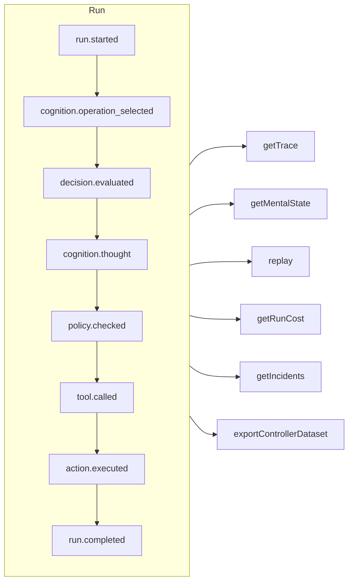

# ट्रेसबिलिटी और रीप्ले

हर run — नियंत्रित, संज्ञानात्मक, सीधा टाइप्ड निर्णय या MCP टूल कॉल — एक **सिर्फ़ जोड़े जा सकने वाला (append-only) इवेंट लॉग** है। रिकॉर्ड के बाहर कुछ नहीं होता, और बाकी सब कुछ इसी से निकाला जाता है।



## स्टोर {#stores}

| स्टोर | इसे किसके लिए इस्तेमाल करें |
| --- | --- |
| `FileEventStore` (डिफ़ॉल्ट) | डेवलपमेंट, एक ही प्रोसेस — हर run की एक JSON फ़ाइल |
| `SQLiteEventStore` | क्वेरी के साथ लोकल रूप से सहेजना |
| `PostgreSQLEventStore` | Production: indexed क्वेरी, एकत्रीकरण, बैकअप और restore |

::: code-group

```ts [File]
import { createSDK, FileEventStore } from '@sdk-ai-agents/core';

const sdk = createSDK({ apiKey, eventStore: new FileEventStore('./events') });
```

```ts [SQLite]
import Database from 'better-sqlite3';
import { createSDK, SQLiteEventStore } from '@sdk-ai-agents/core';

const sdk = createSDK({ apiKey, eventStore: new SQLiteEventStore({ db: new Database('events.db') }) });
```

```ts [PostgreSQL]
import pg from 'pg';
import { createSDK, PostgreSQLEventStore } from '@sdk-ai-agents/core';

const pool = new pg.Pool({ connectionString: process.env.DATABASE_URL });
const sdk = createSDK({ apiKey, eventStore: new PostgreSQLEventStore({ pool }) });
```

:::

स्टोर `IEventStore` लागू करते हैं; किसी भी डेटाबेस के लिए अपना स्टोर लिखें। फ़ाइल स्टोर इवेंट्स को बफ़र करता है और हर 100 ms पर उन्हें लिखता है; बंद करते समय बाकी बचे इवेंट लिखने के लिए `await store.destroy()` कॉल करें। लॉग पढ़ने वाले (मानसिक स्थिति का पुनर्निर्माण, लागत, डेटासेट) एक ही id के साथ दोहराए गए इवेंट्स को अनदेखा करते हैं।

## एक run पढ़ें {#read-a-run}

```ts
const trace = await sdk.getTrace(runId);          // status, timeline, summary
const text = await sdk.exportTrace(runId, 'text'); // human-readable timeline
const events = await sdk.getEvents(runId, { type: ['tool.called', 'policy.violated'] });
const state = await sdk.getMentalState(runId);    // cognitive runs
```

किसी run की स्थिति उसका **आखिरी जीवनचक्र इवेंट** (`run.completed`, `run.failed`, `run.cancelled`) होती है। इसके बाद जोड़े गए इवेंट — फ़ीडबैक, घटना रिपोर्ट — उसे कभी दोबारा नहीं खोलते।

## लाइव प्रगति {#live-progress}

इवेंट आपके कोड तक **run के चलते-चलते** भी पहुँचते हैं, जैसे ही स्टोर उन्हें स्वीकार कर लेता है: किसी इंटरफ़ेस में प्रगति दिखाने, उसे किसी क्लाइंट तक स्ट्रीम करने या किसी डैशबोर्ड को डेटा देने के लिए। MCP क्लाइंट उन्हें [प्रगति सूचनाओं](./mcp-deploy#progress-notifications) के रूप में पाते हैं।

```ts
const result = await agent.run({
  message: 'Refund order 1234',
  onEvent: (event) => console.log(event.type),
});

const answer = await cognitiveAgent.think({ problem, onEvent: (event) => socket.send(JSON.stringify(event)) });
const replay = await sdk.replay(runId, undefined, { onEvent: (event) => console.log(event.type) });

// Every run of the SDK, for as long as you listen
const unsubscribe = sdk.subscribe((event) => dashboard.push(event), { types: ['run.failed', 'approval.requested'] });
unsubscribe();
```

| कहाँ | listener को क्या मिलता है |
| --- | --- |
| `run({ onEvent })`, `think({ onEvent })` | उस run का हर इवेंट |
| `replay(runId, modifications, { onEvent })` | रीप्ले का हर इवेंट |
| `executeTool(name, params, { onEvent })` | कॉल के इवेंट, और उसके टूल द्वारा शुरू किए गए एजेंट run के इवेंट (`governedAgentTool`, `cognitiveAgentTool`), सिर्फ़ एक स्तर तक: वह एजेंट आगे जो runs शुरू करता है, उनके नहीं |
| `sdk.subscribe(listener, { runId?, agentId?, types?, maxQueued? })` | फ़िल्टर से मेल खाने वाले हर run का हर इवेंट, जब तक आप उसके द्वारा लौटाया गया फ़ंक्शन कॉल नहीं करते |

किन बातों की गारंटी है:

- **सिर्फ़ वही जो स्टोर ने स्वीकार किया।** कोई listener तभी कॉल होता है जब स्टोर का `append` सफल हो जाए, किसी ऐसे इवेंट के लिए कभी नहीं जिसे स्टोर ने ठुकरा दिया। SQL स्टोर के साथ पंक्ति commit हो चुकी होती है; फ़ाइल स्टोर के साथ इवेंट उसके बफ़र में होता है: `getEvents` उसे तुरंत लौटाता है, और वह 100 ms के भीतर डिस्क तक पहुँचता है (बीच में crash हो जाए तो वह खो जाता है)।
- **क्रम में।** किसी run के इवेंट उसी क्रम में आते हैं जिसमें वे दर्ज किए गए; अलग-अलग runs के इवेंट आपस में मिल-जुलकर आते हैं।
- **एक बार में एक इवेंट, और run कभी इंतज़ार नहीं करता।** जब आपका listener एक promise लौटाता है, तो उसका अगला इवेंट तब तक इंतज़ार करता है जब तक वह promise पूरा (settle) न हो जाए, इसलिए कोई async listener इवेंट्स का क्रम नहीं बदल सकता। इस बीच run चलता रहता है: धीमा listener पीछे छूट जाता है, वह एजेंट को धीमा नहीं करता। synchronous listener इवेंट का `append` लौटने से पहले कॉल होता है: उसे तेज़ रखें।
- **कॉल listener का इंतज़ार करती है, जब तक run बीच में रुक न जाए।** run खत्म होने के बाद, `run()`, `think()`, `replay()` और `executeTool()` तब तक इंतज़ार करते हैं जब तक उनका `onEvent` हर इवेंट को निपटा न ले, इसलिए जब वे लौटते हैं तो आप सब कुछ देख चुके होते हैं। यह इंतज़ार पहले ही खत्म हो जाता है जब run रोका या रद्द किया गया हो, या जब उसका `signal` abort हो (कॉल करने वाला हार मान ले); संज्ञानात्मक run के लिए, `limits.timeoutMs` इस इंतज़ार को भी गिनता है। तब listener की सदस्यता खत्म कर दी जाती है: जो इवेंट उसे अभी तक नहीं मिले, वे छोड़ दिए जाते हैं। रीप्ले रद्द नहीं किया जा सकता, इसलिए वह हमेशा इंतज़ार करता है। वरना कभी पूरा न होने वाला promise कॉल को लौटने से रोकता है: "चलाओ और भूल जाओ" वाले काम के लिए, promise न लौटाएँ (`onEvent: (event) => { void save(event); }`)।
- **एक सीमित कतार।** जो listener अब भी किसी पिछले इवेंट में व्यस्त है, उसके लिए ज़्यादा से ज़्यादा `maxQueued` इवेंट (डिफ़ॉल्ट रूप से 10 000) इंतज़ार करते हैं; उससे आगे, नए इवेंट इस listener के लिए छोड़ दिए जाते हैं। जब listener फिर से बराबरी पर आ जाता है, तब इसकी सूचना एक `LiveEventsDroppedError` के साथ दी जाती है, जो बताता है कि कितने इवेंट छोड़े गए।
- **Error run से बाहर रहते हैं।** जो listener कोई error फेंके या reject करे, उसकी सूचना standard error (`console.error`) पर दी जाती है, और उसे अगले इवेंट फिर भी मिलते हैं; छोड़े गए इवेंट्स की सूचना भी ऐसे ही दी जाती है। errors को खुद संभालने के लिए, उन्हें listener में ही पकड़ें; errors और छोड़े गए इवेंट्स, दोनों को एक साथ संभालने के लिए, SDK को `eventStore: new ObservedEventStore(store, { onListenerError })` के साथ बनाएँ।
- **एक प्रति।** हर listener को इवेंट की अपनी प्रति मिलती है, वैसी ही जैसी स्टोर उसे वापस पढ़ता है: उसे बदलने से लॉग में कुछ नहीं बदलता।
- **सदस्यता तुरंत खत्म होती है।** `sdk.subscribe` द्वारा लौटाया गया फ़ंक्शन कॉल होने के बाद, listener दोबारा कॉल नहीं होता, पहले से इंतज़ार कर रहे इवेंट्स के लिए भी नहीं; यह फ़ंक्शन listener के अंदर से भी कॉल किया जा सकता है।

`agentId` फ़िल्टर हर इवेंट के `metadata.agentId` से मिलान करता है: कुछ इवेंट किसी एजेंट से नहीं जुड़े होते (`provider.retry`, रीप्ले का अंत, `agentId` के बिना की गई `sdk.decisions` कॉल का `decision.evaluated`), उन्हें पाने के लिए run के हिसाब से फ़िल्टर करें। बैकअप से restore किए गए इवेंट listeners तक नहीं पहुँचाए जाते। `incidents` की घटना रिपोर्ट पहुँचाई जाती हैं; अगर आप `MonitoredEventStore` खुद बनाते हैं, तो उसे एक `ObservedEventStore` पर बनाएँ (`new MonitoredEventStore(new ObservedEventStore(store), options)`), वरना उसकी रिपोर्ट दर्ज तो होती हैं, पर लाइव नहीं पहुँचाई जातीं। अपने ही स्टोर पर हाथ से बनाए गए एजेंट (`new AgentImpl(…)`) के साथ `onEvent` इस्तेमाल करने के लिए, स्टोर को एक `ObservedEventStore` में लपेटें; `createSDK` यह आपके लिए करता है। किसी एजेंट टूल के पीछे, जिस एजेंट का स्टोर लपेटा नहीं गया है, वह विफल होने के बजाय कॉल करने वाले के listener के बिना चलता है।

## LLM के बिना रीप्ले {#replay-without-the-llm}

```ts
const replay = await sdk.replay(runId);
```

रीप्ले दर्ज किए गए इरादों को एक्शन इंजन के ज़रिए दोबारा चलाता है — नीतियों सहित — **LLM को कॉल किए बिना**। "अगर ऐसा होता तो?" वाली स्थितियों को परखने के लिए बदलावों के साथ रीप्ले करें, जैसे किसी नीति को बदलने के बाद।

रीप्ले टूल को सचमुच दोबारा चलाता है। `requiresApproval` चिह्नित टूल के लिए, रीप्ले सिर्फ़ उन्हीं कॉल को दोहराता है जिन्हें मूल run में किसी इंसान ने **मंज़ूरी दी** थी — वही टूल, वही पैरामीटर — बिना दोबारा पूछे; जो कॉल ठुकराई गई, रद्द हुई या जिसे कभी मंज़ूरी नहीं मिली, वह चलाई नहीं जाती, ठुकरा दी जाती है। किसी *नीति* द्वारा माँगी गई मंज़ूरियाँ फिर भी लागू होती हैं और निर्णय का इंतज़ार करती हैं।

## निर्णयों को समझें {#understand-decisions}

| Method | आपको क्या मिलता है |
| --- | --- |
| `getReasoningGraph(runId)` / `exportReasoningGraph(runId, 'graphviz')` | इरादा → नीति → कार्रवाई की कड़ी, एक ग्राफ़ के रूप में |
| `getAlternatives(runId)` | वे विकल्प जिन पर एजेंट ने विचार किया |
| `getDecisionPatterns(filters)` | runs में बार-बार आने वाले निर्णय-पैटर्न |
| `getTraceVisualization(runId)` | UI के लिए समूहों में बँटी, समय-रेखा के लिए तैयार संरचना |
| `getPolicyAuditTrail(runId)` | हर नीति-मूल्यांकन और उसका परिणाम |

## एजेंटों को कोड की तरह टेस्ट करें {#test-agents-like-code}

किसी अच्छे run को **गोल्डन ट्रेस** में बदलें, फिर नए runs को उसके सामने सत्यापित करें:

```ts
const golden = await sdk.createGoldenTrace(runId, { name: 'refund flow', description: 'Expected behavior' });
const validation = await sdk.validateAgainstGoldenTrace(newRunId, golden.id);
const regressions = await sdk.detectRegressions(newRunId, golden.id);
```

runs की तुलना उनके इवेंट्स के अर्थ से होती है — प्रकार, क्रम, टूल, पैरामीटर, नतीजे — इवेंट id से कभी नहीं, जो हर run में नए होते हैं; समय, tokens की गिनती और SDK के लिखे वे दूसरे मान जो हर run में बदलते हैं, वे भी छोड़ दिए जाते हैं, लेकिन किसी टूल के पैरामीटर और नतीजों की तुलना हमेशा होती है, उनकी keys के नाम चाहे जो हों। वही काम दोबारा करने वाला run पास होता है; दूसरे arguments के साथ कॉल किया गया टूल वहीं बताया जाता है जहाँ कॉल हुई।

### CI में रिग्रेशन सूट {#regression-suites-in-ci}

गोल्डन ट्रेस को एक बार किसी सूट में जमा करें, फिर उसे CI में चलाएँ:

```ts
// Once, after recording the good runs
await sdk.createRegressionTestSuite('support-agent', {
  name: 'refunds',
  goldenTraces: [{ goldenTraceId: golden.id, name: 'refund flow' }],
});

// In CI: the same agent, created again
sdk.createAgent({ name: 'support-agent', model: 'gpt-4o', tools });
const { results, exitCode } = await sdk.runRegressionTestsForCI('support-agent', {
  detection: { tolerance: { ignoreEventTypes: ['intention.generated'], ignoreDataFields: ['output'] } },
});
await sdk.exportTestResults(results, 'junit', { outputPath: 'regressions.xml' });
process.exitCode = exitCode;
```

सूट अपने एजेंट को उसके **नाम** से पहचानता है, क्योंकि एजेंट के id हर प्रोसेस में नए होते हैं। एजेंट के सभी सूट चलते हैं, सबसे पुराना पहले: हर टेस्ट संदर्भ run का इनपुट एजेंट को भेजता है और नए run की तुलना गोल्डन ट्रेस से करता है। सभी टेस्ट पास होने पर exit code 0 होता है, किसी टेस्ट को रिग्रेशन मिलने पर 1, और कोई टेस्ट न चल पाने पर 2। असली मॉडल हर run में अपने जवाब अलग शब्दों में देता है: ऊपर का `detection` मॉडल के टेक्स्ट और आखिरी जवाब को छोड़ देता है, और फिर भी हर टूल कॉल को उसके arguments के साथ जाँचता है।

किसी run के इवेंट्स पर assertions, दो runs की तुलना, किसी एजेंट के नए version का असर और सभी runs पर क्वेरी [SDK API](../reference/sdk-api#assertions) में हैं।
