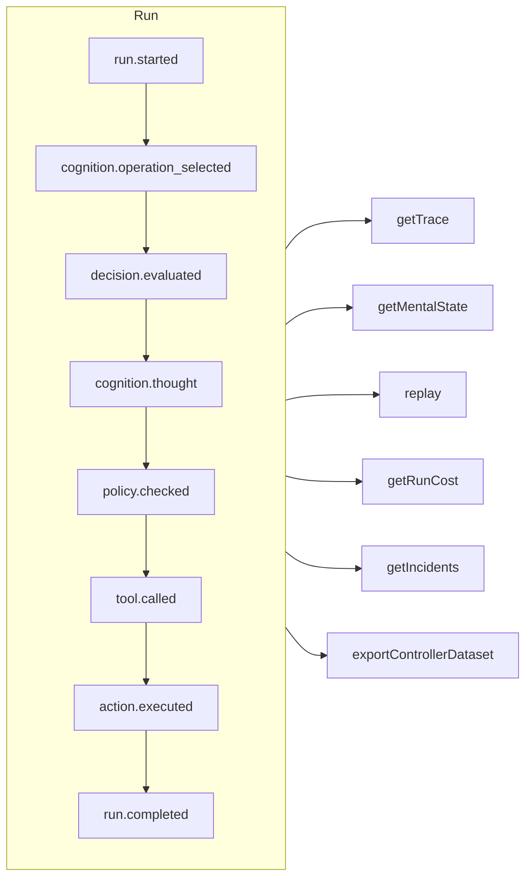

# ट्रेसबिलिटी और रीप्ले

हर run — नियंत्रित, संज्ञानात्मक, सीधा टाइप्ड निर्णय या MCP टूल कॉल — एक **सिर्फ़ जोड़े जा सकने वाला (append-only) इवेंट लॉग** है। रिकॉर्ड के बाहर कुछ नहीं होता, और बाकी सब कुछ इसी से निकाला जाता है।



## स्टोर {#stores}

| स्टोर | इसे किसके लिए इस्तेमाल करें |
| --- | --- |
| `FileEventStore` (डिफ़ॉल्ट) | डेवलपमेंट, एक ही प्रोसेस — हर run की एक JSON फ़ाइल |
| `SQLiteEventStore` | क्वेरी के साथ लोकल रूप से सहेजना |
| `PostgreSQLEventStore` | Production: indexed क्वेरी, एकत्रीकरण, बैकअप और restore |

::: code-group

```ts [File]
import { createSDK, FileEventStore } from '@sdk-ai-agents/core';

const sdk = createSDK({ apiKey, eventStore: new FileEventStore('./events') });
```

```ts [SQLite]
import Database from 'better-sqlite3';
import { createSDK, SQLiteEventStore } from '@sdk-ai-agents/core';

const sdk = createSDK({ apiKey, eventStore: new SQLiteEventStore({ db: new Database('events.db') }) });
```

```ts [PostgreSQL]
import pg from 'pg';
import { createSDK, PostgreSQLEventStore } from '@sdk-ai-agents/core';

const pool = new pg.Pool({ connectionString: process.env.DATABASE_URL });
const sdk = createSDK({ apiKey, eventStore: new PostgreSQLEventStore({ pool }) });
```

:::

स्टोर `IEventStore` लागू करते हैं; किसी भी डेटाबेस के लिए अपना स्टोर लिखें। फ़ाइल स्टोर इवेंट्स को बफ़र करता है और हर 100 ms पर उन्हें लिखता है; बंद करते समय बाकी बचे इवेंट लिखने के लिए `await store.destroy()` कॉल करें। लॉग पढ़ने वाले (मानसिक स्थिति का पुनर्निर्माण, लागत, डेटासेट) एक ही id के साथ दोहराए गए इवेंट्स को अनदेखा करते हैं।

## एक run पढ़ें {#read-a-run}

```ts
const trace = await sdk.getTrace(runId);          // status, timeline, summary
const text = await sdk.exportTrace(runId, 'text'); // human-readable timeline
const events = await sdk.getEvents(runId, { type: ['tool.called', 'policy.violated'] });
const state = await sdk.getMentalState(runId);    // cognitive runs
```

किसी run की स्थिति उसका **आखिरी जीवनचक्र इवेंट** (`run.completed`, `run.failed`, `run.cancelled`) होती है। इसके बाद जोड़े गए इवेंट — फ़ीडबैक, घटना रिपोर्ट — उसे कभी दोबारा नहीं खोलते।

## LLM के बिना रीप्ले {#replay-without-the-llm}

```ts
const replay = await sdk.replay(runId);
```

रीप्ले दर्ज किए गए इरादों को एक्शन इंजन के ज़रिए दोबारा चलाता है — नीतियों सहित — **LLM को कॉल किए बिना**। "अगर ऐसा होता तो?" वाली स्थितियों को परखने के लिए बदलावों के साथ रीप्ले करें, जैसे किसी नीति को बदलने के बाद।

रीप्ले टूल को सचमुच दोबारा चलाता है। `requiresApproval` चिह्नित टूल के लिए, रीप्ले सिर्फ़ उन्हीं कॉल को दोहराता है जिन्हें मूल run में किसी इंसान ने **मंज़ूरी दी** थी — वही टूल, वही पैरामीटर — बिना दोबारा पूछे; जो कॉल ठुकराई गई, रद्द हुई या जिसे कभी मंज़ूरी नहीं मिली, वह चलाई नहीं जाती, ठुकरा दी जाती है। किसी *नीति* द्वारा माँगी गई मंज़ूरियाँ फिर भी लागू होती हैं और निर्णय का इंतज़ार करती हैं।

## निर्णयों को समझें {#understand-decisions}

| Method | आपको क्या मिलता है |
| --- | --- |
| `getReasoningGraph(runId)` / `exportReasoningGraph(runId, 'graphviz')` | इरादा → नीति → कार्रवाई की कड़ी, एक ग्राफ़ के रूप में |
| `getAlternatives(runId)` | वे विकल्प जिन पर एजेंट ने विचार किया |
| `getDecisionPatterns(filters)` | runs में बार-बार आने वाले निर्णय-पैटर्न |
| `getTraceVisualization(runId)` | UI के लिए समूहों में बँटी, समय-रेखा के लिए तैयार संरचना |
| `getPolicyAuditTrail(runId)` | हर नीति-मूल्यांकन और उसका परिणाम |

## एजेंटों को कोड की तरह टेस्ट करें {#test-agents-like-code}

किसी अच्छे run को **गोल्डन ट्रेस** में बदलें, फिर नए runs को उसके सामने सत्यापित करें:

```ts
const golden = await sdk.createGoldenTrace(runId, { name: 'refund flow', description: 'Expected behavior' });
const validation = await sdk.validateAgainstGoldenTrace(newRunId, golden.id);
const regressions = await sdk.detectRegressions(newRunId, golden.id);
```

रिग्रेशन सूट, व्यवहार संबंधी assertions, runs की तुलना और डिप्लॉयमेंट से पहले असर का विश्लेषण भी उपलब्ध हैं — देखें [SDK API](../reference/sdk-api)।
