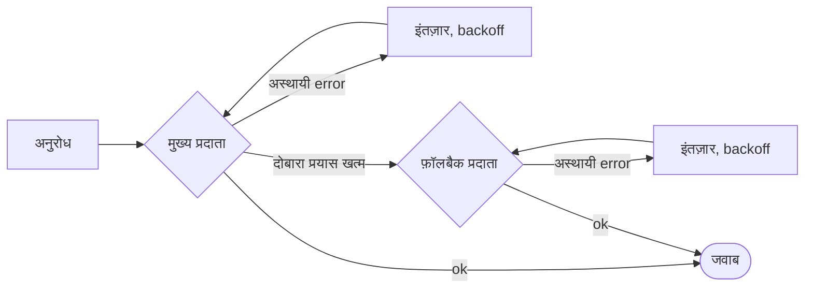

# दोबारा प्रयास और फ़ॉलबैक

नेटवर्क विफल होते हैं, प्रदाताओं पर rate-limit लगती है, टूल का timeout हो जाता है। SDK वह दोबारा आज़माता है जिसे दोबारा आज़माया जा सकता है, जो नहीं आज़माया जा सकता उसके लिए दूसरे प्रदाता पर जाता है (failover), और **हर दोबारा प्रयास run में लिखता है** ताकि कुछ भी छिपा न रहे।



## LLM प्रदाता {#llm-providers}

retry नीति हर प्रदाता पर **अलग-अलग, किसी भी फ़ॉलबैक से पहले** लागू होती है:

```ts
const sdk = createSDK({
  apiKey: process.env.OPENAI_API_KEY,
  fallbackProviders: [{ provider: 'anthropic', config: { apiKey: process.env.ANTHROPIC_API_KEY } }],
  retry: { maxRetries: 3, initialDelayMs: 500, maxDelayMs: 8_000 },
});
```

किसी दूसरे vendor के फ़ॉलबैक प्रदाता को अपनी key चाहिए, उसके `config` में या `providerConfig` में: मुख्य प्रदाता की key कभी किसी दूसरे vendor को नहीं भेजी जाती। उसे एजेंट का मॉडल तभी मिलता है जब वह उसे सर्व करता हो, वरना वह अपना `defaultModel` इस्तेमाल करता है (Anthropic, OpenAI के मॉडल नाम को ठुकरा देता है, और उल्टा भी)। `intention.generated` इवेंट बताता है कि किस प्रदाता ने जवाब दिया और किस मॉडल से।

| विकल्प | डिफ़ॉल्ट | |
| --- | --- | --- |
| `maxRetries` | `2` | पहले प्रयास के बाद के दोबारा प्रयास |
| `initialDelayMs` | `500` | हर दोबारा प्रयास पर दोगुना होता है (`multiplier`) |
| `maxDelayMs` | `8000` | एक backoff इंतज़ार की ऊपरी सीमा |
| `maxRetryAfterMs` | `60000` | माना जाने वाला सबसे लंबा `retry-after` (फ़ॉलबैक होने पर `maxDelayMs`) |
| `jitter` | `true` | हर इंतज़ार को [delay/2, delay] में random बनाता है |
| `retryOn` | `isTransientError` | आपकी अपनी शर्त (predicate) |

सिर्फ़ **अस्थायी** errors पर दोबारा प्रयास होता है: 408, 409, 425, 429, 5xx, 529, कनेक्शन विफलताएँ और timeouts — जिनमें OpenAI और Anthropic की कनेक्शन errors भी शामिल हैं, जिन्हें उनकी class और उनके `cause` के नेटवर्क कोड से पहचाना जाता है। प्रमाणीकरण, सत्यापन और नीति की errors तुरंत विफल होती हैं, और वह 429 भी जिसका मतलब है कि खाते का क्रेडिट या कोटा खत्म हो गया है (`insufficient_quota`, `credit_balance_exhausted`…): इंतज़ार करने से क्रेडिट वापस नहीं आएगा। error संदेश में विक्रेता का स्पष्टीकरण होता है। जब प्रदाता `retry-after-ms` या `retry-after` भेजता है, तो SDK अपने backoff की बजाय उतनी देर इंतज़ार करता है, `maxRetryAfterMs` (डिफ़ॉल्ट रूप से 60 s) तक। जब `fallbackProviders` कॉन्फ़िगर हों, तो यह सीमा घटकर `maxDelayMs` हो जाती है: लंबा विराम माँगने वाले प्रदाता को run रोकने की बजाय फ़ॉलबैक के लिए छोड़ दिया जाता है। इससे लंबा अनुरोध दोबारा प्रयासों को खत्म कर देता है।

जब SDK की नीति सक्रिय होती है, तो OpenAI और Anthropic क्लाइंट के अपने दोबारा प्रयास बंद कर दिए जाते हैं — **दोबारा प्रयास कभी एक-दूसरे पर नहीं चढ़ते**। हर दोबारा प्रयास प्रदाता, मॉडल, प्रयास, देरी और error के साथ एक `provider.retry` इवेंट के रूप में दर्ज होता है। इसकी बजाय विक्रेता के डिफ़ॉल्ट रखने के लिए `retry: false` दें।

`llmProvider` से आपके द्वारा जोड़ा गया प्रदाता वैसे ही इस्तेमाल होता है जैसा दिया गया, जब तक आप स्पष्ट रूप से `retry` सेट न करें, और `FallbackProvider` को कभी लपेटा (wrap) नहीं जाता ताकि उसके failovers ट्रेस में दिखते रहें। उसके प्रदाताओं को भी नहीं लपेटा जाता, इसलिए `retry` उन पर लागू नहीं होता: failover से पहले किसी प्रदाता को दोबारा आज़माने के लिए उसे `RetryingLLMProvider` में लपेटें और उसके क्लाइंट को `maxRetries: 0` दें।

## टूल {#tools}

idempotent टूल को दोबारा प्रयास योग्य चिह्नित करें:

```ts
sdk.defineTool({
  name: 'lookup_metric',
  description: 'Reads a metric',
  schema: z.object({ metric: z.string() }),
  retry: { maxRetries: 2, initialDelayMs: 200 },
  handler: async ({ metric }) => warehouse.read(metric),
});
```

सिर्फ़ टूल की विफलताओं पर दोबारा प्रयास होता है — नीति के इनकार या सत्यापन error पर कभी नहीं। हर दोबारा प्रयास एक `tool.retry` इवेंट है।

## टाइप्ड निर्णय {#typed-decisions}

Jev क्लाइंट 408, 429, 5xx और 529 responses और नेटवर्क errors पर दोबारा प्रयास करता है, **`retry-after` का पालन करते हुए**, डिफ़ॉल्ट के रूप में SDK की retry नीति के साथ (`jev.maxRetries` इसकी जगह ले लेता है)। LLM प्रदाताओं के उलट, यह हर 429 पर दोबारा प्रयास करता है, उसका कारण चाहे जो हो, `maxRetries` तक।

## कहीं और {#anywhere-else}

आपके अपने कोड के लिए `withRetry` एक्सपोर्ट किया गया है:

```ts
import { withRetry, DEFAULT_RETRY_POLICY } from '@sdk-ai-agents/core';

const data = await withRetry(() => fetchPartnerFeed(), DEFAULT_RETRY_POLICY, {
  onRetry: ({ retry, delayMs, error }) => logger.warn({ retry, delayMs, error }),
});
```
