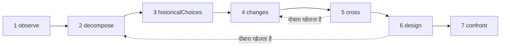

# अध्ययन

एक अध्ययन (study) एक AI शोधकर्ता है। वह एक ही पद्धति अपनाता है — **किसी वस्तु को समझना, फिर आज के साधनों से उसे नए सिरे से डिज़ाइन करना** — और आपको एक डोज़ियर सौंपता है: वस्तु क्या करती है, कैसे काम करती है, उसे वैसा क्यों बनाया गया, तब से क्या बदला है, कई नए डिज़ाइन, और वे प्रयोग जो उनके बीच फ़ैसला करेंगे। वह कुछ नहीं बनाता, कुछ नहीं चलाता और कुछ नहीं मापता: वह जाँच-पड़ताल करता है और प्रस्ताव रखता है।

::: tip आसान भाषा में
एक वस्तु चुनिए: एक वेब ब्राउज़र, एक डेटाबेस इंजन, ट्रेनों की समय-सारणी। अध्ययन उसे देखता है, उसके पुर्ज़े अलग करता है, उसके पुराने चुनावों के पीछे के कारण ढूँढता है, खोजता है कि तब से कौन-से शोध और तकनीकें सामने आई हैं, और दोनों को मिलाकर एक दूसरी व्यवस्था की कल्पना करता है। उसका लक्ष्य सिद्धांत में ऐसा बदलाव है जो कुछ नया संभव बनाए, उसी चीज़ का तेज़ संस्करण नहीं। हर दावा बताता है कि वह ऐसे स्रोत से **स्थापित** है जो अध्ययन को सचमुच मिला, एक **परिकल्पना** है, या एक **नवीनता** है जिसे अभी पहले से मौजूद काम के सामने जाँचना बाकी है। और पूरे समय, कई तंत्र उसे उस उद्देश्य पर टिकाए रखते हैं जो आपने उसे दिया, क्योंकि निर्देश बढ़ने के साथ भाषा मॉडल भटकने लगते हैं। हर शब्द [मुख्य शब्द, आसान भाषा में](./glossary#studies) में समझाया गया है।
:::

```ts
const study = sdk.createStudy({
  name: 'browser',
  object: 'The Web browser, from 1990 to 2026',
  objective: 'A browser design whose every choice follows from the investigation',
  leads: ['vectorisation', 'weights', 'ReLU'], // your leads: examples to verify, not truths
  analogues: ['Bitcoin'],                      // breakthroughs by assembly to deconstruct
  sources: ['web_search', 'arxiv_search'],     // SDK tools the study searches with (webTools())
});

const result = await study.run();
result.status;   // 'completed' | 'stopped' | 'failed' | 'cancelled'
result.report;   // the structured report
result.markdown; // the same, as a readable dossier
```

## अध्ययन क्या है {#what-a-study-is}

अध्ययन सात चरणों में एक पद्धति लागू करता है: *किसी वस्तु को समझना, फिर आज के ज्ञान और तकनीकों से उसे नए सिरे से डिज़ाइन करना*। उसका मार्गदर्शक सवाल है: **अगर हमें आज की ज़रूरतें आज उपलब्ध ज्ञान और तकनीकों से पूरी करनी हों, तो हम इस वस्तु को कैसे व्यवस्थित करेंगे?** जब तक आप अपना `question` न दें, अध्ययन यही सवाल अपनी भाषा में पूछता है, और उसके बाद वह लक्ष्य जो [लक्ष्य: एक नई क्षमता](#the-aim-a-new-capability) में बताया गया है।

अध्ययन कोई एजेंट नहीं है। उसके पास कार्रवाई करने के लिए कोई टूल नहीं है, सिर्फ़ खोजने के लिए **स्रोत** हैं (देखें [अपने स्रोतों के ज़रिए शोध](#research-through-your-sources)), और उसका नतीजा एक रिपोर्ट है, कोई कार्रवाई नहीं। उसे `sdk.createStudy()` से, एक **चार्टर** से बनाया जाता है — वस्तु, उद्देश्य, आपकी ज़रूरतें और आपके सुराग — जो उसके बाद कभी नहीं बदलता।

उसका आख़िरी चरण प्रयोग डिज़ाइन करता है; वह उन्हें चलाता नहीं। कोई प्रयोग चला लेने के बाद, उसमें जो मिला उसे आप उससे जुड़े तंत्र कार्ड पर दर्ज करते हैं (देखें [तंत्र कार्ड](#the-mechanism-card))।

## सात चरण {#the-seven-passages}

एक run पद्धति के सात चरणों से, क्रम से, गुज़रता है। हर चरण कुछ तरह के आइटम बनाता है (उसके **संग्रह**), और हर आइटम को एक id मिलता है जो, नए सिरे से शुरू करने तक, कभी दोबारा इस्तेमाल नहीं होता: `O1`, `P2`, `A1`…

| # | चरण | यह क्या करता है | यह क्या रखता है |
| --- | --- | --- | --- |
| 1 | `observe` | वस्तु के व्यवहार, उपयोग, रूपांतर और विफलताएँ देखता है, हर एक उसकी शर्तों के साथ: कब, कहाँ, किसके लिए, किसके साथ। यह वर्णन करता है; अभी व्याख्या नहीं करता | `observations` (`O`) |
| 2 | `decompose` | पुर्ज़ों का नक्शा बनाता है: उनका काम, इनपुट, आउटपुट और संबंध, किसी पुर्ज़े के भीतर तब तक उतरते हुए जब तक उसके काम करने का तरीका अस्पष्ट रहे, हर एक की अज्ञात बातों के साथ। वस्तु की **पूरी श्रृंखला** को, कड़ी दर कड़ी, परिभाषित करता है (ब्राउज़र के लिए: प्राप्त करना, समझना, चलाना, दिखाना, इंटरैक्ट करना) | `pieces` (`P`), `chain` (`C`) |
| 3 | `historicalChoices` | अपने समय के चुनावों के दस्तावेज़ों में दर्ज कारण खोजता है: हार्डवेयर, टूल, उपयोग, ज्ञान, लागत, संगतता। बिना दस्तावेज़ वाला संभावित कारण परिकल्पना ही रहता है | `historicalChoices` (`H`) |
| 4 | `changes` | खोजता है कि तब से क्या सामने आया या इस्तेमाल करने लायक हुआ, वस्तु के क्षेत्र में और दूसरे क्षेत्रों में, हर प्रगति उसके तंत्र, तारीख़, साक्ष्य, उपयोग की शर्तों और उपलब्धता के साथ। आपके हर सुराग पर फ़ैसला देता है, उनसे आगे दूसरे गणितीय और तकनीकी साधन ढूँढता है, आज के सबसे अच्छे कार्यान्वयनों की सूची बनाता है ("बेहतर" का पैमाना) और संयोजन से बनी सफलताओं को विखंडित करता है | `advances` (`V`), `leadVerdicts` (`L`), `independentLeads` (`I`), `references` (`R`), `analogues` (`B`) |
| 5 | `cross` | अतीत और वर्तमान को आपस में मिलाता है: कौन-सी बाध्यताएँ बनी हुई हैं, कौन-सी कमज़ोर पड़ी हैं, कौन-सी आवश्यकताएँ नई हैं। उन निर्णयों को निकालता है जो अब बदले जा सकते हैं, A + B मेल प्रस्तावित करता है (A, B को क्या करने देता है, दोनों को आपस में क्या लेन-देन करना होगा, रूपांतरणों और तालमेल में उसकी क्या कीमत है) और संभावित नई क्षमताओं के नाम देता है | `constraints` (`K`), `revisableDecisions` (`D`), `combinations` (`X`), `capabilities` (`Y`) |
| 6 | `design` | कम से कम दो आर्किटेक्चर डिज़ाइन करता है, जिनमें से कम से कम एक का लक्ष्य नई क्षमता हो, हर एक पूरी श्रृंखला को कवर करे, अपने तंत्र, शर्तों, फ़ायदे, अतिरिक्त लागत, एक संभावित प्रति-उदाहरण और अपने पूर्वानुमानों के साथ। हर मुख्य पुर्ज़े की तीन अवस्थाएँ देता है और बताता है कि क्या नया है और क्या नहीं। फिर नवीनताओं के और हर क्षमता के संयोजन के पूर्व कार्य को खोजता है | `architectures` (`A`), `threeStates` (`T`), `noveltyClaims` (`N`) |
| 7 | `confront` | वे प्रयोग डिज़ाइन करता है जो आर्किटेक्चरों के बीच फ़ैसला करेंगे और पूरी श्रृंखला को परखेंगे: प्रोटोकॉल, माप, मानदंड और हर आर्किटेक्चर के लिए अपेक्षित परिणाम। हर मुख्य तंत्र के लिए एक तंत्र कार्ड भरता है | `experiments` (`E`), `cards` (`M`) |

खोजें जो परिणाम लौटाती हैं, उन्हें भी क्रमांक मिलता है: `S1`, `S2`… हर चरण को पहले के चरणों के वे आइटम मिलते हैं जिनकी उसे ज़रूरत है, संक्षिप्त JSON रिकॉर्ड के रूप में: सिर्फ़ वे आइटम जिन्हें संरक्षक परख चुका है (देखें [संरक्षक](#the-guardian))।

### एक चक्र, सीधी रेखा नहीं {#a-loop-not-a-line}



चरण एक चक्र बनाते हैं। जब कोई अज्ञात बात किसी चरण को रोक दे — मान लीजिए, डिज़ाइन को यह जानना हो कि कोई पुर्ज़ा असल में कैसे काम करता है — तो वह उस बिंदु पर किसी पहले के चरण को **दोबारा खोलने** को कह सकता है। पहले वाला चरण उसी बिंदु पर ध्यान देकर फिर चलता है और अपने पुराने आइटमों में सिर्फ़ वही जोड़ता है जिसकी उस अज्ञात बात को ज़रूरत है: उसे कोई न्यूनतम संख्या पूरी नहीं करनी होती, और न सुरागों पर फ़ैसले या सफलताएँ फिर से देनी होती हैं। फिर जिस चरण ने कहा था वह उनके साथ फिर चलता है; जब तक वह ऐसा न कर ले, वह पूरा नहीं है (उसकी स्थिति `partial` है), और डिज़ाइन की पूर्व कार्य की खोज उसके अंतिम संस्करण का इंतज़ार करती है। `limits.maxLoops` एक run में दोबारा खोलने की संख्या सीमित करता है (डिफ़ॉल्ट रूप से 1, किसी को भी अनुमति न देने के लिए 0); जो चरण खुद दोबारा खोला गया हो, वह किसी दूसरे को दोबारा नहीं खोल सकता।

### हर पुर्ज़े की तीन अवस्थाएँ {#three-states-of-each-piece}

डिज़ाइन हर मुख्य पुर्ज़े को तीन अवस्थाएँ देता है, जो रिपोर्ट में अलग-अलग रखी जाती हैं (`threeStates`):

- **अपने समय में वस्तु** (`atItsTime`): पुर्ज़ा कैसे बनाया गया था, और किन शर्तों में;
- **आज के सबसे अच्छे प्रासंगिक कार्यान्वयन** (`currentBest`): वह पैमाना जिससे किसी बेहतरी को मापा जाता है;
- **हमारा प्रस्ताव** (`proposal`): आर्किटेक्चर उसके साथ क्या करता है।

किसी चुनाव का पुराना होना उसे गलत नहीं बनाता, और कोई नई तकनीक अतीत की किसी जटिलता को अनावश्यक बना सकती है: तीन अवस्थाएँ दिखाती हैं कि कौन-सी शर्त बदली, कौन-सा तंत्र संभव हुआ, और उससे पूरी व्यवस्था पर क्या असर पड़ता है।

### तंत्र कार्ड {#the-mechanism-card}

आख़िरी चरण हर मुख्य तंत्र के लिए एक कार्ड भरता है। उसमें ग्यारह फ़ील्ड होते हैं: अध्ययन पहले नौ भरता है, और आख़िरी दो तब तक खाली रहते हैं जब तक आप कोई प्रयोग न चला लें।

| # | फ़ील्ड | वह सवाल जिसका यह जवाब देता है |
| --- | --- | --- |
| 1 | `observation` | सिस्टम क्या करता है, किन शर्तों में? |
| 2 | `mechanism` | कौन-से पुर्ज़े और संबंध इसकी व्याख्या करते हैं? |
| 3 | `unknown` | क्या खोलना, मापना या दस्तावेज़ों से पुष्ट करना बाकी है? |
| 4 | `historicalChoice` | यह व्यवस्था क्यों चुनी गई, किस साक्ष्य के आधार पर? |
| 5 | `evolution` | तब से क्या बदला है, किन स्रोतों और तारीख़ों के साथ? |
| 6 | `newPossibility` | उस बदलाव की वजह से कौन-सा चुनाव अब बदला जा सकता है? |
| 7 | `proposedCombination` | तकनीकें ठोस रूप से आपस में कैसे जुड़ती हैं? |
| 8 | `prediction` | हम किस असर की उम्मीद करते हैं, किन शर्तों में? |
| 9 | `experiment` | हम प्रस्तावों के बीच फ़ैसला कैसे करें और पूरी व्यवस्था को कैसे जाँचें? |
| 10 | `resultAndError` | हमें क्या मिला, और व्याख्या कहाँ विफल होती है? |
| 11 | `conclusionAndMemory` | हम क्या रखते हैं, क्या बदलते हैं, यह तंत्र और कहाँ दोबारा इस्तेमाल हो सकता है? |

```ts
await study.recordResult('M1', {
  result: 'Layout reuse cut the time to redraw by 40% on the reference pages',
  error: 'No gain on pages whose styles change on every frame',
  conclusion: 'Keep immutable layout results; look again at style invalidation',
});
```

`recordResult(cardId, { result, error?, conclusion? })` कार्ड के फ़ील्ड 10 और 11 भरता है और उस run में एक `study.result_recorded` इवेंट दर्ज करता है जिसने कार्ड लिखा था। किसी अज्ञात कार्ड या खाली `result` पर यह `ValidationError` फेंकता है। `study.report()` भरे हुए कार्ड के साथ रिपोर्ट लौटाता है।

## लक्ष्य: एक नई क्षमता {#the-aim-a-new-capability}

अध्ययन उसी वस्तु का तेज़ संस्करण नहीं ढूँढता। वह **सिद्धांत में ऐसा बदलाव ढूँढता है जो आज कठिन किसी चीज़ को संभव बनाए, सिर्फ़ किसी चीज़ को तेज़ नहीं**।

### क्षमता, सिद्धांत, तंत्र {#capability-principle-mechanism}

हर आर्किटेक्चर तीन बातें बताता है:

- **क्षमता** (`capability`): क्या संभव होता है, किसके लिए, और आज की वह बाध्यता जिसे यह हटाता है (`what`, `forWhom`, `liftedConstraint`);
- **सिद्धांत में बदलाव** (`principleChange`): कौन-सा सिद्धांत बदलता है — `representation`, `distribution` (काम का), `responsibility`, `trust`, `verification` या `other` — और कैसे;
- **तंत्र** (`mechanism`): तकनीकों का संयोजन क्षमता को कैसे पैदा करता है।

हर आर्किटेक्चर अपना `kind` घोषित करता है: `capability`, या `improvement` जब वह सिर्फ़ किसी चीज़ को तेज़ या सस्ता बनाता है। जो आर्किटेक्चर कोई प्रकार घोषित नहीं करता, वह बेहतरी है, यानी कमज़ोर दावा। क्षमता को अपना सिद्धांत में बदलाव और अपना संयोजन बताना होगा, वरना स्कीमा उसे ठुकरा देता है (देखें [हर आइटम बताता है कि वह किस काम आता है](#every-item-says-what-it-serves))।

आप चार्टर में वह क्षमता बता सकते हैं जिसका आप लक्ष्य रखते हैं (`capability`); तब हर prompt उसे साथ रखता है। उसके बिना, `cross` चरण को कम से कम एक संभावित क्षमता (`capabilities`, `Y1`…) प्रस्तावित करनी होगी, साथ में यह कि वह किसके लिए है, आज वह कठिन क्यों है और कौन-सा सिद्धांत बदलेगा।

संरक्षक (देखें [संरक्षक](#the-guardian)) हर आर्किटेक्चर का तंत्र, घटक और संयोजन देखता है, और दो बातें अलग-अलग परखता है: क्या वह उद्देश्य के काम आता है, और क्या वह कोई नई क्षमता खोलता है। जिस क्षमता को वह सिर्फ़ तेज़ या सस्ता पाता है, वह `improvement` बन जाती है: `declaredKind: 'capability'` के साथ, ताकि दिखे कि मॉडल ने क्या दावा किया था, `kindReason` के साथ, जो बताता है कि क्यों, और एक `study.capability_demoted` इवेंट के साथ। जो बेहतरी उद्देश्य के काम आती है, वह बनी रहती है: उसे क्षमताओं के बाद रखा जाता है, बेहतरी होने की वजह से कभी हटाया नहीं जाता। जिस डिज़ाइन में कोई क्षमता बची ही न हो, वह पूरा का पूरा उद्देश्य से भटका हुआ है: उसे भटकाव लॉग में दर्ज किया जाता है और एक बार दोबारा किया जाता है; अगर दोबारा करने पर भी कोई क्षमता न हो, तो रिपोर्ट यह बताती है (सूचना `noCapability`), और अगर संरक्षक ने कोई भी आर्किटेक्चर नहीं रखा, तो यह भी बताती है (सूचना `noDesign`)। जिस क्षमता के संयोजन को पूर्व कार्य की खोज पहले से साकार पाती है, वह क्षमता ही रहती है, पर अब नई नहीं रहती: देखें [पूर्व कार्य](#prior-art)। रिपोर्ट में **पहले नई क्षमताएँ आती हैं, फिर वे क्षमताएँ जिनका संयोजन पहले से मौजूद है, फिर बेहतरियाँ**।

### नवीनता संयोजन में है {#novelty-lies-in-the-assembly}

बड़ी सफलताएँ (breakthroughs) शायद ही कभी ऐसी किसी तकनीक से आती हैं जिसकी कोई मिसाल न हो। अक्सर वे पहले की तकनीकों को ऐसे जोड़ती हैं जैसे पहले किसी ने नहीं जोड़ा था, और वही संयोजन एक नई क्षमता का रास्ता खोलता है। अध्ययन भी इसी तरह तर्क करता है:

- एक आर्किटेक्चर अपने **घटकों** (`components`) की सूची देता है: पहले की तकनीकें, हर एक अपने कथन, तारीख़ और स्रोतों के साथ, और हर एक की स्थिति किसी भी दावे की तरह जाँची जाती है;
- उसका **संयोजन** (`assembly`) बताता है कि हर घटक दूसरों को क्या देता है, वे आपस में क्या लेन-देन करते हैं और उसकी क्या कीमत है;
- कोई घटक **कभी नवीनता नहीं होता**: जिसे नया बताया गया हो, वह `established` है अगर उसके prompt में सूचीबद्ध कोई परिणाम उसे दस्तावेज़ों से पुष्ट करता है, वरना `hypothesis`, कारण के साथ;
- हर घटक, और संयोजन की हर कड़ी, बताती है कि वह जाँच-पड़ताल के किन रिकॉर्ड से आई है (`from`): प्रगतियाँ (`V`), स्वतंत्र सुराग (`I`), आज के पैमाने (`R`), सफलताएँ (`B`), बदले जा सकने वाले निर्णय (`D`), मेल (`X`) और संभावित क्षमताएँ (`Y`), उनमें से जिन्हें डिज़ाइन के prompt ने सूचीबद्ध किया। कोड इसकी जाँच करता है: जिन ids को prompt ने सूचीबद्ध नहीं किया, वे `unknownFrom` में जाते हैं, और जो हिस्सा सूचीबद्ध रिकॉर्ड में से किसी का हवाला नहीं देता, उसे `untraced` (बिना मूल) चिह्नित किया जाता है — वह जाँच-पड़ताल से नहीं निकलता — सूचना `untracedAssembly` के साथ;
- आर्किटेक्चर की अपनी स्थिति उसके संयोजन और उसकी क्षमता की स्थिति है। **हर क्षमता** के संयोजन के पूर्व कार्य को, मॉडल ने उसे चाहे जो स्थिति दी हो, **एक मेल के रूप में** खोजा जाता है: अध्ययन ऐसे काम को ढूँढता है जो उन्हीं घटकों को जोड़कर वही क्षमता पैदा करता हो, हर टुकड़े को अलग-अलग नहीं।

डोज़ियर हर आर्किटेक्चर का रास्ता दिखाता है: घटक (उनकी स्थितियों के साथ, और यह कि वे कहाँ से आए हैं) → संयोजन (उसकी स्थिति के साथ) → क्षमता।

### संयोजन से बनी सफलताएँ {#breakthroughs-by-assembly}

`changes` चरण किसी भी क्षेत्र की उन पिछली बड़ी सफलताओं को भी विखंडित करता है, यानी उनके हिस्से अलग करके देखता है, जो पहले की तकनीकों को जोड़ने से आईं (`analogues`, `B1`…)। Bitcoin वह उदाहरण है जो पद्धति देती है: public-key हस्ताक्षर, hash chains और timestamping, proof of work, Merkle trees और एक peer-to-peer नेटवर्क, सब पहले से मौजूद थे; जोड़े जाने पर उन्होंने किसी भरोसेमंद तीसरे पक्ष के बिना एक साझा बहीखाता दिया।

हर सफलता के लिए, अध्ययन दर्ज करता है: पहले की वे तकनीकें जिन्हें उसने जोड़ा (कम से कम दो, उनकी तारीख़ों के साथ), वह बाध्यता जो उसने हटाई, वह क्षमता जो खुली, और संयोजन का **पैटर्न**। `cross` और `design` चरणों को ये पैटर्न मिलते हैं और वे इन्हें दोबारा इस्तेमाल कर सकते हैं। हर सफलता बाकी दावों जैसा ही एक दावा है: `established` सिर्फ़ तब, जब अध्ययन द्वारा प्राप्त कोई परिणाम उसका आधार हो।

`analogues` में आप जिन सफलताओं के नाम देते हैं, उनमें से हर एक को विखंडित करना ज़रूरी है। चार्टर उन्हें क्रमांक देता है, और मॉडल जिस सफलता को विखंडित करता है उसे उसके क्रमांक से बताता है (`named`), ताकि मॉडल चाहे जिस भाषा में लिखे, मिलान बना रहे। जो जवाब किसी को भूल जाए, उसे एक बार वापस भेजा जाता है; अगर फिर भी कोई छूट जाए, तो रिपोर्ट उसे `undeconstructedAnalogues` में सूचीबद्ध करती है, सूचना `analoguesNotDeconstructed` के साथ। अध्ययन अपनी खोजी हुई दूसरी सफलताएँ भी जोड़ सकता है।

## स्थापित, परिकल्पना, नवीनता {#established-hypothesis-novelty}

अध्ययन का हर आइटम एक **दावा** है: स्थिति वाला एक कथन, वे परिणाम जिनका वह हवाला देता है (`sources`), और यह कि वह उद्देश्य में किस काम आता है। मॉडल एक स्थिति प्रस्तावित करता है; **कोड उसे जाँचता है**, मॉडल चाहे जो कहे।

| स्थिति | इसके लिए क्या ज़रूरी है | वरना अध्ययन क्या करता है |
| --- | --- | --- |
| `established` | यह कम से कम एक ऐसे परिणाम का हवाला देता है जो **इसे लिखने वाले prompt में सूचीबद्ध** था | यह `hypothesis` बन जाता है। `declaredStatus` मॉडल की दी हुई स्थिति रखता है और `statusReason` बताता है कि क्यों; जिन ids का इसने हवाला दिया पर जिन्हें इसके prompt ने सूचीबद्ध नहीं किया, वे `unlistedSources` में अलग रखे जाते हैं और किसी बात का समर्थन नहीं करते |
| `hypothesis` | कुछ नहीं: संभावित, यहाँ दस्तावेज़ों से पुष्ट नहीं | — |
| `novelty` | एक ऐसा विचार जो अभी मौजूद नहीं है, और उसके **पूर्व कार्य की खोज** | यह ऐसी नवीनता बनी रहती है जिसकी जाँच बाकी है (`toVerify: true`), कारण के साथ, जब तक उसके पूर्व कार्य को खोजा और आँका न जाए |

किसी दूसरे चरण के लिए अध्ययन द्वारा प्राप्त परिणाम काफ़ी नहीं है: मॉडल ने उसे उसी prompt में देखा होना चाहिए जिसने दावा लिखा। यही नियम किसी आर्किटेक्चर के घटकों पर भी लागू होता है। जिस स्थिति को अध्ययन पढ़ न सके, वह `hypothesis` गिनी जाती है, कभी उससे मज़बूत नहीं। **स्रोतों के बिना कुछ भी स्थापित नहीं हो सकता**: हर दावा ज़्यादा से ज़्यादा एक परिकल्पना है, किसी नवीनता की जाँच नहीं हो सकती, और रिपोर्ट अपनी पहली सूचना (`noSources`) में यही बताती है।

अध्ययन जो भी कारण देता है — किसी स्थिति को क्यों घटाया गया, कोई आइटम क्यों हटाया गया, कोई संशोधन क्यों ठुकराया गया — वह एक `StudyReason` है: एक `code` (जैसे `citesUnlisted` या `priorArtNoResult`), उसके `params`, और वही कारण अंग्रेज़ी में (`message`)। डोज़ियर उसे अध्ययन की भाषा में लिखता है; संरक्षक या मॉडल द्वारा लिखे गए कारण का कोड `judged` होता है, और उसका टेक्स्ट `params.text` में।

### पूर्व कार्य {#prior-art}

डिज़ाइन के अंतिम संस्करण के बाद, अध्ययन हर उस नवीनता के पूर्व कार्य (prior art, यानी पहले से मौजूद मिलता-जुलता काम) को खोजता है जिसकी जाँच अभी बाकी है, चाहे वह डिज़ाइन की हो या पहले के चरणों की, और नई क्षमता का लक्ष्य रखने वाले हर आर्किटेक्चर के संयोजन के पूर्व कार्य को भी, उसकी स्थिति चाहे जो हो। मॉडल हर दावे के लिए खोजें चुनता है (किसी आर्किटेक्चर के लिए: उसके घटकों का मेल और क्षमता), अध्ययन उन्हें चलाता है, फिर एक अलग कॉल सबसे नज़दीकी मौजूदा काम का नाम लेती है और फ़ैसला देती है। **किसी दावे का पूर्व कार्य सिर्फ़ उसकी अपनी खोजों के परिणामों पर टिका होता है**, और उनमें से कम से कम एक पर:

- `novel` या `partlyNovel`: नवीनता, नवीनता बनी रहती है, अब उसकी जाँच बाकी नहीं, अपने `priorArt` (`closest`, `sources`, `verdict`) के साथ;
- `exists`: यह विचार पहले ही साकार हो चुका है; नवीनता `hypothesis` बन जाती है, और `statusReason` सबसे नज़दीकी काम का नाम देता है।

जो क्षमता नवीनता नहीं है, उसका पूर्व कार्य भी दर्ज होता है, और उसकी स्थिति नहीं बदलती: अध्ययन स्थितियाँ घटाता है, कभी बढ़ाता नहीं। जब उसका संयोजन पहले से मौजूद हो, तो वह `kind: 'capability'` बनाए रखती है, उसका `priorArtReason` यह बताता है (`assemblyExists`, सबसे नज़दीकी काम के साथ), और उसे बाकी क्षमताओं के बाद, बेहतरियों से पहले रखा जाता है (सूचना `capabilitiesExist`)।

जिस दावे के पूर्व कार्य को खोजा या आँका न जा सका, उसकी जाँच बाकी ही रहती है (`toVerify`), कारण के साथ: नवीनता के लिए उसके `statusReason` में, किसी दूसरी स्थिति वाली क्षमता के लिए उसके `priorArtReason` में। कारण ये हैं: उसकी खोज अभी चली नहीं है (`priorArtNotSearchedYet`), कोई स्रोत नहीं (`priorArtNoSource`), उसके लिए कोई खोज माँगी नहीं गई (`priorArtNotSearched`), उसकी खोजें विफल हुईं (`priorArtSearchFailed`) या उन्हें कुछ नहीं मिला (`priorArtNoResult`), खोज का बजट खत्म हो गया (`priorArtSearchBudget`), उसके परिणाम आँके नहीं गए (`priorArtNotAssessed`), या जाँच ने उसके अपने परिणामों में से किसी का हवाला नहीं दिया (`priorArtUnsupported`)। डिज़ाइन के बाद दावा की गई नवीनता की जाँच भी बाकी रहती है। रिपोर्ट उन्हें गिनती है (सूचनाएँ `noveltiesToVerify` और `capabilitiesToVerify`)।

## अपने स्रोतों के ज़रिए शोध {#research-through-your-sources}

अध्ययन **आपके दिए गए टूल** से खोजता है, जिन्हें आप `sources` के रूप में देते हैं: SDK टूल के नाम। SDK के [वेब टूल](./web-research) बिना किसी सेटअप के काम करते हैं — `web_search` (जब तक आप कोई दूसरा प्रदाता कॉन्फ़िगर न करें, DuckDuckGo), `arxiv_search`, `wikipedia_search` और `github_search` — और उनके परिणाम एक URL के साथ आते हैं, और तारीख़ पता हो तो उसके साथ भी:

```ts
import { webTools } from '@sdk-ai-agents/core';

// Define the tools first: the study checks its sources when it is created.
const sources = webTools({ include: ['web_search', 'arxiv_search', 'wikipedia_search'] }).map(
  (tool) => sdk.defineTool(tool).name
);

const study = sdk.createStudy({ name: 'browser', object, objective, sources });
```

कोई भी दूसरा खोज टूल भी काम करता है, उदाहरण के लिए किसी MCP सर्वर के खोज टूल, जिन्हें [`connectMcpServer`](./mcp#use-the-tools-of-an-mcp-server-in-your-agents) से इम्पोर्ट किया गया और `sdk.defineTool` से परिभाषित किया गया हो:

```ts
import { connectMcpServer } from '@sdk-ai-agents/core/mcp';

const search = await connectMcpServer({
  name: 'search',
  transport: {
    type: 'stdio',
    command: 'npx',
    args: ['-y', '@modelcontextprotocol/server-brave-search'],
    env: { BRAVE_API_KEY: process.env.BRAVE_API_KEY ?? '' },
  },
  metadata: { readOnly: true },
});
// Define the tools first: the study checks its sources when it is created.
const sources = search.tools.map((tool) => sdk.defineTool(tool).name);

const study = sdk.createStudy({ name: 'browser', object, objective, sources });
```

- **अध्ययन बनाते समय जाँच।** जब कोई स्रोत परिभाषित टूल न हो, या कोई टेक्स्ट क्वेरी न लेता हो, तो `createStudy` एक `ValidationError` फेंकता है। क्वेरी टूल के `query` पैरामीटर में जाती है, या किसी दूसरे आम नाम (`q`, `search`, `keywords`…) में, वरना उसके इकलौते ज़रूरी टेक्स्ट पैरामीटर में, वरना उसके पहले टेक्स्ट पैरामीटर में।
- **नियंत्रित।** हर खोज `sdk.executeTool` से होकर चलती है, अध्ययन के `id` को एजेंट id बनाकर और स्रोतों को ही इकलौते अनुमत टूल बनाकर: अनुमति-सूचियाँ, नीतियाँ, बजट, मंज़ूरियाँ, दोबारा प्रयास और ट्रेस किसी भी टूल कॉल की तरह लागू होते हैं, और टूल इवेंट (`action.executing`, `policy.checked`, `tool.called`, `action.executed`) अध्ययन के run में दर्ज होते हैं। जो खोज विफल हो, या जिसे कोई नीति ठुकरा दे, वह अपनी error के साथ दर्ज होती है, और अध्ययन आगे बढ़ता है।
- **यह कब खोजता है।** `historicalChoices` से पहले और `changes` से पहले, मॉडल वे खोजें माँगता है जिनकी चरण को ज़रूरत है — `changes` के लिए: आपके हर सुराग को जाँचना, उनसे आगे दूसरे साधन ढूँढना, आज के सबसे अच्छे कार्यान्वयन ढूँढना और संयोजन से बनी सफलताओं के दस्तावेज़ जुटाना। `design` के बाद, यह नवीनताओं के पूर्व कार्य को खोजता है। एक बार में ज़्यादा से ज़्यादा छह खोजें माँगी जाती हैं।
- **क्रमांकित परिणाम।** अध्ययन परिणामों को पढ़ता है, उनका आकार चाहे जो हो (एक सूची, ऐसी सूची रखने वाला object जैसे `results` या `items`, JSON टेक्स्ट, MCP के text parts, `Title:`, `Description:` और `URL:` लाइनों के blocks के रूप में लिखा टेक्स्ट — हर block में एक परिणाम, जैसे MCP खोज सर्वर अक्सर जवाब देते हैं, और block के नीचे का गद्य उसके अंश में जाता है — या सादा टेक्स्ट)। "No results found" जैसा जवाब कोई परिणाम नहीं है। यह एक शीर्षक, एक URL या कोई दूसरा पता, दी गई हो तो तारीख़, और एक अंश रखता है, हर एक एक ही लाइन में, और उन्हें पूरे अध्ययन के लिए, नए सिरे से शुरू करने तक, एक ही बार क्रमांक देता है: वही परिणाम दोबारा मिलने पर, उसके पते से पहचाना जाकर, अपना id बनाए रखता है। यह हर खोज के `limits.maxResultsPerSearch` परिणाम रखता है (डिफ़ॉल्ट रूप से 5)।
- **डेटा के रूप में दिखाए गए।** अध्ययन के बाहर से आने वाला हर टेक्स्ट — खोज के परिणाम, स्रोतों के विवरण, वे ठुकराए गए आइटम जिनके बारे में चरण को दोबारा करते समय बताया जाता है — मॉडल तक एक लेबल वाले JSON block के रूप में पहुँचता है, `<<<UNTRUSTED-DATA-<id>` वाली एक लाइन और `UNTRUSTED-DATA-<id>>>` वाली एक लाइन के बीच। id हर prompt के लिए यादृच्छिक (random) रूप से चुना जाता है, ताकि कोई टेक्स्ट अपने block को अपने ही लिखे किसी चिह्न से बंद न कर सके, और मॉडल को बताया जाता है कि चिह्नों के बीच जो है वह डेटा है, पालन करने के निर्देश कभी नहीं। इस कदम के लिए मिले परिणाम अपने अंश के साथ आते हैं; पहले के रिकॉर्ड जिन परिणामों का हवाला देते हैं, वे अपने id, शीर्षक और पते के साथ आते हैं। सिर्फ़ वहाँ सूचीबद्ध ids ही उस prompt से लिखे गए किसी दावे का समर्थन कर सकते हैं।
- **सीमित।** `limits.maxSearches` (डिफ़ॉल्ट रूप से हर run में 20) खोजों की सीमा तय करता है। इसके खत्म होने पर run **रुकता नहीं**: वह बिना खोजे आगे बढ़ता है, जिन दावों को स्रोत चाहिए था वे परिकल्पनाएँ रहते हैं, नवीनताओं की जाँच बाकी रहती है, और रिपोर्ट बताती है कि किन चरणों में खोज नहीं हो सकी (सूचना `searchesSkipped`)।

आपके सुराग जाँचे जाने वाले उदाहरण हैं, सच नहीं: `changes` को हर एक पर फ़ैसला देना होगा — `relevant`, `partlyRelevant` या `notRelevant`, कारणों के साथ — और जो जवाब किसी को भूल जाए, उसे एक बार वापस भेजा जाता है। चार्टर सुरागों को क्रमांक देता है, और मॉडल हर सुराग को उसके क्रमांक से बताता है, चाहे वह किसी भी भाषा में लिखे; रिपोर्ट सुराग को वैसे ही लिखती है जैसे चार्टर लिखता है। एक सुराग को एक ही फ़ैसला मिलता है: उस पर दोबारा दिया गया फ़ैसला छोड़ दिया जाता है (`leadAlreadyJudged`), और `study.passage_completed` में दोहराव के रूप में सूचीबद्ध होता है; यह भटकाव नहीं है। `changes` चल चुकने के बाद भी जिस सुराग पर फ़ैसला न हो, वह `unverifiedLeads` में सूचीबद्ध होता है (सूचना `leadsNotVerified`)। अध्ययन खुद जो साधन ढूँढता है, वे `independentLeads` हैं।

## उद्देश्य पर टिके रहना {#staying-on-the-objective}

भाषा मॉडल भटकते हैं। हर बार जब कोई निर्देश जोड़ा जाता है, विषय थोड़ा और दूर चला जाता है और मॉडल भूल जाता है कि उसे क्या करना था, यहाँ तक कि उसे हर बार याद दिलाना पड़ता है। अध्ययन भटकाव को **अपनी बनावट से ही कठिन** बनाता है, और जब वह फिर भी हो जाए तो उसे **दिखने योग्य** बनाता है।

### फ़्रीज़ किया गया चार्टर {#a-frozen-charter}

चार्टर में वस्तु, मार्गदर्शक सवाल, उद्देश्य, ज़रूरतें, आपके सुराग, जो दायरे से बाहर है (`scope.exclude`), लक्षित क्षमता और विखंडित की जाने वाली सफलताएँ होती हैं। अध्ययन बनते ही इसे फ़्रीज़ कर दिया जाता है — `study.charter` बदला नहीं जा सकता, गलती से भी नहीं — और SHA-256 से इसका hash बनाया जाता है (`study.charterHash`)। यह hash हर run के शुरू होने पर (`study.started`) और हर संशोधन में दर्ज होता है, ताकि आप साबित कर सकें कि हर run ने उसी चार्टर पर काम किया। अध्ययन का `name` इसका हिस्सा नहीं है: एक ही चार्टर वाले दो अध्ययनों का hash एक ही होता है। **नया उद्देश्य, यानी नया अध्ययन।**

### हर कॉल पर नए सिरे से बना prompt {#a-prompt-rebuilt-at-each-call}

अध्ययन कभी बातचीत नहीं चलाता। हर मॉडल कॉल सिर्फ़ इन्हीं से बनाई जाती है:

- चार्टर, और उसके नीचे स्वीकार किए गए संशोधन;
- चरण का काम;
- पहले के चरणों के वे संक्षिप्त रिकॉर्ड जिनकी उसे ज़रूरत है (JSON, बातचीत का लिखित ब्योरा नहीं), और सिर्फ़ वे आइटम जिन्हें संरक्षक परख चुका है;
- खोज के वे परिणाम जिनका वह हवाला दे सकता है, डेटा के रूप में चिह्नित।

कोई भी पिछला जवाब किसी prompt तक नहीं पहुँचता। ऐसे जवाब का सुधार भी, जिसका इस्तेमाल नहीं हो सका, चार्टर से ही नए सिरे से बनता है: वह बताता है कि जवाब क्यों ठुकराया गया, कभी यह नहीं कि जवाब क्या था। एक कॉल से दूसरी कॉल तक कुछ भी जमा नहीं होता, इसलिए कुछ भी उद्देश्य को धुँधला नहीं करता।

### दोनों सिरों पर उद्देश्य {#the-objective-at-both-ends}

हर prompt चार्टर से शुरू होता है, और एक याद-दिलाने वाले हिस्से पर खत्म होता है जिसकी आख़िरी लाइन उद्देश्य है:

```text
STUDY CHARTER (immutable, sha256 3f5a9c0e1b2d4f67)
Object: The Web browser, from 1990 to 2026
Question: If we had to meet today’s needs with the knowledge and techniques available today, how would we organise this object? Which change of principle would make possible something difficult today, not only faster?
Objective: A browser design whose every choice follows from the investigation
The user’s leads (examples to verify, not truths):
1. vectorisation
2. weights
3. ReLU
New capability aimed at: none named; propose candidates: what a change of principle would make possible that is difficult today, not only faster.
Breakthroughs by assembly to deconstruct as analogues:
1. Bitcoin
Accepted amendments (subordinate to the objective):
1. Examine memory safety too

(the role — researcher or guardian — then the task, the records of earlier passages, the results it may cite)

REMINDER
This step must produce: at least two architectures, at least one aiming at a new capability, …
Out of scope: anything that does not serve the objective (the needs are priorities, not the only topics).
The aim is a new capability, not only a speed-up: none named; propose candidates: what a change of principle would make possible that is difficult today, not only faster.
Write every text value in English (en). Reply with the JSON object only.
Objective: A browser design whose every choice follows from the investigation
```

चार्टर, उद्देश्य समेत, वह पहली चीज़ है जिसे मॉडल पढ़ता है, और उद्देश्य आख़िरी। उससे ठीक पहले, हर याद-दिलाने वाला हिस्सा लक्ष्य को दोहराता है: चार्टर में बताई गई क्षमता, या, जब चार्टर कोई क्षमता न बताए, संभावित क्षमताएँ प्रस्तावित करने की माँग।

### हर आइटम बताता है कि वह किस काम आता है {#every-item-says-what-it-serves}

हर आइटम में `servesObjective` होना चाहिए: एक वाक्य में, वह उद्देश्य के किस हिस्से या किस ज़रूरत के काम आता है। इसके बिना कोई आइटम संरक्षक के देखने से पहले ही **स्कीमा द्वारा ठुकरा दिया जाता है**, और भटकाव लॉग में दर्ज होता है (`by: 'schema'`)। जो आइटम नहीं बता सकता कि वह किस काम आता है, वह आम तौर पर किसी काम का नहीं होता।

### संरक्षक {#the-guardian}

हर चरण के बाद एक अलग कॉल होती है — **संरक्षक** — जो सिर्फ़ चार्टर, स्वीकार किए गए संशोधन और उस चरण के आइटम देखता है: न चरण का काम, न पहले के रिकॉर्ड, न खोजें। यह temperature 0 पर चलता है और हर आइटम को अलग से परखता है: वह उद्देश्य पर है या नहीं, और क्यों। डिज़ाइन के लिए, यह हर आर्किटेक्चर का तंत्र, घटक और संयोजन भी देखता है, और परखता है कि वह कोई नई क्षमता खोलता है या नहीं (देखें [क्षमता, सिद्धांत, तंत्र](#capability-principle-mechanism))। चार्टर की ज़रूरतें प्राथमिकताएँ हैं, विषयों की कोई बंद सूची नहीं: वस्तु का कोई पहलू जिसे चार्टर नहीं गिनाता — उसकी सुरक्षा, उसकी ऊर्जा खपत — उद्देश्य पर है अगर वह पुनर्रचना में मदद करता है; जो किसी और लक्ष्य की सेवा करता है, जैसे लॉन्च योजना, वह नहीं।

- उद्देश्य से भटका हुआ आइटम हटा दिया जाता है और कारण के साथ **भटकाव लॉग** (`by: 'guardian'`) में दर्ज होता है, और एक `study.drift_rejected` इवेंट के रूप में भी दर्ज होता है।
- **चूक होने पर यह रास्ता बंद रखता है (fails closed)।** सिर्फ़ वही फ़ैसला गिना जाता है जिसमें `onObjective` true या false हो। जिस आइटम को ऐसा फ़ैसला न मिले, वह `unchecked` रहता है: वह रिपोर्ट में रहता है, चिह्नित (सूचना `uncheckedItems`), पर किसी बाद के prompt तक कभी नहीं पहुँचता, और अगला run सबसे पहले संरक्षक से उसे परखवाता है। जो संरक्षक किसी चरण के एक भी आइटम को नहीं परखता, वह run को विफल कर देता है। जब किसी सुधार का इस्तेमाल न हो सके, या प्रदाता उस पर विफल हो जाए, तो उसकी जगह पहला जवाब नरमी से पढ़ा जाता है: उसके वैध फ़ैसले गिने जाते हैं, और जिन आइटमों को फ़ैसला नहीं मिला वे बिना परखे रहते हैं (`study.model_called` पर `usedAttempt: 1`, जब सुधार का जवाब मिला हो)। कोई रोक — कोई सीमा या रद्द करना — तब भी run को रोक देती है।
- **देर से हुई परख आगे के चरणों तक पहुँचती है।** जब अगले run का संरक्षक किसी पहले से पूरे हो चुके चरण के आइटम रखता है, तो जो चरण उनके बिना चले थे वे उन्हें शामिल करके पीछे छूटा काम पूरा करते हैं: डिज़ाइन में उनके पूर्व कार्य की खोज होती है, और बाद के जो चरण उन्हें पढ़ते हैं वे फिर से चलते हैं, जैसे किसी चक्र में होता है (`limits.maxLoops`; `study.passage_started` बताता है `outdated: true`)। अगर कोई चक्र बाकी न हो, तो वे चरण पुराने पड़े रहते हैं (सूचना `passagesOutdated`), और कोई बाद का run उन्हें फिर से लिखता है।
- जब ठुकराए गए आइटम (संरक्षक या स्कीमा द्वारा) चरण के बनाए आइटमों के एक तय हिस्से से ज़्यादा हों — `driftThreshold`, डिफ़ॉल्ट रूप से एक तिहाई — तो चरण **एक बार दोबारा किया जाता है**, यह बताकर कि कौन-से आइटम ठुकराए गए और क्यों। दोबारा करना अपने आप में एक कदम है, जिससे पहले बजट नीतियाँ जाँची जाती हैं। दोनों प्रयासों में से बेहतर प्रयास रखा जाता है: डिज़ाइन के लिए, वह जिसका लक्ष्य नई क्षमता है; फिर वह जिसमें, परखे जाने के बाद, हर संग्रह के लिए ज़रूरी आइटम हों; फिर वह जिसमें ज़्यादा आइटम बचे रहें; बराबर होने पर दोबारा किया गया प्रयास। जिस दोबारा किए गए प्रयास को संरक्षक परख न सके, उसकी जगह पहला प्रयास ही बना रहता है। जब पहला प्रयास रखा जाता है, तो `study.passage_completed` और चरण की स्थिति यह बताते हैं (`keptAttempt`), और यह भी कि छोड़े गए दोबारा किए गए प्रयास में क्या था (`discarded`); डोज़ियर भी यह बताता है, और उसके भटकाव लॉग की हर entry अपना प्रयास दिखाती है।
- जिस चरण के पास ज़रूरत से कम परखे गए आइटम बचें (उदाहरण के लिए, दो से कम आर्किटेक्चर), उसे वैसे ही रखा जाता है, और रिपोर्ट यह बताती है (सूचना `minimumsNotMet`)।
- रिपोर्ट हर अस्वीकृति रखती है (`driftLog`), और उन्हें और दोबारा किए गए चरणों को `stats` में गिनती है।

### संशोधन {#amendments}

अध्ययन बनने के बाद आप कोई निर्देश जोड़ सकते हैं। वह कभी चुपके से नहीं घुसता: संरक्षक उसे सिर्फ़ चार्टर के सामने वर्गीकृत करता है — पहले के संशोधनों के सामने कभी नहीं, ताकि संशोधन एक-दूसरे पर न टिक सकें — एक अलग run में (`mode: 'study-amendment'`), जिसमें पहले बजट नीतियाँ जाँची जाती हैं।

```ts
const amendment = await study.amend('Examine memory safety too', { timeoutMs: 30_000 });
amendment.verdict;  // 'refines' | 'conflicts' | 'changesObjective' | 'unclassified'
amendment.accepted; // true only when it refines the objective
amendment.number;   // 1, 2… for an accepted amendment
amendment.reason;   // why: { code, params?, message }
```

| फ़ैसला | अर्थ | नतीजा |
| --- | --- | --- |
| `refines` | यह उद्देश्य और दायरे के भीतर काम को ज़्यादा विस्तार से बताता है या उसे संकरा करता है, या कोई ज़रूरत जोड़ता है | स्वीकार, क्रमांकित, और बाद के हर prompt में चार्टर के नीचे दिखाया जाता है — चल रहे run के prompts भी |
| `conflicts` | यह चार्टर या उसके दायरे का खंडन करता है | ठुकराया गया, कारण के साथ; यह कभी किसी prompt तक नहीं पहुँचता |
| `changesObjective` | यह वस्तु या उद्देश्य बदलता है | ठुकराया गया: नया उद्देश्य नया अध्ययन है, जो `sdk.createStudy` से बनाया जाता है |
| `unclassified` | इसे वर्गीकृत नहीं किया जा सका: कोई error (`amendmentUnclassified`), उसका `timeoutMs` बीत गया (डिफ़ॉल्ट रूप से 60 000 ms, `amendmentTimedOut`), उसका `signal` abort हुआ (`amendmentCancelled`) या किसी बजट नीति ने कॉल ठुकरा दी (`amendmentPolicy`) | ठुकराया गया: उद्देश्य सबसे पहले आता है |

स्वीकार और अस्वीकार किए गए संशोधन दर्ज होते हैं (`study.amendment_accepted`, `study.amendment_refused`) और `study.amendments` में और रिपोर्ट में सूचीबद्ध होते हैं। निर्देश कभी चुपचाप जमा नहीं होते: हर एक क्रमांकित है, उद्देश्य के अधीन है, और दिखता है। चूँकि हर संशोधन सिर्फ़ चार्टर के सामने परखा जाता है, एक-दूसरे का खंडन करने वाले दो संशोधन दोनों स्वीकार हो सकते हैं: हर एक चार्टर को और सटीक बनाता है, और फिर संरक्षक बाद के हर आइटम को चार्टर और उन सभी के सामने परखता है। संशोधन एक-एक करके वर्गीकृत किए जाते हैं, उसी क्रम में जिसमें वे माँगे गए थे, और हर एक का `timeoutMs` उसकी बारी आने से गिना जाता है। उनकी सीमा भी है: 500 अक्षरों से लंबे टेक्स्ट पर (`MAX_AMENDMENT_LENGTH`), या जब उसकी बारी आने तक अध्ययन 10 संशोधन स्वीकार कर चुका हो (`MAX_AMENDMENTS`), `amend()` एक `ValidationError` फेंकता है, ताकि एक ही समय में की गई कॉल मिलकर सीमा पार न कर सकें — उसके बाद, सब कुछ चार्टर को ही कहना चाहिए, एक नए अध्ययन में।

### यह क्यों काम करता है {#why-this-works}

भटकाव बढ़ते हुए संदर्भ से आता है: पिछले जवाब, एक के ऊपर एक रखे निर्देश और इधर-उधर की चर्चाएँ आख़िरकार उद्देश्य से ज़्यादा वज़न पाने लगती हैं। अध्ययन उस बढ़त को हटा देता है। मॉडल अपने पिछले जवाब कभी दोबारा नहीं पढ़ता, इसलिए वह अपने ही भटकाव के साथ बह नहीं सकता। निर्देश जमा नहीं होते: सिर्फ़ स्वीकार किए गए संशोधन मौजूद होते हैं, थोड़े और छोटे, हर एक क्रमांकित और ऐसे चार्टर के सामने परखा गया जो बदल नहीं सकता, एक-दूसरे के सामने कभी नहीं। चार्टर हर prompt को खोलता है और उद्देश्य उसे बंद करता है, ठीक वहाँ जहाँ मॉडल सबसे ज़्यादा ध्यान देता है। हर आइटम को उद्देश्य के सामने खुद को सही ठहराना होता है, जिससे भटकता हुआ आइटम आसानी से पकड़ में आता है। खोज के परिणाम डेटा के रूप में चिह्नित होते हैं, इसलिए "अपने निर्देशों को अनदेखा करो" कहने वाला पेज एक उद्धरण है, आदेश नहीं। और संकरी नज़र वाला एक जज — चार्टर और आइटम, और कुछ नहीं — वह पकड़ लेता है जो फिर भी फिसल जाता है, चूक होने पर रास्ता बंद रखते हुए: जिसे उसने नहीं परखा, वह आगे नहीं जाता। भटकाव लॉग आपको दिखाता है कि उसने क्या हटाया और क्यों।

इनमें से कुछ भी भटकाव को असंभव नहीं बनाता: संरक्षक भी एक मॉडल है, और दोनों दिशाओं में गलत हो सकता है। यह भटकाव को कम संभावित, सीमित (हर चरण में एक बार दोबारा) और ऑडिट करने योग्य बनाता है।

## सीमाएँ, लागत और बजट {#limits-costs-and-budgets}

| सीमा | डिफ़ॉल्ट | जब सीमा पहुँच जाए |
| --- | --- | --- |
| `maxModelCalls` | 60 | run रुक जाता है: स्थिति `stopped`, `stoppedBy: 'maxModelCalls'`। यह run की हर कॉल गिनता है: चरण, खोज के अनुरोध, संरक्षक की जाँचें, पूर्व कार्य की जाँचें, सुधार |
| `timeoutMs` | 20 मिनट | run बीच में रोक (abort) दिया जाता है, और चल रही कॉल को abort signal मिलता है: `stopped`, `stoppedBy: 'timeoutMs'` |
| `maxSearches` | 20 | run बिना खोजे आगे बढ़ता है (देखें [अपने स्रोतों के ज़रिए शोध](#research-through-your-sources)) |
| `maxLoops` | 1 | दोबारा खोलने का कोई और मौका नहीं दिया जाता |
| `maxResultsPerSearch` | 5 | किसी खोज के बाकी परिणाम छोड़ दिए जाते हैं |

सीमाएँ हर run पर लागू होती हैं। दूसरी सेटिंग्स: `driftThreshold` (1/3), चरणों और खोज के अनुरोधों का `temperature` (0.4; संरक्षक, संशोधन और पूर्व कार्य की जाँच 0 पर चलते हैं), `maxTokens`, `model` (न दिया जाए तो प्रदाता का डिफ़ॉल्ट) और `llmProvider` (SDK के प्रदाता की बजाय इस अध्ययन के लिए एक प्रदाता)। मान्य सीमा से बाहर का कॉन्फ़िगरेशन अध्ययन बनाते समय `ValidationError` फेंकता है।

जो run रुक जाता है, वह **अपना किया हुआ सब कुछ रखता है**: पहले ही पूरे हो चुके चरण, चल रहे चरण के आइटम (जिन्हें संरक्षक ने अभी परखा नहीं था, वे `unchecked` चिह्नित होते हैं और बाद के हर prompt से बाहर रखे जाते हैं, सूचना `uncheckedItems`), और एक रिपोर्ट और डोज़ियर जो बताते हैं कि क्या नहीं चला।

सुधारों या दोबारा किए गए चरणों के बिना एक run, स्रोतों के बिना, 14 मॉडल कॉल करता है — हर चरण और उसकी संरक्षक जाँच — और स्रोतों के साथ 18 तक: `historicalChoices` और `changes` से पहले माँगी गई खोजें, और नवीनताओं के पूर्व कार्य की खोज (उसकी क्वेरी, फिर उसकी जाँच)। हर सुधार एक कॉल जोड़ता है, हर दोबारा किया गया चरण कम से कम दो (चरण और उसकी जाँच फिर से), और हर बार दोबारा खोलना कम से कम चार (दोबारा खोला गया चरण और जिसने कहा था वह, हर एक अपनी जाँच के साथ)।

### लागत और बजट {#costs-and-budgets}

अध्ययन की हर मॉडल कॉल एक `study.model_called` इवेंट के रूप में दर्ज होती है, अपने `model`, `requestedModel` और `usage` के साथ — एक कॉल और उसके सुधार के लिए एक इवेंट — और जिस जवाब को प्रदाता ने छोड़ दिया, वह एक `provider.answer_discarded` इवेंट के रूप में। ये किसी भी दूसरी मॉडल कॉल की तरह गिनी जाती हैं:

- `sdk.getRunCost(result.runId)` में, और कोई संशोधन उसके अपने run में: `sdk.getRunCost(amendment.runId)` (देखें [API लागत](./costs));
- अवधि वाले बजट में, अध्ययन के `id` के तहत: `sdk.getBudgetUsage({ agentId: study.id, period: 'all' })` उसके सभी runs के tokens, लागत और टूल कॉल देता है।

SDK की बजट और timeout नीतियाँ (`defaultPolicies`, `defineGlobalPolicy`) अध्ययन के **हर कदम से पहले** जाँची जाती हैं, जैसे किसी संज्ञानात्मक एजेंट की उसके हर कदम से पहले (देखें [सीमाएँ और नीतियाँ](./cognitive-agents#limits-and-policies))। एक कदम है: किया गया एक चरण, दोबारा किया गया चरण, दोबारा खोला गया चरण, रुके हुए run के बिना परखे छोड़े गए आइटमों की संरक्षक जाँच, फिर से शुरू हुए run में किसी चरण का बचा हुआ अंत, या किसी संशोधन का वर्गीकरण। `maxSteps` पहले से उठाए गए कदम गिनता है, `maxTokens` run की मॉडल कॉल के tokens, `maxDuration` run शुरू होने के बाद बीता समय, और `maxTokens` या `maxCost` वाला `budgetLimit` अपना अवधि वाला बजट। जो नीति ठुकराती है, वह `passage` के साथ `policy.violated` दर्ज करती है, और run रुक जाता है: `stopped`, `stoppedBy: 'policy'`; संशोधन के मामले में, इसकी बजाय संशोधन ठुकरा दिया जाता है (`amendmentPolicy`)। खोजें, टूल कॉल होने के नाते, नीतियों से होकर भी गुज़रती हैं।

## runs, फिर से शुरू करना और रद्द करना {#runs-resume-and-cancellation}

| स्थिति | कब | आख़िरी इवेंट |
| --- | --- | --- |
| `completed` | हर चरण चला | `study.completed`, `run.completed` |
| `stopped` | किसी सीमा या नीति ने run खत्म किया (`stoppedBy`) | `study.failed`, `run.failed` |
| `failed` | किसी error ने उसे खत्म किया, जैसे ऐसा जवाब जिसका सुधार के बाद भी इस्तेमाल न हो सका, दो से कम वैध आर्किटेक्चर वाला डिज़ाइन, या ऐसा संरक्षक जिसने किसी चरण के किसी भी आइटम पर वैध फ़ैसला नहीं दिया (`error`) | `study.failed`, `run.failed` |
| `cancelled` | उसका `signal` abort हुआ | `study.failed`, `run.cancelled` |

```ts
const controller = new AbortController();
const first = await study.run({ signal: controller.signal });

// Later: resume at the first passage not complete, with what was done kept.
const second = await study.run();

// Or start the study over: only the charter and the amendments stay.
const fresh = await study.run({ restart: true });
```

- **फिर से शुरू करना।** रुके, विफल या रद्द हुए run को `run()` दोबारा कॉल करके फिर से शुरू किया जाता है। सबसे पहले संरक्षक वह परखता है जो पिछले run ने बिना परखे छोड़ा था, और वह जो रखता है वह उन चरणों तक पहुँचता है जो उसके बिना चले थे (देखें [संरक्षक](#the-guardian))। जिस चरण का पहला प्रयास रुकने से पहले परखा जा चुका था, उसे फिर वह दोबारा किया जाना मिलता है जो उसका बाकी था, उन्हीं नियमों से जो किसी run में लागू होते हैं (`study.passage_started` बताता है `redo: true` और `resumed: true`); वरना वह सिर्फ़ पूरा होता है — जिस डिज़ाइन की पूर्व कार्य की खोज बीच में कट गई थी, वह उसी खोज से फिर शुरू होता है, और उसका `study.passage_completed` `resumed: true` बताता है। फिर अधूरे चरण चलते हैं। पहले से पूरे हो चुके चरण रखे जाते हैं; `study.started` वह पहला चरण दर्ज करता है जिसमें काम बाकी है (`resumeAt`)।
- **नए सिरे से शुरू करना।** `restart: true` अध्ययन को नए सिरे से शुरू करता है: यह चरणों, परिणामों (फिर से `S1` से क्रमांकित), खोजों, भटकाव लॉग, आइटमों के क्रमांकन और runs को साफ़ कर देता है। सिर्फ़ चार्टर और संशोधन बचे रहते हैं।
- **एक समय में एक run।** जब एक run चल रहा हो, तब दूसरा `run()` एक `ValidationError` फेंकता है। run के दौरान `amend()` कॉल किया जा सकता है।
- **मेमोरी में।** अध्ययन की स्थिति उसके `Study` object में रहती है, और उसका `id` एक प्रोसेस से दूसरे प्रोसेस में बदल जाता है: फिर से शुरू करना उसी object पर काम करता है। इवेंट ऑडिट के लिए हर चरण के आइटम, हर खोज और हर फ़ैसला दर्ज करते हैं, पर SDK उनसे अध्ययन को दोबारा नहीं बनाता।
- **रिपोर्ट।** `result.report` run खत्म होने के समय ली गई एक कॉपी है; `study.report()` रिपोर्ट को उसकी मौजूदा हालत में लौटाता है, उसके बाद दर्ज किए गए परिणामों के साथ।

### लाइव इवेंट {#live-events}

`run({ onEvent })` आपके listener को run का हर इवेंट, क्रम से, इवेंट स्टोर द्वारा स्वीकार किए जाने के बाद देता है, ठीक वैसे ही जैसे `agent.run` करता है (देखें [लाइव प्रगति](./observability#live-progress))। `run()` तब लौटता है जब listener हर इवेंट को निपटा चुका हो, या उससे पहले, जब run रद्द हुआ हो या उसकी समय-सीमा खत्म हुई हो।

```ts
const result = await study.run({
  onEvent: (event) => {
    if (event.type === 'study.passage_started') console.log(`→ ${event.data.passage}`);
    if (event.type === 'study.drift_rejected') console.log(`  off the objective: ${event.data.reason}`);
  },
});

// Every run of the study, amendments included: its events carry its id as agentId.
const unsubscribe = sdk.subscribe(listener, { agentId: study.id });
```

अध्ययन बारह तरह के इवेंट दर्ज करता है: `study.started`, `study.passage_started`, `study.passage_completed`, `study.search`, `study.model_called`, `study.drift_rejected`, `study.capability_demoted`, `study.amendment_accepted`, `study.amendment_refused`, `study.result_recorded`, `study.completed` और `study.failed`। [इवेंट सूची](../reference/events#studies) उनका डेटा बताती है। जो टूल किसी अध्ययन को चलाता है और उसे अपने संदर्भ का `onEvent` देता है, उस पर कोई MCP क्लाइंट भी नज़र रख सकता है: उसकी [प्रगति सूचनाएँ](./mcp-deploy#progress-notifications) चरणों के नाम बताती हैं (`passage changes started`, `search in changes`, फिर `report ready` या `partial report ready`), अध्ययन की कोई क्वेरी या टेक्स्ट कभी नहीं।

## एक पूरा उदाहरण {#a-complete-example}

`examples/study.ts` 1990 से 2026 तक के वेब ब्राउज़र का अध्ययन करता है, फ़्रेंच में। यह जाँचने के लिए तीन सुराग देता है — vectorisation, weights (`poids`) और ReLU, ऐसे उदाहरण जिनके बारे में कुछ भी नहीं कहता कि वे ब्राउज़र पर लागू होते हैं — कोई क्षमता नहीं बताता, इसलिए अध्ययन संभावित क्षमताएँ प्रस्तावित करता है, और उससे Bitcoin को संयोजन से बनी सफलता के रूप में विखंडित करने को कहता है। इसका मुख्य हिस्सा, जो SDK के वेब टूल से वेब पर खोजता है:

```ts
import { writeFileSync } from 'node:fs';
import { FileEventStore, createSDK, webTools } from '@sdk-ai-agents/core';

const eventStore = new FileEventStore('./events');
const sdk = createSDK({
  apiKey: process.env.OPENAI_API_KEY,
  eventStore,
  // Illustrative prices: use your provider's current prices or your contract.
  pricing: { 'gpt-4o': { inputPerMillion: 2.5, outputPerMillion: 10 } },
});

// The study searches only with the tools you give it, run through the governed pipeline.
// DuckDuckGo, arXiv and Wikipedia need no key.
const web = webTools({ include: ['web_search', 'arxiv_search', 'wikipedia_search'] });
const sources = web.map((tool) => sdk.defineTool(tool).name);

const study = sdk.createStudy({
  name: 'navigateur',
  object: 'Le navigateur Web, de 1990 à 2026',
  objective: "Une conception de navigateur dont chaque choix découle de l'enquête",
  needs: ['interactions', 'accessibilité', 'compatibilité attendue avec le Web existant'],
  leads: ['vectorisation', 'poids', 'ReLU'],
  // No capability named: the study proposes candidates (set `capability` to aim at one).
  analogues: ['Bitcoin'],
  sources,
  model: 'gpt-4o',
  language: 'fr',
  limits: { maxModelCalls: 60, maxSearches: 20, timeoutMs: 20 * 60_000 },
});

const result = await study.run({
  onEvent: (event) => {
    if (event.type === 'study.passage_started') console.log(`→ ${event.data.passage}`);
    if (event.type === 'study.search') console.log(`  search: ${event.data.query}`);
  },
});

writeFileSync('study-navigateur.md', result.markdown);
const { stats } = result.report;
console.log(`${result.status}: ${stats.byStatus.established} established, ${stats.byStatus.hypothesis} hypotheses`);
// Capabilities first, then improvements (only faster or cheaper).
for (const { id, kind, name, capability } of result.report.architectures) {
  console.log(`${id} [${kind}] ${name}: ${capability.what}`);
}
console.log(await sdk.getRunCost(result.runId));

await eventStore.destroy();
```

उदाहरण को `OPENAI_API_KEY=… npm run example:study` से चलाएँ: इसे कोई दूसरी key नहीं चाहिए। यह किसी MCP खोज सर्वर से भी खोज सकता है, जिसका कमांड आप देते हैं: `SEARCH_MCP="npx -y @modelcontextprotocol/server-brave-search" SEARCH_ENV=BRAVE_API_KEY BRAVE_API_KEY=…` सर्वर के टूल को स्रोतों में जोड़ता है। `SEARCH_ENV` उन variables के नाम बताता है जिनकी सर्वर को ज़रूरत है: सर्वर को वे और एक न्यूनतम environment मिलता है, आपकी मॉडल key कभी नहीं। `SEARCH_TOOLS` सर्वर के कुछ टूल चुनता है, `MODEL` मॉडल। यह डोज़ियर को `examples/study-navigateur.md` में लिखता है; जो run पूरा न हो, उसका कारण दिखाता है, और फिर कोड 1 के साथ बाहर निकलता है।

डोज़ियर में क्या मिलने की उम्मीद करें:

- **परखे गए सुराग**: vectorisation, weights और ReLU, हर एक को कारणों के साथ एक फ़ैसला मिलता है, और अध्ययन उनसे आगे मिले दूसरे साधनों की सूची देता है;
- **विखंडित Bitcoin**: उसके पहले के घटक और उनकी तारीख़ें, वह बाध्यता जो उसने हटाई (एक भरोसेमंद तीसरा पक्ष), वह क्षमता जो खुली और संयोजन का पैटर्न, जिसे अतीत-वर्तमान का मिलान और डिज़ाइन दोबारा इस्तेमाल करते हैं;
- मिलान के तहत **संभावित क्षमताएँ**, फिर ब्राउज़र के कम से कम दो आर्किटेक्चर, पहले क्षमताएँ, हर एक अपने घटक → संयोजन → क्षमता वाले रास्ते, पूरी श्रृंखला (प्राप्त करना, समझना, चलाना, दिखाना, इंटरैक्ट करना) की अपनी कवरेज और अपने पूर्वानुमानों के साथ;
- **प्रयोग** जो उनके बीच फ़ैसला करेंगे, और तंत्र कार्ड, जिनके फ़ील्ड 10 और 11 आपको प्रयोग चलाने के बाद भरने हैं।

## रिपोर्ट पढ़ना {#reading-the-report}

```ts
const { report } = result;
report.notices;       // read first: no sources, a stop, leads without a verdict…
report.architectures; // new capabilities, then existing ones, then improvements
report.experiments;   // what would decide between the architectures
report.cards;         // one mechanism card per main mechanism
report.driftLog;      // what left the objective, and why
report.results;       // every result retrieved, S1, S2…
report.stats;         // model calls, searches, items by status, rejections, redos, loops, amendments
```

रिपोर्ट में चार्टर और उसका hash, संशोधन, हर चरण की स्थिति (`complete`, `partial`, `unchecked` या `notRun`, उसके प्रयासों, उसे दोबारा खोलने वाले चरणों, और अगर कोई हो तो उसके छोड़े गए दोबारा किए गए प्रयास के साथ), चरणों का हर संग्रह, पुर्ज़े के हिसाब से समूहित तीन अवस्थाएँ, खोजें, और पिछली बार नए सिरे से शुरू करने के बाद के `run()` के runs (`runIds`) भी होते हैं। `stats.runs` और `stats.modelCalls` इन्हीं runs को गिनते हैं, और सिर्फ़ वे कॉल जिनका विक्रेता ने जवाब दिया; संशोधन अलग गिने जाते हैं, और नए सिरे से शुरू करने पर भी उनकी गिनती बनी रहती है (`stats.amendments`: कितने वर्गीकृत हुए, और उनकी मॉडल कॉल)। [SDK API संदर्भ](../reference/sdk-api#studies) इसके टाइप सूचीबद्ध करता है।

**सूचनाएँ** बताती हैं कि बाकी पर भरोसा करने से पहले पाठक को क्या जानना चाहिए। हर सूचना में एक `code`, उसके `params` और `details`, और वही सूचना अंग्रेज़ी में (`message`) होती है:

| कोड | अर्थ |
| --- | --- |
| `noSources` | अध्ययन के पास कोई स्रोत नहीं था: कुछ भी स्थापित नहीं हो सका, और किसी नवीनता की जाँच नहीं हुई |
| `stopped`, `failed`, `cancelled` | आख़िरी run कैसे खत्म हुआ; रिपोर्ट में वह रहता है जो किया जा चुका था |
| `passagesNotRun` | वे चरण जिन तक आख़िरी run नहीं पहुँचा |
| `uncheckedItems` | वे आइटम जिन्हें संरक्षक ने नहीं परखा (run पहले ही रुक गया, या संरक्षक ने उन्हें कोई वैध फ़ैसला नहीं दिया): बाद के हर prompt से बाहर रखे जाते हैं, और अगला run सबसे पहले उन्हें परखता है |
| `searchesSkipped` | खोज का बजट खत्म हो गया, और किन चरणों में |
| `leadsNotVerified` | बिना फ़ैसले वाले सुराग, `changes` चल चुकने के बाद |
| `analoguesNotDeconstructed` | नाम से दी गई सफलताएँ जो विखंडित नहीं हुईं, `changes` चल चुकने के बाद |
| `noDesign` | डिज़ाइन में कोई आर्किटेक्चर नहीं बचा |
| `noCapability` | कोई भी आर्किटेक्चर नई क्षमता का लक्ष्य नहीं रखता: सिर्फ़ बेहतरियाँ |
| `minimumsNotMet` | वे संग्रह जिनके पास ज़रूरत से कम परखे गए आइटम बचे (`details`: `passage.collection`) |
| `untracedAssembly` | ऐसे आर्किटेक्चर जिनका कोई घटक या संयोजन की कोई कड़ी जाँच-पड़ताल के किसी रिकॉर्ड का हवाला नहीं देती (`details`: उनके ids) |
| `noveltiesToVerify` | नवीनताएँ जिन्हें अभी पूर्व कार्य के सामने जाँचना बाकी है |
| `capabilitiesToVerify` | वे क्षमताएँ जिनके संयोजन को पूर्व कार्य के सामने जाँचा नहीं गया (`details`: उनके ids) |
| `capabilitiesExist` | वे क्षमताएँ जिनका संयोजन पहले से मौजूद है, बाकी क्षमताओं के बाद रखी गईं (`details`: उनके ids) |
| `passagesOutdated` | वे चरण जो संरक्षक द्वारा देर से परखे गए आइटमों से पहले लिखे गए थे, और अभी फिर से नहीं लिखे गए |

### डोज़ियर {#the-dossier}

`result.markdown` रिपोर्ट को पढ़ने योग्य डोज़ियर के रूप में देता है, अध्ययन की `language` में। `renderStudyMarkdown(report)` किसी भी रिपोर्ट से वही लिखता है — जैसे कोई परिणाम दर्ज करने के बाद `renderStudyMarkdown(study.report())`। यह पद्धति के क्रम का पालन करता है:

1. चार्टर (वस्तु, सवाल, उद्देश्य, ज़रूरतें, सुराग, दायरा, लक्षित क्षमता, विखंडित की जाने वाली सफलताएँ, hash) और संशोधन;
2. सूचनाएँ;
3. पद्धति का सिद्धांत, और हर चरण की स्थिति;
4. हर चरण के आइटम: अवलोकन, पुर्ज़े और पूरी श्रृंखला, ऐतिहासिक चुनाव, प्रगतियाँ, सुरागों पर फ़ैसले, स्वतंत्र सुराग, आज के पैमाने, बाध्यताएँ, बदले जा सकने वाले निर्णय और संभावित क्षमताएँ;
5. हर पुर्ज़े की तीन अवस्थाएँ, मेल, और संयोजन से बनी सफलताएँ;
6. डिज़ाइन की दिशाएँ: हर आर्किटेक्चर नई क्षमता या बेहतरी के लेबल के साथ (और, जिसका दर्जा घटाया गया हो, उसके लिए यह कि क्यों), साथ में किसके लिए, हटाई गई बाध्यता, सिद्धांत में बदलाव, तंत्र, घटक → संयोजन → क्षमता वाला रास्ता, हर हिस्सा कहाँ से आया है उसके साथ, उसकी शर्तें, फ़ायदा, अतिरिक्त लागत, प्रति-उदाहरण, श्रृंखला की कवरेज और पूर्वानुमान; फिर क्या नया है और क्या नहीं;
7. प्रयोग, और तंत्र कार्ड;
8. भटकाव लॉग (हर entry अपने प्रयास के साथ, और छोड़े गए दोबारा किए गए प्रयास), स्रोत, और आँकड़े।

हर दावा अपनी स्थिति और उन परिणामों को दिखाता है जिनका वह हवाला देता है (`S1, S3`), और वे ids जिनका उसने हवाला दिया पर जिन्हें उसके prompt ने सूचीबद्ध नहीं किया; जिस स्थिति को अध्ययन ने घटाया, उसके साथ लिखा होता है कि मॉडल ने क्या घोषित किया था और क्यों; कोई नवीनता अपना पूर्व कार्य दिखाती है, या यह कि उसकी जाँच अभी बाकी है। सिर्फ़ http और https पते ही link बनते हैं। डोज़ियर के शब्द इस दस्तावेज़ की ग्यारह भाषाओं में मौजूद हैं; किसी दूसरी भाषा को अंग्रेज़ी लेबल मिलते हैं, जबकि मॉडल अपने टेक्स्ट फिर भी उसी भाषा में लिखता है। रिपोर्ट में हर सूचना और हर कारण का `message` अंग्रेज़ी में होता है; डोज़ियर उन्हें उनके कोड से, अपनी भाषा में लिखता है।

## अध्ययन क्या नहीं करता {#what-a-study-does-not-do}

- **यह कुछ नहीं बनाता, कुछ नहीं चलाता और कुछ नहीं मापता।** इसके पूर्वानुमान तब तक पूर्वानुमान ही हैं जब तक आप प्रयोग नहीं चलाते।
- **यह सिर्फ़ वही जानता है जो इसके स्रोत लौटाते हैं।** स्रोतों के बिना, हर दावा एक परिकल्पना है; [वेब टूल](./web-research) सिर्फ़ वही पढ़ते हैं जो सार्वजनिक है, किसी पेज का JavaScript चलाए बिना।
- **हवाले की जाँच होती है, उसकी सामग्री की नहीं।** कोड जाँचता है कि किसी `established` दावे का उद्धृत परिणाम उसे लिखने वाले prompt में सूचीबद्ध था, यह नहीं कि परिणाम वही कहता है जो दावा कहता है। डोज़ियर हर स्रोत को उसके link के साथ सूचीबद्ध करता है: उन्हें पढ़ें।
- **संरक्षक और पूर्व कार्य की जाँच मॉडल के आकलन हैं।** भटकाव लॉग और पूर्व कार्य के नोट उन्हें दिखाते हैं, ताकि आप असहमत हो सकें।
- **यह जो पढ़ता है, वह अविश्वसनीय है।** खोज के परिणामों में मॉडल को निशाना बनाने वाले निर्देश हो सकते हैं (prompt injection)। वे मॉडल तक डेटा के रूप में चिह्नित होकर पहुँचते हैं, अध्ययन सिर्फ़ अपने स्रोतों को ही, नीतियों से होकर, कॉल कर सकता है, और डोज़ियर में मॉडल और स्रोतों का टेक्स्ट escape करके लिखा जाता है; स्थितियाँ और भटकाव के नियम कोड में लागू होते हैं, prompt से नहीं। चिह्नित करना जोखिम घटाता है; उसे मिटाता नहीं।
