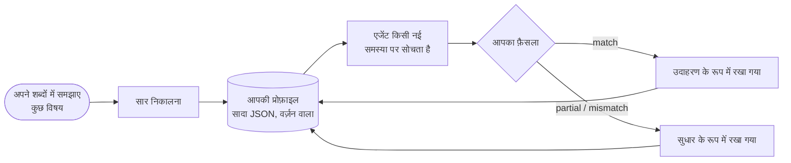

# विचारक प्रोफ़ाइल: किसी खास व्यक्ति की तरह तर्क करें

::: tip क्या SDK मेरी तरह तर्क कर सकता है?
**हाँ: यह किसी खास व्यक्ति के तर्क करने के तरीके की नकल कर सकता है।** एक संज्ञानात्मक एजेंट *आपके* ध्यान के क्रम का पालन कर सकता है, *आपकी* प्राथमिकताओं को तौल सकता है, *आपकी* सहज प्रतिक्रियाएँ लागू कर सकता है और वह ठुकरा सकता है जो *आप* ठुकराते। यह यह सब कुछ ऐसी समस्याओं से सीखता है जिन्हें आप अपने शब्दों में समझाते हैं; हर बार जब आप इसे बताते हैं कि यह कहाँ गलत हुआ, तो वह सुधार इसके निर्देशों में जुड़ जाता है, और आपकी सहमति दिखाती है कि यह करीब आ रहा है या नहीं।

यह **तर्क करने के तरीके** की नकल करता है, किसी व्यक्ति की नहीं: यह वह नहीं जानता जो आपने लिखा नहीं, और यह आपकी जगह निर्णय नहीं लेता। SDK यह दावा नहीं करता कि यह आपके लिए कितना करीब पहुँचता है: **इसे आप मापते हैं**, run दर run, सहमति के उस प्रतिशत के रूप में जो आप इसके उत्तरों को देते हैं।
:::

{.illustration}

## "आपकी तरह तर्क करने" का क्या मतलब है {#what-reasoning-like-you-means}

| यह नकल करता है | यह नकल नहीं करता |
| --- | --- |
| वह **क्रम** जिसमें आप किसी समस्या को देखते हैं (पहले यह कि यह असल में क्या संभव बनाती है, फिर इसकी सीमाएँ…) | आपका **ज्ञान**: जो आप जानते हैं लेकिन कभी लिखा नहीं, जब तक आप उसे संदर्भ या अवलोकनों के रूप में न दें |
| आपकी **प्राथमिकताएँ** (आपके लिए सबसे ज़्यादा क्या मायने रखता है, क्रम से) | आपकी **यादें** और आपका जीवन: यह सिर्फ़ वे नमूने, सुधार और संदर्भ जानता है जो आपने इसे दिए |
| आपकी **सहज प्रतिक्रियाएँ** ("जब कोई सेवा पैसे वाली हो, तो मैं पहले मुफ़्त विकल्प ढूँढता हूँ") | वे अंतर्ज्ञान जिन्हें आपने कभी शब्दों में नहीं ढाला |
| किस वजह से आप कोई विचार **ठुकराते** हैं | आपकी **ज़िम्मेदारी**: इसका उत्तर इस बात का पूर्वानुमान है कि आप क्या सोचते, आपकी ओर से लिया गया निर्णय नहीं |
| जोखिम लेने की आपकी **रुचि** | दुनिया के बारे में आपकी निश्चितता: दावों को अब भी साक्ष्य चाहिए, किसी भी संज्ञानात्मक एजेंट की तरह |
| **जो गलतियाँ आपने सुधारीं**: इसे उन्हें न दोहराने को कहा जाता है | |

## यह कदम-दर-कदम कैसे काम करता है {#how-it-works-step-by-step}



### कदम 1: कुछ विषयों को अपने शब्दों में समझाएँ {#step-1-explain-a-few-topics-in-your-own-words}

एक **नमूना** (sample) कोई एक विषय है जिस पर आपने तर्क किया, उसी तरह लिखा हुआ जैसे वह आपके मन में आया। बिखरा हुआ हो तो भी चलेगा। इसके तीन हिस्से होते हैं:

| फ़ील्ड | क्या लिखें | उदाहरण |
| --- | --- | --- |
| `topic` | विषय, कुछ शब्दों में | "एक रोबोट जो सिर्फ़ रसोई साफ़ करता है" |
| `reasoning` | आपने इसे कैसे देखा: सबसे पहले क्या देखा, क्या जाँचा, किस बात पर हिचकिचाए, और क्यों | "यह असल में क्या करता है? सिर्फ़ एक कमरा, तो सीमा सामान्यीकरण की है। क्या यह कुछ उदाहरणों से कोई दूसरा कमरा सीख सकता है?…" |
| `conclusion` | आपने क्या निष्कर्ष निकाला या आप क्या करते (वैकल्पिक, लेकिन यह एक कैलिब्रेशन उदाहरण बन जाता है) | "एक छोटा अनुकूलनशील चक्र बनाओ और उसे दूसरे कमरे पर परखो" |

**अलग-अलग** विषयों पर पाँच से दस नमूने, एक ही विषय पर बहुत सारे नमूनों से बेहतर काम करते हैं: सार निकालने वाला उस चीज़ को ढूँढता है जो विषयों **के पार** दोहराई जाती है, और एक बार दिखा पैटर्न कमज़ोर होता है।

### कदम 2: अपनी प्रोफ़ाइल का सार निकालें {#step-2-distill-your-profile}

```ts
const profile = await sdk.distillThinkerProfile({
  id: 'nicolas',
  name: 'Nicolas',
  model: 'gpt-4o',
  samples: [
    {
      topic: 'Typed decision APIs like Jev',
      reasoning:
        'What does it really allow? Then the limits: closed, US-only, paid. Is there an open clone? ' +
        'Could it become the controller of my agents? I would benchmark it on my own traces first.',
      conclusion: 'Use an open clone as the controller and benchmark it against Jev',
    },
    { topic: 'World models', reasoning: 'Structure beats scale. Test on a small chaotic system before anything big.' },
  ],
});
```

ठीक-ठीक क्या होता है:

1. नमूनों की जाँच होती है: हर नमूने में एक विषय और एक तर्क होना चाहिए।
2. भाषा मॉडल की एक कॉल एक *संज्ञानात्मक विश्लेषक* की भूमिका निभाती है। वह आपकी राय नहीं, बल्कि आपके तर्क के **बार-बार होने वाले ऑपरेशन** ढूँढती है: आप सबसे पहले क्या जाँचते हैं, कौन-से सवाल पूछते हैं, किसी विचार को कितनी दूर तक ले जाते हैं, किस वजह से कोई समाधान ठुकराते हैं, जोखिम, लागत और नएपन से आपका रिश्ता। उसे सिर्फ़ वही पैटर्न रखने को कहा जाता है जिनका समर्थन नमूने करते हों, और उन्हें तरजीह देने को जो कई नमूनों में दिखे हों।
3. उसका जवाब प्रोफ़ाइल स्कीमा के सामने सत्यापित होता है। अमान्य जवाब error के साथ एक बार वापस भेजा जाता है; दूसरी विफलता पर आधी-अधूरी प्रोफ़ाइल लौटाने की बजाय `ThoughtGenerationError` फेंका जाता है।
4. जिन नमूनों में निष्कर्ष है, वे प्रोफ़ाइल के भीतर **उदाहरणों** के रूप में रखे जाते हैं, ताकि प्रोफ़ाइल में निकाला गया तरीका और वह साक्ष्य दोनों रहें जिससे वह आया।

परिणाम सादा JSON है। **इसे पढ़ें**: अगर कोई कदम या प्राथमिकता गलत है या छूट गई है, तो उसे हाथ से ठीक करें। एक बार के निष्कर्षण से बेहतर आप खुद को जानते हैं।

### कदम 3: एजेंट को आपकी तरह सोचने दें {#step-3-let-the-agent-think-as-you}

```ts
const twin = sdk.createCognitiveAgent({
  name: 'my-twin',
  model: 'gpt-4o',
  profile,
  systemPrompt: "Write every statement and the answer in French, in the thinker's own voice.", // optional
});

const run = await twin.think({
  problem: 'A bank offers you a stable, well-paid CTO job maintaining legacy systems. What do you decide?',
});
console.log(run.decision?.status, run.decision?.answer);
```

प्रोफ़ाइल **run शुरू होते समय कॉपी की जाती है**, इसलिए run के दौरान दिया गया सुधार अगले run पर लागू होता है। यह तर्क के हर कदम के निर्देशों में लिखी जाती है, और अंतिम `decide` कदम से *वह उत्तर माँगा जाता है जो विचारक देता*, ऐसे कारण के साथ जो विचारक के ध्यान के क्रम का पालन करे। [प्रोफ़ाइल कहाँ असर डालती है](#where-the-profile-weighs-and-where-it-never-does) हर जगह की सूची देता है।

### कदम 4: इसे बताएँ कि यह कहाँ गलत हुआ {#step-4-tell-it-where-it-went-wrong}

किसी run के बाद अपना **फ़ैसला** दें: क्या इसने वैसे तर्क किया जैसे आप करते?

```ts
// "Yes, exactly what I would have thought."
await twin.learnFromFeedback(run.runId, { verdict: 'match' });

// "No, I would have gone another way."
await twin.learnFromFeedback(run.runId, {
  verdict: 'mismatch',
  expected: 'Prototype with the free clone first, then compare with Jev on 100 real tickets',
  lesson: 'Always test the free option on real data before paying',
});

// "You are 50% right, and here is where you went wrong."
await twin.learnFromFeedback(run.runId, {
  verdict: 'partial',
  agreement: 0.5,
  wrongAbout: ['ignored the free option', 'overestimated the integration cost'],
  expected: 'Benchmark the open clone on our own tickets before deciding',
});
```

| फ़ील्ड | अर्थ | ज़रूरी |
| --- | --- | --- |
| `verdict` | `match` (इसने आपकी तरह तर्क किया), `partial` (आंशिक रूप से), `mismatch` (बिल्कुल नहीं) | हमेशा |
| `agreement` | आप इसके कितने हिस्से से सहमत हैं, 0 से 1 तक: `0.8` का मतलब है "80% सही" | नहीं |
| `expected` | इसकी जगह आप क्या निष्कर्ष निकालते | `partial` और `mismatch` पर |
| `wrongAbout` | तर्क कहाँ गलत हुआ, आपके शब्दों में | नहीं |
| `lesson` | अगली बार याद रखने वाला नियम (डिफ़ॉल्ट रूप से `expected`) | नहीं |
| `notes` | कुछ और, जो इवेंट में रखा जाता है | नहीं |

इसके साथ क्या होता है:

| फ़ैसला | प्रोफ़ाइल पर असर |
| --- | --- |
| `match` | run एक कैलिब्रेशन **उदाहरण** बन जाता है: उसका सवाल, उसके तर्क के कदमों का सारांश और उसका निष्कर्ष। हर `match` सबसे नए 10 उदाहरण रखता है, जिनमें सार निकाले गए नमूने भी शामिल हैं। |
| `partial` / `mismatch` | एक **सुधार** दर्ज होता है: एजेंट ने क्या निष्कर्ष निकाला, आपने क्या अपेक्षा की, आपकी सहमति, वह कहाँ गलत हुआ और सबक। सबसे नए 20 रखे जाते हैं। तर्क के हर कदम के निर्देशों में सुधार प्रोफ़ाइल के अंत में आते हैं, सबसे ऊँची प्राथमिकता के रूप में: "ये गलतियाँ मत दोहराओ"। Jev कंट्रोलर आखिरी पाँच सबक देखता है। |

हर फ़ैसला प्रोफ़ाइल का patch वर्ज़न बढ़ाता है (`1.0.0` → `1.0.1`) और run में एक `cognition.feedback` इवेंट के रूप में जुड़ता है, पहले और बाद के प्रोफ़ाइल वर्ज़न के साथ। जिस run में कोई निर्णय न हो, उसे फ़ीडबैक नहीं दिया जा सकता: परखने के लिए कुछ है ही नहीं।

`learnFromFeedback` निखरी हुई प्रोफ़ाइल लौटाता है और उसे एजेंट में रखता है। **इसे सहेजें** (`twin.getProfile()` सादा JSON है), वरना आपका प्रोसेस रुकते ही सबक खो जाएँगे।

### कदम 5: मापें कि यह कितना करीब पहुँचता है {#step-5-measure-how-close-it-gets}

SDK आपके फ़ैसले दर्ज करता है; यह खुद को अंक नहीं देता। यह जानने के लिए कि क्या यह सच में आपकी तरह तर्क करता है, एक सरल तरीका अपनाएँ:

1. ऐसी **नई समस्याएँ** तैयार करें जो एजेंट ने कभी नहीं देखीं, अलग-अलग विषयों पर।
2. एजेंट का उत्तर पढ़ने से पहले **अपना उत्तर खुद लिखें**, ताकि उसका उत्तर आपके उत्तर को प्रभावित न करे।
3. एजेंट चलाएँ, फिर हर उत्तर को अंक दें: `agreement`, वह किस बारे में गलत था (`wrongAbout`), आपने क्या अपेक्षा की थी (`expected`)।
4. वह फ़ीडबैक दें और निखरी हुई प्रोफ़ाइल सहेजें।
5. अगले दौर में **दूसरी नई समस्याएँ** इस्तेमाल करें और औसत सहमति की तुलना पिछले दौर से करें।

अगर ऐसी समस्याओं पर औसत बढ़ता है जो इसने कभी नहीं देखीं, तो यह संकेत है कि यह आपके तर्क करने का *तरीका* पकड़ रहा है, सिर्फ़ आपके सुधारे हुए उत्तर नहीं; मुट्ठी भर समस्याओं पर बढ़त संयोग भी हो सकती है, इसलिए कई दौर तक जारी रखें। अगर यह सिर्फ़ उन्हीं समस्याओं पर बेहतर होता है जिन्हें आपने सुधारा, तो यह उत्तरों की नकल कर रहा है।

```ts
const scores = [0.4, 0.6, 0.5]; // the agreement you gave this round
const average = scores.reduce((sum, value) => sum + value, 0) / scores.length; // 0.5, that is 50%
```

## एक प्रोफ़ाइल की बनावट {#anatomy-of-a-profile}

आप हाथ से भी प्रोफ़ाइल लिख सकते हैं:

```ts
import { defineThinkerProfile } from '@sdk-ai-agents/core';

const builder = defineThinkerProfile({
  id: 'builder',
  name: 'Pragmatic builder',
  summary: 'Looks for what a technology really enables, then its limits, then a prototype.',
  reasoningSequence: [
    { id: 'real-capability', instruction: 'Establish what the technology really enables' },
    { id: 'limits', instruction: 'Look for its limits immediately' },
    { id: 'workaround', instruction: 'Imagine how to work around those limits' },
    { id: 'product', instruction: 'Check whether it can become a product' },
    { id: 'automation', instruction: 'Ask how the product could run itself' },
    { id: 'generalize', instruction: 'Extrapolate towards a more general architecture' },
    { id: 'prototype', instruction: 'Design the smallest prototype that tests it' },
  ],
  priorities: ['Real capability over hype', 'Free and open options first', 'Fast feedback'],
  heuristics: [{ when: 'a service is paid and closed', action: 'look for an open alternative before paying' }],
  rejectionCriteria: ['Cannot be tested with a prototype', 'Locks data in a vendor'],
  riskAppetite: 'high',
});

const agent = sdk.createCognitiveAgent({ name: 'me', model: 'gpt-4o', profile: builder });
```

`defineThinkerProfile` प्रोफ़ाइल को सत्यापित करता है और जो छूटा है उसे डिफ़ॉल्ट मानों से भर देता है (खाली सूचियाँ, `riskAppetite: 'medium'`, `version: '1.0.0'`)।

| फ़ील्ड | आसान भाषा में | इंजन इसे कैसे इस्तेमाल करता है |
| --- | --- | --- |
| `id`, `name`, `version` | यह प्रोफ़ाइल किसका वर्णन करती है, और इसका कौन-सा संशोधन है | हर run में दर्ज होता है, ताकि आप जानें कि प्रोफ़ाइल के किस वर्ज़न ने उसे बनाया |
| `summary` | शैली का वर्णन करने वाला एक वाक्य | prompts में प्रोफ़ाइल के सबसे ऊपर लिखा जाता है |
| `reasoningSequence` | वे कदम जिनसे आप गुज़रते हैं, क्रम से | "Order of attention (follow it)" के रूप में लिखा जाता है; अंतिम उत्तर इसका पालन करता है |
| `priorities` | सबसे ज़्यादा क्या मायने रखता है, सबसे ज़रूरी पहले | prompts में लिखा जाता है; यह आँकने में इस्तेमाल होता है कि कोई चुनाव आपके कितना अनुकूल है |
| `heuristics` | आपकी सहज प्रतिक्रियाएँ: "जब …, तब …" | prompts में नियमों के रूप में लिखा जाता है |
| `rejectionCriteria` | किस वजह से आप कोई विचार छोड़ देते हैं | विकल्पों की आलोचना करने और उन्हें ठुकराने में इस्तेमाल होता है जिन्हें आप ठुकराते |
| `riskAppetite` | `low`, `medium` या `high` | prompts में लिखा जाता है |
| `examples` | वे runs और नमूने जिन्हें आपने मान्य किया | "validated examples of their reasoning" के रूप में दिखाए जाते हैं: मॉडल उनसे कैलिब्रेट होता है |
| `corrections` | उन runs के सबक जिनसे आप असहमत थे | प्रोफ़ाइल के अंत में, सबसे ऊँची प्राथमिकता के रूप में दिखाए जाते हैं |

प्रोफ़ाइल के बिना, एजेंट `DEFAULT_THINKER_PROFILE` इस्तेमाल करते हैं, जो एक तटस्थ, साक्ष्य को पहले रखने वाला विश्लेषक है।

## प्रोफ़ाइल कहाँ असर डालती है, और कहाँ कभी नहीं {#where-the-profile-weighs-and-where-it-never-does}

| तर्क का पल | क्या आपकी प्रोफ़ाइल गिनी जाती है? |
| --- | --- |
| **तर्क का हर कदम** (समस्या को दर्शाना, परिकल्पना बनाना, सिमुलेशन, आलोचना, तुलना, निर्णय, टूल का परिणाम पढ़ना) | हाँ: पूरी प्रोफ़ाइल उन निर्देशों में होती है जो भाषा मॉडल को मिलते हैं। सिर्फ़ वह छोटा अनुरोध, जो चुनता है कि कौन-सा टूल कॉल करना है, इसे छोड़ देता है |
| **अगला कदम चुनना** | Jev कंट्रोलर के साथ, हाँ: यह आपके ध्यान का क्रम, प्राथमिकताएँ, अस्वीकृति मानदंड, जोखिम की रुचि और आपके आखिरी पाँच सबक देखता है। Jev के बिना, ह्यूरिस्टिक कंट्रोलर एक तय क्रम का पालन करता है, और इसकी बजाय आपकी प्रोफ़ाइल हर कदम की सामग्री को आकार देती है |
| **आलोचना** | हाँ: विकल्पों पर आपके अस्वीकृति मानदंडों से हमला किया जाता है |
| **कोई चुनाव आपके कितना अनुकूल है** (`preferenceFit`) | हाँ: इसका मकसद यही है। जिस चुनाव को आपके किसी अस्वीकृति मानदंड पर खरा उतरता माना जाए, उसकी रैंक नीचे जाती है, और वह तब अस्वीकार होता है जब जज को इसका पक्का यकीन हो (Jev अपनी पूरी संभावना उस स्तर पर रखता है) या, भाषा-मॉडल जज के साथ, जब मॉडल उसे अस्वीकार करे |
| **साक्ष्य किसी विकल्प का कितना समर्थन करते हैं** (`support`) | **नहीं।** Jev के साथ, यह सवाल आपकी प्रोफ़ाइल के बिना भेजा जाता है; भाषा मॉडल के साथ, मॉडल से पसंद को अनदेखा करने को कहा जाता है |
| **कार्रवाई का कौन-सा चुनाव पहली रैंक पर है** | हाँ, कार्रवाई के चुनावों के लिए, डिफ़ॉल्ट रूप से 40% के वज़न के साथ |
| **क्या कार्रवाई का कोई चुनाव पक्का किया जा सकता है** | हाँ, जब आप उसे साफ़ तौर पर पसंद करते हों और तथ्य उसके ख़िलाफ़ न हों |
| **क्या दुनिया के बारे में कोई दावा विश्वसनीय है** | कोड में **कभी नहीं**: दोनों अंक कभी मिलाए नहीं जाते। भाषा-मॉडल जज के साथ यह अलगाव उसके निर्देशों पर निर्भर करता है, और जिस दावे को मॉडल गलती से चुनाव का लेबल दे दे, वह पसंद वाला रास्ता ले सकता है (देखें [घोषित प्रकार](./evidence-and-verification#not-there-yet)) |

### दो अंक {#the-two-scores}

जब विकल्पों की तुलना होती है, तो हर एक को 0 और 1 के बीच ज़्यादा से ज़्यादा दो अंक मिलते हैं:

| अंक | सवाल | 0 | 0.25 | 0.5 | 0.75 | 1 |
| --- | --- | --- | --- | --- | --- | --- |
| `support` | तथ्य, अवलोकन, परीक्षण और आलोचनाएँ इसका कितना अच्छा समर्थन करते हैं? | खंडित | कमज़ोर समर्थन | विश्वसनीय | मज़बूत समर्थन | स्थापित |
| `preferenceFit` | यह चुनाव विचारक के कितना अनुकूल है? (सिर्फ़ कार्रवाई के चुनाव) | किसी अस्वीकृति मानदंड पर खरा उतरता है | कम मेल | स्वीकार्य मेल | अच्छा मेल | आदर्श मेल |

ये वे स्तर हैं जिनके बारे में Jev आकलनकर्ता पूछता है; भाषा-मॉडल जज हर एक के लिए 0 और 1 के बीच एक संख्या देता है, जिसे इसी तरह पढ़ा जाता है। दोनों आकलन हैं, मापी गई संभावनाएँ नहीं।

### किसी चुनाव की रैंकिंग और उसे पक्का कैसे किया जाता है {#how-a-choice-is-ranked-and-committed}

ऊपर की बैंक वाली नौकरी की समस्या लीजिए, दो विकल्पों के साथ:

| विकल्प | `support` | `preferenceFit` | रैंकिंग अंक: 60% समर्थन + 40% मेल |
| --- | --- | --- | --- |
| H1: नौकरी स्वीकार करना | 0.5 (विश्वसनीय) | 0.25 (कम मेल: बनाने के लिए कुछ नया नहीं) | 0.6 × 0.5 + 0.4 × 0.25 = **0.40** |
| H2: मना करना और बनाते रहना | 0.5 (विश्वसनीय) | 1 (आदर्श मेल) | 0.6 × 0.5 + 0.4 × 1 = **0.70** |

तथ्य दोनों विकल्पों का बराबर समर्थन करते हैं; आपकी पसंद H2 को पहले रखती है। वज़न `limits.preferenceWeight` (0.4) है।

**पक्का** होने के लिए (एक दृढ़ उत्तर, न कि अस्थायी उत्तर या परहेज़), किसी विकल्प को [निष्कर्ष गार्ड](./evidence-and-verification#the-conclusion-guard) पार करना होगा। उसके साक्ष्य दो में से किसी एक तरीके से पर्याप्त होते हैं:

- **सिर्फ़ साक्ष्य से**, किसी भी तरह की परिकल्पना के लिए: `support` कम से कम `limits.decisionThreshold` (0.75, "मज़बूत समर्थन");
- **आपके चुनाव से**, सिर्फ़ कार्रवाई के चुनाव के लिए: `preferenceFit` कम से कम `limits.decisionThreshold` (0.75, "अच्छा मेल") **और** `support` कम से कम `limits.minProposalSupport` (0.35, "कमज़ोर समर्थन" से थोड़ा ऊपर)।

H2 दूसरा तरीका अपनाता है: समर्थन 0.5 ≥ 0.35, मेल 1 ≥ 0.75। यह **0.5 के विश्वास स्तर** के साथ पक्का होता है, क्योंकि किसी निर्णय का विश्वास स्तर कभी उसके साक्ष्य-समर्थन से ज़्यादा नहीं होता: उत्तर कहता है "यह विचारक का चुनाव है", न कि "यह साबित हो चुका है"।

दूसरा तरीका क्यों है: *"क्या आप यह नौकरी लेंगे?"* जैसे सवाल में तौलने लायक साक्ष्य कम होते हैं। कोई व्यक्ति इसे अपनी प्राथमिकताओं से तय करता है, बशर्ते तथ्य उस चुनाव के ख़िलाफ़ न हों। विचारक प्रोफ़ाइल वाले एक असली run में, इस दूसरे तरीके के आने से पहले, ऐसे सवाल बिना पक्के उत्तर के खत्म हो जाते थे।

यह दावों के लिए क्यों बंद है: *"इस स्टार्ट-अप का AI 99% सटीकता से झूठ पकड़ता है"* जैसा कथन दुनिया के बारे में एक **नियम** है। भले ही आप चाहें कि यह सच हो, यह तभी पक्का होता है जब इसका साक्ष्य-समर्थन 0.75 तक पहुँचे, बशर्ते मॉडल इसे नियम का लेबल दे, जिसके लिए उसे निर्देश दिया जाता है (देखें [घोषित प्रकार](./evidence-and-verification#not-there-yet))। पसंद यह चुन सकती है कि क्या करना है; वह किसी चीज़ को कभी सच नहीं बनाती।

## सीमाएँ {#limits}

- **मॉडल मायने रखता है।** प्रोफ़ाइल निर्देशों का एक समूह है: छोटा मॉडल बड़े मॉडल की तुलना में उनका कम ईमानदारी से पालन करता है।
- **यह सिर्फ़ वही जानता है जो आपने इसे दिया।** जब आपकी स्थिति के तथ्य मायने रखते हों, तो उन्हें `context` या `observations` के रूप में दें।
- **पहली प्रोफ़ाइल एक खाका है।** मुट्ठी भर नमूने मुट्ठी भर पैटर्न देते हैं; उसे निखारते हैं सुधार।
- **इसकी स्मृति सीमित है।** 20 सुधार रखे जाते हैं, और हर `match` सबसे नए 10 उदाहरण रखता है (सार निकाली गई प्रोफ़ाइल ज़्यादा से शुरू हो सकती है); सबसे पुराने हटा दिए जाते हैं।
- **वफ़ादारी सच नहीं है।** आपका फ़ीडबैक यह मापता है कि एजेंट ने **आपकी तरह** तर्क किया या नहीं, यह नहीं कि वह **सही** था या नहीं। किसी दावे को दुनिया के सामने जाँचने के लिए एजेंट को एक [परिणाम मूल्यांकनकर्ता](./evidence-and-verification#predictions-and-the-outcome-evaluator) दें।
- **यह निजी डेटा है।** नमूने, प्रोफ़ाइल और इन runs के इवेंट बताते हैं कि कोई व्यक्ति कैसे सोचता है। इन्हें निजी रूप से सहेजें, कभी किसी सार्वजनिक repository में नहीं, और किसी दूसरे की प्रोफ़ाइल बनाने से पहले उसकी सहमति लें।

## प्रोफ़ाइल डेटा हैं {#profiles-are-data}

प्रोफ़ाइल सादा JSON हैं: इन्हें जहाँ चाहें सहेजें और `agent.setProfile(profile)` या `profile` विकल्प से दोबारा लोड करें। इवेंट `profileId` और `profileVersion` रखते हैं, ताकि आप हमेशा जानें कि प्रोफ़ाइल के किस वर्ज़न ने कोई run बनाया।

## अपना कंट्रोलर ट्रेन करें {#train-your-own-controller}

ऑपरेशन का हर चुनाव उस स्थिति के साथ दर्ज होता है जो कंट्रोलर ने देखी। इन्हें JSON Lines के रूप में एक्सपोर्ट करें:

```ts
const jsonl = await sdk.exportControllerDataset(); // or pass runIds
```

```json
{"runId":"run_…","step":3,"state":{…},"available":["hypothesize","simulate","critique","decide"],"operation":"simulate","controller":"jev","confidence":0.82,"usedFallback":false,"runStatus":"completed","feedback":"partial","agreement":0.5}
```

`feedback: "match"` पर फ़िल्टर करें और आपके पास अगला कदम चुनने के *आपके* तरीके के निगरानी वाले (supervised) उदाहरण होंगे: एक छोटे ओपन मॉडल को फ़ाइन-ट्यून करने और उसे कस्टम `CognitiveController` के रूप में लगाने के लिए काफ़ी, बिना प्रति-कॉल लागत के।
