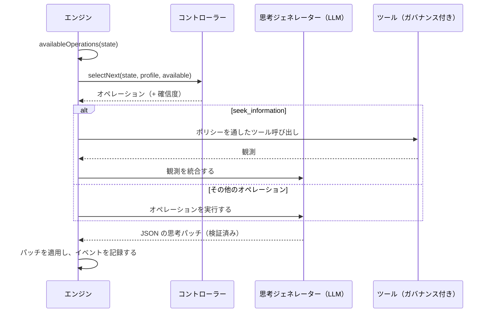

# 認知エージェント

認知エージェントは一度で答えを出しません。**明示的な心的状態** を保持し、正当化できる決定を確定できるようになるまで、**認知オペレーション** を 1 つずつ適用してそれを改善していきます。

::: tip やさしく言うと
一般的な AI は一度で答え、その推論は消えてしまいます。認知エージェントは、ノートを持った人のように働きます。知っていること、仮定していること、まだ知らないことを書き留め、いくつかの選択肢を挙げ、その結果を想像し、何がうまくいかない可能性があるかを探し、あなたが許可したツールで事実を確認し、選択肢を比較して、それからようやく決定します。こうした一手一手が 1 つの **オペレーション** であり、それぞれがノートに書き込まれるので、後から推論全体を読み返せます。確かな結論にたどり着けなければ、そう言います。このページの用語はすべて [用語をやさしく解説](./glossary#how-a-cognitive-agent-reasons) で説明しています。
:::

{.illustration style="max-width:460px"}

```ts
const agent = sdk.createCognitiveAgent({
  name: 'analyst',
  model: 'gpt-4o',
  tools: [lookupMetric],
  profile: myProfile, // optional, see Thinker profiles
});

const { status, answer, decision, state, runId } = await agent.think({
  problem: 'Should we build or buy our analytics module?',
  context: { budget: '10k EUR', deadline: 'before Q4' },
  observations: [{ content: 'Churn was 4% last month', originGroup: 'billing' }], // optional
});

decision?.status; // 'committed' | 'provisional' | 'abstain'
```

::: tip まず証拠から
観測がどのようにトレースされ、予測がどのように検証され、結論がどのように守られるかは、[証拠と検証](./evidence-and-verification) で説明しています。
:::

## 心的状態 {#the-mental-state}

心的状態は、シンプルな型付きのデータです。すべての項目に、モデルが参照できる安定した ID が付きます。

| 部分 | ID | 保持するもの |
| --- | --- | --- |
| `observations` | `O1…` | 観測されたもの（問題と一緒に渡されたもの、ツールやテストが返したもの）と、その出所 |
| `facts` | `F1…` | 情報源（`input`、`tool`、`inference`）、もとになった観測、状態（`active`、`superseded`、`retracted`）を持つ言明 |
| `assumptions` | `A1…` | 推論が当然のこととしているもの |
| `constraints` | `K1…` | どの回答も守らなければならないもの |
| `unknowns` | `U1…` | 未解決の問い。`open`、`resolved`、`dropped` のいずれかで、試行回数を持つ |
| `hypotheses` | `H1…` | 前提、シミュレーション、批判、証拠による `support`、`preferenceFit`、状態を持つ提案・規則・説明 |
| `comparisons` | `R1…` | 観測同士の関係：類似、相違、変化、両立不能、反例 |
| `predictions` | `P1…` | 仮説が予測すること、何がそれを反証するか、テストの結果 |
| `contradictions` | `C1…` | 項目間の衝突。カテゴリーを持ち、証拠を引用して解決されるまで残る |
| `failures` | `X1…` | すでに失敗したこと。やみくもに再試行しないために残す |
| `knowledge` | `M1…` | 同じスコープの以前の実行が実際のテストで確立したことで、実行の開始時に呼び出されたもの（[実行をまたぐ記憶](./memory) を参照） |
| `confidence`、`evidenceRevision` | | 最良の回答の、証拠による支持度。それ以前の評価を古くなったものにするカウンター |
| `decision`、`trail` | | 最終的な決定とその状態。ステップごとに 1 行 |

{.illustration style="max-width:760px"}

状態が **その場で書き換えられることはありません**。各オペレーションは「思考パッチ」を生成し、そのパッチは `cognition.thought` イベントとして記録されます。状態とは、すべてのパッチを順に畳み込んだものです。だからこそ `sdk.getMentalState(runId)` は、数か月後であっても、どの実行でも正確に再構築できます。

## オペレーション {#the-operations}

| オペレーション | 何をするか | 利用できる条件 |
| --- | --- | --- |
| `represent` | 事実、仮定、制約、未知事項を抽出する | 常に最初。矛盾が未解決のときにも再び |
| `compare_observations` | 観測同士を関連付ける：類似点、相違点、変化、反例 | 比較可能な観測が 2 つ以上あり（重複とテスト結果を除く）、前回の比較以降に新しい観測がある |
| `hypothesize` | 新しい提案、規則、説明を提示する | 有効な仮説が `maxHypotheses` より少ない |
| `simulate` | 結果を一歩ずつ予想し、検証可能な予測を述べる | シミュレーションされていない仮説がある |
| `test_prediction` | 記録された予測に対して結果評価器を実行する（LLM 呼び出しなし） | 評価器が設定されていて、保留中の予測があり、テストの予算が残っている |
| `revise` | 証拠と矛盾した仮説を、スコープを絞ったバリアントに変える | 反証された、または矛盾した仮説に、まだバリアントがない |
| `critique` | 仮説が失敗しうる最も強い理由を見つける | 批判されていない仮説がある |
| `seek_information` | ガバナンス付きツールを呼び出して、未解決の未知事項に答える | ツールがあり、未解決の未知事項があり、ツールの予算が残っている |
| `compare` | 証拠による支持度と、提案が思考者にどれだけ合うかを判定する | 前回の比較以降に、批判済みの仮説が変わったか、証拠が変わった |
| `decide` | 回答、根拠、確信度、次のアクションを確定する | ある仮説が [結論ガード](./evidence-and-verification#the-conclusion-guard) を通過する |

**何が可能かはコードが決め、何が有用かはコントローラーが決めます。** 前提条件は状態から計算され、コントローラーは利用可能なオペレーションの中からしか選べません。

モデルが何を言おうと、次のルールはコードで強制されます。

- 反論のない `fatal` の批判、または反証された予測は、その仮説を却下します。
- 却下された仮説は、復活も再提示も選択もできません。何が変わったかを述べるバリアントへと修正されるだけです。
- コードが主張の証拠による支持度に選好を混ぜることはなく、モデルが状態の確信度を設定することもできません。
- 矛盾は一度だけ、それに決着をつける観測や事実を引用することによってのみ解決されます。
- 変えるはずだったものを何も変えなかったステップや、先送りされた決定は、失敗した試行として数えられます。2 回続けて失敗すると、別のステップが新しい証拠をもたらすまで、そのオペレーションは提示されなくなります（[予算を無駄にしない](./evidence-and-verification#a-budget-that-is-not-wasted) を参照）。
- 出所（観測、テスト結果）と決定の状態はエンジンが書き込みます。モデルの応答にそれらが含まれていても取り除かれます。
- 存在しない ID への参照は無視され、思考イベントの `issues` として報告されます。
- 同時に検討される仮説は最大 `maxHypotheses` 個です。それを超える提案は破棄され、報告されます。
- 未知事項は、2 回試して成果がなければ、あるいは答えられるツールがなければ直ちに、それ以上調べられなくなります。また、捉え直し（矛盾に対する `represent`）が提示されるのは最大 3 回です。
- 失敗したオペレーションは失敗として記録され、完了したとはみなされません。
- **最後のステップは必ず決定の試み** です。結論ガードを通過しない回答は、`provisional`（足りないものを添えて）か `abstain` になります。モデルがまったく決定を出せない場合は、エンジンが判断を保留し、その理由を記録します。

## コントローラー {#controllers}

コントローラーは次のオペレーションを選びます。



| コントローラー | 選び方 | 使いどころ |
| --- | --- | --- |
| `heuristic` | 固定された注意の順序：表現 → 修正 → 観測の比較 → 仮説 → シミュレーション → 予測の検証 → 批判 → 情報探索 → 比較 → 決定 | Jev がない場合のデフォルト。決定論的で無料 |
| `typed` | ステップごとに Jev へのリクエストを 1 回：利用可能なオペレーションに対する Choice と、「決定する準備はできたか？」という Noul | 較正された確信度をともなう適応的な推論 |
| 独自のもの | `CognitiveController.selectNext()` を実装する | ファインチューニングしたローカルモデル、業務ルールなど |

`controller: 'auto'`（デフォルト）の場合、エージェントは、SDK に型付き決定のバックエンドがあれば Jev を、なければヒューリスティックを使います。型付きコントローラーは、Choice の確信度が `minConfidence`（0.35）を下回ったとき、クライアントが失敗したとき、または回答が利用可能なオペレーションでないときに、**ヒューリスティックにフォールバック** します。例外を投げたり、利用できないオペレーションを返したりする独自のコントローラーも、ヒューリスティックに置き換えられます。すべてのフォールバックは、選択イベントの `fallbackFrom` フィールドに記録されます。

```ts
sdk.createCognitiveAgent({
  name: 'analyst',
  model: 'gpt-4o',
  controller: 'typed',
  controllerOptions: { minConfidence: 0.5, readinessThreshold: 0.85 },
  assessment: 'typed', // compare hypotheses with Jev Score questions
});
```

## 推論の中のツール {#tools-inside-reasoning}

`seek_information` は **ネイティブの推論エンジンとアクションエンジン** を使います。LLM が未解決の未知事項に対して 1 つのツールを選び、アクションエンジンがそのツールが **このエージェントに渡されたもの** であることを確認し、ポリシー（実行制限を含みます。[制限とポリシー](#limits-and-policies) を参照）、承認、予算に照らして呼び出しを検証します。結果は、その `action.executed` イベントを指す **観測** として記録され、その後 `source: "tool"` の事実として統合されます。解釈に失敗しても、観測は残ります。拒否された、ブロックされた、あるいは失敗したツールは記録された失敗となり、推論は続行されます。

## 制限 {#limits}

```ts
sdk.createCognitiveAgent({
  name: 'analyst',
  model: 'gpt-4o',
  limits: {
    maxSteps: 12,              // the last one always decides
    timeoutMs: 180_000,
    maxHypotheses: 3,          // in play at the same time
    maxToolCalls: 5,
    decisionThreshold: 0.75,   // evidence support a committed answer needs (see minProposalSupport)
    maxConsecutiveFailures: 3, // then the run fails (and alerts you, if incidents are on)
    maxPredictionTests: 4,     // calls to the outcome evaluator per run
    preferenceWeight: 0.4,     // weight of the thinker's preferences when ranking proposals
    minProposalSupport: 0.35,  // evidence support enough for a choice of action the thinker clearly prefers
  },
  evaluator: myBench,          // optional OutcomeEvaluator, enables test_prediction
  knowledge: { store, scope: 'my-domain' }, // optional memory across runs
});
```

制限はエージェントの作成時に検証されます。`maxSteps: 0` や、タイマーが扱える範囲を超えるタイムアウトを指定すると、安全装置を黙って無効にする代わりに `ValidationError` を投げます。`minProposalSupport` は `decisionThreshold` を超えてはいけません。`decisionThreshold` と同じ値にすれば、証拠だけが回答を確定できるようになります。`minProposalSupport` を設定せずに `decisionThreshold` を下げた場合、下限もそれに合わせて下がります。

### 制限とポリシー {#limits-and-policies}

エージェントに適用される予算とタイムアウトのポリシー（その `policies` にあるものとグローバルなもの）は、**各ステップの前**、そのステップのモデル呼び出しより前に確認され、さらに各ツール呼び出しの前にも確認されます。これらのポリシーは実行の進み具合を見ます。`maxSteps` はすでに済んだステップ数、`maxTokens` は実行のモデル呼び出し（思考とその修復、ツールの選択、型付き決定）のトークン数、`maxDuration` は実行開始からの経過時間です。期間ごとのトークン予算と費用予算（`toolName` を指定せず、`maxTokens` または `maxCost` を指定した `budgetLimit`）も各ステップの前に確認され、実行が記録するモデル呼び出しはすべてそこに数えられます（[API コスト](./costs#budgets) を参照）。ステップは種類が `continue` の意図として確認されます。条件がツール呼び出しを必要とする（`intention.type` が `tool_call` に等しい）ポリシーは、ツール呼び出しにだけ適用されます。許可リスト、カスタムポリシー、呼び出し予算（`maxToolCalls`）、承認は、ツール呼び出しだけに関わります。アクションが `require_approval` の制限ルールも同様で、ステップが承認を待つことはありません。各ステップの確認は、ステップに適用されうるポリシーについて、ポリシーの監査（`sdk.getPolicyAuditTrail`）に記録されます。

最初に達した制限が実行を終わらせます（ツール呼び出しの制限は呼び出しを飛ばすだけです）が、2 種類の制限は同じ終わらせ方をしません。

| 制限 | エージェントの `limits` | ポリシー |
| --- | --- | --- |
| ステップ | `maxSteps`：最後のステップが決定します。`completed` で、決定は `committed`、`provisional`、`abstain` のいずれか | `maxSteps`：次のステップが拒否されます。`failed` |
| 時間 | `timeoutMs`：実行が中断され、実行中の呼び出しには中断シグナルが届きます。`failed`、`Timeout exceeded (… ms)` | `maxDuration`：ステップの合間とツール呼び出しの前に確認され、実行中の呼び出しはそのまま続きます。`failed`、`Timeout (… ms) exceeded` |
| トークン、費用 | — | `maxTokens`、期間ごとの予算：次のステップが拒否されます。`failed` |
| ツール呼び出し | `maxToolCalls`：`seek_information` が提示されなくなります | 拒否された呼び出しは記録された失敗となり、推論は続行されます |

拒否されたステップは `policy.violated`（`intention: { type: 'continue' }`、ステップ `step`、理由 `reason`、違反したポリシー `violatedPolicies` を含む）として記録され、続いてポリシーの理由とともに `run.failed` が記録されます。結果は `status: 'failed'` で、`error` は `PolicyViolationError` です。実行制限に拒否されたツール呼び出しは、`policy.violated` として、また失敗したオペレーションとして記録されます。制限は超えたままなので、次のステップが拒否され、実行は失敗します。拒否ではなく決定で終わらせるには、エージェントの `maxSteps` をポリシーの `maxSteps` 以下にしてください。そうすれば、ポリシーが何かを拒否する前に、最後のステップが決定します。

## 不正なモデル出力 {#invalid-model-output}

各オペレーションには、Zod で検証される厳密な JSON の契約があります。有効な JSON でない応答、必須フィールドが欠けている応答、誤った値を使った応答は、検証エラーを添えて **1 回だけ** 差し戻されます。オペレーションが書き込んではいけないフィールド（たとえば `simulate` 中の `decision`）は無視され、`ignoredFields` に列挙されます。修正も失敗した場合、そのオペレーションは失敗として記録され、ループは続行されます。

## 停止、キャンセル、タイムアウト {#stop-cancel-time-out}

```ts
const pending = agent.think({ problem });
await agent.stop();          // or agent.stop(runId)
const result = await pending; // status: 'cancelled'
```

タイムアウトすると `Timeout exceeded (… ms)` とともに `status: 'failed'` になり、イベントログでも実行は失敗として記録されます。`sdk.stopRun(runId)` は認知エージェントの実行も停止します。タイムアウトと停止はオペレーションの合間にチェックされ、中断シグナルとしてプロバイダーに渡されます。組み込みの OpenAI と Anthropic のプロバイダーは、すでに送信中のリクエストをキャンセルしないため、遅い呼び出しはベンダー側のタイムアウトで終わります。

プロファイルは **実行の開始時にスナップショットが取られます**。実行中に与えたフィードバックは、次の実行から適用されます。

## セキュリティ {#security}

認知エージェントは、自分で書いたのではないテキストを読みます。ツールの結果、MCP ツールの説明、コンテキスト内の文書などです。これらはすべて **信頼できない入力** として扱ってください。モデルに向けた指示（プロンプトインジェクション）が含まれている可能性があります。SDK は、そうしたテキストにできることを次のように制限します。

- エージェントは渡されたツールしか呼び出せず、呼び出しのたびにポリシーがチェックされます。破壊的なツールは `require_approval` ポリシーで保護してください。
- モデルは自分では何も実行しません。モデルが提案し、アクションエンジンが検証します。
- 心的状態の不変条件は、プロンプトではなくコードで強制されます。
- すべてのツール呼び出しと思考は、レビューのためにイベントログに残ります。

イベントログには目標、コンテキスト、すべての思考が保存され、`decision.evaluated` イベントには Jev に送られたコンテキストが保存されます。選んだイベントストアには、データに応じた保持期間とマスキングのルールを適用してください。

## リプレイと監査 {#replay-and-audit}

認知エージェントの実行も、通常の実行です。

- `sdk.getTrace(runId)` は、`policy.checked`、`tool.called` などと並べて `cognition.*` イベントを表示します。
- `sdk.replay(runId)` は、LLM を呼び出さずにツール呼び出しを再実行し、最終回答を再現します。元の実行と同じツール制限と、各呼び出し時点での実行の進み具合が適用されるので、エージェントが拒否されたツールは再び拒否され、実行制限に拒否された呼び出しも再び拒否されます。
- `sdk.getMentalState(runId)` は状態を再構築します。
- `sdk.exportControllerDataset()` は、実行を学習データに変換します（[思考者プロファイル](./thinker-profiles#train-your-own-controller) を参照）。
