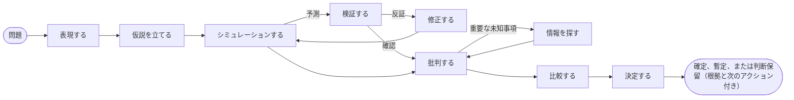

# イントロダクション

**SDK AI Agents** は、本番環境で信頼できる AI エージェントを作るための TypeScript SDK です。行動する前に明示的に推論し、「あなた」の考え方を教え込むことができ、すべてのステップがガバナンスされ、トレースされ、料金が算出され、リプレイできるエージェントを作れます。

{.illustration style="max-width:460px"}

## なぜ新たなエージェント SDK なのか {#why-another-agent-sdk}

LLM の API は、非常に高性能なテキスト生成器を提供してくれます。しかし、結論に **どのように** たどり着くかを制御する手段は提供してくれません。

- 推論はモデルの内部で一度きりで行われ、回答が出力されると消えてしまいます。
- モデルが推測にもとづいて行動したり、間違ったツールを呼び出したり、使いすぎたりするのを止めるものがありません。
- 何か問題が起きたとき、手元にあるのはプロンプトと回答だけで、そこに至る経緯はありません。

この SDK は、モデルの **周りに** 推論のレイヤーを置きます。LLM は、いくつかある構成要素の 1 つになります。

| レイヤー | 役割 | どこにあるか |
| --- | --- | --- |
| **心的状態** | 事実、仮定、制約、未知事項、仮説、矛盾、確信度 | いつでもイベントから再構築される |
| **コントローラー** | 次の認知オペレーションを選ぶ | 決定論的なヒューリスティック、Jev の型付き決定、または独自のもの |
| **思考ジェネレーター** | 1 つのオペレーションを実行し、検証済みの JSON パッチを返す | 任意の LLM プロバイダー |
| **思考者プロファイル** | ある人物の注意の順序、優先事項、ヒューリスティック | フィードバックで洗練される、バージョン管理されたデータ |
| **ガバナンス** | ポリシー、許可リスト、予算、承認、リトライ | すべてのアクションの前にチェックされる |
| **イベントストア** | 唯一の信頼できる情報源 | ファイル、SQLite、PostgreSQL |

## 2 種類のエージェント {#two-kinds-of-agents}

**ガバナンス付きエージェント**（`sdk.createAgent`）は、従来のツール呼び出しループを実行します。LLM が意図を提案し、アクションエンジンがそれを検証して実行します。明確に定義されたタスクに最適です。

**認知エージェント**（`sdk.createCognitiveAgent`）は明示的に推論します。アーキテクチャの選択、インシデントのトリアージ、機会の評価、「…すべきか？」という問いへの回答など、意思決定のために作られています。

どちらの種類も、同じツール、ポリシー、イベントストア、リプレイ、コスト、インシデントアラートを共有します。

## 特定の人物のように推論できるのか {#can-it-reason-like-a-given-person}

**はい。** 認知エージェントは、特定の人物の推論の仕方を模倣できます。あなたがいくつかのテーマを自分の言葉で説明すると、SDK はそこから **思考者プロファイル** を抽出します。問題を見る順序、優先事項、反射的な判断、アイデアを却下する理由、リスクへの許容度です。そのプロファイルは、推論の各ステップの指示に書き込まれます。各実行の後に、あなたがどこまで同意するか（たとえば「60% 正しい。ここが間違っている」）を伝えると、その教訓が次の実行のために保存されます。

模倣するのは **推論の仕方** です。あなたが書き留めなかったことは知りませんし、あなたの代わりに決めることもありません。また、あなたの選好によって、世界についての主張がより信頼できるものになることもありません。SDK は自分を採点しません。どこまで近づいたかを教えてくれるのは、エージェントが見たことのない問題について、実行のたびにあなたが与える一致度の割合です。各ステップは [特定の人物のように推論する](./thinker-profiles) で説明しています。

## 得られるもの {#what-you-get}

- **明示的な推論**：心的状態に対する 10 種類のオペレーションと、コードで強制される不変条件（却下された仮説は選べない、致命的な批判は仮説を却下する、最後のステップは必ず結論を出す）。
- **監査できる証拠**：出所付きの観測、あなた自身の評価器による予測の検証、スコープを絞ったバリアントへと修正される反証済みの規則、証拠と切り離された選好、そして `committed`、`provisional`、`abstain` のいずれかを答える結論ガード。知識ストアを使えば、テストの答えが次の実行のために記憶されます。
- **特定の人物のような推論**：自分の言葉で説明したテーマから思考者プロファイルを抽出し、`match`、`partial`、`mismatch` の判定と一致度の割合でエージェントを修正します。
- **型付き決定**：[TypeSafe Jev](https://docs.typesafe.ai) または互換性のある任意のバックエンドが、Noul、Choice、Score の質問に較正された確率で答えます。
- **MCP コネクター**：あなたのツールを MCP サーバーとして公開し、任意の MCP サーバーをガバナンス付きツールとして取り込みます。
- **運用機能を内蔵**：実行ごとの API コスト、積み重ならないリトライポリシー、メールや Webhook によるインシデントアラート。
- **ネイティブなイベントソーシング**：LLM を使わないリプレイ、ゴールデントレース、リグレッション検出、推論グラフ。

ほかのフレームワークとどう違うのでしょうか。[この SDK を選ぶ理由](./why) を参照してください。これらの用語に馴染みがなければ、[用語をやさしく解説](./glossary) で 1 つずつ説明しています。準備ができたら、[はじめよう](./getting-started) に進みましょう。
