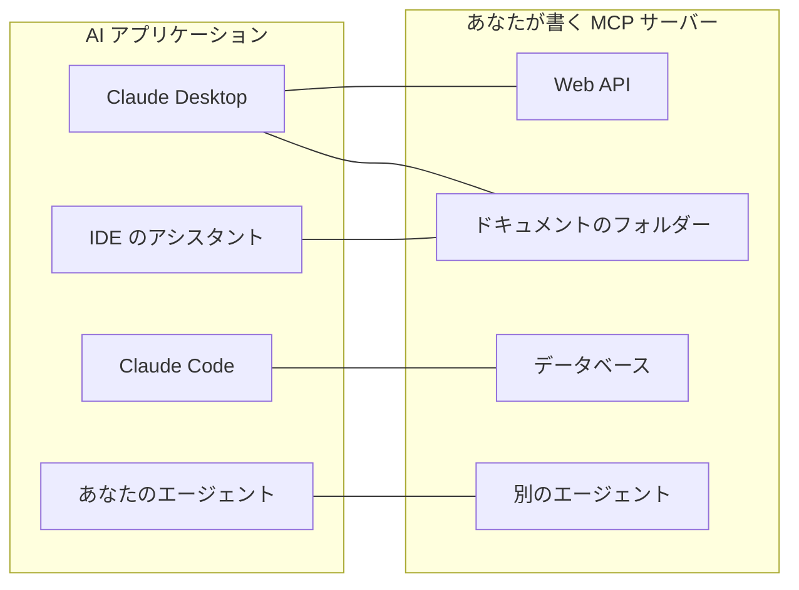
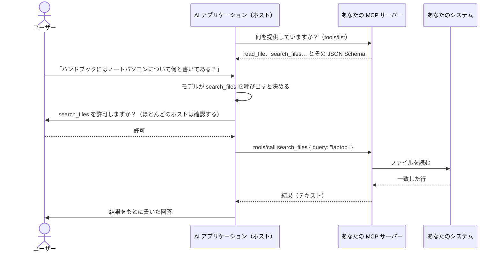
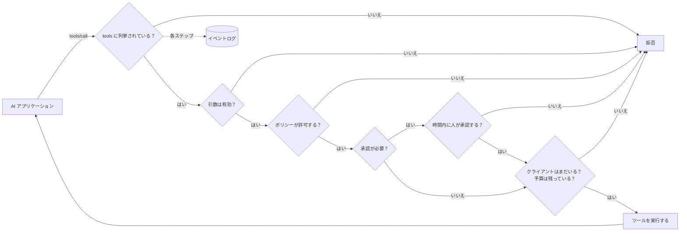

# MCP をやさしく解説

**MCP を使うと、AI アプリケーション（Claude Desktop、Claude Code、IDE のアシスタント、あなた自身のエージェント）が、あなたのシステム（API、ドキュメントのフォルダー、データベース、別のエージェント）を使えるようになります。** このページでは、その考え方と用語を説明します。続くページでは、ゼロから動くサーバーを作るまでを扱います。

1. [5 分ではじめての MCP サーバー](./mcp-first-server)：空のフォルダーから Claude Desktop まで、一歩ずつ。
2. [なんでも MCP サーバーにする](./mcp-recipes)：関数、Web API、フォルダー、データベース、エージェントを 1 行で。
3. [デプロイ・保護・トラブルシューティング](./mcp-deploy)：HTTP でのデプロイ、認証、承認、そしてうまく動かないときの対処。

## 考え方：すべての AI アプリに 1 つの差し込み口 {#the-idea-one-plug-for-every-ai-app}

MCP（Model Context Protocol）は、**AI アプリケーションのための USB-C** だと考えてください。USB が登場する前は、機器ごとに専用のケーブルがありました。MCP が登場する前は、AI アプリケーションごとに、やり取りするシステムごとの専用のつなぎのコードが必要でした。Claude 用に 1 つ、IDE 用にもう 1 つ、エージェント用にさらにもう 1 つ、という具合です。

MCP を使えば、**あなたのシステムの手前に、小さなプログラム（MCP サーバー）を 1 つ** 書くだけで済みます。そうすれば、MCP を話すすべてのアプリケーションがそこに接続し、何が提供されているかを一覧し、それを使えます。サーバーは一度作れば、どこでも動きます。



このプロトコルは、[modelcontextprotocol.io](https://modelcontextprotocol.io) で公開されているオープンな標準です。Anthropic が始めたもので、多くの AI アプリケーションが対応しています。

## 用語を 1 つずつ {#the-words-one-by-one}

| 用語 | やさしく言うと | 例 |
| --- | --- | --- |
| **ホスト**（AI アプリケーション） | ユーザーが対話するアプリ。言語モデルを動かし、いつあなたのサーバーを使うかを決める。 | Claude Desktop、Claude Code、VS Code |
| **MCP クライアント** | ホストの中で、1 つのサーバーとの接続を保持する部分。目にすることはめったにない。 | Claude Desktop ではサーバーごとに 1 つ |
| **MCP サーバー** | あなたの小さなプログラム。何を提供しているかを伝え、頼まれたら処理を行う。 | `serveMcpOverStdio(sdk, { … })` |
| **ツール** | モデルが呼び出すと決めることのできるアクションで、名前付きの引数を持つ。モデルはその名前、説明、引数のリストを読んで判断する。 | `read_file`、`list_pets`、`query` |
| **リソース** | サーバーが読み取り用に提供する文書。ツールとは違い、選ぶのはモデルではなく **ユーザーやアプリ**（たとえば「添付」ボタンで）。 | `folder://handbook/onboarding.md` |
| **プロンプト** | サーバーが提供する、既製のメッセージのテンプレート。この SDK ではまだ提供していない。 | — |
| **トランスポート** | ホストとサーバーの間で、メッセージがどのように運ばれるか。 | stdio、Streamable HTTP |
| **stdio** | ホストが同じコンピューター上で **あなたのサーバーをプログラムとして起動** し、その標準入力と標準出力を通じて対話する。キーボードで打ち込み、表示されたものを読むのと同じようなもの。ネットワーク上には何も開かれない。 | Claude Desktop のローカルサーバー |
| **Streamable HTTP** | あなたのサーバーは **Web サービス** で、ホストはそこに HTTP リクエストを送る。1 つのサーバーをチームで共有するのに使う。 | `https://mcp.example.com/mcp` |
| **JSON Schema** | モデルが読む、ツールの引数の記述（名前、型、どれが必須か）。SDK が書いてくれる。 | `{ "type": "object", "properties": { "path": { "type": "string" } } }` |
| **アノテーション** | ホストに示される、ツールについてのヒント。「このツールは読み取るだけ」など。ホストは、いつユーザーに確認を求めるかの判断に使うことがある。 | `readOnlyHint: true` |

::: tip ツールとリソースの違い
**ツール** は、モデルが「行う」もの（「ハンドブックで 'laptop' を検索する」）です。**リソース** は、ユーザーが「手渡す」もの（「onboarding.md をこの会話に添付する」）です。フォルダーのレシピは、同じフォルダーから両方を提供します。
:::

## 1 回の呼び出しで何が起きるか {#what-happens-during-one-call}



覚えておくべきことが 2 つあります。

- **モデルに見えるのは、サーバーが一覧に載せたものだけです**。名前、説明、引数のスキーマ、そして返ってくる結果です。説明は明確に書き、決して秘密情報を入れないでください。
- **実際に何が起きるかを決めるのはサーバーです。** モデルは呼び出しを提案し、あなたのサーバーはそれを拒否したり、制限したり、人に確認したり、記録したりできます。この SDK が役に立つのはそこです。

## この SDK が加えるもの {#what-this-sdk-adds}

MCP サーバーは、公式の MCP SDK だけでも書けます。この SDK はその上に乗り、サーバーを **安全に、1 行で** 動かすために必要なものを加えます。

| | 公式の MCP SDK だけの場合 | SDK AI Agents の場合 |
| --- | --- | --- |
| Web API を公開する | エンドポイントごとにハンドラーを 1 つ書く | `openApiTools({ spec })`：オペレーションごとに 1 つのツール。デフォルトで読み取り専用 |
| フォルダーを公開する | パスのチェックを自分で書く | `folderTools({ root })`：シンボリックリンクや `..` でフォルダーの外に出ることはできない |
| データベースを公開する | SQL のガードを自分で書く | `databaseTools({ database })`：SELECT 1 文のみ、データベースのレベルで読み取り専用（PostgreSQL では読み取り専用のトランザクション、SQLite では `query_only`）、行数の上限付き |
| エージェントを公開する | — | `cognitiveAgentTool(agent)`：「Nicolas ならどう考える？」を 1 つのツールに |
| 意図せず公開されるものがない | 自分次第 | `tools` に列挙したツールだけ |
| 呼び出しのたびにルールを適用する | 自分次第 | [ポリシー](./governed-agents)、予算、許可リスト |
| まず人が承認する | 自分次第 | `requiresApproval` の付いたツールは `sdk.approveAction()` を待つ。承認待ちは、クライアントがキャンセルまたは切断したとき、および `approvalTimeoutMs`（デフォルトは 50 秒）が経過したときにキャンセルされる |
| 何が起きたかを知る | 自分次第 | すべての呼び出しとすべてのリソースの読み取りが、[イベントログ](./observability) の 1 つの実行になる |



この順番で進みます。引数が不正な呼び出しは、誰かに承認を求める前に拒否されます。また、呼び出しは結果にかかわらず、開始した時点で予算に計上されます。

MCP 経由の呼び出しは、それぞれが `mcp:<server name>` というエージェント ID の独立した実行として記録されます。エージェントの実行とまったく同じように、読んだり、料金を算出したり、アラートを出したりできます。

## 両方向 {#both-directions}

この SDK は、MCP を両方向で話します。

- **提供する**：あなたのツール、API、フォルダー、データベース、エージェントを MCP サーバーにします。続くページで説明します。
- **利用する**：既存の任意の MCP サーバーのツールを、あなた自身のエージェントに渡します。以下で説明します。

### MCP サーバーのツールをエージェントで使う {#use-the-tools-of-an-mcp-server-in-your-agents}

```ts
import { connectMcpServer } from '@sdk-ai-agents/core/mcp';

const crm = await connectMcpServer({
  name: 'crm',
  transport: { type: 'http', url: 'https://mcp.acme.internal/crm', headers: { Authorization: `Bearer ${token}` } },
  toolPrefix: 'crm_',                         // avoid collisions between servers
  include: ['lookup_customer', 'list_invoices'],
  metadata: { riskLevel: 'medium' },          // governance metadata for every tool
  retry: { maxRetries: 2 },
});

const tools = crm.tools.map((definition) => sdk.defineTool(definition));
const agent = sdk.createCognitiveAgent({ name: 'account-manager', model: 'gpt-4o', tools });

await agent.think({ problem: 'Should we offer customer c-42 a discount?' });
await crm.close();
```

| `transport.type` | 用途 |
| --- | --- |
| `stdio` | プロセスとして起動するローカルサーバー（`command`、`args`、`env`、`cwd`） |
| `http` | Streamable HTTP 経由のリモートサーバー（`url`、`headers`） |
| `custom` | 自分で作る任意のトランスポート（WebSocket、テスト用のインメモリなど） |

取り込んだツールはサーバーの JSON Schema を保持するので、モデルには実際の引数が見えます。`sdk.defineTool` で定義すると、ローカルのツールとまったく同じように振る舞います。許可リスト、ポリシー、承認（`metadata: { requiresApproval: true }` にすると、すべての呼び出しが人を待ちます）、予算、リトライ、トレースが、すべての呼び出しに適用されます。ツールの一覧取得に失敗した場合は、エラーを投げる前に接続（と stdio のプロセス）が閉じられます。

::: warning 信頼できるサーバーだけに接続する
取り込んだツールの説明や結果は、一字一句そのままモデルに届きます。悪意のあるサーバーは、そこに指示を書き込めます。信頼できるサーバーにだけ接続し、各エージェントには必要なツールだけを渡し、破壊的なツールは承認で保護してください。
:::

## 知っておくとよいこと {#good-to-know}

- MCP のサポートは別のエントリーポイント `@sdk-ai-agents/core/mcp` にあるので、使わない限り、コアパッケージが `@modelcontextprotocol/sdk` を必要とすることはありません。ツールソース（`openApiTools`、`folderTools`、`databaseTools`、`cognitiveAgentTool` など）はコアパッケージにあるので、エージェントは MCP なしでもそれらを使えます。
- サーバーは公式の MCP TypeScript SDK 1.30 の上に作られており、プロトコルのリビジョン 2024-10-07、2024-11-05、2025-03-26、2025-06-18、2025-11-25 を受け付けます（その `SUPPORTED_PROTOCOL_VERSIONS`、2026-09-24 に確認）。MCP のサイトには 2026-07-28 のリビジョンも記載されています（[アーキテクチャ](https://modelcontextprotocol.io/docs/learn/architecture)、2026-09-24 に確認）が、この SDK はまだそれに対応していません。
- この SDK が提供するのは **ツール** と **リソース** です。プロンプト、サンプリング、エリシテーションは提供していません。

次は [はじめてのサーバーを作ります](./mcp-first-server)。
