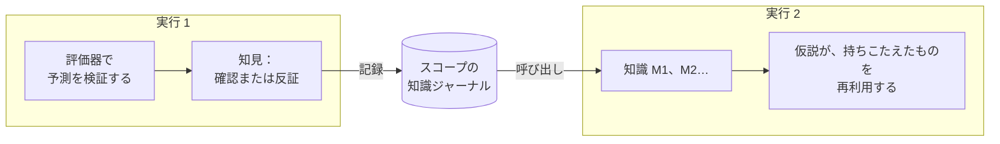

# 実行をまたぐ記憶

::: tip やさしく言うと
同じ実験台で働く全員が共有する実験ノートを思い浮かべてください。実験がある規則を確認または反証するたびに、何が予想され、何が見えたかとともに書き留められます。次の人は、始める前にそのノートを読みます。持ちこたえたものは再利用し、すでに失敗したものを、そのままの形で再び試すことはしません。

認知エージェントも、このようなノートを付けられます。書き留めるのは **実際のテストが答えたこと** だけで、モデルや思考者が単に信じていたことは決して書きません。
:::

## 何をするのか {#what-it-does}



1. **実行の終わりに**、[結果評価器](./evidence-and-verification#predictions-and-the-outcome-evaluator) が確認または反証した予測を 1 つ以上持つ規則や説明は、すべて **知見** になります。知見には、言明、そのスコープ、その実行の中でこの規則が修正した元の規則、そして各テスト（何が予想され、何が観測され、どの評価器か）が含まれます。知見は、そのスコープの **ジャーナル** に追記されます。
2. 同じスコープで **次の実行が始まるとき**、最も関連性の高い項目が **呼び出され**、`M1`、`M2`… という ID の付いた `knowledge` として心的状態に置かれます。
3. **実行中は**：
   - モデルは、各項目をその状態と最新のテストとともに見て、検証済みの規則はそのスコープの中で、引用しながら再利用するよう指示されます。
   - **反証済み** の項目を一字一句そのまま（大文字・小文字と句読点を除いて、同じ種類、言明、スコープで）再提示する仮説は、エンジンに拒否されます。モデルは代わりに、前提にその項目の `M` ID を引用し、反証を説明するバリアントを提示するよう指示されます。ただし、言い回しやスコープが少しでも違えば、新しい仮説として受け入れられます。
   - **検証済み** または **係争中** の項目を再提示する仮説は、自動的にその項目と結び付けられる（その `M` ID が前提に追加される）ので、比較ステップは以前のテストを参照できます。

## 有効にする {#turn-it-on}

```ts
import { FileKnowledgeStore } from '@sdk-ai-agents/core';

const physicist = sdk.createCognitiveAgent({
  name: 'physicist',
  model: 'gpt-4o',
  evaluator: bench,   // without an evaluator, nothing is tested, so nothing is remembered
  knowledge: {
    store: new FileKnowledgeStore('./knowledge'),
    scope: 'inclined-plane',
  },
});

const first = await physicist.think({ problem: 'Does the rolling time depend on the ball?', observations });
const second = await physicist.think({ problem: 'Will a 250 g glass ball take as long as a steel one?' });

second.state.knowledge;
// [{ id: 'M1', status: 'refuted',  statement: 'Rolling time on this plane does not depend on the ball', … },
//  { id: 'M2', status: 'verified', statement: 'For rigid balls, rolling time on this plane does not depend on mass', … }]
```

| オプション | デフォルト | 意味 |
| --- | --- | --- |
| `store` | （必須） | ジャーナルを保管する場所：`FileKnowledgeStore`、`InMemoryKnowledgeStore`、または独自のもの |
| `scope` | （必須） | 知識が何についてのものか。実行は、学んだことを同じスコープの中でだけ共有する。小文字、数字、`.`、`-`、`_` を使う。大文字・小文字だけが異なる 2 つのスコープは、macOS や Windows では 1 つのファイルを共有してしまう |
| `recallLimit` | `10` | 実行の開始時に呼び出す項目の数（0〜50）。`0` にすると、記録はするが呼び出さない |
| `record` | `true` | 実行が、テストで確立したことを記録するかどうか |

`examples/rule-discovery.ts` がこの機能を使っています。2 回実行すると、2 回目の実行は 1 回目で確立されたことを手にして始まります。

## 記憶されるもの、決して記憶されないもの {#what-is-remembered-and-what-never-is}

| 記憶されるもの | 決して記憶されないもの |
| --- | --- |
| 評価器が **確認** または **反証** した予測を持つ規則と説明 | 行動の選択（提案）。誰がいつ決めるかによって変わるため |
| 何が予想され、何が観測され、どの評価器とそのバージョンが使われたか | 一度もテストされなかった予測、またはテストが **判定不能** だった予測 |
| バリアントが修正した規則と、何が変わったか | モデルが信じたこと、モデルが付けた支持度、思考者の選好 |
| どの実行がそれを記録したか | 実行の最終回答 |

失敗した実行や停止された実行も、行ったテストは記録します。その後に何が起きたとしても、測定は有効だからです。

## ステータス {#statuses}

| ステータス | いつ | モデルに伝えられること |
| --- | --- | --- |
| `verified` | これまでのところ確認だけ | スコープ内で再利用し、引用する。スコープの外では、改めてテストすべき仮説である |
| `refuted` | これまでのところ反証だけ | そのままの形で再び提示しない。バリアントは前提にその `M` ID を引用し、何が違うかを述べる |
| `contested` | 確認と反証の両方がある | 一部の条件でしか成り立たない。それがどの条件かを見つける |

同じスコープの同じ言明は、大文字・小文字や句読点が違っても同じ項目です。テストは実行と予測の組み合わせで重複が除かれるので、同じ実行を 2 回記録しても何も増えません。

## どの項目が呼び出されるか {#which-items-are-recalled}

スコープ内の項目は、決定論的に次の順で順位付けされます。

1. 問題と共有する単語が最も多いもの（言明とスコープの中の、4 文字以上の単語）。
2. 次に、最も多くテストされたもの。
3. 次に、最も新しいもの。

上位 `recallLimit` 件の項目が呼び出されます。これは単純な単語の一致であり、セマンティック検索ではありません。問題とまったく異なる言い回しの規則は、優先的に呼び出されないことがあります。スコープ内のすべてが関連するように、スコープは狭く保ってください（1 つのベンチ、1 つの製品、1 つの領域）。

## スコープ {#scopes}

スコープは境界であり、整理のためのフォルダー名ではありません。

- 実行は、学んだことをスコープの中でだけ **共有** します。
- 規則が互いに当てはまるベンチ、製品、データセット、領域ごとに、1 つのスコープを使ってください（`inclined-plane`、`checkout-latency`、`churn-model-v3` など）。
- データを分けておく必要がある顧客やテナントを、1 つのスコープに混ぜないでください。

## ストア {#stores}

| ストア | 用途 |
| --- | --- |
| `FileKnowledgeStore(directory)` | スコープごとに 1 ファイル（`<directory>/<scope>.jsonl`）、実行ごとに 1 行。行は追記されるだけなので、このファイルは読める履歴にもなる。1 つの `FileKnowledgeStore` インスタンスを通じた書き込みは直列化されるので、1 つのプロセス内のエージェント間では 1 つのインスタンスを共有すること |
| `InMemoryKnowledgeStore()` | テスト、プロトタイプ、短命なプロセス |
| 独自の `KnowledgeStore` | 複数のプロセスで共有するデータベース |

複数のインスタンスやプロセスが同時に同じスコープに書き込む場合は、データベースを使ってください。ポートの 3 つのメソッドを実装します。書き込みが中断されて未完了のまま残った行は、読み込み時に警告を出してスキップされ、次のエントリーは新しい行から始まります。有効な JSON ではあるものの有効なエントリーではない行があると、ファイルが改変されたとみなして、その行番号とともに読み込みを中止します。

```ts
import type { KnowledgeStore } from '@sdk-ai-agents/core';

const store: KnowledgeStore = {
  async recall({ scope, goal, limit }) { /* the most relevant items of the scope */ },
  async record({ scope, runId, recordedAt, findings }) { /* append one entry */ },
  async list(scope) { /* every item of the scope */ },
};
```

`projectKnowledge(entries)` はジャーナルのエントリーを畳み込んで項目にまとめ、`rankKnowledge(items, goal, limit)` はそれらを順位付けします。そのため独自のストアは、エントリーを保持し（たとえば実行ごとに 1 行）、この 2 つを再利用するだけで済みます。

スコープが何を知っているかは、いつでも確認できます。

```ts
for (const item of await store.list('inclined-plane')) {
  console.log(item.status, item.confirmations, item.refutations, item.statement);
}
```

## 監査とリプレイ {#audit-and-replay}

- 呼び出された項目は `cognition.started`（`knowledge.scope`、`knowledge.items`）に記録されます。そのため `sdk.getMentalState(runId)` は、ストアを再び読むことなく、その後ストアが変わっていても、実行が知っていたことを正確に再構築します。
- 知見は `cognition.knowledge_recorded` イベント（`scope`、`findings`）に記録されます。
- ストアが失敗しても、実行が止まることはありません。呼び出しに失敗すると `cognition.started` に `knowledge.error` として記録され、実行は記憶なしで続行されます。記録に失敗すると `cognition.knowledge_recorded` に `error` として記録されます。実行の `limits.timeoutMs` 以内に応答しないストアは、失敗したものとして扱われます（遅い書き込みが後から完了することはあります）。イベントログ自体が知見を記録できない場合は、警告が出力され、実行の結果はそのまま返されます。

## 限界 {#limits}

- **単語の一致。** 呼び出しは意味にもとづくものではありません。関連していても言い回しの異なる規則は、見逃されることがあります。
- **完全な再提示のみ。** 拒否されるのは、反証済みの規則を同じ種類、同じ言い回し（大文字・小文字と句読点を除く）、同じスコープで再提示したものだけです。言い換えたものは新しい仮説として受け入れられます。
- **1 回のテストで `verified` になる。** 予測が 1 つ確認され、反証されたものが 1 つもなければ、その項目は検証済みになります。そして、どの予測で規則をテストするかはモデルが選びます。弱い予測でも確認として数えられます。
- **スコープは申告されるだけで、チェックされない。** 「剛体のボール」について検証された規則は、そのスコープとともに示され、モデルは新たなテストなしにほかへ適用しないよう指示されます。コードでそれを検証するものはありません。
- **評価器は信頼される。** 記憶の信頼性は、評価器の信頼性と同じです。誤った測定も、テストとして記憶されます。
- **1 ファイルにつき書き込み手は 1 つ。** `FileKnowledgeStore` が直列化するのは、1 つのインスタンスの書き込みだけです。同じスコープに書き込む 2 つのインスタンスや 2 つのプロセスは、調整されません。
