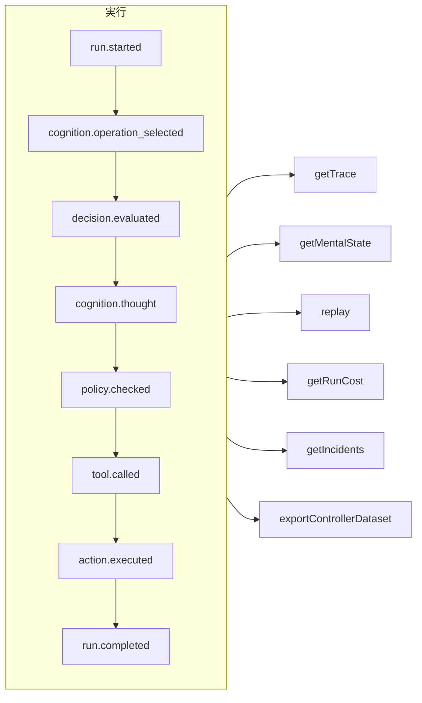

# トレーサビリティとリプレイ

すべての実行は、それがガバナンス付きエージェント、認知エージェント、直接の型付き決定、MCP のツール呼び出しのどれであっても、**追記専用のイベントログ** です。記録の外で起きることは何もなく、それ以外のすべてはこのログから導き出されます。



## ストア {#stores}

| ストア | 用途 |
| --- | --- |
| `FileEventStore`（デフォルト） | 開発、単一のプロセス。実行ごとに 1 つの JSON ファイル |
| `SQLiteEventStore` | クエリが使える、ローカルでの永続化 |
| `PostgreSQLEventStore` | 本番環境。インデックス付きのクエリ、集計、バックアップと復元 |

::: code-group

```ts [File]
import { createSDK, FileEventStore } from '@sdk-ai-agents/core';

const sdk = createSDK({ apiKey, eventStore: new FileEventStore('./events') });
```

```ts [SQLite]
import Database from 'better-sqlite3';
import { createSDK, SQLiteEventStore } from '@sdk-ai-agents/core';

const sdk = createSDK({ apiKey, eventStore: new SQLiteEventStore({ db: new Database('events.db') }) });
```

```ts [PostgreSQL]
import pg from 'pg';
import { createSDK, PostgreSQLEventStore } from '@sdk-ai-agents/core';

const pool = new pg.Pool({ connectionString: process.env.DATABASE_URL });
const sdk = createSDK({ apiKey, eventStore: new PostgreSQLEventStore({ pool }) });
```

:::

ストアは `IEventStore` を実装します。独自のストアを書けば、どんなデータベースにも保存できます。ファイルストアはイベントをバッファーにため、100 ms ごとに書き出します。終了時には `await store.destroy()` を呼び出して、まだ書き込まれていないものを書き込んでください。ログを読む処理（心的状態の再構築、コスト、データセット）は、同じ ID で繰り返されたイベントを無視します。

## 実行を読む {#read-a-run}

```ts
const trace = await sdk.getTrace(runId);          // status, timeline, summary
const text = await sdk.exportTrace(runId, 'text'); // human-readable timeline
const events = await sdk.getEvents(runId, { type: ['tool.called', 'policy.violated'] });
const state = await sdk.getMentalState(runId);    // cognitive runs
```

実行のステータスは、**最後のライフサイクルイベント**（`run.completed`、`run.failed`、`run.cancelled`）で決まります。その後に追記されたイベント（フィードバックやインシデントの報告）によって、実行が再び開かれることはありません。

## LLM を使わないリプレイ {#replay-without-the-llm}

```ts
const replay = await sdk.replay(runId);
```

リプレイは、記録された意図を、ポリシーも含めてアクションエンジンにもう一度通して実行します。**LLM は呼び出しません**。変更を加えてリプレイすれば、たとえばポリシーを変更した後に、「もしこうだったら」というシナリオを試せます。

リプレイは、ツールを本当にもう一度実行します。`requiresApproval` が付いたツールについては、元の実行で人が **承認した** 呼び出し（同じツール、同じパラメーター）だけを、改めて承認を求めずに繰り返します。却下された呼び出し、キャンセルされた呼び出し、一度も承認されなかった呼び出しは、実行されずに拒否されます。*ポリシー* が求める承認は引き続き適用され、決定が出るまで待ちます。

## 決定を理解する {#understand-decisions}

| メソッド | 得られるもの |
| --- | --- |
| `getReasoningGraph(runId)` / `exportReasoningGraph(runId, 'graphviz')` | 意図 → ポリシー → アクションという連鎖を表したグラフ |
| `getAlternatives(runId)` | エージェントが検討した代替案 |
| `getDecisionPatterns(filters)` | 複数の実行にわたって繰り返し現れる決定のパターン |
| `getTraceVisualization(runId)` | UI 向けに、グループ化してタイムライン表示に使える形にした構造 |
| `getPolicyAuditTrail(runId)` | すべてのポリシー評価とその結果 |

## エージェントをコードのようにテストする {#test-agents-like-code}

よい実行を **ゴールデントレース** にしておき、新しい実行をそれと照合して検証します。

```ts
const golden = await sdk.createGoldenTrace(runId, { name: 'refund flow', description: 'Expected behavior' });
const validation = await sdk.validateAgainstGoldenTrace(newRunId, golden.id);
const regressions = await sdk.detectRegressions(newRunId, golden.id);
```

リグレッションスイート、振る舞いのアサーション、実行同士の比較、デプロイ前の影響分析も利用できます。[SDK API](../reference/sdk-api) を参照してください。
