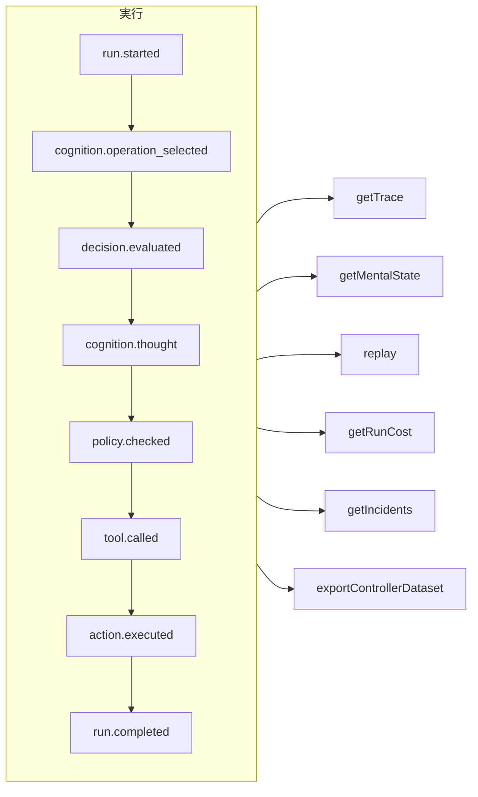

# トレーサビリティとリプレイ

すべての実行は、それがガバナンス付きエージェント、認知エージェント、直接の型付き決定、MCP のツール呼び出しのどれであっても、**追記専用のイベントログ** です。記録の外で起きることは何もなく、それ以外のすべてはこのログから導き出されます。



## ストア {#stores}

| ストア | 用途 |
| --- | --- |
| `FileEventStore`（デフォルト） | 開発、単一のプロセス。実行ごとに 1 つの JSON ファイル |
| `SQLiteEventStore` | クエリが使える、ローカルでの永続化 |
| `PostgreSQLEventStore` | 本番環境。インデックス付きのクエリ、集計、バックアップと復元 |

::: code-group

```ts [File]
import { createSDK, FileEventStore } from '@sdk-ai-agents/core';

const sdk = createSDK({ apiKey, eventStore: new FileEventStore('./events') });
```

```ts [SQLite]
import Database from 'better-sqlite3';
import { createSDK, SQLiteEventStore } from '@sdk-ai-agents/core';

const sdk = createSDK({ apiKey, eventStore: new SQLiteEventStore({ db: new Database('events.db') }) });
```

```ts [PostgreSQL]
import pg from 'pg';
import { createSDK, PostgreSQLEventStore } from '@sdk-ai-agents/core';

const pool = new pg.Pool({ connectionString: process.env.DATABASE_URL });
const sdk = createSDK({ apiKey, eventStore: new PostgreSQLEventStore({ pool }) });
```

:::

ストアは `IEventStore` を実装します。独自のストアを書けば、どんなデータベースにも保存できます。ファイルストアはイベントをバッファーにため、100 ms ごとに書き出します。終了時には `await store.destroy()` を呼び出して、まだ書き込まれていないものを書き込んでください。ログを読む処理（心的状態の再構築、コスト、データセット）は、同じ ID で繰り返されたイベントを無視します。

## 実行を読む {#read-a-run}

```ts
const trace = await sdk.getTrace(runId);          // status, timeline, summary
const text = await sdk.exportTrace(runId, 'text'); // human-readable timeline
const events = await sdk.getEvents(runId, { type: ['tool.called', 'policy.violated'] });
const state = await sdk.getMentalState(runId);    // cognitive runs
```

実行のステータスは、**最後のライフサイクルイベント**（`run.completed`、`run.failed`、`run.cancelled`）で決まります。その後に追記されたイベント（フィードバックやインシデントの報告）によって、実行が再び開かれることはありません。

## リアルタイムの進捗 {#live-progress}

イベントは、ストアに受け付けられた時点で、**実行の進行中にも** あなたのコードに届きます。UI に進捗を表示したり、クライアントにストリーミングしたり、ダッシュボードに送り込んだりするのに使えます。MCP クライアントは、これを [進捗通知](./mcp-deploy#progress-notifications) として受け取ります。

```ts
const result = await agent.run({
  message: 'Refund order 1234',
  onEvent: (event) => console.log(event.type),
});

const answer = await cognitiveAgent.think({ problem, onEvent: (event) => socket.send(JSON.stringify(event)) });
const replay = await sdk.replay(runId, undefined, { onEvent: (event) => console.log(event.type) });

// Every run of the SDK, for as long as you listen
const unsubscribe = sdk.subscribe((event) => dashboard.push(event), { types: ['run.failed', 'approval.requested'] });
unsubscribe();
```

| 場所 | リスナーが受け取るもの |
| --- | --- |
| `run({ onEvent })`、`think({ onEvent })`、`study.run({ onEvent })` | その実行のすべてのイベント |
| `replay(runId, modifications, { onEvent })` | リプレイのすべてのイベント |
| `executeTool(name, params, { onEvent })` | 呼び出しのイベントと、そのツールが開始するエージェントの実行（`governedAgentTool`、`cognitiveAgentTool`）のイベント。1 階層分までで、そのエージェントがさらに開始する実行のイベントは含まれない |
| `sdk.subscribe(listener, { runId?, agentId?, types?, maxQueued? })` | フィルターに一致するすべての実行のすべてのイベント。返された関数を呼び出すまで続く |

保証されるのは次のことです。

- **ストアが受け付けたものだけ。** リスナーは、ストアの `append` が成功した後に呼び出されます。ストアが拒否したイベントについて呼び出されることは決してありません。SQL のストアでは、行はコミット済みです。ファイルストアでは、イベントはそのバッファーの中にあります。`getEvents` はそれをすぐに返し、100 ms 以内にディスクに書き込まれます（その間にクラッシュすると失われます）。
- **順番どおり。** 1 つの実行のイベントは、記録された順に届きます。異なる実行のイベントは入り混じります。
- **一度に 1 つのイベント、そして実行は決して待たない。** リスナーが Promise を返すと、次のイベントはその Promise が確定するまで待つので、非同期のリスナーがイベントの順番を入れ替えることはありません。その間も実行は進みます。遅いリスナーは後れを取るだけで、エージェントを遅くすることはありません。同期のリスナーは、イベントの `append` が戻る前に呼び出されます。すばやく終わるようにしてください。
- **実行が中断されない限り、呼び出しはリスナーを待つ。** 実行が終わると、`run()`、`think()`、`replay()`、`executeTool()` は、その `onEvent` がすべてのイベントの処理を終えるまで待つので、これらが戻った時点で、あなたはすべてを見ています。実行が停止またはキャンセルされたとき、あるいはその `signal` が中断されたとき（呼び出し元が待つのをやめたとき）は、待機が早めに終わります。認知エージェントの実行では、この待機も `limits.timeoutMs` に数えられます。そのとき、リスナーの購読は解除され、まだ受け取っていないイベントは破棄されます。リプレイはキャンセルできないので、必ず待ちます。それ以外の場合、決して確定しない Promise があると、呼び出しは戻りません。結果を待たない処理（fire-and-forget）では、Promise を返さないでください（`onEvent: (event) => { void save(event); }`）。
- **上限のあるキュー。** 前のイベントをまだ処理しているリスナーを待てるイベントは、最大 `maxQueued` 個（デフォルトは 10 000）です。それを超えると、新しいイベントはこのリスナーについては破棄されます。この破棄は、リスナーが追いついた時点で、破棄されたイベントの数を示す `LiveEventsDroppedError` とともに報告されます。
- **エラーは実行に入り込まない。** 例外を投げたリスナーや、返した Promise が拒否されたリスナーは、標準エラー出力（`console.error`）に報告され、その後のイベントも引き続き受け取ります。イベントの破棄も同じように報告されます。エラーを自分で処理するには、リスナーの中で捕捉してください。エラーとイベントの破棄を同じように処理するには、`eventStore: new ObservedEventStore(store, { onListenerError })` を指定して SDK を作成してください。
- **コピー。** 各リスナーは、ストアが読み戻したとおりのイベントを、自分専用のコピーとして受け取ります。それを変更しても、ログは何も変わりません。
- **購読の解除はすぐに効く。** `sdk.subscribe` が返した関数を呼び出した後は、すでに待っているイベントについても、リスナーが再び呼び出されることはありません。この関数は、リスナーの中から呼び出すこともできます。

`agentId` のフィルターは、各イベントの `metadata.agentId` と照合されます。エージェントを持たないイベントもいくつかあります（`provider.retry`、リプレイの終わり、`agentId` を指定せずに行った `sdk.decisions` の呼び出しの `decision.evaluated`）。それらを受け取るには、実行で絞り込んでください。復元されたバックアップは配信されません。`incidents` のインシデント報告は配信されます。`MonitoredEventStore` を自分で作成する場合は、`ObservedEventStore` の上に作成してください（`new MonitoredEventStore(new ObservedEventStore(store), options)`）。そうしないと、その報告は記録されますが、リアルタイムでは配信されません。自分のストアの上に手作業で組み立てたエージェント（`new AgentImpl(…)`）で `onEvent` を使うには、そのストアを `ObservedEventStore` でラップしてください。`createSDK` はこれを自動で行います。エージェントツールの背後では、ストアがラップされていないエージェントは、失敗する代わりに、呼び出し元のリスナーを受け取らずに動きます。

## LLM を使わないリプレイ {#replay-without-the-llm}

```ts
const replay = await sdk.replay(runId);
```

リプレイは、記録された意図を、ポリシーも含めてアクションエンジンにもう一度通して実行します。**LLM は呼び出しません**。変更を加えてリプレイすれば、たとえばポリシーを変更した後に、「もしこうだったら」というシナリオを試せます。

リプレイは、ツールを本当にもう一度実行します。`requiresApproval` が付いたツールについては、元の実行で人が **承認した** 呼び出し（同じツール、同じパラメーター）だけを、改めて承認を求めずに繰り返します。却下された呼び出し、キャンセルされた呼び出し、一度も承認されなかった呼び出しは、実行されずに拒否されます。*ポリシー* が求める承認は引き続き適用され、決定が出るまで待ちます。

## 決定を理解する {#understand-decisions}

| メソッド | 得られるもの |
| --- | --- |
| `getReasoningGraph(runId)` / `exportReasoningGraph(runId, 'graphviz')` | 意図 → ポリシー → アクションという連鎖を表したグラフ |
| `getAlternatives(runId)` | エージェントが検討した代替案 |
| `getDecisionPatterns(filters)` | 複数の実行にわたって繰り返し現れる決定のパターン |
| `getTraceVisualization(runId)` | UI 向けに、グループ化してタイムライン表示に使える形にした構造 |
| `getPolicyAuditTrail(runId)` | すべてのポリシー評価とその結果 |

## エージェントをコードのようにテストする {#test-agents-like-code}

よい実行を **ゴールデントレース** にしておき、新しい実行をそれと照合して検証します。

```ts
const golden = await sdk.createGoldenTrace(runId, { name: 'refund flow', description: 'Expected behavior' });
const validation = await sdk.validateAgainstGoldenTrace(newRunId, golden.id);
const regressions = await sdk.detectRegressions(newRunId, golden.id);
```

実行はイベントの意味（種類、順序、ツール、パラメーター、結果）で比較され、実行ごとに新しくなるイベントの id では決して比較されません。時刻、トークン数、そのほか SDK が書き込み、実行ごとに変わる値も比較から外されますが、ツールのパラメーターと結果は、キーの名前にかかわらず常に比較されます。同じことをもう一度行う実行は合格し、別の引数で呼ばれたツールは、呼び出しが起きた位置で報告されます。

### CI でのリグレッションスイート {#regression-suites-in-ci}

ゴールデントレースを一度スイートにまとめておき、CI で実行します。

```ts
// Once, after recording the good runs
await sdk.createRegressionTestSuite('support-agent', {
  name: 'refunds',
  goldenTraces: [{ goldenTraceId: golden.id, name: 'refund flow' }],
});

// In CI: the same agent, created again
sdk.createAgent({ name: 'support-agent', model: 'gpt-4o', tools });
const { results, exitCode } = await sdk.runRegressionTestsForCI('support-agent', {
  detection: { tolerance: { ignoreEventTypes: ['intention.generated'], ignoreDataFields: ['output'] } },
});
await sdk.exportTestResults(results, 'junit', { outputPath: 'regressions.xml' });
process.exitCode = exitCode;
```

エージェントの id はプロセスごとに新しくなるため、スイートはエージェントを **名前** で覚えています。エージェントのすべてのスイートが古い順に実行され、各テストは基準の実行の入力をエージェントに送り、新しい実行をゴールデントレースと比較します。終了コードは、すべてのテストが合格すれば 0、リグレッションを見つけたテストがあれば 1、実行できなかったテストがあれば 2 です。実際のモデルは、実行のたびに回答を違う言い方で返します。上の `detection` はモデルのテキストと最終的な回答を比較から外し、それでもツール呼び出しとその引数はすべてチェックします。

実行のイベントに対するアサーション、2 つの実行の比較、エージェントの新しいバージョンの影響、すべての実行にまたがるクエリは [SDK API](../reference/sdk-api#assertions) にあります。
