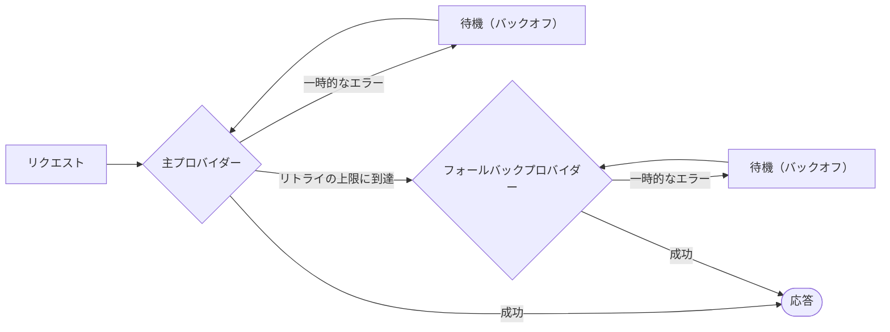

# リトライとフォールバック

ネットワークは障害を起こし、プロバイダーはレート制限をかけ、ツールはタイムアウトします。SDK は、リトライできるものはリトライし、できないものは別のプロバイダーにフェイルオーバーします。そして **すべてのリトライを実行に書き込む** ので、隠されるものは何もありません。



## LLM プロバイダー {#llm-providers}

リトライポリシーは、**フォールバックに移る前に、プロバイダーごとに個別に** 適用されます。

```ts
const sdk = createSDK({
  apiKey: process.env.OPENAI_API_KEY,
  fallbackProviders: [{ provider: 'anthropic', config: { apiKey: process.env.ANTHROPIC_API_KEY } }],
  retry: { maxRetries: 3, initialDelayMs: 500, maxDelayMs: 8_000 },
});
```

別のベンダーのフォールバックプロバイダーには、その `config` または `providerConfig` に独自のキーが必要です。主プロバイダーのキーが別のベンダーに送られることはありません。エージェントのモデルは、そのプロバイダーが対応している場合にだけ送られ、そうでなければ自身の `defaultModel`（指定がなければ OpenAI は `gpt-5.4`、Anthropic は `claude-opus-5`）が使われます（Anthropic は OpenAI のモデル名を拒否し、その逆も同様です）。`intention.generated` イベントには、実際に応答したプロバイダーと使われたモデルが記録されます。

| オプション | デフォルト | |
| --- | --- | --- |
| `maxRetries` | `2` | 最初の試行の後に行うリトライの回数 |
| `initialDelayMs` | `500` | リトライのたびに 2 倍になる（`multiplier`） |
| `maxDelayMs` | `8000` | 1 回のバックオフで待つ時間の上限 |
| `maxRetryAfterMs` | `60000` | 従う `retry-after` の最大値（フォールバックがある場合は `maxDelayMs`） |
| `jitter` | `true` | 各待ち時間を [delay/2, delay] の範囲でランダムにする |
| `retryOn` | `isTransientError` | 独自の判定関数 |

リトライされるのは **一時的な** エラーだけです。408、409、425、429、5xx、529、接続の失敗、タイムアウトがこれにあたり、OpenAI と Anthropic の接続エラーも含まれます。これらは、エラーのクラスと、その `cause` に含まれるネットワークコードで見分けられます。認証、検証、ポリシーのエラーは、直ちに失敗します。アカウントのクレジットやクォータが尽きたことを意味する 429（`insufficient_quota`、`credit_balance_exhausted`…）も同じです。待ってもクレジットは戻らないからです。エラーメッセージには、提供元による説明が含まれます。プロバイダーが `retry-after-ms` または `retry-after` を送ってきた場合、SDK は独自のバックオフの代わりにその時間だけ待ちます。ただし、待つのは `maxRetryAfterMs`（デフォルトは 60 秒）までです。`fallbackProviders` が設定されている場合、この上限は `maxDelayMs` に引き下げられます。長い休止を求めるプロバイダーは、実行を止めてしまうのではなく、フォールバックに任されます。それより長い待機を求められた時点で、リトライは終わります。

SDK のリトライポリシーが有効なときは、OpenAI と Anthropic のクライアント自身のリトライは無効になります。**リトライが積み重なることはありません**。各リトライは、プロバイダー、モデル、試行回数、待ち時間、エラーとともに `provider.retry` イベントとして記録されます。提供元のデフォルトのリトライを代わりに使いたい場合は、`retry: false` を渡してください。

テキストをストリーミングする実行（`onText`）では、回答の一部が届いた後にモデル呼び出しが失敗することがあります。ストリームの途中で提供元が送ってくるエラーは、対応する HTTP のエラーとして扱われます。OpenAI の `server_error`（500）と、Anthropic の `rate_limit_error`（429）、`api_error`（500）、`timeout_error`（504）、`overloaded_error`（529）はリトライされ、それ以外の種類はリトライされません。ストリームの途中で切れた接続、回答が完了する前に終わったストリーム、クライアントのタイムアウト（デフォルトは 10 分。`providerConfig`、フォールバックの `config`、または `OpenAIProvider` と `AnthropicProvider` のオプションで指定する `timeout`）の間に何も送ってこないストリームは、接続の失敗として扱われます。リトライの前、またはフォールバックプロバイダーに移る前に、`onTextRestart` が、失敗した試行がストリーミングしたテキストを捨てるよう呼び出し元に伝えます。次の試行が回答をもう一度書きます（[回答のストリーミング](./governed-agents#_7-streaming-the-answer) を参照）。

`llmProvider` で注入したプロバイダーは、`retry` を明示的に設定しない限り、渡されたままの形で使われます。また、`FallbackProvider` がラップされることはないので、そのフェイルオーバーはトレースに見えたままになります。その中のプロバイダーもラップされないため、`retry` は適用されません。フェイルオーバーの前に再試行させたいプロバイダーは `RetryingLLMProvider` でラップし、そのクライアントに `maxRetries: 0` を指定してください。また、フォールバックが引き継げるときに SDK が行うのと同じように、ポリシーの `maxRetryAfterMs` を `maxDelayMs` に設定すると、長い休止を求めるプロバイダーはフォールバックに任されます。これらの再試行は `provider.retry` イベントとして記録されません。

## ツール {#tools}

冪等なツールには、リトライしてよいという印を付けます。

```ts
sdk.defineTool({
  name: 'lookup_metric',
  description: 'Reads a metric',
  schema: z.object({ metric: z.string() }),
  retry: { maxRetries: 2, initialDelayMs: 200 },
  handler: async ({ metric }) => warehouse.read(metric),
});
```

リトライされるのはツールの失敗だけです。ポリシーによる拒否や検証エラーが、リトライされることは決してありません。各リトライは `tool.retry` イベントになります。

## 型付き決定 {#typed-decisions}

Jev クライアントは、408、429、5xx、529 の応答とネットワークエラーをリトライし、**`retry-after` に従います**。デフォルトでは SDK のリトライポリシーを使います（`jev.maxRetries` で上書きできます）。LLM プロバイダーとは違い、429 は原因にかかわらず、すべて `maxRetries` までリトライします。

## そのほかの場所 {#anywhere-else}

`withRetry` は、あなた自身のコードで使えるようにエクスポートされています。

```ts
import { withRetry, DEFAULT_RETRY_POLICY } from '@sdk-ai-agents/core';

const data = await withRetry(() => fetchPartnerFeed(), DEFAULT_RETRY_POLICY, {
  onRetry: ({ retry, delayMs, error }) => logger.warn({ retry, delayMs, error }),
});
```
