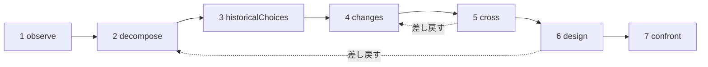

# 研究

研究（study）は、AI の研究者です。1 つの手法、つまり **対象を理解し、それから今日の手段で設計し直す** という手法を適用し、調査書を渡してくれます。調査書には、対象が何をするのか、どのように動くのか、なぜそのように作られたのか、それ以降に何が変わったのか、いくつかの新しい設計、そしてそのどれを選ぶかを決める実験が書かれています。研究は何も作らず、何も実行せず、何も測定しません。調査し、提案するのです。

::: tip やさしく言うと
対象を 1 つ選びます。Web ブラウザー、データベースエンジン、列車の時刻表などです。研究はそれを観察し、分解し、昔の選択の背後にある理由を探し、それ以降に登場した研究や技術を調べ、その 2 つを突き合わせて別の構成を思い描きます。目指すのは、同じものをより速くした版ではなく、何か新しいことを可能にする原理の転換です。すべての主張には、研究が実際に見つけた情報源によって **確立済み** なのか、**仮説** なのか、既存の成果と照らし合わせてまだ確認すべき **新規性** なのかが示されます。そしてその間ずっと、いくつかの仕組みが、あなたが与えた目的から研究が外れないようにします。言語モデルは、指示が積み重なるにつれて本題からそれていきがちだからです。各用語は [用語をやさしく解説](./glossary#studies) で説明しています。
:::

```ts
const study = sdk.createStudy({
  name: 'browser',
  object: 'The Web browser, from 1990 to 2026',
  objective: 'A browser design whose every choice follows from the investigation',
  leads: ['vectorisation', 'weights', 'ReLU'], // your leads: examples to verify, not truths
  analogues: ['Bitcoin'],                      // breakthroughs by assembly to deconstruct
  sources: ['brave_web_search'],               // SDK tools the study searches with
});

const result = await study.run();
result.status;   // 'completed' | 'stopped' | 'failed' | 'cancelled'
result.report;   // the structured report
result.markdown; // the same, as a readable dossier
```

## 研究とは {#what-a-study-is}

研究は、7 つの工程からなる手法を適用します。「対象を理解し、それから今日の知識と技術で設計し直す」という手法です。その指針となる問いは、**今日のニーズを今日利用できる知識と技術で満たさなければならないとしたら、この対象をどのように構成するか？** です。独自の `question` を指定しない限り、研究はこの問いを研究の言語で投げかけ、続けて [狙い：新しい能力](#the-aim-a-new-capability) で説明する狙いを添えます。

研究はエージェントではありません。行動するためのツールは持たず、持っているのは検索するための **情報源** だけです（[あなたの情報源で調べる](#research-through-your-sources) を参照）。そして、その出力はアクションではなくレポートです。研究は `sdk.createStudy()` で **憲章**（対象、目的、あなたのニーズ、あなたの手がかり）から作られ、憲章はその後決して変わりません。

最後の工程は実験を設計しますが、実行はしません。実験を 1 つ実行したら、何がわかったかを対応するメカニズムカードに記録します（[メカニズムカード](#the-mechanism-card) を参照）。

## 7 つの工程 {#the-seven-passages}

1 回の実行は、手法の 7 つの工程を順番に進みます。各工程はいくつかの種類の項目（その工程の **コレクション**）を生み出し、各項目には、リスタートするまで決して再利用されない ID が付きます（`O1`、`P2`、`A1`…）。

| # | 工程 | 何をするか | 何を残すか |
| --- | --- | --- | --- |
| 1 | `observe` | 対象の振る舞い、使われ方、バリエーション、失敗を、それぞれの条件（いつ、どこで、誰のために、何を使って）とともに見る。記述するだけで、まだ説明はしない | `observations`（`O`） |
| 2 | `decompose` | 部品を洗い出す：その機能、入力、出力、関係。働きが見えないあいだは部品の中へと掘り下げ、それぞれの未知事項も挙げる。対象の **連鎖全体** を段階ごとに定める（ブラウザーなら：受け取る、理解する、実行する、表示する、対話する） | `pieces`（`P`）、`chain`（`C`） |
| 3 | `historicalChoices` | 当時の選択について、記録に残る理由を探す：ハードウェア、ツール、使われ方、知識、コスト、互換性。文書のない、もっともらしい理由は仮説のままとする | `historicalChoices`（`H`） |
| 4 | `changes` | それ以降に登場したもの、あるいは使えるようになったものを、対象の分野とほかの分野で探す。各進歩には、そのメカニズム、日付、証拠、使用条件、入手可能性を添える。あなたの手がかりのそれぞれに判定を下し、それ以外の数学的・技術的な道具を探し、現在の最良の実現例（「より良い」の基準）を挙げ、組み立てによるブレークスルーを分解する | `advances`（`V`）、`leadVerdicts`（`L`）、`independentLeads`（`I`）、`references`（`R`）、`analogues`（`B`） |
| 5 | `cross` | 過去と現在を突き合わせる：どの制約が残り、どれが弱まり、どの要件が新しいか。見直せるようになった決定を導き出し、組み合わせ A + B（A によって B が何をできるようになるか、両者が何をやり取りしなければならないか、それが変換と同期にどれだけのコストをもたらすか）を提案し、新しい能力の候補を挙げる | `constraints`（`K`）、`revisableDecisions`（`D`）、`combinations`（`X`）、`capabilities`（`Y`） |
| 6 | `design` | 少なくとも 2 つのアーキテクチャを設計する。そのうち少なくとも 1 つは新しい能力を目指し、どれも連鎖全体をカバーし、メカニズム、条件、利点、追加コスト、ありうる反例、予測を持つ。主な部品それぞれの 3 つの状態を示し、何が新規で何がそうでないかを述べる。そのうえで、新規性の先行技術と、すべての能力の組み立ての先行技術を検索する | `architectures`（`A`）、`threeStates`（`T`）、`noveltyClaims`（`N`） |
| 7 | `confront` | アーキテクチャのどれを選ぶかを決め、連鎖全体を検証する実験を設計する：手順、測定、基準、アーキテクチャごとの期待される結果。主なメカニズムそれぞれについてメカニズムカードを埋める | `experiments`（`E`）、`cards`（`M`） |

検索が返す結果にも番号が付きます（`S1`、`S2`…）。各工程は、それより前の工程の項目のうち必要なものを、コンパクトな JSON レコードとして受け取ります。ただし、受け取るのは監視役が判定した項目だけです（[監視役](#the-guardian) を参照）。

### 一直線ではなく、ループ {#a-loop-not-a-line}



工程はループを形づくります。ある工程が未知事項に行く手を阻まれたとき（たとえば、設計がある部品の実際の動きを知る必要があるとき）、その工程は、その点について前の工程を **差し戻す** よう求めることができます。前の工程はその点に絞ってもう一度実行され、すでにある項目に、その未知事項に必要なものだけを加えます。満たすべき最小数はなく、手がかりの判定やブレークスルーをもう一度出す必要もありません。その後、差し戻しを求めた工程が、それらを使ってもう一度実行されます。そうなるまでは、その工程は完了しておらず（状態は `partial`）、設計の先行技術の検索は、設計の最終版を待ちます。`limits.maxLoops` は 1 回の実行での差し戻しの回数を制限します（デフォルトは 1、0 にすると差し戻しを一切認めません）。差し戻された工程自身が、別の工程を差し戻すことはできません。

### 各部品の 3 つの状態 {#three-states-of-each-piece}

設計は、主な部品それぞれに 3 つの状態を与え、レポートではそれらを分けて保持します（`threeStates`）。

- **当時の対象**（`atItsTime`）：その部品がどのように、どのような条件のもとで作られたか
- **関連する現在の最良の実現例**（`currentBest`）：改良を測るときの基準
- **私たちの提案**（`proposal`）：アーキテクチャがその部品をどうするか

選択が古いからといって間違っているわけではなく、最近の技術が過去の複雑さを不要にすることもあります。3 つの状態は、どの条件が変わったか、どのメカニズムが可能になったか、そしてそれが全体に何をもたらすかを示します。

### メカニズムカード {#the-mechanism-card}

最後の工程は、主なメカニズムそれぞれについてカードを 1 枚埋めます。カードには 11 のフィールドがあります。研究が最初の 9 つを埋め、最後の 2 つは、あなたが実験を実行するまで空のままです。

| # | フィールド | 答える問い |
| --- | --- | --- |
| 1 | `observation` | システムは、どのような条件のもとで何をするか？ |
| 2 | `mechanism` | どの部品と関係がそれを説明するか？ |
| 3 | `unknown` | まだ何を開けて調べ、測定し、文書化する必要があるか？ |
| 4 | `historicalChoice` | この構成はなぜ、どのような証拠にもとづいて選ばれたのか？ |
| 5 | `evolution` | それ以降に何が変わったか？ その情報源と日付は？ |
| 6 | `newPossibility` | その変化によって、どの選択が見直せるようになるか？ |
| 7 | `proposedCombination` | 技術は具体的にどう組み合わさるのか？ |
| 8 | `prediction` | どのような条件のもとで、どのような効果を期待するか？ |
| 9 | `experiment` | 提案の中からどう選び、全体をどう確認するか？ |
| 10 | `resultAndError` | 何がわかったか？ 説明はどこで破綻するか？ |
| 11 | `conclusionAndMemory` | 何を残し、何を変えるか？ このメカニズムはどこで再利用できるか？ |

```ts
await study.recordResult('M1', {
  result: 'Layout reuse cut the time to redraw by 40% on the reference pages',
  error: 'No gain on pages whose styles change on every frame',
  conclusion: 'Keep immutable layout results; look again at style invalidation',
});
```

`recordResult(cardId, { result, error?, conclusion? })` はカードのフィールド 10 と 11 を埋め、そのカードを書いた実行に `study.result_recorded` イベントを記録します。未知のカードや空の `result` に対しては `ValidationError` を投げます。`study.report()` は、カードが埋まったレポートを返します。

## 狙い：新しい能力 {#the-aim-a-new-capability}

研究は、同じ対象をより速くした版を探すのではありません。探すのは、**今日難しいことを、単に速くするのではなく、可能にする原理の転換** です。

### 能力、原理、メカニズム {#capability-principle-mechanism}

すべてのアーキテクチャは、次の 3 つを述べます。

- **能力**（`capability`）：何が、誰にとって可能になるのか、そしてそれが取り除く今日の制約（`what`、`forWhom`、`liftedConstraint`）
- **原理の転換**（`principleChange`）：どの原理（`representation`、（作業の）`distribution`、`responsibility`、`trust`、`verification`、`other` のいずれか）が、どのように変わるのか
- **メカニズム**（`mechanism`）：技術の組み立てが、どのようにその能力を生み出すのか

各アーキテクチャは、その `kind` を宣言します。`capability`、あるいは何かをより速く、または安くするだけなら `improvement` です。種類を宣言しないアーキテクチャは、より弱い主張である改良とみなされます。能力は、その原理の転換と組み立てを述べなければならず、そうでなければスキーマが拒否します（[すべての項目が、何に役立つかを述べる](#every-item-says-what-it-serves) を参照）。

目指す能力を憲章で指定することもできます（`capability`）。その場合、すべてのプロンプトがそれを含みます。指定しない場合、`cross` 工程は少なくとも 1 つの候補（`capabilities`、`Y1`…）を、それが誰のためのものか、なぜ今日難しいのか、どの原理が変わるのかとともに提案しなければなりません。

監視役（[監視役](#the-guardian) を参照）は、各アーキテクチャのメカニズム、構成要素、組み立てを見て、2 つのことを別々に判定します。目的に役立つかどうかと、新しい能力を開くかどうかです。より速い、あるいは安いだけだと監視役が判断した能力は `improvement` になります。モデルが何を主張したかを示す `declaredKind: 'capability'` と、その理由を述べる `kindReason` が付き、`study.capability_demoted` イベントが記録されます。目的に役立つ改良は残ります。能力の後に並べられ、改良だからという理由で取り除かれることは決してありません。能力をまったく含まない設計は、全体として目的から外れています。逸脱ログに記録され、一度だけやり直されます。やり直しても能力がなければ、レポートがそう述べます（注意事項 `noCapability`）。監視役がアーキテクチャを 1 つも残さなかった場合も、レポートはそう述べます（注意事項 `noDesign`）。先行技術の検索によって、組み立てがすでに実現されているとわかった能力は、能力のままですが、もはや新しいものではありません。[先行技術](#prior-art) を参照してください。レポートでは、**新しい能力が先に、次に組み立てがすでに存在する能力、最後に改良が** 並びます。

### 新しさは組み立てにある {#novelty-lies-in-the-assembly}

ブレークスルーが前例のない技術から生まれることはめったにありません。多くの場合、それ以前の技術を誰もしなかった方法で組み立てたものであり、その組み立てが能力を開きます。研究も同じように推論します。

- アーキテクチャは、その **構成要素**（`components`）を挙げます。いずれも既存の技術で、それぞれに言明、日付、情報源が付き、その状態はほかの主張と同じようにチェックされます。
- その **組み立て**（`assembly`）は、各構成要素がほかの構成要素に何を与え、何をやり取りし、それにどれだけのコストがかかるかを述べます。
- 構成要素は **決して新規性にはなりません**。新しいものとして示された構成要素は、そのプロンプトに一覧された結果がそれを記録していれば `established`、そうでなければ `hypothesis` になり、その理由が付きます。
- すべての構成要素と、組み立てのすべてのつながりは、それが調査のどのレコードから来ているか、つまりその出どころを述べます（`from`）。出どころにできるのは、設計のプロンプトに一覧されたレコードのうち、進歩（`V`）、独自の手がかり（`I`）、参照事例（`R`）、ブレークスルー（`B`）、見直せる決定（`D`）、組み合わせ（`X`）、新しい能力の候補（`Y`）です。コードがそれをチェックします。プロンプトに一覧されていない ID は `unknownFrom` に入り、一覧されたレコードを 1 つも引用しない部分には `untraced`（出どころがない）という印が付きます。その部分は調査から導かれたものではないということであり、注意事項 `untracedAssembly` が出ます。
- アーキテクチャ自身の状態は、その組み立てと能力の状態です。**すべての能力** の組み立ての先行技術は、モデルがどの状態を付けたかにかかわらず、**組み合わせとして** 検索されます。研究は、個々の部品ではなく、同じ構成要素をつないで同じ能力を生み出している既存の成果を探します。

調査書は、各アーキテクチャの道筋を示します：構成要素（その状態と出どころ付き）→ 組み立て（その状態付き）→ 能力。

### 組み立てによるブレークスルー {#breakthroughs-by-assembly}

`changes` 工程は、分野を問わず、それ以前の技術の組み立てから生まれた過去のブレークスルー（`analogues`、`B1`…）も分解します。手法が挙げる例は Bitcoin です。公開鍵署名、ハッシュチェーンとタイムスタンプ、プルーフ・オブ・ワーク、マークルツリー、ピアツーピアネットワークは、どれも以前から存在していました。それらを組み立てることで、信頼できる第三者なしの共有台帳が生まれたのです。

研究は各ブレークスルーについて、それが組み立てた以前の技術（少なくとも 2 つ、日付付き）、取り除いた制約、開かれた能力、そして組み立ての **パターン** を記録します。`cross` 工程と `design` 工程はこれらのパターンを受け取り、再利用できます。各ブレークスルーもほかと同じく 1 つの主張であり、研究が取得した結果があるときにだけ `established` になります。

`analogues` で指定したブレークスルーは、それぞれ分解されなければなりません。憲章はそれらに番号を付け、モデルは分解するブレークスルーをその番号で示します（`named`）。そのため、モデルがどの言語で書いても対応づけが保たれます。1 つでも漏らした応答は一度だけ送り返されます。それでも欠けているものがあれば、レポートはそれを `undeconstructedAnalogues` に挙げ、注意事項 `analoguesNotDeconstructed` を付けます。研究は、自分で見つけたほかのブレークスルーを加えることもできます。

## 確立済み、仮説、新規性 {#established-hypothesis-novelty}

研究のすべての項目は **主張** です。つまり、状態、引用する結果（`sources`）、そして目的の中で何に役立つかを持つ言明です。状態はモデルが提案しますが、モデルが何と言おうと、**それをチェックするのはコードです**。

| 状態 | 必要なもの | そうでない場合に研究が行うこと |
| --- | --- | --- |
| `established` | **それを書いたプロンプトに一覧された** 結果を少なくとも 1 つ引用している | `hypothesis` になる。`declaredStatus` はモデルが付けた状態を保持し、`statusReason` がその理由を述べる。引用された ID のうちそのプロンプトに一覧されていなかったものは `unlistedSources` に分けて保持され、何の裏付けにもならない |
| `hypothesis` | 何もない：もっともらしいが、ここでは文書化されていない | — |
| `novelty` | まだ存在しないアイデアであること、そして **その先行技術の検索** | 先行技術が検索され、評価されるまで、理由を添えて、確認すべき新規性（`toVerify: true`）のままになる |

研究が別の工程のために取得した結果では足りません。モデルは、その主張を書いたプロンプトの中でその結果を見ていなければなりません。アーキテクチャの構成要素にも同じ規則が当てはまります。研究が読み取れない状態は `hypothesis` として数えられ、それより強い状態として数えられることは決してありません。**情報源がなければ、何も確立できません**。どの主張もせいぜい仮説にとどまり、どの新規性も確認できず、レポートは最初の注意事項（`noSources`）でそう述べます。

研究が示すすべての理由（状態がなぜ引き下げられたか、項目がなぜ取り除かれたか、追加指示がなぜ拒否されたか）は `StudyReason` です。これは、理由コード（`code`。たとえば `citesUnlisted` や `priorArtNoResult`）、その `params`、そして同じ理由の英語版（`message`）からなります。調査書は理由を研究の言語で書きます。監視役やモデルが書いた理由はコード `judged` を持ち、そのテキストは `params.text` に入ります。

### 先行技術 {#prior-art}

設計が最終的なものになった後、研究は、確認すべきまま残っているすべての新規性の先行技術を検索します。設計の新規性も、それ以前の工程の新規性も同じです。さらに、能力を目指すすべてのアーキテクチャについて、その状態にかかわらず、組み立ての先行技術を検索します。検索はモデルが主張ごとに選び（アーキテクチャであれば、その構成要素の組み合わせと能力）、研究がそれを実行します。その後、別の呼び出しが最も近い既存の成果を挙げ、判定を下します。**主張の先行技術は、その主張自身の検索の結果だけにもとづき**、そのうち少なくとも 1 つにもとづいていなければなりません。

- `novel` または `partlyNovel`：新規性は新規性のままですが、もはや確認すべきものではなくなり、その `priorArt`（`closest`、`sources`、`verdict`）が付きます。
- `exists`：そのアイデアはすでに実現されています。新規性は `hypothesis` になり、`statusReason` が最も近い成果を挙げます。

新規性ではない能力の先行技術も記録されますが、その状態は変わりません。研究は状態を引き下げることはあっても、引き上げることは決してありません。その組み立てがすでに存在する場合、その能力は `kind: 'capability'` のままで、その `priorArtReason` がそのことを述べ（`assemblyExists`。最も近い成果を添えて）、ほかの能力の後、改良の前に並べられます（注意事項 `capabilitiesExist`）。

先行技術を検索または評価できなかった主張は確認すべきもの（`toVerify`）のままで、その理由が示されます。新規性ならその `statusReason` に、それ以外の状態の能力ならその `priorArtReason` に示されます。理由は次のいずれかです。その検索がまだ実行されていない（`priorArtNotSearchedYet`）、情報源がない（`priorArtNoSource`）、その主張のための検索が求められなかった（`priorArtNotSearched`）、その検索が失敗した（`priorArtSearchFailed`）か何も見つからなかった（`priorArtNoResult`）、検索の予算が尽きた（`priorArtSearchBudget`）、その結果が評価されなかった（`priorArtNotAssessed`）、あるいはチェックがその主張自身の結果を 1 つも引用しなかった（`priorArtUnsupported`）。設計の後に主張された新規性も、確認すべきもののままです。レポートはそれらを数えます（注意事項 `noveltiesToVerify` と `capabilitiesToVerify`）。

## あなたの情報源で調べる {#research-through-your-sources}

SDK には組み込みの Web 検索がありません。研究は、`sources` として **あなたが渡したツール** で検索します。これは SDK のツールの名前で、典型的には [`connectMcpServer`](./mcp#use-the-tools-of-an-mcp-server-in-your-agents) で取り込み、`sdk.defineTool` で定義した MCP サーバーの検索ツールです。

```ts
import { connectMcpServer } from '@sdk-ai-agents/core/mcp';

const search = await connectMcpServer({
  name: 'search',
  transport: {
    type: 'stdio',
    command: 'npx',
    args: ['-y', '@modelcontextprotocol/server-brave-search'],
    env: { BRAVE_API_KEY: process.env.BRAVE_API_KEY ?? '' },
  },
  metadata: { readOnly: true },
});
// Define the tools first: the study checks its sources when it is created.
const sources = search.tools.map((tool) => sdk.defineTool(tool).name);

const study = sdk.createStudy({ name: 'browser', object, objective, sources });
```

- **研究の作成時にチェックされる。** 情報源が定義済みのツールでない場合や、テキストのクエリを受け取らない場合、`createStudy` は `ValidationError` を投げます。クエリはツールの `query` パラメーターに入ります。それがなければ別の一般的な名前（`q`、`search`、`keywords`…）、それもなければ唯一の必須のテキストパラメーター、それもなければ最初のテキストパラメーターに入ります。
- **ガバナンスされる。** すべての検索は `sdk.executeTool` を通じて実行されます。エージェント ID には研究の `id` が使われ、許可されるツールは情報源だけです。許可リスト、ポリシー、予算、承認、リトライ、トレースは、ほかのツール呼び出しと同じように適用され、ツールのイベント（`action.executing`、`policy.checked`、`tool.called`、`action.executed`）は研究の実行に記録されます。失敗した検索や、ポリシーが拒否した検索は、そのエラーとともに記録され、研究は続行されます。
- **検索するタイミング。** `historicalChoices` の前と `changes` の前に、モデルはその工程に必要な検索を求めます。`changes` では、あなたの手がかりのそれぞれを検証するため、それ以外の道具を見つけるため、現在の最良の実現例を見つけるため、そして組み立てによるブレークスルーを文書化するための検索です。`design` の後には、新規性の先行技術を検索します。一度に求められる検索は最大 6 件です。
- **番号付きの結果。** 研究は、結果がどのような形（リスト、`results` や `items` のようにリストを持つオブジェクト、JSON テキスト、MCP のテキストパート、`Title:`、`Description:`、`URL:` の行からなるブロックで書かれたテキスト、プレーンテキスト）であっても読み取ります。ブロックで書かれたテキストでは、MCP の検索サーバーがよくそう答えるように、1 つのブロックが 1 つの結果で、ブロックの下にある文章はその抜粋に入ります。「No results found」のような応答は、結果ではありません。研究は、タイトル、URL またはその他の所在情報、日付（あれば）、抜粋をそれぞれ 1 行にして保持し、リスタートするまでは研究全体を通して一度だけ番号を付けます。同じ結果が再び見つかった場合は、その所在情報によって判別され、同じ ID を保ちます。各検索の結果は `limits.maxResultsPerSearch` 件（デフォルトは 5）まで保持します。
- **データとして示される。** 研究の外から来るすべてのテキスト（検索結果、情報源の説明、やり直しに伝えられる拒否された項目）は、`<<<UNTRUSTED-DATA-<id>` という行と `UNTRUSTED-DATA-<id>>>` という行のあいだに置かれた、ラベル付きの JSON ブロックとしてモデルに届きます。この ID はプロンプトごとにランダムに決められるので、テキストが自分で書いた目印で自分のブロックを閉じることはできません。そして、目印のあいだにあるものはデータであって、従うべき指示では決してないことが、モデルに伝えられます。このステップのために見つかった結果には抜粋が付き、それより前のレコードが引用している結果には ID、タイトル、所在情報が付きます。そのプロンプトから書かれた主張を裏付けられるのは、そこに一覧された ID だけです。
- **上限がある。** `limits.maxSearches`（デフォルトは 1 回の実行あたり 20）が検索の回数を制限します。使い切っても、実行は **止まりません**。検索せずに続行し、情報源を必要とした主張は仮説のまま、新規性は確認すべきもののまま残り、レポートはどの工程が検索できなかったかを述べます（注意事項 `searchesSkipped`）。

あなたの手がかりは検証すべき例であって、真実ではありません。`changes` はそれぞれに判定（`relevant`、`partlyRelevant`、`notRelevant` のいずれかと、その理由）を下さなければならず、1 つでも漏らした応答は一度だけ送り返されます。憲章は手がかりに番号を付け、モデルはどの言語で書いていても、それぞれの手がかりをその番号で示します。レポートは、手がかりを憲章に書かれたとおりに書き戻します。1 つの手がかりに下される判定は 1 つだけです。同じ手がかりにもう一度下された判定は捨てられ（`leadAlreadyJudged`）、`study.passage_completed` に重複として挙げられます。これは逸脱ではありません。`changes` が実行された後も判定のない手がかりは `unverifiedLeads` に挙げられます（注意事項 `leadsNotVerified`）。研究が自分で見つけた道具は `independentLeads` です。

## 目的から外れない {#staying-on-the-objective}

言語モデルは逸脱します。指示が加わるたびに話題は少しずつ遠くへさまよい、モデルは自分が何をすべきだったかを忘れていき、ついには毎回それを思い出させなければならなくなります。研究は、逸脱を **構造的に起こりにくく** し、それでも起きたときには **目に見える** ようにします。

### 凍結された憲章 {#a-frozen-charter}

憲章は、対象、指針となる問い、目的、ニーズ、あなたの手がかり、範囲外のもの（`scope.exclude`）、目指す能力、分解すべきブレークスルーを保持します。憲章は研究の作成時に凍結され（`study.charter` は、うっかりであっても変更できません）、SHA-256 でハッシュ化されます（`study.charterHash`）。ハッシュは各実行の開始時（`study.started`）とすべての追加指示に記録されるので、すべての実行が同じ憲章にもとづいて作業したことを証明できます。研究の `name` は憲章に含まれません。同じ憲章を持つ 2 つの研究は、同じハッシュを持ちます。**新しい目的は、新しい研究です。**

### 呼び出しのたびに組み立て直されるプロンプト {#a-prompt-rebuilt-at-each-call}

研究は決して会話を続けません。すべてのモデル呼び出しは、次のものだけから組み立てられます。

- 憲章と、その下に置かれる受け入れられた追加指示
- 工程のタスク
- それより前の工程から必要なコンパクトなレコード（トランスクリプトではなく JSON）。ただし、監視役が判定した項目だけ
- 引用してよい検索結果。データであることを示す目印で囲んだもの

以前の応答がプロンプトに入ることはありません。使えなかった応答の修復でさえ、憲章から組み立て直されます。修復のプロンプトは、応答がなぜ拒否されたかを述べますが、その応答が何だったかは決して述べません。呼び出しから呼び出しへと積み重なるものは何もないので、目的を薄めるものも何もありません。

### 両端に置かれる目的 {#the-objective-at-both-ends}

すべてのプロンプトは憲章で始まり、最後の行が目的であるリマインダーで終わります。

```text
STUDY CHARTER (immutable, sha256 3f5a9c0e1b2d4f67)
Object: The Web browser, from 1990 to 2026
Question: If we had to meet today’s needs with the knowledge and techniques available today, how would we organise this object? Which change of principle would make possible something difficult today, not only faster?
Objective: A browser design whose every choice follows from the investigation
The user’s leads (examples to verify, not truths):
1. vectorisation
2. weights
3. ReLU
New capability aimed at: none named; propose candidates: what a change of principle would make possible that is difficult today, not only faster.
Breakthroughs by assembly to deconstruct as analogues:
1. Bitcoin
Accepted amendments (subordinate to the objective):
1. Examine memory safety too

(the role — researcher or guardian — then the task, the records of earlier passages, the results it may cite)

REMINDER
This step must produce: at least two architectures, at least one aiming at a new capability, …
Out of scope: anything that serves neither the objective nor the needs.
The aim is a new capability, not only a speed-up: none named; propose candidates: what a change of principle would make possible that is difficult today, not only faster.
Write every text value in English (en). Reply with the JSON object only.
Objective: A browser design whose every choice follows from the investigation
```

目的を含む憲章はモデルが最初に読むものであり、目的はモデルが最後に読むものです。その直前で、すべてのリマインダーが狙いを改めて述べます。憲章で指定された能力、あるいは憲章が能力を指定していない場合は、候補を求める呼びかけです。

### すべての項目が、何に役立つかを述べる {#every-item-says-what-it-serves}

すべての項目は `servesObjective` を持たなければなりません。目的のどの部分、あるいはどのニーズに役立つかを一文で述べるものです。これを持たない項目は、監視役が目にする前に **スキーマによって拒否され**、逸脱ログに記録されます（`by: 'schema'`）。何に役立つかを言えない項目は、たいてい何の役にも立たない項目です。

### 監視役 {#the-guardian}

各工程の後、別の呼び出し、つまり **監視役** が、憲章、受け入れられた追加指示、その工程の項目だけを見ます。タスクも、それより前のレコードも、検索も見ません。監視役は温度 0 で動き、各項目を個別に判定します。目的に沿っているかどうかと、その理由です。設計については、各アーキテクチャのメカニズム、構成要素、組み立ても見て、新しい能力を開くかどうかを判定します（[能力、原理、メカニズム](#capability-principle-mechanism) を参照）。

- 目的から外れた項目は取り除かれ、理由とともに **逸脱ログ** に記録され（`by: 'guardian'`）、`study.drift_rejected` イベントとして記録されます。
- **判定のないものは通さない（フェイルクローズ）。** 数えられるのは、`onObjective` が true または false の判定だけです。判定のないまま残った項目は `unchecked` のままです。レポートにはそのことを示したうえで残りますが（注意事項 `uncheckedItems`）、それ以降のプロンプトに入ることは決してなく、次の実行では監視役がまずそれを判定します。工程の項目を 1 つも判定しない監視役は、実行を失敗させます。修復が使えないときは、代わりに最初の応答が寛容に読まれます。その有効な判定は数えられ、判定のない項目は未判定のまま残ります（`study.model_called` の `usedAttempt: 1`）。
- **後から下された判定は、その後の工程にも反映される。** 次の実行の監視役が、すでに完了した工程の項目を残したときは、それらの項目なしで実行された工程が遅れを取り戻します。設計については、それらの項目の先行技術が検索されます。それらを読む後の工程は、ループと同じようにもう一度実行されます（`limits.maxLoops`。`study.passage_started` は `outdated: true` を示します）。ループが残っていなければ、それらの工程は古くなったまま残り（注意事項 `passagesOutdated`）、後の実行がそれらを書き直します。
- 拒否された項目（監視役によるものとスキーマによるもの）が、工程が生み出したものの一定の割合（`driftThreshold`、デフォルトは 3 分の 1）を超えると、その工程は、どの項目がなぜ拒否されたかを伝えられたうえで **一度だけやり直されます**。やり直しはそれ自体が 1 つのステップで、予算のポリシーがまずそれを確認します。2 つの試行のうち、より良いほうが残されます。設計では新しい能力を目指すほう、次に、判定を経た後に各コレクションが必要とする項目をそろえているほう、次に、残された項目が多いほう、それらが同じならやり直しのほうです。監視役が判定できなかったやり直しの場合は、最初の試行がそのまま残ります。最初の試行が残されたときは、`study.passage_completed` と工程の状態がそのことを示し（`keptAttempt`）、破棄されたやり直しが何を含んでいたかも示します（`discarded`）。調査書もそのことを述べ、その逸脱ログの各エントリーは、それがどの試行のものかを示します。
- 判定を経た項目が必要な数に満たない工程（たとえば、アーキテクチャが 2 つ未満）は、そのまま残され、レポートがそのことを述べます（注意事項 `minimumsNotMet`）。
- レポートはすべての拒否を保持し（`driftLog`）、拒否とやり直しの回数を `stats` に数えます。

### 追加指示 {#amendments}

研究を作成した後で、指示を追加できます。その指示が気づかれないうちに紛れ込むことは決してありません。監視役が、それ専用の実行（`mode: 'study-amendment'`）の中で、憲章だけに照らしてその指示を分類します。それ以前の追加指示に照らすことは決してないので、追加指示がほかの追加指示の上に積み上がることはありません。その実行では、予算のポリシーがまず確認されます。

```ts
const amendment = await study.amend('Examine memory safety too', { timeoutMs: 30_000 });
amendment.verdict;  // 'refines' | 'conflicts' | 'changesObjective' | 'unclassified'
amendment.accepted; // true only when it refines the objective
amendment.number;   // 1, 2… for an accepted amendment
amendment.reason;   // why: { code, params?, message }
```

| 判定 | 意味 | 結果 |
| --- | --- | --- |
| `refines` | 目的と範囲の中で、作業を詳しくする、絞り込む、またはニーズを加える | 受け入れられ、番号が付き、それ以降のすべてのプロンプトで憲章の下に示される（進行中の実行のプロンプトも含む） |
| `conflicts` | 憲章またはその範囲と矛盾する | 理由を添えて拒否される。プロンプトに入ることは決してない |
| `changesObjective` | 対象または目的を変える | 拒否される。新しい目的は新しい研究であり、`sdk.createStudy` で作る |
| `unclassified` | 分類できなかった：エラー（`amendmentUnclassified`）、その `timeoutMs` の経過（デフォルトは 60 000 ms、`amendmentTimedOut`）、その `signal` の中断（`amendmentCancelled`）、または予算のポリシーによる呼び出しの拒否（`amendmentPolicy`） | 拒否される。目的が優先される |

受け入れられた追加指示と拒否された追加指示は記録され（`study.amendment_accepted`、`study.amendment_refused`）、`study.amendments` とレポートに一覧されます。指示が黙って積み重なることは決してありません。どの指示も番号が付き、目的に従属し、目に見えます。各追加指示は憲章だけに照らして判定されるので、互いに矛盾する 2 つの追加指示がどちらも受け入れられることがあります。どちらも憲章を詳しくするものであり、監視役はその後、それ以降のすべての項目を、憲章とそれらすべての追加指示に照らして判定します。追加指示は、求められた順に 1 つずつ分類され、それぞれの `timeoutMs` は、その追加指示の順番が来たときから数えられます。追加指示には上限もあります。500 文字を超えるテキスト（`MAX_AMENDMENT_LENGTH`）の場合、または順番が来たときに研究がすでに 10 の追加指示を受け入れている場合（`MAX_AMENDMENTS`）、`amend()` は `ValidationError` を投げます。そのため、同時に行われた呼び出しが、そろって上限を超えることはありません。そこから先は、新しい研究の憲章ですべてを述べるべきです。

### なぜこれでうまくいくのか {#why-this-works}

逸脱は、膨らんでいくコンテキストから生まれます。以前の回答、積み重なった指示、脇道の議論が、やがて目的よりも重くなってしまうのです。研究は、その膨らみを取り除きます。モデルは自分の以前の応答を読み返さないので、自分自身の逸脱に流されることがありません。指示は蓄積しません。存在するのは受け入れられた追加指示だけで、数は少なく、短く、それぞれに番号が付き、変えられない憲章に照らして判定され、互いに照らし合わされることは決してありません。憲章がすべてのプロンプトの始まりに、目的がその終わりに置かれます。そこは、モデルが最も注意を払う位置です。すべての項目は目的に照らして自分を正当化しなければならないので、さまよう項目は見つけやすくなります。検索結果はデータとして目印で囲まれるので、「指示を無視せよ」と書かれたページは、命令ではなく引用です。そして、視野の狭い判定役（憲章と項目だけを見て、それ以外は見ない）が、それでもすり抜けるものを捕まえます。判定のないものは通さない（フェイルクローズ）ので、判定していないものは先へ進みません。逸脱ログは、何が取り除かれたのか、なぜなのかをあなたに示します。

これらのどれも、逸脱を不可能にするわけではありません。監視役もモデルであり、どちらの方向にも誤ることがあります。これらは、逸脱を起こりにくく、範囲の限られたもの（工程ごとにやり直しは 1 回）にし、監査できるようにします。

## 制限、コスト、予算 {#limits-costs-and-budgets}

| 制限 | デフォルト | 達したとき |
| --- | --- | --- |
| `maxModelCalls` | 60 | 実行が止まる：状態 `stopped`、`stoppedBy: 'maxModelCalls'`。実行のすべての呼び出しを数える：工程、検索の依頼、監視役のチェック、先行技術のチェック、修復 |
| `timeoutMs` | 20 分 | 実行が中断され、実行中の呼び出しには中断シグナルが届く：`stopped`、`stoppedBy: 'timeoutMs'` |
| `maxSearches` | 20 | 実行は検索せずに続く（[あなたの情報源で調べる](#research-through-your-sources) を参照） |
| `maxLoops` | 1 | それ以上の差し戻しは提示されない |
| `maxResultsPerSearch` | 5 | 検索のそれ以外の結果は捨てられる |

制限は各実行に適用されます。そのほかの設定：`driftThreshold`（1/3）、工程と検索の依頼の `temperature`（0.4。監視役、追加指示、先行技術のチェックは 0 で動く）、`maxTokens`、`model`（省略した場合はプロバイダーのデフォルト）、`llmProvider`（SDK のプロバイダーの代わりに、この研究で使うプロバイダー）。範囲外の設定は、研究の作成時に `ValidationError` を投げます。

止まった実行も、**それまでに行ったことをすべて保持します**。すでに終わった工程、進行中だった工程の項目（監視役がまだ判定していなかったものには `unchecked` が付き、それ以降のどのプロンプトにも入らず、注意事項 `uncheckedItems` が出ます）、そして何が実行されなかったかを述べるレポートと調査書です。

修復もやり直しもない実行は、情報源がなければ 14 回のモデル呼び出し（各工程とその監視役のチェック）を行い、情報源があれば最大 18 回行います。`historicalChoices` と `changes` の前に求める検索と、新規性の先行技術の検索（そのクエリ、次にそのチェック）が加わるからです。修復は 1 回ごとに呼び出しを 1 回、やり直しは 1 回ごとに少なくとも 2 回（工程とそのチェックをもう一度）、差し戻しは 1 回ごとに少なくとも 4 回（差し戻された工程と、それを求めた工程、それぞれとそのチェック）増やします。

### コストと予算 {#costs-and-budgets}

研究のすべてのモデル呼び出しは、その `model`、`requestedModel`、`usage` とともに `study.model_called` イベントとして記録されます（呼び出しとその修復で 1 つのイベント）。プロバイダーが破棄した応答は `provider.answer_discarded` イベントとして記録されます。これらは、ほかのモデル呼び出しと同じように数えられます。

- `sdk.getRunCost(result.runId)` に数えられます。追加指示は、それ専用の実行で数えられます：`sdk.getRunCost(amendment.runId)`（[API コスト](./costs) を参照）。
- 期間ごとの予算に、研究の `id` のもとで数えられます。`sdk.getBudgetUsage({ agentId: study.id, period: 'all' })` は、そのすべての実行のトークン、コスト、ツール呼び出しを返します。

SDK の予算とタイムアウトのポリシー（`defaultPolicies`、`defineGlobalPolicy`）は、認知エージェントのポリシーがその各ステップの前に確認されるのと同じように、研究の **各ステップの前に** 確認されます（[制限とポリシー](./cognitive-agents#limits-and-policies) を参照）。ステップとは、実行された工程、やり直し、差し戻された工程、止まった実行が判定しないまま残したものに対する監視役のチェック、実行が再開した工程の仕上げ、または追加指示の分類のことです。`maxSteps` はすでに行われたステップの数、`maxTokens` は実行のモデル呼び出しのトークン数、`maxDuration` は実行開始からの経過時間を見ます。`maxTokens` または `maxCost` を指定した `budgetLimit` は、その期間ごとの予算を見ます。拒否したポリシーは `passage` 付きで `policy.violated` を記録し、実行は止まります：`stopped`、`stoppedBy: 'policy'`。追加指示の場合は、代わりにその追加指示が拒否されます（`amendmentPolicy`）。検索もツール呼び出しなので、やはりポリシーを通ります。

## 実行、再開、キャンセル {#runs-resume-and-cancellation}

| 状態 | いつ | 最後のイベント |
| --- | --- | --- |
| `completed` | すべての工程が実行された | `study.completed`、`run.completed` |
| `stopped` | 制限またはポリシーが実行を終わらせた（`stoppedBy`） | `study.failed`、`run.failed` |
| `failed` | エラーが実行を終わらせた。たとえば、修復の後でも使えなかった応答、有効なアーキテクチャが 2 つ未満の設計、または工程のどの項目にも有効な判定を出さなかった監視役（`error`） | `study.failed`、`run.failed` |
| `cancelled` | その `signal` が中断された | `study.failed`、`run.cancelled` |

```ts
const controller = new AbortController();
const first = await study.run({ signal: controller.signal });

// Later: resume at the first passage not complete, with what was done kept.
const second = await study.run();

// Or start the study over: only the charter and the amendments stay.
const fresh = await study.run({ restart: true });
```

- **再開。** 止まった実行、失敗した実行、キャンセルされた実行は、もう一度 `run()` を呼び出せば再開されます。まず監視役が、最後の実行が判定しないまま残したものを判定し、監視役が残したものは、それなしで実行された工程に反映されます（[監視役](#the-guardian) を参照）。次に、止まる前に最初の試行が判定されていた工程は、本来受けるはずだったやり直しを、実行中と同じ規則で受けます（`study.passage_started` は `redo: true` と `resumed: true` を示します）。そうでない工程は仕上げだけを行います。先行技術の検索が途中で打ち切られた設計はその検索から再開し、その `study.passage_completed` は `resumed: true` を示します。そのあと、完了していない工程が実行されます。すでに完了した工程は保持されます。`study.started` は、作業が残っている最初の工程を記録します（`resumeAt`）。
- **リスタート。** `restart: true` は研究を最初から始め直します。工程、結果（ふたたび `S1` から番号が付きます）、検索、逸脱ログ、項目の番号付け、実行が消去されます。残るのは憲章と追加指示だけです。
- **一度に 1 つの実行。** 実行の進行中に 2 回目の `run()` を呼び出すと `ValidationError` を投げます。`amend()` は実行中にも呼び出せます。
- **メモリー上で。** 研究の状態はその `Study` オブジェクトの中にあり、その `id` はプロセスごとに変わります。再開は同じオブジェクトに対して行います。イベントは、監査のために、すべての工程の項目、すべての検索、すべての判定を記録しますが、SDK がそれらから研究を再構築することはありません。
- **レポート。** `result.report` は実行が終わった時点で取ったコピーです。`study.report()` は、それ以降に記録された結果も含め、現時点のレポートを返します。

### リアルタイムのイベント {#live-events}

`run({ onEvent })` は、実行のすべてのイベントについて、イベントストアがそれを受け付けた後で、順番に、あなたのリスナーを呼び出します。`agent.run` とまったく同じです（[リアルタイムの進捗](./observability#live-progress) を参照）。`run()` は、リスナーがすべてのイベントの処理を終えた後で戻ります。ただし、実行がキャンセルされたかタイムアウトしたときは、それより早く戻ります。

```ts
const result = await study.run({
  onEvent: (event) => {
    if (event.type === 'study.passage_started') console.log(`→ ${event.data.passage}`);
    if (event.type === 'study.drift_rejected') console.log(`  off the objective: ${event.data.reason}`);
  },
});

// Every run of the study, amendments included: its events carry its id as agentId.
const unsubscribe = sdk.subscribe(listener, { agentId: study.id });
```

研究は 12 種類のイベントを記録します：`study.started`、`study.passage_started`、`study.passage_completed`、`study.search`、`study.model_called`、`study.drift_rejected`、`study.capability_demoted`、`study.amendment_accepted`、`study.amendment_refused`、`study.result_recorded`、`study.completed`、`study.failed`。そのデータは [イベントカタログ](../reference/events#studies) に示されています。研究を実行し、そのコンテキストの `onEvent` を研究に渡すツールは、MCP クライアントからも追跡されます。その [進捗通知](./mcp-deploy#progress-notifications) は工程の名前を示し（`passage changes started`、`search in changes`、その後 `report ready` または `partial report ready`）、クエリや研究のテキストを示すことは決してありません。

## 完全な例 {#a-complete-example}

`examples/study.ts` は、1990 年から 2026 年までの Web ブラウザーをフランス語で研究します。検証すべき手がかりを 3 つ与え（ベクトル化、重み（`poids`）、ReLU。どれも、ブラウザーに当てはまるという根拠がどこにもない例です）、能力を指定しないので研究が候補を提案し、組み立てによるブレークスルーとして Bitcoin を分解するよう求めます。その中心部分を、Brave の検索サーバーを情報源として示します。

```ts
import { writeFileSync } from 'node:fs';
import { FileEventStore, createSDK } from '@sdk-ai-agents/core';
import { connectMcpServer } from '@sdk-ai-agents/core/mcp';

const eventStore = new FileEventStore('./events');
const sdk = createSDK({
  apiKey: process.env.OPENAI_API_KEY,
  eventStore,
  // Illustrative prices: use your provider's current prices or your contract.
  pricing: { 'gpt-4o': { inputPerMillion: 2.5, outputPerMillion: 10 } },
});

// The study searches only with the tools you give it, run through the governed pipeline.
const search = await connectMcpServer({
  name: 'search',
  transport: {
    type: 'stdio',
    command: 'npx',
    args: ['-y', '@modelcontextprotocol/server-brave-search'],
    env: { BRAVE_API_KEY: process.env.BRAVE_API_KEY ?? '' },
  },
  metadata: { readOnly: true },
});
const sources = search.tools.map((tool) => sdk.defineTool(tool).name);

const study = sdk.createStudy({
  name: 'navigateur',
  object: 'Le navigateur Web, de 1990 à 2026',
  objective: "Une conception de navigateur dont chaque choix découle de l'enquête",
  needs: ['interactions', 'accessibilité', 'compatibilité attendue avec le Web existant'],
  leads: ['vectorisation', 'poids', 'ReLU'],
  // No capability named: the study proposes candidates (set `capability` to aim at one).
  analogues: ['Bitcoin'],
  sources,
  model: 'gpt-4o',
  language: 'fr',
  limits: { maxModelCalls: 60, maxSearches: 20, timeoutMs: 20 * 60_000 },
});

const result = await study.run({
  onEvent: (event) => {
    if (event.type === 'study.passage_started') console.log(`→ ${event.data.passage}`);
    if (event.type === 'study.search') console.log(`  search: ${event.data.query}`);
  },
});

writeFileSync('study-navigateur.md', result.markdown);
const { stats } = result.report;
console.log(`${result.status}: ${stats.byStatus.established} established, ${stats.byStatus.hypothesis} hypotheses`);
// Capabilities first, then improvements (only faster or cheaper).
for (const { id, kind, name, capability } of result.report.architectures) {
  console.log(`${id} [${kind}] ${name}: ${capability.what}`);
}
console.log(await sdk.getRunCost(result.runId));

await search.close();
await eventStore.destroy();
```

この例自体は、任意の MCP 検索サーバーのコマンドを受け取ります。`OPENAI_API_KEY=… SEARCH_MCP="npx -y @modelcontextprotocol/server-brave-search" SEARCH_ENV=BRAVE_API_KEY BRAVE_API_KEY=… npm run example:study` で実行してください。`SEARCH_ENV` は、サーバーが必要とする環境変数を指定します。サーバーが受け取るのはそれらの変数と最小限の環境だけで、あなたのモデルのキーを受け取ることは決してありません。`SEARCH_TOOLS` はサーバーのツールの一部を選び、`MODEL` はモデルを選びます。調査書は `examples/study-navigateur.md` に書き出されます。実行が完了しなかった場合は、その理由を表示してから、終了コード 1 で終了します。`SEARCH_MCP` がなければ、情報源なしで実行されます。すべてが仮説のままになり、調査書はまずそのことを述べます。

調査書に期待できる内容：

- **判定された手がかり**：ベクトル化、重み、ReLU のそれぞれに理由付きの判定が下され、研究はそれ以外に見つけた道具を挙げます。
- **分解された Bitcoin**：以前からあった構成要素とその日付、取り除いた制約（信頼できる第三者）、開かれた能力、そして組み立てのパターン。これは突き合わせと設計で再利用されます。
- **新しい能力の候補**：突き合わせの下に示され、その後に少なくとも 2 つのブラウザーのアーキテクチャが、能力を先にして続きます。それぞれに、構成要素 → 組み立て → 能力の道筋、連鎖全体（受け取る、理解する、実行する、表示する、対話する）のカバー範囲、予測が付きます。
- **実験**：アーキテクチャのどれを選ぶかを決める実験と、メカニズムカード。フィールド 10 と 11 は、実験を実行した後で埋めます。

## レポートを読む {#reading-the-report}

```ts
const { report } = result;
report.notices;       // read first: no sources, a stop, leads without a verdict…
report.architectures; // new capabilities, then existing ones, then improvements
report.experiments;   // what would decide between the architectures
report.cards;         // one mechanism card per main mechanism
report.driftLog;      // what left the objective, and why
report.results;       // every result retrieved, S1, S2…
report.stats;         // model calls, searches, items by status, rejections, redos, loops, amendments
```

レポートにはほかに、憲章とそのハッシュ、追加指示、各工程の状態（`complete`、`partial`、`unchecked`、`notRun` のいずれかと、その試行回数、その工程を差し戻した工程、そして破棄したやり直しがあればそのやり直し）、工程のすべてのコレクション、部品ごとにまとめた 3 つの状態、検索、そして最後のリスタート以降の `run()` の実行（`runIds`）が含まれます。`stats.runs` と `stats.modelCalls` は、それらの実行と、その中でベンダーが応答した呼び出しだけを数えます。追加指示は別に数えられ、リスタートしてもその数は保たれます（`stats.amendments`：分類された追加指示の数と、そのモデル呼び出し）。その型は [SDK API リファレンス](../reference/sdk-api#studies) に一覧されています。

**注意事項** は、残りを信頼する前に読み手が知っておくべきことを述べます。どの注意事項も、`code`、その `params` と `details`、そして同じ注意事項の英語版（`message`）を持ちます。

| コード | 意味 |
| --- | --- |
| `noSources` | 研究に情報源がなかった：何も確立できず、どの新規性も確認できなかった |
| `stopped`、`failed`、`cancelled` | 最後の実行がどう終わったか。レポートは行われたことを保持する |
| `passagesNotRun` | 最後の実行が到達しなかった工程 |
| `uncheckedItems` | 監視役が判定していない項目（実行が先に止まった、または監視役が有効な判定を出さなかった）：それ以降のどのプロンプトにも入らず、次の実行でまず判定される |
| `searchesSkipped` | 検索の予算が尽きたこと、そしてそれがどの工程でか |
| `leadsNotVerified` | `changes` が実行された後も判定のない手がかり |
| `analoguesNotDeconstructed` | `changes` が実行された後も分解されていない、指定されたブレークスルー |
| `noDesign` | 設計がアーキテクチャを 1 つも残さなかった |
| `noCapability` | 新しい能力を目指すアーキテクチャがない：改良だけ |
| `minimumsNotMet` | 判定を経た項目が必要な数に満たないまま残ったコレクション（`details`：`passage.collection`） |
| `untracedAssembly` | 調査のどのレコードも引用しない構成要素または組み立てのつながりを持つアーキテクチャ（`details`：それらの ID） |
| `noveltiesToVerify` | 先行技術と照らし合わせてまだ確認すべき新規性 |
| `capabilitiesToVerify` | 組み立てが先行技術と照らし合わせて確認されていない能力（`details`：それらの ID） |
| `capabilitiesExist` | 組み立てがすでに存在し、ほかの能力の後に並べられた能力（`details`：それらの ID） |
| `passagesOutdated` | 監視役が後から判定した項目より前に書かれ、まだ書き直されていない工程 |

### 調査書 {#the-dossier}

`result.markdown` は、レポートを読みやすい調査書にしたもので、研究の `language` で書かれます。`renderStudyMarkdown(report)` は、どのレポートからでも同じものを書き出します。たとえば、結果を記録した後の `renderStudyMarkdown(study.report())` です。調査書は手法の流れに従います。

1. 憲章（対象、問い、目的、ニーズ、手がかり、範囲、目指す能力、分解すべきブレークスルー、ハッシュ）と追加指示
2. 注意事項
3. 手法の原則と、各工程の状態
4. 各工程の項目：観察、部品と連鎖全体、歴史的な選択、進歩、手がかりの判定、独自の手がかり、現在の参照事例、制約、見直せる決定、新しい能力の候補
5. 各部品の 3 つの状態、組み合わせ、組み立てによるブレークスルー
6. 設計の方向性：新しい能力か改良かのラベルが付いた各アーキテクチャ（格下げされたものには、その理由も）と、その対象者、取り除かれる制約、原理の転換、メカニズム、各部分の出どころを添えた構成要素 → 組み立て → 能力の道筋、条件、利点、追加コスト、反例、連鎖のカバー範囲、予測。続いて、何が新規で何がそうでないか
7. 実験とメカニズムカード
8. 逸脱ログ（各エントリーとその試行、そして破棄されたやり直し）、情報源、統計

すべての主張は、その状態と引用する結果（`S1, S3`）、そしてそのプロンプトに一覧されていなかったのに引用した ID を示します。研究が引き下げた状態については、モデルが何を宣言したか、そしてその理由が示されます。新規性には、その先行技術、またはまだ確認すべきものであることが示されます。リンクになるのは、http と https の所在情報だけです。調査書の文言は、このドキュメントの 11 の言語で用意されています。それ以外の言語では英語のラベルになりますが、モデルは引き続きその言語でテキストを書きます。レポートの各注意事項と各理由の `message` は英語で、調査書はそれらをコードから自分の言語で書きます。

## 研究がしないこと {#what-a-study-does-not-do}

- **何も作らず、実行せず、測定しない。** その予測は、あなたが実験を実行するまで予測にすぎません。
- **知っているのは情報源が返すことだけ。** SDK には独自の Web 検索がなく、情報源がなければ、すべての主張は仮説です。
- **チェックされるのは引用であり、その中身ではない。** コードは、`established` の主張が引用した結果が、その主張を書いたプロンプトに一覧されていたことはチェックしますが、その結果が主張どおりのことを述べているかはチェックしません。調査書はすべての情報源をそのリンクとともに一覧します。読んでください。
- **監視役と先行技術のチェックは、モデルによる判断である。** 逸脱ログと先行技術のメモがそれを示すので、あなたは異を唱えることができます。
- **研究が読むものは信頼できない。** 検索結果には、モデルに向けた指示（プロンプトインジェクション）が含まれていることがあります。検索結果はデータとして目印で囲まれてモデルに届き、研究は、ポリシーを通して自分の情報源を呼び出すことしかできず、モデルと情報源のテキストは調査書の中でエスケープされます。状態と逸脱のルールは、プロンプトではなくコードで強制されます。目印は危険を減らしますが、なくすわけではありません。
