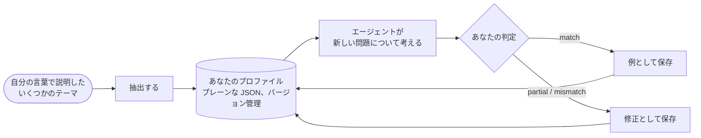

# 思考者プロファイル：特定の人物のように推論する

::: tip SDK は私のように推論できますか？
**はい。特定の人物の推論の仕方を模倣できます。** 認知エージェントは、「あなたの」注意の順序に従い、「あなたの」優先事項を比べ、「あなたの」反射的な判断を当てはめ、「あなた」なら却下するものを却下できます。エージェントはこれを、あなたが自分の言葉で説明したいくつかの問題から学びます。どこで間違えたかを伝えるたびに、その修正が指示に加えられ、あなたの一致度が、エージェントが近づいているかどうかを示します。

模倣するのは人そのものではなく、**推論の仕方** です。あなたが書き留めていないことは知りませんし、あなたの代わりに決めることもありません。SDK は、あなたに対してどこまで近づけるかを主張しません。実行のたびに、エージェントの回答にあなたが与える一致度の割合として、**あなたが測定する** のです。
:::

{.illustration}

## 「あなたのように推論する」とは {#what-reasoning-like-you-means}

| 模倣するもの | 模倣しないもの |
| --- | --- |
| 問題を見る **順序**（まず本当に何ができるようになるのか、次にその限界…） | あなたの **知識**：あなたが知っていても書き留めていないこと。ただし、コンテキストや観測として渡した場合は別 |
| あなたの **優先事項**（あなたにとって最も重要なものから順に） | あなたの **記憶** や人生：知っているのは、あなたが渡したサンプル、修正、コンテキストだけ |
| あなたの **反射的な判断**（「サービスが有料なら、まず無料の代替を探す」） | 言葉にしたことのない直感 |
| あなたがアイデアを **却下** する理由 | あなたの **責任**：その回答は、あなたならどう考えるかの予測であって、あなたに代わって下された決定ではない |
| あなたの **リスクへの許容度** | 世界についてのあなたの確信：どの認知エージェントとも同じように、主張には証拠が必要 |
| あなたが **修正した間違い**：繰り返さないよう指示される | |

## 仕組みを一歩ずつ {#how-it-works-step-by-step}



### ステップ 1：いくつかのテーマを自分の言葉で説明する {#step-1-explain-a-few-topics-in-your-own-words}

**サンプル** とは、あなたが推論した 1 つのテーマを、思いついたとおりに書いたものです。まとまっていなくてもかまいません。3 つの部分からなります。

| フィールド | 書くこと | 例 |
| --- | --- | --- |
| `topic` | テーマを短く | 「キッチンの片付けだけをするロボット」 |
| `reasoning` | どう取り組んだか：最初に何を見たか、何を確認したか、何に迷ったか、それはなぜか | 「実際には何をするのか？ 1 部屋だけなので、限界は汎化にある。数例から別の部屋を学習できるだろうか？…」 |
| `conclusion` | 何を結論としたか、何をするか（任意。ただし較正用の例になる） | 「小さな適応ループを作り、2 つ目の部屋でテストする」 |

1 つのテーマについての多数のサンプルよりも、**さまざまな** テーマについての 5〜10 個のサンプルのほうがうまくいきます。抽出器はテーマを **またいで** 繰り返し現れるものを探すので、一度しか見られないパターンは弱いのです。

### ステップ 2：プロファイルを抽出する {#step-2-distill-your-profile}

```ts
const profile = await sdk.distillThinkerProfile({
  id: 'nicolas',
  name: 'Nicolas',
  model: 'gpt-4o',
  samples: [
    {
      topic: 'Typed decision APIs like Jev',
      reasoning:
        'What does it really allow? Then the limits: closed, US-only, paid. Is there an open clone? ' +
        'Could it become the controller of my agents? I would benchmark it on my own traces first.',
      conclusion: 'Use an open clone as the controller and benchmark it against Jev',
    },
    { topic: 'World models', reasoning: 'Structure beats scale. Test on a small chaotic system before anything big.' },
  ],
});
```

実際に起きることは次のとおりです。

1. サンプルがチェックされます。それぞれにテーマと推論が必要です。
2. 1 回の言語モデル呼び出しが「認知アナリスト」の役を演じます。探すのは、あなたの意見ではなく、あなたの推論に **繰り返し現れる思考の動き** です。最初に何を検討するか、どんな問いを立てるか、アイデアをどこまで突き詰めるか、何が解決策を却下させるか、リスク・コスト・新しさとどう向き合うか。サンプルが裏付けるパターンだけを残し、複数のサンプルに見られるものを優先するよう指示されます。
3. その応答は、プロファイルのスキーマで検証されます。不正な応答はエラーを添えて 1 回だけ差し戻され、2 回目も失敗すると、作りかけのプロファイルを返す代わりに `ThoughtGenerationError` を投げます。
4. 結論のあるサンプルは **例** としてプロファイルの中に保持されるので、プロファイルには抽出された方法と、そのもとになった証拠の両方が含まれます。

結果はプレーンな JSON です。**読んでみてください**。ステップや優先事項が間違っていたり欠けていたりしたら、手で直してください。あなたのことは、1 回の抽出よりもあなた自身のほうがよく知っています。

### ステップ 3：エージェントにあなたとして考えさせる {#step-3-let-the-agent-think-as-you}

```ts
const twin = sdk.createCognitiveAgent({
  name: 'my-twin',
  model: 'gpt-4o',
  profile,
  systemPrompt: "Write every statement and the answer in French, in the thinker's own voice.", // optional
});

const run = await twin.think({
  problem: 'A bank offers you a stable, well-paid CTO job maintaining legacy systems. What do you decide?',
});
console.log(run.decision?.status, run.decision?.answer);
```

プロファイルは **実行の開始時にコピーされる** ので、実行中に与えた修正は次の実行から適用されます。プロファイルは推論のすべてのステップの指示に書き込まれ、最後の `decide` ステップでは、思考者の注意の順序に沿った根拠とともに、「思考者が出すであろう回答」が求められます。影響する場所の一覧は、[プロファイルが影響する場所](#where-the-profile-weighs-and-where-it-never-does) にあります。

### ステップ 4：どこで間違えたかを伝える {#step-4-tell-it-where-it-went-wrong}

実行の後、あなたの **判定** を与えてください。エージェントは、あなたならそうしたであろうように推論しましたか？

```ts
// "Yes, exactly what I would have thought."
await twin.learnFromFeedback(run.runId, { verdict: 'match' });

// "No, I would have gone another way."
await twin.learnFromFeedback(run.runId, {
  verdict: 'mismatch',
  expected: 'Prototype with the free clone first, then compare with Jev on 100 real tickets',
  lesson: 'Always test the free option on real data before paying',
});

// "You are 50% right, and here is where you went wrong."
await twin.learnFromFeedback(run.runId, {
  verdict: 'partial',
  agreement: 0.5,
  wrongAbout: ['ignored the free option', 'overestimated the integration cost'],
  expected: 'Benchmark the open clone on our own tickets before deciding',
});
```

| フィールド | 意味 | 必須 |
| --- | --- | --- |
| `verdict` | `match`（あなたのように推論した）、`partial`（部分的に）、`mismatch`（まったく違う） | 常に |
| `agreement` | どれだけ同意するか（0〜1）。`0.8` は「80% 正しい」という意味 | いいえ |
| `expected` | 代わりにあなたなら何を結論としたか | `partial` と `mismatch` のとき |
| `wrongAbout` | 推論がどこで間違ったか（あなたの言葉で） | いいえ |
| `lesson` | 次回のために覚えておくべきルール（デフォルトは `expected`） | いいえ |
| `notes` | そのほかのこと。イベントに保存される | いいえ |

フィードバックは次のように扱われます。

| 判定 | プロファイルへの効果 |
| --- | --- |
| `match` | 実行が較正用の **例** になる。その問い、推論ステップの要約、結論が含まれる。`match` のたびに、抽出されたサンプルも含めて、最新の 10 件の例が保持される。 |
| `partial` / `mismatch` | **修正** が記録される。エージェントが結論としたこと、あなたが期待したこと、一致度、どこで間違ったか、教訓が含まれる。最新の 20 件が保持される。修正は、推論の各ステップの指示の中でプロファイルの最後に、最優先事項として置かれる：「これらの間違いを繰り返さないこと」。Jev コントローラーは最新の 5 つの教訓を参照する。 |

判定のたびに、プロファイルのパッチバージョンが上がり（`1.0.0` → `1.0.1`）、変更前と変更後のプロファイルのバージョンとともに、`cognition.feedback` イベントとして実行に追記されます。決定のない実行にはフィードバックを与えられません。判断する対象がないからです。

`learnFromFeedback` は洗練されたプロファイルを返し、エージェントの中に保持します。**保存してください**（`twin.getProfile()` はプレーンな JSON です）。そうしないと、プロセスが停止したときに教訓が失われます。

### ステップ 5：どこまで近づいたかを測る {#step-5-measure-how-close-it-gets}

SDK はあなたの判定を記録しますが、自分を採点はしません。本当にあなたのように推論しているかを知るには、次の簡単な手順に従ってください。

1. エージェントが見たことのない、さまざまなテーマの **新しい問題** を用意します。
2. エージェントの回答を読む前に、**まず自分の回答を書きます**。エージェントの回答に影響されないようにするためです。
3. エージェントを実行し、それぞれの回答を採点します。`agreement`、どこで間違ったか（`wrongAbout`）、あなたが期待したこと（`expected`）です。
4. そのフィードバックを与え、洗練されたプロファイルを保存します。
5. 次のラウンドでは **別の新しい問題** を使い、平均の一致度を前のラウンドと比べます。

見たことのない問題で平均が上がれば、それはエージェントが、あなたが修正した回答だけでなく、あなたの推論の「仕方」を身につけつつある兆しです。ただし、問題が数問程度だと上昇が偶然のこともあるので、何ラウンドか続けてください。修正した問題でしか良くならないなら、それは回答を写しているだけです。

```ts
const scores = [0.4, 0.6, 0.5]; // the agreement you gave this round
const average = scores.reduce((sum, value) => sum + value, 0) / scores.length; // 0.5, that is 50%
```

## プロファイルの構造 {#anatomy-of-a-profile}

プロファイルは手で書くこともできます。

```ts
import { defineThinkerProfile } from '@sdk-ai-agents/core';

const builder = defineThinkerProfile({
  id: 'builder',
  name: 'Pragmatic builder',
  summary: 'Looks for what a technology really enables, then its limits, then a prototype.',
  reasoningSequence: [
    { id: 'real-capability', instruction: 'Establish what the technology really enables' },
    { id: 'limits', instruction: 'Look for its limits immediately' },
    { id: 'workaround', instruction: 'Imagine how to work around those limits' },
    { id: 'product', instruction: 'Check whether it can become a product' },
    { id: 'automation', instruction: 'Ask how the product could run itself' },
    { id: 'generalize', instruction: 'Extrapolate towards a more general architecture' },
    { id: 'prototype', instruction: 'Design the smallest prototype that tests it' },
  ],
  priorities: ['Real capability over hype', 'Free and open options first', 'Fast feedback'],
  heuristics: [{ when: 'a service is paid and closed', action: 'look for an open alternative before paying' }],
  rejectionCriteria: ['Cannot be tested with a prototype', 'Locks data in a vendor'],
  riskAppetite: 'high',
});

const agent = sdk.createCognitiveAgent({ name: 'me', model: 'gpt-4o', profile: builder });
```

`defineThinkerProfile` はプロファイルを検証し、足りないものをデフォルト値（空のリスト、`riskAppetite: 'medium'`、`version: '1.0.0'`）で補います。

| フィールド | やさしく言うと | エンジンでの使われ方 |
| --- | --- | --- |
| `id`、`name`、`version` | このプロファイルが誰を記述しているか、そのどの改訂版か | すべての実行に記録されるので、どのバージョンのプロファイルがその実行を生み出したかがわかる |
| `summary` | スタイルを表す一文 | プロンプトの中で、プロファイルの冒頭に書かれる |
| `reasoningSequence` | あなたがたどるステップを順に並べたもの | 「注意の順序（これに従うこと）」として書かれ、最終回答もこれに従う |
| `priorities` | 最も重要なもの。重要な順 | プロンプトに書かれ、選択があなたにどれだけ合うかの判断に使われる |
| `heuristics` | あなたの反射的な判断：「…のときは、…する」 | プロンプトにルールとして書かれる |
| `rejectionCriteria` | アイデアを捨てる理由 | 選択肢を批判し、あなたなら却下するものを却下するために使われる |
| `riskAppetite` | `low`、`medium`、`high` のいずれか | プロンプトに書かれる |
| `examples` | あなたが認めた実行やサンプル | 「その人の推論の、認められた例」として示され、モデルはそれを基準に調整する |
| `corrections` | 同意しなかった実行から得た教訓 | プロファイルの最後に、最優先事項として示される |

プロファイルがない場合、エージェントは `DEFAULT_THINKER_PROFILE` を使います。中立で、証拠を第一に考えるアナリストです。

## プロファイルが影響する場所、決して影響しない場所 {#where-the-profile-weighs-and-where-it-never-does}

| 推論の場面 | あなたのプロファイルは効くか？ |
| --- | --- |
| **推論の各ステップ**（表現、仮説、シミュレーション、批判、比較、決定、ツール結果の読み取り） | はい。言語モデルが受け取る指示に、プロファイル全体が含まれる。呼び出すツールを選ぶ短いリクエストだけは、プロファイルを含まない |
| **次のステップの選択** | Jev コントローラーの場合は、はい。あなたの注意の順序、優先事項、却下基準、リスクへの許容度、最新の 5 つの教訓を参照する。Jev がない場合、ヒューリスティックコントローラーは固定の順序に従い、代わりにプロファイルが各ステップの内容を形作る |
| **批判** | はい。選択肢はあなたの却下基準で攻撃される |
| **選択があなたにどれだけ合うか**（`preferenceFit`） | はい。それがこのスコアの目的。却下基準のいずれかに該当すると判定された選択は順位が下がり、判定者がそれを確信しているとき（Jev がそのレベルにすべての確率を置いたとき）、または言語モデルが判定する場合にモデルがそれを却下したときに、却下される |
| **証拠が選択肢をどれだけ支持するか**（`support`） | **いいえ。** Jev の場合、この質問はあなたのプロファイルなしで送られる。言語モデルの場合、モデルは選好を無視するよう指示される |
| **どの行動の選択が 1 位になるか** | はい。行動の選択について、デフォルトで 40% の重みで |
| **行動の選択を確定してよいか** | はい。あなたが明らかにそれを好み、事実がそれに反していない場合 |
| **世界についての主張が信頼できるか** | コードの中では **決して効かない**。2 つのスコアが混ざることはない。言語モデルが判定する場合、この分離はモデルへの指示にかかっており、モデルが誤って選択とラベル付けした主張は、選好の道を通る可能性がある（[申告された種類](./evidence-and-verification#not-there-yet) を参照） |

### 2 つのスコア {#the-two-scores}

選択肢が比較されるとき、それぞれに 0 から 1 までのスコアが最大 2 つ付きます。

| スコア | 問い | 0 | 0.25 | 0.5 | 0.75 | 1 |
| --- | --- | --- | --- | --- | --- | --- |
| `support` | 事実、観測、テスト、批判は、それをどれだけ支持しているか？ | 反証された | 弱く支持されている | もっともらしい | 強く支持されている | 確立している |
| `preferenceFit` | この選択は思考者にどれだけ合っているか？（行動の選択のみ） | 却下基準に該当する | 合わない | 許容できる | よく合う | 理想的 |

これらは Jev のアセッサーが問うレベルです。言語モデルが判定する場合は、それぞれ 0 から 1 までの数値を出し、同じように読み取ります。どちらも判断であり、測定された確率ではありません。

### 選択はどのように順位付けされ、確定されるか {#how-a-choice-is-ranked-and-committed}

前に出てきた銀行の仕事の問題で、2 つの選択肢があるとします。

| 選択肢 | `support` | `preferenceFit` | 順位付けスコア：支持度 60% + 適合度 40% |
| --- | --- | --- | --- |
| H1：その仕事を引き受ける | 0.5（もっともらしい） | 0.25（合わない：新しく作るものがない） | 0.6 × 0.5 + 0.4 × 0.25 = **0.40** |
| H2：断って、作り続ける | 0.5（もっともらしい） | 1（理想的） | 0.6 × 0.5 + 0.4 × 1 = **0.70** |

事実は両方の選択肢を同じように支持していますが、あなたの選好が H2 を 1 位にします。重みは `limits.preferenceWeight`（0.4）です。

**確定**（暫定の回答や判断保留ではなく、確かな回答）されるには、選択肢が [結論ガード](./evidence-and-verification#the-conclusion-guard) を通過しなければなりません。証拠が十分とみなされる道は 2 つあります。

- **証拠だけで**。どの種類の仮説でも可能です。`support` が `limits.decisionThreshold`（0.75、「強く支持されている」）以上であること。
- **あなたの選択によって**。行動の選択に限られます。`preferenceFit` が `limits.decisionThreshold`（0.75、「よく合う」）以上で、**かつ** `support` が `limits.minProposalSupport`（0.35、「弱く支持されている」より少し上）以上であること。

H2 は 2 つ目の道を通ります。支持度 0.5 ≥ 0.35、適合度 1 ≥ 0.75 です。H2 は **確信度 0.5** で確定されます。決定の確信度が、その証拠による支持度を超えることはないからです。この回答が言っているのは「これが思考者の選択だ」ということであって、「これが証明された」ということではありません。

2 つ目の道がある理由：「この仕事を引き受けますか？」のような問いには、比べるべき証拠がほとんどありません。人は、事実がその選択に反していない限り、自分の優先事項でそれを決めます。思考者プロファイルを使った実際の実行では、この 2 つ目の道ができる前、こうした問いは確定した回答のないまま終わっていました。

主張にはこの道が閉ざされている理由：「このスタートアップの AI は 99% の精度で嘘を見抜く」のような言明は、世界についての **規則** です。たとえあなたがそれが真であってほしいと強く願っていても、確定されるのは証拠による支持度が 0.75 に達した場合だけです。ただしそれは、モデルがこの言明を規則としてラベル付けする限りにおいてであり、モデルはそうするよう指示されています（[申告された種類](./evidence-and-verification#not-there-yet) を参照）。選好は何をするかを選べますが、何かを真にすることは決してありません。

## 限界 {#limits}

- **モデルが重要。** プロファイルは指示の集まりです。小さなモデルは、大きなモデルほど忠実には従いません。
- **知っているのは、あなたが渡したことだけ。** あなたの状況についての事実が重要なときは、`context` や `observations` として渡してください。
- **最初のプロファイルは下書き。** 数個のサンプルからは数個のパターンしか得られません。それを洗練させるのは修正です。
- **記憶には上限がある。** 修正は 20 件まで保持され、`match` のたびに最新の 10 件の例が保持されます（抽出したてのプロファイルは、それより多くの例で始まることがあります）。古いものから破棄されます。
- **忠実さは真実ではない。** あなたのフィードバックが測るのは、エージェントが **あなたのように** 推論したかどうかであって、それが **正しかった** かどうかではありません。主張を現実の世界と照らし合わせるには、エージェントに [結果評価器](./evidence-and-verification#predictions-and-the-outcome-evaluator) を渡してください。
- **個人データである。** サンプル、プロファイル、これらの実行のイベントは、ある人の考え方を記述したものです。非公開で保存し、決して公開リポジトリに置かないでください。また、ほかの人のプロファイルを作る前には同意を得てください。

## プロファイルはデータ {#profiles-are-data}

プロファイルはプレーンな JSON です。好きな場所に永続化し、`agent.setProfile(profile)` または `profile` オプションで再読み込みしてください。イベントには `profileId` と `profileVersion` が含まれるので、どのバージョンのプロファイルがその実行を生み出したかが常にわかります。

## 独自のコントローラーを学習させる {#train-your-own-controller}

オペレーションの選択はすべて、コントローラーが見ていた状態とともに記録されます。それを JSON Lines としてエクスポートします。

```ts
const jsonl = await sdk.exportControllerDataset(); // or pass runIds
```

```json
{"runId":"run_…","step":3,"state":{…},"available":["hypothesize","simulate","critique","decide"],"operation":"simulate","controller":"jev","confidence":0.82,"usedFallback":false,"runStatus":"completed","feedback":"partial","agreement":0.5}
```

`feedback: "match"` で絞り込めば、「あなたの」次の一手の選び方を示す教師付きの例が得られます。小さなオープンモデルをファインチューニングし、独自の `CognitiveController` として組み込むには十分な量で、呼び出しごとのコストはかかりません。
