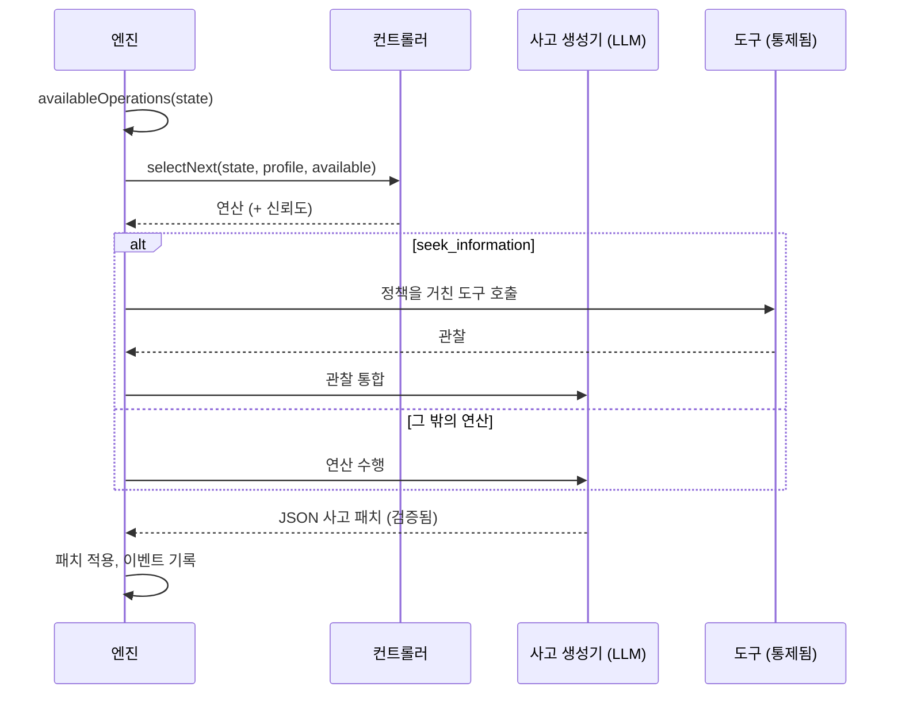

# 인지 에이전트

인지 에이전트는 한 번에 답하지 않습니다. **명시적인 심적 상태**를 유지하고, 정당화할 수 있는 결정을 확정할 수 있을 때까지 **인지 연산**을 하나씩 수행하며 그 상태를 개선합니다.

::: tip 쉽게 말하면
일반적인 AI는 한 번에 답하고, 그 추론은 사라집니다. 인지 에이전트는 노트를 든 사람처럼 일합니다. 아는 것, 가정하는 것, 아직 모르는 것을 적고, 여러 선택지를 나열하고, 그 결과를 상상하고, 무엇이 잘못될 수 있는지 찾고, 여러분이 허용한 도구로 사실을 확인하고, 선택지를 비교한 다음에야 결정합니다. 이 움직임 하나하나가 **연산**이며, 모두 노트에 적히므로 나중에 추론 전체를 다시 읽을 수 있습니다. 탄탄한 결론에 이르지 못하면 그렇다고 말합니다. 이 페이지의 모든 용어는 [쉽게 풀어 쓴 핵심 용어](./glossary#how-a-cognitive-agent-reasons)에서 설명합니다.
:::

{.illustration style="max-width:460px"}

```ts
const agent = sdk.createCognitiveAgent({
  name: 'analyst',
  model: 'gpt-4o',
  tools: [lookupMetric],
  profile: myProfile, // optional, see Thinker profiles
});

const { status, answer, decision, state, runId } = await agent.think({
  problem: 'Should we build or buy our analytics module?',
  context: { budget: '10k EUR', deadline: 'before Q4' },
  observations: [{ content: 'Churn was 4% last month', originGroup: 'billing' }], // optional
});

decision?.status; // 'committed' | 'provisional' | 'abstain'
```

::: tip 증거가 먼저입니다
관찰을 어떻게 추적하고, 예측을 어떻게 테스트하고, 결론을 어떻게 지키는지는 [증거와 검증](./evidence-and-verification)에서 설명합니다.
:::

## 심적 상태 {#the-mental-state}

심적 상태는 타입이 있는 평범한 데이터입니다. 모든 항목에는 모델이 참조할 수 있는 안정적인 id가 붙습니다.

| 부분 | Id | 담는 것 |
| --- | --- | --- |
| `observations` | `O1…` | 관찰된 것(문제와 함께 주어졌거나, 도구나 테스트가 반환한 것)과 그 출처 |
| `facts` | `F1…` | 출처(`input`, `tool`, `inference`), 근거가 된 관찰, 상태(`active`, `superseded`, `retracted`)를 가진 진술 |
| `assumptions` | `A1…` | 추론이 당연하게 받아들이는 것 |
| `constraints` | `K1…` | 모든 답이 지켜야 하는 것 |
| `unknowns` | `U1…` | 열린 질문으로, `open`, `resolved` 또는 `dropped` 상태이며 시도 횟수가 함께 기록됩니다 |
| `hypotheses` | `H1…` | 전제, 시뮬레이션, 비판, 증거 `support`, `preferenceFit`, 상태를 가진 제안, 규칙 또는 설명 |
| `comparisons` | `R1…` | 관찰 사이의 관계: 유사성, 차이, 변화, 양립 불가, 반례 |
| `predictions` | `P1…` | 가설이 예측하는 것, 그것을 반증할 것, 그리고 테스트 결과 |
| `contradictions` | `C1…` | 항목 사이의 충돌로, 범주가 붙으며 인용된 증거로 해소될 때까지 남습니다 |
| `failures` | `X1…` | 이미 실패한 것으로, 맹목적으로 다시 시도하지 않게 합니다 |
| `knowledge` | `M1…` | 같은 범위의 이전 실행들이 실제 테스트로 확립한 것으로, 실행이 시작될 때 불러옵니다([실행 간 기억](./memory) 참고) |
| `confidence`, `evidenceRevision` | | 최선의 답에 대한 증거 지지도, 그리고 이전 평가를 낡은 것으로 만드는 카운터 |
| `decision`, `trail` | | 최종 결정과 그 상태, 단계마다 한 줄 |

{.illustration style="max-width:760px"}

상태는 **절대 그 자리에서 직접 수정되지 않습니다**. 각 연산은 *사고 패치*를 만들고, 패치는 `cognition.thought` 이벤트로 기록되며, 상태는 모든 패치를 차례로 적용(fold)한 결과입니다. 그래서 `sdk.getMentalState(runId)`는 몇 달 뒤에도 어떤 실행이든 정확히 재구성할 수 있습니다.

## 연산 {#the-operations}

| 연산 | 하는 일 | 사용 가능한 때 |
| --- | --- | --- |
| `represent` | 사실, 가정, 제약, 미지수를 뽑아냅니다 | 항상 맨 처음. 모순이 열려 있을 때 다시 |
| `compare_observations` | 관찰 사이의 관계를 찾습니다: 유사점, 차이점, 변화, 반례 | 비교할 수 있는 관찰이 둘 이상 있고(중복과 테스트 결과는 제외), 마지막 비교 이후 새 관찰이 있을 때 |
| `hypothesize` | 새로운 제안, 규칙 또는 설명을 내놓습니다 | 활성 가설이 `maxHypotheses`보다 적을 때 |
| `simulate` | 결과를 단계별로 투영하고 테스트할 수 있는 예측을 밝힙니다 | 시뮬레이션이 없는 가설이 있을 때 |
| `test_prediction` | 기록된 예측에 여러분의 결과 평가기를 실행합니다. LLM 호출은 없습니다 | 평가기가 구성되어 있고, 대기 중인 예측이 있고, 테스트 예산이 남아 있을 때 |
| `revise` | 증거와 모순되는 가설을 범위를 좁힌 변형으로 바꿉니다 | 반증되었거나 모순된 가설에 아직 변형이 없을 때 |
| `critique` | 가설이 실패할 수 있는 가장 강력한 이유를 찾습니다 | 비판이 없는 가설이 있을 때 |
| `seek_information` | 열린 미지수에 답하기 위해 통제된 도구를 호출합니다 | 도구가 있고, 열린 미지수가 있고, 도구 예산이 남아 있을 때 |
| `compare` | 증거 지지도와, 제안이 사고자에게 얼마나 맞는지를 판단합니다 | 마지막 비교 이후 비판을 거친 가설이 바뀌었거나 증거가 바뀌었을 때 |
| `decide` | 답, 근거, 신뢰도, 다음 행동을 확정합니다 | 가설 하나가 [결론 가드](./evidence-and-verification#the-conclusion-guard)를 통과할 때 |

**무엇이 가능한지는 코드가 정하고, 무엇이 유용한지는 컨트롤러가 정합니다.** 전제 조건은 상태로부터 계산되며, 컨트롤러는 사용 가능한 연산 중에서만 고를 수 있습니다.

모델이 무엇을 말하든 코드로 강제되는 규칙은 다음과 같습니다.

- 반박되지 않은 `fatal` 비판이나 반증된 예측은 해당 가설을 기각합니다.
- 기각된 가설은 되살리거나, 다시 제시하거나, 선택할 수 없습니다. 무엇이 바뀌었는지 밝히는 변형으로 수정될 수만 있습니다.
- 코드는 주장의 증거 지지도에 선호를 절대 섞지 않으며, 모델은 상태의 신뢰도를 설정할 수 없습니다.
- 모순은 한 번만 해소되며, 그것을 정리하는 관찰이나 사실을 인용해야만 해소됩니다.
- 바꾸기로 되어 있던 것을 아무것도 바꾸지 못한 단계나 연기된 결정은 실패한 시도로 셉니다. 두 번 연속으로 실패하면, 다른 단계가 새 증거를 가져올 때까지 그 연산은 더 이상 제시되지 않습니다([낭비되지 않는 예산](./evidence-and-verification#a-budget-that-is-not-wasted) 참고).
- 출처(관찰, 테스트 결과)와 결정 상태는 엔진이 기록합니다. 이를 포함한 모델 응답에서는 해당 내용이 제거됩니다.
- 알 수 없는 id에 대한 참조는 무시되고, 사고 이벤트의 `issues`로 보고됩니다.
- 동시에 다룰 수 있는 가설은 최대 `maxHypotheses`개입니다. 넘치는 제안은 버려지고 보고됩니다.
- 미지수는 두 번 조사에 실패하면, 또는 사용 가능한 도구 중 답할 수 있는 것이 없으면 즉시 더 이상 조사되지 않습니다. 재구성(모순에 대한 `represent`)은 최대 세 번까지 제시됩니다.
- 실패한 연산은 실패로 기록되며, 완료로 세지 않습니다.
- **마지막 단계는 항상 결정 시도입니다**. 결론 가드를 통과하지 못한 답은 (부족한 것을 명시한) `provisional` 또는 `abstain`이 됩니다. 모델이 결정을 전혀 내놓지 못하면, 엔진이 판단을 유보하고 그 이유를 기록합니다.

## 컨트롤러 {#controllers}

컨트롤러는 다음 연산을 고릅니다.



| 컨트롤러 | 고르는 방법 | 사용할 때 |
| --- | --- | --- |
| `heuristic` | 고정된 주의 순서: 표현 → 수정 → 관찰 비교 → 가설 → 시뮬레이션 → 예측 테스트 → 비판 → 정보 찾기 → 비교 → 결정 | Jev가 없을 때의 기본값으로, 결정론적이고 무료입니다 |
| `typed` | 단계마다 Jev 요청 한 번: 사용 가능한 연산에 대한 Choice 질문과 Noul "결정할 준비가 되었는가?" 질문 | 보정된 신뢰도를 갖춘 적응형 추론 |
| 직접 만든 것 | `CognitiveController.selectNext()`를 구현합니다 | 파인튜닝한 로컬 모델, 비즈니스 규칙, … |

`controller: 'auto'`(기본값)를 쓰면, 에이전트는 SDK에 타입 지정 결정 백엔드가 있을 때 Jev를 쓰고, 없으면 휴리스틱을 씁니다. 타입 지정 컨트롤러는 Choice 신뢰도가 `minConfidence`(0.35)보다 낮거나, 클라이언트가 실패하거나, 답이 사용 가능한 연산이 아닐 때 **휴리스틱으로 대체됩니다**. 예외를 던지거나 사용할 수 없는 연산을 반환하는 커스텀 컨트롤러도 휴리스틱으로 대체됩니다. 모든 대체는 선택 이벤트의 `fallbackFrom` 필드에 기록됩니다.

```ts
sdk.createCognitiveAgent({
  name: 'analyst',
  model: 'gpt-4o',
  controller: 'typed',
  controllerOptions: { minConfidence: 0.5, readinessThreshold: 0.85 },
  assessment: 'typed', // compare hypotheses with Jev Score questions
});
```

## 추론 안에서의 도구 {#tools-inside-reasoning}

`seek_information`은 **네이티브 추론 엔진과 액션 엔진**을 사용합니다. LLM이 열린 미지수에 맞는 도구 하나를 고르면, 액션 엔진은 그 도구가 **이 에이전트에게 주어졌는지** 확인하고, 호출을 정책(실행 한도 포함, [한도와 정책](#limits-and-policies) 참고), 승인, 예산에 대해 검증합니다. 결과는 해당 `action.executed` 이벤트를 가리키는 **관찰**로 기록된 다음, `source: "tool"`인 사실로 통합됩니다. 해석에 실패하더라도 관찰은 보관됩니다. 거부되거나, 차단되거나, 실패한 도구는 기록된 실패가 되고, 추론은 계속됩니다.

## 한도 {#limits}

```ts
sdk.createCognitiveAgent({
  name: 'analyst',
  model: 'gpt-4o',
  limits: {
    maxSteps: 12,              // the last one always decides
    timeoutMs: 180_000,
    maxHypotheses: 3,          // in play at the same time
    maxToolCalls: 5,
    decisionThreshold: 0.75,   // evidence support a committed answer needs (see minProposalSupport)
    maxConsecutiveFailures: 3, // then the run fails (and alerts you, if incidents are on)
    maxPredictionTests: 4,     // calls to the outcome evaluator per run
    preferenceWeight: 0.4,     // weight of the thinker's preferences when ranking proposals
    minProposalSupport: 0.35,  // evidence support enough for a choice of action the thinker clearly prefers
  },
  evaluator: myBench,          // optional OutcomeEvaluator, enables test_prediction
  knowledge: { store, scope: 'my-domain' }, // optional memory across runs
});
```

한도는 에이전트를 만들 때 검증됩니다. `maxSteps: 0`이나 타이머가 지원하는 범위를 넘는 타임아웃은 안전장치를 조용히 꺼 버리는 대신 `ValidationError`를 던집니다. `minProposalSupport`는 `decisionThreshold`를 넘을 수 없습니다. 증거만으로 답이 확정되게 하려면 `decisionThreshold`와 같은 값으로 설정하세요. `minProposalSupport`를 설정하지 않고 `decisionThreshold`를 낮추면, 하한도 함께 내려갑니다.

### 한도와 정책 {#limits-and-policies}

에이전트에 적용되는 예산 정책과 타임아웃 정책(에이전트의 `policies`에 있는 정책과 전역 정책)은 **각 단계 전에**, 그 단계의 어떤 모델 호출보다도 먼저 검사되고, 각 도구 호출 전에 다시 검사됩니다. 이 정책들은 실행의 진행 상황을 봅니다. `maxSteps`는 이미 진행한 단계 수, `maxTokens`는 실행의 모델 호출(사고와 그 수정, 도구 선택, 타입 지정 결정)이 사용한 토큰 수, `maxDuration`은 실행 시작 이후 경과한 시간입니다. 기간별 토큰·비용 예산(`toolName` 없이 `maxTokens` 또는 `maxCost`를 지정한 `budgetLimit`)도 각 단계 전에 검사되며, 실행이 기록하는 모든 모델 호출이 여기에 집계됩니다([API 비용](./costs#budgets) 참고). 단계는 유형이 `continue`인 의도로 검사됩니다. 조건이 도구 호출을 요구하는(`intention.type`이 `tool_call`인) 정책은 도구 호출에만 적용됩니다. 허용 목록, 커스텀 정책, 호출 예산(`maxToolCalls`), 승인은 도구 호출에만 관련되며, 동작이 `require_approval`인 한도 규칙도 마찬가지입니다. 단계는 승인을 기다리지 않습니다. 각 단계의 검사는 단계에 적용될 수 있는 정책에 한해 정책 감사(`sdk.getPolicyAuditTrail`)에 남습니다.

가장 먼저 도달한 한도가 실행을 끝내며(도구 호출 한도는 호출을 건너뛰게 할 뿐입니다), 두 종류의 한도는 실행을 같은 방식으로 끝내지 않습니다.

| 한도 | 에이전트의 `limits` | 정책 |
| --- | --- | --- |
| 단계 | `maxSteps`: 마지막 단계가 결정합니다. `committed`, `provisional`, `abstain` 중 하나의 결정과 함께 `completed` | `maxSteps`: 다음 단계가 거부됩니다. `failed` |
| 시간 | `timeoutMs`: 실행이 중단되고, 진행 중인 호출은 중단 신호를 받습니다. `failed`, `Timeout exceeded (… ms)` | `maxDuration`: 단계 사이와 도구 호출 전에 검사되며, 진행 중인 호출은 계속됩니다. `failed`, `Timeout (… ms) exceeded` |
| 토큰, 비용 | — | `maxTokens`, 기간별 예산: 다음 단계가 거부됩니다. `failed` |
| 도구 호출 | `maxToolCalls`: `seek_information`이 더 이상 제시되지 않습니다 | 거부된 호출은 기록된 실패가 되고, 추론은 계속됩니다 |

거부된 단계는 `policy.violated`(`intention: { type: 'continue' }`, 단계 `step`, 이유 `reason`, 위반한 정책 `violatedPolicies` 포함)로 기록되고, 이어서 정책의 이유와 함께 `run.failed`가 기록됩니다. 결과는 `status: 'failed'`이고 `error`는 `PolicyViolationError`입니다. 실행 한도에 거부된 도구 호출은 `policy.violated`와 실패한 연산으로 기록됩니다. 한도는 여전히 초과된 상태이므로 다음 단계가 거부되고 실행은 실패합니다. 거부가 아니라 결정으로 끝내려면 에이전트의 `maxSteps`를 정책의 `maxSteps` 이하로 두세요. 그러면 정책이 무언가를 거부하기 전에 마지막 단계가 결정합니다.

## 잘못된 모델 출력 {#invalid-model-output}

각 연산에는 Zod로 검증되는 엄격한 JSON 계약이 있습니다. 유효한 JSON이 아니거나, 필수 필드가 빠졌거나, 잘못된 값을 쓴 응답은 검증 오류와 함께 **한 번** 되돌려 보내집니다. 연산이 쓸 수 없는 필드(예를 들어 `simulate` 중의 `decision`)는 무시되고 `ignoredFields`에 나열됩니다. 수정도 실패하면, 그 연산은 실패로 기록되고 루프는 계속됩니다.

## 중지, 취소, 타임아웃 {#stop-cancel-time-out}

```ts
const pending = agent.think({ problem });
await agent.stop();          // or agent.stop(runId)
const result = await pending; // status: 'cancelled'
```

타임아웃은 `Timeout exceeded (… ms)`와 함께 `status: 'failed'`를 만들고, 실행은 이벤트 로그에 실패로 표시됩니다. `sdk.stopRun(runId)`도 인지 실행을 중지합니다. 타임아웃과 중지는 연산 사이에 검사되며, 여러분의 프로바이더에게 중단 신호(abort signal)로 전달됩니다. 내장된 OpenAI와 Anthropic 프로바이더는 이미 진행 중인 요청을 취소하지 않으므로, 느린 호출은 공급사 자체의 타임아웃에 끝납니다.

프로필은 **실행이 시작될 때 스냅숏으로 고정됩니다**. 실행이 진행되는 동안 준 피드백은 다음 실행에 적용됩니다.

## 보안 {#security}

인지 에이전트는 자신이 쓰지 않은 텍스트를 읽습니다. 도구 결과, MCP 도구 설명, 컨텍스트 안의 문서가 그렇습니다. 이 모두를 **신뢰할 수 없는 입력**으로 다루세요. 모델을 겨냥한 지시문이 들어 있을 수 있습니다(프롬프트 인젝션). SDK는 그런 텍스트가 할 수 있는 일을 제한합니다.

- 에이전트는 자신에게 주어진 도구만 호출할 수 있고, 모든 호출에서 정책이 검사됩니다. 파괴적인 도구는 `require_approval` 정책 뒤에 두세요.
- 모델은 스스로 아무것도 실행하지 않습니다. 모델이 제안하면 액션 엔진이 검증합니다.
- 심적 상태의 불변 조건은 프롬프트가 아니라 코드로 강제됩니다.
- 모든 도구 호출과 사고는 검토할 수 있도록 이벤트 로그에 남습니다.

이벤트 로그는 목표, 컨텍스트, 모든 사고를 저장하며, `decision.evaluated` 이벤트는 Jev에 보낸 컨텍스트를 저장합니다. 여러분이 선택한 이벤트 저장소에 데이터가 요구하는 보존 및 삭제(redaction) 규칙을 적용하세요.

## 리플레이와 감사 {#replay-and-audit}

인지 실행도 평범한 실행입니다.

- `sdk.getTrace(runId)`는 `policy.checked`, `tool.called`, … 옆에 `cognition.*` 이벤트를 보여 줍니다.
- `sdk.replay(runId)`는 LLM을 호출하지 않고 도구 호출을 다시 실행하고 최종 답을 재현합니다. 원래 실행과 같은 도구 제한과 각 호출 시점의 실행 진행 상황이 적용되므로, 에이전트에게 거부되었던 도구는 다시 거부되고, 실행 한도에 거부되었던 호출도 다시 거부됩니다.
- `sdk.getMentalState(runId)`는 상태를 재구성합니다.
- `sdk.exportControllerDataset()`은 실행을 학습 데이터로 바꿉니다([사고자 프로필](./thinker-profiles#train-your-own-controller) 참고).
