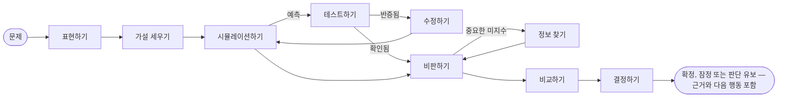

# 소개

**SDK AI Agents**는 프로덕션에서 신뢰할 수 있는 AI 에이전트를 만들기 위한 TypeScript SDK입니다. 이 에이전트는 행동하기 전에 명시적으로 추론하고, *여러분*이 생각하는 방식을 배울 수 있으며, 모든 단계가 통제되고, 추적되고, 가격이 매겨지고, 리플레이될 수 있습니다.

{.illustration style="max-width:460px"}

## 왜 또 다른 에이전트 SDK인가? {#why-another-agent-sdk}

LLM API는 매우 뛰어난 텍스트 생성기를 제공합니다. 하지만 결론에 **어떻게** 도달하는지를 통제할 수단은 주지 않습니다.

- 추론은 모델 내부에서 한 번에 일어나고, 답이 출력되면 사라집니다.
- 모델이 추측에 따라 행동하거나, 잘못된 도구를 호출하거나, 비용을 초과해 쓰는 것을 막을 장치가 없습니다.
- 문제가 생겼을 때 여러분 손에 남는 것은 프롬프트와 답뿐, 어떤 경위로 그렇게 되었는지는 남지 않습니다.

이 SDK는 모델 **주위에** 추론 계층을 둡니다. LLM은 여러 구성 요소 중 하나가 됩니다.

| 계층 | 하는 일 | 위치 |
| --- | --- | --- |
| **심적 상태** | 사실, 가정, 제약, 미지수, 가설, 모순, 신뢰도 | 언제든 이벤트에서 재구성됩니다 |
| **컨트롤러** | 다음 인지 연산을 고릅니다 | 결정론적 휴리스틱, Jev 타입 지정 결정 또는 직접 만든 것 |
| **사고 생성기** | 연산 하나를 수행하고 검증된 JSON 패치를 반환합니다 | 어떤 LLM 프로바이더든 가능 |
| **사고자 프로필** | 한 사람의 주의 순서, 우선순위, 휴리스틱 | 버전이 관리되는 데이터로, 피드백으로 다듬어집니다 |
| **거버넌스** | 정책, 허용 목록, 예산, 승인, 재시도 | 모든 행동 전에 검사됩니다 |
| **이벤트 저장소** | 유일한 진실의 원천 | 파일, SQLite 또는 PostgreSQL |

## 두 종류의 에이전트 {#two-kinds-of-agents}

**통제형 에이전트**(`sdk.createAgent`)는 고전적인 도구 호출 루프를 실행합니다. LLM이 의도를 제안하면 액션 엔진이 이를 검증하고 실행합니다. 잘 정의된 작업에 알맞습니다.

**인지 에이전트**(`sdk.createCognitiveAgent`)는 명시적으로 추론합니다. 결정을 위해 만들어졌습니다. 아키텍처 선택, 인시던트 분류, 기회 평가, "우리가 …해야 할까?" 같은 질문에 답하는 일이 그렇습니다.

두 종류 모두 같은 도구, 정책, 이벤트 저장소, 리플레이, 비용, 인시던트 알림을 공유합니다.

## 특정 인물처럼 추론할 수 있나요? {#can-it-reason-like-a-given-person}

**네.** 인지 에이전트는 특정 인물이 추론하는 방식을 흉내 낼 수 있습니다. 몇 가지 주제를 자신의 말로 설명하면, SDK가 그로부터 **사고자 프로필**을 추출합니다. 문제를 바라보는 순서, 우선순위, 반사적 판단, 아이디어를 기각하게 만드는 것, 위험 선호도가 여기에 담깁니다. 이 프로필은 추론의 각 단계 지시문에 들어갑니다. 실행이 끝날 때마다 얼마나 동의하는지 말해 주면(예를 들어 "60% 맞았어요, 여기서 틀렸어요"), 그 교훈이 다음 실행을 위해 보관됩니다.

에이전트가 흉내 내는 것은 **추론 방식**입니다. 여러분이 한 번도 적지 않은 것은 알지 못하고, 여러분 대신 결정하지 않으며, 여러분의 선호가 세상에 대한 주장을 더 믿을 만하게 만들지도 않습니다. SDK는 스스로를 채점하지 않습니다. 처음 보는 문제에서 실행을 거듭하며 여러분이 매기는 동의율이, 흉내가 얼마나 가까워졌는지를 알려 줍니다. [특정 인물처럼 추론하기](./thinker-profiles)에서 각 단계를 설명합니다.

## 얻을 수 있는 것 {#what-you-get}

- **명시적 추론** — 심적 상태에 대한 열 가지 연산과, 코드로 강제되는 불변 조건(기각된 가설은 선택될 수 없고, 치명적인 비판은 가설을 기각하며, 마지막 단계는 항상 결론을 냅니다).
- **감사할 수 있는 증거** — 출처가 붙은 관찰, 여러분의 평가기로 테스트되는 예측, 범위를 좁힌 변형으로 수정되는 반증된 규칙, 증거와 분리해 보관되는 선호, 그리고 `committed`, `provisional` 또는 `abstain`으로 답하는 결론 가드. 지식 저장소를 쓰면 테스트가 답한 내용이 다음 실행을 위해 기억됩니다.
- **특정 인물처럼 추론하기**: 자신의 말로 설명한 주제에서 사고자 프로필을 추출한 다음, `match`, `partial` 또는 `mismatch` 판정과 동의율로 에이전트를 교정합니다.
- **타입 지정 결정** — [TypeSafe Jev](https://docs.typesafe.ai)나 호환되는 백엔드가 Noul, Choice, Score 질문에 보정된 확률로 답합니다.
- **MCP 커넥터** — 여러분의 도구를 MCP 서버로 노출하고, 어떤 MCP 서버든 통제된 도구로 가져옵니다.
- **기본 내장된 운영 기능** — 실행별 API 비용, 중첩되지 않는 재시도 정책, 이메일이나 웹훅을 통한 인시던트 알림.
- **네이티브 이벤트 소싱** — LLM 없는 리플레이, 골든 트레이스, 회귀 탐지, 추론 그래프.

다른 프레임워크와 비교하면 어떨까요? [왜 이 SDK인가](./why)를 보세요. 이 용어들이 처음인가요? [쉽게 풀어 쓴 핵심 용어](./glossary)에서 하나씩 설명합니다. 준비되었나요? [시작하기](./getting-started)로 가세요.
