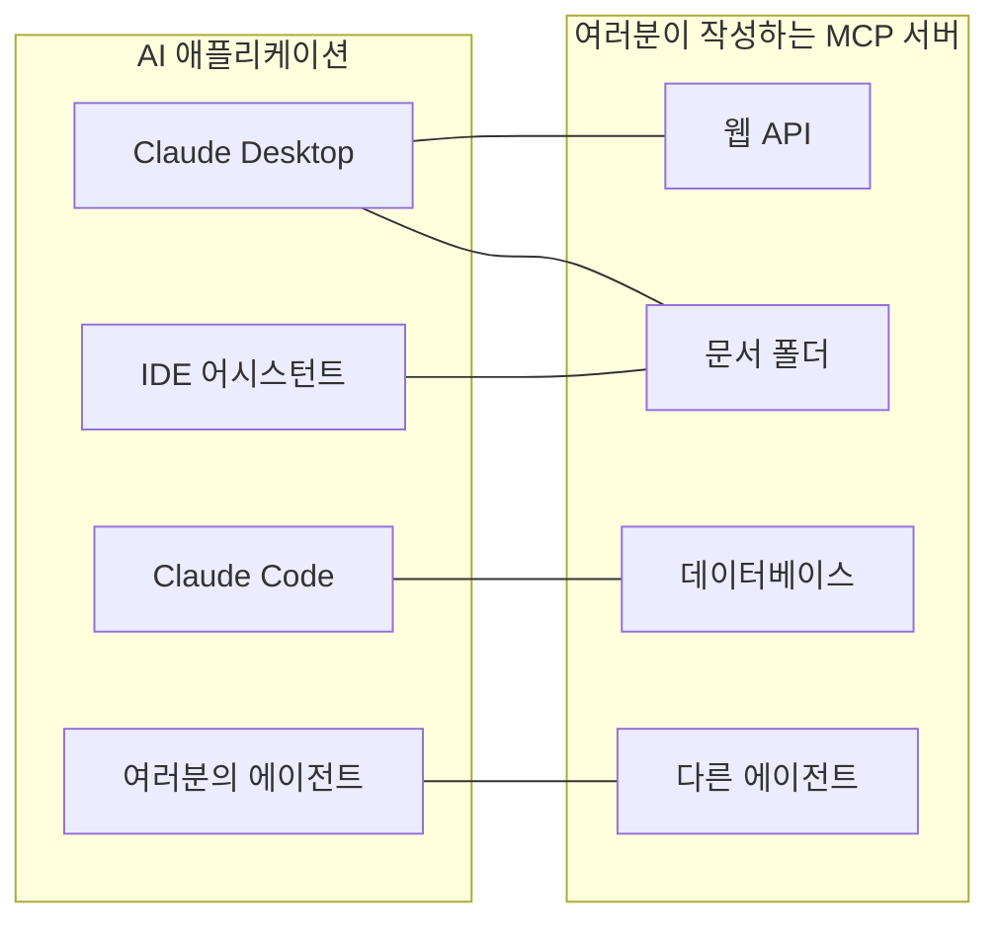
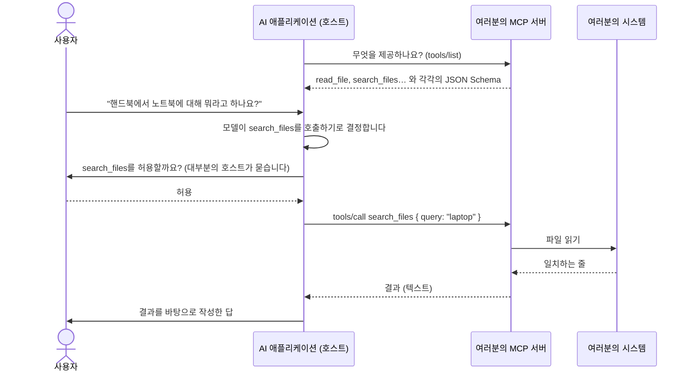
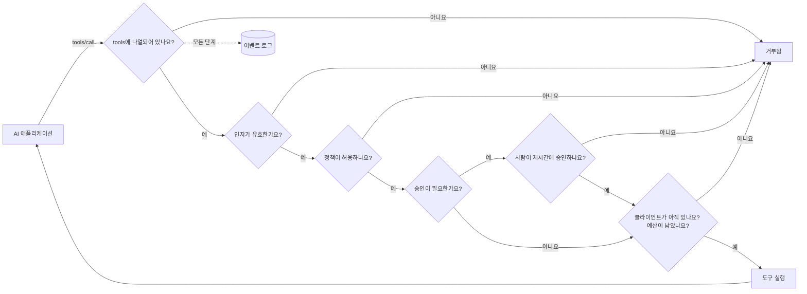

# 쉽게 풀어 쓴 MCP

**MCP를 사용하면 AI 애플리케이션(Claude Desktop, Claude Code, IDE 어시스턴트, 여러분이 만든 에이전트)이 여러분의 시스템을 사용할 수 있습니다. API, 문서 폴더, 데이터베이스, 다른 에이전트가 그 대상입니다.** 이 페이지에서는 개념과 용어를 설명합니다. 다음 페이지들에서는 처음부터 동작하는 서버까지 차근차근 진행합니다.

1. [5분 만에 만드는 첫 번째 MCP 서버](./mcp-first-server) — 빈 폴더에서 Claude Desktop까지 단계별로.
2. [무엇이든 MCP 서버로](./mcp-recipes) — 함수, 웹 API, 폴더, 데이터베이스, 에이전트를 각각 한 줄로.
3. [배포, 보안, 문제 해결](./mcp-deploy) — HTTP 배포, 인증, 승인, 그리고 동작하지 않을 때 할 일.

## 개념: 모든 AI 앱을 위한 하나의 플러그 {#the-idea-one-plug-for-every-ai-app}

MCP(Model Context Protocol)를 **AI 애플리케이션을 위한 USB-C**라고 생각해 보세요. USB 이전에는 기기마다 자기만의 케이블이 있었습니다. MCP 이전에는 AI 애플리케이션마다, 대화하는 시스템마다 전용 연결 코드가 필요했습니다. Claude용 통합 하나, IDE용 통합 하나, 에이전트용 통합 하나를 따로 만들어야 했습니다.

MCP를 쓰면 **여러분의 시스템 앞에 작은 프로그램 하나, 즉 MCP 서버를 작성**합니다. 그러면 MCP를 사용하는 모든 애플리케이션이 여기에 연결해, 서버가 무엇을 제공하는지 나열하고 사용할 수 있습니다. 서버는 한 번 만들면, 어디서나 동작합니다.



이 프로토콜은 [modelcontextprotocol.io](https://modelcontextprotocol.io)에 공개된 개방형 표준입니다. Anthropic이 시작했으며, 많은 AI 애플리케이션이 지원합니다.

## 용어, 하나씩 {#the-words-one-by-one}

| 용어 | 쉽게 말하면 | 예시 |
| --- | --- | --- |
| **호스트**(AI 애플리케이션) | 사용자가 대화하는 앱입니다. 언어 모델을 실행하고, 언제 여러분의 서버를 쓸지 결정합니다. | Claude Desktop, Claude Code, VS Code |
| **MCP 클라이언트** | 호스트 안에서 서버 하나와의 연결을 유지하는 부분입니다. 직접 볼 일은 거의 없습니다. | Claude Desktop에서 서버마다 하나씩 |
| **MCP 서버** | 여러분의 작은 프로그램입니다. 무엇을 제공하는지 알려 주고, 요청을 받으면 작업을 수행합니다. | `serveMcpOverStdio(sdk, { … })` |
| **도구** | 모델이 호출하기로 결정할 수 있는, 이름이 붙은 인자를 가진 행동입니다. 모델은 이름, 설명, 인자 목록을 읽고 결정합니다. | `read_file`, `list_pets`, `query` |
| **리소스** | 서버가 읽을 수 있도록 제공하는 문서입니다. 도구와 달리 모델이 아니라 **사용자나 앱**이 고릅니다(예: "첨부" 버튼). | `folder://handbook/onboarding.md` |
| **프롬프트** | 서버가 제공하는 미리 만들어진 메시지 템플릿입니다. 이 SDK는 아직 제공하지 않습니다. | — |
| **전송 방식** | 호스트와 서버 사이에 메시지가 오가는 방법입니다. | stdio, Streamable HTTP |
| **stdio** | 호스트가 **같은 컴퓨터에서 여러분의 서버를 프로그램으로 시작하고**, 표준 입력과 출력으로 대화합니다. 프로그램에 입력을 타이핑하고 출력된 내용을 읽는 것과 비슷합니다. 네트워크에는 아무것도 열리지 않습니다. | Claude Desktop의 로컬 서버 |
| **Streamable HTTP** | 여러분의 서버가 **웹 서비스**이고, 호스트가 HTTP 요청을 보냅니다. 서버 하나를 팀과 공유할 때 씁니다. | `https://mcp.example.com/mcp` |
| **JSON Schema** | 모델이 읽는 도구 인자의 기술입니다(이름, 타입, 필수 인자). SDK가 대신 작성해 줍니다. | `{ "type": "object", "properties": { "path": { "type": "string" } } }` |
| **어노테이션** | 호스트에게 보여 주는 도구에 대한 힌트로, "이 도구는 읽기만 한다" 같은 것입니다. 호스트는 이를 보고 언제 사용자에게 확인을 요청할지 결정할 수 있습니다. | `readOnlyHint: true` |

::: tip 도구와 리소스
**도구**는 모델이 *하는* 일입니다("핸드북에서 'laptop' 검색하기"). **리소스**는 사용자가 *건네주는* 것입니다("이 대화에 onboarding.md 첨부하기"). 폴더 레시피는 같은 폴더에서 둘 다 제공합니다.
:::

## 호출 한 번에 일어나는 일 {#what-happens-during-one-call}



기억할 것이 두 가지 있습니다.

- **모델은 서버가 나열한 것만 봅니다.** 이름, 설명, 인자 스키마, 그리고 돌려받는 결과입니다. 설명은 명확하게 쓰고, 절대 비밀 정보를 넣지 마세요.
- **실제로 무슨 일이 일어날지는 서버가 결정합니다.** 모델은 호출을 제안할 뿐이고, 여러분의 서버는 이를 거부하거나, 제한하거나, 사람에게 묻거나, 기록할 수 있습니다. 바로 여기서 이 SDK가 역할을 합니다.

## 이 SDK가 더하는 것 {#what-this-sdk-adds}

공식 MCP SDK만으로도 MCP 서버를 작성할 수 있습니다. 이 SDK는 그 위에서 동작하며, 서버를 **안전하게, 그리고 한 줄로** 운영하는 데 필요한 것을 더합니다.

| | 공식 MCP SDK만 쓸 때 | SDK AI Agents를 쓸 때 |
| --- | --- | --- |
| 웹 API 노출하기 | 엔드포인트마다 핸들러를 하나씩 작성 | `openApiTools({ spec })` — 오퍼레이션마다 도구 하나, 기본적으로 읽기 전용 |
| 폴더 노출하기 | 경로 검사를 직접 작성 | `folderTools({ root })` — 심볼릭 링크와 `..`로 폴더를 벗어날 수 없음 |
| 데이터베이스 노출하기 | SQL 가드를 직접 작성 | `databaseTools({ database })` — SELECT 하나, 데이터베이스 수준의 읽기 전용(PostgreSQL에서는 읽기 전용 트랜잭션, SQLite에서는 `query_only`), 행 수 제한 포함 |
| 에이전트 노출하기 | — | `cognitiveAgentTool(agent)` — "Nicolas라면 어떻게 생각할까?"를 도구 하나로 |
| 실수로 노출되는 것이 없음 | 여러분에게 달림 | `tools`에 나열한 도구만 |
| 모든 호출 전의 규칙 | 여러분에게 달림 | [정책](./governed-agents), 예산, 허용 목록 |
| 사람이 먼저 허락 | 여러분에게 달림 | `requiresApproval` 표시가 된 도구는 `sdk.approveAction()`을 기다립니다. 클라이언트가 취소하거나 연결을 끊을 때, 그리고 `approvalTimeoutMs`(기본값 50초)가 지나면 승인은 취소됩니다 |
| 무슨 일이 있었는지 알기 | 여러분에게 달림 | 모든 호출과 모든 리소스 읽기가 [이벤트 로그](./observability)의 실행이 됩니다 |



검사는 이 순서대로 진행됩니다. 인자가 잘못된 호출은 누군가에게 승인을 요청하기 전에 거부되며, 호출은 결과와 상관없이 시작될 때 예산에서 차감됩니다.

MCP를 통한 모든 호출은 `mcp:<server name>`이라는 신원으로 각각 하나의 실행으로 기록됩니다. 에이전트 실행과 똑같이 읽고, 비용을 계산하고, 알림을 걸 수 있습니다.

## 양방향 {#both-directions}

SDK는 MCP를 양방향으로 사용합니다.

- **제공하기**: 여러분의 도구, API, 폴더, 데이터베이스, 에이전트를 MCP 서버로 만듭니다. 다음 페이지들에서 다룹니다.
- **사용하기**: 기존 MCP 서버의 도구를 여러분의 에이전트에게 줍니다. 아래에서 다룹니다.

### MCP 서버의 도구를 에이전트에서 사용하기 {#use-the-tools-of-an-mcp-server-in-your-agents}

```ts
import { connectMcpServer } from '@sdk-ai-agents/core/mcp';

const crm = await connectMcpServer({
  name: 'crm',
  transport: { type: 'http', url: 'https://mcp.acme.internal/crm', headers: { Authorization: `Bearer ${token}` } },
  toolPrefix: 'crm_',                         // avoid collisions between servers
  include: ['lookup_customer', 'list_invoices'],
  metadata: { riskLevel: 'medium' },          // governance metadata for every tool
  retry: { maxRetries: 2 },
});

const tools = crm.tools.map((definition) => sdk.defineTool(definition));
const agent = sdk.createCognitiveAgent({ name: 'account-manager', model: 'gpt-4o', tools });

await agent.think({ problem: 'Should we offer customer c-42 a discount?' });
await crm.close();
```

| `transport.type` | 용도 |
| --- | --- |
| `stdio` | 프로세스로 시작하는 로컬 서버(`command`, `args`, `env`, `cwd`) |
| `http` | Streamable HTTP를 쓰는 원격 서버(`url`, `headers`) |
| `custom` | 직접 만든 모든 전송 방식(WebSocket, 테스트용 인메모리…) |

가져온 도구는 서버의 JSON Schema를 유지하므로, 모델은 실제 인자를 봅니다. `sdk.defineTool`로 정의하고 나면 로컬 도구와 똑같이 동작합니다. 허용 목록, 정책, 승인(`metadata: { requiresApproval: true }`를 쓰면 모든 호출이 사람을 기다립니다), 예산, 재시도, 트레이스가 모든 호출에 적용됩니다. 도구 목록 조회에 실패하면, 오류를 던지기 전에 연결(과 stdio 프로세스)을 닫습니다.

::: warning 신뢰하는 서버만 연결하세요
가져온 도구의 설명과 결과는 한 글자도 바뀌지 않고 모델에게 전달됩니다. 악의적인 서버는 그 안에 지시문을 써 넣을 수 있습니다. 신뢰하는 서버만 연결하고, 각 에이전트에게는 필요한 도구만 주고, 파괴적인 도구는 승인으로 보호하세요.
:::

## 알아 두면 좋은 것 {#good-to-know}

- MCP 지원은 별도 진입점인 `@sdk-ai-agents/core/mcp`에 있으므로, 이를 쓰지 않는 한 코어 패키지는 `@modelcontextprotocol/sdk`를 필요로 하지 않습니다. 도구 소스(`openApiTools`, `folderTools`, `databaseTools`, `cognitiveAgentTool`…)는 코어 패키지에 있습니다. 여러분의 에이전트는 MCP 없이도 이를 쓸 수 있습니다.
- 서버는 공식 MCP TypeScript SDK 1.30 위에 만들어졌으며, 이 SDK는 프로토콜 개정판 2024-10-07, 2024-11-05, 2025-03-26, 2025-06-18, 2025-11-25를 받아들입니다(그 `SUPPORTED_PROTOCOL_VERSIONS`, 2026-09-24 확인). MCP 사이트는 2026-07-28 개정판도 문서화하고 있지만([아키텍처](https://modelcontextprotocol.io/docs/learn/architecture), 2026-09-24 확인), 이 SDK는 아직 이를 지원하지 않습니다.
- 이 SDK는 **도구**와 **리소스**를 제공합니다. 프롬프트, 샘플링, 엘리시테이션(elicitation)은 제공하지 않습니다.

다음: [첫 번째 서버 만들기](./mcp-first-server).
