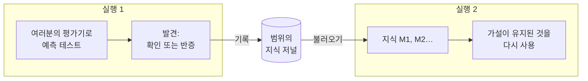

# 실행 간 기억

::: tip 쉽게 말하면
같은 실험대에서 일하는 모든 사람이 함께 쓰는 실험 노트를 떠올려 보세요. 실험이 규칙을 확인하거나 반증할 때마다, 무엇을 기대했고 무엇을 보았는지와 함께 기록됩니다. 다음 사람은 시작하기 전에 노트를 읽습니다. 유지된 것은 다시 쓰고, 이미 실패한 것은 그대로 다시 시도하지 않습니다.

인지 에이전트도 그런 노트를 가질 수 있습니다. 이 노트에는 **실제 테스트가 답한 것**만 적히며, 모델이나 사고자가 그저 믿었던 것은 절대 적히지 않습니다.
:::

## 하는 일 {#what-it-does}



1. **실행이 끝날 때**, 여러분의 [결과 평가기](./evidence-and-verification#predictions-and-the-outcome-evaluator)가 확인하거나 반증한 예측이 하나라도 있는 규칙이나 설명은 **발견**(finding)이 됩니다. 발견에는 진술, 그 범위, 실행 안에서 그것이 수정한 규칙, 그리고 각 테스트(무엇을 기대했는지, 무엇이 관찰되었는지, 어떤 평가기인지)가 담깁니다. 발견은 그 범위의 **저널**에 덧붙여집니다.
2. 같은 범위의 **다음 실행이 시작될 때**, 가장 관련성이 높은 항목들을 **불러와** `M1`, `M2`… id를 가진 `knowledge`로 심적 상태에 넣습니다.
3. **실행 중에는**:
   - 모델은 각 항목을 그 상태와 최근 테스트와 함께 보며, 검증된 규칙을 그 범위 안에서 인용하며 다시 사용하도록 지시받습니다.
   - **반증된** 항목을 한 글자도 다르지 않게(같은 종류, 진술, 범위. 대소문자와 구두점은 무시) 다시 제시하는 가설은 엔진이 거부합니다. 모델은 대신 전제에서 그 항목의 `M` id를 인용하고 반증을 설명하는 변형을 제안하도록 지시받지만, 표현이나 범위가 조금이라도 다르면 새 가설로 받아들여집니다.
   - **검증된** 항목이나 **논란 중인** 항목을 다시 제시하는 가설은 자동으로 그 항목에 연결되므로(그 `M` id가 전제에 추가됨), 비교 단계에서 이전 테스트를 볼 수 있습니다.

## 켜기 {#turn-it-on}

```ts
import { FileKnowledgeStore } from '@sdk-ai-agents/core';

const physicist = sdk.createCognitiveAgent({
  name: 'physicist',
  model: 'gpt-4o',
  evaluator: bench,   // without an evaluator, nothing is tested, so nothing is remembered
  knowledge: {
    store: new FileKnowledgeStore('./knowledge'),
    scope: 'inclined-plane',
  },
});

const first = await physicist.think({ problem: 'Does the rolling time depend on the ball?', observations });
const second = await physicist.think({ problem: 'Will a 250 g glass ball take as long as a steel one?' });

second.state.knowledge;
// [{ id: 'M1', status: 'refuted',  statement: 'Rolling time on this plane does not depend on the ball', … },
//  { id: 'M2', status: 'verified', statement: 'For rigid balls, rolling time on this plane does not depend on mass', … }]
```

| 옵션 | 기본값 | 의미 |
| --- | --- | --- |
| `store` | (필수) | 저널을 보관하는 곳: `FileKnowledgeStore`, `InMemoryKnowledgeStore` 또는 직접 만든 것 |
| `scope` | (필수) | 지식이 다루는 대상. 실행들은 한 범위 안에서만 배운 것을 공유합니다. 소문자, 숫자, `.`, `-`, `_`만 쓸 수 있습니다. 대소문자만 다른 두 범위는 macOS와 Windows에서 하나의 파일을 공유하게 됩니다 |
| `recallLimit` | `10` | 실행 시작 시 불러오는 항목 수로, 0부터 50까지입니다. `0`이면 불러오지 않고 기록만 합니다 |
| `record` | `true` | 실행이 테스트로 확립한 것을 기록할지 여부 |

`examples/rule-discovery.ts`가 이를 사용합니다. 두 번 실행하면, 두 번째 실행은 첫 번째 실행이 확립한 것을 가지고 시작합니다.

## 기억되는 것과 절대 기억되지 않는 것 {#what-is-remembered-and-what-never-is}

| 기억됨 | 절대 기억되지 않음 |
| --- | --- |
| 여러분의 평가기가 **확인**하거나 **반증**한 예측이 있는 규칙과 설명 | 행동 선택(제안): 누가 언제 결정하느냐에 달려 있습니다 |
| 무엇을 기대했는지, 무엇이 관찰되었는지, 어떤 평가기와 버전인지 | 한 번도 테스트되지 않았거나, 테스트 결과가 **결론 없음**인 예측 |
| 변형이 수정하는 규칙, 그리고 무엇이 바뀌었는지 | 모델이 믿었던 것, 모델이 준 지지도, 사고자의 선호 |
| 어떤 실행들이 그것을 기록했는지 | 실행의 최종 답 |

실패했거나 중지된 실행도 수행한 테스트는 기록합니다. 그 뒤에 무슨 일이 있었든 측정은 유효하기 때문입니다.

## 상태 {#statuses}

| 상태 | 언제 | 모델이 받는 지시 |
| --- | --- | --- |
| `verified` | 지금까지 확인만 있을 때 | 그 범위 안에서 다시 사용하고 인용하세요. 범위 밖에서는 다시 테스트해야 할 가설입니다 |
| `refuted` | 지금까지 반증만 있을 때 | 그대로 다시 제안하지 마세요. 변형은 전제에서 그 `M` id를 인용하고 무엇이 다른지 밝힙니다 |
| `contested` | 확인과 반증이 모두 있을 때 | 어떤 조건에서만 성립합니다. 그 조건을 찾으세요 |

같은 범위 안의 같은 진술은 대소문자나 구두점과 상관없이 같은 항목입니다. 테스트는 실행과 예측 단위로 중복이 제거됩니다. 같은 실행을 두 번 기록해도 아무것도 추가되지 않습니다.

## 어떤 항목을 불러오나 {#which-items-are-recalled}

범위의 항목들은 결정론적으로 순위가 매겨집니다.

1. 문제와 공유하는 단어가 가장 많은 것(진술과 범위에 있는, 네 글자 이상의 단어)
2. 그다음 가장 많이 테스트된 것
3. 그다음 가장 최근의 것

처음 `recallLimit`개 항목을 불러옵니다. 이것은 의미 기반 검색이 아니라 단순한 단어 일치입니다. 문제와 표현이 크게 다른 규칙은 먼저 불러오지 못할 수 있습니다. 범위의 모든 것이 관련되도록 범위를 좁게 유지하세요(벤치 하나, 제품 하나, 도메인 하나).

## 범위 {#scopes}

범위는 정리용 폴더 이름이 아니라 경계입니다.

- 실행들은 한 범위 안에서만 배운 것을 **공유**합니다.
- 규칙이 서로 적용되는 벤치, 제품, 데이터셋 또는 도메인마다 범위를 하나씩 쓰세요: `inclined-plane`, `checkout-latency`, `churn-model-v3`.
- 데이터가 분리되어야 한다면, 고객이나 테넌트를 절대 한 범위에 섞지 마세요.

## 저장소 {#stores}

| 저장소 | 용도 |
| --- | --- |
| `FileKnowledgeStore(directory)` | 범위마다 파일 하나(`<directory>/<scope>.jsonl`), 실행마다 한 줄. 줄은 덧붙여지기만 하므로 파일이 읽을 수 있는 이력이 되기도 합니다. 하나의 `FileKnowledgeStore` 인스턴스를 통한 쓰기는 직렬화됩니다. 한 프로세스의 에이전트들 사이에서 인스턴스 하나를 공유하세요 |
| `InMemoryKnowledgeStore()` | 테스트, 프로토타입, 수명이 짧은 프로세스 |
| 직접 만든 `KnowledgeStore` | 여러 프로세스가 공유하는 데이터베이스 |

여러 인스턴스나 프로세스가 같은 범위에 동시에 쓴다면 데이터베이스를 쓰세요. 포트의 세 메서드를 구현하면 됩니다. 쓰기가 중단되어 끝나지 않은 줄은 읽을 때 경고와 함께 건너뛰고, 다음 항목은 새 줄에서 시작합니다. 유효한 JSON이지만 유효한 항목이 아닌 줄은 파일이 변경된 것이므로, 그 줄 번호와 함께 읽기를 멈춥니다.

```ts
import type { KnowledgeStore } from '@sdk-ai-agents/core';

const store: KnowledgeStore = {
  async recall({ scope, goal, limit }) { /* the most relevant items of the scope */ },
  async record({ scope, runId, recordedAt, findings }) { /* append one entry */ },
  async list(scope) { /* every item of the scope */ },
};
```

`projectKnowledge(entries)`는 저널 항목들을 아이템으로 접어 모으고 `rankKnowledge(items, goal, limit)`는 그 순위를 매깁니다. 그래서 커스텀 저장소는 항목만 보관하고(예를 들어 실행마다 행 하나) 두 함수를 재사용하면 됩니다.

범위가 무엇을 알고 있는지 언제든 살펴볼 수 있습니다.

```ts
for (const item of await store.list('inclined-plane')) {
  console.log(item.status, item.confirmations, item.refutations, item.statement);
}
```

## 감사와 리플레이 {#audit-and-replay}

- 불러온 항목은 `cognition.started`(`knowledge.scope`, `knowledge.items`)에 기록됩니다. 그래서 `sdk.getMentalState(runId)`는 저장소가 그 뒤에 바뀌었더라도, 저장소를 다시 읽지 않고 실행이 알고 있던 것을 정확히 재구성합니다.
- 발견은 `cognition.knowledge_recorded` 이벤트(`scope`, `findings`)에 기록됩니다.
- 저장소가 실패해도 실행은 절대 멈추지 않습니다. 불러오기에 실패하면 `cognition.started`에 `knowledge.error`로 기록되고 실행은 기억 없이 계속됩니다. 기록에 실패하면 `cognition.knowledge_recorded`에 `error`로 기록됩니다. 실행의 `limits.timeoutMs` 안에 응답하지 않는 저장소는 실패한 것으로 취급됩니다(느린 쓰기는 그 뒤에 완료될 수도 있습니다). 이벤트 로그 자체가 발견을 기록하지 못하면, 경고가 출력되고 실행 결과는 바뀌지 않은 채 반환됩니다.

## 한도 {#limits}

- **단어 일치.** 불러오기는 의미 기반이 아닙니다. 관련이 있지만 다르게 표현된 규칙은 놓칠 수 있습니다.
- **정확히 같은 재진술만.** 반증된 규칙을 같은 종류, 같은 표현(대소문자와 구두점은 무시), 같은 범위로 다시 제시한 것만 거부됩니다. 표현을 바꾼 것은 새 가설로 받아들여집니다.
- **테스트 한 번이면 `verified`가 됩니다.** 예측 하나가 확인되고 반증된 것이 없으면 항목은 곧바로 검증된 것이 되며, 어떤 예측으로 규칙을 테스트할지는 모델이 고릅니다. 약한 예측도 확인으로 셉니다.
- **범위는 선언될 뿐, 검사되지 않습니다.** "단단한 공"에 대해 검증된 규칙은 그 범위와 함께 표시되고, 모델은 새 테스트 없이 다른 곳에 적용하지 말라고 지시받습니다. 코드에서 이를 검증하는 것은 없습니다.
- **평가기는 신뢰됩니다.** 기억은 평가기만큼만 믿을 만합니다. 잘못된 측정도 테스트로 기억됩니다.
- **파일 하나에 쓰는 쪽은 하나.** `FileKnowledgeStore`는 한 인스턴스의 쓰기만 직렬화합니다. 두 인스턴스나 두 프로세스가 같은 범위에 쓰면 조정되지 않습니다.
