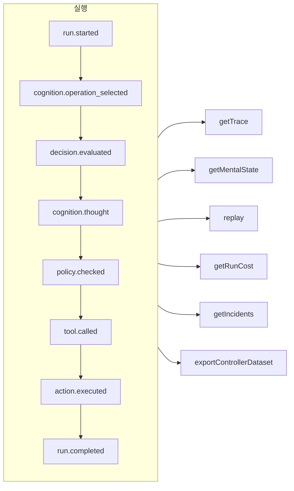

# 추적성과 리플레이

모든 실행은 통제형이든, 인지형이든, 직접적인 타입 지정 결정이든, MCP 도구 호출이든 **덧붙이기만 하는(append-only) 이벤트 로그**입니다. 기록 밖에서 일어나는 일은 없으며, 그 밖의 모든 것은 이 로그에서 파생됩니다.



## 저장소 {#stores}

| 저장소 | 용도 |
| --- | --- |
| `FileEventStore`(기본값) | 개발, 단일 프로세스 — 실행마다 JSON 파일 하나 |
| `SQLiteEventStore` | 쿼리를 지원하는 로컬 영속화 |
| `PostgreSQLEventStore` | 프로덕션: 인덱스가 있는 쿼리, 집계, 백업과 복원 |

::: code-group

```ts [File]
import { createSDK, FileEventStore } from '@sdk-ai-agents/core';

const sdk = createSDK({ apiKey, eventStore: new FileEventStore('./events') });
```

```ts [SQLite]
import Database from 'better-sqlite3';
import { createSDK, SQLiteEventStore } from '@sdk-ai-agents/core';

const sdk = createSDK({ apiKey, eventStore: new SQLiteEventStore({ db: new Database('events.db') }) });
```

```ts [PostgreSQL]
import pg from 'pg';
import { createSDK, PostgreSQLEventStore } from '@sdk-ai-agents/core';

const pool = new pg.Pool({ connectionString: process.env.DATABASE_URL });
const sdk = createSDK({ apiKey, eventStore: new PostgreSQLEventStore({ pool }) });
```

:::

저장소는 `IEventStore`를 구현합니다. 어떤 데이터베이스든 대상으로 삼으려면 직접 작성하세요. 파일 저장소는 이벤트를 버퍼에 모아 100 ms마다 플러시합니다. 종료할 때는 `await store.destroy()`를 호출해 남은 것을 기록하세요. 로그를 읽는 쪽(심적 상태 재구성, 비용, 데이터셋)은 같은 id로 반복된 이벤트를 무시합니다.

## 실행 읽기 {#read-a-run}

```ts
const trace = await sdk.getTrace(runId);          // status, timeline, summary
const text = await sdk.exportTrace(runId, 'text'); // human-readable timeline
const events = await sdk.getEvents(runId, { type: ['tool.called', 'policy.violated'] });
const state = await sdk.getMentalState(runId);    // cognitive runs
```

실행의 상태는 **마지막 생명 주기 이벤트**(`run.completed`, `run.failed`, `run.cancelled`)입니다. 그 뒤에 덧붙여진 이벤트(피드백, 인시던트 보고)는 실행을 절대 다시 열지 않습니다.

## LLM 없이 리플레이하기 {#replay-without-the-llm}

```ts
const replay = await sdk.replay(runId);
```

리플레이는 기록된 의도를 정책을 포함한 액션 엔진을 통해 **LLM을 호출하지 않고** 다시 실행합니다. 예를 들어 정책을 바꾼 뒤 "만약 이랬다면" 시나리오를 테스트하려면 수정을 가해 리플레이하세요.

리플레이는 도구를 실제로 다시 실행합니다. `requiresApproval` 표시가 된 도구의 경우, 리플레이는 원래 실행에서 사람이 **승인한** 호출(같은 도구, 같은 매개변수)만 다시 묻지 않고 되풀이합니다. 거부되었거나, 취소되었거나, 한 번도 승인되지 않은 호출은 실행되지 않고 거부됩니다. *정책*이 요구한 승인은 여전히 적용되며 결정을 기다립니다.

## 결정 이해하기 {#understand-decisions}

| 메서드 | 얻는 것 |
| --- | --- |
| `getReasoningGraph(runId)` / `exportReasoningGraph(runId, 'graphviz')` | 의도 → 정책 → 행동의 연쇄를 그래프로 |
| `getAlternatives(runId)` | 에이전트가 고려한 대안 |
| `getDecisionPatterns(filters)` | 여러 실행에 걸쳐 반복되는 결정 패턴 |
| `getTraceVisualization(runId)` | UI용으로 묶이고 타임라인에 바로 쓸 수 있는 구조 |
| `getPolicyAuditTrail(runId)` | 모든 정책 평가와 그 결과 |

## 에이전트를 코드처럼 테스트하기 {#test-agents-like-code}

좋은 실행을 **골든 트레이스**로 만든 다음, 새 실행을 그것에 대해 검증하세요.

```ts
const golden = await sdk.createGoldenTrace(runId, { name: 'refund flow', description: 'Expected behavior' });
const validation = await sdk.validateAgainstGoldenTrace(newRunId, golden.id);
const regressions = await sdk.detectRegressions(newRunId, golden.id);
```

회귀 테스트 스위트, 동작 단언(assertion), 실행 비교, 배포 전 영향 분석도 쓸 수 있습니다. [SDK API](../reference/sdk-api)를 보세요.
