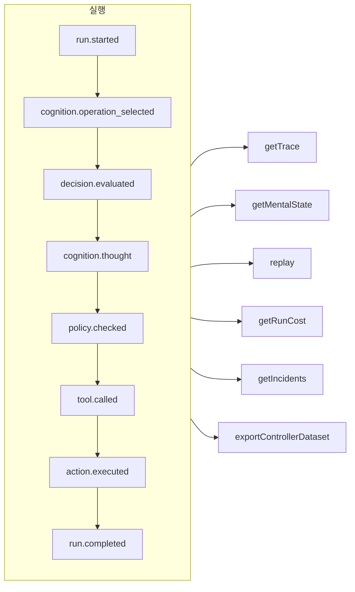

# 추적성과 리플레이

모든 실행은 통제형이든, 인지형이든, 직접적인 타입 지정 결정이든, MCP 도구 호출이든 **덧붙이기만 하는(append-only) 이벤트 로그**입니다. 기록 밖에서 일어나는 일은 없으며, 그 밖의 모든 것은 이 로그에서 파생됩니다.



## 저장소 {#stores}

| 저장소 | 용도 |
| --- | --- |
| `FileEventStore`(기본값) | 개발, 단일 프로세스 — 실행마다 JSON 파일 하나 |
| `SQLiteEventStore` | 쿼리를 지원하는 로컬 영속화 |
| `PostgreSQLEventStore` | 프로덕션: 인덱스가 있는 쿼리, 집계, 백업과 복원 |

::: code-group

```ts [File]
import { createSDK, FileEventStore } from '@sdk-ai-agents/core';

const sdk = createSDK({ apiKey, eventStore: new FileEventStore('./events') });
```

```ts [SQLite]
import Database from 'better-sqlite3';
import { createSDK, SQLiteEventStore } from '@sdk-ai-agents/core';

const sdk = createSDK({ apiKey, eventStore: new SQLiteEventStore({ db: new Database('events.db') }) });
```

```ts [PostgreSQL]
import pg from 'pg';
import { createSDK, PostgreSQLEventStore } from '@sdk-ai-agents/core';

const pool = new pg.Pool({ connectionString: process.env.DATABASE_URL });
const sdk = createSDK({ apiKey, eventStore: new PostgreSQLEventStore({ pool }) });
```

:::

저장소는 `IEventStore`를 구현합니다. 어떤 데이터베이스든 대상으로 삼으려면 직접 작성하세요. 파일 저장소는 이벤트를 버퍼에 모아 100 ms마다 플러시합니다. 종료할 때는 `await store.destroy()`를 호출해 남은 것을 기록하세요. 로그를 읽는 쪽(심적 상태 재구성, 비용, 데이터셋)은 같은 id로 반복된 이벤트를 무시합니다.

## 실행 읽기 {#read-a-run}

```ts
const trace = await sdk.getTrace(runId);          // status, timeline, summary
const text = await sdk.exportTrace(runId, 'text'); // human-readable timeline
const events = await sdk.getEvents(runId, { type: ['tool.called', 'policy.violated'] });
const state = await sdk.getMentalState(runId);    // cognitive runs
```

실행의 상태는 **마지막 생명 주기 이벤트**(`run.completed`, `run.failed`, `run.cancelled`)입니다. 그 뒤에 덧붙여진 이벤트(피드백, 인시던트 보고)는 실행을 절대 다시 열지 않습니다.

## 실시간 진행 상황 {#live-progress}

이벤트는 저장소가 받아들이는 대로, **실행이 진행되는 동안에도** 여러분의 코드에 도달합니다. 인터페이스에 진행 상황을 보여 주거나, 클라이언트로 스트리밍하거나, 대시보드에 넘기는 데 쓰세요. MCP 클라이언트는 이를 [진행 알림](./mcp-deploy#progress-notifications)으로 받습니다.

```ts
const result = await agent.run({
  message: 'Refund order 1234',
  onEvent: (event) => console.log(event.type),
});

const answer = await cognitiveAgent.think({ problem, onEvent: (event) => socket.send(JSON.stringify(event)) });
const replay = await sdk.replay(runId, undefined, { onEvent: (event) => console.log(event.type) });

// Every run of the SDK, for as long as you listen
const unsubscribe = sdk.subscribe((event) => dashboard.push(event), { types: ['run.failed', 'approval.requested'] });
unsubscribe();
```

| 어디서 | 리스너가 받는 것 |
| --- | --- |
| `run({ onEvent })`, `think({ onEvent })`, `study.run({ onEvent })` | 그 실행의 모든 이벤트 |
| `replay(runId, modifications, { onEvent })` | 리플레이의 모든 이벤트 |
| `executeTool(name, params, { onEvent })` | 호출의 이벤트, 그리고 그 도구가 시작하는 에이전트 실행(`governedAgentTool`, `cognitiveAgentTool`)의 이벤트. 한 단계 깊이까지만이며, 그 에이전트가 다시 시작하는 실행은 포함되지 않습니다 |
| `sdk.subscribe(listener, { runId?, agentId?, types?, maxQueued? })` | 필터에 맞는 모든 실행의 모든 이벤트. 반환된 함수를 호출할 때까지 받습니다 |

보장되는 것은 다음과 같습니다.

- **저장소가 받아들인 것만.** 리스너는 저장소의 `append`가 성공한 뒤에 호출되며, 저장소가 거부한 이벤트에 대해서는 절대 호출되지 않습니다. SQL 저장소에서는 행이 커밋된 상태이고, 파일 저장소에서는 이벤트가 버퍼에 있습니다. `getEvents`는 이를 바로 반환하고, 이벤트는 100 ms 안에 디스크에 도달합니다(그 사이에 프로세스가 비정상 종료되면 사라집니다).
- **순서대로.** 한 실행의 이벤트는 기록된 순서대로 도착합니다. 서로 다른 실행의 이벤트는 뒤섞여 도착합니다.
- **한 번에 이벤트 하나, 그리고 실행은 절대 기다리지 않습니다.** 리스너가 프로미스를 반환하면, 다음 이벤트는 그 프로미스가 이행되거나 거부될 때까지 기다립니다. 그래서 비동기 리스너도 이벤트의 순서를 바꿀 수 없습니다. 그동안 실행은 계속됩니다. 느린 리스너는 뒤처질 뿐, 에이전트를 느리게 만들지 않습니다. 동기 리스너는 이벤트의 `append`가 반환되기 전에 호출됩니다. 빠르게 끝나도록 하세요.
- **호출은 실행이 중단되지 않는 한 리스너를 기다립니다.** 실행이 끝나면 `run()`, `think()`, `replay()`, `executeTool()`은 각자의 `onEvent`가 모든 이벤트에 대해 처리를 마칠 때까지 기다리므로, 이들이 반환될 때는 모든 이벤트를 본 상태입니다. 실행이 중지되거나 취소되었을 때, 또는 그 `signal`이 중단될 때(호출한 쪽이 포기할 때)는 기다림이 일찍 끝납니다. 인지 실행에서는 이 기다림도 `limits.timeoutMs`에 포함됩니다. 그러면 리스너는 구독 해제되고, 아직 받지 못한 이벤트는 버려집니다. 리플레이는 취소할 수 없으므로 항상 기다립니다. 그 밖의 경우에는 이행도 거부도 되지 않는 프로미스가 호출이 반환되지 못하게 막습니다. 결과를 기다릴 필요가 없는 작업이라면 프로미스를 반환하지 마세요(`onEvent: (event) => { void save(event); }`).
- **크기가 제한된 대기열.** 앞선 이벤트를 아직 처리 중인 리스너를 기다릴 수 있는 이벤트는 최대 `maxQueued`개(기본값 10 000)입니다. 이를 넘으면 새 이벤트는 이 리스너에게 전달되지 않고 버려집니다. 버려진 사실은 리스너가 따라잡은 뒤에, 버려진 이벤트 수를 알려 주는 `LiveEventsDroppedError`로 보고됩니다.
- **오류는 실행에 끼어들지 않습니다.** 예외를 던지거나 거부된 프로미스를 반환하는 리스너는 표준 오류(`console.error`)로 보고되며, 그 뒤의 이벤트도 계속 받습니다. 버려진 이벤트도 같은 방식으로 보고됩니다. 오류를 직접 처리하려면 리스너 안에서 잡으세요. 오류와 버려진 이벤트를 함께 처리하려면 `eventStore: new ObservedEventStore(store, { onListenerError })`로 SDK를 만드세요.
- **복사본.** 각 리스너는 저장소가 다시 읽어 낸 그대로의 이벤트 복사본을 따로 받습니다. 이를 바꿔도 로그는 전혀 바뀌지 않습니다.
- **구독 해제는 즉시 적용됩니다.** `sdk.subscribe`가 반환한 함수를 호출하고 나면, 이미 기다리고 있던 이벤트에 대해서도 리스너는 다시 호출되지 않습니다. 이 함수는 리스너 안에서 호출해도 됩니다.

`agentId` 필터는 각 이벤트의 `metadata.agentId`와 대조합니다. 에이전트가 없는 이벤트도 몇 가지 있으므로(`provider.retry`, 리플레이의 끝, `agentId` 없이 한 `sdk.decisions` 호출의 `decision.evaluated`), 이를 받으려면 실행으로 필터링하세요. 복원된 백업은 전달되지 않습니다. `incidents`의 인시던트 보고는 전달됩니다. `MonitoredEventStore`를 직접 만든다면 `ObservedEventStore` 위에 만드세요(`new MonitoredEventStore(new ObservedEventStore(store), options)`). 그렇지 않으면 그 보고는 기록되기는 하지만 실시간으로 전달되지 않습니다. 여러분의 저장소 위에 직접 조립한 에이전트(`new AgentImpl(…)`)에서 `onEvent`를 쓰려면, 저장소를 `ObservedEventStore`로 감싸세요. `createSDK`는 이를 대신 해 줍니다. 에이전트 도구 뒤에서는, 저장소를 감싸지 않은 에이전트가 실패하는 대신 호출한 쪽의 리스너 없이 실행됩니다.

## LLM 없이 리플레이하기 {#replay-without-the-llm}

```ts
const replay = await sdk.replay(runId);
```

리플레이는 기록된 의도를 정책을 포함한 액션 엔진을 통해 **LLM을 호출하지 않고** 다시 실행합니다. 예를 들어 정책을 바꾼 뒤 "만약 이랬다면" 시나리오를 테스트하려면 수정을 가해 리플레이하세요.

리플레이는 도구를 실제로 다시 실행합니다. `requiresApproval` 표시가 된 도구의 경우, 리플레이는 원래 실행에서 사람이 **승인한** 호출(같은 도구, 같은 매개변수)만 다시 묻지 않고 되풀이합니다. 거부되었거나, 취소되었거나, 한 번도 승인되지 않은 호출은 실행되지 않고 거부됩니다. *정책*이 요구한 승인은 여전히 적용되며 결정을 기다립니다.

## 결정 이해하기 {#understand-decisions}

| 메서드 | 얻는 것 |
| --- | --- |
| `getReasoningGraph(runId)` / `exportReasoningGraph(runId, 'graphviz')` | 의도 → 정책 → 행동의 연쇄를 그래프로 |
| `getAlternatives(runId)` | 에이전트가 고려한 대안 |
| `getDecisionPatterns(filters)` | 여러 실행에 걸쳐 반복되는 결정 패턴 |
| `getTraceVisualization(runId)` | UI용으로 묶이고 타임라인에 바로 쓸 수 있는 구조 |
| `getPolicyAuditTrail(runId)` | 모든 정책 평가와 그 결과 |

## 에이전트를 코드처럼 테스트하기 {#test-agents-like-code}

좋은 실행을 **골든 트레이스**로 만든 다음, 새 실행을 그것에 대해 검증하세요.

```ts
const golden = await sdk.createGoldenTrace(runId, { name: 'refund flow', description: 'Expected behavior' });
const validation = await sdk.validateAgainstGoldenTrace(newRunId, golden.id);
const regressions = await sdk.detectRegressions(newRunId, golden.id);
```

실행은 이벤트가 뜻하는 바(종류, 순서, 도구, 매개변수, 결과)로 비교되며, 실행마다 새로 생기는 이벤트 id로는 절대 비교되지 않습니다. 시각, 토큰 수, 그리고 SDK가 기록하며 실행마다 바뀌는 다른 값도 비교에서 빠지지만, 도구의 매개변수와 결과는 키 이름과 상관없이 항상 비교됩니다. 같은 일을 다시 하는 실행은 통과하고, 다른 인수로 호출된 도구는 호출이 일어난 자리에서 보고됩니다.

### CI에서의 회귀 테스트 스위트 {#regression-suites-in-ci}

골든 트레이스를 한 번 스위트로 묶은 다음, CI에서 실행하세요.

```ts
// Once, after recording the good runs
await sdk.createRegressionTestSuite('support-agent', {
  name: 'refunds',
  goldenTraces: [{ goldenTraceId: golden.id, name: 'refund flow' }],
});

// In CI: the same agent, created again
sdk.createAgent({ name: 'support-agent', model: 'gpt-4o', tools });
const { results, exitCode } = await sdk.runRegressionTestsForCI('support-agent', {
  detection: { tolerance: { ignoreEventTypes: ['intention.generated'], ignoreDataFields: ['output'] } },
});
await sdk.exportTestResults(results, 'junit', { outputPath: 'regressions.xml' });
process.exitCode = exitCode;
```

에이전트 id는 프로세스마다 새로 생기므로, 스위트는 에이전트를 **이름**으로 알아봅니다. 에이전트의 모든 스위트가 오래된 것부터 실행되며, 각 테스트는 기준 실행의 입력을 에이전트에 보내고 새 실행을 골든 트레이스와 비교합니다. 종료 코드는 모든 테스트가 통과하면 0, 회귀를 찾은 테스트가 있으면 1, 실행할 수 없었던 테스트가 있으면 2입니다. 실제 모델은 실행할 때마다 답변을 다르게 표현합니다. 위의 `detection`은 모델의 텍스트와 최종 답변을 비교에서 빼면서도, 모든 도구 호출과 그 인수는 계속 검사합니다.

실행 이벤트에 대한 단언, 두 실행의 비교, 에이전트 새 버전의 영향, 모든 실행에 걸친 쿼리는 [SDK API](../reference/sdk-api#assertions)에 있습니다.
