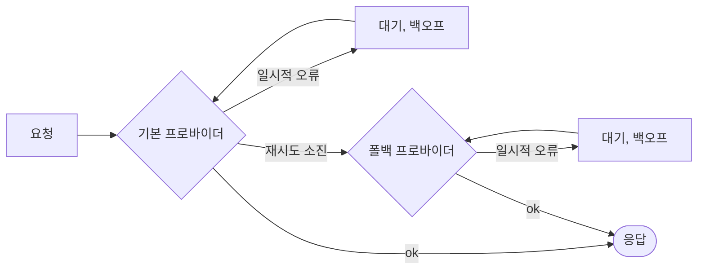

# 재시도와 폴백

네트워크는 실패하고, 프로바이더는 요청 속도 제한에 걸리고, 도구는 타임아웃됩니다. SDK는 재시도할 수 있는 것은 재시도하고, 그럴 수 없는 것은 페일오버하며, **모든 재시도를 실행 안에 기록**해 아무것도 숨기지 않습니다.



## LLM 프로바이더 {#llm-providers}

재시도 정책은 **어떤 폴백보다도 먼저, 프로바이더마다 개별적으로** 적용됩니다.

```ts
const sdk = createSDK({
  apiKey: process.env.OPENAI_API_KEY,
  fallbackProviders: [{ provider: 'anthropic', config: { apiKey: process.env.ANTHROPIC_API_KEY } }],
  retry: { maxRetries: 3, initialDelayMs: 500, maxDelayMs: 8_000 },
});
```

다른 벤더의 폴백 프로바이더에는 자체 키가 필요하며, 그 `config`나 `providerConfig`에 지정합니다. 기본 프로바이더의 키는 다른 벤더로 절대 전송되지 않습니다. 에이전트의 모델은 해당 프로바이더가 지원할 때만 전달되고, 그렇지 않으면 자체 `defaultModel`을 사용합니다(Anthropic은 OpenAI 모델 이름을 거부하며, 그 반대도 마찬가지입니다). `intention.generated` 이벤트에는 실제로 응답한 프로바이더와 사용된 모델이 기록됩니다.

| 옵션 | 기본값 | |
| --- | --- | --- |
| `maxRetries` | `2` | 첫 시도 이후의 재시도 횟수 |
| `initialDelayMs` | `500` | 재시도마다 두 배가 됩니다(`multiplier`) |
| `maxDelayMs` | `8000` | 백오프 대기 한 번의 상한 |
| `maxRetryAfterMs` | `60000` | 존중하는 가장 긴 `retry-after`(폴백이 있으면 `maxDelayMs`) |
| `jitter` | `true` | 각 대기를 [delay/2, delay] 범위에서 무작위로 정합니다 |
| `retryOn` | `isTransientError` | 직접 만든 판별 함수 |

**일시적인** 오류만 재시도합니다. 408, 409, 425, 429, 5xx, 529, 연결 실패, 타임아웃이 해당하며, OpenAI와 Anthropic의 연결 오류도 포함됩니다(클래스와, `cause`에 있는 네트워크 코드로 인식합니다). 인증, 검증, 정책 오류는 즉시 실패하며, 계정의 크레딧이나 할당량이 바닥났다는 뜻의 429(`insufficient_quota`, `credit_balance_exhausted`…)도 마찬가지입니다. 기다린다고 크레딧이 돌아오지는 않기 때문입니다. 오류 메시지에는 공급사의 설명이 담깁니다. 프로바이더가 `retry-after-ms`나 `retry-after`를 보내면, SDK는 자체 백오프 대신 그만큼, 최대 `maxRetryAfterMs`(기본값 60초)까지 기다립니다. `fallbackProviders`가 구성되어 있으면 이 상한은 `maxDelayMs`로 낮아집니다. 긴 대기를 요구하는 프로바이더는 실행을 막는 대신 폴백에 맡깁니다. 그보다 긴 대기 요청이 오면 재시도를 끝냅니다.

SDK 정책이 활성화되어 있으면 OpenAI와 Anthropic 클라이언트 자체의 재시도는 꺼집니다. **재시도는 절대 중첩되지 않습니다.** 각 재시도는 프로바이더, 모델, 시도 횟수, 지연 시간, 오류와 함께 `provider.retry` 이벤트로 기록됩니다. 대신 공급사 기본값을 유지하려면 `retry: false`를 넘기세요.

`llmProvider`로 주입한 프로바이더는 `retry`를 명시적으로 설정하지 않는 한 주어진 그대로 쓰이며, `FallbackProvider`는 절대 감싸지 않으므로 그 페일오버가 트레이스에 계속 보입니다.

## 도구 {#tools}

멱등 도구를 재시도 가능으로 표시하세요.

```ts
sdk.defineTool({
  name: 'lookup_metric',
  description: 'Reads a metric',
  schema: z.object({ metric: z.string() }),
  retry: { maxRetries: 2, initialDelayMs: 200 },
  handler: async ({ metric }) => warehouse.read(metric),
});
```

도구의 실패만 재시도합니다. 정책 거부나 검증 오류는 절대 재시도하지 않습니다. 각 재시도는 `tool.retry` 이벤트입니다.

## 타입 지정 결정 {#typed-decisions}

Jev 클라이언트는 408, 429, 5xx, 529 응답과 네트워크 오류를 **`retry-after`를 존중하며** 재시도하고, SDK 재시도 정책을 기본값으로 씁니다(`jev.maxRetries`가 이를 덮어씁니다). LLM 프로바이더와 달리, 원인과 상관없이 모든 429를 `maxRetries`까지 재시도합니다.

## 그 밖의 모든 곳 {#anywhere-else}

`withRetry`는 여러분의 코드에서 쓸 수 있도록 export되어 있습니다.

```ts
import { withRetry, DEFAULT_RETRY_POLICY } from '@sdk-ai-agents/core';

const data = await withRetry(() => fetchPartnerFeed(), DEFAULT_RETRY_POLICY, {
  onRetry: ({ retry, delayMs, error }) => logger.warn({ retry, delayMs, error }),
});
```
