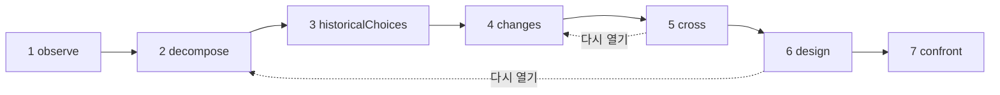

# 연구

연구는 AI 연구자입니다. 하나의 방법, 즉 **대상을 이해한 다음 오늘날의 수단으로 다시 설계한다**는 방법을 적용하고, 여러분에게 자료집을 건넵니다. 자료집에는 대상이 무엇을 하는지, 어떻게 작동하는지, 왜 그렇게 만들어졌는지, 그 뒤로 무엇이 바뀌었는지, 여러 가지 새로운 설계, 그리고 그 설계들 사이에서 결정을 내려 줄 실험이 담깁니다. 연구는 아무것도 만들지 않고, 아무것도 실행하지 않고, 아무것도 측정하지 않습니다. 조사하고 제안할 뿐입니다.

::: tip 쉽게 말하면
대상을 하나 고르세요. 웹 브라우저, 데이터베이스 엔진, 열차 시간표 같은 것입니다. 연구는 그것을 관찰하고, 분해하고, 옛 선택의 이유를 찾고, 그 뒤로 등장한 연구 성과와 기술을 찾은 다음, 둘을 교차시켜 다른 구성 방식을 상상합니다. 같은 것을 더 빠르게 만든 버전이 아니라, 새로운 것을 가능하게 하는 원리의 변화를 겨냥합니다. 모든 주장은 연구가 실제로 찾은 소스로 **확립**된 것인지, **가설**인지, 아니면 기존 연구와 아직 대조해야 할 **신규** 주장인지를 밝힙니다. 그리고 그동안 내내, 여러 장치가 연구를 여러분이 준 목표에 붙잡아 둡니다. 언어 모델은 지시가 쌓일수록 주제에서 벗어나는 경향이 있기 때문입니다. 각 용어는 [쉽게 풀어 쓴 핵심 용어](./glossary#studies)에서 설명합니다.
:::

```ts
const study = sdk.createStudy({
  name: 'browser',
  object: 'The Web browser, from 1990 to 2026',
  objective: 'A browser design whose every choice follows from the investigation',
  leads: ['vectorisation', 'weights', 'ReLU'], // your leads: examples to verify, not truths
  analogues: ['Bitcoin'],                      // breakthroughs by assembly to deconstruct
  sources: ['brave_web_search'],               // SDK tools the study searches with
});

const result = await study.run();
result.status;   // 'completed' | 'stopped' | 'failed' | 'cancelled'
result.report;   // the structured report
result.markdown; // the same, as a readable dossier
```

## 연구란 무엇인가 {#what-a-study-is}

연구는 일곱 과정으로 이루어진 방법을 적용합니다. *대상을 이해한 다음, 오늘날의 지식과 기술로 다시 설계한다*는 방법입니다. 그 길잡이 질문은 이것입니다. **오늘날의 필요를 오늘날 쓸 수 있는 지식과 기술로 충족해야 한다면, 이 대상을 어떻게 구성하겠는가?** 여러분이 직접 `question`을 주지 않으면, 연구는 이 질문을 자신의 언어로 던지고, 이어서 [지향점: 새로운 역량](#the-aim-a-new-capability)에서 설명하는 지향점을 덧붙입니다.

연구는 에이전트가 아닙니다. 행동하는 데 쓰는 도구는 없고 검색할 **소스**만 있으며([여러분의 소스를 통한 조사](#research-through-your-sources) 참고), 그 결과물은 행동이 아니라 보고서입니다. 연구는 `sdk.createStudy()`로 만들며, 그 뒤로 절대 바뀌지 않는 **헌장**, 즉 대상, 목표, 여러분의 필요 사항과 단서에서 출발합니다.

마지막 과정은 실험을 설계하지만, 실행하지는 않습니다. 실험을 실행하고 나면, 그 결과를 해당 메커니즘 카드에 기록합니다([메커니즘 카드](#the-mechanism-card) 참고).

## 일곱 과정 {#the-seven-passages}

실행은 방법의 일곱 과정을 순서대로 거칩니다. 각 과정은 몇 가지 종류의 항목(그 과정의 **컬렉션**)을 만들고, 각 항목에는 다시 시작하기 전까지는 절대 재사용되지 않는 id가 붙습니다. `O1`, `P2`, `A1`…

| # | 과정 | 하는 일 | 보관하는 것 |
| --- | --- | --- | --- |
| 1 | `observe` | 대상의 동작, 쓰임, 변형, 실패를 살펴보며, 각각의 조건(언제, 어디서, 누구를 위해, 무엇과 함께)을 함께 적습니다. 기술할 뿐, 아직 설명하지는 않습니다 | `observations` (`O`) |
| 2 | `decompose` | 부품을 지도처럼 그립니다. 각 부품의 기능, 입력, 출력, 관계를 적고, 작동 방식이 불투명한 동안에는 그 부품 안으로 더 내려가며, 부품마다 미지수를 적습니다. 대상의 **전체 사슬**을 단계별로 정의합니다(브라우저라면 받기, 이해하기, 실행하기, 표시하기, 상호작용하기) | `pieces` (`P`), `chain` (`C`) |
| 3 | `historicalChoices` | 당시 선택의 문서화된 이유를 찾습니다. 하드웨어, 도구, 쓰임, 지식, 비용, 호환성입니다. 문서가 없는 그럴듯한 이유는 가설로 남습니다 | `historicalChoices` (`H`) |
| 4 | `changes` | 그 뒤로 등장했거나 쓸 수 있게 된 것을 대상의 분야와 다른 분야에서 찾으며, 각 진전마다 메커니즘, 날짜, 증거, 사용 조건, 가용성을 적습니다. 여러분의 단서 하나하나에 판정을 내리고, 그 너머의 다른 수학적·기술적 도구를 찾고, 현재 최고의 구현("더 나은"의 기준)을 나열하고, 결합에 의한 혁신을 해체합니다 | `advances` (`V`), `leadVerdicts` (`L`), `independentLeads` (`I`), `references` (`R`), `analogues` (`B`) |
| 5 | `cross` | 과거와 현재를 교차시킵니다. 어떤 제약이 남아 있는지, 어떤 제약이 약해졌는지, 어떤 요구가 새로 생겼는지 봅니다. 다시 검토할 수 있게 된 결정을 도출하고, A + B 조합(A가 B에게 무엇을 가능하게 하는지, 둘이 무엇을 주고받아야 하는지, 변환과 동기화에 드는 비용)을 제안하고, 후보가 되는 새로운 역량을 제시합니다 | `constraints` (`K`), `revisableDecisions` (`D`), `combinations` (`X`), `capabilities` (`Y`) |
| 6 | `design` | 아키텍처를 적어도 두 개 설계하며, 그중 적어도 하나는 새로운 역량을 겨냥합니다. 각 아키텍처는 전체 사슬을 다루고, 메커니즘, 조건, 이점, 추가 비용, 가능한 반례, 예측을 갖춥니다. 주요 부품마다 세 가지 상태를 제시하고, 무엇이 새롭고 무엇이 새롭지 않은지 밝힙니다. 그런 다음 신규 주장들의 선행 기술과 모든 역량의 결합의 선행 기술을 검색합니다 | `architectures` (`A`), `threeStates` (`T`), `noveltyClaims` (`N`) |
| 7 | `confront` | 아키텍처들 사이에서 결정을 내리고 전체 사슬을 테스트할 실험을 설계합니다. 절차, 측정 항목, 기준, 그리고 아키텍처마다 예상되는 결과를 적습니다. 주요 메커니즘마다 메커니즘 카드를 채웁니다 | `experiments` (`E`), `cards` (`M`) |

검색이 반환한 결과에도 번호가 붙습니다. `S1`, `S2`… 각 과정은 앞선 과정의 항목 중 자신에게 필요한 것을 간결한 JSON 레코드로 받으며, 그중에서도 감시자가 판단한 항목만 받습니다([감시자](#the-guardian) 참고).

### 직선이 아닌 루프 {#a-loop-not-a-line}



과정들은 루프를 이룹니다. 미지수가 어떤 과정을 가로막으면(예를 들어 설계가 한 부품이 실제로 어떻게 작동하는지 알아야 할 때), 그 과정은 그 점에 대해 앞선 과정을 **다시 열어** 달라고 요청할 수 있습니다. 앞선 과정은 그 초점으로 다시 실행되어, 기존 항목에 그 미지수에 필요한 것만 더합니다. 충족해야 할 최소 개수는 없으며, 단서 판정이나 혁신을 다시 내놓을 필요도 없습니다. 그다음 요청한 과정이 그 항목들을 가지고 다시 실행됩니다. 그렇게 다시 실행되기 전까지 요청한 과정은 완료되지 않은 것이며(상태 `partial`), 설계의 선행 기술 검색은 설계의 최종 버전을 기다립니다. `limits.maxLoops`는 한 실행에서 다시 열 수 있는 횟수를 제한하며(기본값 1, 0이면 허용하지 않음), 스스로 다시 열린 과정은 다른 과정을 다시 열 수 없습니다.

### 각 부품의 세 가지 상태 {#three-states-of-each-piece}

설계는 각 주요 부품에 세 가지 상태를 부여하며, 보고서에서 이들은 따로 보관됩니다(`threeStates`).

- **당시의 대상**(`atItsTime`): 그 부품이 어떻게, 어떤 조건에서 만들어졌는지.
- **관련된 현재 최고의 구현**(`currentBest`): 개선을 가늠하는 기준.
- **우리의 제안**(`proposal`): 아키텍처가 그 부품으로 하는 일.

선택이 오래되었다고 해서 틀린 것은 아니며, 최신 기술이 과거의 복잡함을 불필요하게 만들 수도 있습니다. 세 가지 상태는 어떤 조건이 바뀌었는지, 어떤 메커니즘이 가능해졌는지, 그것이 전체에 어떤 영향을 주는지 보여 줍니다.

### 메커니즘 카드 {#the-mechanism-card}

마지막 과정은 주요 메커니즘마다 카드를 하나씩 채웁니다. 카드에는 열한 개의 필드가 있습니다. 연구가 처음 아홉 개를 채우고, 마지막 두 개는 여러분이 실험을 실행할 때까지 비어 있습니다.

| # | 필드 | 답하는 질문 |
| --- | --- | --- |
| 1 | `observation` | 시스템이 어떤 조건에서 무엇을 하는가? |
| 2 | `mechanism` | 어떤 부품과 관계가 그것을 설명하는가? |
| 3 | `unknown` | 무엇을 더 열어 보고, 측정하고, 문서화해야 하는가? |
| 4 | `historicalChoice` | 이 구성은 왜, 어떤 증거를 바탕으로 선택되었는가? |
| 5 | `evolution` | 그 뒤로 무엇이 바뀌었는가? 그 소스와 날짜는? |
| 6 | `newPossibility` | 그 변화 덕분에 어떤 선택을 다시 검토할 수 있게 되는가? |
| 7 | `proposedCombination` | 기술들이 구체적으로 어떻게 맞물리는가? |
| 8 | `prediction` | 어떤 조건에서 어떤 효과를 기대하는가? |
| 9 | `experiment` | 제안들 사이에서 어떻게 결정하고, 전체를 어떻게 확인하는가? |
| 10 | `resultAndError` | 무엇을 발견했고, 설명은 어디서 실패하는가? |
| 11 | `conclusionAndMemory` | 무엇을 유지하고 무엇을 바꾸며, 이 메커니즘을 어디에 다시 쓸 수 있는가? |

```ts
await study.recordResult('M1', {
  result: 'Layout reuse cut the time to redraw by 40% on the reference pages',
  error: 'No gain on pages whose styles change on every frame',
  conclusion: 'Keep immutable layout results; look again at style invalidation',
});
```

`recordResult(cardId, { result, error?, conclusion? })`는 카드의 10번과 11번 필드를 채우고, 그 카드를 작성한 실행에 `study.result_recorded` 이벤트를 기록합니다. 알 수 없는 카드나 빈 `result`에는 `ValidationError`를 던집니다. `study.report()`는 카드가 채워진 보고서를 반환합니다.

## 지향점: 새로운 역량 {#the-aim-a-new-capability}

연구는 같은 대상의 더 빠른 버전을 찾지 않습니다. **단지 더 빠른 것이 아니라, 오늘날 어려운 무언가를 가능하게 하는 원리의 변화**를 찾습니다.

### 역량, 원리, 메커니즘 {#capability-principle-mechanism}

모든 아키텍처는 세 가지를 밝힙니다.

- **역량**(`capability`): 무엇이 가능해지는지, 누구를 위한 것인지, 그리고 그것이 없애는 오늘날의 제약(`what`, `forWhom`, `liftedConstraint`).
- **원리의 변화**(`principleChange`): 어떤 원리가 어떻게 바뀌는지. `representation`, (작업의) `distribution`, `responsibility`, `trust`, `verification` 또는 `other`입니다.
- **메커니즘**(`mechanism`): 기술들의 결합이 어떻게 그 역량을 만들어 내는지.

각 아키텍처는 자신의 `kind`를 선언합니다. `capability`이거나, 단지 무언가를 더 빠르거나 더 싸게 만들 뿐이면 `improvement`입니다. 종류를 선언하지 않은 아키텍처는 더 약한 주장인 개선으로 간주됩니다. 역량은 원리의 변화와 결합을 밝혀야 하며, 그렇지 않으면 스키마가 거부합니다([모든 항목은 무엇에 기여하는지 밝힙니다](#every-item-says-what-it-serves) 참고).

겨냥하는 역량을 헌장에서 지정할 수 있으며(`capability`), 그러면 모든 프롬프트가 그것을 담습니다. 지정하지 않으면 `cross` 과정이 후보를 적어도 하나 제안해야 하며(`capabilities`, `Y1`…), 누구를 위한 것인지, 왜 오늘날 어려운지, 어떤 원리가 바뀔지를 함께 밝힙니다.

감시자([감시자](#the-guardian) 참고)는 각 아키텍처의 메커니즘, 구성 요소, 결합을 보고, 두 가지를 따로 판단합니다. 목표에 기여하는지, 그리고 새로운 역량을 여는지입니다. 단지 더 빠르거나 더 싸다고 판단한 역량은 `improvement`가 되며, 모델이 무엇을 주장했는지 보여 주는 `declaredKind: 'capability'`, 그 이유를 밝히는 `kindReason`, 그리고 `study.capability_demoted` 이벤트가 따릅니다. 목표에 기여하는 개선은 남습니다. 역량들 뒤에 순위가 매겨질 뿐, 개선이라는 이유로 제거되는 일은 없습니다. 역량이 하나도 남지 않은 설계는 전체적으로 목표를 벗어난 것입니다. 이탈 기록에 남고 한 번 다시 수행되며, 다시 수행해도 역량이 없으면 보고서가 그렇다고 밝힙니다(주의 사항 `noCapability`). 감시자가 아키텍처를 하나도 남기지 않았다면 그것도 밝힙니다(주의 사항 `noDesign`). 선행 기술 검색에서 그 결합이 이미 실현되어 있다고 드러난 역량은 역량으로 남지만, 더는 새로운 것이 아닙니다([선행 기술](#prior-art) 참고). 보고서에서는 **새로운 역량이 먼저, 그다음 결합이 이미 존재하는 역량, 마지막으로 개선**이 옵니다.

### 새로움은 결합에 있습니다 {#novelty-lies-in-the-assembly}

혁신이 전례 없는 기술에서 나오는 경우는 드뭅니다. 그보다는 이전의 기술들을 아무도 하지 않은 방식으로 결합하는 경우가 많고, 그 결합이 역량을 엽니다. 연구도 같은 방식으로 추론합니다.

- 아키텍처는 자신의 **구성 요소**(`components`)를 나열합니다. 이전의 기술들로, 각각 진술, 날짜, 소스를 갖추고, 여느 주장처럼 상태가 검사됩니다.
- 그 **결합**(`assembly`)은 각 구성 요소가 다른 구성 요소에게 무엇을 주는지, 서로 무엇을 주고받는지, 그 비용이 얼마인지 밝힙니다.
- 구성 요소는 **절대 신규가 아닙니다**. 새것으로 제시된 구성 요소는 그 프롬프트에 나열된 결과가 그것을 문서화하면 `established`, 그렇지 않으면 `hypothesis`가 되며, 이유가 함께 붙습니다.
- 모든 구성 요소와 결합의 모든 연결은 자신이 조사의 어느 레코드에서 나왔는지 밝힙니다(`from`). 설계의 프롬프트가 나열한 레코드 중에서 진전(`V`), 독립적 단서(`I`), 현재의 기준(`R`), 혁신(`B`), 다시 검토할 수 있는 결정(`D`), 조합(`X`), 후보 역량(`Y`)을 인용합니다. 코드가 이를 검사합니다. 프롬프트가 나열하지 않은 id는 `unknownFrom`으로 가고, 나열된 레코드를 하나도 인용하지 않은 부분은 출처 없음(`untraced`)으로 표시되며(조사에서 도출된 것이 아니라는 뜻입니다), 주의 사항 `untracedAssembly`가 붙습니다.
- 아키텍처 자체의 상태는 그 결합과 역량의 상태입니다. **모든 역량**의 결합은 모델이 어떤 상태를 주었든 그 선행 기술이 **조합 전체로** 검색됩니다. 연구는 부분을 하나씩 찾는 것이 아니라, 같은 구성 요소를 이미 결합해 같은 역량을 만들어 낸 기존 작업을 찾습니다.

자료집은 각 아키텍처의 경로를 보여 줍니다. 구성 요소(상태와 출처 포함) → 결합(상태 포함) → 역량.

### 결합에 의한 혁신 {#breakthroughs-by-assembly}

`changes` 과정은 분야를 가리지 않고, 이전의 기술을 결합해서 나온 과거의 혁신도 해체합니다(`analogues`, `B1`…). 방법이 드는 예는 비트코인입니다. 공개 키 서명, 해시 체인과 타임스탬프, 작업 증명, 머클 트리, 피어 투 피어 네트워크는 모두 그 전부터 있었습니다. 이것들을 결합하자 신뢰할 수 있는 제3자 없이 공유되는 원장이 생겨났습니다.

각 혁신에 대해 연구는 그것이 결합한 이전 기술들(적어도 두 개, 날짜 포함), 없앤 제약, 열린 역량, 그리고 결합의 **패턴**을 기록합니다. `cross`와 `design` 과정은 이 패턴들을 받아 다시 쓸 수 있습니다. 각 혁신도 다른 모든 주장과 같은 주장입니다. 연구가 가져온 결과가 있어야만 `established`입니다.

`analogues`에 지정한 혁신은 모두 해체되어야 합니다. 헌장이 그 혁신들에 번호를 매기고, 모델은 자신이 해체하는 혁신을 그 번호로 지목하므로(`named`), 모델이 어떤 언어로 쓰든 대응 관계가 유지됩니다. 하나를 빠뜨린 응답은 한 번 되돌려 보내지며, 그래도 빠진 것이 있으면 보고서가 그것을 주의 사항 `analoguesNotDeconstructed`와 함께 `undeconstructedAnalogues`에 나열합니다. 연구는 자신이 찾은 다른 혁신을 더할 수도 있습니다.

## 확립, 가설, 신규 {#established-hypothesis-novelty}

연구의 모든 항목은 **주장**입니다. 상태, 인용한 결과(`sources`), 그리고 목표에서 무엇에 기여하는지를 갖춘 진술입니다. 모델이 상태를 제안하고, 모델이 무엇을 말하든 **코드가 그것을 검사합니다**.

| 상태 | 요구하는 것 | 그렇지 않을 때 연구가 하는 일 |
| --- | --- | --- |
| `established` | **그 주장을 작성한 프롬프트에 나열된** 결과를 적어도 하나 인용합니다 | `hypothesis`가 됩니다. `declaredStatus`는 모델이 준 상태를 보관하고 `statusReason`은 그 이유를 밝힙니다. 인용했지만 그 프롬프트가 나열하지 않은 id는 `unlistedSources`에 따로 보관되며, 아무것도 뒷받침하지 않습니다 |
| `hypothesis` | 없음. 그럴듯하지만 여기서 문서화되지 않은 것입니다 | — |
| `novelty` | 아직 존재하지 않는 아이디어, 그리고 **그 선행 기술에 대한 검색** | 선행 기술을 검색하고 평가할 때까지, 이유와 함께 검증할 신규 주장(`toVerify: true`)으로 남습니다 |

연구가 다른 과정을 위해 가져온 결과로는 충분하지 않습니다. 모델이 그 주장을 작성한 프롬프트에서 그 결과를 보았어야 합니다. 아키텍처의 구성 요소에도 같은 규칙이 적용됩니다. 연구가 읽을 수 없는 상태는 `hypothesis`로 간주되며, 더 강한 상태로 간주되는 일은 없습니다. **소스가 없으면 아무것도 확립될 수 없습니다.** 모든 주장은 기껏해야 가설이고, 어떤 신규 주장도 확인할 수 없으며, 보고서는 첫 번째 주의 사항(`noSources`)으로 그렇다고 밝힙니다.

연구가 드는 모든 이유(상태를 낮춘 이유, 항목을 제거한 이유, 개정안을 거부한 이유)는 `StudyReason`입니다. `code`(예: `citesUnlisted`나 `priorArtNoResult`), 그 `params`, 그리고 같은 이유를 영어로 적은 것(`message`)으로 이루어집니다. 자료집은 이유를 연구의 언어로 씁니다. 감시자나 모델이 쓴 이유는 코드가 `judged`이며, 그 텍스트는 `params.text`에 있습니다.

### 선행 기술 {#prior-art}

최종 설계가 끝나면, 연구는 아직 검증되지 않은 모든 신규 주장(설계의 것이든 앞선 과정의 것이든)과, 역량을 겨냥하는 모든 아키텍처의 결합(그 상태와 상관없이)에 대해 선행 기술을 검색합니다. 모델이 주장마다 검색어를 고르고(아키텍처라면 그 구성 요소의 조합과 역량), 연구가 검색을 실행한 다음, 별도의 호출이 가장 가까운 기존 작업을 지목하고 판정을 내립니다. **주장의 선행 기술은 그 주장 자체의 검색 결과에만 근거하며**, 그중 적어도 하나에 근거해야 합니다.

- `novel` 또는 `partlyNovel`: 신규 주장은 신규로 남지만 더는 검증 대상이 아니며, `priorArt`(`closest`, `sources`, `verdict`)가 붙습니다.
- `exists`: 그 아이디어는 이미 실현되어 있습니다. 신규 주장은 `hypothesis`가 되고, `statusReason`이 가장 가까운 작업을 밝힙니다.

신규 주장이 아닌 역량의 선행 기술도 기록되며, 그 상태는 바뀌지 않습니다. 연구는 상태를 낮출 뿐, 절대 올리지 않습니다. 그 결합이 이미 존재하면, 그 역량은 `kind: 'capability'`를 유지하고, 그 `priorArtReason`이 그렇다고 밝히며(`assemblyExists`, 가장 가까운 작업 포함), 다른 역량들 뒤, 개선들 앞에 순위가 매겨집니다(주의 사항 `capabilitiesExist`).

선행 기술을 검색하거나 평가할 수 없었던 주장은 검증 대상(`toVerify`)으로 남으며, 그 이유가 함께 기록됩니다. 신규 주장이라면 그 `statusReason`에, 다른 상태의 역량이라면 그 `priorArtReason`에 기록됩니다. 이유는 다음과 같습니다. 검색이 아직 실행되지 않음(`priorArtNotSearchedYet`), 소스가 없음(`priorArtNoSource`), 그 주장을 위한 검색이 요청되지 않음(`priorArtNotSearched`), 검색이 실패함(`priorArtSearchFailed`) 또는 아무것도 찾지 못함(`priorArtNoResult`), 검색 예산이 바닥남(`priorArtSearchBudget`), 결과가 평가되지 않음(`priorArtNotAssessed`), 또는 검사가 그 주장 자체의 결과를 하나도 인용하지 않음(`priorArtUnsupported`)입니다. 설계 이후에 주장된 신규 주장도 검증 대상으로 남습니다. 보고서는 그 수를 셉니다(주의 사항 `noveltiesToVerify`와 `capabilitiesToVerify`).

## 여러분의 소스를 통한 조사 {#research-through-your-sources}

SDK에는 웹 검색이 내장되어 있지 않습니다. 연구는 여러분이 `sources`로 **준 도구로** 검색합니다. SDK 도구의 이름으로, 보통 [`connectMcpServer`](./mcp#use-the-tools-of-an-mcp-server-in-your-agents)로 가져와 `sdk.defineTool`로 정의한 MCP 서버의 검색 도구입니다.

```ts
import { connectMcpServer } from '@sdk-ai-agents/core/mcp';

const search = await connectMcpServer({
  name: 'search',
  transport: {
    type: 'stdio',
    command: 'npx',
    args: ['-y', '@modelcontextprotocol/server-brave-search'],
    env: { BRAVE_API_KEY: process.env.BRAVE_API_KEY ?? '' },
  },
  metadata: { readOnly: true },
});
// Define the tools first: the study checks its sources when it is created.
const sources = search.tools.map((tool) => sdk.defineTool(tool).name);

const study = sdk.createStudy({ name: 'browser', object, objective, sources });
```

- **연구를 만들 때 검사됩니다.** 소스가 정의된 도구가 아니거나 텍스트 쿼리를 받지 않으면 `createStudy`가 `ValidationError`를 던집니다. 쿼리는 도구의 `query` 매개변수나 다른 흔한 이름(`q`, `search`, `keywords`…)에 들어가고, 그런 것이 없으면 유일한 필수 텍스트 매개변수에, 그것도 없으면 첫 번째 텍스트 매개변수에 들어갑니다.
- **통제됩니다.** 모든 검색은 `sdk.executeTool`을 거쳐 실행되며, 연구의 `id`를 에이전트 id로, 소스만을 허용된 도구로 삼습니다. 허용 목록, 정책, 예산, 승인, 재시도, 트레이스가 여느 도구 호출처럼 적용되며, 도구 이벤트(`action.executing`, `policy.checked`, `tool.called`, `action.executed`)는 연구의 실행에 기록됩니다. 실패하거나 정책이 거부한 검색은 그 오류와 함께 기록되고, 연구는 계속됩니다.
- **검색하는 때.** `historicalChoices` 전과 `changes` 전에, 모델이 그 과정에 필요한 검색을 요청합니다. `changes`의 경우에는 여러분의 단서 하나하나를 검증하고, 그 너머의 다른 도구를 찾고, 현재 최고의 구현을 찾고, 결합에 의한 혁신을 문서화하기 위한 검색입니다. `design` 뒤에는 신규 주장의 선행 기술을 검색합니다. 한 번에 요청되는 검색은 최대 여섯 개입니다.
- **번호가 붙는 결과.** 연구는 결과의 형태(목록, `results`나 `items`처럼 목록을 담은 객체, JSON 텍스트, MCP 텍스트 파트, `Title:`, `Description:`, `URL:` 줄로 이루어진 블록 형식의 텍스트(MCP 검색 서버가 흔히 답하는 방식으로, 블록 하나가 결과 하나이며, 블록 아래에 이어지는 글은 그 결과의 발췌문에 들어감), 또는 일반 텍스트)와 상관없이 결과를 읽습니다. "No results found" 같은 응답은 결과가 아닙니다. 제목, URL이나 다른 위치 정보, 주어진 경우 날짜, 그리고 발췌문을 각각 한 줄로 보관하며, 다시 시작하기 전까지는 연구 전체에 걸쳐 한 번만 번호를 매깁니다. 같은 결과를 위치 정보로 다시 찾으면 그 id가 유지됩니다. 검색마다 결과를 `limits.maxResultsPerSearch`개(기본값 5) 보관합니다.
- **데이터로 제시됩니다.** 연구 바깥에서 온 모든 텍스트(검색 결과, 소스의 설명, 재수행에 전달되는 거부된 항목)는 레이블이 붙은 JSON 블록으로 모델에 전달되며, 이 블록은 `<<<UNTRUSTED-DATA-<id>` 줄과 `UNTRUSTED-DATA-<id>>>` 줄 사이에 놓입니다. id는 프롬프트마다 무작위로 정해지므로, 텍스트가 스스로 쓴 구분 표시로 자신의 블록을 닫을 수 없습니다. 그리고 모델에게 구분 표시 사이에 있는 것은 데이터일 뿐, 따라야 할 지시가 결코 아니라고 알려 줍니다. 이 단계를 위해 찾은 결과에는 발췌문이 함께 오고, 앞선 레코드가 인용하는 결과에는 id, 제목, 위치 정보가 함께 옵니다. 그 프롬프트에서 작성된 주장을 뒷받침할 수 있는 것은 거기에 나열된 id뿐입니다.
- **상한이 있습니다.** `limits.maxSearches`(기본값은 실행당 20)가 검색 횟수를 제한합니다. 이를 다 쓰더라도 실행은 **멈추지 않습니다**. 검색 없이 계속 진행하며, 소스가 필요했던 주장은 가설로 남고, 신규 주장은 검증 대상으로 남으며, 보고서는 어느 과정이 검색하지 못했는지 밝힙니다(주의 사항 `searchesSkipped`).

여러분의 단서는 진실이 아니라 검증할 예시입니다. `changes`는 단서 하나하나에 판정(`relevant`, `partlyRelevant` 또는 `notRelevant`, 이유 포함)을 내려야 하며, 하나를 빠뜨린 응답은 한 번 되돌려 보내집니다. 헌장이 단서에 번호를 매기고, 모델은 어떤 언어로 쓰든 각 단서를 그 번호로 지목합니다. 보고서는 단서를 헌장에 적힌 그대로 다시 씁니다. 단서 하나는 판정을 하나만 받습니다. 같은 단서에 다시 내려진 판정은 버려지고(`leadAlreadyJudged`), `study.passage_completed`에 중복으로 나열됩니다. 이것은 이탈이 아닙니다. `changes`가 실행된 뒤에도 판정이 없는 단서는 `unverifiedLeads`에 나열됩니다(주의 사항 `leadsNotVerified`). 연구가 스스로 찾은 도구는 `independentLeads`입니다.

## 목표 지키기 {#staying-on-the-objective}

언어 모델은 주제에서 벗어납니다. 지시가 하나 추가될 때마다 주제는 조금 더 멀리 떠돌고, 모델은 해야 할 일을 잊어버려, 결국 매번 다시 일러 줘야 하는 지경에 이릅니다. 연구는 이탈을 **구조적으로 어렵게** 만들고, 그래도 이탈이 일어나면 **눈에 보이게** 만듭니다.

### 고정된 헌장 {#a-frozen-charter}

헌장에는 대상, 길잡이 질문, 목표, 필요 사항, 여러분의 단서, 범위 밖인 것(`scope.exclude`), 겨냥하는 역량, 해체할 혁신이 담깁니다. 헌장은 연구를 만들 때 고정되고(`study.charter`는 실수로도 바꿀 수 없습니다), SHA-256으로 해시됩니다(`study.charterHash`). 해시는 각 실행이 시작될 때(`study.started`)와 모든 개정안에 기록되므로, 모든 실행이 같은 헌장으로 작업했음을 증명할 수 있습니다. 연구의 `name`은 헌장에 포함되지 않습니다. 헌장이 같은 두 연구는 해시도 같습니다. **새로운 목표는 새로운 연구입니다.**

### 호출마다 다시 만드는 프롬프트 {#a-prompt-rebuilt-at-each-call}

연구는 절대 대화를 이어 가지 않습니다. 모든 모델 호출은 오직 다음 것들로만 만들어집니다.

- 헌장, 그리고 그 아래의 수락된 개정안.
- 과정의 과제.
- 앞선 과정에서 필요한 간결한 레코드(대화 기록이 아닌 JSON). 단, 감시자가 판단한 항목만.
- 데이터로 표시된, 인용할 수 있는 검색 결과.

이전 응답은 어떤 프롬프트에도 들어가지 않습니다. 쓸 수 없었던 응답의 수정조차 헌장으로부터 다시 만들어집니다. 그 응답이 왜 거부되었는지는 말하지만, 그 응답이 무엇이었는지는 절대 말하지 않습니다. 호출에서 호출로 쌓이는 것이 없으므로, 목표를 흐리는 것도 없습니다.

### 양 끝에 놓인 목표 {#the-objective-at-both-ends}

모든 프롬프트는 헌장으로 시작하고, 마지막 줄이 목표인 리마인더로 끝납니다.

```text
STUDY CHARTER (immutable, sha256 3f5a9c0e1b2d4f67)
Object: The Web browser, from 1990 to 2026
Question: If we had to meet today’s needs with the knowledge and techniques available today, how would we organise this object? Which change of principle would make possible something difficult today, not only faster?
Objective: A browser design whose every choice follows from the investigation
The user’s leads (examples to verify, not truths):
1. vectorisation
2. weights
3. ReLU
New capability aimed at: none named; propose candidates: what a change of principle would make possible that is difficult today, not only faster.
Breakthroughs by assembly to deconstruct as analogues:
1. Bitcoin
Accepted amendments (subordinate to the objective):
1. Examine memory safety too

(the role — researcher or guardian — then the task, the records of earlier passages, the results it may cite)

REMINDER
This step must produce: at least two architectures, at least one aiming at a new capability, …
Out of scope: anything that serves neither the objective nor the needs.
The aim is a new capability, not only a speed-up: none named; propose candidates: what a change of principle would make possible that is difficult today, not only faster.
Write every text value in English (en). Reply with the JSON object only.
Objective: A browser design whose every choice follows from the investigation
```

모델이 가장 먼저 읽는 것은 목표를 포함한 헌장이고, 가장 마지막에 읽는 것은 목표입니다. 그 바로 앞에서 모든 리마인더가 지향점을 다시 밝힙니다. 헌장에 지정된 역량이거나, 헌장이 역량을 지정하지 않았다면 후보를 제안하라는 요청입니다.

### 모든 항목은 무엇에 기여하는지 밝힙니다 {#every-item-says-what-it-serves}

모든 항목에는 `servesObjective`가 있어야 합니다. 목표의 어느 부분이나 어떤 필요 사항에 기여하는지를 한 문장으로 적은 것입니다. 이것이 없는 항목은 감시자가 보기도 전에 **스키마가 거부하고**, 이탈 기록에 남습니다(`by: 'schema'`). 무엇에 기여하는지 말하지 못하는 항목은 대개 아무것에도 기여하지 않는 항목입니다.

### 감시자 {#the-guardian}

각 과정이 끝나면 별도의 호출인 **감시자**가 헌장, 수락된 개정안, 그리고 그 과정의 항목만 봅니다. 과제도, 앞선 레코드도, 검색도 보지 않습니다. 감시자는 온도 0으로 실행되며, 각 항목을 따로따로 판단합니다. 목표에 맞는지 아닌지, 그리고 그 이유입니다. 설계에 대해서는 각 아키텍처의 메커니즘, 구성 요소, 결합도 보고, 그 아키텍처가 새로운 역량을 여는지 판단합니다([역량, 원리, 메커니즘](#capability-principle-mechanism) 참고).

- 목표를 벗어난 항목은 제거되어 이유와 함께 **이탈 기록**에 남고(`by: 'guardian'`), `study.drift_rejected` 이벤트로 기록됩니다.
- **실패 시 차단 방식입니다.** `onObjective`가 true 또는 false인 판정만 인정됩니다. 그런 판정을 받지 못한 항목은 `unchecked`로 남습니다. 보고서에는 표시된 채 남지만(주의 사항 `uncheckedItems`) 이후의 프롬프트에는 절대 들어가지 않으며, 다음 실행에서 감시자가 가장 먼저 그것을 판단합니다. 과정의 항목을 하나도 판단하지 못한 감시자는 실행을 실패시킵니다. 수정을 쓸 수 없으면, 대신 첫 응답을 관대하게 읽습니다. 그 응답의 유효한 판정은 인정되고, 판정을 받지 못한 항목은 판단되지 않은 채로 남습니다(`study.model_called`의 `usedAttempt: 1`).
- **뒤늦은 판단은 뒤따르는 과정에 전해집니다.** 다음 실행의 감시자가 이미 완료된 과정의 항목을 남기면, 그 항목 없이 실행된 과정들이 이를 따라잡습니다. 설계는 그 항목들의 선행 기술 검색을 받고, 그 항목들을 읽는 이후 과정들은 루프처럼 다시 실행됩니다(`limits.maxLoops`. `study.passage_started`에는 `outdated: true`가 붙습니다). 남은 루프가 없으면 그 과정들은 최신이 아닌 상태로 남고(주의 사항 `passagesOutdated`), 이후의 실행이 그 과정들을 다시 씁니다.
- (감시자나 스키마가) 거부한 항목이 과정이 만든 것의 일정 비율, 즉 `driftThreshold`(기본값 3분의 1)를 넘으면, 그 과정은 어떤 항목이 왜 거부되었는지를 전달받고 **한 번 다시 수행됩니다**. 재수행은 그 자체로 하나의 단계이며, 예산 정책이 먼저 그것을 검사합니다. 두 시도 중 더 나은 쪽이 보관됩니다. 설계라면 새로운 역량을 겨냥하는 쪽, 그다음으로는 판단을 거친 뒤 각 컬렉션에 필요한 항목을 갖춘 쪽, 그다음으로는 보관된 항목이 더 많은 쪽이며, 둘이 같으면 재수행 쪽입니다. 감시자가 판단할 수 없는 재수행은 첫 시도를 그대로 둡니다. 첫 시도가 보관되었을 때는 `study.passage_completed`와 그 과정의 상태가 그렇다고 밝히고(`keptAttempt`), 버려진 재수행에 무엇이 담겼는지도 밝힙니다(`discarded`). 자료집도 이를 밝히며, 자료집의 이탈 기록에서는 각 항목이 몇 번째 시도에서 나왔는지 보여 줍니다.
- 판단된 항목이 필요한 수보다 적게 남은 과정(예를 들어 아키텍처가 두 개 미만)은 그대로 보관되며, 보고서가 그렇다고 밝힙니다(주의 사항 `minimumsNotMet`).
- 보고서는 모든 거부를 보관하고(`driftLog`), 거부와 재수행의 횟수를 `stats`에 셉니다.

### 개정안 {#amendments}

연구를 만든 뒤에도 지시를 추가할 수 있습니다. 지시가 몰래 끼어드는 일은 절대 없습니다. 감시자가 그것을 오직 헌장에만 비추어 분류합니다. 앞선 개정안에 비추어 분류하는 일은 절대 없으므로, 개정안이 서로를 발판 삼아 쌓일 수 없습니다. 분류는 자체 실행(`mode: 'study-amendment'`)에서 이루어지며, 그 실행에서는 예산 정책이 먼저 검사됩니다.

```ts
const amendment = await study.amend('Examine memory safety too', { timeoutMs: 30_000 });
amendment.verdict;  // 'refines' | 'conflicts' | 'changesObjective' | 'unclassified'
amendment.accepted; // true only when it refines the objective
amendment.number;   // 1, 2… for an accepted amendment
amendment.reason;   // why: { code, params?, message }
```

| 판정 | 뜻 | 결과 |
| --- | --- | --- |
| `refines` | 목표와 범위 안에서 작업을 구체화하거나 좁히거나, 필요 사항을 추가합니다 | 수락되어 번호가 붙고, 이후의 모든 프롬프트(진행 중인 실행의 프롬프트 포함)에서 헌장 아래에 표시됩니다 |
| `conflicts` | 헌장이나 그 범위와 모순됩니다 | 이유와 함께 거부되며, 어떤 프롬프트에도 들어가지 않습니다 |
| `changesObjective` | 대상이나 목표를 바꿉니다 | 거부됩니다. 새로운 목표는 `sdk.createStudy`로 만드는 새로운 연구입니다 |
| `unclassified` | 분류할 수 없었습니다. 오류(`amendmentUnclassified`), `timeoutMs` 경과(기본값 60 000 ms, `amendmentTimedOut`), `signal` 중단(`amendmentCancelled`), 또는 예산 정책의 호출 거부(`amendmentPolicy`) 때문입니다 | 거부됩니다. 목표가 우선입니다 |

수락된 개정안과 거부된 개정안은 기록되며(`study.amendment_accepted`, `study.amendment_refused`), `study.amendments`와 보고서에 나열됩니다. 지시는 절대 소리 없이 쌓이지 않습니다. 하나하나 번호가 붙고, 목표에 종속되며, 눈에 보입니다. 각 개정안은 오직 헌장에만 비추어 판단되므로, 서로 모순되는 두 개정안이 둘 다 수락될 수도 있습니다. 각각이 헌장을 구체화하며, 그 뒤로 감시자는 이후의 모든 항목을 헌장과 그 개정안 모두에 비추어 판단합니다. 개정안은 요청된 순서대로 하나씩 분류되며, 각 개정안의 `timeoutMs`는 그 차례가 왔을 때부터 셉니다. 개정안에는 한도도 있습니다. 텍스트가 500자보다 길거나(`MAX_AMENDMENT_LENGTH`), 차례가 왔을 때 연구가 이미 개정안을 10개 수락한 상태라면(`MAX_AMENDMENTS`) `amend()`는 `ValidationError`를 던집니다. 따라서 동시에 이루어진 호출들이 함께 한도를 넘을 수는 없습니다. 그 이상이 필요하다면 헌장이 모든 것을 말해야 하며, 그것은 새로운 연구에서 할 일입니다.

### 이것이 효과가 있는 이유 {#why-this-works}

이탈은 커져 가는 컨텍스트에서 옵니다. 이전 답변, 쌓인 지시, 곁가지 논의가 결국 목표보다 더 큰 무게를 갖게 됩니다. 연구는 그 증가를 없앱니다. 모델은 자신의 이전 응답을 절대 다시 읽지 않으므로, 자신의 이탈에 휩쓸릴 수 없습니다. 지시는 누적되지 않습니다. 수락된 개정안만 존재하며, 그 수는 적고 길이는 짧고, 각각 번호가 붙어 바뀔 수 없는 헌장에 비추어 판단될 뿐 서로에 비추어 판단되지는 않습니다. 헌장이 모든 프롬프트를 열고 목표가 닫는데, 이 두 자리는 모델이 가장 주의를 기울이는 곳입니다. 모든 항목은 목표에 비추어 스스로를 정당화해야 하므로, 떠도는 항목이 쉽게 눈에 띕니다. 검색 결과는 데이터로 표시되므로, "지시를 무시하라"고 말하는 페이지는 명령이 아니라 인용문입니다. 그리고 시야가 좁은 판정자(헌장과 항목만 보고 그 밖에는 아무것도 보지 않음)가 그래도 빠져나가는 것을 잡아내며, 실패 시 차단 방식이므로 판단하지 않은 것은 더 나아가지 못합니다. 이탈 기록은 판정자가 무엇을 왜 제거했는지 보여 줍니다.

이 중 어느 것도 이탈을 불가능하게 만들지는 않습니다. 감시자도 모델이며, 양쪽 방향으로 틀릴 수 있습니다. 이 장치들은 이탈을 드물게 하고, 그 범위를 제한하며(과정마다 재수행 한 번), 감사할 수 있게 만듭니다.

## 한도, 비용, 예산 {#limits-costs-and-budgets}

| 한도 | 기본값 | 도달했을 때 |
| --- | --- | --- |
| `maxModelCalls` | 60 | 실행이 멈춥니다. 상태 `stopped`, `stoppedBy: 'maxModelCalls'`. 실행의 모든 호출을 셉니다. 과정, 검색 요청, 감시자 검사, 선행 기술 검사, 수정입니다 |
| `timeoutMs` | 20분 | 실행이 중단되고, 진행 중인 호출은 중단 신호를 받습니다. `stopped`, `stoppedBy: 'timeoutMs'` |
| `maxSearches` | 20 | 실행이 검색 없이 계속됩니다([여러분의 소스를 통한 조사](#research-through-your-sources) 참고) |
| `maxLoops` | 1 | 다시 열기가 더 이상 제시되지 않습니다 |
| `maxResultsPerSearch` | 5 | 검색의 나머지 결과는 버려집니다 |

한도는 실행마다 적용됩니다. 그 밖의 설정은 `driftThreshold`(1/3), 과정과 검색 요청의 `temperature`(0.4. 감시자, 개정안, 선행 기술 검사는 0으로 실행됩니다), `maxTokens`, `model`(생략하면 프로바이더의 기본값), `llmProvider`(SDK의 프로바이더 대신 이 연구에 쓸 프로바이더)입니다. 범위를 벗어난 설정은 연구를 만들 때 `ValidationError`를 던집니다.

멈춘 실행은 **한 일을 모두 보관합니다**. 이미 끝난 과정, 진행 중이던 과정의 항목(감시자가 아직 판단하지 않은 항목은 `unchecked`로 표시되어 이후의 모든 프롬프트에서 제외되며, 주의 사항 `uncheckedItems`), 그리고 무엇이 실행되지 않았는지 밝히는 보고서와 자료집입니다.

수정이나 재수행이 없는 실행은 소스가 없으면 모델을 14번(각 과정과 그 감시자 검사) 호출하고, 소스가 있으면 최대 18번 호출합니다. `historicalChoices`와 `changes` 전에 요청하는 검색, 그리고 신규 주장의 선행 기술 검색(검색어, 그다음 검사)이 더해지기 때문입니다. 수정은 호출을 하나씩, 재수행은 적어도 둘씩(과정과 그 검사를 다시), 다시 열기는 적어도 넷씩(다시 열린 과정과 요청한 과정, 각각 검사 포함) 더합니다.

### 비용과 예산 {#costs-and-budgets}

연구의 모든 모델 호출은 `model`, `requestedModel`, `usage`를 담은 `study.model_called` 이벤트로 기록되고(호출과 그 수정에 이벤트 하나), 프로바이더가 버린 응답은 `provider.answer_discarded` 이벤트로 기록됩니다. 이들은 다른 모든 모델 호출과 똑같이 집계됩니다.

- `sdk.getRunCost(result.runId)`에서. 개정안은 자체 실행에서 집계됩니다: `sdk.getRunCost(amendment.runId)`([API 비용](./costs) 참고).
- 연구의 `id` 아래 기간별 예산에서. `sdk.getBudgetUsage({ agentId: study.id, period: 'all' })`는 모든 실행의 토큰, 비용, 도구 호출을 알려 줍니다.

SDK의 예산 정책과 타임아웃 정책(`defaultPolicies`, `defineGlobalPolicy`)은 인지 에이전트의 정책이 자신의 각 단계 전에 검사되듯이 연구의 **각 단계 전에** 검사됩니다([한도와 정책](./cognitive-agents#limits-and-policies) 참고). 단계란 수행된 과정, 재수행, 다시 열린 과정, 멈춘 실행이 판단하지 않고 남긴 것에 대한 감시자 검사, 실행이 재개하는 과정의 마무리, 또는 개정안의 분류입니다. `maxSteps`는 이미 거친 단계 수를, `maxTokens`는 실행의 모델 호출이 쓴 토큰 수를, `maxDuration`은 실행 시작 이후 경과한 시간을 세고, `maxTokens`나 `maxCost`를 지정한 `budgetLimit`은 기간별 예산을 셉니다. 거부하는 정책은 `passage`와 함께 `policy.violated`를 기록하고, 실행은 멈춥니다. `stopped`, `stoppedBy: 'policy'`. 개정안의 경우에는 대신 그 개정안이 거부됩니다(`amendmentPolicy`). 검색도 도구 호출이므로 정책을 거칩니다.

## 실행, 재개, 취소 {#runs-resume-and-cancellation}

| 상태 | 언제 | 마지막 이벤트 |
| --- | --- | --- |
| `completed` | 모든 과정이 실행되었을 때 | `study.completed`, `run.completed` |
| `stopped` | 한도나 정책이 실행을 끝냈을 때(`stoppedBy`) | `study.failed`, `run.failed` |
| `failed` | 오류가 실행을 끝냈을 때. 예를 들어 수정 뒤에도 쓸 수 없는 응답, 유효한 아키텍처가 두 개 미만인 설계, 또는 과정의 어떤 항목에도 유효한 판정을 내리지 못한 감시자입니다(`error`) | `study.failed`, `run.failed` |
| `cancelled` | `signal`이 중단되었을 때 | `study.failed`, `run.cancelled` |

```ts
const controller = new AbortController();
const first = await study.run({ signal: controller.signal });

// Later: resume at the first passage not complete, with what was done kept.
const second = await study.run();

// Or start the study over: only the charter and the amendments stay.
const fresh = await study.run({ restart: true });
```

- **재개.** 멈추거나 실패하거나 취소된 실행은 `run()`을 다시 호출해 재개합니다. 먼저 감시자가 마지막 실행이 판단하지 않고 남긴 것을 판단하며, 감시자가 남긴 항목은 그 항목 없이 실행된 과정들에 전해집니다([감시자](#the-guardian) 참고). 그다음, 멈추기 전에 첫 시도가 판단된 과정은 받아야 했던 재수행을 실행에서와 같은 규칙에 따라 받습니다(`study.passage_started`에는 `redo: true`와 `resumed: true`가 붙습니다). 그렇지 않으면 마무리만 합니다(선행 기술 검색이 중간에 끊긴 설계는 그 검색부터 재개되며, 그 `study.passage_completed`에는 `resumed: true`가 붙습니다). 이어서 완료되지 않은 과정들이 실행됩니다. 이미 완료된 과정은 보관됩니다. `study.started`는 할 일이 남은 첫 과정을 기록합니다(`resumeAt`).
- **다시 시작.** `restart: true`는 연구를 처음부터 다시 시작합니다. 과정, 결과(다시 `S1`부터 번호가 매겨짐), 검색, 이탈 기록, 항목의 번호 매기기, 실행을 지웁니다. 헌장과 개정안만 남습니다.
- **한 번에 실행 하나.** 실행이 진행 중일 때 두 번째 `run()`을 호출하면 `ValidationError`를 던집니다. `amend()`는 실행 중에도 호출할 수 있습니다.
- **메모리 안에서.** 연구의 상태는 `Study` 객체 안에 있고, 그 `id`는 프로세스마다 바뀝니다. 재개는 같은 객체에서 작동합니다. 이벤트는 감사를 위해 모든 과정의 항목, 모든 검색, 모든 판정을 기록하지만, SDK가 이벤트로부터 연구를 다시 만들어 내지는 않습니다.
- **보고서.** `result.report`는 실행이 끝났을 때 찍어 둔 사본이고, `study.report()`는 그 뒤에 기록된 결과를 포함해 현재 상태의 보고서를 반환합니다.

### 실시간 이벤트 {#live-events}

`run({ onEvent })`는 실행의 모든 이벤트를, 이벤트 저장소가 받아들인 뒤에 순서대로 여러분의 리스너에 넘깁니다. `agent.run`과 똑같이 동작합니다([실시간 진행 상황](./observability#live-progress) 참고). `run()`은 리스너가 모든 이벤트의 처리를 마친 뒤에 반환되며, 실행이 취소되었거나 타임아웃되었을 때는 더 일찍 반환됩니다.

```ts
const result = await study.run({
  onEvent: (event) => {
    if (event.type === 'study.passage_started') console.log(`→ ${event.data.passage}`);
    if (event.type === 'study.drift_rejected') console.log(`  off the objective: ${event.data.reason}`);
  },
});

// Every run of the study, amendments included: its events carry its id as agentId.
const unsubscribe = sdk.subscribe(listener, { agentId: study.id });
```

연구는 열두 가지 이벤트 유형을 기록합니다. `study.started`, `study.passage_started`, `study.passage_completed`, `study.search`, `study.model_called`, `study.drift_rejected`, `study.capability_demoted`, `study.amendment_accepted`, `study.amendment_refused`, `study.result_recorded`, `study.completed`, `study.failed`입니다. 그 데이터는 [이벤트 카탈로그](../reference/events#studies)에 나와 있습니다. 연구를 실행하면서 자신의 컨텍스트의 `onEvent`를 연구에 넘기는 도구는 MCP 클라이언트도 따라갈 수 있습니다. 그 도구의 [진행 알림](./mcp-deploy#progress-notifications)은 과정의 이름을 알려 주며(`passage changes started`, `search in changes`, 그다음 `report ready` 또는 `partial report ready`), 쿼리나 연구의 텍스트는 절대 알려 주지 않습니다.

## 전체 예제 {#a-complete-example}

`examples/study.ts`는 1990년부터 2026년까지의 웹 브라우저를 프랑스어로 연구합니다. 검증할 단서 세 가지(벡터화, 가중치(`poids`), ReLU. 브라우저에 적용된다는 근거가 전혀 없는 예시입니다)를 주고, 역량은 지정하지 않아 연구가 후보를 제안하게 하며, 비트코인을 결합에 의한 혁신으로 해체하도록 요청합니다. Brave 검색 서버를 소스로 쓰는 핵심 부분은 다음과 같습니다.

```ts
import { writeFileSync } from 'node:fs';
import { FileEventStore, createSDK } from '@sdk-ai-agents/core';
import { connectMcpServer } from '@sdk-ai-agents/core/mcp';

const eventStore = new FileEventStore('./events');
const sdk = createSDK({
  apiKey: process.env.OPENAI_API_KEY,
  eventStore,
  // Illustrative prices: use your provider's current prices or your contract.
  pricing: { 'gpt-4o': { inputPerMillion: 2.5, outputPerMillion: 10 } },
});

// The study searches only with the tools you give it, run through the governed pipeline.
const search = await connectMcpServer({
  name: 'search',
  transport: {
    type: 'stdio',
    command: 'npx',
    args: ['-y', '@modelcontextprotocol/server-brave-search'],
    env: { BRAVE_API_KEY: process.env.BRAVE_API_KEY ?? '' },
  },
  metadata: { readOnly: true },
});
const sources = search.tools.map((tool) => sdk.defineTool(tool).name);

const study = sdk.createStudy({
  name: 'navigateur',
  object: 'Le navigateur Web, de 1990 à 2026',
  objective: "Une conception de navigateur dont chaque choix découle de l'enquête",
  needs: ['interactions', 'accessibilité', 'compatibilité attendue avec le Web existant'],
  leads: ['vectorisation', 'poids', 'ReLU'],
  // No capability named: the study proposes candidates (set `capability` to aim at one).
  analogues: ['Bitcoin'],
  sources,
  model: 'gpt-4o',
  language: 'fr',
  limits: { maxModelCalls: 60, maxSearches: 20, timeoutMs: 20 * 60_000 },
});

const result = await study.run({
  onEvent: (event) => {
    if (event.type === 'study.passage_started') console.log(`→ ${event.data.passage}`);
    if (event.type === 'study.search') console.log(`  search: ${event.data.query}`);
  },
});

writeFileSync('study-navigateur.md', result.markdown);
const { stats } = result.report;
console.log(`${result.status}: ${stats.byStatus.established} established, ${stats.byStatus.hypothesis} hypotheses`);
// Capabilities first, then improvements (only faster or cheaper).
for (const { id, kind, name, capability } of result.report.architectures) {
  console.log(`${id} [${kind}] ${name}: ${capability.what}`);
}
console.log(await sdk.getRunCost(result.runId));

await search.close();
await eventStore.destroy();
```

예제 자체는 어떤 MCP 검색 서버의 명령이든 받습니다. `OPENAI_API_KEY=… SEARCH_MCP="npx -y @modelcontextprotocol/server-brave-search" SEARCH_ENV=BRAVE_API_KEY BRAVE_API_KEY=… npm run example:study`로 실행하세요. `SEARCH_ENV`는 서버에 필요한 변수의 이름을 지정합니다. 서버는 그 변수들과 최소한의 환경만 받으며, 여러분의 모델 키는 절대 받지 않습니다. `SEARCH_TOOLS`는 서버의 도구 중 일부를 고르고, `MODEL`은 모델을 고릅니다. 예제는 자료집을 `examples/study-navigateur.md`에 쓰고, 실행이 완료되지 않았으면 그 이유를 출력한 다음 종료 코드 1로 끝납니다. `SEARCH_MCP`가 없으면 소스 없이 실행됩니다. 모든 것이 가설로 남고, 자료집이 가장 먼저 그렇다고 밝힙니다.

자료집에서 기대할 수 있는 것은 다음과 같습니다.

- **판정된 단서**: 벡터화, 가중치, ReLU가 각각 이유와 함께 판정을 받고, 연구는 그 너머에서 찾은 다른 도구를 나열합니다.
- **해체된 비트코인**: 이전 구성 요소와 그 날짜, 없앤 제약(신뢰할 수 있는 제3자), 열린 역량, 결합 패턴이 나오며, 이 패턴은 교차와 설계에서 다시 쓰입니다.
- 교차 아래의 **후보 역량**, 그다음 적어도 두 개의 브라우저 아키텍처(역량이 먼저). 각 아키텍처는 구성 요소 → 결합 → 역량 경로, 전체 사슬(받기, 이해하기, 실행하기, 표시하기, 상호작용하기)을 다루는 방식, 예측을 갖춥니다.
- 그 사이에서 결정을 내릴 **실험**, 그리고 메커니즘 카드. 10번과 11번 필드는 실험을 실행한 뒤에 채웁니다.

## 보고서 읽기 {#reading-the-report}

```ts
const { report } = result;
report.notices;       // read first: no sources, a stop, leads without a verdict…
report.architectures; // new capabilities, then existing ones, then improvements
report.experiments;   // what would decide between the architectures
report.cards;         // one mechanism card per main mechanism
report.driftLog;      // what left the objective, and why
report.results;       // every result retrieved, S1, S2…
report.stats;         // model calls, searches, items by status, rejections, redos, loops, amendments
```

보고서에는 헌장과 그 해시, 개정안, 각 과정의 상태(`complete`, `partial`, `unchecked` 또는 `notRun`, 그리고 시도 횟수, 그 과정을 다시 연 과정, 버린 재수행이 있으면 그 재수행), 과정들의 모든 컬렉션, 부품별로 묶은 세 가지 상태, 검색, 그리고 마지막으로 다시 시작한 이후의 `run()` 실행들(`runIds`)도 담깁니다. `stats.runs`와 `stats.modelCalls`는 그 실행들과, 그 안에서 벤더가 응답한 호출만 셉니다. 개정안은 따로 세며, 다시 시작해도 그 수는 유지됩니다(`stats.amendments`: 분류된 개정안 수와 그 모델 호출 수). 그 타입은 [SDK API 레퍼런스](../reference/sdk-api#studies)에 나열되어 있습니다.

**주의 사항**은 나머지를 믿기 전에 독자가 알아야 할 것을 알려 줍니다. 각 주의 사항에는 `code`, 그 `params`와 `details`, 그리고 같은 주의 사항을 영어로 적은 것(`message`)이 있습니다.

| 코드 | 뜻 |
| --- | --- |
| `noSources` | 연구에 소스가 없었습니다. 아무것도 확립될 수 없었고, 어떤 신규 주장도 확인되지 않았습니다 |
| `stopped`, `failed`, `cancelled` | 마지막 실행이 어떻게 끝났는지. 보고서는 한 일을 보관합니다 |
| `passagesNotRun` | 마지막 실행이 도달하지 못한 과정 |
| `uncheckedItems` | 감시자가 판단하지 않은 항목(실행이 먼저 멈췄거나, 감시자가 유효한 판정을 내리지 않음). 이후의 모든 프롬프트에서 제외되며, 다음 실행이 가장 먼저 판단합니다 |
| `searchesSkipped` | 검색 예산이 바닥났다는 것, 그리고 어느 과정에서인지 |
| `leadsNotVerified` | `changes`가 실행된 뒤에도 판정이 없는 단서 |
| `analoguesNotDeconstructed` | `changes`가 실행된 뒤에도 해체되지 않은, 지정한 혁신 |
| `noDesign` | 설계가 아키텍처를 하나도 남기지 않았습니다 |
| `noCapability` | 새로운 역량을 겨냥하는 아키텍처가 없습니다. 개선뿐입니다 |
| `minimumsNotMet` | 판단된 항목이 필요한 수보다 적게 남은 컬렉션(`details`: `passage.collection`) |
| `untracedAssembly` | 구성 요소나 결합의 연결이 조사의 어떤 레코드도 인용하지 않는 아키텍처(`details`: 그 id) |
| `noveltiesToVerify` | 아직 선행 기술과 대조해야 할 신규 주장 |
| `capabilitiesToVerify` | 결합이 선행 기술과 대조되지 않은 역량(`details`: 그 id) |
| `capabilitiesExist` | 결합이 이미 존재하는 역량. 다른 역량들 뒤에 순위가 매겨짐(`details`: 그 id) |
| `passagesOutdated` | 감시자가 뒤늦게 판단한 항목보다 먼저 작성되었고, 아직 다시 작성되지 않은 과정 |

### 자료집 {#the-dossier}

`result.markdown`은 보고서를 읽기 쉬운 자료집으로 만든 것으로, 연구의 `language`로 작성됩니다. `renderStudyMarkdown(report)`는 어떤 보고서로부터든 같은 것을 작성합니다. 예를 들어 결과를 기록한 뒤에 `renderStudyMarkdown(study.report())`를 호출합니다. 자료집은 방법을 따릅니다.

1. 헌장(대상, 질문, 목표, 필요 사항, 단서, 범위, 겨냥하는 역량, 해체할 혁신, 해시)과 개정안.
2. 주의 사항.
3. 방법의 원리, 그리고 각 과정의 상태.
4. 각 과정의 항목: 관찰, 부품과 전체 사슬, 역사적 선택, 진전, 단서 판정, 독립적 단서, 현재의 기준, 제약, 다시 검토할 수 있는 결정, 후보 역량.
5. 각 부품의 세 가지 상태, 조합, 결합에 의한 혁신.
6. 설계 방향: 각 아키텍처는 새로운 역량 또는 개선으로 표시되며(격하된 아키텍처라면 그 이유도 함께), 누구를 위한 것인지, 없앤 제약, 원리의 변화, 메커니즘, 각 부분의 출처를 밝힌 구성 요소 → 결합 → 역량 경로, 조건, 이점, 추가 비용, 반례, 사슬을 다루는 범위, 예측을 갖춥니다. 그다음 무엇이 새롭고 무엇이 새롭지 않은지.
7. 실험, 그리고 메커니즘 카드.
8. 이탈 기록(각 항목의 시도, 그리고 버려진 재수행), 소스, 통계.

모든 주장은 자신의 상태와 인용한 결과(`S1, S3`), 그리고 인용했지만 그 프롬프트가 나열하지 않은 id를 보여 줍니다. 연구가 낮춘 상태는 모델이 무엇을 선언했고 왜 낮췄는지 밝히며, 신규 주장은 그 선행 기술을 보여 주거나 아직 검증 대상이라고 밝힙니다. http와 https 위치 정보만 링크가 됩니다. 자료집의 문구는 이 문서의 열한 개 언어로 준비되어 있습니다. 그 밖의 언어는 영어 레이블을 받지만, 모델은 여전히 그 언어로 텍스트를 씁니다. 보고서에 있는 각 주의 사항과 각 이유의 `message`는 영어이며, 자료집은 그 코드로부터 그것들을 자신의 언어로 씁니다.

## 연구가 하지 않는 것 {#what-a-study-does-not-do}

- **아무것도 만들지 않고, 실행하지 않고, 측정하지 않습니다.** 예측은 여러분이 실험을 실행하기 전까지 예측일 뿐입니다.
- **소스가 반환하는 것만 압니다.** SDK에는 자체 웹 검색이 없습니다. 소스가 없으면 모든 주장이 가설입니다.
- **인용은 검사되지만, 그 내용은 검사되지 않습니다.** 코드는 `established` 주장이 인용한 결과가 그 주장을 작성한 프롬프트에 나열되었는지는 검사하지만, 그 결과가 주장이 말하는 바를 실제로 말하는지는 검사하지 않습니다. 자료집은 모든 소스를 링크와 함께 나열합니다. 직접 읽어 보세요.
- **감시자와 선행 기술 검사는 모델의 판단입니다.** 이탈 기록과 선행 기술 메모가 그 판단을 보여 주므로, 여러분이 그에 반대할 수도 있습니다.
- **연구가 읽는 것은 신뢰할 수 없습니다.** 검색 결과에는 모델을 겨냥한 지시가 들어 있을 수 있습니다(프롬프트 인젝션). 검색 결과는 데이터로 표시되어 모델에 전달되고, 연구는 정책을 거쳐 자신의 소스만 호출할 수 있으며, 모델과 소스의 텍스트는 자료집에서 이스케이프되고, 상태와 이탈 규칙은 프롬프트가 아니라 코드로 강제됩니다. 표시는 위험을 줄일 뿐, 없애지는 못합니다.
