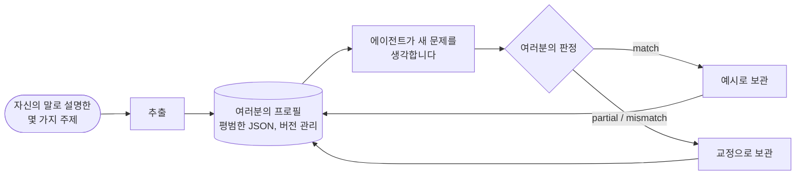

# 사고자 프로필: 특정 인물처럼 추론하기

::: tip SDK가 나처럼 추론할 수 있나요?
**네. 특정 인물이 추론하는 방식을 흉내 낼 수 있습니다.** 인지 에이전트는 *여러분*의 주의 순서를 따르고, *여러분*의 우선순위를 저울질하고, *여러분*의 반사적 판단을 적용하고, *여러분*이라면 기각할 것을 기각할 수 있습니다. 에이전트는 여러분이 자신의 말로 설명한 몇 가지 문제에서 이를 배웁니다. 에이전트가 어디서 틀렸는지 알려 줄 때마다 그 교정이 지시문에 추가되고, 여러분의 동의율이 에이전트가 가까워지고 있는지를 보여 줍니다.

에이전트가 흉내 내는 것은 사람이 아니라 **추론 방식**입니다. 여러분이 적지 않은 것은 알지 못하고, 여러분 대신 결정하지 않습니다. SDK는 여러분에게 얼마나 가까워졌는지 스스로 주장하지 않습니다. 실행을 거듭하며 에이전트의 답에 매기는 동의율로 **여러분이 직접 측정합니다**.
:::

{.illustration}

## "여러분처럼 추론한다"는 것의 의미 {#what-reasoning-like-you-means}

| 흉내 내는 것 | 흉내 내지 않는 것 |
| --- | --- |
| 문제를 바라보는 **순서**(먼저 그것이 실제로 가능하게 하는 것, 그다음 그 한계…) | 여러분의 **지식**: 알고 있지만 한 번도 적지 않은 것은, 컨텍스트나 관찰로 주지 않는 한 모릅니다 |
| 여러분의 **우선순위**(여러분에게 가장 중요한 것, 순서대로) | 여러분의 **기억**과 삶: 여러분이 준 샘플, 교정, 컨텍스트만 압니다 |
| 여러분의 **반사적 판단**("서비스가 유료라면, 먼저 무료 대안을 찾는다") | 한 번도 말로 표현하지 않은 직관 |
| 여러분이 아이디어를 **기각**하게 만드는 것 | 여러분의 **책임**: 에이전트의 답은 여러분이 어떻게 생각할지에 대한 예측이지, 여러분 대신 내린 결정이 아닙니다 |
| 여러분의 **위험 선호도** | 세상에 대한 여러분의 확신: 다른 인지 에이전트와 마찬가지로 주장에는 여전히 증거가 필요합니다 |
| 여러분이 **교정한 실수**: 되풀이하지 말라고 지시받습니다 | |

## 동작 방식, 단계별로 {#how-it-works-step-by-step}



### 1단계: 몇 가지 주제를 자신의 말로 설명하기 {#step-1-explain-a-few-topics-in-your-own-words}

**샘플**은 여러분이 추론해 본 주제 하나를, 떠오른 그대로 적은 것입니다. 정돈되지 않아도 괜찮습니다. 샘플에는 세 부분이 있습니다.

| 필드 | 쓸 내용 | 예시 |
| --- | --- | --- |
| `topic` | 주제를 몇 단어로 | "부엌만 정리하는 로봇" |
| `reasoning` | 어떻게 접근했는지: 무엇을 먼저 보았는지, 무엇을 확인했는지, 무엇 때문에 망설였는지, 왜 그랬는지 | "이게 실제로 하는 일이 뭐지? 방 하나뿐이니 한계는 일반화다. 몇 가지 예시로 다른 방을 배울 수 있을까?…" |
| `conclusion` | 결론 내린 것이나 할 일(선택 사항이지만, 보정 예시가 됩니다) | "작은 적응 루프를 만들어 두 번째 방에서 테스트한다" |

한 주제에 대한 많은 샘플보다 **다양한** 주제에 대한 다섯에서 열 개의 샘플이 더 효과적입니다. 추출기는 주제들 **전반에 걸쳐** 반복되는 것을 찾으며, 한 번만 보인 패턴은 약합니다.

### 2단계: 프로필 추출하기 {#step-2-distill-your-profile}

```ts
const profile = await sdk.distillThinkerProfile({
  id: 'nicolas',
  name: 'Nicolas',
  model: 'gpt-4o',
  samples: [
    {
      topic: 'Typed decision APIs like Jev',
      reasoning:
        'What does it really allow? Then the limits: closed, US-only, paid. Is there an open clone? ' +
        'Could it become the controller of my agents? I would benchmark it on my own traces first.',
      conclusion: 'Use an open clone as the controller and benchmark it against Jev',
    },
    { topic: 'World models', reasoning: 'Structure beats scale. Test on a small chaotic system before anything big.' },
  ],
});
```

정확히 무슨 일이 일어나는지 보면 다음과 같습니다.

1. 샘플을 검사합니다. 각 샘플에는 주제와 추론이 있어야 합니다.
2. 언어 모델 호출 한 번이 *인지 분석가* 역할을 합니다. 여러분의 의견이 아니라 추론에서 **반복되는 연산**을 찾습니다. 무엇을 먼저 살펴보는지, 어떤 질문을 던지는지, 아이디어를 어디까지 밀어붙이는지, 무엇 때문에 해결책을 기각하는지, 위험, 비용, 새로움과 어떤 관계를 맺는지가 그것입니다. 샘플이 뒷받침하는 패턴만 남기고, 여러 샘플에서 보인 패턴을 우선하도록 지시받습니다.
3. 응답은 프로필 스키마에 대해 검증됩니다. 잘못된 응답은 오류와 함께 한 번 되돌려 보내지고, 두 번째로 실패하면 반쯤 만들어진 프로필을 반환하는 대신 `ThoughtGenerationError`를 던집니다.
4. 결론이 있는 샘플은 프로필 안에 **예시**로 보관됩니다. 그래서 프로필은 추출된 방법과, 그 방법이 나온 근거를 함께 담습니다.

결과는 평범한 JSON입니다. **읽어 보세요**. 단계나 우선순위가 틀렸거나 빠졌다면 직접 고치세요. 한 번의 추출보다 여러분 자신이 여러분을 더 잘 압니다.

### 3단계: 에이전트가 여러분처럼 생각하게 하기 {#step-3-let-the-agent-think-as-you}

```ts
const twin = sdk.createCognitiveAgent({
  name: 'my-twin',
  model: 'gpt-4o',
  profile,
  systemPrompt: "Write every statement and the answer in French, in the thinker's own voice.", // optional
});

const run = await twin.think({
  problem: 'A bank offers you a stable, well-paid CTO job maintaining legacy systems. What do you decide?',
});
console.log(run.decision?.status, run.decision?.answer);
```

프로필은 **실행이 시작될 때 복사되므로**, 실행 중에 준 교정은 다음 실행에 적용됩니다. 프로필은 모든 추론 단계의 지시문에 들어가며, 마지막 `decide` 단계는 사고자의 주의 순서를 따르는 근거와 함께 *사고자가 내놓을 답*을 요청받습니다. [프로필이 무게를 갖는 곳](#where-the-profile-weighs-and-where-it-never-does)에서 그런 곳을 하나하나 나열합니다.

### 4단계: 어디서 틀렸는지 알려 주기 {#step-4-tell-it-where-it-went-wrong}

실행이 끝나면 **판정**을 내려 주세요. 에이전트가 여러분이라면 했을 방식으로 추론했나요?

```ts
// "Yes, exactly what I would have thought."
await twin.learnFromFeedback(run.runId, { verdict: 'match' });

// "No, I would have gone another way."
await twin.learnFromFeedback(run.runId, {
  verdict: 'mismatch',
  expected: 'Prototype with the free clone first, then compare with Jev on 100 real tickets',
  lesson: 'Always test the free option on real data before paying',
});

// "You are 50% right, and here is where you went wrong."
await twin.learnFromFeedback(run.runId, {
  verdict: 'partial',
  agreement: 0.5,
  wrongAbout: ['ignored the free option', 'overestimated the integration cost'],
  expected: 'Benchmark the open clone on our own tickets before deciding',
});
```

| 필드 | 의미 | 필수 여부 |
| --- | --- | --- |
| `verdict` | `match`(여러분처럼 추론함), `partial`(부분적으로), `mismatch`(전혀 아님) | 항상 |
| `agreement` | 여러분이 얼마나 동의하는지, 0부터 1까지: `0.8`은 "80% 맞았다"는 뜻 | 아니요 |
| `expected` | 여러분이라면 대신 내렸을 결론 | `partial`과 `mismatch`일 때 |
| `wrongAbout` | 추론이 어디서 틀렸는지, 여러분의 말로 | 아니요 |
| `lesson` | 다음에 기억할 규칙(기본값은 `expected`) | 아니요 |
| `notes` | 그 밖의 모든 것으로, 이벤트에 보관됩니다 | 아니요 |

판정이 어떻게 반영되는지는 다음과 같습니다.

| 판정 | 프로필에 미치는 효과 |
| --- | --- |
| `match` | 그 실행이 보정 **예시**가 됩니다. 질문, 추론 단계의 요약, 결론이 담깁니다. `match`가 있을 때마다 추출된 샘플을 포함해 가장 최근 예시 10개가 유지됩니다. |
| `partial` / `mismatch` | **교정**이 기록됩니다. 에이전트가 내린 결론, 여러분이 기대한 것, 동의율, 어디서 틀렸는지, 그리고 교훈이 담깁니다. 가장 최근 20개가 유지됩니다. 교정은 각 추론 단계의 지시문에서 프로필 맨 끝에 최우선 사항으로 놓입니다: "이 실수들을 되풀이하지 마세요". Jev 컨트롤러는 마지막 다섯 개의 교훈을 봅니다. |

판정이 있을 때마다 프로필의 패치 버전이 올라가고(`1.0.0` → `1.0.1`), 판정 전후의 프로필 버전과 함께 `cognition.feedback` 이벤트로 실행에 덧붙여집니다. 결정이 없는 실행은 피드백을 받을 수 없습니다. 판정할 대상이 없기 때문입니다.

`learnFromFeedback`은 다듬어진 프로필을 반환하고 에이전트 안에 보관합니다. **저장하세요**(`twin.getProfile()`은 평범한 JSON입니다). 그렇지 않으면 프로세스가 멈출 때 교훈이 사라집니다.

### 5단계: 얼마나 가까워졌는지 측정하기 {#step-5-measure-how-close-it-gets}

SDK는 여러분의 판정을 기록할 뿐, 스스로를 채점하지 않습니다. 에이전트가 정말 여러분처럼 추론하는지 알려면 간단한 절차를 따르세요.

1. 에이전트가 한 번도 본 적 없는, 다양한 주제의 **새로운 문제**를 준비합니다.
2. 에이전트의 답을 읽기 전에 **여러분의 답을 먼저 적어** 두세요. 에이전트의 답이 여러분의 답에 영향을 주지 않게 하기 위해서입니다.
3. 에이전트를 실행한 다음 각 답을 채점합니다. `agreement`, 무엇에 대해 틀렸는지(`wrongAbout`), 무엇을 기대했는지(`expected`)입니다.
4. 그 피드백을 주고 다듬어진 프로필을 저장합니다.
5. 다음 라운드에서는 **또 다른 새로운 문제**를 쓰고, 평균 동의율을 이전 라운드와 비교합니다.

에이전트가 한 번도 본 적 없는 문제에서 평균이 오른다면, 여러분이 교정한 답만이 아니라 여러분의 추론 *방식*을 익히고 있다는 신호입니다. 다만 문제가 몇 개뿐이라면 상승이 우연일 수도 있으니 여러 라운드를 계속하세요. 교정한 문제에서만 나아진다면, 답을 베끼고 있는 것입니다.

```ts
const scores = [0.4, 0.6, 0.5]; // the agreement you gave this round
const average = scores.reduce((sum, value) => sum + value, 0) / scores.length; // 0.5, that is 50%
```

## 프로필의 구조 {#anatomy-of-a-profile}

프로필을 직접 작성할 수도 있습니다.

```ts
import { defineThinkerProfile } from '@sdk-ai-agents/core';

const builder = defineThinkerProfile({
  id: 'builder',
  name: 'Pragmatic builder',
  summary: 'Looks for what a technology really enables, then its limits, then a prototype.',
  reasoningSequence: [
    { id: 'real-capability', instruction: 'Establish what the technology really enables' },
    { id: 'limits', instruction: 'Look for its limits immediately' },
    { id: 'workaround', instruction: 'Imagine how to work around those limits' },
    { id: 'product', instruction: 'Check whether it can become a product' },
    { id: 'automation', instruction: 'Ask how the product could run itself' },
    { id: 'generalize', instruction: 'Extrapolate towards a more general architecture' },
    { id: 'prototype', instruction: 'Design the smallest prototype that tests it' },
  ],
  priorities: ['Real capability over hype', 'Free and open options first', 'Fast feedback'],
  heuristics: [{ when: 'a service is paid and closed', action: 'look for an open alternative before paying' }],
  rejectionCriteria: ['Cannot be tested with a prototype', 'Locks data in a vendor'],
  riskAppetite: 'high',
});

const agent = sdk.createCognitiveAgent({ name: 'me', model: 'gpt-4o', profile: builder });
```

`defineThinkerProfile`은 프로필을 검증하고 빠진 것을 기본값(빈 목록, `riskAppetite: 'medium'`, `version: '1.0.0'`)으로 채웁니다.

| 필드 | 쉽게 말하면 | 엔진이 사용하는 방법 |
| --- | --- | --- |
| `id`, `name`, `version` | 이 프로필이 누구를 기술하는지, 그리고 몇 번째 개정판인지 | 모든 실행에 기록되므로, 어떤 버전의 프로필이 그 실행을 만들었는지 알 수 있습니다 |
| `summary` | 스타일을 기술하는 한 문장 | 프롬프트에서 프로필 맨 위에 적힙니다 |
| `reasoningSequence` | 여러분이 거치는 단계, 순서대로 | "주의 순서(이를 따르세요)"로 적히며, 최종 답도 이를 따릅니다 |
| `priorities` | 가장 중요한 것, 중요한 순서대로 | 프롬프트에 적히고, 선택이 여러분에게 얼마나 맞는지 판단하는 데 쓰입니다 |
| `heuristics` | 여러분의 반사적 판단: "…이면, …한다" | 프롬프트에 규칙으로 적힙니다 |
| `rejectionCriteria` | 여러분이 아이디어를 버리게 만드는 것 | 선택지를 비판하고, 여러분이라면 기각할 것을 기각하는 데 쓰입니다 |
| `riskAppetite` | `low`, `medium` 또는 `high` | 프롬프트에 적힙니다 |
| `examples` | 여러분이 인정한 실행과 샘플 | "그 사람의 추론을 보여 주는 인정된 예시"로 제시되며, 모델은 이를 기준으로 보정합니다 |
| `corrections` | 여러분이 동의하지 않은 실행에서 얻은 교훈 | 프로필 맨 끝에 최우선 사항으로 제시됩니다 |

프로필이 없으면 에이전트는 중립적이고 증거를 우선하는 분석가인 `DEFAULT_THINKER_PROFILE`을 씁니다.

## 프로필이 무게를 갖는 곳과 절대 갖지 않는 곳 {#where-the-profile-weighs-and-where-it-never-does}

| 추론의 시점 | 여러분의 프로필이 반영되나요? |
| --- | --- |
| **각 추론 단계**(표현하기, 가설 세우기, 시뮬레이션하기, 비판하기, 비교하기, 결정하기, 도구 결과 읽기) | 네. 언어 모델이 받는 지시문에 프로필 전체가 들어갑니다. 어떤 도구를 호출할지 고르는 짧은 요청만 프로필을 빼고 보냅니다 |
| **다음 단계 고르기** | Jev 컨트롤러를 쓰면 네. 여러분의 주의 순서, 우선순위, 기각 기준, 위험 선호도, 마지막 다섯 개의 교훈을 봅니다. Jev가 없으면 휴리스틱 컨트롤러가 고정된 순서를 따르고, 대신 프로필이 각 단계의 내용을 형성합니다 |
| **비판** | 네. 선택지는 여러분의 기각 기준으로 공격받습니다 |
| **선택이 여러분에게 얼마나 맞는지**(`preferenceFit`) | 네. 그것이 이 점수의 목적입니다. 여러분의 기각 기준 중 하나에 해당한다고 판단된 선택은 순위가 낮아지며, 판정자가 이를 확신할 때(Jev가 그 수준에 확률을 모두 둘 때), 또는 언어 모델 판정자를 쓰는 경우 모델이 기각할 때 기각됩니다 |
| **증거가 선택지를 얼마나 잘 뒷받침하는지**(`support`) | **아니요.** Jev를 쓰면 이 질문은 여러분의 프로필 없이 전송됩니다. 언어 모델을 쓰면 모델은 선호를 무시하라고 지시받습니다 |
| **어떤 행동 선택이 1순위가 되는지** | 네, 행동 선택의 경우 기본 40%의 가중치로 반영됩니다 |
| **행동 선택이 확정될 수 있는지** | 네, 여러분이 분명히 선호하고 사실이 그에 반대하지 않을 때 |
| **세상에 대한 주장이 믿을 만한지** | 코드에서는 **절대** 반영되지 않습니다. 두 점수는 절대 섞이지 않습니다. 언어 모델 판정자를 쓰면 이 분리는 그 지시문에 달려 있으며, 모델이 선택으로 잘못 레이블한 주장은 선호 경로를 탈 수도 있습니다([선언된 종류](./evidence-and-verification#not-there-yet) 참고) |

### 두 가지 점수 {#the-two-scores}

선택지를 비교할 때, 각 선택지는 0과 1 사이의 점수를 최대 두 개 받습니다.

| 점수 | 질문 | 0 | 0.25 | 0.5 | 0.75 | 1 |
| --- | --- | --- | --- | --- | --- | --- |
| `support` | 사실, 관찰, 테스트, 비판이 이것을 얼마나 잘 뒷받침하는가? | 반증됨 | 약하게 뒷받침됨 | 그럴듯함 | 강하게 뒷받침됨 | 확립됨 |
| `preferenceFit` | 이 선택이 사고자에게 얼마나 맞는가? (행동 선택에만 해당) | 기각 기준에 해당함 | 잘 맞지 않음 | 수용할 만함 | 잘 맞음 | 이상적임 |

이것은 Jev 가설 평가기가 묻는 수준입니다. 언어 모델 판정자는 각각에 대해 0과 1 사이의 숫자를 주며, 같은 방식으로 읽습니다. 둘 다 측정된 확률이 아니라 판단입니다.

### 선택의 순위가 매겨지고 확정되는 방식 {#how-a-choice-is-ranked-and-committed}

위의 은행 일자리 문제를 두 가지 선택지로 살펴봅시다.

| 선택지 | `support` | `preferenceFit` | 순위 점수: support 60% + 적합도 40% |
| --- | --- | --- | --- |
| H1: 일자리를 받아들인다 | 0.5 (그럴듯함) | 0.25 (잘 맞지 않음: 새로 만들 것이 없음) | 0.6 × 0.5 + 0.4 × 0.25 = **0.40** |
| H2: 거절하고 계속 만든다 | 0.5 (그럴듯함) | 1 (이상적임) | 0.6 × 0.5 + 0.4 × 1 = **0.70** |

사실은 두 선택지를 똑같이 뒷받침하고, 여러분의 선호가 H2를 1순위로 올립니다. 가중치는 `limits.preferenceWeight`(0.4)입니다.

**확정**(잠정 답이나 판단 유보가 아닌 확고한 답)되려면, 선택지는 [결론 가드](./evidence-and-verification#the-conclusion-guard)를 통과해야 합니다. 증거가 충분하다고 인정되는 방법은 두 가지입니다.

- **증거만으로**, 모든 종류의 가설에 대해: `support`가 적어도 `limits.decisionThreshold`(0.75, "강하게 뒷받침됨")일 때
- **여러분의 선택으로**, 행동 선택에 대해서만: `preferenceFit`이 적어도 `limits.decisionThreshold`(0.75, "잘 맞음")**이고** `support`가 적어도 `limits.minProposalSupport`(0.35, "약하게 뒷받침됨"보다 조금 위)일 때

H2는 두 번째 방법을 탑니다. 지지도 0.5 ≥ 0.35, 적합도 1 ≥ 0.75입니다. H2는 **신뢰도 0.5**로 확정됩니다. 결정의 신뢰도는 증거 지지도를 절대 넘지 않기 때문입니다. 답이 말하는 것은 "이것은 증명되었다"가 아니라 "이것은 사고자의 선택이다"입니다.

두 번째 방법이 있는 이유: *"이 일자리를 받아들이겠습니까?"* 같은 질문에는 따져 볼 증거가 거의 없습니다. 사람은 사실이 그 선택에 반대하지 않는 한, 자신의 우선순위로 이런 질문을 결정합니다. 사고자 프로필을 쓴 실제 실행에서, 이 두 번째 방법이 생기기 전에는 이런 질문이 확정된 답 없이 끝났습니다.

이 방법이 주장에는 닫혀 있는 이유: *"이 스타트업의 AI는 거짓말을 99% 정확도로 탐지한다"* 같은 진술은 세상에 대한 **규칙**입니다. 여러분이 그것이 참이기를 아무리 바라더라도, 모델이 이를 규칙으로 레이블하는 한(모델은 그렇게 하도록 지시받습니다) 증거 지지도가 0.75에 이를 때에만 확정됩니다([선언된 종류](./evidence-and-verification#not-there-yet) 참고). 선호는 무엇을 할지 고를 수는 있어도, 무언가를 참으로 만들지는 못합니다.

## 한도 {#limits}

- **모델이 중요합니다.** 프로필은 지시문의 모음입니다. 작은 모델은 큰 모델보다 이를 덜 충실하게 따릅니다.
- **준 것만 압니다.** 여러분 상황의 사실이 중요하다면 `context`나 `observations`로 주세요.
- **첫 프로필은 밑그림입니다.** 샘플이 몇 개뿐이면 패턴도 몇 개뿐입니다. 프로필을 다듬는 것은 교정입니다.
- **기억에는 한계가 있습니다.** 교정은 20개가 유지되고, `match`가 있을 때마다 가장 최근 예시 10개가 유지됩니다(추출된 프로필은 더 많은 예시로 시작할 수 있습니다). 가장 오래된 것부터 버려집니다.
- **충실함이 진실은 아닙니다.** 여러분의 피드백은 에이전트가 **여러분처럼** 추론했는지를 측정할 뿐, **맞았는지**를 측정하지 않습니다. 주장을 세상과 대조하려면 에이전트에게 [결과 평가기](./evidence-and-verification#predictions-and-the-outcome-evaluator)를 주세요.
- **개인 데이터입니다.** 샘플, 프로필, 그리고 이런 실행의 이벤트는 한 사람이 어떻게 생각하는지를 기술합니다. 비공개로 저장하고, 절대 공개 저장소에 두지 말고, 다른 사람을 프로필로 만들기 전에는 동의를 구하세요.

## 프로필은 데이터입니다 {#profiles-are-data}

프로필은 평범한 JSON입니다. 원하는 곳에 저장하고 `agent.setProfile(profile)`이나 `profile` 옵션으로 다시 불러오세요. 이벤트에는 `profileId`와 `profileVersion`이 담기므로, 어떤 버전의 프로필이 실행을 만들었는지 항상 알 수 있습니다.

## 자신만의 컨트롤러 학습시키기 {#train-your-own-controller}

연산의 모든 선택은 컨트롤러가 본 상태와 함께 기록됩니다. 이를 JSON Lines로 내보내세요.

```ts
const jsonl = await sdk.exportControllerDataset(); // or pass runIds
```

```json
{"runId":"run_…","step":3,"state":{…},"available":["hypothesize","simulate","critique","decide"],"operation":"simulate","controller":"jev","confidence":0.82,"usedFallback":false,"runStatus":"completed","feedback":"partial","agreement":0.5}
```

`feedback: "match"`로 필터링하면 *여러분*이 다음 수를 고르는 방식에 대한 지도 학습 예시를 얻게 됩니다. 작은 오픈 모델을 파인튜닝해 커스텀 `CognitiveController`로 연결하기에 충분하며, 호출당 비용도 들지 않습니다.
