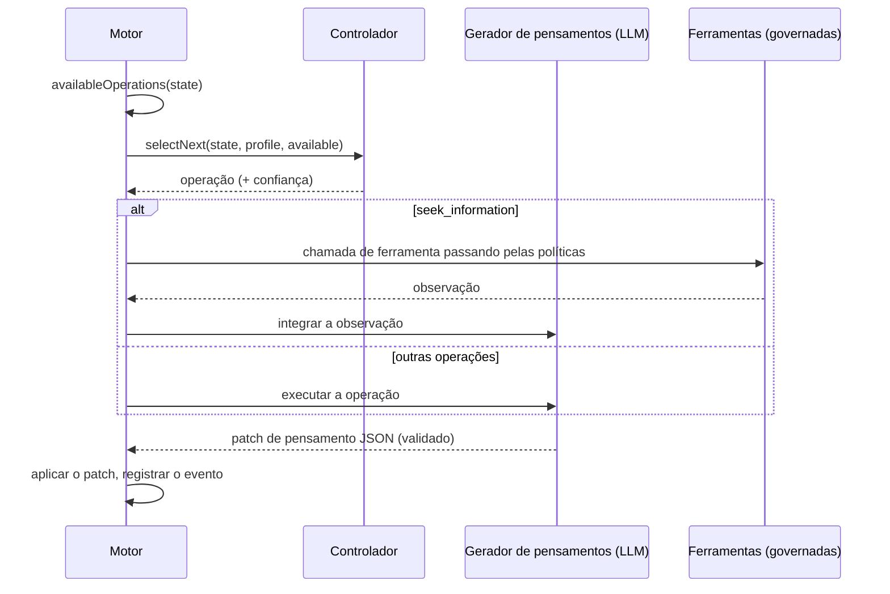

# Agentes cognitivos

Um agente cognitivo não responde em uma única passada. Ele mantém um **estado mental explícito** e o aprimora uma **operação cognitiva** por vez, até conseguir se comprometer com uma decisão que ele consegue justificar.

::: tip Em palavras simples
Uma IA comum responde de uma vez, e o raciocínio dela desaparece. Um agente cognitivo trabalha como alguém com um caderno: ele anota o que sabe, o que supõe e o que ainda não sabe, lista várias opções, imagina as consequências delas, procura o que poderia dar errado, verifica fatos com as ferramentas que você permitiu, compara as opções e só então decide. Cada um desses movimentos é uma **operação**, e cada um é escrito no caderno, para que você possa reler todo o raciocínio depois. Se ele não consegue chegar a uma conclusão sólida, ele diz isso. Todos os termos desta página são explicados em [Termos-chave em palavras simples](./glossary#how-a-cognitive-agent-reasons).
:::

{.illustration style="max-width:460px"}

```ts
const agent = sdk.createCognitiveAgent({
  name: 'analyst',
  model: 'gpt-4o',
  tools: [lookupMetric],
  profile: myProfile, // optional, see Thinker profiles
});

const { status, answer, decision, state, runId } = await agent.think({
  problem: 'Should we build or buy our analytics module?',
  context: { budget: '10k EUR', deadline: 'before Q4' },
  observations: [{ content: 'Churn was 4% last month', originGroup: 'billing' }], // optional
});

decision?.status; // 'committed' | 'provisional' | 'abstain'
```

::: tip As evidências primeiro
Como as observações são rastreadas, as predições testadas e as conclusões protegidas é descrito em [Evidências e verificação](./evidence-and-verification).
:::

## O estado mental {#the-mental-state}

O estado mental é composto de dados simples e tipados. Cada item recebe um id estável ao qual o modelo pode se referir.

| Parte | Ids | O que contém |
| --- | --- | --- |
| `observations` | `O1…` | O que foi observado — fornecido com o problema, devolvido por uma ferramenta ou por um teste — com sua proveniência |
| `facts` | `F1…` | Afirmações com uma fonte (`input`, `tool`, `inference`), as observações de onde vêm e um status (`active`, `superseded`, `retracted`) |
| `assumptions` | `A1…` | O que o raciocínio toma como certo |
| `constraints` | `K1…` | O que qualquer resposta deve respeitar |
| `unknowns` | `U1…` | Perguntas em aberto — `open`, `resolved` ou `dropped`, com a contagem de tentativas |
| `hypotheses` | `H1…` | Propostas, regras ou explicações com premissas, simulações, críticas, um `support` de evidências, uma `preferenceFit` e um status |
| `comparisons` | `R1…` | Relações entre observações: semelhança, diferença, evolução, incompatibilidade, contraexemplo |
| `predictions` | `P1…` | O que uma hipótese prevê, o que a refutaria e o resultado do teste |
| `contradictions` | `C1…` | Conflitos entre itens, com uma categoria, até serem resolvidos com evidências citadas |
| `failures` | `X1…` | O que já falhou, para não ser tentado de novo às cegas |
| `knowledge` | `M1…` | O que execuções anteriores do mesmo escopo estabeleceram com testes reais, recuperado quando a execução começou (veja [Memória entre execuções](./memory)) |
| `confidence`, `evidenceRevision` | | Suporte das evidências da melhor resposta; um contador que torna desatualizadas as avaliações mais antigas |
| `decision`, `trail` | | A decisão final e seu status, uma linha por etapa |

{.illustration style="max-width:760px"}

O estado **nunca é editado no lugar**. Cada operação produz um *patch de pensamento*; o patch é registrado como um evento `cognition.thought`; o estado é o resultado da aplicação sucessiva de todos os patches. É por isso que `sdk.getMentalState(runId)` consegue reconstruir exatamente qualquer execução, mesmo meses depois.

## As operações {#the-operations}

| Operação | O que faz | Disponível quando |
| --- | --- | --- |
| `represent` | Extrai fatos, suposições, restrições e incógnitas | Sempre em primeiro lugar; de novo quando há uma contradição em aberto |
| `compare_observations` | Relaciona observações: semelhanças, diferenças, mudanças, contraexemplos | Duas observações comparáveis ou mais (excluindo duplicatas e resultados de teste), com novas desde a última comparação |
| `hypothesize` | Propõe novas propostas, regras ou explicações | Menos hipóteses ativas do que `maxHypotheses` |
| `simulate` | Projeta as consequências passo a passo e declara predições testáveis | Uma hipótese não tem simulação |
| `test_prediction` | Executa o seu avaliador de resultados sobre uma predição registrada — sem chamada ao LLM | Um avaliador está configurado, uma predição está pendente, resta orçamento de testes |
| `revise` | Transforma uma hipótese contradita pelas evidências em uma variante com escopo delimitado | Uma hipótese refutada ou contradita ainda não tem variante |
| `critique` | Encontra os motivos mais fortes pelos quais uma hipótese poderia falhar | Uma hipótese não tem crítica |
| `seek_information` | Chama uma ferramenta governada para responder a uma incógnita em aberto | Existem ferramentas, uma incógnita está em aberto, resta orçamento de ferramentas |
| `compare` | Julga o suporte das evidências e o quanto as propostas convêm ao pensador | Uma hipótese criticada mudou, ou as evidências mudaram, desde a última comparação |
| `decide` | Compromete-se com uma resposta, uma justificativa, uma confiança e próximas ações | Uma hipótese passa pela [salvaguarda de conclusão](./evidence-and-verification#the-conclusion-guard) |

**O código decide o que é possível, o controlador decide o que é útil.** As pré-condições são calculadas a partir do estado, e o controlador só pode escolher entre as operações disponíveis.

Regras garantidas em código, diga o modelo o que disser:

- uma crítica `fatal` sem refutação, ou uma predição refutada, rejeita a sua hipótese;
- uma hipótese rejeitada não pode ser reativada, reformulada nem selecionada — apenas revisada em uma variante que diz o que mudou;
- o código nunca mistura preferências ao suporte das evidências de uma afirmação, e o modelo não pode definir a confiança do estado;
- uma contradição é resolvida uma única vez, e apenas citando as observações ou os fatos que a resolvem;
- uma etapa que não mudou nada do que deveria mudar, ou uma decisão adiada, conta como uma tentativa fracassada; depois de duas seguidas, a operação deixa de ser oferecida até que outra etapa traga novas evidências (veja [Um orçamento que não é desperdiçado](./evidence-and-verification#a-budget-that-is-not-wasted));
- a proveniência (observações, resultados de teste) e o status da decisão são escritos pelo motor: se uma resposta do modelo os contiver, eles são removidos dela;
- as referências a ids desconhecidos são ignoradas e relatadas como `issues` no evento de pensamento;
- no máximo `maxHypotheses` hipóteses estão em jogo: as propostas excedentes são descartadas e relatadas;
- uma incógnita deixa de ser investigada depois de duas tentativas sem sucesso, ou imediatamente quando nenhuma ferramenta disponível pode respondê-la, e a reformulação do problema (`represent` diante de uma contradição) é oferecida no máximo três vezes;
- uma operação que falhou é registrada como falha e não conta como feita;
- a **última etapa é sempre uma tentativa de decisão**: uma resposta que não passa pela salvaguarda de conclusão se torna `provisional` (com o que está faltando) ou uma abstenção (`abstain`); se o modelo não conseguir produzir decisão alguma, o motor se abstém e registra o motivo.

## Controladores {#controllers}

O controlador escolhe a próxima operação.



| Controlador | Como escolhe | Quando usá-lo |
| --- | --- | --- |
| `heuristic` | Uma ordem de atenção fixa: representar → revisar → comparar observações → formular hipóteses → simular → testar predições → criticar → buscar informação → comparar → decidir | Padrão sem o Jev, determinístico, gratuito |
| `typed` | Uma requisição ao Jev por etapa: uma Choice sobre as operações disponíveis e uma Noul "pronto para decidir?" | Raciocínio adaptativo com confiança calibrada |
| o seu próprio | Implemente `CognitiveController.selectNext()` | Um modelo local ajustado (fine-tuned), regras de negócio, … |

Com `controller: 'auto'` (o padrão), o agente usa o Jev quando o SDK tem um backend de decisões tipadas, e a heurística caso contrário. O controlador tipado **recorre à heurística** quando a confiança da Choice está abaixo de `minConfidence` (0,35), quando o cliente falha ou quando a resposta não é uma operação disponível. Um controlador personalizado que lança uma exceção ou devolve uma operação indisponível também é substituído pela heurística. Cada recurso à heurística é registrado no campo `fallbackFrom` do evento de seleção.

```ts
sdk.createCognitiveAgent({
  name: 'analyst',
  model: 'gpt-4o',
  controller: 'typed',
  controllerOptions: { minConfidence: 0.5, readinessThreshold: 0.85 },
  assessment: 'typed', // compare hypotheses with Jev Score questions
});
```

## Ferramentas dentro do raciocínio {#tools-inside-reasoning}

`seek_information` usa os **motores nativos de raciocínio e de ações**: o LLM escolhe uma ferramenta para a incógnita em aberto, o motor de ações verifica se a ferramenta foi **entregue a este agente**, valida a chamada em relação às políticas (limites de execução incluídos, veja [Limites e políticas](#limits-and-policies)), aprovações e orçamentos, e o resultado é registrado como uma **observação** que aponta para o seu evento `action.executed`, e depois integrado como fatos com `source: "tool"`. A observação é mantida mesmo que a interpretação dela falhe. Uma ferramenta negada, bloqueada ou com falha se torna uma falha registrada, e o raciocínio continua.

## Limites {#limits}

```ts
sdk.createCognitiveAgent({
  name: 'analyst',
  model: 'gpt-4o',
  limits: {
    maxSteps: 12,              // the last one always decides
    timeoutMs: 180_000,
    maxHypotheses: 3,          // in play at the same time
    maxToolCalls: 5,
    decisionThreshold: 0.75,   // evidence support a committed answer needs (see minProposalSupport)
    maxConsecutiveFailures: 3, // then the run fails (and alerts you, if incidents are on)
    maxPredictionTests: 4,     // calls to the outcome evaluator per run
    preferenceWeight: 0.4,     // weight of the thinker's preferences when ranking proposals
    minProposalSupport: 0.35,  // evidence support enough for a choice of action the thinker clearly prefers
  },
  evaluator: myBench,          // optional OutcomeEvaluator, enables test_prediction
  knowledge: { store, scope: 'my-domain' }, // optional memory across runs
});
```

Os limites são validados quando o agente é criado: `maxSteps: 0` ou um timeout além do que um temporizador suporta lança um `ValidationError`, em vez de desativar silenciosamente uma proteção. `minProposalSupport` não pode ser maior que `decisionThreshold`; defina-o igual a `decisionThreshold` para que apenas as evidências possam firmar uma resposta. Se você diminuir `decisionThreshold` sem definir `minProposalSupport`, o piso acompanha a redução.

### Limites e políticas {#limits-and-policies}

As políticas de orçamento e de timeout que se aplicam ao agente — as das suas `policies` e as globais — são verificadas **antes de cada etapa**, antes de qualquer chamada ao modelo dessa etapa, e de novo antes de cada chamada de ferramenta. Elas veem o progresso da execução: `maxSteps` conta as etapas já feitas, `maxTokens` os tokens das chamadas ao modelo da execução (pensamentos e as suas correções, seleções de ferramenta, decisões tipadas, respostas que o provedor não pôde usar) e `maxDuration` o tempo desde o início da execução. Os orçamentos de tokens e de custo por período (`budgetLimit` com `maxTokens` ou `maxCost`, sem `toolName`) também são verificados antes de cada etapa, e cada chamada ao modelo que a execução registra conta neles (veja [Custos de API](./costs#budgets)). Uma etapa é verificada como uma intenção do tipo `continue`: uma política cujas condições exigem uma chamada de ferramenta (`intention.type` igual a `tool_call`) só se aplica a chamadas de ferramenta. Allowlists, políticas personalizadas, orçamentos de chamadas (`maxToolCalls`) e aprovações só dizem respeito a chamadas de ferramenta, assim como uma regra de limite cuja ação é `require_approval`: uma etapa nunca espera por uma aprovação. A verificação de cada etapa fica na auditoria das políticas (`sdk.getPolicyAuditTrail`), para as políticas que podem se aplicar a uma etapa.

O primeiro limite atingido encerra a execução (os limites de chamadas de ferramenta só pulam chamadas), e os dois tipos de limite não a encerram da mesma forma:

| Limite | `limits` do agente | Políticas |
| --- | --- | --- |
| Etapas | `maxSteps`: a última etapa decide; `completed`, com uma decisão `committed`, `provisional` ou `abstain` | `maxSteps`: a etapa seguinte é recusada; `failed` |
| Tempo | `timeoutMs`: a execução é interrompida, e uma chamada em andamento recebe o sinal de cancelamento; `failed`, `Timeout exceeded (… ms)` | `maxDuration`: verificado entre as etapas e antes das chamadas de ferramenta, e uma chamada em andamento continua; `failed`, `Timeout (… ms) exceeded` |
| Tokens, custo | — | `maxTokens`, orçamentos por período: a etapa seguinte é recusada; `failed` |
| Chamadas de ferramenta | `maxToolCalls`: `seek_information` deixa de ser oferecida | Uma chamada recusada é uma falha registrada, e o raciocínio continua |

Uma etapa recusada é registrada como `policy.violated` — com `intention: { type: 'continue' }`, a etapa (`step`), o motivo (`reason`) e as políticas violadas (`violatedPolicies`) — e depois `run.failed` com o motivo da política; o resultado tem `status: 'failed'` e um `PolicyViolationError` como `error`. Uma chamada de ferramenta recusada por um limite de execução é registrada como `policy.violated` e como uma operação com falha; como o limite continua excedido, a etapa seguinte é recusada e a execução falha. Para terminar com uma decisão em vez de uma recusa, mantenha o `maxSteps` do agente igual ou abaixo do da política: a última etapa dele decide então antes que a política recuse qualquer coisa.

## Saída inválida do modelo {#invalid-model-output}

Cada operação tem um contrato JSON rigoroso, validado pelo Zod. Uma resposta que não é um JSON válido, que não tem seu campo obrigatório ou que usa um valor errado é devolvida **uma vez** com o erro de validação. Os campos que uma operação não pode escrever (uma `decision` durante `simulate`, por exemplo) são ignorados e listados em `ignoredFields`. Se a correção também falhar, a operação é registrada como uma falha e o ciclo continua.

## Parar, cancelar, esgotar o tempo {#stop-cancel-time-out}

```ts
const pending = agent.think({ problem });
await agent.stop();          // or agent.stop(runId)
const result = await pending; // status: 'cancelled'
```

Um timeout produz `status: 'failed'` com `Timeout exceeded (… ms)`, e a execução é marcada como falha no log de eventos. `sdk.stopRun(runId)` também para execuções cognitivas. O timeout e a parada são verificados entre as operações e repassados ao seu provedor como um sinal de cancelamento (abort signal); os provedores OpenAI e Anthropic integrados não cancelam uma requisição já em andamento, então uma chamada lenta termina no timeout do próprio fornecedor.

O perfil é **copiado quando uma execução começa**: um feedback dado enquanto uma execução está em andamento vale para a próxima execução.

## Segurança {#security}

Um agente cognitivo lê textos que ele não escreveu: resultados de ferramentas, descrições de ferramentas MCP, documentos no contexto. Trate tudo isso como **entrada não confiável** — pode conter instruções dirigidas ao modelo (prompt injection). O SDK limita o que esse texto consegue fazer:

- o agente só pode chamar as ferramentas que recebeu, e as políticas são verificadas em cada chamada — coloque as ferramentas destrutivas atrás de políticas `require_approval`;
- o modelo nunca executa nada por conta própria: ele propõe, o motor de ações valida;
- as invariantes do estado mental são garantidas em código, não pelo prompt;
- cada chamada de ferramenta e cada pensamento ficam no log de eventos para revisão.

O log de eventos armazena o objetivo, o contexto e cada pensamento, e os eventos `decision.evaluated` armazenam o contexto enviado ao Jev. Aplique ao armazenamento de eventos que você escolher as regras de retenção e de anonimização que os seus dados exigem.

## Replay e auditoria {#replay-and-audit}

Uma execução cognitiva é uma execução normal:

- `sdk.getTrace(runId)` mostra os eventos `cognition.*` ao lado de `policy.checked`, `tool.called`, …
- `sdk.replay(runId)` reexecuta as chamadas de ferramentas dela sem chamar o LLM e reproduz a resposta final — com a mesma restrição de ferramentas da execução original, então uma ferramenta negada ao agente é negada de novo, e com o progresso da execução em cada chamada, então uma chamada que um limite de execução recusou é recusada de novo;
- `sdk.getMentalState(runId)` reconstrói o estado;
- `sdk.exportControllerDataset()` transforma execuções em dados de treinamento (veja [Perfis de pensador](./thinker-profiles#train-your-own-controller)).
