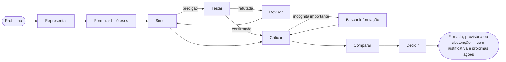

# Introdução

O **SDK AI Agents** é um SDK em TypeScript para construir agentes de IA em que você pode confiar em produção: agentes que raciocinam de forma explícita antes de agir, que podem aprender como *você* pensa, e cujas etapas são todas governadas, rastreadas, precificadas e reproduzíveis por replay.

{.illustration style="max-width:460px"}

## Por que mais um SDK de agentes? {#why-another-agent-sdk}

As APIs de LLM oferecem um gerador de texto muito capaz. O que elas não oferecem é controle sobre **como** uma conclusão é alcançada:

- o raciocínio acontece dentro do modelo, em uma única passada, e desaparece assim que a resposta é exibida;
- nada impede o modelo de agir com base em um palpite, de chamar a ferramenta errada ou de gastar demais;
- quando algo dá errado, você tem um prompt e uma resposta — não uma história.

Este SDK coloca uma camada de raciocínio **em torno** do modelo. O LLM passa a ser um componente entre outros:

| Camada | O que faz | Onde fica |
| --- | --- | --- |
| **Estado mental** | Fatos, suposições, restrições, incógnitas, hipóteses, contradições, confiança | Reconstruído a partir dos eventos a qualquer momento |
| **Controlador** | Escolhe a próxima operação cognitiva | Heurística determinística, decisões tipadas do Jev ou o seu próprio |
| **Gerador de pensamentos** | Executa uma operação e devolve um patch JSON validado | Qualquer provedor de LLM |
| **Perfil de pensador** | A ordem de atenção, as prioridades e as heurísticas de uma pessoa | Dados versionados, refinados por feedback |
| **Governança** | Políticas, allowlists, orçamentos, aprovações, novas tentativas | Verificada antes de cada ação |
| **Armazenamento de eventos** | A única fonte da verdade | Arquivo, SQLite ou PostgreSQL |

## Dois tipos de agentes {#two-kinds-of-agents}

Os **agentes governados** (`sdk.createAgent`) executam o ciclo clássico de chamada de ferramentas — o LLM propõe uma intenção, o motor de ações a valida e a executa. Eles são ideais para tarefas bem definidas.

Os **agentes cognitivos** (`sdk.createCognitiveAgent`) raciocinam de forma explícita. Eles são feitos para decisões: escolher uma arquitetura, fazer a triagem de um incidente, avaliar uma oportunidade, responder a perguntas do tipo "devemos…?".

Os dois tipos compartilham as mesmas ferramentas, políticas, armazenamento de eventos, replay, custos e alertas de incidentes.

## Ele consegue raciocinar como uma pessoa específica? {#can-it-reason-like-a-given-person}

**Sim.** Um agente cognitivo consegue imitar o modo como uma pessoa específica raciocina. Você explica alguns temas com suas próprias palavras; o SDK extrai deles um **perfil de pensador**: a ordem em que você olha para um problema, suas prioridades, seus reflexos, o que faz você rejeitar uma ideia, seu apetite por risco. Esse perfil é escrito nas instruções de cada etapa do raciocínio. Depois de cada execução, você diz o quanto concorda (por exemplo, "60% certo, e é aqui que você errou"), e a lição é guardada para as próximas execuções.

O que ele imita é um **modo de raciocinar**: ele não sabe o que você nunca escreveu, não decide no seu lugar, e as suas preferências nunca tornam uma afirmação sobre o mundo mais crível. O SDK não se avalia sozinho: é a porcentagem de concordância que você dá, execução após execução, em problemas que ele nunca viu, que mostra o quanto ele chega perto. [Raciocinar como uma pessoa específica](./thinker-profiles) explica cada etapa.

## O que você ganha {#what-you-get}

- **Raciocínio explícito** — dez operações sobre um estado mental, com invariantes garantidas em código (uma hipótese rejeitada não pode ser selecionada, uma crítica fatal rejeita uma hipótese, a última etapa sempre conclui).
- **Evidências que você pode auditar** — observações com proveniência, predições testadas pelo seu próprio avaliador, regras refutadas revisadas em variantes com escopo delimitado, preferências mantidas separadas das evidências, e uma salvaguarda de conclusão que responde `committed`, `provisional` ou `abstain`; com um repositório de conhecimento, o que os testes responderam é lembrado nas próximas execuções.
- **Raciocínio como uma pessoa específica**: destile um perfil de pensador a partir de temas explicados com suas próprias palavras e, depois, corrija o agente com vereditos `match`, `partial` ou `mismatch` e uma porcentagem de concordância.
- **Decisões tipadas** — o [TypeSafe Jev](https://docs.typesafe.ai) ou qualquer backend compatível responde a perguntas Noul, Choice e Score com probabilidades calibradas.
- **Conectores MCP** — exponha suas ferramentas como um servidor MCP, importe qualquer servidor MCP como ferramentas governadas.
- **Estudos** — um pesquisador que entende um objeto e depois propõe como redesenhá-lo com os meios de hoje: sete passagens, afirmações verificadas em relação às fontes que ele realmente pesquisou, e uma carta congelada com um guardião que o mantém no seu objetivo. Veja [Estudos](./studies).
- **Operação já incluída** — custos de API por execução, políticas de novas tentativas que não se acumulam, alertas de incidentes por e-mail ou webhook.
- **Event sourcing nativo** — replay sem o LLM, golden traces, detecção de regressões, grafos de raciocínio.

Como ele se compara a outros frameworks? Veja [Por que este SDK](./why). Esses termos são novos para você? [Termos-chave em palavras simples](./glossary) explica cada um. Pronto? Vá para [Primeiros passos](./getting-started).
