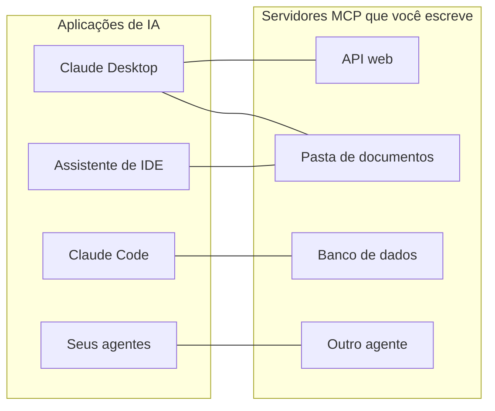
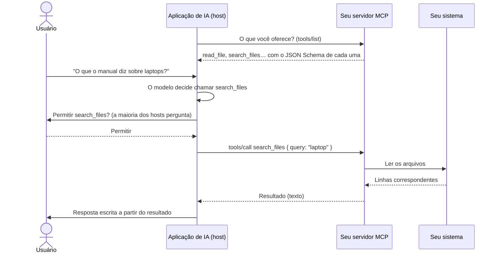
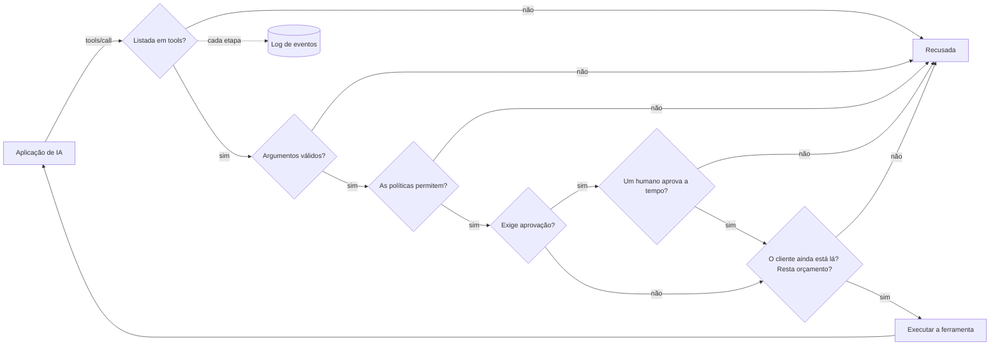

# MCP em palavras simples

**O MCP permite que uma aplicação de IA — Claude Desktop, Claude Code, um assistente de IDE, o seu próprio agente — use os seus sistemas: uma API, uma pasta de documentos, um banco de dados, outro agente.** Esta página explica a ideia e o vocabulário. As próximas páginas vão do zero a um servidor funcionando:

1. [Seu primeiro servidor MCP em 5 minutos](./mcp-first-server) — passo a passo, de uma pasta vazia até o Claude Desktop.
2. [Um servidor MCP para qualquer coisa](./mcp-recipes) — uma linha para uma função, uma API web, uma pasta, um banco de dados ou um agente.
3. [Implantar, proteger e resolver problemas](./mcp-deploy) — implantação via HTTP, autenticação, aprovações e o que fazer quando algo não funciona.

## A ideia: um único plugue para todas as aplicações de IA {#the-idea-one-plug-for-every-ai-app}

Pense no MCP (Model Context Protocol) como o **USB-C das aplicações de IA**. Antes do USB, cada aparelho tinha o seu próprio cabo. Antes do MCP, cada aplicação de IA precisava do seu próprio código de integração para cada sistema com que conversava: uma integração para o Claude, outra para a sua IDE, outra para o seu agente.

Com o MCP, você escreve **um pequeno programa — um servidor MCP — na frente do seu sistema**. Qualquer aplicação que fale MCP pode então se conectar a ele, listar o que ele oferece e usá-lo. Você constrói o servidor uma vez; ele funciona em todo lugar.



O protocolo é um padrão aberto publicado em [modelcontextprotocol.io](https://modelcontextprotocol.io). A Anthropic o criou; muitas aplicações de IA o suportam.

## O vocabulário, palavra por palavra {#the-words-one-by-one}

| Palavra | Em palavras simples | Exemplo |
| --- | --- | --- |
| **Host** (a aplicação de IA) | A aplicação com a qual o usuário conversa. Ela executa o modelo de linguagem e decide quando usar o seu servidor. | Claude Desktop, Claude Code, VS Code |
| **Cliente MCP** | A parte do host que mantém a conexão com um servidor. Você raramente a vê. | Um por servidor no Claude Desktop |
| **Servidor MCP** | O seu pequeno programa. Ele diz o que oferece e faz o trabalho quando solicitado. | `serveMcpOverStdio(sdk, { … })` |
| **Ferramenta** (tool) | Uma ação que o modelo pode decidir chamar, com argumentos nomeados. O modelo lê o nome, a descrição e a lista de argumentos dela para decidir. | `read_file`, `list_pets`, `query` |
| **Recurso** (resource) | Um documento que o servidor oferece para leitura. Diferentemente de uma ferramenta, quem o escolhe é **o usuário ou a aplicação** (por exemplo, com um botão "anexar"), não o modelo. | `folder://handbook/onboarding.md` |
| **Prompt** | Um modelo de mensagem pronto oferecido por um servidor. Ainda não é fornecido por este SDK. | — |
| **Transporte** (transport) | Como as mensagens circulam entre o host e o servidor. | stdio, Streamable HTTP |
| **stdio** | O host **inicia o seu servidor como um programa** no mesmo computador e conversa com ele pela entrada e pela saída padrão dele — como digitar nele e ler o que ele exibe. Nada fica aberto na rede. | Servidores locais no Claude Desktop |
| **Streamable HTTP** | O seu servidor é um **serviço web**; os hosts enviam requisições HTTP para ele. Usado para compartilhar um servidor com uma equipe. | `https://mcp.example.com/mcp` |
| **JSON Schema** | A descrição dos argumentos de uma ferramenta (nomes, tipos, quais são obrigatórios) que o modelo lê. O SDK a escreve para você. | `{ "type": "object", "properties": { "path": { "type": "string" } } }` |
| **Anotação** (annotation) | Uma indicação sobre uma ferramenta mostrada aos hosts, como "esta ferramenta só lê". Os hosts podem usá-la para decidir quando pedir confirmação ao usuário. | `readOnlyHint: true` |

::: tip Ferramentas versus recursos
Uma **ferramenta** é algo que o modelo *faz* ("procurar 'laptop' no manual"). Um **recurso** é algo que o usuário *entrega* ("anexar onboarding.md a esta conversa"). A receita de pasta oferece os dois, a partir da mesma pasta.
:::

## O que acontece durante uma chamada {#what-happens-during-one-call}



Duas coisas a lembrar:

- **O modelo só vê o que o servidor lista**: nomes, descrições, schemas dos argumentos e os resultados que recebe de volta. Escreva descrições claras; nunca coloque segredos nelas.
- **É o servidor que decide o que realmente acontece.** O modelo propõe uma chamada; o seu servidor pode recusá-la, limitá-la, consultar um humano ou registrá-la. É aí que este SDK entra.

## O que este SDK acrescenta {#what-this-sdk-adds}

Você pode escrever servidores MCP apenas com o SDK oficial do MCP. Este SDK fica por cima dele e acrescenta o que você precisa para executar um servidor **com segurança, e em uma linha**:

| | Só com o SDK oficial do MCP | Com o SDK AI Agents |
| --- | --- | --- |
| Expor uma API web | Escrever um handler por endpoint | `openApiTools({ spec })` — uma ferramenta por operação, somente leitura por padrão |
| Expor uma pasta | Escrever você mesmo as verificações de caminho | `folderTools({ root })` — links simbólicos e `..` não conseguem sair da pasta |
| Expor um banco de dados | Escrever você mesmo a proteção do SQL | `databaseTools({ database })` — um único SELECT, somente leitura no nível do banco de dados (uma transação somente leitura no PostgreSQL, `query_only` no SQLite), com um limite de linhas |
| Expor um agente | — | `cognitiveAgentTool(agent)` — "o que o Nicolas pensaria?" como uma única ferramenta |
| Nada exposto por acidente | Depende de você | Apenas as ferramentas que você lista em `tools` |
| Regras antes de cada chamada | Depende de você | [Políticas](./governed-agents), orçamentos, allowlists |
| Um humano diz sim primeiro | Depende de você | As ferramentas marcadas com `requiresApproval` aguardam `sdk.approveAction()`; a aprovação é cancelada quando o cliente cancela ou se desconecta, e depois de `approvalTimeoutMs` (50 s por padrão) |
| Saber o que aconteceu | Depende de você | Cada chamada e cada leitura de recurso é uma execução no [log de eventos](./observability) |



Nessa ordem: uma chamada com argumentos inválidos é recusada antes que alguém seja solicitado a aprová-la, e uma chamada é descontada do seu orçamento quando começa, qualquer que seja o resultado.

Cada chamada feita por MCP é registrada como uma execução própria, com a identidade `mcp:<server name>`: você pode lê-la, calcular o seu custo e criar alertas sobre ela, exatamente como uma execução de agente.

## Nos dois sentidos {#both-directions}

O SDK fala MCP nos dois sentidos:

- **Servir**: transforme as suas ferramentas, APIs, pastas, bancos de dados e agentes em servidores MCP — as próximas páginas.
- **Usar**: dê aos seus próprios agentes as ferramentas de qualquer servidor MCP existente — abaixo.

### Usar as ferramentas de um servidor MCP nos seus agentes {#use-the-tools-of-an-mcp-server-in-your-agents}

```ts
import { connectMcpServer } from '@sdk-ai-agents/core/mcp';

const crm = await connectMcpServer({
  name: 'crm',
  transport: { type: 'http', url: 'https://mcp.acme.internal/crm', headers: { Authorization: `Bearer ${token}` } },
  toolPrefix: 'crm_',                         // avoid collisions between servers
  include: ['lookup_customer', 'list_invoices'],
  metadata: { riskLevel: 'medium' },          // governance metadata for every tool
  retry: { maxRetries: 2 },
});

const tools = crm.tools.map((definition) => sdk.defineTool(definition));
const agent = sdk.createCognitiveAgent({ name: 'account-manager', model: 'gpt-4o', tools });

await agent.think({ problem: 'Should we offer customer c-42 a discount?' });
await crm.close();
```

| `transport.type` | Use-o para |
| --- | --- |
| `stdio` | Servidores locais iniciados como um processo (`command`, `args`, `env`, `cwd`) |
| `http` | Servidores remotos via Streamable HTTP (`url`, `headers`) |
| `custom` | Qualquer transporte que você construir (WebSocket, em memória para testes…) |

As ferramentas importadas mantêm o JSON Schema do servidor, então o modelo vê os argumentos reais. Depois de definidas com `sdk.defineTool`, elas se comportam exatamente como ferramentas locais: allowlists, políticas, aprovações (`metadata: { requiresApproval: true }` faz cada chamada aguardar um humano), orçamentos, novas tentativas e traces se aplicam a cada chamada. Se a listagem de ferramentas falhar, a conexão (e o processo stdio) é fechada antes de o erro ser lançado.

::: warning Conecte apenas servidores em que você confia
As descrições e os resultados das ferramentas importadas chegam ao modelo palavra por palavra: um servidor malicioso pode escrever instruções neles. Conecte servidores em que você confia, dê a cada agente apenas as ferramentas de que ele precisa e proteja as ferramentas destrutivas com aprovações.
:::

## Bom saber {#good-to-know}

- O suporte a MCP fica em um ponto de entrada separado, `@sdk-ai-agents/core/mcp`, para que o pacote principal não exija `@modelcontextprotocol/sdk`, a menos que você o use. As fontes de ferramentas (`openApiTools`, `folderTools`, `databaseTools`, `cognitiveAgentTool`…) estão no pacote principal: os seus agentes podem usá-las sem MCP.
- O servidor é construído sobre o SDK TypeScript oficial do MCP 1.30, que aceita as revisões do protocolo 2024-10-07, 2024-11-05, 2025-03-26, 2025-06-18 e 2025-11-25 (a sua `SUPPORTED_PROTOCOL_VERSIONS`, verificada em 2026-09-24). O site do MCP também documenta uma revisão 2026-07-28 ([arquitetura](https://modelcontextprotocol.io/docs/learn/architecture), verificado em 2026-09-24), que este SDK ainda não fala.
- Este SDK serve **ferramentas** e **recursos**. Prompts, sampling e elicitation não são fornecidos.

Próximo: [construa o seu primeiro servidor](./mcp-first-server).
