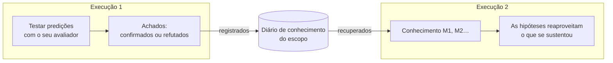

# Memória entre execuções

::: tip Em palavras simples
Pense em um caderno de laboratório compartilhado por todos que trabalham na mesma bancada. Cada vez que um experimento confirma ou refuta uma regra, isso é anotado com o que era esperado e o que foi visto. A próxima pessoa lê o caderno antes de começar: ela reaproveita o que se sustentou e não tenta de novo, do mesmo jeito, o que já falhou.

Um agente cognitivo pode manter um caderno assim. Ele só anota **o que um teste real respondeu**, nunca o que o modelo ou o pensador simplesmente acreditavam.
:::

## O que ela faz {#what-it-does}



1. **No fim de uma execução**, cada regra ou explicação com pelo menos uma predição que o seu [avaliador de resultados](./evidence-and-verification#predictions-and-the-outcome-evaluator) confirmou ou refutou se torna um **achado**: a afirmação, o seu escopo, a regra que ela revisa dentro da execução, e cada teste (o que era esperado, o que foi observado, qual avaliador). Os achados são acrescentados ao **diário** do escopo.
2. **No início da próxima execução** no mesmo escopo, os itens mais relevantes são **recuperados** e colocados no estado mental como `knowledge`, com os ids `M1`, `M2`…
3. **Durante a execução**:
   - o modelo vê cada item com o seu status e os seus testes mais recentes, e é orientado a reaproveitar uma regra verificada dentro do seu escopo, citando-a;
   - uma hipótese que reformula palavra por palavra um item **refutado** (mesmo tipo, mesma afirmação e mesmo escopo, desconsiderando maiúsculas e pontuação) é recusada pelo motor; o modelo é orientado a propor, em vez disso, uma variante que cite o id `M` do item nas suas premissas e explique a refutação, mas qualquer outra formulação ou escopo é aceito como uma nova hipótese;
   - uma hipótese que reformula um item **verificado** ou **contestado** é vinculada a ele automaticamente (o seu id `M` é adicionado às premissas), para que a etapa de comparação veja os testes anteriores.

## Ativá-la {#turn-it-on}

```ts
import { FileKnowledgeStore } from '@sdk-ai-agents/core';

const physicist = sdk.createCognitiveAgent({
  name: 'physicist',
  model: 'gpt-4o',
  evaluator: bench,   // without an evaluator, nothing is tested, so nothing is remembered
  knowledge: {
    store: new FileKnowledgeStore('./knowledge'),
    scope: 'inclined-plane',
  },
});

const first = await physicist.think({ problem: 'Does the rolling time depend on the ball?', observations });
const second = await physicist.think({ problem: 'Will a 250 g glass ball take as long as a steel one?' });

second.state.knowledge;
// [{ id: 'M1', status: 'refuted',  statement: 'Rolling time on this plane does not depend on the ball', … },
//  { id: 'M2', status: 'verified', statement: 'For rigid balls, rolling time on this plane does not depend on mass', … }]
```

| Opção | Padrão | Significado |
| --- | --- | --- |
| `store` | (obrigatório) | Onde o diário é guardado: `FileKnowledgeStore`, `InMemoryKnowledgeStore` ou o seu próprio |
| `scope` | (obrigatório) | Sobre o que é o conhecimento. As execuções compartilham o que aprenderam apenas dentro de um escopo. Letras minúsculas, dígitos, `.`, `-`, `_`: dois escopos que diferem apenas por maiúsculas/minúsculas compartilhariam um mesmo arquivo no macOS e no Windows |
| `recallLimit` | `10` | Itens recuperados no início de uma execução, de 0 a 50. `0` registra sem recuperar |
| `record` | `true` | Se as execuções registram o que os seus testes estabeleceram |

`examples/rule-discovery.ts` a utiliza: execute-o duas vezes, e a segunda execução começa com o que a primeira estabeleceu.

## O que é lembrado, e o que nunca é {#what-is-remembered-and-what-never-is}

| Lembrado | Nunca lembrado |
| --- | --- |
| Regras e explicações com uma predição que o seu avaliador **confirmou** ou **refutou** | Escolhas de ação (propostas): elas dependem de quem decide e de quando |
| O que era esperado, o que foi observado, qual avaliador e qual versão | Predições que nunca foram testadas, ou cujo teste foi **inconclusivo** |
| A regra que uma variante revisa, e o que mudou | Aquilo em que o modelo acreditava, o suporte que ele deu, as preferências do pensador |
| Quais execuções o registraram | A resposta final da execução |

Uma execução que falha ou é interrompida ainda assim registra os testes que realizou: uma medição continua válida, aconteça o que acontecer depois.

## Status {#statuses}

| Status | Quando | O que é dito ao modelo |
| --- | --- | --- |
| `verified` | Apenas confirmações até agora | Reaproveite-o dentro do seu escopo e cite-o; fora desse escopo, é uma hipótese a testar de novo |
| `refuted` | Apenas refutações até agora | Nunca o proponha de novo como estava; uma variante cita o seu id `M` nas premissas e diz o que muda |
| `contested` | Confirmações e refutações | Ele só vale em algumas condições: descubra quais |

A mesma afirmação no mesmo escopo é o mesmo item, independentemente de maiúsculas ou pontuação. Os testes são deduplicados por execução e por predição: registrar a mesma execução duas vezes não acrescenta nada.

## Quais itens são recuperados {#which-items-are-recalled}

Os itens do escopo são classificados de forma determinística:

1. o maior número de palavras em comum com o problema (palavras de quatro letras ou mais, na afirmação e no escopo);
2. depois, os mais testados;
3. depois, os mais recentes.

Os primeiros `recallLimit` itens são recuperados. Trata-se de uma simples correspondência de palavras, não de uma busca semântica: uma regra escrita de forma muito diferente do problema pode não ser recuperada primeiro. Mantenha os escopos estreitos (uma bancada, um produto, um domínio) para que tudo o que está em um escopo seja relevante.

## Escopos {#scopes}

Um escopo é uma fronteira, não um nome de pasta para manter a organização:

- as execuções **compartilham** o que aprenderam apenas dentro de um escopo;
- use um escopo por bancada, produto, conjunto de dados ou domínio cujas regras se apliquem umas às outras: `inclined-plane`, `checkout-latency`, `churn-model-v3`;
- nunca misture clientes ou inquilinos (tenants) em um mesmo escopo se os dados deles precisarem ficar separados.

## Repositórios {#stores}

| Repositório | Use-o para |
| --- | --- |
| `FileKnowledgeStore(directory)` | Um arquivo por escopo, `<directory>/<scope>.jsonl`, uma linha por execução. As linhas são apenas acrescentadas, então o arquivo também é um histórico legível. As gravações feitas por uma mesma instância de `FileKnowledgeStore` são serializadas: compartilhe uma instância entre os agentes de um processo |
| `InMemoryKnowledgeStore()` | Testes, protótipos, processos de vida curta |
| O seu próprio `KnowledgeStore` | Um banco de dados compartilhado por vários processos |

Várias instâncias ou processos gravando o mesmo escopo ao mesmo tempo devem usar um banco de dados: implemente os três métodos da porta (port). Uma linha deixada incompleta por uma gravação interrompida é ignorada na leitura, com um aviso, e a próxima entrada começa em uma nova linha; uma linha que é um JSON válido, mas não uma entrada válida, interrompe a leitura com o seu número de linha, já que o arquivo foi alterado.

```ts
import type { KnowledgeStore } from '@sdk-ai-agents/core';

const store: KnowledgeStore = {
  async recall({ scope, goal, limit }) { /* the most relevant items of the scope */ },
  async record({ scope, runId, recordedAt, findings }) { /* append one entry */ },
  async list(scope) { /* every item of the scope */ },
};
```

`projectKnowledge(entries)` consolida as entradas do diário em itens e `rankKnowledge(items, goal, limit)` os classifica, de modo que um repositório personalizado só precisa guardar as entradas (por exemplo, uma linha por execução) e reaproveitar as duas funções.

Inspecione a qualquer momento o que um escopo sabe:

```ts
for (const item of await store.list('inclined-plane')) {
  console.log(item.status, item.confirmations, item.refutations, item.statement);
}
```

## Auditoria e replay {#audit-and-replay}

- Os itens recuperados são registrados em `cognition.started` (`knowledge.scope`, `knowledge.items`), de modo que `sdk.getMentalState(runId)` reconstrói exatamente o que a execução sabia, sem ler o repositório de novo, mesmo que ele tenha mudado desde então.
- Os achados são registrados em um evento `cognition.knowledge_recorded` (`scope`, `findings`).
- Um repositório que falha nunca interrompe uma execução: uma recuperação que falhou é registrada como `knowledge.error` em `cognition.started` e a execução segue sem memória; uma gravação que falhou é registrada como `error` em `cognition.knowledge_recorded`. Um repositório que não responde dentro do `limits.timeoutMs` da execução é tratado como falho (uma gravação lenta ainda pode ser concluída depois). Se o próprio log de eventos não conseguir registrar os achados, um aviso é exibido e o resultado da execução é devolvido sem alteração.

## Limites {#limits}

- **Correspondência de palavras.** A recuperação não é semântica; regras relacionadas, escritas de outra forma, podem passar despercebidas.
- **Apenas reformulações exatas.** Só é recusada uma reformulação de uma regra refutada com o mesmo tipo, a mesma redação (desconsiderando maiúsculas e pontuação) e o mesmo escopo; uma reformulação com outras palavras é aceita como uma nova hipótese.
- **Um teste basta para ser `verified`.** Um item é verificado assim que uma predição foi confirmada e nenhuma refutada, e é o modelo que escolhe qual predição testa uma regra: uma predição fraca ainda conta como uma confirmação.
- **O escopo é declarado, não verificado.** Uma regra verificada para "bolas rígidas" é mostrada com esse escopo, e o modelo é orientado a não aplicá-la em outro lugar sem um novo teste; nada verifica isso no código.
- **Confia-se no avaliador.** A memória é tão confiável quanto o seu avaliador: uma medição errada é lembrada como um teste.
- **Um único gravador por arquivo.** `FileKnowledgeStore` serializa apenas as gravações de uma instância; duas instâncias ou dois processos gravando o mesmo escopo não são coordenados.
