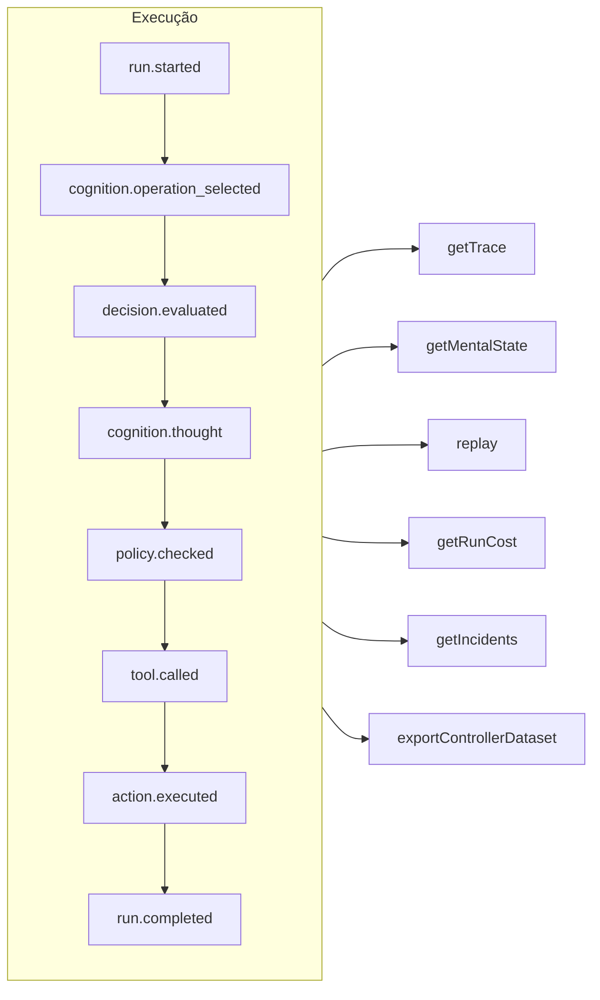

# Rastreabilidade e replay

Cada execução — governada, cognitiva, uma decisão tipada direta ou uma chamada de ferramenta MCP — é um **log de eventos em que só se acrescenta** (append-only). Nada acontece fora do registro, e todo o resto é derivado dele.



## Armazenamentos {#stores}

| Armazenamento | Use-o para |
| --- | --- |
| `FileEventStore` (padrão) | Desenvolvimento, processo único — um arquivo JSON por execução |
| `SQLiteEventStore` | Persistência local com consultas |
| `PostgreSQLEventStore` | Produção: consultas indexadas, agregação, backup e restauração |

::: code-group

```ts [File]
import { createSDK, FileEventStore } from '@sdk-ai-agents/core';

const sdk = createSDK({ apiKey, eventStore: new FileEventStore('./events') });
```

```ts [SQLite]
import Database from 'better-sqlite3';
import { createSDK, SQLiteEventStore } from '@sdk-ai-agents/core';

const sdk = createSDK({ apiKey, eventStore: new SQLiteEventStore({ db: new Database('events.db') }) });
```

```ts [PostgreSQL]
import pg from 'pg';
import { createSDK, PostgreSQLEventStore } from '@sdk-ai-agents/core';

const pool = new pg.Pool({ connectionString: process.env.DATABASE_URL });
const sdk = createSDK({ apiKey, eventStore: new PostgreSQLEventStore({ pool }) });
```

:::

Os armazenamentos implementam `IEventStore`; escreva o seu próprio para usar qualquer banco de dados. O armazenamento em arquivos mantém os eventos em buffer e os grava a cada 100 ms; chame `await store.destroy()` no encerramento para gravar o que estiver pendente. Os leitores do log (reconstrução do estado mental, custos, conjuntos de dados) ignoram eventos repetidos com o mesmo id.

## Ler uma execução {#read-a-run}

```ts
const trace = await sdk.getTrace(runId);          // status, timeline, summary
const text = await sdk.exportTrace(runId, 'text'); // human-readable timeline
const events = await sdk.getEvents(runId, { type: ['tool.called', 'policy.violated'] });
const state = await sdk.getMentalState(runId);    // cognitive runs
```

O status de uma execução é o **último evento de ciclo de vida** (`run.completed`, `run.failed`, `run.cancelled`). Os eventos acrescentados depois — feedback, relatórios de incidente — nunca a reabrem.

## Progresso em tempo real {#live-progress}

Os eventos também chegam ao seu código **enquanto a execução está em andamento**, assim que o armazenamento os aceita: para mostrar o progresso em uma interface, transmiti-lo a um cliente ou alimentar um painel. Os clientes MCP os recebem como [notificações de progresso](./mcp-deploy#progress-notifications).

```ts
const result = await agent.run({
  message: 'Refund order 1234',
  onEvent: (event) => console.log(event.type),
});

const answer = await cognitiveAgent.think({ problem, onEvent: (event) => socket.send(JSON.stringify(event)) });
const replay = await sdk.replay(runId, undefined, { onEvent: (event) => console.log(event.type) });

// Every run of the SDK, for as long as you listen
const unsubscribe = sdk.subscribe((event) => dashboard.push(event), { types: ['run.failed', 'approval.requested'] });
unsubscribe();
```

| Onde | O que o listener recebe |
| --- | --- |
| `run({ onEvent })`, `think({ onEvent })` | Todos os eventos dessa execução |
| `replay(runId, modifications, { onEvent })` | Todos os eventos do replay |
| `executeTool(name, params, { onEvent })` | Os eventos da chamada, e os das execuções de agente que a ferramenta chamada inicia (`governedAgentTool`, `cognitiveAgentTool`) |
| `sdk.subscribe(listener, { runId?, agentId?, types? })` | Todos os eventos de todas as execuções que correspondem ao filtro, até você chamar a função que ele devolve |

O que é garantido:

- **Apenas o que o armazenamento aceitou.** Um listener é chamado depois que o `append` do armazenamento teve sucesso, nunca para um evento que o armazenamento recusou. Com os armazenamentos SQL, o commit da linha já foi feito; com o armazenamento em arquivos, o evento está no buffer dele: `getEvents` o devolve na hora, e ele chega ao disco em até 100 ms (se o processo cair nesse intervalo, ele se perde).
- **Em ordem.** Os eventos de uma execução chegam na ordem em que foram registrados; os eventos de execuções diferentes se intercalam.
- **Um evento de cada vez, e a execução nunca espera.** Quando o seu listener devolve uma promise, o próximo evento dele espera até que essa promise seja concluída, então um listener assíncrono não consegue reordenar os eventos. Enquanto isso, a execução continua: um listener lento fica para trás, ele não deixa o agente mais lento. `run()`, `think()`, `replay()` e `executeTool()` só se resolvem quando o `onEvent` deles tiver sido concluído para cada evento da execução, então, quando eles retornam, você já viu tudo. Uma promise que nunca é concluída os impede de retornar: para um trabalho que você dispara sem aguardar, não devolva a promise (`onEvent: (event) => { void save(event); }`). Um listener síncrono é chamado antes que o `append` do evento retorne: mantenha-o rápido.
- **Os erros ficam fora da execução.** Um listener que lança um erro ou cuja promise é rejeitada é relatado na saída de erro padrão (`console.error`) e continua recebendo os eventos seguintes. Para tratá-los você mesmo, capture-os no listener, ou crie o SDK com `eventStore: new ObservedEventStore(store, { onListenerError })`.
- **Uma cópia.** Cada listener recebe a própria cópia do evento, tal como o armazenamento a lê de volta: alterá-la não muda nada no log.
- **O cancelamento da inscrição é imediato.** Depois que a função devolvida por `sdk.subscribe` é chamada, o listener não é chamado de novo, nem mesmo para eventos que já estavam aguardando; ela pode ser chamada de dentro do listener.

O filtro `agentId` é comparado com o `metadata.agentId` de cada evento: alguns eventos não trazem agente (`provider.retry`, o fim de um replay); filtre por execução para recebê-los. Os backups restaurados não são entregues. Para um agente montado à mão sobre o seu próprio armazenamento (`new AgentImpl(…)`), envolva o armazenamento em um `ObservedEventStore` para usar `onEvent`; o `createSDK` faz isso por você.

## Replay sem o LLM {#replay-without-the-llm}

```ts
const replay = await sdk.replay(runId);
```

O replay reexecuta as intenções registradas por meio do motor de ações — incluindo as políticas — **sem chamar o LLM**. Faça o replay com modificações para testar cenários do tipo "e se", por exemplo depois de mudar uma política.

Um replay executa as ferramentas de novo, de verdade. Para as ferramentas marcadas com `requiresApproval`, um replay repete apenas as chamadas que um humano **aprovou** na execução original — a mesma ferramenta com os mesmos parâmetros — sem perguntar de novo; uma chamada que foi rejeitada, cancelada ou nunca aprovada é recusada, não executada. As aprovações exigidas por uma *política* continuam valendo e aguardam uma decisão.

## Entender as decisões {#understand-decisions}

| Método | O que você obtém |
| --- | --- |
| `getReasoningGraph(runId)` / `exportReasoningGraph(runId, 'graphviz')` | A cadeia intenção → política → ação como um grafo |
| `getAlternatives(runId)` | As alternativas que o agente considerou |
| `getDecisionPatterns(filters)` | Padrões de decisão recorrentes entre execuções |
| `getTraceVisualization(runId)` | Uma estrutura agrupada, pronta para linha do tempo, para uma interface |
| `getPolicyAuditTrail(runId)` | Cada avaliação de política e o seu resultado |

## Testar agentes como código {#test-agents-like-code}

Transforme uma boa execução em um **golden trace** (trace de referência) e, depois, valide as novas execuções em relação a ele:

```ts
const golden = await sdk.createGoldenTrace(runId, { name: 'refund flow', description: 'Expected behavior' });
const validation = await sdk.validateAgainstGoldenTrace(newRunId, golden.id);
const regressions = await sdk.detectRegressions(newRunId, golden.id);
```

Suítes de regressão, asserções de comportamento, comparação de execuções e análise de impacto antes da implantação também estão disponíveis — veja a [API do SDK](../reference/sdk-api).
