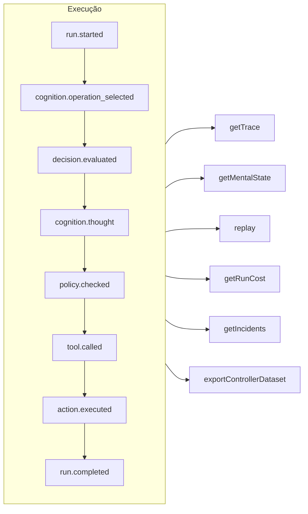

# Rastreabilidade e replay

Cada execução — governada, cognitiva, uma decisão tipada direta ou uma chamada de ferramenta MCP — é um **log de eventos em que só se acrescenta** (append-only). Nada acontece fora do registro, e todo o resto é derivado dele.



## Armazenamentos {#stores}

| Armazenamento | Use-o para |
| --- | --- |
| `FileEventStore` (padrão) | Desenvolvimento, processo único — um arquivo JSON por execução |
| `SQLiteEventStore` | Persistência local com consultas |
| `PostgreSQLEventStore` | Produção: consultas indexadas, agregação, backup e restauração |

::: code-group

```ts [File]
import { createSDK, FileEventStore } from '@sdk-ai-agents/core';

const sdk = createSDK({ apiKey, eventStore: new FileEventStore('./events') });
```

```ts [SQLite]
import Database from 'better-sqlite3';
import { createSDK, SQLiteEventStore } from '@sdk-ai-agents/core';

const sdk = createSDK({ apiKey, eventStore: new SQLiteEventStore({ db: new Database('events.db') }) });
```

```ts [PostgreSQL]
import pg from 'pg';
import { createSDK, PostgreSQLEventStore } from '@sdk-ai-agents/core';

const pool = new pg.Pool({ connectionString: process.env.DATABASE_URL });
const sdk = createSDK({ apiKey, eventStore: new PostgreSQLEventStore({ pool }) });
```

:::

Os armazenamentos implementam `IEventStore`; escreva o seu próprio para usar qualquer banco de dados. O armazenamento em arquivos mantém os eventos em buffer e os grava a cada 100 ms; chame `await store.destroy()` no encerramento para gravar o que estiver pendente. Os leitores do log (reconstrução do estado mental, custos, conjuntos de dados) ignoram eventos repetidos com o mesmo id.

## Ler uma execução {#read-a-run}

```ts
const trace = await sdk.getTrace(runId);          // status, timeline, summary
const text = await sdk.exportTrace(runId, 'text'); // human-readable timeline
const events = await sdk.getEvents(runId, { type: ['tool.called', 'policy.violated'] });
const state = await sdk.getMentalState(runId);    // cognitive runs
```

O status de uma execução é o **último evento de ciclo de vida** (`run.completed`, `run.failed`, `run.cancelled`). Os eventos acrescentados depois — feedback, relatórios de incidente — nunca a reabrem.

## Replay sem o LLM {#replay-without-the-llm}

```ts
const replay = await sdk.replay(runId);
```

O replay reexecuta as intenções registradas por meio do motor de ações — incluindo as políticas — **sem chamar o LLM**. Faça o replay com modificações para testar cenários do tipo "e se", por exemplo depois de mudar uma política.

Um replay executa as ferramentas de novo, de verdade. Para as ferramentas marcadas com `requiresApproval`, um replay repete apenas as chamadas que um humano **aprovou** na execução original — a mesma ferramenta com os mesmos parâmetros — sem perguntar de novo; uma chamada que foi rejeitada, cancelada ou nunca aprovada é recusada, não executada. As aprovações exigidas por uma *política* continuam valendo e aguardam uma decisão.

## Entender as decisões {#understand-decisions}

| Método | O que você obtém |
| --- | --- |
| `getReasoningGraph(runId)` / `exportReasoningGraph(runId, 'graphviz')` | A cadeia intenção → política → ação como um grafo |
| `getAlternatives(runId)` | As alternativas que o agente considerou |
| `getDecisionPatterns(filters)` | Padrões de decisão recorrentes entre execuções |
| `getTraceVisualization(runId)` | Uma estrutura agrupada, pronta para linha do tempo, para uma interface |
| `getPolicyAuditTrail(runId)` | Cada avaliação de política e o seu resultado |

## Testar agentes como código {#test-agents-like-code}

Transforme uma boa execução em um **golden trace** (trace de referência) e, depois, valide as novas execuções em relação a ele:

```ts
const golden = await sdk.createGoldenTrace(runId, { name: 'refund flow', description: 'Expected behavior' });
const validation = await sdk.validateAgainstGoldenTrace(newRunId, golden.id);
const regressions = await sdk.detectRegressions(newRunId, golden.id);
```

Suítes de regressão, asserções de comportamento, comparação de execuções e análise de impacto antes da implantação também estão disponíveis — veja a [API do SDK](../reference/sdk-api).
