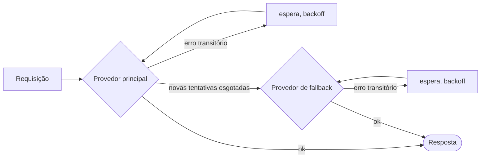

# Novas tentativas e fallback

As redes falham, os provedores sofrem limitação de taxa (rate limit), as ferramentas estouram o tempo limite. O SDK tenta de novo o que pode ser tentado de novo, faz failover do que não pode e **grava cada nova tentativa na execução**, para que nada fique oculto.



## Provedores de LLM {#llm-providers}

Uma política de novas tentativas se aplica a cada provedor **individualmente, antes de qualquer fallback**:

```ts
const sdk = createSDK({
  apiKey: process.env.OPENAI_API_KEY,
  fallbackProviders: [{ provider: 'anthropic', config: { apiKey: process.env.ANTHROPIC_API_KEY } }],
  retry: { maxRetries: 3, initialDelayMs: 500, maxDelayMs: 8_000 },
});
```

Um provedor de fallback de outro fornecedor precisa da própria chave, no seu `config` ou em `providerConfig`: a chave do principal nunca é enviada a outro fornecedor. Ele recebe o modelo do agente somente se o atender e, caso contrário, o seu próprio `defaultModel` (a Anthropic recusa um nome de modelo da OpenAI, e vice-versa). O evento `intention.generated` indica o provedor que respondeu e o modelo usado.

| Opção | Padrão | |
| --- | --- | --- |
| `maxRetries` | `2` | Novas tentativas depois da primeira tentativa |
| `initialDelayMs` | `500` | Dobrado a cada nova tentativa (`multiplier`) |
| `maxDelayMs` | `8000` | Limite superior de uma espera de backoff |
| `maxRetryAfterMs` | `60000` | `retry-after` mais longo respeitado (`maxDelayMs` quando existe um fallback) |
| `jitter` | `true` | Torna cada espera aleatória dentro de [delay/2, delay] |
| `retryOn` | `isTransientError` | O seu próprio predicado |

Só os erros **transitórios** geram novas tentativas: 408, 409, 425, 429, 5xx, 529, falhas de conexão e timeouts — incluindo os erros de conexão da OpenAI e da Anthropic, reconhecidos pela classe e pelo código de rede na sua `cause`. Os erros de autenticação, de validação e de política falham imediatamente, assim como um 429 que significa que a conta está sem crédito ou sem cota (`insufficient_quota`, `credit_balance_exhausted`…): esperar não traria o crédito de volta. A mensagem de erro traz a explicação do fornecedor. Quando o provedor envia `retry-after-ms` ou `retry-after`, o SDK espera esse tempo em vez do seu próprio backoff, até `maxRetryAfterMs` (60 s por padrão). Quando há `fallbackProviders` configurados, esse limite é reduzido para `maxDelayMs`: um provedor que pede uma pausa longa é deixado para o fallback em vez de bloquear a execução. Um pedido de espera mais longo encerra as novas tentativas.

Quando a política do SDK está ativa, as novas tentativas próprias dos clientes da OpenAI e da Anthropic são desativadas — **as novas tentativas nunca se acumulam**. Cada nova tentativa é registrada como um evento `provider.retry` com o provedor, o modelo, a tentativa, a espera e o erro. Passe `retry: false` para manter os padrões do fornecedor.

Um provedor que você injeta com `llmProvider` é usado como está, a menos que você defina `retry` explicitamente, e um `FallbackProvider` nunca é encapsulado, para que os seus failovers continuem visíveis no trace. Os seus provedores também não são encapsulados, então `retry` não se aplica a eles: para repetir um antes do failover, encapsule-o em `RetryingLLMProvider` e dê ao cliente dele `maxRetries: 0`.

## Ferramentas {#tools}

Marque as ferramentas idempotentes como passíveis de nova tentativa:

```ts
sdk.defineTool({
  name: 'lookup_metric',
  description: 'Reads a metric',
  schema: z.object({ metric: z.string() }),
  retry: { maxRetries: 2, initialDelayMs: 200 },
  handler: async ({ metric }) => warehouse.read(metric),
});
```

Só as falhas da ferramenta geram novas tentativas — nunca uma negação de política ou um erro de validação. Cada nova tentativa é um evento `tool.retry`.

## Decisões tipadas {#typed-decisions}

O cliente do Jev tenta de novo as respostas 408, 429, 5xx e 529 e os erros de rede, **respeitando `retry-after`**, com a política de novas tentativas do SDK como padrão (`jev.maxRetries` a sobrescreve). Diferentemente dos provedores de LLM, ele tenta de novo todo 429, qualquer que seja a causa, até `maxRetries`.

## Em qualquer outro lugar {#anywhere-else}

`withRetry` é exportado para o seu próprio código:

```ts
import { withRetry, DEFAULT_RETRY_POLICY } from '@sdk-ai-agents/core';

const data = await withRetry(() => fetchPartnerFeed(), DEFAULT_RETRY_POLICY, {
  onRetry: ({ retry, delayMs, error }) => logger.warn({ retry, delayMs, error }),
});
```
