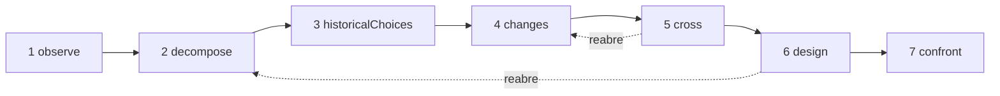

# Estudos

Um estudo é um pesquisador de IA. Ele aplica um único método — **entender um objeto e depois redesenhá-lo com os meios de hoje** — e entrega a você um dossiê: o que o objeto faz, como ele funciona, por que foi construído assim, o que mudou desde então, várias novas concepções e os experimentos que permitiriam decidir entre elas. Ele não constrói nada, não executa nada e não mede nada: ele investiga e propõe.

::: tip Em palavras simples
Escolha um objeto: um navegador Web, um motor de banco de dados, um quadro de horários de trens. O estudo o observa, o desmonta, procura os motivos por trás das suas escolhas antigas, pesquisa os trabalhos científicos e as técnicas que surgiram desde então e cruza as duas coisas para imaginar outra organização. Ele mira uma mudança de princípio que torna possível algo novo, não uma versão mais rápida da mesma coisa. Cada afirmação diz se ela é **estabelecida** por uma fonte que o estudo realmente encontrou, uma **hipótese** ou uma **novidade** ainda a verificar em relação aos trabalhos existentes. E, o tempo todo, vários mecanismos o mantêm no objetivo que você lhe deu, porque os modelos de linguagem tendem a se desviar à medida que as instruções se acumulam. Cada termo é explicado em [Termos-chave em palavras simples](./glossary#studies).
:::

```ts
const study = sdk.createStudy({
  name: 'browser',
  object: 'The Web browser, from 1990 to 2026',
  objective: 'A browser design whose every choice follows from the investigation',
  leads: ['vectorisation', 'weights', 'ReLU'], // your leads: examples to verify, not truths
  analogues: ['Bitcoin'],                      // breakthroughs by assembly to deconstruct
  sources: ['web_search', 'arxiv_search'],     // SDK tools the study searches with (webTools())
});

const result = await study.run();
result.status;   // 'completed' | 'stopped' | 'failed' | 'cancelled'
result.report;   // the structured report
result.markdown; // the same, as a readable dossier
```

## O que é um estudo {#what-a-study-is}

Um estudo aplica um método em sete passagens: *entender um objeto e depois redesenhá-lo com os conhecimentos e as técnicas de hoje*. A sua pergunta norteadora é: **se tivéssemos de atender às necessidades de hoje com os conhecimentos e as técnicas disponíveis hoje, como organizaríamos este objeto?** A não ser que você forneça a sua própria `question`, o estudo a faz no idioma dele, seguida do alvo descrito em [O alvo: uma nova capacidade](#the-aim-a-new-capability).

Um estudo não é um agente. Ele não tem ferramentas com as quais agir, apenas **fontes** para pesquisar (veja [Pesquisar por meio das suas fontes](#research-through-your-sources)), e o que ele produz é um relatório, não uma ação. Ele é criado com `sdk.createStudy()`, a partir de uma **carta** — o objeto, o objetivo, as suas necessidades e as suas pistas — que nunca muda depois.

A última passagem dele concebe experimentos; ela não os executa. Depois de executar um, você registra o que ele revelou na ficha de mecanismo correspondente (veja [A ficha de mecanismo](#the-mechanism-card)).

## As sete passagens {#the-seven-passages}

Uma execução percorre as sete passagens do método, em ordem. Cada uma produz itens de alguns tipos (as suas **coleções**), e cada item recebe um id que nunca é reutilizado, até um reinício: `O1`, `P2`, `A1`…

| # | Passagem | O que faz | O que guarda |
| --- | --- | --- | --- |
| 1 | `observe` | Olha os comportamentos, os usos, as variações e as falhas do objeto, cada um com as suas condições: quando, onde, para quem, com o quê. Descreve; ainda não explica | `observations` (`O`) |
| 2 | `decompose` | Mapeia as peças: a sua função, entradas, saídas e relações, descendo dentro de uma peça enquanto o funcionamento dela continua opaco, com as incógnitas de cada uma. Define a **cadeia completa** do objeto, etapa por etapa (para um navegador: receber, entender, executar, exibir, interagir) | `pieces` (`P`), `chain` (`C`) |
| 3 | `historicalChoices` | Pesquisa os motivos documentados das escolhas da sua época: hardware, ferramentas, usos, conhecimentos, custos, compatibilidade. Um motivo plausível sem documento continua sendo uma hipótese | `historicalChoices` (`H`) |
| 4 | `changes` | Pesquisa o que surgiu ou se tornou utilizável desde então, no domínio do objeto e em outros, cada avanço com o seu mecanismo, data, evidências, condições de uso e disponibilidade. Dá um veredito sobre cada uma das suas pistas, procura outras ferramentas matemáticas e técnicas além delas, lista as melhores realizações atuais (a referência do que é "melhor") e desconstrói as rupturas por montagem | `advances` (`V`), `leadVerdicts` (`L`), `independentLeads` (`I`), `references` (`R`), `analogues` (`B`) |
| 5 | `cross` | Cruza passado e presente: quais restrições permanecem, quais se enfraqueceram, quais exigências são novas. Deduz as decisões que se tornaram revisáveis, propõe combinações A + B (o que A permite a B fazer, o que elas precisam trocar, quanto isso custa em conversões e sincronização) e nomeia novas capacidades candidatas | `constraints` (`K`), `revisableDecisions` (`D`), `combinations` (`X`), `capabilities` (`Y`) |
| 6 | `design` | Concebe pelo menos duas arquiteturas, pelo menos uma delas visando uma nova capacidade, cada uma cobrindo a cadeia completa, com o seu mecanismo, condições, benefício, custo adicional, um contraexemplo possível e as suas predições. Dá os três estados de cada peça principal e diz o que é novo e o que não é. Depois, pesquisa o estado da técnica das novidades e da montagem de cada capacidade | `architectures` (`A`), `threeStates` (`T`), `noveltyClaims` (`N`) |
| 7 | `confront` | Concebe os experimentos que permitiriam decidir entre as arquiteturas e testar a cadeia completa: protocolo, medidas, critérios e o resultado esperado para cada arquitetura. Preenche uma ficha de mecanismo para cada mecanismo principal | `experiments` (`E`), `cards` (`M`) |

Os resultados que as pesquisas devolvem também são numerados: `S1`, `S2`… Cada passagem recebe os itens das passagens anteriores de que precisa, como registros JSON compactos: apenas os itens que o guardião julgou (veja [O guardião](#the-guardian)).

### Um ciclo, não uma linha {#a-loop-not-a-line}



As passagens formam um ciclo. Quando uma incógnita bloqueia uma passagem — a concepção precisa saber como uma peça realmente funciona, por exemplo —, ela pode pedir para **reabrir** uma passagem anterior sobre esse ponto. A passagem anterior é executada de novo com esse foco e acrescenta aos itens que já tinha apenas o que essa incógnita exige: ela não tem nenhum mínimo a cumprir, e não precisa dar de novo nenhum veredito sobre as pistas nem nenhuma ruptura. Depois, a passagem que pediu é executada de novo com eles; até que isso aconteça, ela não está completa (o seu estado é `partial`), e a pesquisa do estado da técnica da concepção espera pela versão final dela. `limits.maxLoops` limita as reaberturas de uma execução (1 por padrão, 0 para não permitir nenhuma); uma passagem que foi ela mesma reaberta não pode reabrir outra.

### Três estados de cada peça {#three-states-of-each-piece}

A concepção dá a cada peça principal três estados, mantidos separados no relatório (`threeStates`):

- **o objeto na sua época** (`atItsTime`): como a peça foi construída, e em quais condições;
- **as melhores realizações atuais pertinentes** (`currentBest`): a referência com a qual uma melhoria é medida;
- **a nossa proposta** (`proposal`): o que a arquitetura faz com ela.

A idade de uma escolha não a torna errada, e uma técnica recente pode tornar desnecessária uma complicação do passado: os três estados mostram qual condição mudou, qual mecanismo se tornou possível e o que isso faz com o conjunto.

### A ficha de mecanismo {#the-mechanism-card}

A última passagem preenche uma ficha para cada mecanismo principal. Ela tem onze campos: o estudo preenche os nove primeiros, e os dois últimos ficam vazios até que você tenha executado um experimento.

| # | Campo | A pergunta a que responde |
| --- | --- | --- |
| 1 | `observation` | O que o sistema faz, em quais condições? |
| 2 | `mechanism` | Quais peças e relações o explicam? |
| 3 | `unknown` | O que ainda falta abrir, medir ou documentar? |
| 4 | `historicalChoice` | Por que esta organização foi escolhida, com base em quais evidências? |
| 5 | `evolution` | O que mudou desde então, com quais fontes e datas? |
| 6 | `newPossibility` | Qual escolha se torna revisável graças a essa mudança? |
| 7 | `proposedCombination` | Como as técnicas se encaixam, concretamente? |
| 8 | `prediction` | Que efeito esperamos, em quais condições? |
| 9 | `experiment` | Como decidimos entre as propostas e verificamos o conjunto? |
| 10 | `resultAndError` | O que encontramos, e onde a explicação falha? |
| 11 | `conclusionAndMemory` | O que mantemos, o que mudamos, onde este mecanismo poderia ser reutilizado? |

```ts
await study.recordResult('M1', {
  result: 'Layout reuse cut the time to redraw by 40% on the reference pages',
  error: 'No gain on pages whose styles change on every frame',
  conclusion: 'Keep immutable layout results; look again at style invalidation',
});
```

`recordResult(cardId, { result, error?, conclusion? })` preenche os campos 10 e 11 da ficha e registra um evento `study.result_recorded` na execução que escreveu a ficha. Ele lança um `ValidationError` para uma ficha desconhecida ou um `result` vazio. `study.report()` devolve o relatório com a ficha preenchida.

## O alvo: uma nova capacidade {#the-aim-a-new-capability}

Um estudo não procura uma versão mais rápida do mesmo objeto. Ele procura **uma mudança de princípio que torne possível algo difícil hoje, não apenas algo mais rápido**.

### Capacidade, princípio, mecanismo {#capability-principle-mechanism}

Cada arquitetura enuncia três coisas:

- **a capacidade** (`capability`): o que se torna possível, para quem, e a restrição de hoje que ela remove (`what`, `forWhom`, `liftedConstraint`);
- **a mudança de princípio** (`principleChange`): qual princípio muda — `representation`, `distribution` (do trabalho), `responsibility`, `trust`, `verification` ou `other` — e como;
- **o mecanismo** (`mechanism`): como a montagem de técnicas produz a capacidade.

Cada arquitetura declara o seu `kind`: `capability`, ou `improvement` quando ela apenas torna algo mais rápido ou mais barato. Uma arquitetura que não declara nenhum tipo é uma melhoria, a afirmação mais fraca. Uma capacidade precisa enunciar a sua mudança de princípio e a sua montagem, senão o schema a recusa (veja [Cada item diz a que serve](#every-item-says-what-it-serves)).

Você pode nomear na carta a capacidade que visa (`capability`); todo prompt passa então a trazê-la. Sem ela, a passagem `cross` precisa propor pelo menos uma candidata (`capabilities`, `Y1`…), dizendo para quem ela é, por que é difícil hoje e qual princípio mudaria.

O guardião (veja [O guardião](#the-guardian)) vê o mecanismo, os componentes e a montagem de cada arquitetura, e julga duas coisas separadamente: se ela serve ao objetivo, e se ela abre uma nova capacidade. Uma capacidade que ele considera apenas mais rápida ou mais barata se torna uma `improvement`, com `declaredKind: 'capability'` para mostrar o que o modelo afirmou, `kindReason` para dizer por quê, e um evento `study.capability_demoted`. Uma melhoria que serve ao objetivo permanece: ela vem depois das capacidades, e nunca é removida por ser uma melhoria. Uma concepção que fica sem nenhuma capacidade está fora do objetivo como um todo: ela é anotada no registro de deriva e refeita uma vez; se a nova versão ainda não tiver nenhuma, o relatório diz isso (aviso `noCapability`), e se o guardião não manteve nenhuma arquitetura, ele também diz isso (aviso `noDesign`). Uma capacidade cuja montagem a pesquisa do estado da técnica encontra já realizada continua sendo uma capacidade, mas deixa de ser nova: veja [Estado da técnica](#prior-art). No relatório, **as novas capacidades vêm primeiro, depois as capacidades cuja montagem já existe, depois as melhorias**.

### A novidade está na montagem {#novelty-lies-in-the-assembly}

As rupturas raramente vêm de uma técnica sem precedente. Com mais frequência, elas montam técnicas anteriores de um modo que ninguém tinha feito, e essa montagem abre uma capacidade. Um estudo raciocina da mesma forma:

- uma arquitetura lista os seus **componentes** (`components`): técnicas anteriores, cada uma com o seu enunciado, data e fontes, cada uma com um status verificado como o de qualquer afirmação;
- a sua **montagem** (`assembly`) diz o que cada componente dá aos outros, o que eles trocam e quanto isso custa;
- um componente **nunca é uma novidade**: um componente apresentado como novo é `established` se um resultado listado no seu prompt o documenta, e uma `hypothesis` caso contrário, com o motivo;
- cada componente e cada ligação da montagem dizem de quais registros da investigação vêm (`from`): avanços (`V`), pistas independentes (`I`), referências (`R`), rupturas (`B`), decisões revisáveis (`D`), combinações (`X`) e capacidades candidatas (`Y`), entre os que o prompt da concepção listou. O código verifica isso: os ids que o prompt não listou vão para `unknownFrom`, e uma parte que não cita nenhum dos registros listados é marcada como `untraced` — ela não decorre da investigação —, com o aviso `untracedAssembly`;
- o status da própria arquitetura é o da sua montagem e da sua capacidade. O estado da técnica da montagem de **cada capacidade**, qualquer que seja o status que o modelo lhe deu, é pesquisado **como uma combinação**: o estudo procura trabalhos que já juntam os mesmos componentes para produzir a mesma capacidade, não cada peça separadamente.

O dossiê mostra o caminho de cada arquitetura: componentes (com os seus status e a sua origem) → montagem (com o seu status) → capacidade.

### Rupturas por montagem {#breakthroughs-by-assembly}

A passagem `changes` também desconstrói rupturas do passado, em qualquer domínio, que vieram da montagem de técnicas anteriores (`analogues`, `B1`…). O Bitcoin é o exemplo que o método dá: assinaturas de chave pública, cadeias de hashes e carimbo de tempo, prova de trabalho, árvores de Merkle e uma rede peer-to-peer já existiam antes; montados, eles deram um livro-razão compartilhado sem um terceiro de confiança.

Para cada ruptura, o estudo registra as técnicas anteriores que ela montou (pelo menos duas, com as suas datas), a restrição que ela removeu, a capacidade que se abriu e o **padrão** da montagem. As passagens `cross` e `design` recebem esses padrões e podem reutilizá-los. Cada ruptura é uma afirmação como qualquer outra: `established` somente com um resultado que o estudo recuperou.

As rupturas que você nomeia em `analogues` precisam, cada uma, ser desconstruídas. A carta as numera, e o modelo nomeia a que desconstrói pelo seu número (`named`), de modo que a correspondência se mantém qualquer que seja o idioma em que o modelo escreve. Uma resposta que esquece uma delas é devolvida uma vez; se ainda faltar alguma, o relatório a lista em `undeconstructedAnalogues`, com o aviso `analoguesNotDeconstructed`. O estudo pode acrescentar outras rupturas que tenha encontrado.

## Estabelecida, hipótese, novidade {#established-hypothesis-novelty}

Cada item de um estudo é uma **afirmação**: um enunciado com um status, os resultados que ele cita (`sources`) e aquilo a que ele serve no objetivo. O modelo propõe um status; **o código o verifica**, diga o modelo o que disser.

| Status | O que exige | O que o estudo faz caso contrário |
| --- | --- | --- |
| `established` | Cita pelo menos um resultado **listado no prompt que a escreveu** | Ela se torna uma `hypothesis`. `declaredStatus` guarda o status que o modelo deu e `statusReason` diz por quê; os ids que ela citou e que o seu prompt não listou são mantidos à parte em `unlistedSources` e não sustentam nada |
| `hypothesis` | Nada: plausível, não documentada aqui | — |
| `novelty` | Uma ideia que ainda não existe, e uma **pesquisa do seu estado da técnica** | Ela continua sendo uma novidade a verificar (`toVerify: true`), com o motivo, até que o seu estado da técnica tenha sido pesquisado e avaliado |

Um resultado que o estudo recuperou para outra passagem não basta: o modelo precisa tê-lo visto no prompt que escreveu a afirmação. A mesma regra vale para os componentes de uma arquitetura. Um status que o estudo não consegue ler conta como `hypothesis`, nunca como um status mais forte. **Sem fontes, nada pode ser estabelecido**: toda afirmação é no máximo uma hipótese, nenhuma novidade pode ser verificada, e o relatório diz isso no seu primeiro aviso (`noSources`).

Cada motivo que o estudo dá — por que um status foi rebaixado, por que um item foi removido, por que uma emenda foi recusada — é um `StudyReason`: um `code` (como `citesUnlisted` ou `priorArtNoResult`), os seus `params` e o mesmo motivo em inglês (`message`). O dossiê o escreve no idioma do estudo; um motivo que o guardião ou o modelo escreveu tem o código `judged`, com o seu texto em `params.text`.

### Estado da técnica {#prior-art}

Depois da concepção final, o estudo pesquisa o estado da técnica de cada novidade ainda a verificar, tanto as da concepção quanto as das passagens anteriores, e da montagem de cada arquitetura que visa uma capacidade, qualquer que seja o seu status. O modelo escolhe pesquisas para cada afirmação (para uma arquitetura: a combinação dos seus componentes e a capacidade), o estudo as executa, e depois uma chamada separada nomeia o trabalho existente mais próximo e dá um veredito. **O estado da técnica de uma afirmação se apoia apenas nos resultados das suas próprias pesquisas**, e em pelo menos um deles:

- `novel` ou `partlyNovel`: uma novidade continua sendo uma novidade, não mais a verificar, com o seu `priorArt` (`closest`, `sources`, `verdict`);
- `exists`: a ideia já foi feita; uma novidade se torna uma `hypothesis`, e `statusReason` nomeia o trabalho mais próximo.

O estado da técnica de uma capacidade que não é uma novidade também é registrado, e o seu status não muda: o estudo rebaixa status, nunca os eleva. Quando a sua montagem já existe, ela mantém `kind: 'capability'`, o seu `priorArtReason` diz isso (`assemblyExists`, com o trabalho mais próximo), e ela vem depois das outras capacidades, antes das melhorias (aviso `capabilitiesExist`).

Uma afirmação cujo estado da técnica não pôde ser pesquisado ou avaliado continua a verificar (`toVerify`), com o motivo: no seu `statusReason` para uma novidade, no seu `priorArtReason` para uma capacidade de outro status. Os motivos: a sua pesquisa ainda não foi executada (`priorArtNotSearchedYet`), nenhuma fonte (`priorArtNoSource`), nenhuma pesquisa pedida para ela (`priorArtNotSearched`), as suas pesquisas falharam (`priorArtSearchFailed`) ou não encontraram nada (`priorArtNoResult`), o orçamento de pesquisas se esgotou (`priorArtSearchBudget`), os seus resultados não foram avaliados (`priorArtNotAssessed`), ou a verificação não citou nenhum dos seus próprios resultados (`priorArtUnsupported`). Uma novidade afirmada depois da concepção também continua a verificar. O relatório as conta (avisos `noveltiesToVerify` e `capabilitiesToVerify`).

Uma pesquisa do estado da técnica que falhou porque o serviço a limitou — o erro da sua ferramenta diz `throttled`, como dizem as ferramentas Web do SDK — não se perde por isso: ela é tentada mais uma vez, depois das outras pesquisas do estado da técnica e depois da espera que os serviços pediram (no mínimo 5 s), quando a execução ainda teria um minuto e pesquisas sobrando. Uma pesquisa cujo serviço pediu mais de 150 s, ou mais tempo do que resta à execução, não é tentada de novo mais cedo do que ele pediu. A segunda tentativa é registrada como uma pesquisa própria (`retry: true`). Uma pesquisa que falhou por outro motivo não é tentada de novo, e uma afirmação cuja segunda tentativa também falha continua a verificar, como acima.

## Pesquisar por meio das suas fontes {#research-through-your-sources}

Um estudo pesquisa com **as ferramentas que você lhe dá** como `sources`: os nomes de ferramentas do SDK. As [ferramentas Web](./web-research) do SDK funcionam sem configuração — `web_search` (DuckDuckGo até você configurar outro provedor), `arxiv_search`, `wikipedia_search` e `github_search` — e os resultados delas vêm com uma URL e, quando conhecida, uma data:

```ts
import { webTools } from '@sdk-ai-agents/core';

// Define the tools first: the study checks its sources when it is created.
const sources = webTools({ include: ['web_search', 'arxiv_search', 'wikipedia_search'] }).map(
  (tool) => sdk.defineTool(tool).name
);

const study = sdk.createStudy({ name: 'browser', object, objective, sources });
```

Qualquer outra ferramenta de pesquisa também funciona, por exemplo as ferramentas de pesquisa de um servidor MCP importado com [`connectMcpServer`](./mcp#use-the-tools-of-an-mcp-server-in-your-agents) e definidas com `sdk.defineTool`:

```ts
import { connectMcpServer } from '@sdk-ai-agents/core/mcp';

const search = await connectMcpServer({
  name: 'search',
  transport: {
    type: 'stdio',
    command: 'npx',
    args: ['-y', '@modelcontextprotocol/server-brave-search'],
    env: { BRAVE_API_KEY: process.env.BRAVE_API_KEY ?? '' },
  },
  metadata: { readOnly: true },
});
// Define the tools first: the study checks its sources when it is created.
const sources = search.tools.map((tool) => sdk.defineTool(tool).name);

const study = sdk.createStudy({ name: 'browser', object, objective, sources });
```

- **Verificadas quando o estudo é criado.** `createStudy` lança um `ValidationError` quando uma fonte não é uma ferramenta definida, ou não aceita nenhuma consulta em texto. A consulta vai no parâmetro `query` da ferramenta, ou em outro nome comum (`q`, `search`, `keywords`…), senão no seu único parâmetro de texto obrigatório, senão no seu primeiro parâmetro de texto.
- **Governadas.** Cada pesquisa passa por `sdk.executeTool`, sob o `id` do estudo como id de agente e com as fontes como as suas únicas ferramentas permitidas: allowlists, políticas, orçamentos, aprovações, novas tentativas e traces se aplicam como a qualquer chamada de ferramenta, e os eventos da ferramenta (`action.executing`, `policy.checked`, `tool.called`, `action.executed`) são registrados na execução do estudo. Uma pesquisa que falha, ou que uma política recusa, é registrada com o seu erro, e o estudo continua.
- **Quando ele pesquisa.** Antes de `historicalChoices` e antes de `changes`, o modelo pede as pesquisas de que a passagem precisa — para `changes`: verificar cada uma das suas pistas, encontrar outras ferramentas além delas, encontrar as melhores realizações atuais e documentar as rupturas por montagem. Depois de `design`, ele pesquisa o estado da técnica das novidades. No máximo seis pesquisas são pedidas de uma vez.
- **Resultados numerados.** O estudo lê os resultados qualquer que seja o formato deles (uma lista, um objeto que contém uma lista, como `results` ou `items`, texto JSON, partes de texto MCP, texto escrito como blocos de linhas `Title:`, `Description:` e `URL:` — um resultado por bloco, como os servidores de pesquisa MCP costumam responder, e o texto corrido abaixo de um bloco vai para o trecho dele — ou texto simples). Uma resposta como "No results found" não é um resultado. Ele guarda um título, uma URL ou outro localizador, uma data quando houver e um trecho, cada um em uma linha, e os numera uma única vez para todo o estudo, até um reinício: o mesmo resultado encontrado de novo, pelo seu localizador, mantém o seu id. Ele guarda `limits.maxResultsPerSearch` resultados de cada pesquisa (5 por padrão).
- **Mostrados como dados.** Todo texto vindo de fora do estudo — os resultados de pesquisa, as descrições das fontes, os itens rejeitados de que uma passagem refeita é informada — chega ao modelo como um bloco JSON rotulado, entre uma linha `<<<UNTRUSTED-DATA-<id>` e uma linha `UNTRUSTED-DATA-<id>>>`. O id é sorteado para cada prompt, de modo que um texto não pode fechar o seu bloco com um marcador que ele mesmo escreveu, e o modelo é avisado de que o que está entre os marcadores são dados, nunca instruções a seguir. Os resultados encontrados para esta etapa vêm com o seu trecho; os resultados que os registros anteriores citam vêm com o seu id, título e localizador. Só os ids listados ali podem sustentar uma afirmação escrita a partir desse prompt.
- **Limitadas.** `limits.maxSearches` (20 por execução por padrão) limita as pesquisas. Depois que esse número se esgota, a execução **não para**: ela continua sem pesquisar, as afirmações que precisavam de uma fonte continuam sendo hipóteses, as novidades continuam a verificar, e o relatório diz quais passagens não puderam pesquisar (aviso `searchesSkipped`).

As suas pistas são exemplos a verificar, não verdades: `changes` precisa dar um veredito a cada uma — `relevant`, `partlyRelevant` ou `notRelevant`, com os motivos —, e uma resposta que esquece uma delas é devolvida uma vez. A carta numera as pistas, e o modelo nomeia cada uma pelo seu número, qualquer que seja o idioma em que escreve; o relatório reescreve a pista tal como a carta a escreve. Uma pista recebe um único veredito: um veredito dado de novo sobre ela é descartado (`leadAlreadyJudged`) e listado como duplicado em `study.passage_completed`; isso não é deriva. Uma pista ainda sem veredito depois que `changes` foi executada é listada em `unverifiedLeads` (aviso `leadsNotVerified`). As ferramentas que o estudo encontra por conta própria são `independentLeads`.

## Manter-se no objetivo {#staying-on-the-objective}

Os modelos de linguagem ficam à deriva. Cada vez que uma instrução é acrescentada, o assunto se afasta um pouco mais e o modelo esquece o que tinha de fazer, até que seja preciso lembrá-lo disso toda vez. Um estudo torna a deriva **estruturalmente difícil**, e **visível** quando ela acontece mesmo assim.

### Uma carta congelada {#a-frozen-charter}

A carta contém o objeto, a pergunta norteadora, o objetivo, as necessidades, as suas pistas, o que está fora do escopo (`scope.exclude`), a capacidade visada e as rupturas a desconstruir. Ela é congelada quando o estudo é criado — `study.charter` não pode ser alterada, nem mesmo por acidente — e o seu hash é calculado com SHA-256 (`study.charterHash`). O hash é registrado quando cada execução começa (`study.started`) e em cada emenda, para que você possa provar que todas as execuções trabalharam sobre a mesma carta. O `name` do estudo não faz parte dela: dois estudos com a mesma carta têm o mesmo hash. **Um novo objetivo é um novo estudo.**

### Um prompt reconstruído a cada chamada {#a-prompt-rebuilt-at-each-call}

Um estudo nunca mantém uma conversa. Cada chamada ao modelo é construída a partir de nada além de:

- a carta, e as emendas aceitas abaixo dela;
- a tarefa da passagem;
- os registros compactos das passagens anteriores de que ela precisa (JSON, não transcrições), e apenas os itens que o guardião julgou;
- os resultados de pesquisa que ela pode citar, marcados como dados.

Nenhuma resposta anterior chega a um prompt. Até a correção de uma resposta que não pôde ser usada é reconstruída a partir da carta: ela diz por que a resposta foi recusada, nunca o que ela era. Nada se acumula de uma chamada para outra, então nada dilui o objetivo.

### O objetivo nas duas pontas {#the-objective-at-both-ends}

Todo prompt começa com a carta e termina com um lembrete cuja última linha é o objetivo:

```text
STUDY CHARTER (immutable, sha256 3f5a9c0e1b2d4f67)
Object: The Web browser, from 1990 to 2026
Question: If we had to meet today’s needs with the knowledge and techniques available today, how would we organise this object? Which change of principle would make possible something difficult today, not only faster?
Objective: A browser design whose every choice follows from the investigation
The user’s leads (examples to verify, not truths):
1. vectorisation
2. weights
3. ReLU
New capability aimed at: none named; propose candidates: what a change of principle would make possible that is difficult today, not only faster.
Breakthroughs by assembly to deconstruct as analogues:
1. Bitcoin
Accepted amendments (subordinate to the objective):
1. Examine memory safety too

(the role — researcher or guardian — then the task, the records of earlier passages, the results it may cite)

REMINDER
This step must produce: at least two architectures, at least one aiming at a new capability, …
Out of scope: anything that does not serve the objective (the needs are priorities, not the only topics).
The aim is a new capability, not only a speed-up: none named; propose candidates: what a change of principle would make possible that is difficult today, not only faster.
Write every text value in English (en). Reply with the JSON object only.
Objective: A browser design whose every choice follows from the investigation
```

A carta, incluindo o objetivo, é a primeira coisa que o modelo lê, e o objetivo é a última. Logo antes dele, cada lembrete retoma o alvo: a capacidade nomeada na carta, ou o pedido de candidatas quando ela não nomeia nenhuma.

### Cada item diz a que serve {#every-item-says-what-it-serves}

Todo item precisa trazer `servesObjective`: em uma frase, qual parte do objetivo ou qual necessidade ele atende. Um item sem ele é **recusado pelo schema** antes mesmo que o guardião o veja, e anotado no registro de deriva (`by: 'schema'`). Um item que não consegue dizer a que serve costuma ser um item que não serve para nada.

### O guardião {#the-guardian}

Depois de cada passagem, uma chamada separada — **o guardião** — vê apenas a carta, as emendas aceitas e os itens dessa passagem: nem a tarefa, nem os registros anteriores, nem as pesquisas. Ele roda com temperatura 0 e julga cada item individualmente: no objetivo ou não, e por quê. Para a concepção, ele também vê o mecanismo, os componentes e a montagem de cada arquitetura, e julga se ela abre uma nova capacidade (veja [Capacidade, princípio, mecanismo](#capability-principle-mechanism)). As necessidades da carta são prioridades, não uma lista fechada de temas: um aspecto do objeto que a carta não nomeia — a sua segurança, o seu consumo de energia — está no objetivo quando serve à reconcepção; o que serve a outro fim, como um plano de lançamento, não está.

- Um item fora do objetivo é removido e anotado no **registro de deriva** (`by: 'guardian'`), com o motivo, e registrado como um evento `study.drift_rejected`.
- **Na dúvida, ele bloqueia.** Só conta um veredito com um `onObjective` verdadeiro ou falso. Um item que fica sem veredito continua `unchecked`: ele permanece no relatório, sinalizado (aviso `uncheckedItems`), mas nunca chega a um prompt seguinte, e a próxima execução faz o guardião julgá-lo primeiro. Um guardião que não julga nenhum dos itens de uma passagem faz a execução falhar. Quando uma correção não pode ser usada, ou o provedor falha nela, a primeira resposta é lida com tolerância no lugar dela: os seus vereditos válidos contam, e os itens sem veredito continuam não verificados (`usedAttempt: 1` em `study.model_called` quando a correção recebeu resposta). Uma parada — um limite, um cancelamento — continua interrompendo a execução.
- **Julgamentos tardios chegam ao que vem depois.** Quando o guardião da próxima execução mantém itens de uma passagem já completa, as passagens que foram executadas sem eles se atualizam: uma concepção recebe a pesquisa do estado da técnica deles, e as passagens posteriores que os leem são executadas de novo, como em um ciclo (`limits.maxLoops`; `study.passage_started` diz `outdated: true`). Quando não resta nenhum ciclo, essas passagens ficam desatualizadas (aviso `passagesOutdated`), e uma execução posterior as escreve de novo.
- Quando os itens rejeitados (pelo guardião ou pelo schema) passam de uma certa parcela do que a passagem produziu — `driftThreshold`, um terço por padrão —, a passagem é **refeita uma vez**, sabendo quais itens foram rejeitados e por quê. A passagem refeita é uma etapa própria, que as políticas de orçamento verificam primeiro. A melhor das duas tentativas é mantida: para a concepção, a que visa uma nova capacidade; depois, a que tem, uma vez julgada, os itens de que cada coleção precisa; depois, a que tem mais itens mantidos; a passagem refeita, quando elas empatam. Uma passagem refeita que o guardião não consegue julgar deixa a primeira tentativa em vigor. Quando a primeira tentativa é mantida, `study.passage_completed` e o estado da passagem dizem isso (`keptAttempt`) e o que continha a passagem refeita descartada (`discarded`); o dossiê também diz isso, e cada entrada do seu registro de deriva mostra a sua tentativa.
- Uma passagem que fica com menos itens julgados do que precisa (menos de duas arquiteturas, por exemplo) é mantida como está, e o relatório diz isso (aviso `minimumsNotMet`).
- O relatório guarda cada rejeição (`driftLog`) e conta, em `stats`, as rejeições e as passagens refeitas.

### Emendas {#amendments}

Você pode acrescentar uma instrução depois que o estudo foi criado. Ela nunca entra sem ser notada: o guardião a classifica somente em relação à carta — nunca em relação às emendas anteriores, de modo que as emendas não podem se apoiar umas nas outras —, em uma execução própria (`mode: 'study-amendment'`), em que as políticas de orçamento são verificadas primeiro.

```ts
const amendment = await study.amend('Examine memory safety too', { timeoutMs: 30_000 });
amendment.verdict;  // 'refines' | 'conflicts' | 'changesObjective' | 'unclassified'
amendment.accepted; // true only when it refines the objective
amendment.number;   // 1, 2… for an accepted amendment
amendment.reason;   // why: { code, params?, message }
```

| Veredito | Significado | Resultado |
| --- | --- | --- |
| `refines` | Ela detalha ou restringe o trabalho, ou acrescenta uma necessidade, dentro do objetivo e do escopo | Aceita, numerada e mostrada abaixo da carta em todos os prompts seguintes — incluindo os de uma execução em andamento |
| `conflicts` | Ela contradiz a carta ou o seu escopo | Recusada, com o motivo; ela nunca chega a um prompt |
| `changesObjective` | Ela muda o objeto ou o objetivo | Recusada: um novo objetivo é um novo estudo, criado com `sdk.createStudy` |
| `unclassified` | Ela não pôde ser classificada: um erro (`amendmentUnclassified`), o seu `timeoutMs` passou (60 000 ms por padrão, `amendmentTimedOut`), o seu `signal` foi abortado (`amendmentCancelled`) ou uma política de orçamento recusou a chamada (`amendmentPolicy`) | Recusada: o objetivo vem primeiro |

As emendas aceitas e recusadas são registradas (`study.amendment_accepted`, `study.amendment_refused`) e listadas em `study.amendments` e no relatório. As instruções nunca se acumulam em silêncio: cada uma é numerada, subordinada ao objetivo e visível. Como cada uma é julgada somente em relação à carta, duas emendas que se contradizem podem ser ambas aceitas: cada uma detalha a carta, e o guardião julga então cada item seguinte em relação à carta e a todas elas. As emendas são classificadas uma de cada vez, na ordem em que foram pedidas, e o `timeoutMs` de cada uma conta a partir da sua vez. Elas também são limitadas: `amend()` lança um `ValidationError` para um texto com mais de 500 caracteres (`MAX_AMENDMENT_LENGTH`), ou quando chega a sua vez e o estudo já aceitou 10 emendas (`MAX_AMENDMENTS`), de modo que chamadas feitas ao mesmo tempo não podem ultrapassar juntas o limite — além disso, é a carta que deveria dizer tudo, em um novo estudo.

### Por que isso funciona {#why-this-works}

A deriva vem de um contexto que cresce: respostas anteriores, instruções empilhadas e discussões paralelas acabam pesando mais que o objetivo. Um estudo elimina esse crescimento. O modelo nunca relê as próprias respostas anteriores, então não pode ser arrastado pela própria deriva. As instruções não se acumulam: só existem emendas aceitas, poucas, curtas, cada uma numerada e julgada em relação a uma carta que não pode mudar, nunca umas em relação às outras. A carta abre cada prompt e o objetivo o fecha, onde um modelo presta mais atenção. Todo item precisa se justificar em relação ao objetivo, o que torna fácil identificar um item que se desviou. Os resultados de pesquisa são marcados como dados, então uma página que diz "ignore as suas instruções" é uma citação, não uma ordem. E um juiz com uma visão estreita — a carta e os itens, nada mais — pega o que ainda escapa, bloqueando na dúvida: o que ele não julgou não vai adiante. O registro de deriva mostra a você o que ele removeu e por quê.

Nada disso torna a deriva impossível: o guardião também é um modelo, e pode errar nos dois sentidos. Isso torna a deriva improvável, limitada (cada passagem é refeita no máximo uma vez) e auditável.

## Limites, custos e orçamentos {#limits-costs-and-budgets}

| Limite | Padrão | Quando é atingido |
| --- | --- | --- |
| `maxModelCalls` | 60 | A execução para: status `stopped`, `stoppedBy: 'maxModelCalls'`. Ele conta todas as chamadas da execução: passagens, pedidos de pesquisa, verificações do guardião, verificações do estado da técnica, correções |
| `timeoutMs` | 20 minutos | A execução é interrompida, e uma chamada em andamento recebe o sinal de cancelamento: `stopped`, `stoppedBy: 'timeoutMs'` |
| `maxSearches` | 20 | A execução continua sem pesquisar (veja [Pesquisar por meio das suas fontes](#research-through-your-sources)) |
| `maxLoops` | 1 | Nenhuma outra reabertura é oferecida |
| `maxResultsPerSearch` | 5 | Os outros resultados de uma pesquisa são descartados |

Os limites se aplicam a cada execução. Outras configurações: `driftThreshold` (1/3), `temperature` das passagens e dos pedidos de pesquisa (0,4; o guardião, as emendas e a verificação do estado da técnica rodam a 0), `maxTokens`, `model` (o padrão do provedor quando omitido) e `llmProvider` (um provedor para este estudo em vez do provedor do SDK). Uma configuração fora do intervalo permitido lança um `ValidationError` quando o estudo é criado.

Uma execução que para **guarda tudo o que fez**: as passagens já feitas, os itens da passagem em andamento (os que o guardião ainda não tinha julgado são marcados como `unchecked`, mantidos fora de todos os prompts seguintes, aviso `uncheckedItems`), e um relatório e um dossiê que dizem o que não foi executado.

Uma execução sem correções nem passagens refeitas faz 14 chamadas ao modelo sem fontes — cada passagem e a sua verificação pelo guardião — e até 18 com fontes: as pesquisas pedidas antes de `historicalChoices` e de `changes`, e a pesquisa do estado da técnica das novidades (as suas consultas, depois a sua verificação). Cada correção acrescenta uma chamada, cada passagem refeita pelo menos duas (a passagem e a sua verificação de novo), cada reabertura pelo menos quatro (a passagem reaberta e a que pediu, cada uma com a sua verificação).

### Custos e orçamentos {#costs-and-budgets}

Cada chamada ao modelo de um estudo é registrada como um evento `study.model_called`, com o seu `model`, `requestedModel` e `usage` — um evento para uma chamada e a sua correção —, e uma resposta que um provedor descartou, como um evento `provider.answer_discarded`. Elas contam como qualquer outra chamada ao modelo:

- em `sdk.getRunCost(result.runId)`, e uma emenda na sua própria execução: `sdk.getRunCost(amendment.runId)` (veja [Custos de API](./costs));
- nos orçamentos por período, sob o `id` do estudo: `sdk.getBudgetUsage({ agentId: study.id, period: 'all' })` dá os tokens, o custo e as chamadas de ferramenta de todas as suas execuções.

As políticas de orçamento e de timeout do SDK (`defaultPolicies`, `defineGlobalPolicy`) são verificadas **antes de cada etapa** de um estudo, como as de um agente cognitivo antes de cada uma das suas etapas (veja [Limites e políticas](./cognitive-agents#limits-and-policies)). Uma etapa é uma passagem executada, uma passagem refeita, uma passagem reaberta, a verificação pelo guardião do que uma execução parada deixou sem julgamento, o fim de uma passagem que uma execução retoma, ou a classificação de uma emenda. `maxSteps` conta as etapas já realizadas, `maxTokens` os tokens das chamadas ao modelo da execução, `maxDuration` o tempo desde o início da execução, e um `budgetLimit` com `maxTokens` ou `maxCost` o seu orçamento por período. Uma política que recusa registra `policy.violated` com a `passage`, e a execução para: `stopped`, `stoppedBy: 'policy'`; uma emenda, por sua vez, é recusada (`amendmentPolicy`). As pesquisas, como chamadas de ferramenta, também passam pelas políticas.

## Execuções, retomada e cancelamento {#runs-resume-and-cancellation}

| Status | Quando | Últimos eventos |
| --- | --- | --- |
| `completed` | Todas as passagens foram executadas | `study.completed`, `run.completed` |
| `stopped` | Um limite ou uma política encerrou a execução (`stoppedBy`) | `study.failed`, `run.failed` |
| `failed` | Um erro a encerrou, como uma resposta que não pôde ser usada mesmo depois da sua correção, uma concepção com menos de duas arquiteturas válidas, ou um guardião que não deu nenhum veredito válido sobre nenhum item de uma passagem (`error`) | `study.failed`, `run.failed` |
| `cancelled` | O seu `signal` foi abortado | `study.failed`, `run.cancelled` |

```ts
const controller = new AbortController();
const first = await study.run({ signal: controller.signal });

// Later: resume at the first passage not complete, with what was done kept.
const second = await study.run();

// Or start the study over: only the charter and the amendments stay.
const fresh = await study.run({ restart: true });
```

- **Retomada.** Uma execução parada, com falha ou cancelada é retomada chamando `run()` de novo. O guardião primeiro julga o que a última execução deixou sem julgamento, e o que ele mantém chega às passagens que foram executadas sem isso (veja [O guardião](#the-guardian)). Uma passagem cuja primeira tentativa foi julgada antes da parada recebe então a passagem refeita que lhe era devida, pelas mesmas regras que em uma execução (`study.passage_started` diz `redo: true` e `resumed: true`); caso contrário, ela apenas termina — uma concepção cuja pesquisa do estado da técnica foi interrompida é retomada nessa pesquisa, e o seu `study.passage_completed` diz `resumed: true`. Depois, as passagens não completas são executadas. As passagens já completas são mantidas; `study.started` registra a primeira passagem com trabalho pendente (`resumeAt`).
- **Reinício.** `restart: true` recomeça o estudo do zero: ele apaga as passagens, os resultados (numerados de novo a partir de `S1`), as pesquisas, o registro de deriva, a numeração dos itens e as execuções. Só a carta e as emendas permanecem.
- **Uma execução por vez.** Um segundo `run()` enquanto uma execução está em andamento lança um `ValidationError`. `amend()` pode ser chamado durante uma execução.
- **Em memória.** O estado de um estudo vive no seu objeto `Study`, e o seu `id` muda de um processo para outro: a retomada funciona sobre o mesmo objeto. Os eventos registram os itens de cada passagem, cada pesquisa e cada veredito para auditoria, mas o SDK não reconstrói um estudo a partir deles.
- **Relatório.** `result.report` é uma cópia feita quando a execução terminou; `study.report()` devolve o relatório tal como está, com os resultados registrados desde então.

### Eventos em tempo real {#live-events}

`run({ onEvent })` chama o seu listener com cada evento da execução, em ordem, assim que o armazenamento de eventos o aceita, exatamente como `agent.run` faz (veja [Progresso em tempo real](./observability#live-progress)). `run()` retorna quando o listener tiver sido concluído para cada evento, ou antes, quando a execução foi cancelada ou esgotou o seu tempo.

```ts
const result = await study.run({
  onEvent: (event) => {
    if (event.type === 'study.passage_started') console.log(`→ ${event.data.passage}`);
    if (event.type === 'study.drift_rejected') console.log(`  off the objective: ${event.data.reason}`);
  },
});

// Every run of the study, amendments included: its events carry its id as agentId.
const unsubscribe = sdk.subscribe(listener, { agentId: study.id });
```

Um estudo registra doze tipos de evento: `study.started`, `study.passage_started`, `study.passage_completed`, `study.search`, `study.model_called`, `study.drift_rejected`, `study.capability_demoted`, `study.amendment_accepted`, `study.amendment_refused`, `study.result_recorded`, `study.completed` e `study.failed`. O [catálogo de eventos](../reference/events#studies) dá os dados deles. Uma ferramenta que executa um estudo e lhe passa o `onEvent` do seu contexto também é acompanhada por um cliente MCP: as suas [notificações de progresso](./mcp-deploy#progress-notifications) nomeiam as passagens (`passage changes started`, `search in changes`, depois `report ready` ou `partial report ready`), nunca uma consulta ou um texto do estudo.

## Um exemplo completo {#a-complete-example}

`examples/study.ts` estuda o navegador Web de 1990 a 2026, em francês. Ele dá três pistas a verificar — vetorização, pesos (`poids`) e ReLU, exemplos que nada indica que se apliquem a um navegador —, não nomeia nenhuma capacidade, de modo que o estudo propõe candidatas, e pede a desconstrução do Bitcoin como uma ruptura por montagem. O núcleo dele, pesquisando na Web com as ferramentas Web do SDK:

```ts
import { writeFileSync } from 'node:fs';
import { FileEventStore, createSDK, webTools } from '@sdk-ai-agents/core';

const eventStore = new FileEventStore('./events');
const sdk = createSDK({
  apiKey: process.env.OPENAI_API_KEY,
  eventStore,
  // Illustrative prices: use your provider's current prices or your contract.
  pricing: { 'gpt-4o': { inputPerMillion: 2.5, outputPerMillion: 10 } },
});

// The study searches only with the tools you give it, run through the governed pipeline.
// DuckDuckGo, arXiv and Wikipedia need no key.
const web = webTools({ include: ['web_search', 'arxiv_search', 'wikipedia_search'] });
const sources = web.map((tool) => sdk.defineTool(tool).name);

const study = sdk.createStudy({
  name: 'navigateur',
  object: 'Le navigateur Web, de 1990 à 2026',
  objective: "Une conception de navigateur dont chaque choix découle de l'enquête",
  needs: ['interactions', 'accessibilité', 'compatibilité attendue avec le Web existant'],
  leads: ['vectorisation', 'poids', 'ReLU'],
  // No capability named: the study proposes candidates (set `capability` to aim at one).
  analogues: ['Bitcoin'],
  sources,
  model: 'gpt-4o',
  language: 'fr',
  limits: { maxModelCalls: 60, maxSearches: 20, timeoutMs: 20 * 60_000 },
});

const result = await study.run({
  onEvent: (event) => {
    if (event.type === 'study.passage_started') console.log(`→ ${event.data.passage}`);
    if (event.type === 'study.search') console.log(`  search: ${event.data.query}`);
  },
});

writeFileSync('study-navigateur.md', result.markdown);
const { stats } = result.report;
console.log(`${result.status}: ${stats.byStatus.established} established, ${stats.byStatus.hypothesis} hypotheses`);
// Capabilities first, then improvements (only faster or cheaper).
for (const { id, kind, name, capability } of result.report.architectures) {
  console.log(`${id} [${kind}] ${name}: ${capability.what}`);
}
console.log(await sdk.getRunCost(result.runId));

await eventStore.destroy();
```

Execute o exemplo com `OPENAI_API_KEY=… npm run example:study`: ele não precisa de nenhuma outra chave. Ele também pode pesquisar com um servidor de pesquisa MCP, cujo comando você fornece: `SEARCH_MCP="npx -y @modelcontextprotocol/server-brave-search" SEARCH_ENV=BRAVE_API_KEY BRAVE_API_KEY=…` acrescenta as ferramentas do servidor às fontes. `SEARCH_ENV` nomeia as variáveis de que o servidor precisa: ele recebe essas variáveis e um ambiente mínimo, nunca a sua chave do modelo. `SEARCH_TOOLS` escolhe algumas das ferramentas do servidor, `MODEL` o modelo. Ele escreve o dossiê em `examples/study-navigateur.md`, mostra por que uma execução não foi concluída e, nesse caso, termina com o código 1.

O que esperar do dossiê:

- **as pistas julgadas**: vetorização, pesos e ReLU recebem cada uma um veredito com os seus motivos, e o estudo lista outras ferramentas que encontrou além delas;
- **o Bitcoin desconstruído**: os seus componentes anteriores e as suas datas, a restrição que ele removeu (um terceiro de confiança), a capacidade que se abriu e o padrão de montagem, reutilizado pelo cruzamento e pela concepção;
- **capacidades candidatas** no cruzamento, depois pelo menos duas arquiteturas de navegador, as capacidades primeiro, cada uma com o seu caminho componentes → montagem → capacidade, a sua cobertura da cadeia completa (receber, entender, executar, exibir, interagir) e as suas predições;
- **os experimentos** que permitiriam decidir entre elas, e as fichas de mecanismo, com os campos 10 e 11 a preencher depois que você os tiver executado.

## Ler o relatório {#reading-the-report}

```ts
const { report } = result;
report.notices;       // read first: no sources, a stop, leads without a verdict…
report.architectures; // new capabilities, then existing ones, then improvements
report.experiments;   // what would decide between the architectures
report.cards;         // one mechanism card per main mechanism
report.driftLog;      // what left the objective, and why
report.results;       // every result retrieved, S1, S2…
report.stats;         // model calls, searches, items by status, rejections, redos, loops, amendments
```

O relatório também contém a carta e o seu hash, as emendas, o estado de cada passagem (`complete`, `partial`, `unchecked` ou `notRun`, com as suas tentativas, as passagens que a reabriram e a passagem refeita que ela descartou, se houver), todas as coleções das passagens, os três estados agrupados por peça, as pesquisas e as execuções de `run()` desde o último reinício (`runIds`). `stats.runs` e `stats.modelCalls` contam essas execuções, e apenas as chamadas que o fornecedor respondeu; as emendas são contadas à parte, e um reinício as mantém (`stats.amendments`: quantas foram classificadas, e as suas chamadas ao modelo). A [referência da API do SDK](../reference/sdk-api#studies) lista os seus tipos.

Os **avisos** dizem o que o leitor precisa saber antes de confiar no resto. Cada um tem um `code`, os seus `params` e `details`, e o mesmo aviso em inglês (`message`):

| Código | Significado |
| --- | --- |
| `noSources` | O estudo não tinha nenhuma fonte: nada pôde ser estabelecido, e nenhuma novidade foi verificada |
| `stopped`, `failed`, `cancelled` | Como a última execução terminou; o relatório guarda o que foi feito |
| `passagesNotRun` | Passagens que a última execução não alcançou |
| `uncheckedItems` | Itens que o guardião não julgou (a execução parou antes, ou ele não lhes deu nenhum veredito válido): mantidos fora de todos os prompts seguintes, e julgados primeiro pela próxima execução |
| `searchesSkipped` | O orçamento de pesquisas se esgotou, e em quais passagens |
| `leadsNotVerified` | Pistas sem veredito, depois que `changes` foi executada |
| `analoguesNotDeconstructed` | Rupturas nomeadas que não foram desconstruídas, depois que `changes` foi executada |
| `noDesign` | A concepção não manteve nenhuma arquitetura |
| `noCapability` | Nenhuma arquitetura visa uma nova capacidade: só melhorias |
| `minimumsNotMet` | Coleções que ficaram com menos itens julgados do que precisam (`details`: `passage.collection`) |
| `untracedAssembly` | Arquiteturas com um componente ou uma ligação da montagem que não cita nenhum registro da investigação (`details`: os seus ids) |
| `noveltiesToVerify` | Novidades ainda a verificar em relação ao estado da técnica |
| `capabilitiesToVerify` | Capacidades cuja montagem não foi verificada em relação ao estado da técnica (`details`: os seus ids) |
| `capabilitiesExist` | Capacidades cuja montagem já existe, que vêm depois das outras (`details`: os seus ids) |
| `passagesOutdated` | Passagens escritas antes de itens que o guardião julgou tardiamente, ainda não escritas de novo |

### O dossiê {#the-dossier}

`result.markdown` é o relatório como um dossiê legível, no `language` do estudo. `renderStudyMarkdown(report)` escreve o mesmo a partir de qualquer relatório — por exemplo `renderStudyMarkdown(study.report())` depois que você registrou um resultado. Ele segue o método:

1. a carta (objeto, pergunta, objetivo, necessidades, pistas, escopo, capacidade visada, rupturas a desconstruir, hash) e as emendas;
2. os avisos;
3. o princípio do método, e o estado de cada passagem;
4. os itens de cada passagem: observações, peças e a cadeia completa, escolhas históricas, avanços, vereditos sobre as pistas, pistas independentes, referências atuais, restrições, decisões revisáveis e capacidades candidatas;
5. os três estados de cada peça, as combinações e as rupturas por montagem;
6. as pistas de concepção: cada arquitetura rotulada como nova capacidade ou melhoria (e, para uma arquitetura rebaixada, por quê), com para quem, a restrição removida, a mudança de princípio, o mecanismo, o caminho componentes → montagem → capacidade com a origem de cada parte, as suas condições, benefício, custo adicional, contraexemplo, cobertura da cadeia e predições; depois, o que é novo e o que não é;
7. os experimentos, e as fichas de mecanismo;
8. o registro de deriva (cada entrada com a sua tentativa, e as passagens refeitas descartadas), as fontes e as estatísticas.

Cada afirmação mostra o seu status e os resultados que cita (`S1, S3`), e os ids que ela citou e que o seu prompt não listou; um status que o estudo rebaixou diz o que o modelo declarou e por quê; uma novidade mostra o seu estado da técnica, ou que ainda está a verificar. Só os localizadores http e https se tornam links. As palavras do dossiê existem nos onze idiomas desta documentação; outro idioma recebe rótulos em inglês, enquanto o modelo continua escrevendo os seus textos nesse idioma. A `message` de cada aviso e de cada motivo no relatório está em inglês; o dossiê os escreve no seu próprio idioma, a partir dos seus códigos.

## O que um estudo não faz {#what-a-study-does-not-do}

- **Ele não constrói, não executa e não mede nada.** As suas predições são predições até que você execute os experimentos.
- **Ele só sabe o que as suas fontes devolvem.** Sem fontes, toda afirmação é uma hipótese; as [ferramentas Web](./web-research) leem apenas o que é público, sem executar o JavaScript de uma página.
- **Uma citação é verificada, não o seu conteúdo.** O código verifica que um resultado citado por uma afirmação `established` foi listado no prompt que a escreveu, não que o resultado diz o que a afirmação diz. O dossiê lista cada fonte com o seu link: leia-as.
- **O guardião e a verificação do estado da técnica são julgamentos de um modelo.** O registro de deriva e as notas sobre o estado da técnica os mostram, para que você possa discordar.
- **O que ele lê não é confiável.** Os resultados de pesquisa podem conter instruções dirigidas ao modelo (prompt injection). Eles chegam ao modelo marcados como dados, um estudo só pode chamar as suas fontes, passando pelas políticas, e o texto do modelo e das fontes é escapado no dossiê; os status e as regras de deriva são garantidos em código, não pelo prompt. A marcação reduz o risco; ela não o elimina.
