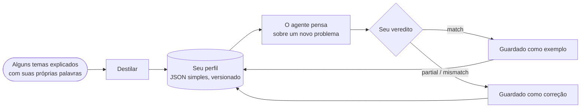

# Perfis de pensador: raciocinar como uma pessoa específica

::: tip O SDK consegue raciocinar como eu?
**Sim: ele consegue imitar o modo como uma pessoa específica raciocina.** Um agente cognitivo pode seguir a *sua* ordem de atenção, pesar as *suas* prioridades, aplicar os *seus* reflexos e rejeitar o que *você* rejeitaria. Ele aprende isso a partir de alguns problemas que você explica com suas próprias palavras; cada vez que você diz onde ele errou, a correção é acrescentada às instruções dele, e a sua concordância mostra se ele está chegando mais perto.

Ele imita um **modo de raciocinar**, não uma pessoa: ele não sabe o que você não escreveu e não decide no seu lugar. O SDK não afirma o quanto ele chega perto no seu caso: **é você quem mede**, execução após execução, pela porcentagem de concordância que você dá às respostas dele.
:::

{.illustration}

## O que significa "raciocinar como você" {#what-reasoning-like-you-means}

| Ele imita | Ele não imita |
| --- | --- |
| A **ordem** em que você olha para um problema (primeiro o que ele realmente possibilita, depois os seus limites…) | O seu **conhecimento**: o que você sabe mas nunca escreveu, a menos que você o forneça como contexto ou como observações |
| As suas **prioridades** (o que mais importa para você, em ordem) | As suas **lembranças** e a sua vida: ele só conhece as amostras, as correções e o contexto que você lhe deu |
| Os seus **reflexos** ("quando um serviço é pago, procuro primeiro uma alternativa gratuita") | As intuições que você nunca colocou em palavras |
| O que faz você **rejeitar** uma ideia | A sua **responsabilidade**: a resposta dele é uma previsão do que você pensaria, não uma decisão tomada por você |
| O seu **apetite por risco** | A sua certeza sobre o mundo: as afirmações continuam precisando de evidências, como em qualquer agente cognitivo |
| Os **erros que você corrigiu**: ele é orientado a não repeti-los | |

## Como funciona, passo a passo {#how-it-works-step-by-step}



### Passo 1: explique alguns temas com suas próprias palavras {#step-1-explain-a-few-topics-in-your-own-words}

Uma **amostra** é um tema sobre o qual você raciocinou, escrito do jeito que veio à sua cabeça. Pode ser bagunçado. Ela tem três partes:

| Campo | O que escrever | Exemplo |
| --- | --- | --- |
| `topic` | O assunto, em poucas palavras | "Um robô que só arruma cozinhas" |
| `reasoning` | Como você o abordou: o que olhou primeiro, o que verificou, o que o fez hesitar, por quê | "O que ele realmente faz? Só um cômodo, então o limite é a generalização. Ele conseguiria aprender outro cômodo com alguns exemplos?…" |
| `conclusion` | O que você concluiu ou faria (opcional, mas se torna um exemplo de calibração) | "Construir um pequeno ciclo adaptativo e testá-lo em um segundo cômodo" |

Cinco a dez amostras sobre temas **variados** funcionam melhor do que muitas amostras sobre um único tema: o destilador procura o que se repete **de um tema para outro**, e um padrão visto uma única vez é fraco.

### Passo 2: destile o seu perfil {#step-2-distill-your-profile}

```ts
const profile = await sdk.distillThinkerProfile({
  id: 'nicolas',
  name: 'Nicolas',
  model: 'gpt-4o',
  samples: [
    {
      topic: 'Typed decision APIs like Jev',
      reasoning:
        'What does it really allow? Then the limits: closed, US-only, paid. Is there an open clone? ' +
        'Could it become the controller of my agents? I would benchmark it on my own traces first.',
      conclusion: 'Use an open clone as the controller and benchmark it against Jev',
    },
    { topic: 'World models', reasoning: 'Structure beats scale. Test on a small chaotic system before anything big.' },
  ],
});
```

O que acontece, exatamente:

1. As amostras são verificadas: cada uma precisa de um tema e de um raciocínio.
2. Uma chamada ao modelo de linguagem faz o papel de um *analista cognitivo*. Ela procura as **operações recorrentes** do seu raciocínio, não as suas opiniões: o que você examina primeiro, as perguntas que faz, até onde leva uma ideia, o que o faz rejeitar uma solução, a sua relação com o risco, o custo e a novidade. Ela é orientada a manter apenas os padrões sustentados pelas amostras, e a preferir os que aparecem em várias amostras.
3. A resposta é validada em relação ao schema do perfil. Uma resposta inválida é devolvida uma vez com o erro; uma segunda falha lança um `ThoughtGenerationError` em vez de devolver um perfil feito pela metade.
4. As amostras que têm uma conclusão são mantidas dentro do perfil como **exemplos**, de modo que o perfil carrega tanto o método extraído quanto as evidências de onde ele veio.

O resultado é JSON simples. **Leia-o**: se uma etapa ou uma prioridade estiver errada ou faltando, corrija à mão. Você se conhece melhor do que uma única extração.

### Passo 3: deixe o agente pensar como você {#step-3-let-the-agent-think-as-you}

```ts
const twin = sdk.createCognitiveAgent({
  name: 'my-twin',
  model: 'gpt-4o',
  profile,
  systemPrompt: "Write every statement and the answer in French, in the thinker's own voice.", // optional
});

const run = await twin.think({
  problem: 'A bank offers you a stable, well-paid CTO job maintaining legacy systems. What do you decide?',
});
console.log(run.decision?.status, run.decision?.answer);
```

O perfil é **copiado quando a execução começa**, então uma correção dada durante uma execução vale para a próxima. Ele é escrito nas instruções de cada etapa do raciocínio, e a etapa final `decide` é solicitada a dar *a resposta que o pensador daria*, com uma justificativa que segue a ordem de atenção do pensador. [Onde o perfil pesa](#where-the-profile-weighs-and-where-it-never-does) lista cada lugar.

### Passo 4: diga a ele onde errou {#step-4-tell-it-where-it-went-wrong}

Depois de uma execução, dê o seu **veredito**: ele raciocinou do jeito que você teria raciocinado?

```ts
// "Yes, exactly what I would have thought."
await twin.learnFromFeedback(run.runId, { verdict: 'match' });

// "No, I would have gone another way."
await twin.learnFromFeedback(run.runId, {
  verdict: 'mismatch',
  expected: 'Prototype with the free clone first, then compare with Jev on 100 real tickets',
  lesson: 'Always test the free option on real data before paying',
});

// "You are 50% right, and here is where you went wrong."
await twin.learnFromFeedback(run.runId, {
  verdict: 'partial',
  agreement: 0.5,
  wrongAbout: ['ignored the free option', 'overestimated the integration cost'],
  expected: 'Benchmark the open clone on our own tickets before deciding',
});
```

| Campo | Significado | Obrigatório |
| --- | --- | --- |
| `verdict` | `match` (raciocinou como você), `partial` (em parte), `mismatch` (de jeito nenhum) | Sempre |
| `agreement` | O quanto você concorda, de 0 a 1: `0.8` significa "80% certo" | Não |
| `expected` | O que você teria concluído no lugar | Em `partial` e `mismatch` |
| `wrongAbout` | Onde o raciocínio errou, com as suas palavras | Não |
| `lesson` | A regra a lembrar da próxima vez (por padrão, `expected`) | Não |
| `notes` | Qualquer outra coisa, guardada no evento | Não |

O que acontece com ele:

| Veredito | Efeito no perfil |
| --- | --- |
| `match` | A execução se torna um **exemplo** de calibração: a sua pergunta, um resumo das suas etapas de raciocínio e a sua conclusão. Cada `match` mantém os 10 exemplos mais recentes, incluindo as amostras destiladas. |
| `partial` / `mismatch` | Uma **correção** é registrada: o que o agente concluiu, o que você esperava, a sua concordância, onde ele errou e a lição. As 20 mais recentes são mantidas. As correções aparecem no fim do perfil, nas instruções de cada etapa do raciocínio, como prioridade máxima: "não repita estes erros". O controlador Jev vê as últimas cinco lições. |

Cada veredito incrementa a versão de patch do perfil (`1.0.0` → `1.0.1`) e é acrescentado à execução como um evento `cognition.feedback`, com a versão do perfil antes e depois. Uma execução sem decisão não pode receber feedback: não há nada a julgar.

`learnFromFeedback` devolve o perfil refinado e o mantém no agente. **Salve-o** (`twin.getProfile()` é JSON simples), ou as lições se perdem quando o seu processo termina.

### Passo 5: meça o quanto ele chega perto {#step-5-measure-how-close-it-gets}

O SDK registra os seus vereditos; ele não se avalia sozinho. Para saber se ele realmente raciocina como você, siga um protocolo simples:

1. Prepare **problemas novos** que o agente nunca viu, sobre temas variados.
2. **Escreva a sua própria resposta primeiro**, antes de ler a do agente, para que a resposta dele não influencie a sua.
3. Execute o agente e, depois, avalie cada resposta: `agreement`, onde ele errou (`wrongAbout`), o que você esperava (`expected`).
4. Dê esse feedback e salve o perfil refinado.
5. Na rodada seguinte, use **outros problemas novos** e compare a concordância média com a da rodada anterior.

Se a média sobe em problemas que ele nunca viu, é sinal de que ele está captando o seu *modo* de raciocinar, e não só as respostas que você corrigiu; com poucos problemas, uma alta também pode ser acaso, então continue por várias rodadas. Se ele só melhora nos problemas que você corrigiu, ele está copiando respostas.

```ts
const scores = [0.4, 0.6, 0.5]; // the agreement you gave this round
const average = scores.reduce((sum, value) => sum + value, 0) / scores.length; // 0.5, that is 50%
```

## Anatomia de um perfil {#anatomy-of-a-profile}

Você também pode escrever um perfil à mão:

```ts
import { defineThinkerProfile } from '@sdk-ai-agents/core';

const builder = defineThinkerProfile({
  id: 'builder',
  name: 'Pragmatic builder',
  summary: 'Looks for what a technology really enables, then its limits, then a prototype.',
  reasoningSequence: [
    { id: 'real-capability', instruction: 'Establish what the technology really enables' },
    { id: 'limits', instruction: 'Look for its limits immediately' },
    { id: 'workaround', instruction: 'Imagine how to work around those limits' },
    { id: 'product', instruction: 'Check whether it can become a product' },
    { id: 'automation', instruction: 'Ask how the product could run itself' },
    { id: 'generalize', instruction: 'Extrapolate towards a more general architecture' },
    { id: 'prototype', instruction: 'Design the smallest prototype that tests it' },
  ],
  priorities: ['Real capability over hype', 'Free and open options first', 'Fast feedback'],
  heuristics: [{ when: 'a service is paid and closed', action: 'look for an open alternative before paying' }],
  rejectionCriteria: ['Cannot be tested with a prototype', 'Locks data in a vendor'],
  riskAppetite: 'high',
});

const agent = sdk.createCognitiveAgent({ name: 'me', model: 'gpt-4o', profile: builder });
```

`defineThinkerProfile` valida o perfil e preenche o que falta com valores padrão (listas vazias, `riskAppetite: 'medium'`, `version: '1.0.0'`).

| Campo | Em palavras simples | Como o motor o usa |
| --- | --- | --- |
| `id`, `name`, `version` | Quem este perfil descreve, e qual revisão dele | Registrado em cada execução, para que você saiba qual versão do perfil a produziu |
| `summary` | Uma frase que descreve o estilo | Escrito no topo do perfil nos prompts |
| `reasoningSequence` | As etapas pelas quais você passa, em ordem | Escrito como "Ordem de atenção (siga-a)"; a resposta final a segue |
| `priorities` | O que mais importa, do mais importante para o menos | Escrito nos prompts; usado para julgar o quanto uma escolha convém a você |
| `heuristics` | Os seus reflexos: "quando …, então …" | Escritos como regras nos prompts |
| `rejectionCriteria` | O que faz você abandonar uma ideia | Usados para criticar as opções e rejeitar as que você rejeitaria |
| `riskAppetite` | `low`, `medium` ou `high` | Escrito nos prompts |
| `examples` | Execuções e amostras que você validou | Mostrados como "exemplos validados do seu raciocínio": o modelo se calibra com eles |
| `corrections` | Lições de execuções com as quais você não concordou | Mostradas no fim do perfil, como prioridade máxima |

Sem um perfil, os agentes usam `DEFAULT_THINKER_PROFILE`, um analista neutro que põe as evidências em primeiro lugar.

## Onde o perfil pesa, e onde ele nunca pesa {#where-the-profile-weighs-and-where-it-never-does}

| Momento do raciocínio | O seu perfil conta? |
| --- | --- |
| **Cada etapa do raciocínio** (representar, formular hipóteses, simular, criticar, comparar, decidir, ler um resultado de ferramenta) | Sim: o perfil inteiro está nas instruções que o modelo de linguagem recebe. Só a curta requisição que escolhe qual ferramenta chamar o deixa de fora |
| **Escolher a próxima etapa** | Com o controlador Jev, sim: ele vê a sua ordem de atenção, prioridades, critérios de rejeição, apetite por risco e as suas últimas cinco lições. Sem o Jev, o controlador heurístico segue uma ordem fixa, e o seu perfil molda, em vez disso, o conteúdo de cada etapa |
| **Crítica** | Sim: as opções são atacadas com os seus critérios de rejeição |
| **O quanto uma escolha convém a você** (`preferenceFit`) | Sim: esse é o objetivo dela. Uma escolha julgada como atendendo a um dos seus critérios de rejeição fica mais abaixo na classificação, e é rejeitada quando o juiz tem certeza disso (o Jev coloca toda a probabilidade nesse nível) ou, com um juiz que é um modelo de linguagem, quando o modelo a rejeita |
| **O quanto as evidências sustentam uma opção** (`support`) | **Não.** Com o Jev, essa pergunta é enviada sem o seu perfil; com um modelo de linguagem, o modelo é instruído a ignorar as preferências |
| **Qual escolha de ação fica em primeiro na classificação** | Sim, para escolhas de ação, com um peso de 40% por padrão |
| **Se uma escolha de ação pode ser firmada** | Sim, quando você claramente a prefere e os fatos não falam contra ela |
| **Se uma afirmação sobre o mundo é crível** | **Nunca** no código: as duas notas nunca são misturadas. Com um juiz que é um modelo de linguagem, a separação depende das instruções dele, e uma afirmação que o modelo rotula por engano como escolha poderia seguir o caminho da preferência (veja [Tipos declarados](./evidence-and-verification#not-there-yet)) |

### As duas notas {#the-two-scores}

Quando as opções são comparadas, cada uma recebe até duas notas entre 0 e 1:

| Nota | Pergunta | 0 | 0,25 | 0,5 | 0,75 | 1 |
| --- | --- | --- | --- | --- | --- | --- |
| `support` | O quanto os fatos, as observações, os testes e as críticas a sustentam? | Refutada | Fracamente sustentada | Plausível | Fortemente sustentada | Estabelecida |
| `preferenceFit` | O quanto esta escolha convém ao pensador? (apenas escolhas de ação) | Atende a um critério de rejeição | Pouco adequada | Adequação aceitável | Boa adequação | Adequação ideal |

Esses são os níveis sobre os quais o avaliador de hipóteses do Jev pergunta; um juiz que é um modelo de linguagem dá um número entre 0 e 1 para cada um, lido da mesma forma. Os dois são julgamentos, não probabilidades medidas.

### Como uma escolha é classificada e firmada {#how-a-choice-is-ranked-and-committed}

Pegue o problema do emprego no banco, acima, com duas opções:

| Opção | `support` | `preferenceFit` | Nota de classificação: 60% suporte + 40% adequação |
| --- | --- | --- | --- |
| H1: aceitar o emprego | 0,5 (plausível) | 0,25 (pouco adequada: nada de novo para construir) | 0,6 × 0,5 + 0,4 × 0,25 = **0,40** |
| H2: recusar e continuar construindo | 0,5 (plausível) | 1 (adequação ideal) | 0,6 × 0,5 + 0,4 × 1 = **0,70** |

Os fatos sustentam as duas opções igualmente; as suas preferências colocam H2 em primeiro lugar. O peso é `limits.preferenceWeight` (0,4).

Para ser **firmada** (uma resposta firme, e não uma resposta provisória ou uma abstenção), uma opção precisa passar pela [salvaguarda de conclusão](./evidence-and-verification#the-conclusion-guard). As evidências dela bastam de uma de duas formas:

- **apenas pelas evidências**, para qualquer tipo de hipótese: `support` de pelo menos `limits.decisionThreshold` (0,75, "fortemente sustentada");
- **pela sua escolha**, apenas para uma escolha de ação: `preferenceFit` de pelo menos `limits.decisionThreshold` (0,75, "boa adequação") **e** `support` de pelo menos `limits.minProposalSupport` (0,35, um pouco acima de "fracamente sustentada").

H2 segue a segunda forma: suporte 0,5 ≥ 0,35, adequação 1 ≥ 0,75. Ela é firmada com uma **confiança de 0,5**, porque a confiança de uma decisão nunca ultrapassa o seu suporte de evidências: a resposta diz "esta é a escolha do pensador", não "isto está provado".

Por que a segunda forma existe: uma pergunta como *"você aceitaria este emprego?"* tem poucas evidências a pesar. Uma pessoa decide isso com as suas prioridades, desde que os fatos não falem contra a escolha. Em uma execução real com um perfil de pensador, perguntas assim terminavam sem resposta firmada antes de essa segunda forma existir.

Por que ela é fechada às afirmações: uma afirmação como *"a IA desta start-up detecta mentiras com 99% de precisão"* é uma **regra** sobre o mundo. Mesmo que você adorasse que ela fosse verdade, ela só é firmada se o seu suporte de evidências chegar a 0,75, desde que o modelo a rotule como regra, o que ele é orientado a fazer (veja [Tipos declarados](./evidence-and-verification#not-there-yet)). As preferências podem escolher o que fazer; elas nunca tornam algo verdadeiro.

## Limites {#limits}

- **O modelo importa.** O perfil é um conjunto de instruções: um modelo pequeno as segue com menos fidelidade do que um grande.
- **Ele só sabe o que você lhe deu.** Forneça os fatos da sua situação como `context` ou `observations` quando eles importarem.
- **Um primeiro perfil é um esboço.** Um punhado de amostras dá um punhado de padrões; são as correções que o refinam.
- **A memória dele é limitada.** São mantidas 20 correções, e cada `match` mantém os 10 exemplos mais recentes (um perfil destilado pode começar com mais); os mais antigos são descartados.
- **Fidelidade não é verdade.** O seu feedback mede se o agente raciocinou **como você**, não se ele estava **certo**. Para verificar uma afirmação em relação ao mundo, dê ao agente um [avaliador de resultados](./evidence-and-verification#predictions-and-the-outcome-evaluator).
- **São dados pessoais.** As amostras, os perfis e os eventos dessas execuções descrevem como uma pessoa pensa. Armazene-os de forma privada, nunca em um repositório público, e peça consentimento antes de criar o perfil de outra pessoa.

## Perfis são dados {#profiles-are-data}

Os perfis são JSON simples: persista-os onde quiser e recarregue-os com `agent.setProfile(profile)` ou com a opção `profile`. Os eventos trazem `profileId` e `profileVersion`, então você sempre sabe qual versão do perfil produziu uma execução.

## Treine o seu próprio controlador {#train-your-own-controller}

Cada escolha de operação é registrada com o estado que o controlador viu. Exporte-as como JSON Lines:

```ts
const jsonl = await sdk.exportControllerDataset(); // or pass runIds
```

```json
{"runId":"run_…","step":3,"state":{…},"available":["hypothesize","simulate","critique","decide"],"operation":"simulate","controller":"jev","confidence":0.82,"usedFallback":false,"runStatus":"completed","feedback":"partial","agreement":0.5}
```

Filtre por `feedback: "match"` e você terá exemplos supervisionados do *seu* modo de escolher o próximo movimento: o suficiente para fazer o fine-tuning de um pequeno modelo aberto e conectá-lo como um `CognitiveController` personalizado, sem custo por chamada.
