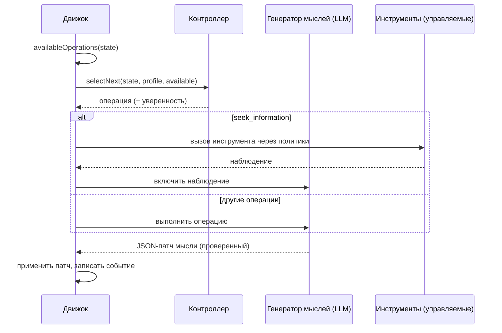

# Когнитивные агенты

Когнитивный агент не отвечает за один проход. Он ведёт **явное ментальное состояние** и улучшает его по одной **когнитивной операции** за раз, пока не сможет зафиксировать решение, которое способен обосновать.

::: tip Простыми словами
Обычный ИИ отвечает за один раз, и его рассуждение исчезает. Когнитивный агент работает как человек с блокнотом: он записывает, что знает, что допускает и чего пока не знает, перечисляет несколько вариантов, представляет их последствия, ищет, что может пойти не так, проверяет факты с помощью разрешённых вами инструментов, сравнивает варианты и только затем решает. Каждый из этих ходов — одна **операция**, и каждая записывается в блокнот, поэтому потом вы можете перечитать всё рассуждение. Если агент не может прийти к надёжному выводу, он так и говорит. Каждый термин этой страницы объяснён на странице [Ключевые термины простыми словами](./glossary#how-a-cognitive-agent-reasons).
:::

{.illustration style="max-width:460px"}

```ts
const agent = sdk.createCognitiveAgent({
  name: 'analyst',
  model: 'gpt-4o',
  tools: [lookupMetric],
  profile: myProfile, // optional, see Thinker profiles
});

const { status, answer, decision, state, runId } = await agent.think({
  problem: 'Should we build or buy our analytics module?',
  context: { budget: '10k EUR', deadline: 'before Q4' },
  observations: [{ content: 'Churn was 4% last month', originGroup: 'billing' }], // optional
});

decision?.status; // 'committed' | 'provisional' | 'abstain'
```

::: tip Сначала доказательства
Как прослеживаются наблюдения, проверяются предсказания и охраняются выводы, описано на странице [Доказательства и проверка](./evidence-and-verification).
:::

## Ментальное состояние {#the-mental-state}

Ментальное состояние — это простые типизированные данные. Каждый элемент получает стабильный идентификатор, на который может ссылаться модель.

| Часть | Идентификаторы | Что содержит |
| --- | --- | --- |
| `observations` | `O1…` | Что наблюдалось — передано вместе с задачей, возвращено инструментом или тестом — с указанием происхождения |
| `facts` | `F1…` | Утверждения с источником (`input`, `tool`, `inference`), наблюдениями, из которых они взяты, и статусом (`active`, `superseded`, `retracted`) |
| `assumptions` | `A1…` | Что рассуждение принимает как данность |
| `constraints` | `K1…` | Что должен соблюдать любой ответ |
| `unknowns` | `U1…` | Открытые вопросы — `open`, `resolved` или `dropped`, со счётчиком попыток |
| `hypotheses` | `H1…` | Предложения, правила или объяснения с посылками, симуляциями, критикой, поддержкой доказательствами `support`, оценкой `preferenceFit` и статусом |
| `comparisons` | `R1…` | Связи между наблюдениями: сходство, различие, изменение, несовместимость, контрпример |
| `predictions` | `P1…` | Что предсказывает гипотеза, что её опровергло бы и результат теста |
| `contradictions` | `C1…` | Конфликты между элементами, с категорией, — пока не разрешены со ссылкой на доказательства |
| `failures` | `X1…` | Что уже не удалось, чтобы не повторять это вслепую |
| `knowledge` | `M1…` | Что предыдущие запуски той же области установили с помощью реальных тестов, вспоминаемое при старте запуска (см. [Память между запусками](./memory)) |
| `confidence`, `evidenceRevision` | | Поддержка лучшего ответа доказательствами; счётчик, из-за которого более ранние оценки становятся устаревшими |
| `decision`, `trail` | | Итоговое решение и его статус, по одной строке на шаг |

{.illustration style="max-width:760px"}

Состояние **никогда не редактируется на месте**. Каждая операция создаёт *патч мысли*; патч записывается как событие `cognition.thought`; состояние — это свёртка всех патчей. Поэтому `sdk.getMentalState(runId)` может точно восстановить любой запуск, даже месяцы спустя.

## Операции {#the-operations}

| Операция | Что делает | Доступна, когда |
| --- | --- | --- |
| `represent` | Извлекает факты, допущения, ограничения и неизвестные | Всегда первой; снова, когда есть открытое противоречие |
| `compare_observations` | Связывает наблюдения: сходства, различия, изменения, контрпримеры | Есть два сопоставимых наблюдения или больше (без дубликатов и результатов тестов), и с последнего сравнения появились новые |
| `hypothesize` | Выдвигает новые предложения, правила или объяснения | Активных гипотез меньше, чем `maxHypotheses` |
| `simulate` | Шаг за шагом прогнозирует последствия и формулирует проверяемые предсказания | У гипотезы нет симуляции |
| `test_prediction` | Запускает ваш оценщик результатов на записанном предсказании — без вызова LLM | Оценщик настроен, есть ожидающее предсказание, бюджет тестов не исчерпан |
| `revise` | Превращает гипотезу, которой противоречат доказательства, в вариант с суженной областью | У опровергнутой или противоречащей доказательствам гипотезы ещё нет варианта |
| `critique` | Находит самые серьёзные причины, по которым гипотеза может не сработать | У гипотезы нет критики |
| `seek_information` | Вызывает управляемый инструмент, чтобы ответить на открытое неизвестное | Инструменты есть, есть открытое неизвестное, бюджет инструментов не исчерпан |
| `compare` | Оценивает поддержку доказательствами и то, насколько предложения подходят мыслителю | С последнего сравнения изменилась гипотеза, прошедшая критику, или изменились доказательства |
| `decide` | Фиксирует ответ, обоснование, уверенность и следующие действия | Гипотеза проходит [страж вывода](./evidence-and-verification#the-conclusion-guard) |

**Код решает, что возможно, контроллер решает, что полезно.** Предусловия вычисляются из состояния, и контроллер может выбирать только среди доступных операций.

Правила, соблюдение которых обеспечивает код, что бы ни говорила модель:

- критика уровня `fatal` без опровержения или опровергнутое предсказание отвергают свою гипотезу;
- отвергнутую гипотезу нельзя возродить, переформулировать или выбрать — только пересмотреть в вариант, в котором сказано, что изменилось;
- код никогда не примешивает предпочтения к поддержке утверждения доказательствами, а модель не может задать уверенность состояния;
- противоречие разрешается один раз и только со ссылкой на наблюдения или факты, которые его разрешают;
- шаг, который не изменил ничего из того, что должен был изменить, или отложенное решение считаются неудачной попыткой; после двух таких подряд операция больше не предлагается, пока другой шаг не принесёт новых доказательств (см. [Бюджет, который не тратится впустую](./evidence-and-verification#a-budget-that-is-not-wasted));
- происхождение (наблюдения, результаты тестов) и статус решения записывает движок: из ответа модели, который их содержит, они удаляются;
- ссылки на неизвестные идентификаторы игнорируются и отмечаются как `issues` в событии мысли;
- в игре одновременно не более `maxHypotheses` гипотез: лишние предложения отбрасываются с отметкой об этом;
- неизвестное перестаёт исследоваться после двух неудачных попыток или сразу, если ни один доступный инструмент не может на него ответить, а переосмысление (`represent` при противоречии) предлагается не более трёх раз;
- неудавшаяся операция записывается как неудавшаяся и не считается выполненной;
- **последний шаг — всегда попытка решения**: ответ, не прошедший страж вывода, становится `provisional` (с тем, чего не хватает) или `abstain`; если модель вообще не может выдать решение, движок воздерживается и записывает причину.

## Контроллеры {#controllers}

Контроллер выбирает следующую операцию.



| Контроллер | Как выбирает | Когда использовать |
| --- | --- | --- |
| `heuristic` | Фиксированный порядок внимания: представить → пересмотреть → сравнить наблюдения → выдвинуть гипотезы → смоделировать → проверить предсказания → покритиковать → найти информацию → сравнить → решить | По умолчанию без Jev; детерминирован, бесплатен |
| `typed` | Один запрос к Jev на шаг: Choice среди доступных операций и Noul «готов решать?» | Адаптивное рассуждение с откалиброванной уверенностью |
| ваш собственный | Реализуйте `CognitiveController.selectNext()` | Дообученная локальная модель, бизнес-правила, … |

С `controller: 'auto'` (значение по умолчанию) агент использует Jev, если у SDK есть бэкенд типизированных решений, и эвристику в остальных случаях. Типизированный контроллер **переходит на эвристику**, если уверенность Choice ниже `minConfidence` (0,35), если клиент даёт сбой или если ответ не является доступной операцией. Пользовательский контроллер, который выбрасывает исключение или возвращает недоступную операцию, тоже заменяется эвристикой. Каждый такой переход записывается в поле `fallbackFrom` события выбора.

```ts
sdk.createCognitiveAgent({
  name: 'analyst',
  model: 'gpt-4o',
  controller: 'typed',
  controllerOptions: { minConfidence: 0.5, readinessThreshold: 0.85 },
  assessment: 'typed', // compare hypotheses with Jev Score questions
});
```

## Инструменты внутри рассуждения {#tools-inside-reasoning}

`seek_information` использует **встроенные движки рассуждения и действий**: LLM выбирает один инструмент для открытого неизвестного, движок действий проверяет, что инструмент был **дан этому агенту**, сверяет вызов с политиками, одобрениями и бюджетами, а результат записывается как **наблюдение**, указывающее на своё событие `action.executed`, и затем включается в состояние как факты с `source: "tool"`. Наблюдение сохраняется, даже если его интерпретация не удалась. Отклонённый, заблокированный или сбойный инструмент становится записанной неудачей, и рассуждение продолжается.

## Лимиты {#limits}

```ts
sdk.createCognitiveAgent({
  name: 'analyst',
  model: 'gpt-4o',
  limits: {
    maxSteps: 12,              // the last one always decides
    timeoutMs: 180_000,
    maxHypotheses: 3,          // in play at the same time
    maxToolCalls: 5,
    decisionThreshold: 0.75,   // evidence support a committed answer needs (see minProposalSupport)
    maxConsecutiveFailures: 3, // then the run fails (and alerts you, if incidents are on)
    maxPredictionTests: 4,     // calls to the outcome evaluator per run
    preferenceWeight: 0.4,     // weight of the thinker's preferences when ranking proposals
    minProposalSupport: 0.35,  // evidence support enough for a choice of action the thinker clearly prefers
  },
  evaluator: myBench,          // optional OutcomeEvaluator, enables test_prediction
  knowledge: { store, scope: 'my-domain' }, // optional memory across runs
});
```

Лимиты проверяются при создании агента: `maxSteps: 0` или тайм-аут, превышающий то, что поддерживает таймер, выбрасывают `ValidationError`, а не отключают защиту молча. `minProposalSupport` не может превышать `decisionThreshold`; сделайте его равным `decisionThreshold`, чтобы зафиксировать ответ могли только доказательства. Если вы понижаете `decisionThreshold`, не задавая `minProposalSupport`, нижняя граница опускается вместе с ним.

## Некорректный вывод модели {#invalid-model-output}

У каждой операции есть строгий JSON-контракт, проверяемый Zod. Ответ, который не является корректным JSON, не содержит обязательного поля или использует неверное значение, отправляется обратно **один раз** вместе с ошибкой валидации. Поля, которые операция не может записывать (например, `decision` во время `simulate`), игнорируются и перечисляются в `ignoredFields`. Если исправление тоже не удаётся, операция записывается как неудача, и цикл продолжается.

## Остановка, отмена, тайм-аут {#stop-cancel-time-out}

```ts
const pending = agent.think({ problem });
await agent.stop();          // or agent.stop(runId)
const result = await pending; // status: 'cancelled'
```

Тайм-аут даёт `status: 'failed'` с `Timeout exceeded (… ms)`, и запуск помечается как неудавшийся в журнале событий. `sdk.stopRun(runId)` останавливает и когнитивные запуски. Тайм-аут и остановка проверяются между операциями и передаются вашему провайдеру как сигнал прерывания; встроенные провайдеры OpenAI и Anthropic не отменяют уже отправленный запрос, поэтому медленный вызов завершается по собственному тайм-ауту поставщика.

Профиль **фиксируется снимком при старте запуска**: обратная связь, данная во время выполнения запуска, применяется к следующему запуску.

## Безопасность {#security}

Когнитивный агент читает текст, который написал не он: результаты инструментов, описания инструментов MCP, документы в контексте. Относитесь ко всему этому как к **недоверенным входным данным** — там могут быть инструкции, нацеленные на модель (prompt injection, внедрение промпта). SDK ограничивает, чего может добиться такой текст:

- агент может вызывать только те инструменты, которые ему дали, и политики проверяются при каждом вызове — ставьте разрушительные инструменты под политики `require_approval`;
- модель сама никогда ничего не выполняет: она предлагает, движок действий проверяет;
- инварианты ментального состояния обеспечиваются кодом, а не промптом;
- каждый вызов инструмента и каждая мысль попадают в журнал событий для проверки.

Журнал событий хранит цель, контекст и каждую мысль, а события `decision.evaluated` хранят контекст, отправленный в Jev. Применяйте к выбранному хранилищу событий те правила хранения и маскирования, которых требуют ваши данные.

## Воспроизведение и аудит {#replay-and-audit}

Когнитивный запуск — это обычный запуск:

- `sdk.getTrace(runId)` показывает события `cognition.*` рядом с `policy.checked`, `tool.called`, …
- `sdk.replay(runId)` повторно выполняет его вызовы инструментов без вызова LLM и воспроизводит итоговый ответ — с тем же ограничением инструментов, что и исходный запуск, поэтому инструмент, в котором агенту было отказано, снова будет отклонён;
- `sdk.getMentalState(runId)` восстанавливает состояние;
- `sdk.exportControllerDataset()` превращает запуски в обучающие данные (см. [Профили мыслителя](./thinker-profiles#train-your-own-controller)).
