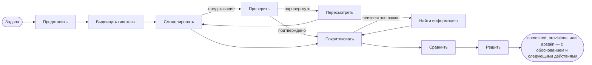

# Введение

**SDK AI Agents** — это SDK на TypeScript для создания ИИ-агентов, которым можно доверять в продакшене: агентов, которые явно рассуждают, прежде чем действовать, которых можно научить тому, как думаете *вы*, и каждый шаг которых проходит через управление, записывается в трассу, оценивается в деньгах и может быть воспроизведён.

{.illustration style="max-width:460px"}

## Зачем ещё один SDK для агентов? {#why-another-agent-sdk}

API LLM дают вам очень способный генератор текста. Чего они не дают, так это контроля над тем, **как** получен вывод:

- рассуждение происходит внутри модели, за один проход, и исчезает, как только ответ выведен;
- ничто не мешает модели действовать на основе догадки, вызвать не тот инструмент или потратить слишком много;
- когда что-то идёт не так, у вас есть промпт и ответ — но не история того, что произошло.

Этот SDK добавляет **вокруг** модели слой рассуждения. LLM становится одним компонентом среди прочих:

| Слой | Что делает | Где находится |
| --- | --- | --- |
| **Ментальное состояние** | Факты, допущения, ограничения, неизвестные, гипотезы, противоречия, уверенность | Восстанавливается из событий в любой момент |
| **Контроллер** | Выбирает следующую когнитивную операцию | Детерминированная эвристика, типизированные решения Jev или ваш собственный |
| **Генератор мыслей** | Выполняет одну операцию и возвращает проверенный JSON-патч | Любой провайдер LLM |
| **Профиль мыслителя** | Порядок внимания, приоритеты и эвристики человека | Версионируемые данные, уточняемые по обратной связи |
| **Управление** | Политики, списки разрешённых инструментов, бюджеты, одобрения, повторные попытки | Проверяется перед каждым действием |
| **Хранилище событий** | Единственный источник истины | Файл, SQLite или PostgreSQL |

## Два вида агентов {#two-kinds-of-agents}

**Управляемые агенты** (`sdk.createAgent`) выполняют классический цикл вызова инструментов: LLM предлагает намерение, движок действий проверяет и исполняет его. Они идеально подходят для чётко определённых задач.

**Когнитивные агенты** (`sdk.createCognitiveAgent`) рассуждают явно. Они созданы для решений: выбрать архитектуру, разобрать инцидент, оценить возможность, ответить на вопросы вида «стоит ли нам…?».

Оба вида используют одни и те же инструменты, политики, хранилище событий, воспроизведение, учёт затрат и оповещения об инцидентах.

## Может ли он рассуждать как конкретный человек? {#can-it-reason-like-a-given-person}

**Да.** Когнитивный агент может подражать тому, как рассуждает конкретный человек. Вы объясняете несколько тем своими словами; SDK извлекает из них **профиль мыслителя**: порядок, в котором вы смотрите на задачу, ваши приоритеты, ваши рефлексы, то, что заставляет вас отвергнуть идею, ваше отношение к риску. Этот профиль включается в инструкции каждого шага рассуждения. После каждого запуска вы говорите, насколько вы согласны (например, «на 60% верно, вот где ты ошибся»), и урок сохраняется для следующих запусков.

Он подражает **способу рассуждать**: он не знает того, чего вы никогда не записывали, не решает за вас, и ваши предпочтения никогда не делают утверждение о мире более правдоподобным. SDK не оценивает сам себя: насколько близко он подходит, показывает процент согласия, который вы ставите от запуска к запуску на задачах, которых он раньше не видел. Каждый шаг объясняется на странице [Рассуждать как конкретный человек](./thinker-profiles).

## Что вы получаете {#what-you-get}

- **Явное рассуждение** — десять операций над ментальным состоянием с инвариантами, соблюдение которых обеспечивает код (отвергнутую гипотезу нельзя выбрать, фатальная критика отвергает гипотезу, последний шаг всегда приводит к выводу).
- **Доказательства, которые можно проверить** — наблюдения с указанием происхождения, предсказания, которые проверяет ваш собственный оценщик, опровергнутые правила, пересмотренные в варианты с суженной областью, предпочтения, отделённые от доказательств, и страж вывода, который отвечает `committed`, `provisional` или `abstain`; с хранилищем знаний ответы тестов запоминаются для следующих запусков.
- **Рассуждение как у конкретного человека**: выделите профиль мыслителя из тем, объяснённых своими словами, затем поправляйте агента вердиктами `match`, `partial` или `mismatch` и процентом согласия.
- **Типизированные решения** — [TypeSafe Jev](https://docs.typesafe.ai) или любой совместимый бэкенд отвечает на вопросы Noul, Choice и Score откалиброванными вероятностями.
- **Коннекторы MCP** — откройте свои инструменты как сервер MCP, импортируйте любой сервер MCP как управляемые инструменты.
- **Встроенная эксплуатация** — затраты на API по каждому запуску, политики повторных попыток, которые не накладываются друг на друга, оповещения об инцидентах по электронной почте или через вебхук.
- **Встроенный event sourcing** — воспроизведение без LLM, эталонные трассы, обнаружение регрессий, графы рассуждения.

Чем он отличается от других фреймворков? См. [Зачем этот SDK](./why). Эти термины вам незнакомы? Страница [Ключевые термины простыми словами](./glossary) объясняет каждый из них. Готовы? Переходите к разделу [Быстрый старт](./getting-started).
