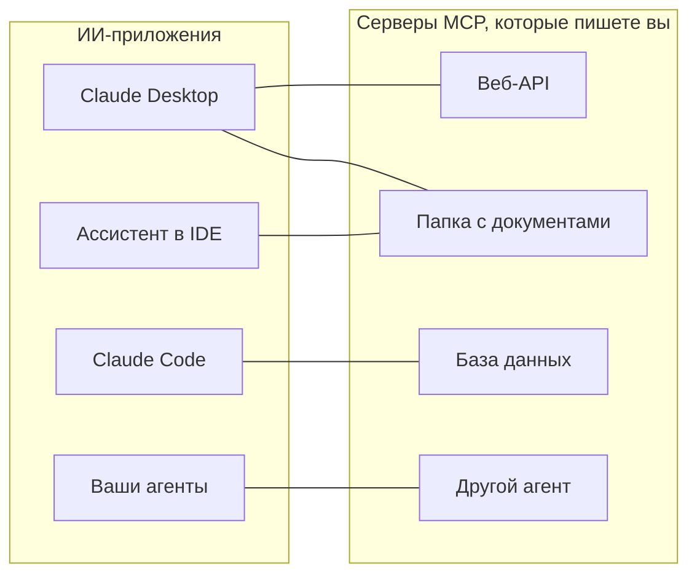
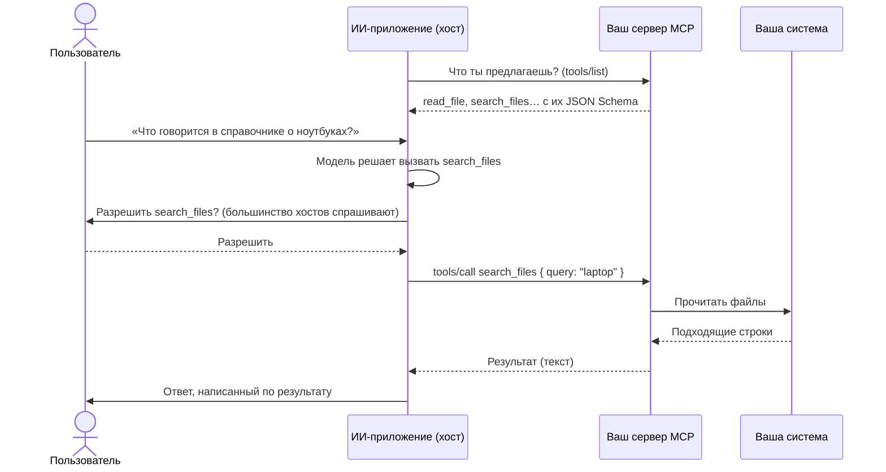
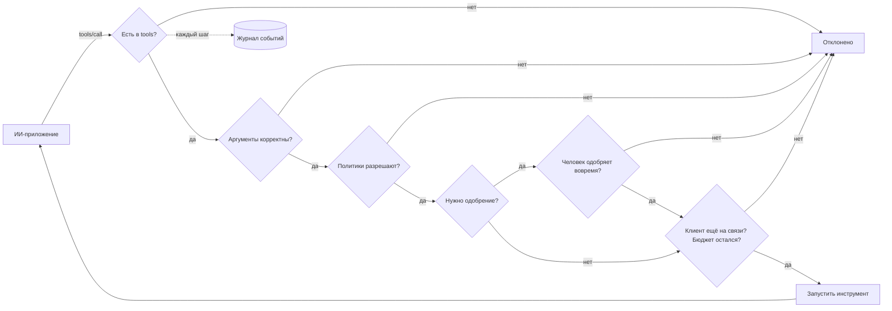

# MCP простыми словами

**MCP позволяет ИИ-приложению — Claude Desktop, Claude Code, ассистенту в IDE, вашему собственному агенту — пользоваться вашими системами: API, папкой с документами, базой данных, другим агентом.** Эта страница объясняет идею и термины. Следующие страницы ведут от нуля до работающего сервера:

1. [Ваш первый сервер MCP за 5 минут](./mcp-first-server) — шаг за шагом, от пустой папки до Claude Desktop.
2. [Сервер MCP для чего угодно](./mcp-recipes) — одна строка для функции, веб-API, папки, базы данных или агента.
3. [Развёртывание, безопасность и диагностика](./mcp-deploy) — развёртывание по HTTP, аутентификация, одобрения и что делать, если что-то не работает.

## Идея: один разъём для всех ИИ-приложений {#the-idea-one-plug-for-every-ai-app}

Представьте MCP (Model Context Protocol) как **USB-C для ИИ-приложений**. До USB у каждого устройства был свой кабель. До MCP каждому ИИ-приложению нужен был собственный связующий код для каждой системы, с которой оно работало: одна интеграция для Claude, другая для вашей IDE, третья для вашего агента.

С MCP вы пишете **одну небольшую программу — сервер MCP — перед своей системой**. Любое приложение, которое говорит на MCP, может затем к ней подключиться, получить список того, что она предлагает, и пользоваться этим. Вы создаёте сервер один раз, и он работает везде.



Протокол — это открытый стандарт, опубликованный на [modelcontextprotocol.io](https://modelcontextprotocol.io). Его начала Anthropic; его поддерживают многие ИИ-приложения.

## Термины по порядку {#the-words-one-by-one}

| Термин | Простыми словами | Пример |
| --- | --- | --- |
| **Хост** (ИИ-приложение) | Приложение, с которым разговаривает пользователь. Оно запускает языковую модель и решает, когда использовать ваш сервер. | Claude Desktop, Claude Code, VS Code |
| **Клиент MCP** | Часть хоста, которая держит соединение с одним сервером. Вы его почти не видите. | По одному на сервер в Claude Desktop |
| **Сервер MCP** | Ваша небольшая программа. Она сообщает, что предлагает, и выполняет работу по запросу. | `serveMcpOverStdio(sdk, { … })` |
| **Инструмент** | Действие, которое модель может решить вызвать, с именованными аргументами. Чтобы решить, модель читает его имя, описание и список аргументов. | `read_file`, `list_pets`, `query` |
| **Ресурс** | Документ, который сервер предлагает для чтения. В отличие от инструмента, его выбирает **пользователь или приложение** (например, кнопкой «прикрепить»), а не модель. | `folder://handbook/onboarding.md` |
| **Промпт** | Готовый шаблон сообщения, предлагаемый сервером. Этот SDK их пока не предоставляет. | — |
| **Транспорт** | Как сообщения передаются между хостом и сервером. | stdio, Streamable HTTP |
| **stdio** | Хост **запускает ваш сервер как программу** на том же компьютере и общается с ним через его стандартный ввод и вывод — как будто печатает в него и читает то, что он выводит. В сети ничего не открывается. | Локальные серверы в Claude Desktop |
| **Streamable HTTP** | Ваш сервер — это **веб-сервис**; хосты отправляют ему HTTP-запросы. Используется, чтобы делиться одним сервером с командой. | `https://mcp.example.com/mcp` |
| **JSON Schema** | Описание аргументов инструмента (имена, типы, какие обязательны), которое читает модель. SDK пишет его за вас. | `{ "type": "object", "properties": { "path": { "type": "string" } } }` |
| **Аннотация** | Подсказка об инструменте, показываемая хостам, например «этот инструмент только читает». Хосты могут использовать её, чтобы решать, когда спрашивать подтверждение у пользователя. | `readOnlyHint: true` |

::: tip Инструменты и ресурсы
**Инструмент** — это то, что модель *делает* («найди в справочнике "laptop"»). **Ресурс** — это то, что пользователь *передаёт* («прикрепи onboarding.md к этому разговору»). Рецепт с папкой предлагает и то, и другое из одной и той же папки.
:::

## Что происходит во время одного вызова {#what-happens-during-one-call}



Две вещи, которые стоит запомнить:

- **Модель видит только то, что перечисляет сервер**: имена, описания, схемы аргументов и получаемые результаты. Пишите понятные описания; никогда не помещайте в них секреты.
- **Что происходит на самом деле, решает сервер.** Модель предлагает вызов; ваш сервер может отказать, ограничить его, спросить человека или записать его в журнал. Именно здесь вступает в дело этот SDK.

## Что добавляет этот SDK {#what-this-sdk-adds}

Серверы MCP можно писать и с одним только официальным MCP SDK. Этот SDK работает поверх него и добавляет то, что нужно, чтобы запустить сервер **безопасно и одной строкой**:

| | Только с официальным MCP SDK | С SDK AI Agents |
| --- | --- | --- |
| Открыть веб-API | Написать по обработчику на каждую конечную точку | `openApiTools({ spec })` — по инструменту на операцию, по умолчанию только для чтения |
| Открыть папку | Самостоятельно написать проверки путей | `folderTools({ root })` — символические ссылки и `..` не могут выйти за пределы папки |
| Открыть базу данных | Самостоятельно написать защиту SQL | `databaseTools({ database })` — один SELECT, только чтение на уровне базы данных (транзакция только для чтения в PostgreSQL, `query_only` в SQLite), с ограничением числа строк |
| Открыть агента | — | `cognitiveAgentTool(agent)` — «что подумал бы Nicolas?» как один инструмент |
| Ничего не открыто случайно | На ваше усмотрение | Только инструменты, перечисленные в `tools` |
| Правила перед каждым вызовом | На ваше усмотрение | [Политики](./governed-agents), бюджеты, списки разрешённых инструментов |
| Сначала «да» говорит человек | На ваше усмотрение | Инструменты с пометкой `requiresApproval` ждут `sdk.approveAction()`; одобрение отменяется, когда клиент отменяет запрос или отключается, а также по истечении `approvalTimeoutMs` (по умолчанию 50 с) |
| Знать, что произошло | На ваше усмотрение | Каждый вызов и каждое чтение ресурса — это запуск в [журнале событий](./observability) |



Именно в таком порядке: вызов с некорректными аргументами отклоняется до того, как кого-либо попросят его одобрить, а вызов засчитывается в бюджет в момент начала, каким бы ни был его исход.

Каждый вызов через MCP записывается как отдельный запуск с идентичностью `mcp:<server name>`: его можно прочитать, узнать его стоимость, настроить по нему оповещения — точно так же, как для запуска агента.

## В обе стороны {#both-directions}

SDK говорит на MCP в обе стороны:

- **Предоставлять**: превращайте свои инструменты, API, папки, базы данных и агентов в серверы MCP — следующие страницы.
- **Использовать**: давайте своим агентам инструменты любого существующего сервера MCP — ниже.

### Используйте инструменты сервера MCP в своих агентах {#use-the-tools-of-an-mcp-server-in-your-agents}

```ts
import { connectMcpServer } from '@sdk-ai-agents/core/mcp';

const crm = await connectMcpServer({
  name: 'crm',
  transport: { type: 'http', url: 'https://mcp.acme.internal/crm', headers: { Authorization: `Bearer ${token}` } },
  toolPrefix: 'crm_',                         // avoid collisions between servers
  include: ['lookup_customer', 'list_invoices'],
  metadata: { riskLevel: 'medium' },          // for every tool; a label no policy reads unless you write one
  retry: { maxRetries: 2 },
});

const tools = crm.tools.map((definition) => sdk.defineTool(definition));
const agent = sdk.createCognitiveAgent({ name: 'account-manager', model: 'gpt-4o', tools });

await agent.think({ problem: 'Should we offer customer c-42 a discount?' });
await crm.close();
```

| `transport.type` | Для чего использовать |
| --- | --- |
| `stdio` | Локальные серверы, запускаемые как процесс (`command`, `args`, `env`, `cwd`) |
| `http` | Удалённые серверы по Streamable HTTP (`url`, `headers`) |
| `custom` | Любой транспорт, который вы создадите сами (WebSocket, в памяти для тестов…) |

Импортированные инструменты сохраняют JSON Schema сервера, поэтому модель видит настоящие аргументы. После определения через `sdk.defineTool` они ведут себя точно так же, как локальные инструменты: списки разрешённых инструментов, политики, одобрения (`metadata: { requiresApproval: true }` заставляет каждый вызов ждать человека), бюджеты, повторные попытки и трассы применяются к каждому вызову. Если получить список инструментов не удалось, соединение (и процесс stdio) закрывается до того, как будет выброшена ошибка.

::: warning Подключайте только серверы, которым доверяете
Описания и результаты импортированных инструментов доходят до модели дословно: вредоносный сервер может вписать в них инструкции. Подключайте серверы, которым доверяете, давайте каждому агенту только нужные ему инструменты и защищайте разрушительные инструменты одобрениями.
:::

## Полезно знать {#good-to-know}

- Поддержка MCP находится в отдельной точке входа, `@sdk-ai-agents/core/mcp`, поэтому основной пакет не требует `@modelcontextprotocol/sdk`, если вы его не используете. Источники инструментов (`openApiTools`, `folderTools`, `databaseTools`, `cognitiveAgentTool`, `webTools`…) находятся в основном пакете: ваши агенты могут пользоваться ими без MCP.
- Сервер построен на официальном MCP TypeScript SDK 1.30, который принимает ревизии протокола 2024-10-07, 2024-11-05, 2025-03-26, 2025-06-18 и 2025-11-25 (его `SUPPORTED_PROTOCOL_VERSIONS`, проверено 2026-09-24). На сайте MCP также описана ревизия 2026-07-28 ([архитектура](https://modelcontextprotocol.io/docs/learn/architecture), проверено 2026-09-24), которую этот SDK пока не поддерживает.
- Этот SDK предоставляет **инструменты** и **ресурсы**. Промпты, сэмплирование (sampling) и запрос данных у пользователя (elicitation) не предоставляются.

Далее: [создайте свой первый сервер](./mcp-first-server).
