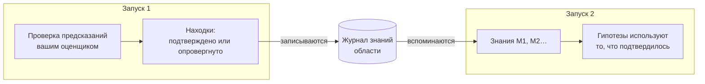

# Память между запусками

::: tip Простыми словами
Представьте себе лабораторный журнал, общий для всех, кто работает на одном стенде. Каждый раз, когда эксперимент подтверждает или опровергает правило, это записывается вместе с тем, что ожидалось, и тем, что было увидено. Следующий человек читает журнал, прежде чем начать: он использует то, что подтвердилось, и не пробует снова в прежнем виде то, что уже не сработало.

Когнитивный агент может вести такой журнал. Он записывает только **то, на что ответил реальный тест**, и никогда — то, во что просто верили модель или мыслитель.
:::

## Что она делает {#what-it-does}



1. **В конце запуска** каждое правило или объяснение, у которого хотя бы одно предсказание подтвердил или опроверг ваш [оценщик результатов](./evidence-and-verification#predictions-and-the-outcome-evaluator), становится **находкой**: утверждение, его область, правило, которое оно пересматривает в рамках запуска, и каждый тест (что ожидалось, что наблюдалось, какой оценщик). Находки дописываются в **журнал** области.
2. **В начале следующего запуска** в той же области наиболее релевантные элементы **вспоминаются** и помещаются в ментальное состояние как `knowledge` с идентификаторами `M1`, `M2`…
3. **Во время запуска**:
   - модель видит каждый элемент с его статусом и последними тестами, и ей предписано использовать подтверждённое правило в пределах его области, ссылаясь на него;
   - гипотезу, которая слово в слово повторяет **опровергнутый** элемент (тот же вид, то же утверждение и та же область, без учёта регистра и пунктуации), движок отклоняет; модели предписано вместо этого предложить вариант, который ссылается в своих посылках на идентификатор `M` элемента и объясняет опровержение, но любая другая формулировка или область принимается как новая гипотеза;
   - гипотеза, которая повторяет **подтверждённый** или **оспариваемый** элемент, автоматически связывается с ним (его идентификатор `M` добавляется в посылки), поэтому шаг сравнения видит более ранние тесты.

## Как её включить {#turn-it-on}

```ts
import { FileKnowledgeStore } from '@sdk-ai-agents/core';

const physicist = sdk.createCognitiveAgent({
  name: 'physicist',
  model: 'gpt-4o',
  evaluator: bench,   // without an evaluator, nothing is tested, so nothing is remembered
  knowledge: {
    store: new FileKnowledgeStore('./knowledge'),
    scope: 'inclined-plane',
  },
});

const first = await physicist.think({ problem: 'Does the rolling time depend on the ball?', observations });
const second = await physicist.think({ problem: 'Will a 250 g glass ball take as long as a steel one?' });

second.state.knowledge;
// [{ id: 'M1', status: 'refuted',  statement: 'Rolling time on this plane does not depend on the ball', … },
//  { id: 'M2', status: 'verified', statement: 'For rigid balls, rolling time on this plane does not depend on mass', … }]
```

| Параметр | По умолчанию | Значение |
| --- | --- | --- |
| `store` | (обязательный) | Где хранится журнал: `FileKnowledgeStore`, `InMemoryKnowledgeStore` или ваше собственное хранилище |
| `scope` | (обязательный) | К чему относятся знания. Запуски делятся тем, что узнали, только в пределах одной области. Строчные буквы, цифры, `.`, `-`, `_`: две области, различающиеся только регистром, использовали бы один файл в macOS и Windows |
| `recallLimit` | `10` | Число элементов, вспоминаемых в начале запуска, от 0 до 50. `0` — записывать, не вспоминая |
| `record` | `true` | Записывают ли запуски то, что установили их тесты |

Это используется в `examples/rule-discovery.ts`: запустите пример дважды, и второй запуск начнётся с того, что установил первый.

## Что запоминается, а что никогда {#what-is-remembered-and-what-never-is}

| Запоминается | Никогда не запоминается |
| --- | --- |
| Правила и объяснения с предсказанием, которое ваш оценщик **подтвердил** или **опроверг** | Выборы действий (предложения): они зависят от того, кто решает и когда |
| Что ожидалось, что наблюдалось, какой оценщик и какой версии | Предсказания, которые так и не проверялись или тест которых дал **неопределённый** результат (inconclusive) |
| Правило, которое пересматривает вариант, и что изменилось | То, во что верила модель, поддержка, которую она дала, предпочтения мыслителя |
| Какие запуски это записали | Итоговый ответ запуска |

Запуск, который завершился ошибкой или был остановлен, всё равно записывает проведённые тесты: измерение остаётся действительным, что бы ни произошло дальше.

## Статусы {#statuses}

| Статус | Когда | Что сообщается модели |
| --- | --- | --- |
| `verified` | Пока только подтверждения | Используйте его в пределах его области и ссылайтесь на него; за пределами этой области это гипотеза, которую нужно проверить заново |
| `refuted` | Пока только опровержения | Никогда не предлагайте его снова в прежнем виде; вариант ссылается в своих посылках на его идентификатор `M` и говорит, в чём отличие |
| `contested` | Есть и подтверждения, и опровержения | Оно верно только при некоторых условиях: выясните, при каких |

Одно и то же утверждение в одной и той же области — это один и тот же элемент, независимо от регистра и пунктуации. Тесты дедуплицируются по запуску и предсказанию: повторная запись одного и того же запуска ничего не добавляет.

## Какие элементы вспоминаются {#which-items-are-recalled}

Элементы области ранжируются детерминированно:

1. сначала по наибольшему числу слов, общих с задачей (слова из четырёх букв и более, в утверждении и в области);
2. затем по наибольшему числу тестов;
3. затем по новизне.

Вспоминаются первые `recallLimit` элементов. Это простое совпадение слов, а не семантический поиск: правило, сформулированное совсем иначе, чем задача, может вспомниться не первым. Держите области узкими (один стенд, один продукт, одна предметная область), чтобы всё в области было релевантным.

## Области {#scopes}

Область — это граница, а не имя папки для порядка:

- запуски **делятся** тем, что узнали, только в пределах одной области;
- используйте одну область на стенд, продукт, набор данных или предметную область, правила которых применимы друг к другу: `inclined-plane`, `checkout-latency`, `churn-model-v3`;
- никогда не смешивайте в одной области разных клиентов или арендаторов, если их данные должны оставаться раздельными.

## Хранилища {#stores}

| Хранилище | Для чего использовать |
| --- | --- |
| `FileKnowledgeStore(directory)` | Один файл на область, `<directory>/<scope>.jsonl`, одна строка на запуск. Строки только дописываются, поэтому файл одновременно служит читаемой историей. Записи через один экземпляр `FileKnowledgeStore` выполняются последовательно: используйте один общий экземпляр для агентов одного процесса |
| `InMemoryKnowledgeStore()` | Тесты, прототипы, короткоживущие процессы |
| Ваше собственное `KnowledgeStore` | База данных, общая для нескольких процессов |

Если несколько экземпляров или процессов одновременно пишут в одну область, используйте базу данных: реализуйте три метода порта. Строка, недописанная из-за прерванной записи, при чтении пропускается с предупреждением, а следующая запись начинается с новой строки; строка, которая является корректным JSON, но не корректной записью, останавливает чтение с указанием номера строки, поскольку файл был изменён.

```ts
import type { KnowledgeStore } from '@sdk-ai-agents/core';

const store: KnowledgeStore = {
  async recall({ scope, goal, limit }) { /* the most relevant items of the scope */ },
  async record({ scope, runId, recordedAt, findings }) { /* append one entry */ },
  async list(scope) { /* every item of the scope */ },
};
```

`projectKnowledge(entries)` сворачивает записи журнала в элементы, а `rankKnowledge(items, goal, limit)` ранжирует их, поэтому пользовательскому хранилищу достаточно хранить записи (например, одну строку на запуск) и повторно использовать обе функции.

В любой момент можно посмотреть, что известно в области:

```ts
for (const item of await store.list('inclined-plane')) {
  console.log(item.status, item.confirmations, item.refutations, item.statement);
}
```

## Аудит и воспроизведение {#audit-and-replay}

- Вспомненные элементы записываются в `cognition.started` (`knowledge.scope`, `knowledge.items`), поэтому `sdk.getMentalState(runId)` точно восстанавливает то, что знал запуск, не читая хранилище снова, даже если оно с тех пор изменилось.
- Находки записываются в событие `cognition.knowledge_recorded` (`scope`, `findings`).
- Сбой хранилища никогда не останавливает запуск: неудачное вспоминание записывается как `knowledge.error` в `cognition.started`, и запуск продолжается без памяти; неудачная запись фиксируется как `error` в `cognition.knowledge_recorded`. Хранилище, которое не отвечает в пределах `limits.timeoutMs` запуска, считается давшим сбой (медленная запись всё же может завершиться позже). Если сам журнал событий не может записать находки, выводится предупреждение, а результат запуска возвращается без изменений.

## Ограничения {#limits}

- **Совпадение слов.** Вспоминание не семантическое; родственные правила, сформулированные иначе, могут быть пропущены.
- **Только точные повторы.** Отклоняется только повтор опровергнутого правила того же вида, с той же формулировкой (без учёта регистра и пунктуации) и в той же области; перефразированное правило принимается как новая гипотеза.
- **Одного теста достаточно для `verified`.** Элемент считается подтверждённым, как только одно предсказание подтвердилось и ни одно не было опровергнуто, а какое предсказание проверяет правило, выбирает модель: слабое предсказание тоже считается подтверждением.
- **Область объявляется, а не проверяется.** Правило, подтверждённое для «жёстких шаров», показывается с этой областью, и модели предписано не применять его в других случаях без нового теста; в коде это ничем не проверяется.
- **Оценщику доверяют.** Память надёжна настолько, насколько надёжен ваш оценщик: неверное измерение запоминается как тест.
- **Один пишущий на файл.** `FileKnowledgeStore` упорядочивает записи только одного экземпляра; два экземпляра или два процесса, пишущие в одну область, никак не согласуются.
