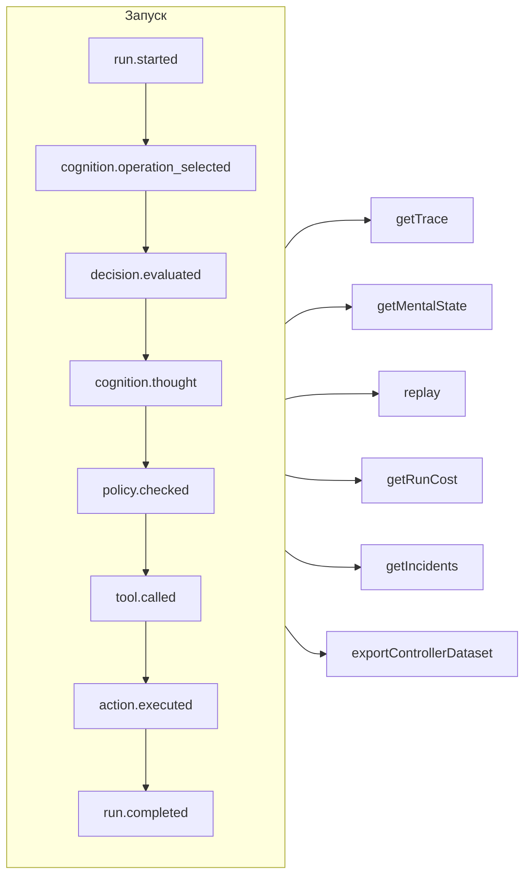

# Прослеживаемость и воспроизведение

Каждый запуск — управляемый, когнитивный, прямое типизированное решение или вызов инструмента MCP — это **журнал событий, в который можно только дописывать**. Ничего не происходит без записи, а всё остальное выводится из этого журнала.



## Хранилища {#stores}

| Хранилище | Для чего использовать |
| --- | --- |
| `FileEventStore` (по умолчанию) | Разработка, один процесс — по одному JSON-файлу на запуск |
| `SQLiteEventStore` | Локальное хранение с запросами |
| `PostgreSQLEventStore` | Продакшен: индексированные запросы, агрегирование, резервное копирование и восстановление |

::: code-group

```ts [File]
import { createSDK, FileEventStore } from '@sdk-ai-agents/core';

const sdk = createSDK({ apiKey, eventStore: new FileEventStore('./events') });
```

```ts [SQLite]
import Database from 'better-sqlite3';
import { createSDK, SQLiteEventStore } from '@sdk-ai-agents/core';

const sdk = createSDK({ apiKey, eventStore: new SQLiteEventStore({ db: new Database('events.db') }) });
```

```ts [PostgreSQL]
import pg from 'pg';
import { createSDK, PostgreSQLEventStore } from '@sdk-ai-agents/core';

const pool = new pg.Pool({ connectionString: process.env.DATABASE_URL });
const sdk = createSDK({ apiKey, eventStore: new PostgreSQLEventStore({ pool }) });
```

:::

Хранилища реализуют `IEventStore`; напишите своё, чтобы работать с любой базой данных. Файловое хранилище буферизует события и сбрасывает их на диск каждые 100 мс; при завершении работы вызовите `await store.destroy()`, чтобы записать то, что ещё не записано. Читатели журнала (восстановление ментального состояния, затраты, наборы данных) игнорируют события, повторённые с тем же идентификатором.

## Чтение запуска {#read-a-run}

```ts
const trace = await sdk.getTrace(runId);          // status, timeline, summary
const text = await sdk.exportTrace(runId, 'text'); // human-readable timeline
const events = await sdk.getEvents(runId, { type: ['tool.called', 'policy.violated'] });
const state = await sdk.getMentalState(runId);    // cognitive runs
```

Статус запуска — это **последнее событие жизненного цикла** (`run.completed`, `run.failed`, `run.cancelled`). События, добавленные после него, — обратная связь, отчёты об инцидентах — никогда не открывают запуск заново.

## Воспроизведение без LLM {#replay-without-the-llm}

```ts
const replay = await sdk.replay(runId);
```

Воспроизведение повторно выполняет записанные намерения через движок действий — включая политики — **без вызова LLM**. Воспроизводите с изменениями, чтобы проверять сценарии «а что если», например после изменения политики.

Воспроизведение запускает инструменты снова, по-настоящему. Для инструментов с пометкой `requiresApproval` воспроизведение повторяет только те вызовы, которые человек **одобрил** в исходном запуске, — тот же инструмент с теми же параметрами, — не спрашивая снова; вызов, который был отклонён, отменён или так и не одобрен, отклоняется и не выполняется. Одобрения, которых требует *политика*, по-прежнему действуют и ждут решения.

## Понимание решений {#understand-decisions}

| Метод | Что вы получаете |
| --- | --- |
| `getReasoningGraph(runId)` / `exportReasoningGraph(runId, 'graphviz')` | Цепочку намерение → политика → действие в виде графа |
| `getAlternatives(runId)` | Альтернативы, которые рассматривал агент |
| `getDecisionPatterns(filters)` | Повторяющиеся закономерности решений в разных запусках |
| `getTraceVisualization(runId)` | Сгруппированную структуру, готовую для отображения хронологии в интерфейсе |
| `getPolicyAuditTrail(runId)` | Каждую проверку политики и её результат |

## Тестируйте агентов как код {#test-agents-like-code}

Превратите удачный запуск в **эталонную трассу**, а затем проверяйте по ней новые запуски:

```ts
const golden = await sdk.createGoldenTrace(runId, { name: 'refund flow', description: 'Expected behavior' });
const validation = await sdk.validateAgainstGoldenTrace(newRunId, golden.id);
const regressions = await sdk.detectRegressions(newRunId, golden.id);
```

Также доступны наборы регрессионных тестов, проверки поведения, сравнение запусков и анализ влияния перед развёртыванием — см. [API SDK](../reference/sdk-api).
