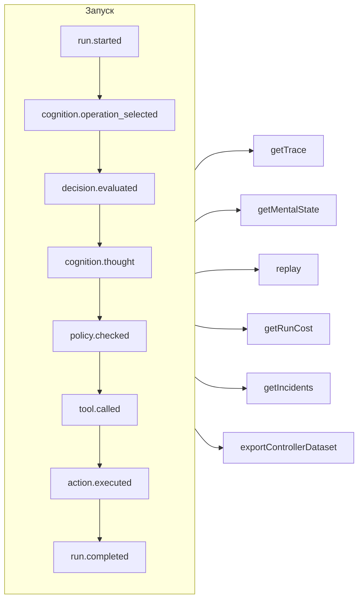

# Прослеживаемость и воспроизведение

Каждый запуск — управляемый, когнитивный, прямое типизированное решение или вызов инструмента MCP — это **журнал событий, в который можно только дописывать**. Ничего не происходит без записи, а всё остальное выводится из этого журнала.



## Хранилища {#stores}

| Хранилище | Для чего использовать |
| --- | --- |
| `FileEventStore` (по умолчанию) | Разработка, один процесс — по одному JSON-файлу на запуск |
| `SQLiteEventStore` | Локальное хранение с запросами |
| `PostgreSQLEventStore` | Продакшен: индексированные запросы, агрегирование, резервное копирование и восстановление |

::: code-group

```ts [File]
import { createSDK, FileEventStore } from '@sdk-ai-agents/core';

const sdk = createSDK({ apiKey, eventStore: new FileEventStore('./events') });
```

```ts [SQLite]
import Database from 'better-sqlite3';
import { createSDK, SQLiteEventStore } from '@sdk-ai-agents/core';

const sdk = createSDK({ apiKey, eventStore: new SQLiteEventStore({ db: new Database('events.db') }) });
```

```ts [PostgreSQL]
import pg from 'pg';
import { createSDK, PostgreSQLEventStore } from '@sdk-ai-agents/core';

const pool = new pg.Pool({ connectionString: process.env.DATABASE_URL });
const sdk = createSDK({ apiKey, eventStore: new PostgreSQLEventStore({ pool }) });
```

:::

Хранилища реализуют `IEventStore`; напишите своё, чтобы работать с любой базой данных. Файловое хранилище буферизует события и сбрасывает их на диск каждые 100 мс; при завершении работы вызовите `await store.destroy()`, чтобы записать то, что ещё не записано. Читатели журнала (восстановление ментального состояния, затраты, наборы данных) игнорируют события, повторённые с тем же идентификатором.

## Чтение запуска {#read-a-run}

```ts
const trace = await sdk.getTrace(runId);          // status, timeline, summary
const text = await sdk.exportTrace(runId, 'text'); // human-readable timeline
const events = await sdk.getEvents(runId, { type: ['tool.called', 'policy.violated'] });
const state = await sdk.getMentalState(runId);    // cognitive runs
```

Статус запуска — это **последнее событие жизненного цикла** (`run.completed`, `run.failed`, `run.cancelled`). События, добавленные после него, — обратная связь, отчёты об инцидентах — никогда не открывают запуск заново.

## Ход выполнения в реальном времени {#live-progress}

События также доходят до вашего кода **ещё во время запуска**, как только хранилище их приняло: чтобы показывать ход выполнения в интерфейсе, передавать его клиенту потоком или обновлять панель мониторинга. Клиенты MCP получают их как [уведомления о ходе выполнения](./mcp-deploy#progress-notifications).

```ts
const result = await agent.run({
  message: 'Refund order 1234',
  onEvent: (event) => console.log(event.type),
});

const answer = await cognitiveAgent.think({ problem, onEvent: (event) => socket.send(JSON.stringify(event)) });
const replay = await sdk.replay(runId, undefined, { onEvent: (event) => console.log(event.type) });

// Every run of the SDK, for as long as you listen
const unsubscribe = sdk.subscribe((event) => dashboard.push(event), { types: ['run.failed', 'approval.requested'] });
unsubscribe();
```

| Где | Что получает слушатель |
| --- | --- |
| `run({ onEvent })`, `think({ onEvent })` | Каждое событие этого запуска |
| `replay(runId, modifications, { onEvent })` | Каждое событие воспроизведения |
| `executeTool(name, params, { onEvent })` | События вызова, а также запуска агента, который начинает его инструмент (`governedAgentTool`, `cognitiveAgentTool`), только на один уровень: без запусков, которые, в свою очередь, начинает этот агент |
| `sdk.subscribe(listener, { runId?, agentId?, types?, maxQueued? })` | Каждое событие каждого запуска, подходящего под фильтр, пока вы не вызовете функцию, которую он возвращает |

Что гарантируется:

- **Только то, что приняло хранилище.** Слушатель вызывается после того, как `append` хранилища завершился успешно, и никогда — для события, которое хранилище отклонило. В SQL-хранилищах строка уже зафиксирована; в файловом хранилище событие находится в его буфере: `getEvents` сразу его возвращает, а на диск оно попадает в течение 100 мс (при сбое в этом промежутке оно теряется).
- **По порядку.** События одного запуска приходят в том порядке, в котором они были записаны; события разных запусков перемежаются.
- **По одному событию за раз, и запуск никогда не ждёт.** Когда ваш слушатель возвращает промис, его следующее событие ждёт, пока этот промис не завершится, поэтому асинхронный слушатель не может перепутать порядок событий. Запуск тем временем продолжается: медленный слушатель отстаёт, но не замедляет агента. Синхронный слушатель вызывается до того, как `append` события вернёт управление: делайте его быстрым.
- **Вызов ждёт слушателя, пока запуск не прерван.** Когда запуск закончен, `run()`, `think()`, `replay()` и `executeTool()` ждут, пока их `onEvent` не закончит обработку каждого события, поэтому к моменту их возврата вы уже увидели всё. Ожидание заканчивается раньше, если запуск был остановлен или отменён или если прерывается его `signal` (вызывающая сторона сдаётся); для когнитивного запуска `limits.timeoutMs` учитывает и это ожидание. Тогда подписка слушателя отменяется: события, которые он ещё не получил, отбрасываются. Воспроизведение нельзя отменить, поэтому оно всегда ждёт. В остальных случаях промис, который никогда не завершается, не даёт вызову вернуть результат: для работы в режиме «запустил и забыл» не возвращайте промис (`onEvent: (event) => { void save(event); }`).
- **Ограниченная очередь.** Слушателя, который ещё занят предыдущим событием, ждут не более `maxQueued` событий (по умолчанию 10 000); сверх этого новые события для этого слушателя отбрасываются. Об этом сообщается, когда слушатель наверстает отставание: `LiveEventsDroppedError` указывает, сколько событий было отброшено.
- **Ошибки не попадают в запуск.** Если слушатель выбрасывает исключение или его промис отклоняется, ошибка выводится в стандартный поток ошибок (`console.error`), а слушатель по-прежнему получает следующие события; туда же выводятся и сообщения об отброшенных событиях. Чтобы обрабатывать ошибки самостоятельно, перехватывайте их в слушателе; чтобы обрабатывать и ошибки, и отброшенные события, создайте SDK с `eventStore: new ObservedEventStore(store, { onListenerError })`.
- **Копия.** Каждый слушатель получает собственную копию события в том виде, в каком хранилище его читает: если её изменить, в журнале ничего не изменится.
- **Отписка действует сразу.** После вызова функции, которую вернул `sdk.subscribe`, слушатель больше не вызывается, даже для событий, которые уже ждут доставки; эту функцию можно вызвать изнутри слушателя.

Фильтр `agentId` проверяет `metadata.agentId` каждого события: у некоторых событий агент не указан (`provider.retry`, конец воспроизведения, `decision.evaluated` вызова `sdk.decisions`, сделанного без `agentId`), и чтобы их получить, фильтруйте по запуску. Восстановленные резервные копии не доставляются. Отчёты об инцидентах, которые создаёт `incidents`, доставляются; если вы сами создаёте `MonitoredEventStore`, стройте его поверх `ObservedEventStore` (`new MonitoredEventStore(new ObservedEventStore(store), options)`), иначе его отчёты записываются, но не доставляются в реальном времени. Для агента, собранного вручную на вашем собственном хранилище (`new AgentImpl(…)`), оберните хранилище в `ObservedEventStore`, чтобы использовать `onEvent`; `createSDK` делает это за вас. За инструментом-агентом агент, хранилище которого не обёрнуто, не завершается ошибкой, а работает без слушателя вызывающей стороны.

## Воспроизведение без LLM {#replay-without-the-llm}

```ts
const replay = await sdk.replay(runId);
```

Воспроизведение повторно выполняет записанные намерения через движок действий — включая политики — **без вызова LLM**. Воспроизводите с изменениями, чтобы проверять сценарии «а что если», например после изменения политики.

Воспроизведение запускает инструменты снова, по-настоящему. Для инструментов с пометкой `requiresApproval` воспроизведение повторяет только те вызовы, которые человек **одобрил** в исходном запуске, — тот же инструмент с теми же параметрами, — не спрашивая снова; вызов, который был отклонён, отменён или так и не одобрен, отклоняется и не выполняется. Одобрения, которых требует *политика*, по-прежнему действуют и ждут решения.

## Понимание решений {#understand-decisions}

| Метод | Что вы получаете |
| --- | --- |
| `getReasoningGraph(runId)` / `exportReasoningGraph(runId, 'graphviz')` | Цепочку намерение → политика → действие в виде графа |
| `getAlternatives(runId)` | Альтернативы, которые рассматривал агент |
| `getDecisionPatterns(filters)` | Повторяющиеся закономерности решений в разных запусках |
| `getTraceVisualization(runId)` | Сгруппированную структуру, готовую для отображения хронологии в интерфейсе |
| `getPolicyAuditTrail(runId)` | Каждую проверку политики и её результат |

## Тестируйте агентов как код {#test-agents-like-code}

Превратите удачный запуск в **эталонную трассу**, а затем проверяйте по ней новые запуски:

```ts
const golden = await sdk.createGoldenTrace(runId, { name: 'refund flow', description: 'Expected behavior' });
const validation = await sdk.validateAgainstGoldenTrace(newRunId, golden.id);
const regressions = await sdk.detectRegressions(newRunId, golden.id);
```

Также доступны наборы регрессионных тестов, проверки поведения, сравнение запусков и анализ влияния перед развёртыванием — см. [API SDK](../reference/sdk-api).
