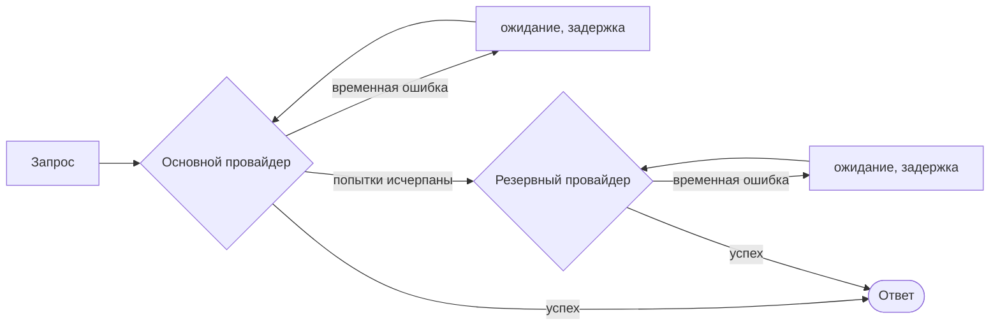

# Повторные попытки и резерв

Сети дают сбои, провайдеры ограничивают частоту запросов, инструменты не укладываются в тайм-аут. SDK повторяет то, что можно повторить, переключается на резерв, когда повторить нельзя, и **записывает каждую повторную попытку в запуск**, чтобы ничего не было скрыто.



## Провайдеры LLM {#llm-providers}

Политика повторных попыток применяется к каждому провайдеру **по отдельности, до любого переключения на резерв**:

```ts
const sdk = createSDK({
  apiKey: process.env.OPENAI_API_KEY,
  fallbackProviders: [{ provider: 'anthropic', config: { apiKey: process.env.ANTHROPIC_API_KEY } }],
  retry: { maxRetries: 3, initialDelayMs: 500, maxDelayMs: 8_000 },
});
```

Резервному провайдеру другого поставщика нужен собственный ключ — в его `config` или в `providerConfig`: ключ основного провайдера никогда не отправляется другому поставщику. Он получает модель агента, только если обслуживает её, а иначе — свою `defaultModel`, если она не задана, — `gpt-5.4` для OpenAI и `claude-opus-5` для Anthropic (Anthropic отклоняет название модели OpenAI, и наоборот). Событие `intention.generated` указывает, какой провайдер ответил и какой моделью.

| Параметр | По умолчанию | |
| --- | --- | --- |
| `maxRetries` | `2` | Число повторных попыток после первой |
| `initialDelayMs` | `500` | Удваивается при каждой повторной попытке (`multiplier`) |
| `maxDelayMs` | `8000` | Верхняя граница одного ожидания перед повтором |
| `maxRetryAfterMs` | `60000` | Самое долгое учитываемое значение `retry-after` (`maxDelayMs`, если есть резерв) |
| `jitter` | `true` | Делает каждое ожидание случайным в диапазоне [delay/2, delay] |
| `retryOn` | `isTransientError` | Ваш собственный предикат |

Повторяются только **временные** ошибки: 408, 409, 425, 429, 5xx, 529, сбои соединения и тайм-ауты — включая ошибки соединения OpenAI и Anthropic, которые распознаются по классу и по сетевому коду в их `cause`. Ошибки аутентификации, валидации и политик сразу приводят к неудаче, как и ответ 429, означающий, что у аккаунта закончились кредиты или квота (`insufficient_quota`, `credit_balance_exhausted`…): ожидание не вернёт кредиты. Сообщение об ошибке содержит объяснение поставщика. Когда провайдер присылает `retry-after-ms` или `retry-after`, SDK ждёт указанное время вместо собственной задержки, но не дольше `maxRetryAfterMs` (по умолчанию 60 с). Если настроены `fallbackProviders`, эта граница снижается до `maxDelayMs`: провайдер, который просит долгую паузу, уступает место резерву, а не блокирует запуск. Более длинный запрос паузы завершает повторные попытки.

Когда действует политика SDK, собственные повторные попытки клиентов OpenAI и Anthropic отключаются — **повторные попытки никогда не накладываются друг на друга**. Каждая повторная попытка записывается как событие `provider.retry` с провайдером, моделью, номером попытки, задержкой и ошибкой. Передайте `retry: false`, чтобы вместо этого сохранить поведение поставщика по умолчанию.

Провайдер, который вы передаёте через `llmProvider`, используется как есть, если вы явно не задали `retry`, а `FallbackProvider` никогда не оборачивается, чтобы его переключения оставались видимыми в трассе. Его провайдеры тоже не оборачиваются, поэтому `retry` к ним не применяется: чтобы повторять запросы к одному из них до переключения, оберните его в `RetryingLLMProvider` и задайте его клиенту `maxRetries: 0`. Установите `maxRetryAfterMs` политики равным её `maxDelayMs`, как делает SDK, когда может подключиться резерв, чтобы провайдер, который просит долгую паузу, уступал место резерву. Эти повторные попытки не записываются как события `provider.retry`.

## Инструменты {#tools}

Помечайте идемпотентные инструменты как допускающие повтор:

```ts
sdk.defineTool({
  name: 'lookup_metric',
  description: 'Reads a metric',
  schema: z.object({ metric: z.string() }),
  retry: { maxRetries: 2, initialDelayMs: 200 },
  handler: async ({ metric }) => warehouse.read(metric),
});
```

Повторяются только сбои инструмента — никогда отказ политики или ошибка валидации. Каждая повторная попытка — это событие `tool.retry`.

## Типизированные решения {#typed-decisions}

Клиент Jev повторяет ответы 408, 429, 5xx и 529 и сетевые ошибки, **учитывая `retry-after`**, и по умолчанию использует политику повторных попыток SDK (`jev.maxRetries` её переопределяет). В отличие от провайдеров LLM, он повторяет каждый ответ 429, какова бы ни была его причина, до `maxRetries` раз.

## В любом другом месте {#anywhere-else}

`withRetry` экспортируется для вашего собственного кода:

```ts
import { withRetry, DEFAULT_RETRY_POLICY } from '@sdk-ai-agents/core';

const data = await withRetry(() => fetchPartnerFeed(), DEFAULT_RETRY_POLICY, {
  onRetry: ({ retry, delayMs, error }) => logger.warn({ retry, delayMs, error }),
});
```
