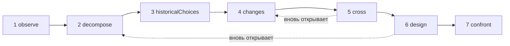

# Исследования

Исследование — это ИИ-исследователь. Оно применяет один метод — **понять объект, затем перепроектировать его современными средствами** — и передаёт вам досье: что делает объект, как он работает, почему его построили именно так, что изменилось с тех пор, несколько новых вариантов устройства и эксперименты, которые позволили бы выбрать между ними. Оно ничего не строит, ничего не запускает и ничего не измеряет: оно исследует и предлагает.

::: tip Простыми словами
Выберите объект: веб-браузер, движок базы данных, расписание поездов. Исследование наблюдает за ним, разбирает его на части, ищет причины его давних решений, выясняет, какие исследования и техники появились с тех пор, и сопоставляет одно с другим, чтобы представить иное устройство. Оно нацелено на смену принципа, которая делает возможным что-то новое, а не на более быструю версию того же самого. Каждое утверждение указывает, **установлено** ли оно источником, который исследование действительно нашло, является ли оно **гипотезой** или **новшеством**, которое ещё предстоит сверить с существующими работами. И всё это время несколько механизмов удерживают исследование на цели, которую вы ему дали, потому что языковые модели склонны уходить в сторону по мере того, как накапливаются инструкции. Каждый термин объяснён на странице [Ключевые термины простыми словами](./glossary#studies).
:::

```ts
const study = sdk.createStudy({
  name: 'browser',
  object: 'The Web browser, from 1990 to 2026',
  objective: 'A browser design whose every choice follows from the investigation',
  leads: ['vectorisation', 'weights', 'ReLU'], // your leads: examples to verify, not truths
  analogues: ['Bitcoin'],                      // breakthroughs by assembly to deconstruct
  sources: ['web_search', 'arxiv_search'],     // SDK tools the study searches with (webTools())
});

const result = await study.run();
result.status;   // 'completed' | 'stopped' | 'failed' | 'cancelled'
result.report;   // the structured report
result.markdown; // the same, as a readable dossier
```

## Что такое исследование {#what-a-study-is}

Исследование применяет метод из семи этапов: *понять объект, затем перепроектировать его, опираясь на знания и техники сегодняшнего дня*. Его направляющий вопрос: **если бы нам пришлось удовлетворять сегодняшние потребности с помощью знаний и техник, доступных сегодня, как бы мы устроили этот объект?** Если вы не задаёте собственный `question`, исследование задаёт этот вопрос на своём языке, а за ним — ориентир, описанный в разделе [Ориентир: новая возможность](#the-aim-a-new-capability).

Исследование — не агент. У него нет инструментов, чтобы действовать, есть только **источники** для поиска (см. [Поиск через ваши источники](#research-through-your-sources)), и его результат — отчёт, а не действие. Оно создаётся через `sdk.createStudy()` на основе **устава** — объекта, цели, ваших потребностей и ваших направлений, — который потом никогда не меняется.

Его последний этап проектирует эксперименты, но не проводит их. Проведя эксперимент, вы записываете то, что он показал, в соответствующую карточку механизма (см. [Карточка механизма](#the-mechanism-card)).

## Семь этапов {#the-seven-passages}

Запуск проходит семь этапов метода по порядку. Каждый из них производит элементы нескольких видов (свои **коллекции**), и каждый элемент получает идентификатор, который никогда не используется повторно — до перезапуска: `O1`, `P2`, `A1`…

| # | Этап | Что делает | Что сохраняет |
| --- | --- | --- | --- |
| 1 | `observe` | Рассматривает поведение объекта, способы его использования, его вариации и сбои, каждое — с условиями: когда, где, для кого, с чем. Описывает, но пока не объясняет | `observations` (`O`) |
| 2 | `decompose` | Составляет карту частей: их функции, входы, выходы и связи, спускаясь внутрь части, пока её работа остаётся непрозрачной, с неизвестными каждой из них. Определяет **всю цепочку** объекта, звено за звеном (для браузера: получить, понять, выполнить, отобразить, взаимодействовать) | `pieces` (`P`), `chain` (`C`) |
| 3 | `historicalChoices` | Ищет задокументированные причины решений своего времени: оборудование, инструменты, способы использования, знания, затраты, совместимость. Правдоподобная причина без документа остаётся гипотезой | `historicalChoices` (`H`) |
| 4 | `changes` | Ищет, что появилось или стало применимым с тех пор, в области объекта и в других областях, — каждое достижение с его механизмом, датой, доказательствами, условиями применения и доступностью. Выносит вердикт по каждому из ваших направлений, ищет другие математические и технические инструменты помимо них, перечисляет лучшие современные реализации (эталон того, что значит «лучше») и разбирает прорывы за счёт сборки | `advances` (`V`), `leadVerdicts` (`L`), `independentLeads` (`I`), `references` (`R`), `analogues` (`B`) |
| 5 | `cross` | Сопоставляет прошлое и настоящее: какие ограничения остаются, какие ослабли, какие требования появились. Выводит решения, которые теперь можно пересмотреть, предлагает сочетания A + B (что A позволяет делать B, чем они должны обмениваться, чего это стоит в преобразованиях и синхронизации) и называет кандидатов в новые возможности | `constraints` (`K`), `revisableDecisions` (`D`), `combinations` (`X`), `capabilities` (`Y`) |
| 6 | `design` | Проектирует не менее двух архитектур, хотя бы одна из которых нацелена на новую возможность, и каждая охватывает всю цепочку — со своим механизмом, условиями, выгодой, дополнительной стоимостью, возможным контрпримером и предсказаниями. Даёт три состояния каждой основной части и говорит, что ново, а что нет. Затем ищет предшествующие работы для новшеств и для сборки каждой возможности | `architectures` (`A`), `threeStates` (`T`), `noveltyClaims` (`N`) |
| 7 | `confront` | Проектирует эксперименты, которые позволили бы выбрать между архитектурами и проверить всю цепочку: протокол, измерения, критерии и ожидаемый результат для каждой архитектуры. Заполняет карточку механизма для каждого основного механизма | `experiments` (`E`), `cards` (`M`) |

Результаты, которые возвращают поиски, тоже нумеруются: `S1`, `S2`… Каждый этап получает нужные ему элементы предыдущих этапов в виде компактных записей JSON — и только те элементы, которые оценил страж (см. [Страж](#the-guardian)).

### Цикл, а не линия {#a-loop-not-a-line}



Этапы образуют цикл. Когда неизвестное блокирует этап — скажем, для проектирования нужно знать, как на самом деле работает какая-то часть, — этап может попросить **вновь открыть** более ранний этап по этому вопросу. Более ранний этап выполняется снова с этим фокусом и добавляет к уже имеющимся элементам только то, что нужно для этого неизвестного: у него нет минимума, который нужно выполнить, и он не должен снова выносить вердикты по направлениям или разбирать прорывы. Затем этап, который попросил, выполняется снова уже с ними; пока этого не произошло, он не завершён (его состояние — `partial`), а поиск предшествующих работ проектирования ждёт его окончательной версии. `limits.maxLoops` ограничивает число повторных открытий за запуск (по умолчанию 1, 0 — не разрешать ни одного); этап, который сам был открыт повторно, не может вновь открыть другой.

### Три состояния каждой части {#three-states-of-each-piece}

Проектирование даёт каждой основной части три состояния, которые хранятся в отчёте раздельно (`threeStates`):

- **объект в своё время** (`atItsTime`): как была построена часть и в каких условиях;
- **лучшие современные реализации, относящиеся к делу** (`currentBest`): эталон, по которому измеряется улучшение;
- **наше предложение** (`proposal`): что с этой частью делает архитектура.

Возраст решения не делает его неверным, а недавняя техника может сделать ненужным усложнение прошлого: три состояния показывают, какое условие изменилось, какой механизм стал возможным и что это даёт целому.

### Карточка механизма {#the-mechanism-card}

Последний этап заполняет карточку для каждого основного механизма. В ней одиннадцать полей: первые девять заполняет исследование, а последние два остаются пустыми, пока вы не проведёте эксперимент.

| # | Поле | На какой вопрос оно отвечает |
| --- | --- | --- |
| 1 | `observation` | Что делает система и в каких условиях? |
| 2 | `mechanism` | Какие части и связи это объясняют? |
| 3 | `unknown` | Что ещё осталось вскрыть, измерить или задокументировать? |
| 4 | `historicalChoice` | Почему было выбрано такое устройство и на каких доказательствах? |
| 5 | `evolution` | Что изменилось с тех пор, по каким источникам и с какими датами? |
| 6 | `newPossibility` | Какой выбор становится пересматриваемым благодаря этому изменению? |
| 7 | `proposedCombination` | Как конкретно сочетаются техники? |
| 8 | `prediction` | Какого эффекта мы ожидаем и в каких условиях? |
| 9 | `experiment` | Как выбрать между предложениями и проверить целое? |
| 10 | `resultAndError` | Что мы обнаружили и где объяснение не работает? |
| 11 | `conclusionAndMemory` | Что мы сохраняем, что меняем, где этот механизм можно использовать повторно? |

```ts
await study.recordResult('M1', {
  result: 'Layout reuse cut the time to redraw by 40% on the reference pages',
  error: 'No gain on pages whose styles change on every frame',
  conclusion: 'Keep immutable layout results; look again at style invalidation',
});
```

`recordResult(cardId, { result, error?, conclusion? })` заполняет поля 10 и 11 карточки и записывает событие `study.result_recorded` в тот запуск, который написал карточку. Он выбрасывает `ValidationError` для неизвестной карточки или пустого `result`. `study.report()` возвращает отчёт с заполненной карточкой.

## Ориентир: новая возможность {#the-aim-a-new-capability}

Исследование не ищет более быструю версию того же объекта. Оно ищет **смену принципа, которая делает возможным то, что сегодня трудно, а не только то, что быстрее**.

### Возможность, принцип, механизм {#capability-principle-mechanism}

Каждая архитектура указывает три вещи:

- **возможность** (`capability`): что становится возможным, для кого и какое сегодняшнее ограничение она снимает (`what`, `forWhom`, `liftedConstraint`);
- **смену принципа** (`principleChange`): какой принцип меняется — `representation`, `distribution` (работы), `responsibility`, `trust`, `verification` или `other` — и как;
- **механизм** (`mechanism`): как сборка техник даёт эту возможность.

Каждая архитектура объявляет свой вид (`kind`): `capability` или `improvement`, если она лишь делает что-то быстрее или дешевле. Архитектура, не объявившая вида, считается улучшением — это более слабое утверждение. Возможность должна указать свою смену принципа и свою сборку, иначе схема её отклоняет (см. [Каждый элемент говорит, чему служит](#every-item-says-what-it-serves)).

Вы можете назвать в уставе возможность, на которую нацеливаетесь (`capability`); тогда её несёт каждый промпт. Если её нет, этап `cross` должен предложить хотя бы одного кандидата (`capabilities`, `Y1`…) — с указанием, для кого он, почему это трудно сегодня и какой принцип изменился бы.

Страж (см. [Страж](#the-guardian)) видит механизм, компоненты и сборку каждой архитектуры и оценивает две вещи по отдельности: служит ли она цели и открывает ли она новую возможность. Возможность, которую он находит лишь более быстрой или более дешёвой, становится `improvement` — с `declaredKind: 'capability'`, чтобы было видно, что заявила модель, с `kindReason`, объясняющим почему, и с событием `study.capability_demoted`. Улучшение, которое служит цели, остаётся: оно ставится после возможностей, но никогда не удаляется за то, что оно улучшение. Проектирование, в котором не осталось ни одной возможности, целиком уходит от цели: это записывается в журнал дрейфа, и проектирование переделывается один раз; если и в переделке нет ни одной возможности, отчёт так и говорит (предупреждение `noCapability`), а если страж не сохранил вообще ни одной архитектуры, отчёт говорит и об этом (предупреждение `noDesign`). Возможность, сборку которой поиск предшествующих работ находит уже реализованной, остаётся возможностью, но уже не новой: см. [Предшествующие работы](#prior-art). В отчёте **сначала идут новые возможности, затем возможности, сборка которых уже существует, затем улучшения**.

### Новизна — в сборке {#novelty-lies-in-the-assembly}

Прорывы редко рождаются из техники без прецедентов. Чаще они собирают более ранние техники так, как никто раньше не собирал, и эта сборка открывает новую возможность. Исследование рассуждает так же:

- архитектура перечисляет свои **компоненты** (`components`): предшествующие техники, каждая со своим утверждением, датой и источниками и со статусом, который проверяется как у любого утверждения;
- её **сборка** (`assembly`) говорит, что каждый компонент даёт остальным, чем они обмениваются и чего это стоит;
- компонент **никогда не бывает новшеством**: компонент, представленный как новый, получает статус `established`, если его документирует результат, перечисленный в его промпте, и `hypothesis` в остальных случаях, с указанием причины;
- каждый компонент и каждое звено сборки указывают, из каких записей исследования они происходят (`from`): достижения (`V`), самостоятельные направления (`I`), эталоны (`R`), прорывы (`B`), пересматриваемые решения (`D`), сочетания (`X`) и кандидаты в возможности (`Y`) — из тех, что перечислил промпт проектирования. Код это проверяет: идентификаторы, которых промпт не перечислял, попадают в `unknownFrom`, а часть, не ссылающаяся ни на одну из перечисленных записей, помечается как `untraced` (не прослеживается: она не вытекает из исследования) с предупреждением `untracedAssembly`;
- собственный статус архитектуры — это статус её сборки и её возможности. Предшествующие работы для сборки **каждой возможности**, какой бы статус ей ни дала модель, ищутся **как сочетание**: исследование ищет работы, которые уже соединяют те же компоненты, чтобы получить ту же возможность, а не каждую часть по отдельности.

Досье показывает путь каждой архитектуры: компоненты (с их статусами и происхождением) → сборка (с её статусом) → возможность.

### Прорывы за счёт сборки {#breakthroughs-by-assembly}

Этап `changes` также разбирает прорывы прошлого в любой области, которые получились из сборки более ранних техник (`analogues`, `B1`…). Пример, который приводит метод, — Bitcoin: подписи с открытым ключом, цепочки хешей и метки времени, доказательство работы (proof of work), деревья Меркла и одноранговая сеть — всё это существовало раньше; собранные вместе, они дали общий реестр без доверенной третьей стороны.

Для каждого прорыва исследование записывает более ранние техники, которые он собрал (не меньше двух, с датами), ограничение, которое он снял, возможность, которая открылась, и **шаблон** сборки. Этапы `cross` и `design` получают эти шаблоны и могут использовать их повторно. Каждый прорыв — такое же утверждение, как любое другое: `established` только с результатом, который получило исследование.

Каждый прорыв, который вы называете в `analogues`, должен быть разобран. Устав их нумерует, и модель называет разбираемый прорыв по его номеру (`named`), так что соответствие сохраняется, на каком бы языке модель ни писала. Ответ, в котором какой-то из них забыт, отправляется обратно один раз; если какого-то всё ещё не хватает, отчёт указывает его в `undeconstructedAnalogues` с предупреждением `analoguesNotDeconstructed`. Исследование может добавить другие найденные им прорывы.

## Установленное, гипотеза, новшество {#established-hypothesis-novelty}

Каждый элемент исследования — это **утверждение**: высказывание со статусом, с результатами, на которые оно ссылается (`sources`), и с указанием того, чему оно служит в цели. Модель предлагает статус; **код его проверяет**, что бы ни говорила модель.

| Статус | Что требуется | Что делает исследование в противном случае |
| --- | --- | --- |
| `established` | Утверждение ссылается хотя бы на один результат, **перечисленный в промпте, который его написал** | Утверждение становится `hypothesis`. `declaredStatus` сохраняет статус, который дала модель, а `statusReason` объясняет почему; идентификаторы, на которые оно ссылалось, но которых его промпт не перечислял, хранятся отдельно в `unlistedSources` и ничего не подтверждают |
| `hypothesis` | Ничего: правдоподобно, но здесь не задокументировано | — |
| `novelty` | Идея, которой ещё не существует, и **поиск её предшествующих работ** | Утверждение остаётся новшеством, которое нужно проверить (`toVerify: true`), с указанием причины, пока его предшествующие работы не найдены и не оценены |

Результата, полученного исследованием для другого этапа, недостаточно: модель должна была видеть его в промпте, который написал утверждение. То же правило действует для компонентов архитектуры. Статус, который исследование не может прочитать, считается `hypothesis` и никогда — более сильным. **Без источников ничего нельзя установить**: каждое утверждение в лучшем случае гипотеза, ни одно новшество нельзя проверить, и отчёт говорит об этом в своём первом предупреждении (`noSources`).

Каждая причина, которую приводит исследование, — почему статус понижен, почему элемент удалён, почему дополнение отклонено, — это `StudyReason`: код (`code`, например `citesUnlisted` или `priorArtNoResult`), его параметры (`params`) и та же причина по-английски (`message`). Досье пишет её на языке исследования; у причины, которую написал страж или модель, код `judged`, а её текст — в `params.text`.

### Предшествующие работы {#prior-art}

После окончательного проектирования исследование ищет предшествующие работы для каждого новшества, которое ещё нужно проверить, — как из проектирования, так и из более ранних этапов, — а также для сборки каждой архитектуры, нацеленной на возможность, каков бы ни был её статус. Модель выбирает поиски для каждого утверждения (для архитектуры — сочетание её компонентов и возможность), исследование выполняет их, затем отдельный вызов называет наиболее близкую существующую работу и выносит вердикт. **Предшествующие работы утверждения опираются только на результаты его собственных поисков**, и хотя бы на один из них:

- `novel` или `partlyNovel`: новшество остаётся новшеством, уже не требующим проверки, со своим `priorArt` (`closest`, `sources`, `verdict`);
- `exists`: идея уже реализована; новшество становится `hypothesis`, а `statusReason` называет наиболее близкую работу.

Предшествующие работы для возможности, которая не является новшеством, тоже записываются, а её статус не меняется: исследование понижает статусы, но никогда их не повышает. Если её сборка уже существует, она сохраняет `kind: 'capability'`, её `priorArtReason` говорит об этом (`assemblyExists`, с наиболее близкой работой), и она ставится после остальных возможностей, перед улучшениями (предупреждение `capabilitiesExist`).

Утверждение, предшествующие работы которого не удалось найти или оценить, остаётся требующим проверки (`toVerify`), с указанием причины: в его `statusReason` — для новшества, в его `priorArtReason` — для возможности с другим статусом. Причины: его поиск ещё не выполнялся (`priorArtNotSearchedYet`), нет источника (`priorArtNoSource`), для него не запросили поиск (`priorArtNotSearched`), его поиски завершились ошибкой (`priorArtSearchFailed`) или ничего не нашли (`priorArtNoResult`), бюджет поисков исчерпан (`priorArtSearchBudget`), его результаты не были оценены (`priorArtNotAssessed`) или проверка не сослалась ни на один из его собственных результатов (`priorArtUnsupported`). Новшество, заявленное после проектирования, тоже остаётся требующим проверки. Отчёт их подсчитывает (предупреждения `noveltiesToVerify` и `capabilitiesToVerify`).

## Поиск через ваши источники {#research-through-your-sources}

Исследование ищет с помощью **инструментов, которые вы ему даёте** как `sources`: это имена инструментов SDK. [Веб-инструменты](./web-research) SDK работают без настройки — `web_search` (DuckDuckGo, пока вы не настроите другого провайдера), `arxiv_search`, `wikipedia_search` и `github_search`, — и их результаты приходят с URL и, если она известна, с датой:

```ts
import { webTools } from '@sdk-ai-agents/core';

// Define the tools first: the study checks its sources when it is created.
const sources = webTools({ include: ['web_search', 'arxiv_search', 'wikipedia_search'] }).map(
  (tool) => sdk.defineTool(tool).name
);

const study = sdk.createStudy({ name: 'browser', object, objective, sources });
```

Подойдёт и любой другой поисковый инструмент, например поисковые инструменты сервера MCP, импортированные через [`connectMcpServer`](./mcp#use-the-tools-of-an-mcp-server-in-your-agents) и определённые через `sdk.defineTool`:

```ts
import { connectMcpServer } from '@sdk-ai-agents/core/mcp';

const search = await connectMcpServer({
  name: 'search',
  transport: {
    type: 'stdio',
    command: 'npx',
    args: ['-y', '@modelcontextprotocol/server-brave-search'],
    env: { BRAVE_API_KEY: process.env.BRAVE_API_KEY ?? '' },
  },
  metadata: { readOnly: true },
});
// Define the tools first: the study checks its sources when it is created.
const sources = search.tools.map((tool) => sdk.defineTool(tool).name);

const study = sdk.createStudy({ name: 'browser', object, objective, sources });
```

- **Проверяются при создании исследования.** `createStudy` выбрасывает `ValidationError`, если источник не является определённым инструментом или не принимает текстовый запрос. Запрос передаётся в параметр `query` инструмента или в параметр с другим распространённым именем (`q`, `search`, `keywords`…), иначе — в его единственный обязательный текстовый параметр, иначе — в его первый текстовый параметр.
- **Под управлением.** Каждый поиск выполняется через `sdk.executeTool` с `id` исследования в качестве id агента и с источниками в качестве единственных разрешённых инструментов: списки разрешённых, политики, бюджеты, одобрения, повторные попытки и трассы применяются, как к любому вызову инструмента, а события инструмента (`action.executing`, `policy.checked`, `tool.called`, `action.executed`) записываются в запуск исследования. Поиск, который завершился ошибкой или был отклонён политикой, записывается со своей ошибкой, и исследование продолжается.
- **Когда оно ищет.** Перед `historicalChoices` и перед `changes` модель запрашивает поиски, нужные этапу, — для `changes`: проверить каждое из ваших направлений, найти другие инструменты помимо них, найти лучшие современные реализации и задокументировать прорывы за счёт сборки. После `design` оно ищет предшествующие работы для новшеств. За один раз запрашивается не более шести поисков.
- **Нумерованные результаты.** Исследование читает результаты любой формы (список, объект, содержащий такой список, например `results` или `items`, текст JSON, текстовые части MCP, текст из блоков строк `Title:`, `Description:` и `URL:` — по одному результату на блок, как часто отвечают поисковые серверы MCP, причём текст под блоком попадает в его отрывок, — или обычный текст). Ответ вроде «No results found» результатом не считается. Оно сохраняет заголовок, URL или другой указатель, дату, если она есть, и отрывок, каждое в одну строку, и нумерует результаты один раз на всё исследование, до перезапуска: тот же результат, найденный снова, узнаётся по указателю и сохраняет свой идентификатор. Из каждого поиска оно сохраняет `limits.maxResultsPerSearch` результатов (по умолчанию 5).
- **Показываются как данные.** Каждый текст извне исследования — результаты поиска, описания источников, отклонённые элементы, о которых сообщается при переделке, — попадает к модели как блок JSON с меткой между строкой `<<<UNTRUSTED-DATA-<id>` и строкой `UNTRUSTED-DATA-<id>>>`. Идентификатор выбирается случайно для каждого промпта, поэтому текст не может закрыть свой блок маркером, который написал сам, и модели сообщается, что всё находящееся между маркерами — данные, а не инструкции, которые нужно выполнять. Результаты, найденные для этого шага, приходят со своим отрывком; результаты, на которые ссылаются более ранние записи, — со своим идентификатором, заголовком и указателем. Подтвердить утверждение, написанное по этому промпту, могут только перечисленные там идентификаторы.
- **Ограничено.** `limits.maxSearches` (по умолчанию 20 за запуск) ограничивает число поисков. Когда лимит исчерпан, запуск **не останавливается**: он продолжается без поиска, утверждения, которым нужен был источник, остаются гипотезами, новшества остаются требующими проверки, а отчёт указывает, на каких этапах не удалось выполнить поиск (предупреждение `searchesSkipped`).

Ваши направления — это примеры для проверки, а не истины: `changes` должен дать каждому из них вердикт — `relevant`, `partlyRelevant` или `notRelevant`, с причинами, — и ответ, в котором одно из них забыто, отправляется обратно один раз. Устав нумерует направления, и модель называет каждое по его номеру, на каком бы языке она ни писала; отчёт записывает направление так, как его записывает устав. Направление получает один вердикт: повторный вердикт по нему отбрасывается (`leadAlreadyJudged`) и указывается как дубликат в `study.passage_completed`; это не дрейф. Направление, так и оставшееся без вердикта после выполнения `changes`, указывается в `unverifiedLeads` (предупреждение `leadsNotVerified`). Инструменты, которые исследование находит само, — это `independentLeads`.

## Как удержаться на цели {#staying-on-the-objective}

Языковые модели дрейфуют. Каждый раз, когда добавляется инструкция, тема уходит чуть дальше, и модель забывает, что должна была сделать, пока ей не приходится напоминать об этом каждый раз. Исследование делает дрейф **структурно затруднённым**, а если он всё же происходит — **видимым**.

### Замороженный устав {#a-frozen-charter}

Устав содержит объект, направляющий вопрос, цель, потребности, ваши направления, то, что лежит вне рамок (`scope.exclude`), возможность, на которую нацелено исследование, и прорывы, которые нужно разобрать. Он замораживается при создании исследования — `study.charter` нельзя изменить, даже случайно — и хешируется алгоритмом SHA-256 (`study.charterHash`). Хеш записывается при старте каждого запуска (`study.started`) и в каждом дополнении, поэтому можно доказать, что каждый запуск работал с одним и тем же уставом. `name` исследования в устав не входит: у двух исследований с одинаковым уставом одинаковый хеш. **Новая цель — это новое исследование.**

### Промпт, собираемый заново при каждом вызове {#a-prompt-rebuilt-at-each-call}

Исследование никогда не ведёт разговор. Каждый вызов модели строится только из:

- устава и принятых дополнений под ним;
- задачи этапа;
- компактных записей из предыдущих этапов, которые ему нужны (JSON, а не стенограммы), и только элементов, которые оценил страж;
- результатов поиска, на которые он может ссылаться, помеченных как данные.

Ни один предыдущий ответ не попадает в промпт. Даже исправление ответа, который не удалось использовать, собирается заново из устава: оно говорит, почему ответ был отклонён, но никогда — каким он был. От вызова к вызову ничего не накапливается, поэтому ничто не размывает цель.

### Цель в начале и в конце {#the-objective-at-both-ends}

Каждый промпт начинается с устава и заканчивается напоминанием, последняя строка которого — цель:

```text
STUDY CHARTER (immutable, sha256 3f5a9c0e1b2d4f67)
Object: The Web browser, from 1990 to 2026
Question: If we had to meet today’s needs with the knowledge and techniques available today, how would we organise this object? Which change of principle would make possible something difficult today, not only faster?
Objective: A browser design whose every choice follows from the investigation
The user’s leads (examples to verify, not truths):
1. vectorisation
2. weights
3. ReLU
New capability aimed at: none named; propose candidates: what a change of principle would make possible that is difficult today, not only faster.
Breakthroughs by assembly to deconstruct as analogues:
1. Bitcoin
Accepted amendments (subordinate to the objective):
1. Examine memory safety too

(the role — researcher or guardian — then the task, the records of earlier passages, the results it may cite)

REMINDER
This step must produce: at least two architectures, at least one aiming at a new capability, …
Out of scope: anything that does not serve the objective (the needs are priorities, not the only topics).
The aim is a new capability, not only a speed-up: none named; propose candidates: what a change of principle would make possible that is difficult today, not only faster.
Write every text value in English (en). Reply with the JSON object only.
Objective: A browser design whose every choice follows from the investigation
```

Устав, включая цель, — первое, что читает модель, а цель — последнее. Прямо перед ней каждое напоминание повторяет ориентир: возможность, названную в уставе, или призыв предложить кандидатов, если устав её не называет.

### Каждый элемент говорит, чему служит {#every-item-says-what-it-serves}

Каждый элемент должен содержать `servesObjective`: одно предложение о том, какой части цели или какой потребности он служит. Элемент без этого поля **отклоняется схемой** ещё до того, как его увидит страж, и записывается в журнал дрейфа (`by: 'schema'`). Элемент, который не может сказать, чему служит, обычно не служит ничему.

### Страж {#the-guardian}

После каждого этапа отдельный вызов — **страж** — видит только устав, принятые дополнения и элементы этого этапа: ни задачи, ни предыдущих записей, ни поисков. Он работает при температуре 0 и оценивает каждый элемент по отдельности: соответствует ли он цели и почему. Для проектирования он также видит механизм, компоненты и сборку каждой архитектуры и оценивает, открывает ли она новую возможность (см. [Возможность, принцип, механизм](#capability-principle-mechanism)). Потребности устава — это приоритеты, а не закрытый список тем: аспект объекта, который устав не называет (его безопасность, энергопотребление), соответствует цели, если служит перепроектированию; то, что служит другой цели, например план запуска, — нет.

- Элемент, уходящий от цели, удаляется и записывается в **журнал дрейфа** (`by: 'guardian'`) с причиной, а также как событие `study.drift_rejected`.
- **Без вердикта он не пропускает** (fail closed). Учитывается только вердикт, в котором `onObjective` равно true или false. Элемент, оставшийся без такого вердикта, остаётся `unchecked`: он остаётся в отчёте с пометкой (предупреждение `uncheckedItems`), но никогда не попадает в последующий промпт, а следующий запуск первым делом отдаёт его на оценку стражу. Страж, который не оценил ни одного элемента этапа, приводит запуск к неудаче. Если исправление не удалось использовать или провайдер на нём дал сбой, вместо него используется первый ответ, прочитанный менее строго: его корректные вердикты учитываются, а элементы без вердикта остаются неоценёнными (`usedAttempt: 1` в `study.model_called`, если на исправление пришёл ответ). Остановка — лимит, отмена — по-прежнему останавливает запуск.
- **Запоздалые оценки доходят до последующих этапов.** Когда страж следующего запуска сохраняет элементы уже завершённого этапа, этапы, которые выполнялись без них, наверстывают упущенное: проектирование выполняет для них поиск предшествующих работ, а более поздние этапы, которые их читают, выполняются снова, как при цикле (`limits.maxLoops`; `study.passage_started` сообщает `outdated: true`). Если циклов не осталось, эти этапы остаются устаревшими (предупреждение `passagesOutdated`), и более поздний запуск напишет их заново.
- Когда отклонённых элементов (стражем или схемой) больше определённой доли того, что произвёл этап, — `driftThreshold`, по умолчанию треть, — этап **переделывается один раз**, и ему сообщают, какие элементы были отклонены и почему. Переделка — это отдельный шаг, перед которым проверяются политики бюджета. Сохраняется лучшая из двух попыток: для проектирования — та, что нацелена на новую возможность; затем — та, в которой после оценки есть элементы, нужные каждой коллекции; затем — та, в которой сохранено больше элементов; при равенстве — переделка. Переделка, которую страж не может оценить, оставляет в силе первую попытку. Когда сохраняется первая попытка, `study.passage_completed` и состояние этапа сообщают об этом (`keptAttempt`) и о том, что содержала отброшенная переделка (`discarded`); досье тоже об этом говорит, и каждая запись его журнала дрейфа показывает свою попытку.
- Этап, у которого осталось меньше оценённых элементов, чем ему нужно (например, меньше двух архитектур), сохраняется как есть, и отчёт об этом сообщает (предупреждение `minimumsNotMet`).
- Отчёт сохраняет каждое отклонение (`driftLog`) и подсчитывает отклонения и переделки в `stats`.

### Дополнения {#amendments}

Вы можете добавить инструкцию после создания исследования. Она никогда не проскальзывает незамеченной: страж классифицирует её только относительно устава — никогда относительно более ранних дополнений, поэтому дополнения не могут надстраиваться друг над другом — в отдельном запуске (`mode: 'study-amendment'`), где сначала проверяются политики бюджета.

```ts
const amendment = await study.amend('Examine memory safety too', { timeoutMs: 30_000 });
amendment.verdict;  // 'refines' | 'conflicts' | 'changesObjective' | 'unclassified'
amendment.accepted; // true only when it refines the objective
amendment.number;   // 1, 2… for an accepted amendment
amendment.reason;   // why: { code, params?, message }
```

| Вердикт | Значение | Итог |
| --- | --- | --- |
| `refines` | Дополнение уточняет или сужает работу или добавляет потребность в пределах цели и рамок | Принимается, получает номер и показывается под уставом в каждом последующем промпте — включая промпты уже идущего запуска |
| `conflicts` | Оно противоречит уставу или его рамкам | Отклоняется с указанием причины; никогда не попадает в промпт |
| `changesObjective` | Оно меняет объект или цель | Отклоняется: новая цель — это новое исследование, создаваемое через `sdk.createStudy` |
| `unclassified` | Его не удалось классифицировать: ошибка (`amendmentUnclassified`), истёк его `timeoutMs` (по умолчанию 60 000 мс, `amendmentTimedOut`), сработал его `signal` (`amendmentCancelled`) или политика бюджета отклонила вызов (`amendmentPolicy`) | Отклоняется: цель прежде всего |

Принятые и отклонённые дополнения записываются (`study.amendment_accepted`, `study.amendment_refused`) и перечисляются в `study.amendments` и в отчёте. Инструкции никогда не накапливаются незаметно: каждая получает номер, подчинена цели и видна. Поскольку каждое дополнение оценивается только относительно устава, два противоречащих друг другу дополнения могут быть приняты оба: каждое уточняет устав, и затем страж оценивает каждый последующий элемент относительно устава и всех этих дополнений. Дополнения классифицируются по одному, в том порядке, в котором их запросили, и `timeoutMs` каждого отсчитывается с момента, когда подходит его очередь. Их число и длина тоже ограничены: `amend()` выбрасывает `ValidationError` для текста длиннее 500 символов (`MAX_AMENDMENT_LENGTH`) или если, когда подходит его очередь, исследование уже приняло 10 дополнений (`MAX_AMENDMENTS`), поэтому одновременные вызовы не могут вместе превысить лимит, — дальше всё должен сказать устав, в новом исследовании.

### Почему это работает {#why-this-works}

Дрейф возникает из-за растущего контекста: предыдущие ответы, наслоившиеся инструкции и побочные обсуждения в итоге весят больше, чем цель. Исследование устраняет этот рост. Модель никогда не перечитывает свои прежние ответы, поэтому её не может увлечь собственный дрейф. Инструкции не накапливаются: существуют только принятые дополнения — немногочисленные, короткие, каждое с номером и оценённое относительно устава, который не может измениться, и никогда относительно друг друга. Устав открывает каждый промпт, а цель его закрывает — там, где модель уделяет больше всего внимания. Каждый элемент должен оправдать себя перед целью, поэтому элемент, ушедший в сторону, легко заметить. Результаты поиска помечены как данные, поэтому страница, на которой написано «игнорируй свои инструкции», — это цитата, а не приказ. А судья с узким обзором — устав и элементы, ничего больше — ловит то, что всё же проскальзывает, и без вердикта не пропускает: то, что он не оценил, дальше не идёт. Журнал дрейфа показывает вам, что он удалил и почему.

Ничто из этого не делает дрейф невозможным: страж — тоже модель и может ошибаться в обе стороны. Но это делает дрейф маловероятным, ограниченным (одна переделка на этап) и проверяемым.

## Лимиты, затраты и бюджеты {#limits-costs-and-budgets}

| Лимит | По умолчанию | Когда он достигнут |
| --- | --- | --- |
| `maxModelCalls` | 60 | Запуск останавливается: статус `stopped`, `stoppedBy: 'maxModelCalls'`. Учитывается каждый вызов запуска: этапы, запросы на поиск, проверки стража, проверки предшествующих работ, исправления |
| `timeoutMs` | 20 минут | Запуск прерывается, а выполняющийся вызов получает сигнал прерывания: `stopped`, `stoppedBy: 'timeoutMs'` |
| `maxSearches` | 20 | Запуск продолжается без поиска (см. [Поиск через ваши источники](#research-through-your-sources)) |
| `maxLoops` | 1 | Повторное открытие больше не предлагается |
| `maxResultsPerSearch` | 5 | Остальные результаты поиска отбрасываются |

Лимиты применяются к каждому запуску. Другие настройки: `driftThreshold` (1/3), `temperature` этапов и запросов на поиск (0,4; страж, дополнения и проверка предшествующих работ работают при 0), `maxTokens`, `model` (если не задана, используется модель провайдера по умолчанию) и `llmProvider` (провайдер для этого исследования вместо провайдера SDK). Конфигурация вне допустимых пределов выбрасывает `ValidationError` при создании исследования.

Остановившийся запуск **сохраняет всё, что успел сделать**: уже выполненные этапы, элементы текущего этапа (те, которые страж ещё не оценил, помечаются как `unchecked` и не попадают ни в один последующий промпт, предупреждение `uncheckedItems`), а также отчёт и досье, в которых сказано, что не было выполнено.

Запуск без исправлений и переделок делает 14 вызовов модели без источников — каждый этап и его проверка стражем — и до 18 с источниками: поиски, запрашиваемые перед `historicalChoices` и `changes`, и поиск предшествующих работ для новшеств (его запросы, затем его проверка). Каждое исправление добавляет один вызов, каждая переделка — не меньше двух (снова этап и его проверка), каждое повторное открытие — не меньше четырёх (вновь открытый этап и этап, который попросил, каждый со своей проверкой).

### Затраты и бюджеты {#costs-and-budgets}

Каждый вызов модели в исследовании записывается как событие `study.model_called` с его `model`, `requestedModel` и `usage` — одно событие на вызов и его исправление, — а ответ, отброшенный провайдером, — как событие `provider.answer_discarded`. Они учитываются, как любой другой вызов модели:

- в `sdk.getRunCost(result.runId)`, а дополнение — в своём собственном запуске: `sdk.getRunCost(amendment.runId)` (см. [Затраты на API](./costs));
- в бюджетах за период под `id` исследования: `sdk.getBudgetUsage({ agentId: study.id, period: 'all' })` даёт токены, стоимость и вызовы инструментов всех его запусков.

Политики бюджета и тайм-аута SDK (`defaultPolicies`, `defineGlobalPolicy`) проверяются **перед каждым шагом** исследования, так же как у когнитивного агента — перед каждым его шагом (см. [Лимиты и политики](./cognitive-agents#limits-and-policies)). Шаг — это выполненный этап, переделка, вновь открытый этап, проверка стражем того, что остановленный запуск оставил неоценённым, завершение этапа, которое выполняет возобновлённый запуск, или классификация дополнения. `maxSteps` считает уже сделанные шаги, `maxTokens` — токены вызовов модели этого запуска, `maxDuration` — время с начала запуска, а `budgetLimit` с `maxTokens` или `maxCost` — его бюджет за период. Отказавшая политика записывает `policy.violated` с `passage`, и запуск останавливается: `stopped`, `stoppedBy: 'policy'`; дополнение же в таком случае отклоняется (`amendmentPolicy`). Поиски как вызовы инструментов тоже проходят через политики.

## Запуски, возобновление и отмена {#runs-resume-and-cancellation}

| Статус | Когда | Последние события |
| --- | --- | --- |
| `completed` | Выполнены все этапы | `study.completed`, `run.completed` |
| `stopped` | Запуск завершил лимит или политика (`stoppedBy`) | `study.failed`, `run.failed` |
| `failed` | Запуск завершила ошибка, например ответ, который не удалось использовать даже после исправления, проектирование, в котором меньше двух корректных архитектур, или страж, не вынесший корректного вердикта ни по одному элементу этапа (`error`) | `study.failed`, `run.failed` |
| `cancelled` | Сработал его `signal` | `study.failed`, `run.cancelled` |

```ts
const controller = new AbortController();
const first = await study.run({ signal: controller.signal });

// Later: resume at the first passage not complete, with what was done kept.
const second = await study.run();

// Or start the study over: only the charter and the amendments stay.
const fresh = await study.run({ restart: true });
```

- **Возобновление.** Остановленный, неудавшийся или отменённый запуск возобновляется повторным вызовом `run()`. Сначала страж оценивает то, что последний запуск оставил неоценённым, и то, что он сохраняет, доходит до этапов, которые выполнялись без этого (см. [Страж](#the-guardian)). Этап, первая попытка которого была оценена до остановки, затем проходит положенную ему переделку по тем же правилам, что и в обычном запуске (`study.passage_started` сообщает `redo: true` и `resumed: true`); иначе он только заканчивается — проектирование, поиск предшествующих работ которого был прерван, возобновляется с этого поиска, и его `study.passage_completed` сообщает `resumed: true`. Затем выполняются незавершённые этапы. Уже завершённые этапы сохраняются; `study.started` записывает первый этап, в котором осталась работа (`resumeAt`).
- **Перезапуск.** `restart: true` начинает исследование заново: он очищает этапы, результаты (они снова нумеруются с `S1`), поиски, журнал дрейфа, нумерацию элементов и запуски. Остаются только устав и дополнения.
- **Один запуск за раз.** Второй вызов `run()`, пока выполняется первый, выбрасывает `ValidationError`. `amend()` можно вызывать во время запуска.
- **В памяти.** Состояние исследования живёт в его объекте `Study`, а его `id` меняется от одного процесса к другому: возобновление работает на том же объекте. События записывают элементы каждого этапа, каждый поиск и каждый вердикт для аудита, но SDK не восстанавливает по ним исследование.
- **Отчёт.** `result.report` — это копия, снятая в момент окончания запуска; `study.report()` возвращает отчёт в текущем виде, с результатами, записанными с тех пор.

### События в реальном времени {#live-events}

`run({ onEvent })` вызывает вашего слушателя для каждого события запуска, по порядку, после того как хранилище событий его приняло, точно так же, как `agent.run` (см. [Ход выполнения в реальном времени](./observability#live-progress)). `run()` возвращает результат, когда слушатель закончил обработку каждого события, или раньше, если запуск был отменён или истёк его тайм-аут.

```ts
const result = await study.run({
  onEvent: (event) => {
    if (event.type === 'study.passage_started') console.log(`→ ${event.data.passage}`);
    if (event.type === 'study.drift_rejected') console.log(`  off the objective: ${event.data.reason}`);
  },
});

// Every run of the study, amendments included: its events carry its id as agentId.
const unsubscribe = sdk.subscribe(listener, { agentId: study.id });
```

Исследование записывает двенадцать типов событий: `study.started`, `study.passage_started`, `study.passage_completed`, `study.search`, `study.model_called`, `study.drift_rejected`, `study.capability_demoted`, `study.amendment_accepted`, `study.amendment_refused`, `study.result_recorded`, `study.completed` и `study.failed`. Их данные приведены в [каталоге событий](../reference/events#studies). За инструментом, который запускает исследование и передаёт ему `onEvent` своего контекста, может следить и клиент MCP: его [уведомления о ходе выполнения](./mcp-deploy#progress-notifications) называют этапы (`passage changes started`, `search in changes`, затем `report ready` или `partial report ready`), но никогда — запрос или текст исследования.

## Полный пример {#a-complete-example}

`examples/study.ts` исследует веб-браузер с 1990 по 2026 год, на французском языке. Он даёт три направления для проверки — векторизацию, веса (`poids`) и ReLU, примеры, о которых ничто не говорит, что они применимы к браузеру, — не называет возможность, поэтому исследование предлагает кандидатов, и просит разобрать Bitcoin как прорыв за счёт сборки. Его ядро, которое ищет в интернете с помощью веб-инструментов SDK:

```ts
import { writeFileSync } from 'node:fs';
import { FileEventStore, createSDK, webTools } from '@sdk-ai-agents/core';

const eventStore = new FileEventStore('./events');
const sdk = createSDK({
  apiKey: process.env.OPENAI_API_KEY,
  eventStore,
  // Illustrative prices: use your provider's current prices or your contract.
  pricing: { 'gpt-4o': { inputPerMillion: 2.5, outputPerMillion: 10 } },
});

// The study searches only with the tools you give it, run through the governed pipeline.
// DuckDuckGo, arXiv and Wikipedia need no key.
const web = webTools({ include: ['web_search', 'arxiv_search', 'wikipedia_search'] });
const sources = web.map((tool) => sdk.defineTool(tool).name);

const study = sdk.createStudy({
  name: 'navigateur',
  object: 'Le navigateur Web, de 1990 à 2026',
  objective: "Une conception de navigateur dont chaque choix découle de l'enquête",
  needs: ['interactions', 'accessibilité', 'compatibilité attendue avec le Web existant'],
  leads: ['vectorisation', 'poids', 'ReLU'],
  // No capability named: the study proposes candidates (set `capability` to aim at one).
  analogues: ['Bitcoin'],
  sources,
  model: 'gpt-4o',
  language: 'fr',
  limits: { maxModelCalls: 60, maxSearches: 20, timeoutMs: 20 * 60_000 },
});

const result = await study.run({
  onEvent: (event) => {
    if (event.type === 'study.passage_started') console.log(`→ ${event.data.passage}`);
    if (event.type === 'study.search') console.log(`  search: ${event.data.query}`);
  },
});

writeFileSync('study-navigateur.md', result.markdown);
const { stats } = result.report;
console.log(`${result.status}: ${stats.byStatus.established} established, ${stats.byStatus.hypothesis} hypotheses`);
// Capabilities first, then improvements (only faster or cheaper).
for (const { id, kind, name, capability } of result.report.architectures) {
  console.log(`${id} [${kind}] ${name}: ${capability.what}`);
}
console.log(await sdk.getRunCost(result.runId));

await eventStore.destroy();
```

Запустите пример командой `OPENAI_API_KEY=… npm run example:study`: другой ключ ему не нужен. Он также может искать через поисковый сервер MCP, команду которого вы указываете: `SEARCH_MCP="npx -y @modelcontextprotocol/server-brave-search" SEARCH_ENV=BRAVE_API_KEY BRAVE_API_KEY=…` добавляет инструменты сервера к источникам. `SEARCH_ENV` называет переменные, которые нужны серверу: он получает их и минимальное окружение, но никогда — ваш ключ модели. `SEARCH_TOOLS` выбирает часть инструментов сервера, `MODEL` — модель. Пример записывает досье в `examples/study-navigateur.md`; если запуск не завершился, он выводит почему, а затем выходит с кодом 1.

Чего ожидать в досье:

- **оценённые направления**: векторизация, веса и ReLU получают каждое свой вердикт с причинами, а исследование перечисляет другие инструменты, найденные помимо них;
- **разобранный Bitcoin**: его предшествующие компоненты и их даты, снятое им ограничение (доверенная третья сторона), открывшаяся возможность и шаблон сборки, который повторно используют сопоставление и проектирование;
- **кандидаты в возможности** в разделе сопоставления, затем не менее двух архитектур браузера, сначала возможности, каждая со своим путём компоненты → сборка → возможность, охватом всей цепочки (получить, понять, выполнить, отобразить, взаимодействовать) и предсказаниями;
- **эксперименты**, которые позволили бы выбрать между ними, и карточки механизмов, поля 10 и 11 которых нужно заполнить, когда вы их проведёте.

## Чтение отчёта {#reading-the-report}

```ts
const { report } = result;
report.notices;       // read first: no sources, a stop, leads without a verdict…
report.architectures; // new capabilities, then existing ones, then improvements
report.experiments;   // what would decide between the architectures
report.cards;         // one mechanism card per main mechanism
report.driftLog;      // what left the objective, and why
report.results;       // every result retrieved, S1, S2…
report.stats;         // model calls, searches, items by status, rejections, redos, loops, amendments
```

Отчёт также содержит устав и его хеш, дополнения, состояние каждого этапа (`complete`, `partial`, `unchecked` или `notRun`, с его попытками, этапами, которые его вновь открывали, и отброшенной им переделкой, если она была), все коллекции этапов, три состояния, сгруппированные по частям, поиски и запуски `run()` с последнего перезапуска (`runIds`). `stats.runs` и `stats.modelCalls` считают эти запуски и только те вызовы, на которые ответил поставщик; дополнения считаются отдельно, и перезапуск их сохраняет (`stats.amendments`: сколько было классифицировано и их вызовы модели). Типы отчёта перечислены в [справочнике API SDK](../reference/sdk-api#studies).

**Предупреждения** говорят, что читателю нужно знать, прежде чем доверять остальному. У каждого есть код (`code`), параметры (`params`) и подробности (`details`), а также то же предупреждение по-английски (`message`):

| Код | Значение |
| --- | --- |
| `noSources` | У исследования не было источника: ничего нельзя было установить, и ни одно новшество не проверено |
| `stopped`, `failed`, `cancelled` | Как закончился последний запуск; отчёт сохраняет то, что было сделано |
| `passagesNotRun` | Этапы, до которых последний запуск не дошёл |
| `uncheckedItems` | Элементы, которые страж не оценил (запуск остановился раньше или страж не дал им корректного вердикта): они не попадают ни в один последующий промпт, и следующий запуск оценивает их первыми |
| `searchesSkipped` | Бюджет поисков закончился, и на каких этапах |
| `leadsNotVerified` | Направления без вердикта после выполнения `changes` |
| `analoguesNotDeconstructed` | Названные прорывы, которые не были разобраны, после выполнения `changes` |
| `noDesign` | Проектирование не сохранило ни одной архитектуры |
| `noCapability` | Ни одна архитектура не нацелена на новую возможность: только улучшения |
| `minimumsNotMet` | Коллекции, в которых осталось меньше оценённых элементов, чем им нужно (`details`: `passage.collection`) |
| `untracedAssembly` | Архитектуры, у которых компонент или звено сборки не ссылается ни на одну запись исследования (`details`: их идентификаторы) |
| `noveltiesToVerify` | Новшества, которые ещё нужно сверить с предшествующими работами |
| `capabilitiesToVerify` | Возможности, сборка которых не была сверена с предшествующими работами (`details`: их идентификаторы) |
| `capabilitiesExist` | Возможности, сборка которых уже существует; они ставятся после остальных (`details`: их идентификаторы) |
| `passagesOutdated` | Этапы, написанные до элементов, которые страж оценил с опозданием, и ещё не написанные заново |

### Досье {#the-dossier}

`result.markdown` — это отчёт в виде читаемого досье на языке исследования (`language`). `renderStudyMarkdown(report)` пишет то же самое по любому отчёту — например, `renderStudyMarkdown(study.report())` после того, как вы записали результат. Досье следует методу:

1. устав (объект, вопрос, цель, потребности, направления, рамки, возможность, на которую нацелено исследование, прорывы, которые нужно разобрать, хеш) и дополнения;
2. предупреждения;
3. принцип метода и состояние каждого этапа;
4. элементы каждого этапа: наблюдения, части и вся цепочка, решения своего времени, достижения, вердикты по направлениям, самостоятельные направления, современные эталоны, ограничения, пересматриваемые решения и кандидаты в возможности;
5. три состояния каждой части, сочетания и прорывы за счёт сборки;
6. варианты проектирования: каждая архитектура помечена как новая возможность или улучшение (а если она была понижена до улучшения — почему), с указанием, для кого она, снятого ограничения, смены принципа, механизма, пути компоненты → сборка → возможность с происхождением каждой части, её условий, выгоды, дополнительной стоимости, контрпримера, охвата цепочки и предсказаний; затем — что ново, а что нет;
7. эксперименты и карточки механизмов;
8. журнал дрейфа (каждая запись со своей попыткой, а также отброшенные переделки), источники и статистика.

Каждое утверждение показывает свой статус и результаты, на которые ссылается (`S1, S3`), а также идентификаторы, на которые оно ссылалось, но которых его промпт не перечислял; статус, который исследование понизило, указывает, что заявила модель и почему; новшество показывает свои предшествующие работы или то, что его ещё нужно проверить. Ссылками становятся только указатели http и https. Слова досье существуют на одиннадцати языках этой документации; для другого языка используются английские подписи, хотя модель по-прежнему пишет свои тексты на этом языке. `message` каждого предупреждения и каждой причины в отчёте написано по-английски; досье пишет их на своём языке, по их кодам.

## Чего исследование не делает {#what-a-study-does-not-do}

- **Оно ничего не строит, не запускает и не измеряет.** Его предсказания остаются предсказаниями, пока вы не проведёте эксперименты.
- **Оно знает только то, что возвращают его источники.** Без источников каждое утверждение — гипотеза; [веб-инструменты](./web-research) читают только то, что общедоступно, и не выполняют JavaScript страницы.
- **Проверяется ссылка, а не её содержание.** Код проверяет, что результат, на который ссылается утверждение `established`, был перечислен в промпте, который его написал, но не то, что результат говорит то же, что и утверждение. Досье перечисляет каждый источник со ссылкой на него: читайте их.
- **Страж и проверка предшествующих работ — это суждения модели.** Журнал дрейфа и заметки о предшествующих работах показывают их, так что вы можете с ними не согласиться.
- **То, что оно читает, не заслуживает доверия.** Результаты поиска могут содержать инструкции, нацеленные на модель (prompt injection, внедрение промпта). Они попадают к модели помеченными как данные, исследование может вызывать только свои источники, и только через политики, а текст модели и источников экранируется в досье; статусы и правила дрейфа обеспечиваются кодом, а не промптом. Пометка снижает риск, но не устраняет его.
