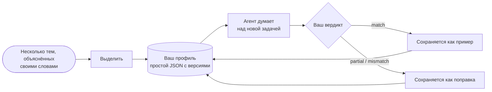

# Профили мыслителя: рассуждать как конкретный человек

::: tip Может ли SDK рассуждать как я?
**Да: он может подражать тому, как рассуждает конкретный человек.** Когнитивный агент может следовать *вашему* порядку внимания, взвешивать *ваши* приоритеты, применять *ваши* рефлексы и отвергать то, что отвергли бы *вы*. Он учится этому на нескольких задачах, которые вы объясняете своими словами; каждый раз, когда вы говорите ему, где он ошибся, поправка добавляется в его инструкции, а степень вашего согласия показывает, приближается ли он к вам.

Он подражает **способу рассуждать**, а не человеку: он не знает того, чего вы не записали, и не решает за вас. SDK не утверждает, насколько близко он к вам подходит: **это измеряете вы**, от запуска к запуску, в виде процента согласия, который вы ставите его ответам.
:::

{.illustration}

## Что значит «рассуждать как вы» {#what-reasoning-like-you-means}

| Он подражает | Он не подражает |
| --- | --- |
| **Порядку**, в котором вы смотрите на задачу (сначала что она действительно позволяет, затем её ограничения…) | Вашим **знаниям**: тому, что вы знаете, но никогда не записывали, если только вы не передадите это как контекст или наблюдения |
| Вашим **приоритетам** (что для вас важнее всего, по порядку) | Вашим **воспоминаниям** и вашей жизни: он знает только образцы, поправки и контекст, которые вы ему дали |
| Вашим **рефлексам** («когда сервис платный, я сначала ищу бесплатную альтернативу») | Интуициям, которые вы никогда не облекали в слова |
| Тому, что заставляет вас **отвергнуть** идею | Вашей **ответственности**: его ответ — это предсказание того, что подумали бы вы, а не решение, принятое за вас |
| Вашему **отношению к риску** | Вашей уверенности в том, как устроен мир: утверждениям по-прежнему нужны доказательства, как в любом когнитивном агенте |
| **Ошибкам, которые вы исправили**: ему предписано их не повторять | |

## Как это работает, шаг за шагом {#how-it-works-step-by-step}



### Шаг 1: объясните несколько тем своими словами {#step-1-explain-a-few-topics-in-your-own-words}

**Образец** — это одна тема, над которой вы рассуждали, записанная так, как она пришла вам в голову. Беспорядочность допустима. Образец состоит из трёх частей:

| Поле | Что писать | Пример |
| --- | --- | --- |
| `topic` | Тема в нескольких словах | «Робот, который умеет убирать только кухни» |
| `reasoning` | Как вы к ней подошли: на что посмотрели сначала, что проверили, что заставило вас сомневаться, почему | «Что он на самом деле делает? Только одна комната, значит, ограничение — обобщение. Мог бы он выучить другую комнату по нескольким примерам?…» |
| `conclusion` | Что вы заключили или что сделали бы (необязательно, но тогда образец становится калибровочным примером) | «Построить небольшой адаптивный цикл и проверить его на второй комнате» |

Пять–десять образцов на **разные** темы работают лучше, чем много образцов на одну тему: механизм выделения ищет то, что повторяется **между** темами, а закономерность, замеченная один раз, слаба.

### Шаг 2: выделите свой профиль {#step-2-distill-your-profile}

```ts
const profile = await sdk.distillThinkerProfile({
  id: 'nicolas',
  name: 'Nicolas',
  model: 'gpt-4o',
  samples: [
    {
      topic: 'Typed decision APIs like Jev',
      reasoning:
        'What does it really allow? Then the limits: closed, US-only, paid. Is there an open clone? ' +
        'Could it become the controller of my agents? I would benchmark it on my own traces first.',
      conclusion: 'Use an open clone as the controller and benchmark it against Jev',
    },
    { topic: 'World models', reasoning: 'Structure beats scale. Test on a small chaotic system before anything big.' },
  ],
});
```

Что именно происходит:

1. Образцы проверяются: у каждого должны быть тема и рассуждение.
2. Один вызов языковой модели играет роль *когнитивного аналитика*. Он ищет **повторяющиеся операции** вашего рассуждения, а не ваши мнения: что вы рассматриваете первым, какие вопросы задаёте, насколько далеко развиваете идею, что заставляет вас отвергнуть решение, как вы относитесь к риску, стоимости и новизне. Ему предписано оставлять только закономерности, подкреплённые образцами, и отдавать предпочтение тем, что встречаются в нескольких образцах.
3. Его ответ проверяется по схеме профиля. Некорректный ответ один раз отправляется обратно вместе с ошибкой; при второй неудаче выбрасывается `ThoughtGenerationError`, а не возвращается недоделанный профиль.
4. Образцы, у которых есть вывод, сохраняются в профиле как **примеры**, поэтому профиль содержит и извлечённый метод, и доказательства, из которых он получен.

Результат — простой JSON. **Прочитайте его**: если какой-то шаг или приоритет неверен или отсутствует, исправьте его вручную. Вы знаете себя лучше, чем одно извлечение.

### Шаг 3: дайте агенту думать как вы {#step-3-let-the-agent-think-as-you}

```ts
const twin = sdk.createCognitiveAgent({
  name: 'my-twin',
  model: 'gpt-4o',
  profile,
  systemPrompt: "Write every statement and the answer in French, in the thinker's own voice.", // optional
});

const run = await twin.think({
  problem: 'A bank offers you a stable, well-paid CTO job maintaining legacy systems. What do you decide?',
});
console.log(run.decision?.status, run.decision?.answer);
```

Профиль **копируется при старте запуска**, поэтому поправка, данная во время запуска, применяется к следующему. Он включается в инструкции каждого шага рассуждения, а на последнем шаге `decide` запрашивается *ответ, который дал бы мыслитель*, с обоснованием, следующим порядку внимания мыслителя. Все такие места перечислены в разделе [Где профиль имеет вес](#where-the-profile-weighs-and-where-it-never-does).

### Шаг 4: скажите ему, где он ошибся {#step-4-tell-it-where-it-went-wrong}

После запуска вынесите свой **вердикт**: рассуждал ли он так, как рассуждали бы вы?

```ts
// "Yes, exactly what I would have thought."
await twin.learnFromFeedback(run.runId, { verdict: 'match' });

// "No, I would have gone another way."
await twin.learnFromFeedback(run.runId, {
  verdict: 'mismatch',
  expected: 'Prototype with the free clone first, then compare with Jev on 100 real tickets',
  lesson: 'Always test the free option on real data before paying',
});

// "You are 50% right, and here is where you went wrong."
await twin.learnFromFeedback(run.runId, {
  verdict: 'partial',
  agreement: 0.5,
  wrongAbout: ['ignored the free option', 'overestimated the integration cost'],
  expected: 'Benchmark the open clone on our own tickets before deciding',
});
```

| Поле | Значение | Обязательно |
| --- | --- | --- |
| `verdict` | `match` (рассуждал как вы), `partial` (частично), `mismatch` (совсем нет) | Всегда |
| `agreement` | Насколько вы с ним согласны, от 0 до 1: `0.8` означает «верно на 80%» | Нет |
| `expected` | К какому выводу пришли бы вы | При `partial` и `mismatch` |
| `wrongAbout` | Где рассуждение пошло не так, вашими словами | Нет |
| `lesson` | Правило, которое нужно запомнить на следующий раз (по умолчанию `expected`) | Нет |
| `notes` | Всё остальное, сохраняется в событии | Нет |

Что с этим происходит:

| Вердикт | Влияние на профиль |
| --- | --- |
| `match` | Запуск становится калибровочным **примером**: его вопрос, краткое изложение шагов рассуждения и вывод. Каждый `match` оставляет 10 самых свежих примеров, включая выделенные образцы. |
| `partial` / `mismatch` | Записывается **поправка**: к чему пришёл агент, чего ожидали вы, ваше согласие, где он ошибся и урок. Хранятся 20 самых свежих. Поправки завершают профиль в инструкциях каждого шага рассуждения как высший приоритет: «не повторяй эти ошибки». Контроллер Jev видит последние пять уроков. |

Каждый вердикт увеличивает патч-версию профиля (`1.0.0` → `1.0.1`) и добавляется к запуску как событие `cognition.feedback` с версией профиля до и после. Запуск без решения не может получить обратную связь: судить нечего.

`learnFromFeedback` возвращает уточнённый профиль и сохраняет его в агенте. **Сохраните его** (`twin.getProfile()` — это простой JSON), иначе уроки будут потеряны, когда ваш процесс остановится.

### Шаг 5: измерьте, насколько близко он подходит {#step-5-measure-how-close-it-gets}

SDK записывает ваши вердикты; он не оценивает сам себя. Чтобы узнать, действительно ли он рассуждает как вы, следуйте простому протоколу:

1. Подготовьте **новые задачи**, которых агент никогда не видел, на разные темы.
2. **Сначала напишите собственный ответ**, до того как прочитаете ответ агента, чтобы его ответ не повлиял на ваш.
3. Запустите агента, затем оцените каждый ответ: `agreement`, в чём он ошибся (`wrongAbout`), чего вы ожидали (`expected`).
4. Дайте эту обратную связь и сохраните уточнённый профиль.
5. В следующем раунде возьмите **другие новые задачи** и сравните среднее согласие с предыдущим раундом.

Если среднее растёт на задачах, которых он никогда не видел, это признак того, что он усваивает ваш *способ* рассуждать, а не только ответы, которые вы поправили; на нескольких задачах рост может быть и случайным, поэтому продолжайте несколько раундов. Если он улучшается только на тех задачах, которые вы поправили, он копирует ответы.

```ts
const scores = [0.4, 0.6, 0.5]; // the agreement you gave this round
const average = scores.reduce((sum, value) => sum + value, 0) / scores.length; // 0.5, that is 50%
```

## Устройство профиля {#anatomy-of-a-profile}

Профиль можно написать и вручную:

```ts
import { defineThinkerProfile } from '@sdk-ai-agents/core';

const builder = defineThinkerProfile({
  id: 'builder',
  name: 'Pragmatic builder',
  summary: 'Looks for what a technology really enables, then its limits, then a prototype.',
  reasoningSequence: [
    { id: 'real-capability', instruction: 'Establish what the technology really enables' },
    { id: 'limits', instruction: 'Look for its limits immediately' },
    { id: 'workaround', instruction: 'Imagine how to work around those limits' },
    { id: 'product', instruction: 'Check whether it can become a product' },
    { id: 'automation', instruction: 'Ask how the product could run itself' },
    { id: 'generalize', instruction: 'Extrapolate towards a more general architecture' },
    { id: 'prototype', instruction: 'Design the smallest prototype that tests it' },
  ],
  priorities: ['Real capability over hype', 'Free and open options first', 'Fast feedback'],
  heuristics: [{ when: 'a service is paid and closed', action: 'look for an open alternative before paying' }],
  rejectionCriteria: ['Cannot be tested with a prototype', 'Locks data in a vendor'],
  riskAppetite: 'high',
});

const agent = sdk.createCognitiveAgent({ name: 'me', model: 'gpt-4o', profile: builder });
```

`defineThinkerProfile` проверяет профиль и заполняет недостающее значениями по умолчанию (пустые списки, `riskAppetite: 'medium'`, `version: '1.0.0'`).

| Поле | Простыми словами | Как его использует движок |
| --- | --- | --- |
| `id`, `name`, `version` | Кого описывает этот профиль и какая это его редакция | Записывается в каждом запуске, чтобы вы знали, какая версия профиля его породила |
| `summary` | Одно предложение, описывающее стиль | Пишется в начале профиля в промптах |
| `reasoningSequence` | Шаги, которые вы проходите, по порядку | Пишется как «Порядок внимания (следуй ему)»; итоговый ответ следует ему |
| `priorities` | Что важнее всего, начиная с самого важного | Пишется в промптах; используется, чтобы судить, насколько выбор вам подходит |
| `heuristics` | Ваши рефлексы: «когда …, то …» | Пишутся в промптах как правила |
| `rejectionCriteria` | Что заставляет вас отбросить идею | Используется для критики вариантов и для отклонения тех, которые отвергли бы вы |
| `riskAppetite` | `low`, `medium` или `high` | Пишется в промптах |
| `examples` | Запуски и образцы, которые вы одобрили | Показываются как «одобренные примеры рассуждения мыслителя»: модель калибруется по ним |
| `corrections` | Уроки из запусков, с которыми вы не согласились | Показываются в конце профиля как высший приоритет |

Без профиля агенты используют `DEFAULT_THINKER_PROFILE` — нейтрального аналитика, который ставит доказательства на первое место.

## Где профиль имеет вес, а где никогда {#where-the-profile-weighs-and-where-it-never-does}

| Момент рассуждения | Учитывается ли ваш профиль? |
| --- | --- |
| **Каждый шаг рассуждения** (представить, выдвинуть гипотезы, смоделировать, покритиковать, сравнить, решить, прочитать результат инструмента) | Да: весь профиль входит в инструкции, которые получает языковая модель. Он не включается только в короткий запрос, выбирающий, какой инструмент вызвать |
| **Выбор следующего шага** | С контроллером Jev — да: он видит ваш порядок внимания, приоритеты, критерии отказа, отношение к риску и пять последних уроков. Без Jev эвристический контроллер следует фиксированному порядку, а ваш профиль вместо этого определяет содержание каждого шага |
| **Критика** | Да: варианты атакуются с помощью ваших критериев отказа |
| **Насколько выбор вам подходит** (`preferenceFit`) | Да: это и есть её назначение. Выбор, который признан соответствующим одному из ваших критериев отказа, получает более низкий ранг и отвергается, когда судья в этом уверен (Jev отдаёт всю вероятность этому уровню) или, при судье на основе языковой модели, когда модель его отвергает |
| **Насколько доказательства подкрепляют вариант** (`support`) | **Нет.** С Jev этот вопрос отправляется без вашего профиля; с языковой моделью модели предписано игнорировать предпочтения |
| **Какой выбор действия получает первый ранг** | Да, для выборов действия, по умолчанию с весом 40% |
| **Можно ли зафиксировать выбор действия** | Да, когда вы явно его предпочитаете и факты не говорят против него |
| **Правдоподобно ли утверждение о мире** | **Никогда** в коде: две оценки никогда не смешиваются. При судье на основе языковой модели разделение держится на его инструкциях, а утверждение, которое модель ошибочно пометит как выбор, может пойти по пути предпочтений (см. [Объявленные виды](./evidence-and-verification#not-there-yet)) |

### Две оценки {#the-two-scores}

Когда варианты сравниваются, каждый получает до двух оценок от 0 до 1:

| Оценка | Вопрос | 0 | 0,25 | 0,5 | 0,75 | 1 |
| --- | --- | --- | --- | --- | --- | --- |
| `support` | Насколько хорошо его подкрепляют факты, наблюдения, тесты и критика? | Опровергнут | Слабая поддержка | Правдоподобен | Сильная поддержка | Установлен |
| `preferenceFit` | Насколько этот выбор подходит мыслителю? (только выборы действия) | Соответствует критерию отказа | Плохо подходит | Приемлемо подходит | Хорошо подходит | Идеально подходит |

Это уровни, о которых спрашивает оценщик гипотез Jev; судья на основе языковой модели даёт для каждой оценки число от 0 до 1, которое читается так же. Обе оценки — суждения, а не измеренные вероятности.

### Как выбор ранжируется и фиксируется {#how-a-choice-is-ranked-and-committed}

Возьмём задачу о работе в банке, приведённую выше, с двумя вариантами:

| Вариант | `support` | `preferenceFit` | Оценка ранжирования: 60% поддержки + 40% соответствия |
| --- | --- | --- | --- |
| H1: принять предложение | 0,5 (правдоподобно) | 0,25 (плохо подходит: ничего нового не построить) | 0,6 × 0,5 + 0,4 × 0,25 = **0,40** |
| H2: отказаться и продолжать строить | 0,5 (правдоподобно) | 1 (идеально подходит) | 0,6 × 0,5 + 0,4 × 1 = **0,70** |

Факты одинаково подкрепляют оба варианта; ваши предпочтения ставят H2 на первое место. Вес — это `limits.preferenceWeight` (0,4).

Чтобы быть **зафиксированным** (твёрдым ответом, а не предварительным ответом или воздержанием), вариант должен пройти [страж вывода](./evidence-and-verification#the-conclusion-guard). Его доказательств достаточно одним из двух способов:

- **только за счёт доказательств**, для гипотезы любого вида: `support` не ниже `limits.decisionThreshold` (0,75 — «сильная поддержка»);
- **за счёт вашего выбора**, только для выбора действия: `preferenceFit` не ниже `limits.decisionThreshold` (0,75 — «хорошо подходит») **и** `support` не ниже `limits.minProposalSupport` (0,35 — чуть выше «слабой поддержки»).

H2 идёт вторым путём: поддержка 0,5 ≥ 0,35, соответствие 1 ≥ 0,75. Он фиксируется с **уверенностью 0,5**, потому что уверенность решения никогда не превышает его поддержку доказательствами: ответ говорит «это выбор мыслителя», а не «это доказано».

Почему существует второй путь: у вопроса вроде *«вы бы согласились на эту работу?»* мало доказательств, которые можно взвесить. Человек решает его исходя из своих приоритетов при условии, что факты не говорят против такого выбора. В реальном запуске с профилем мыслителя такие вопросы до появления второго пути заканчивались без зафиксированного ответа.

Почему он закрыт для утверждений: утверждение вроде *«ИИ этого стартапа распознаёт ложь с точностью 99%»* — это **правило** о мире. Даже если вам очень хотелось бы, чтобы оно было верным, оно фиксируется, только если его поддержка доказательствами достигает 0,75, — при условии, что модель помечает его как правило, что ей и предписано делать (см. [Объявленные виды](./evidence-and-verification#not-there-yet)). Предпочтения могут выбирать, что делать; они никогда не делают что-либо истинным.

## Ограничения {#limits}

- **Модель имеет значение.** Профиль — это набор инструкций: небольшая модель следует им менее точно, чем крупная.
- **Он знает только то, что вы ему дали.** Передавайте факты вашей ситуации как `context` или `observations`, когда они важны.
- **Первый профиль — это набросок.** Несколько образцов дают несколько закономерностей; уточняют профиль именно поправки.
- **Его память ограничена.** Хранятся 20 поправок, а каждый `match` оставляет 10 самых свежих примеров (выделенный профиль может начинаться с большего числа); самые старые отбрасываются.
- **Точность подражания — не истина.** Ваша обратная связь измеряет, рассуждал ли агент **как вы**, а не был ли он **прав**. Чтобы проверить утверждение на соответствие миру, дайте агенту [оценщик результатов](./evidence-and-verification#predictions-and-the-outcome-evaluator).
- **Это персональные данные.** Образцы, профили и события этих запусков описывают, как думает человек. Храните их в закрытом виде, никогда в публичном репозитории, и спрашивайте согласия, прежде чем составлять профиль другого человека.

## Профили — это данные {#profiles-are-data}

Профили — это простой JSON: сохраняйте их где угодно и загружайте снова через `agent.setProfile(profile)` или параметр `profile`. События содержат `profileId` и `profileVersion`, поэтому вы всегда знаете, какая версия профиля породила запуск.

## Обучите собственный контроллер {#train-your-own-controller}

Каждый выбор операции записывается вместе с состоянием, которое видел контроллер. Экспортируйте их в формате JSON Lines:

```ts
const jsonl = await sdk.exportControllerDataset(); // or pass runIds
```

```json
{"runId":"run_…","step":3,"state":{…},"available":["hypothesize","simulate","critique","decide"],"operation":"simulate","controller":"jev","confidence":0.82,"usedFallback":false,"runStatus":"completed","feedback":"partial","agreement":0.5}
```

Отфильтруйте по `feedback: "match"`, и у вас будут примеры для обучения с учителем того, как *вы* выбираете следующий ход: достаточно, чтобы дообучить небольшую открытую модель и подключить её как пользовательский `CognitiveController`, без платы за каждый вызов.
