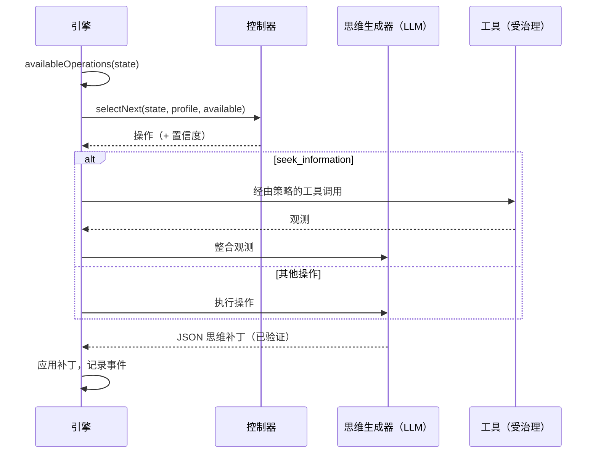

# 认知智能体

认知智能体不会一次性给出答案。它维护一个**显式的心智状态**，并一次执行一个**认知操作**来改进它，直到能够确定一个有依据的决策。

::: tip 通俗地说
通常的 AI 一口气给出答案，它的推理随之消失。认知智能体则像一个带着笔记本工作的人：它写下自己知道什么、假定什么、还不知道什么，列出几个选项，设想它们的后果，找出可能出错的地方，用你允许的工具核实事实，比较这些选项，然后才做决定。其中每一个动作都是一个**操作**，每一个都记在笔记本上，所以事后你可以重读整个推理过程。如果它无法得出可靠的结论，它会直接说出来。本页用到的每个术语都在[关键术语通俗解释](./glossary#how-a-cognitive-agent-reasons)中有说明。
:::

{.illustration style="max-width:460px"}

```ts
const agent = sdk.createCognitiveAgent({
  name: 'analyst',
  model: 'gpt-4o',
  tools: [lookupMetric],
  profile: myProfile, // optional, see Thinker profiles
});

const { status, answer, decision, state, runId } = await agent.think({
  problem: 'Should we build or buy our analytics module?',
  context: { budget: '10k EUR', deadline: 'before Q4' },
  observations: [{ content: 'Churn was 4% last month', originGroup: 'billing' }], // optional
});

decision?.status; // 'committed' | 'provisional' | 'abstain'
```

::: tip 证据优先
观测如何被追踪、预测如何被检验、结论如何被把关，请参见[证据与验证](./evidence-and-verification)。
:::

## 心智状态 {#the-mental-state}

心智状态是朴素的、有类型的数据。每一项都有一个稳定的 id，供模型引用。

| 部分 | Id | 内容 |
| --- | --- | --- |
| `observations` | `O1…` | 观测到的东西——随问题提供的、由工具或检验返回的——连同它的出处 |
| `facts` | `F1…` | 带来源（`input`、`tool`、`inference`）的陈述、它们所依据的观测，以及状态（`active`、`superseded`、`retracted`） |
| `assumptions` | `A1…` | 推理当作成立的东西 |
| `constraints` | `K1…` | 任何答案都必须遵守的东西 |
| `unknowns` | `U1…` | 悬而未决的问题——`open`、`resolved` 或 `dropped`，并记录尝试次数 |
| `hypotheses` | `H1…` | 提议、规则或解释，带有前提、模拟、批判、证据 `support`、`preferenceFit` 和状态 |
| `comparisons` | `R1…` | 观测之间的关系：相似、差异、演变、不相容、反例 |
| `predictions` | `P1…` | 一个假设预测了什么、什么会驳倒它，以及检验结果 |
| `contradictions` | `C1…` | 各项之间的冲突，带有类别，直到以引用的证据解决为止 |
| `failures` | `X1…` | 已经失败过的东西，以免盲目重试 |
| `knowledge` | `M1…` | 同一作用域之前的运行通过真实检验确立的东西，在本次运行开始时召回（参见[跨运行记忆](./memory)） |
| `confidence`、`evidenceRevision` | | 最佳答案的证据支持度；一个让较早评估变为过时的计数器 |
| `decision`、`trail` | | 最终决策及其状态，每一步一行记录 |

{.illustration style="max-width:760px"}

状态**从不就地修改**。每个操作产生一个*思维补丁*；补丁被记录为一个 `cognition.thought` 事件；状态就是所有补丁依次折叠（fold）的结果。正因如此，`sdk.getMentalState(runId)` 能够准确重建任何一次运行，即使是在几个月之后。

## 操作 {#the-operations}

| 操作 | 作用 | 何时可用 |
| --- | --- | --- |
| `represent` | 提取事实、假定、约束和未知项 | 总是第一步；存在未决矛盾时会再次执行 |
| `compare_observations` | 把观测联系起来：相似、差异、变化、反例 | 有两条或更多可比较的观测（不含重复项和检验结果），且自上次比较以来有新观测 |
| `hypothesize` | 提出新的提议、规则或解释 | 活跃假设的数量少于 `maxHypotheses` |
| `simulate` | 逐步推演后果，并给出可检验的预测 | 有假设还没有模拟 |
| `test_prediction` | 对一条已记录的预测运行你的结果评估器——不调用 LLM | 已配置评估器，有待检验的预测，且还有检验预算 |
| `revise` | 把被证据否定的假设变成一个限定作用域的变体 | 有被驳倒或被否定的假设还没有变体 |
| `critique` | 找出一个假设可能失败的最有力理由 | 有假设还没有批判 |
| `seek_information` | 调用一个受治理的工具来回答一个未决的未知项 | 存在工具，有未决的未知项，且还有工具预算 |
| `compare` | 评判证据支持度，以及各项提议有多适合思考者 | 自上次比较以来，有经过批判的假设发生了变化，或者证据发生了变化 |
| `decide` | 确定一个答案、理由、置信度和后续行动 | 有假设通过了[结论守卫](./evidence-and-verification#the-conclusion-guard) |

**代码决定什么是可能的，控制器决定什么是有用的。** 前置条件根据状态计算，控制器只能在可用的操作中做选择。

以下规则由代码强制执行，无论模型说什么：

- 一个没有反驳的 `fatal` 批判，或者一条被驳倒的预测，会否决它所针对的假设；
- 被否决的假设不能复活、重述或被选中——只能被修正为一个说明了改动之处的变体；
- 代码从不把偏好混入论断的证据支持度，模型也无法设定状态的置信度；
- 一个矛盾只能被解决一次，而且只能通过引用能解决它的观测或事实来解决；
- 如果一个步骤没有改变它本该改变的任何东西，或者决策被推迟，都算作一次失败尝试；连续两次之后，这个操作就不再提供，直到另一个步骤带来新证据（参见[不浪费的预算](./evidence-and-verification#a-budget-that-is-not-wasted)）；
- 出处（观测、检验结果）和决策状态由引擎写入：包含它们的模型回复会被剥离；
- 对未知 id 的引用会被忽略，并作为 `issues` 报告在思维事件中；
- 同时参与考虑的假设最多有 `maxHypotheses` 个：多出来的提议会被丢弃并报告；
- 一个未知项在两次尝试未果后就不再被调查，如果没有任何可用工具能回答它，则立即停止调查；重新框定问题（针对矛盾执行 `represent`）最多提供三次；
- 失败的操作会被记录为失败，不算作已完成；
- **最后一步总是一次决策尝试**：没有通过结论守卫的答案会变成 `provisional`（附带缺少的内容）或 `abstain`；如果模型根本无法给出决策，引擎会弃权并记录原因。

## 控制器 {#controllers}

控制器选择下一个操作。



| 控制器 | 如何选择 | 何时使用 |
| --- | --- | --- |
| `heuristic` | 固定的关注顺序：表征 → 修正 → 比较观测 → 提出假设 → 模拟 → 检验预测 → 批判 → 寻求信息 → 比较 → 决策 | 没有 Jev 时的默认选项，确定性，免费 |
| `typed` | 每一步一次 Jev 请求：一个在可用操作中做选择的 Choice，以及一个“准备好决策了吗？”的 Noul | 带有校准置信度的自适应推理 |
| 你自己的 | 实现 `CognitiveController.selectNext()` | 微调过的本地模型、业务规则…… |

使用 `controller: 'auto'`（默认值）时，如果 SDK 有类型化决策后端，智能体就使用 Jev，否则使用启发式控制器。当 Choice 的置信度低于 `minConfidence`（0.35）、客户端出错，或者答案不是一个可用操作时，类型化控制器会**回退到启发式控制器**。抛出异常或返回不可用操作的自定义控制器，同样会被启发式控制器替代。每一次回退都记录在选择事件的 `fallbackFrom` 字段中。

```ts
sdk.createCognitiveAgent({
  name: 'analyst',
  model: 'gpt-4o',
  controller: 'typed',
  controllerOptions: { minConfidence: 0.5, readinessThreshold: 0.85 },
  assessment: 'typed', // compare hypotheses with Jev Score questions
});
```

## 推理中的工具 {#tools-inside-reasoning}

`seek_information` 使用**原生的推理引擎和动作引擎**：LLM 为未决的未知项挑选一个工具，动作引擎检查这个工具是否**交给了这个智能体**，按策略（包括运行限制，参见[限制与策略](#limits-and-policies)）、审批和预算验证这次调用，结果被记录为一条指向其 `action.executed` 事件的**观测**，然后作为 `source: "tool"` 的事实整合进来。即使对它的解读失败，这条观测也会保留。被拒绝、被拦截或出错的工具会变成一条已记录的失败，推理继续进行。

## 限制 {#limits}

```ts
sdk.createCognitiveAgent({
  name: 'analyst',
  model: 'gpt-4o',
  limits: {
    maxSteps: 12,              // the last one always decides
    timeoutMs: 180_000,
    maxHypotheses: 3,          // in play at the same time
    maxToolCalls: 5,
    decisionThreshold: 0.75,   // evidence support a committed answer needs (see minProposalSupport)
    maxConsecutiveFailures: 3, // then the run fails (and alerts you, if incidents are on)
    maxPredictionTests: 4,     // calls to the outcome evaluator per run
    preferenceWeight: 0.4,     // weight of the thinker's preferences when ranking proposals
    minProposalSupport: 0.35,  // evidence support enough for a choice of action the thinker clearly prefers
  },
  evaluator: myBench,          // optional OutcomeEvaluator, enables test_prediction
  knowledge: { store, scope: 'my-domain' }, // optional memory across runs
});
```

限制会在创建智能体时验证：`maxSteps: 0` 或超出计时器所能支持范围的超时，会抛出 `ValidationError`，而不是悄无声息地让一道安全保障失效。`minProposalSupport` 不能超过 `decisionThreshold`；把它设为等于 `decisionThreshold`，就只有证据能让答案被确定。如果你调低了 `decisionThreshold` 而没有设置 `minProposalSupport`，这个下限会随之降低。

### 限制与策略 {#limits-and-policies}

适用于该智能体的预算和超时策略——它的 `policies` 中的策略以及全局策略——会在**每一步之前**、在这一步的任何模型调用之前检查，并在每次工具调用之前再次检查。它们看到的是运行的进度：`maxSteps` 统计已完成的步骤，`maxTokens` 统计该运行的模型调用（思维及其修复、工具选择、类型化决策）的 token 数，`maxDuration` 统计自运行开始以来的时间。按时间段计算的 token 和费用预算（带 `maxTokens` 或 `maxCost`、不带 `toolName` 的 `budgetLimit`）也会在每一步之前检查，运行记录的每次模型调用都会计入其中（参见 [API 成本](./costs#budgets)）。一个步骤会被当作类型为 `continue` 的意图来检查：条件要求工具调用（`intention.type` 等于 `tool_call`）的策略只适用于工具调用。允许列表、自定义策略、调用预算（`maxToolCalls`）和审批只涉及工具调用，动作为 `require_approval` 的限制规则也是如此：步骤从不等待审批。每一步的检查都会记录在策略审计（`sdk.getPolicyAuditTrail`）中，但只针对可能适用于步骤的策略。

最先达到的限制会结束运行（工具调用的限制只会跳过调用），而两类限制结束运行的方式不同：

| 限制 | 智能体的 `limits` | 策略 |
| --- | --- | --- |
| 步骤 | `maxSteps`：最后一步做出决定；`completed`，决定为 `committed`、`provisional` 或 `abstain` | `maxSteps`：下一步被拒绝；`failed` |
| 时间 | `timeoutMs`：运行被中止，进行中的调用会收到中止信号；`failed`，`Timeout exceeded (… ms)` | `maxDuration`：在步骤之间和工具调用之前检查，进行中的调用会继续；`failed`，`Timeout (… ms) exceeded` |
| token、费用 | — | `maxTokens`、按时间段计算的预算：下一步被拒绝；`failed` |
| 工具调用 | `maxToolCalls`：不再提供 `seek_information` | 被拒绝的调用是一条已记录的失败，推理继续进行 |

被拒绝的步骤会记录为 `policy.violated`——带有 `intention: { type: 'continue' }`、步骤 `step`、原因 `reason` 和被违反的策略 `violatedPolicies`——随后是带有该策略原因的 `run.failed`；结果带有 `status: 'failed'`，其 `error` 为 `PolicyViolationError`。被运行限制拒绝的工具调用会记录为 `policy.violated`，同时记录为一次失败的操作；由于限制仍然超出，下一步会被拒绝，运行失败。若想以决定而不是拒绝结束，请让智能体的 `maxSteps` 不超过策略的 `maxSteps`：这样它的最后一步会在策略拒绝任何东西之前做出决定。

## 模型输出无效 {#invalid-model-output}

每个操作都有一份由 Zod 验证的严格 JSON 约定。如果回复不是有效的 JSON、缺少必需字段或使用了错误的值，它会连同验证错误被退回**一次**。操作不允许写入的字段（例如在 `simulate` 期间写入 `decision`）会被忽略，并列在 `ignoredFields` 中。如果修复也失败了，这个操作会被记录为失败，循环继续。

## 停止、取消、超时 {#stop-cancel-time-out}

```ts
const pending = agent.think({ problem });
await agent.stop();          // or agent.stop(runId)
const result = await pending; // status: 'cancelled'
```

超时会得到 `status: 'failed'` 以及 `Timeout exceeded (… ms)`，这次运行在事件日志中被标记为失败。`sdk.stopRun(runId)` 同样可以停止认知运行。超时和停止在操作之间检查，并作为中止信号传给你的提供商；内置的 OpenAI 和 Anthropic 提供商不会取消已经发出的请求，所以一次缓慢的调用会在厂商自己的超时时刻结束。

画像在**运行开始时被快照**：运行进行期间给出的反馈，会应用到下一次运行。

## 安全 {#security}

认知智能体会读取并非它自己写的文本：工具结果、MCP 工具描述、上下文中的文档。请把这些都视为**不可信的输入**——其中可能包含针对模型的指令（prompt 注入）。SDK 限制了这类文本能造成的影响：

- 智能体只能调用交给它的工具，而且每次调用都会检查策略——请把破坏性的工具放在 `require_approval` 策略之后；
- 模型自己从不执行任何东西：它负责提议，由动作引擎验证；
- 心智状态上的不变式由代码强制执行，而不是靠 prompt；
- 每一次工具调用和每一个思维都记录在事件日志中，以供审查。

事件日志保存了目标、上下文和每一个思维，`decision.evaluated` 事件保存了发送给 Jev 的上下文。请对你选用的事件存储应用你的数据所要求的保留和脱敏规则。

## 回放与审计 {#replay-and-audit}

认知运行就是一次普通的运行：

- `sdk.getTrace(runId)` 会在 `policy.checked`、`tool.called` 等事件旁边显示 `cognition.*` 事件；
- `sdk.replay(runId)` 会在不调用 LLM 的情况下重新执行它的工具调用，并重现最终答案——工具限制与原始运行相同，所以智能体当初被拒绝使用的工具会再次被拒绝；每次调用也使用原始运行当时的进度，所以被运行限制拒绝的调用会再次被拒绝；
- `sdk.getMentalState(runId)` 会重建状态；
- `sdk.exportControllerDataset()` 会把运行转换成训练数据（参见[思考者画像](./thinker-profiles#train-your-own-controller)）。
