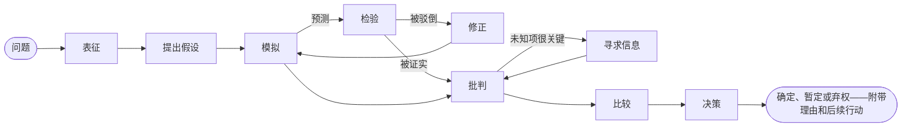

# 简介

**SDK AI Agents** 是一个 TypeScript SDK，用来构建可以放心投入生产的 AI 智能体：它们在行动之前先显式地推理，可以学会*你*的思考方式，而且每一步都受治理、被追踪、有计价、可回放。

{.illustration style="max-width:460px"}

## 为什么还需要一个智能体 SDK？ {#why-another-agent-sdk}

LLM API 给了你一个能力很强的文本生成器。但它们没有让你掌控结论是**如何**得出的：

- 推理发生在模型内部，一次完成，答案一打印出来就消失了；
- 没有任何东西能阻止模型凭猜测行动、调用错误的工具或者超支；
- 出了问题时，你手里只有一段 prompt 和一个答案——而不是事情的来龙去脉。

这个 SDK 在模型**周围**加了一层推理层。LLM 变成众多组件中的一个：

| 层 | 作用 | 所在位置 |
| --- | --- | --- |
| **心智状态** | 事实、假定、约束、未知项、假设、矛盾、置信度 | 随时可以从事件重建 |
| **控制器** | 选择下一个认知操作 | 确定性的启发式规则、Jev 类型化决策，或者你自己的实现 |
| **思维生成器** | 执行一个操作，并返回一个经过验证的 JSON 补丁 | 任意 LLM 提供商 |
| **思考者画像** | 一个人的关注顺序、优先事项和启发式规则 | 带版本的数据，通过反馈不断完善 |
| **治理** | 策略、允许列表、预算、审批、重试 | 在每个动作之前检查 |
| **事件存储** | 唯一的事实来源 | 文件、SQLite 或 PostgreSQL |

## 两类智能体 {#two-kinds-of-agents}

**受治理智能体**（`sdk.createAgent`）运行经典的工具调用循环——LLM 提出一个意图，动作引擎对它进行验证并执行。它们非常适合定义明确的任务。

**认知智能体**（`sdk.createCognitiveAgent`）会显式地推理。它们为决策而生：选择一种架构、对事故进行分诊、评估一个机会、回答“我们是否应该……？”这类问题。

两类智能体共享同样的工具、策略、事件存储、回放、成本和事故告警。

## 它能像特定的人一样推理吗？ {#can-it-reason-like-a-given-person}

**能。** 认知智能体可以模仿某个特定的人推理的方式。你用自己的话讲解几个话题，SDK 就会从中提取一份**思考者画像**：你审视问题的顺序、你的优先事项、你的思维习惯、让你否决一个想法的原因、你对风险的偏好。这份画像会被写进它每个推理步骤的指令里。每次运行之后，你说出自己在多大程度上认同（例如“对了 60%，你错在这里”），这条经验就会保留下来，供之后的运行使用。

它模仿的是一种**推理方式**：它不知道你从未写下来的东西，不会替你做决定，而你的偏好也永远不会让一个关于世界的论断变得更可信。SDK 不会给自己打分：你在一次又一次运行中、针对它从未见过的问题所给出的认同度百分比，才能告诉你它模仿得有多接近。[像特定的人一样推理](./thinker-profiles)会逐步讲解每个环节。

## 你能得到什么 {#what-you-get}

- **显式推理**——在心智状态上执行的十种操作，其不变式由代码强制保证（被否决的假设不能被选中，致命的批判会否决一个假设，最后一步总是给出结论）。
- **可审计的证据**——带出处的观测、由你自己的评估器检验的预测、被修正为限定作用域变体的被驳倒规则、与证据分开保存的偏好，以及一个给出 `committed`、`provisional` 或 `abstain` 的结论守卫；配合知识存储，检验的结果会被记住，供之后的运行使用。
- **像特定的人一样推理**：从你用自己的话讲解的话题中提炼出思考者画像，再用 `match`、`partial` 或 `mismatch` 判定以及认同度百分比来纠正智能体。
- **类型化决策**——[TypeSafe Jev](https://docs.typesafe.ai) 或任何兼容的后端，用经过校准的概率回答 Noul、Choice 和 Score 问题。
- **MCP 连接器**——把你的工具作为 MCP 服务器对外提供，也可以把任何 MCP 服务器导入为受治理的工具。
- **内置运维能力**——按运行统计的 API 成本、不会叠加的重试策略、通过邮件或 webhook 发送的事故告警。
- **原生事件溯源**——无需 LLM 即可回放、黄金追踪记录、回归检测、推理图。

它和其他框架相比如何？请看[为什么选择这个 SDK](./why)。对这些术语还不熟悉？[关键术语通俗解释](./glossary)逐一做了说明。准备好了？前往[快速开始](./getting-started)。
