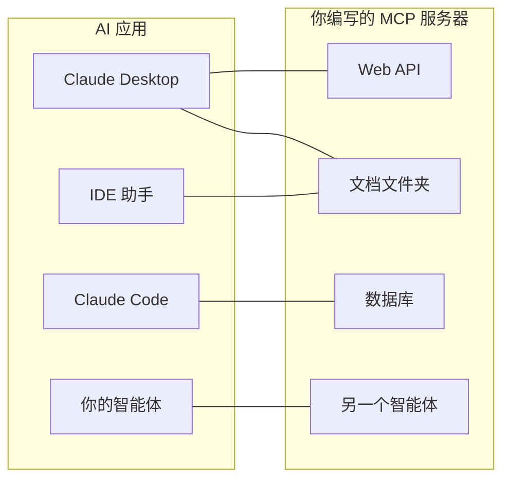
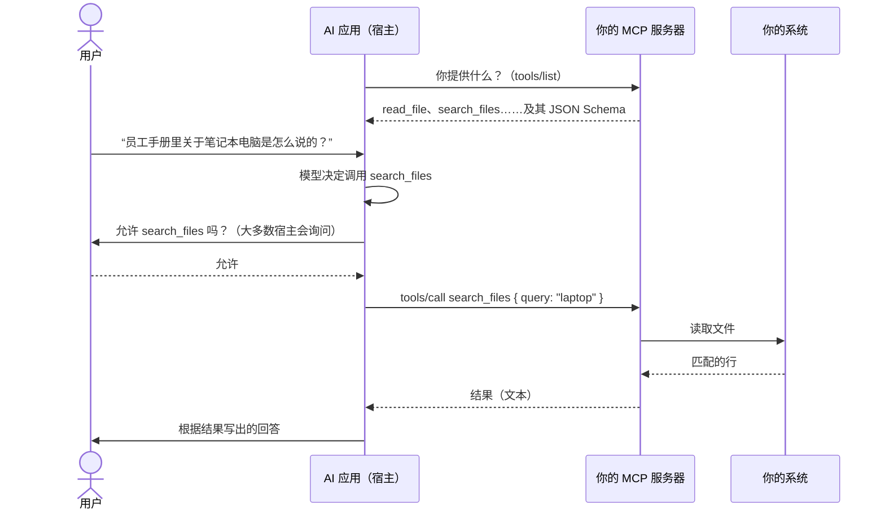
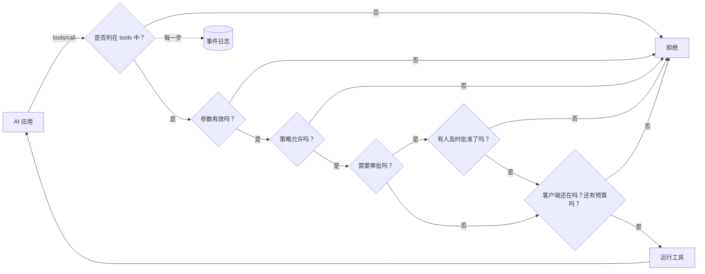

# MCP 通俗解释

**MCP 让一个 AI 应用——Claude Desktop、Claude Code、IDE 助手、你自己的智能体——能够使用你的系统：一个 API、一个文档文件夹、一个数据库、另一个智能体。** 本页解释这个理念和相关术语。接下来的几页会带你从零搭建一个可用的服务器：

1. [5 分钟搭建你的第一个 MCP 服务器](./mcp-first-server)——一步一步，从一个空文件夹到 Claude Desktop。
2. [把任何系统变成 MCP 服务器](./mcp-recipes)——函数、Web API、文件夹、数据库或智能体，各只需一行代码。
3. [部署、安全与排障](./mcp-deploy)——HTTP 部署、身份认证、审批，以及出问题时该怎么办。

## 理念：一个插头，适配所有 AI 应用 {#the-idea-one-plug-for-every-ai-app}

可以把 MCP（Model Context Protocol，模型上下文协议）看作 **AI 应用的 USB-C**。在 USB 出现之前，每种设备都有自己的线缆。在 MCP 出现之前，每个 AI 应用与它要对接的每个系统之间都需要各自的胶水代码：给 Claude 写一套集成，给你的 IDE 写另一套，给你的智能体再写一套。

有了 MCP，你只需**在你的系统前面写一个小程序——一个 MCP 服务器**。随后，任何支持 MCP 的应用都可以接入它，列出它提供的内容并使用它。服务器你只需构建一次；它在任何地方都能用。



该协议是一个开放标准，发布在 [modelcontextprotocol.io](https://modelcontextprotocol.io)。它由 Anthropic 发起；许多 AI 应用都支持它。

## 术语，逐个解释 {#the-words-one-by-one}

| 术语 | 通俗地说 | 示例 |
| --- | --- | --- |
| **宿主**（host，即 AI 应用） | 用户与之对话的应用。它运行语言模型，并决定何时使用你的服务器。 | Claude Desktop、Claude Code、VS Code |
| **MCP 客户端** | 宿主中维持与某一个服务器连接的那部分。你很少会看到它。 | 在 Claude Desktop 中，每个服务器一个 |
| **MCP 服务器** | 你的小程序。它说明自己提供什么，并在被请求时完成工作。 | `serveMcpOverStdio(sdk, { … })` |
| **工具** | 模型可以决定调用的一个动作，带有具名参数。模型读取它的名称、描述和参数列表来做决定。 | `read_file`、`list_pets`、`query` |
| **资源** | 服务器提供给人阅读的一份文档。与工具不同，它由**用户或应用**来挑选（例如通过一个“附加”按钮），而不是由模型挑选。 | `folder://handbook/onboarding.md` |
| **Prompt** | 服务器提供的一个现成的消息模板。本 SDK 暂未提供。 | — |
| **传输方式** | 消息在宿主和服务器之间如何传递。 | stdio、Streamable HTTP |
| **stdio** | 宿主**把你的服务器作为一个程序启动**，运行在同一台电脑上，并通过它的标准输入和标准输出与之对话——就像往里面打字、再读取它打印出来的内容。网络上没有开放任何东西。 | Claude Desktop 中的本地服务器 |
| **Streamable HTTP** | 你的服务器是一个 **Web 服务**；宿主向它发送 HTTP 请求。用于与团队共享一个服务器。 | `https://mcp.example.com/mcp` |
| **JSON Schema** | 对工具参数的描述（名称、类型、哪些是必需的），供模型读取。SDK 会替你编写它。 | `{ "type": "object", "properties": { "path": { "type": "string" } } }` |
| **注解** | 展示给宿主的关于某个工具的提示，比如“这个工具只读取”。宿主可以据此决定何时请用户确认。 | `readOnlyHint: true` |

::: tip 工具与资源
**工具**是模型*去做*的事（“在员工手册里搜索‘laptop’”）。**资源**是用户*交给它*的东西（“把 onboarding.md 附加到这次对话中”）。文件夹配方从同一个文件夹同时提供这两者。
:::

## 一次调用中发生了什么 {#what-happens-during-one-call}



需要记住两件事：

- **模型只能看到服务器列出的内容**：名称、描述、参数 schema，以及它拿回的结果。请写清楚的描述；永远不要在里面放入机密信息。
- **真正发生什么由服务器决定。** 模型提出一次调用；你的服务器可以拒绝它、限制它、请人来审批，或者把它记录下来。这正是本 SDK 发挥作用的地方。

## 本 SDK 增加了什么 {#what-this-sdk-adds}

只用官方的 MCP SDK 也能编写 MCP 服务器。本 SDK 构建在它之上，补充了**安全地、只用一行代码**运行一个服务器所需的东西：

| | 只用官方 MCP SDK | 使用 SDK AI Agents |
| --- | --- | --- |
| 对外提供一个 Web API | 为每个端点编写一个处理函数 | `openApiTools({ spec })`——每个操作一个工具，默认只读 |
| 对外提供一个文件夹 | 自己编写路径检查 | `folderTools({ root })`——符号链接和 `..` 都无法离开这个文件夹 |
| 对外提供一个数据库 | 自己编写 SQL 防护 | `databaseTools({ database })`——单条 SELECT，在数据库层面只读（在 PostgreSQL 上是只读事务，在 SQLite 上是 `query_only`），并有行数上限 |
| 对外提供一个智能体 | — | `cognitiveAgentTool(agent)`——把“Nicolas 会怎么想？”变成一个工具 |
| 不会意外暴露任何东西 | 全靠你自己 | 只暴露你在 `tools` 中列出的工具 |
| 每次调用之前的规则 | 全靠你自己 | [策略](./governed-agents)、预算、允许列表 |
| 先由人来批准 | 全靠你自己 | 标记了 `requiresApproval` 的工具会等待 `sdk.approveAction()`；当客户端取消或断开连接时，以及超过 `approvalTimeoutMs`（默认 50 秒）后，审批会被取消 |
| 知道发生了什么 | 全靠你自己 | 每一次调用和每一次资源读取都是[事件日志](./observability)中的一次运行 |



按照这个顺序：参数无效的调用会在请任何人审批之前就被拒绝，而且一次调用在开始时就计入预算，无论结果如何。

每一次通过 MCP 进行的调用都会被记录为一次独立的运行，其身份为 `mcp:<server name>`：你可以读取它、计算它的成本、针对它设置告警，就像对待一次智能体运行一样。

## 双向支持 {#both-directions}

SDK 在两个方向上都支持 MCP：

- **提供**：把你的工具、API、文件夹、数据库和智能体变成 MCP 服务器——见接下来的几页。
- **使用**：让你自己的智能体使用任何现有 MCP 服务器的工具——见下文。

### 在你的智能体中使用 MCP 服务器的工具 {#use-the-tools-of-an-mcp-server-in-your-agents}

```ts
import { connectMcpServer } from '@sdk-ai-agents/core/mcp';

const crm = await connectMcpServer({
  name: 'crm',
  transport: { type: 'http', url: 'https://mcp.acme.internal/crm', headers: { Authorization: `Bearer ${token}` } },
  toolPrefix: 'crm_',                         // avoid collisions between servers
  include: ['lookup_customer', 'list_invoices'],
  metadata: { riskLevel: 'medium' },          // governance metadata for every tool
  retry: { maxRetries: 2 },
});

const tools = crm.tools.map((definition) => sdk.defineTool(definition));
const agent = sdk.createCognitiveAgent({ name: 'account-manager', model: 'gpt-4o', tools });

await agent.think({ problem: 'Should we offer customer c-42 a discount?' });
await crm.close();
```

| `transport.type` | 适用场景 |
| --- | --- |
| `stdio` | 作为进程启动的本地服务器（`command`、`args`、`env`、`cwd`） |
| `http` | 通过 Streamable HTTP 访问的远程服务器（`url`、`headers`） |
| `custom` | 你自己构建的任何传输方式（WebSocket、用于测试的内存传输……） |

导入的工具保留服务器的 JSON Schema，所以模型能看到真实的参数。一旦用 `sdk.defineTool` 定义，它们的行为就和本地工具完全一样：允许列表、策略、审批（`metadata: { requiresApproval: true }` 会让每次调用都等待人工决定）、预算、重试和追踪记录都适用于每一次调用。如果列出工具失败，连接（以及 stdio 进程）会在抛出错误之前被关闭。

::: warning 只连接你信任的服务器
导入工具的描述和结果会原封不动地到达模型：恶意服务器可以在其中写入指令。只连接你信任的服务器，只给每个智能体它需要的工具，并用审批来保护具有破坏性的工具。
:::

## 值得了解 {#good-to-know}

- MCP 支持位于一个独立的入口 `@sdk-ai-agents/core/mcp` 中，所以除非你用到它，核心包并不依赖 `@modelcontextprotocol/sdk`。工具源（`openApiTools`、`folderTools`、`databaseTools`、`cognitiveAgentTool`……）位于核心包中：你的智能体不经过 MCP 也能使用它们。
- 服务器构建在官方的 MCP TypeScript SDK 1.30 之上，它接受协议修订版 2024-10-07、2024-11-05、2025-03-26、2025-06-18 和 2025-11-25（即它的 `SUPPORTED_PROTOCOL_VERSIONS`，于 2026-09-24 核实）。MCP 网站还记载了一个 2026-07-28 修订版（[架构](https://modelcontextprotocol.io/docs/learn/architecture)，于 2026-09-24 核实），本 SDK 暂不支持。
- 本 SDK 提供**工具**和**资源**。不提供 Prompt、采样（sampling）和信息征询（elicitation）。

下一步：[构建你的第一个服务器](./mcp-first-server)。
