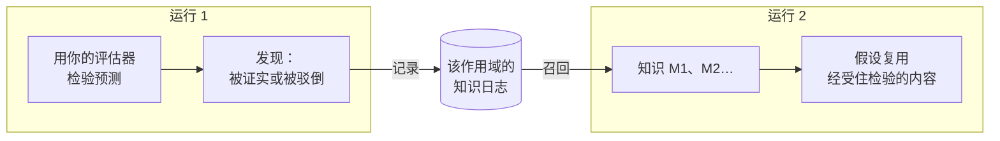

# 跨运行记忆

::: tip 通俗地说
想象一本实验记录本，由在同一个试验台上工作的所有人共用。每当一次实验证实或驳倒了一条规则，就把它连同预期看到什么、实际看到什么一起记下来。下一个人在开始之前先读这本记录本：他们复用经受住检验的东西，也不会原样重试已经失败过的东西。

认知智能体可以维护这样一本记录本。它只记下**真实检验给出的答案**，从不记下模型或思考者仅仅相信的东西。
:::

## 它做什么 {#what-it-does}



1. **在一次运行结束时**，每一条至少有一条预测被你的[结果评估器](./evidence-and-verification#predictions-and-the-outcome-evaluator)证实或驳倒的规则或解释，都会成为一条**发现**：陈述、它的作用域、它在本次运行中修正的规则，以及每一次检验（预期看到什么、实际观测到什么、用的是哪个评估器）。这些发现会被追加到该作用域的**日志**中。
2. **在同一作用域的下一次运行开始时**，最相关的条目会被**召回**，并作为 `knowledge` 放进心智状态，id 为 `M1`、`M2`……
3. **在运行过程中**：
   - 模型会看到每个条目及其状态和最近的检验，并被告知要在作用域内复用已证实的规则，同时引用它；
   - 一个逐字重述**已驳倒**条目（类别、陈述和作用域都相同，不计大小写和标点）的假设会被引擎拒绝；模型会被告知改为提出一个变体，在其前提中引用该条目的 `M` id 并解释那次驳倒，但任何其他措辞或作用域都会作为新假设被接受；
   - 一个重述**已证实**或**有争议**条目的假设会自动与之关联（它的 `M` id 会被加入前提），这样比较步骤就能看到之前的检验。

## 启用它 {#turn-it-on}

```ts
import { FileKnowledgeStore } from '@sdk-ai-agents/core';

const physicist = sdk.createCognitiveAgent({
  name: 'physicist',
  model: 'gpt-4o',
  evaluator: bench,   // without an evaluator, nothing is tested, so nothing is remembered
  knowledge: {
    store: new FileKnowledgeStore('./knowledge'),
    scope: 'inclined-plane',
  },
});

const first = await physicist.think({ problem: 'Does the rolling time depend on the ball?', observations });
const second = await physicist.think({ problem: 'Will a 250 g glass ball take as long as a steel one?' });

second.state.knowledge;
// [{ id: 'M1', status: 'refuted',  statement: 'Rolling time on this plane does not depend on the ball', … },
//  { id: 'M2', status: 'verified', statement: 'For rigid balls, rolling time on this plane does not depend on mass', … }]
```

| 选项 | 默认值 | 含义 |
| --- | --- | --- |
| `store` | （必需） | 日志保存在哪里：`FileKnowledgeStore`、`InMemoryKnowledgeStore` 或你自己的实现 |
| `scope` | （必需） | 这些知识是关于什么的。各次运行只在同一作用域内共享学到的东西。只能包含小写字母、数字、`.`、`-`、`_`：两个只有大小写不同的作用域在 macOS 和 Windows 上会共用同一个文件 |
| `recallLimit` | `10` | 一次运行开始时召回的条目数，0 到 50。`0` 表示只记录、不召回 |
| `record` | `true` | 运行是否记录其检验确立的内容 |

`examples/rule-discovery.ts` 用到了它：运行两次，第二次运行就会从第一次确立的内容开始。

## 记住什么，永远不记什么 {#what-is-remembered-and-what-never-is}

| 会记住 | 永远不记 |
| --- | --- |
| 带有被你的评估器**证实**或**驳倒**的预测的规则和解释 | 行动选择（提议）：它们取决于由谁、在何时做决定 |
| 预期看到什么、实际观测到什么、用的是哪个评估器及其版本 | 从未检验过的预测，或者检验结果为**不确定**的预测 |
| 变体所修正的规则，以及改了什么 | 模型相信的东西、它给出的支持度、思考者的偏好 |
| 哪些运行记录了它 | 运行的最终答案 |

失败或被停止的运行仍然会记录它做过的检验：无论之后发生了什么，一次测量始终有效。

## 状态 {#statuses}

| 状态 | 何时 | 模型会被告知什么 |
| --- | --- | --- |
| `verified` | 到目前为止只有证实 | 在其作用域内复用并引用它；超出这个作用域，它就是一个需要重新检验的假设 |
| `refuted` | 到目前为止只有驳倒 | 永远不要原样再次提出它；变体要在其前提中引用它的 `M` id，并说明有何不同 |
| `contested` | 既有证实也有驳倒 | 它只在某些条件下成立：找出是哪些条件 |

同一作用域中的同一陈述就是同一个条目，不论其大小写或标点。检验按运行和预测去重：同一次运行记录两次不会增加任何东西。

## 召回哪些条目 {#which-items-are-recalled}

作用域中的条目会按确定性的方式排序：

1. 与问题共有的词最多的排在前面（四个字母及以上的词，在陈述和作用域中统计）；
2. 然后是检验次数最多的；
3. 然后是最新的。

排在前面的 `recallLimit` 个条目会被召回。这只是朴素的词语匹配，而不是语义搜索：一条措辞与问题差别很大的规则可能不会被最先召回。请让作用域保持狭窄（一个试验台、一个产品、一个领域），这样一个作用域里的所有内容都是相关的。

## 作用域 {#scopes}

作用域是一道边界，而不是为了整洁而起的文件夹名：

- 各次运行只在同一作用域内**共享**学到的东西；
- 为每个规则相互适用的试验台、产品、数据集或领域各用一个作用域：`inclined-plane`、`checkout-latency`、`churn-model-v3`；
- 如果不同客户或租户的数据必须相互隔离，就永远不要把它们混在同一个作用域里。

## 存储 {#stores}

| 存储 | 适用场景 |
| --- | --- |
| `FileKnowledgeStore(directory)` | 每个作用域一个文件，即 `<directory>/<scope>.jsonl`，每次运行一行。行只会被追加，所以这个文件同时也是一份可读的历史。通过同一个 `FileKnowledgeStore` 实例的写入会被串行化：请在一个进程的各个智能体之间共享同一个实例 |
| `InMemoryKnowledgeStore()` | 测试、原型、短生命周期的进程 |
| 你自己的 `KnowledgeStore` | 由多个进程共享的数据库 |

多个实例或进程同时写入同一个作用域时，应当使用数据库：实现这个端口的三个方法即可。被中断的写入留下的未写完的行会在读取时被跳过并给出警告，下一条记录会从新的一行开始；而一行是有效的 JSON 却不是有效记录时，读取会停止并报告它的行号，因为文件被改动过。

```ts
import type { KnowledgeStore } from '@sdk-ai-agents/core';

const store: KnowledgeStore = {
  async recall({ scope, goal, limit }) { /* the most relevant items of the scope */ },
  async record({ scope, runId, recordedAt, findings }) { /* append one entry */ },
  async list(scope) { /* every item of the scope */ },
};
```

`projectKnowledge(entries)` 把日志记录折叠成条目，`rankKnowledge(items, goal, limit)` 对它们排序，所以自定义存储只需要保存记录（例如每次运行一行），并复用这两个函数。

随时查看一个作用域知道些什么：

```ts
for (const item of await store.list('inclined-plane')) {
  console.log(item.status, item.confirmations, item.refutations, item.statement);
}
```

## 审计与回放 {#audit-and-replay}

- 被召回的条目记录在 `cognition.started` 中（`knowledge.scope`、`knowledge.items`），所以 `sdk.getMentalState(runId)` 能准确重建这次运行知道的东西，而无需再次读取存储，即使存储此后发生了变化。
- 发现记录在一个 `cognition.knowledge_recorded` 事件中（`scope`、`findings`）。
- 出错的存储永远不会让运行停下来：召回失败会在 `cognition.started` 中记录为 `knowledge.error`，运行在没有记忆的情况下继续；记录失败会在 `cognition.knowledge_recorded` 中记录为 `error`。在运行的 `limits.timeoutMs` 内没有响应的存储会被视为出错（缓慢的写入仍可能在之后完成）。如果事件日志本身无法记录这些发现，会打印一条警告，运行结果原样返回。

## 局限 {#limits}

- **词语匹配。** 召回不是语义上的；措辞不同的相关规则可能会被遗漏。
- **只拒绝完全相同的重述。** 只有类别、措辞（不计大小写和标点）和作用域都与一条已驳倒规则相同的重述才会被拒绝；换了措辞的会作为新假设被接受。
- **一次检验就足以成为 `verified`。** 只要有一条预测被证实且没有被驳倒，条目就是已证实的，而用哪条预测来检验一条规则是由模型选择的：一条很弱的预测也照样算作一次证实。
- **作用域是声明出来的，没有检查。** 一条对“刚性球”已证实的规则会连同这个作用域一起显示，模型也会被告知不要在没有新检验的情况下把它用到别处；但代码中没有任何东西去验证这一点。
- **评估器是被信任的。** 记忆的可靠程度取决于你的评估器：一次错误的测量会被当作一次检验记住。
- **每个文件只有一个写入者。** `FileKnowledgeStore` 只会串行化同一个实例的写入；写入同一作用域的两个实例或两个进程之间没有协调。
