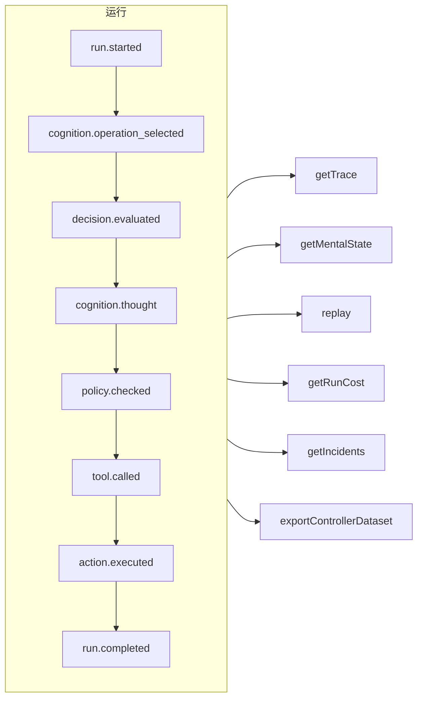

# 可追溯性与回放

每一次运行——受治理的、认知的、直接的类型化决策，或者一次 MCP 工具调用——都是一份**只追加的事件日志**。没有任何事情会在记录之外发生，其他一切都由它推导而来。



## 存储 {#stores}

| 存储 | 适用场景 |
| --- | --- |
| `FileEventStore`（默认） | 开发环境、单进程——每次运行一个 JSON 文件 |
| `SQLiteEventStore` | 支持查询的本地持久化 |
| `PostgreSQLEventStore` | 生产环境：带索引的查询、聚合、备份与恢复 |

::: code-group

```ts [File]
import { createSDK, FileEventStore } from '@sdk-ai-agents/core';

const sdk = createSDK({ apiKey, eventStore: new FileEventStore('./events') });
```

```ts [SQLite]
import Database from 'better-sqlite3';
import { createSDK, SQLiteEventStore } from '@sdk-ai-agents/core';

const sdk = createSDK({ apiKey, eventStore: new SQLiteEventStore({ db: new Database('events.db') }) });
```

```ts [PostgreSQL]
import pg from 'pg';
import { createSDK, PostgreSQLEventStore } from '@sdk-ai-agents/core';

const pool = new pg.Pool({ connectionString: process.env.DATABASE_URL });
const sdk = createSDK({ apiKey, eventStore: new PostgreSQLEventStore({ pool }) });
```

:::

存储都实现了 `IEventStore`；你可以自己编写一个，以对接任何数据库。文件存储会缓冲事件，每 100 毫秒刷新一次；请在关闭时调用 `await store.destroy()`，把尚未写入的内容写下来。日志的读取方（心智状态重建、成本、数据集）会忽略以相同 id 重复出现的事件。

## 读取一次运行 {#read-a-run}

```ts
const trace = await sdk.getTrace(runId);          // status, timeline, summary
const text = await sdk.exportTrace(runId, 'text'); // human-readable timeline
const events = await sdk.getEvents(runId, { type: ['tool.called', 'policy.violated'] });
const state = await sdk.getMentalState(runId);    // cognitive runs
```

一次运行的状态由**最后一个生命周期事件**（`run.completed`、`run.failed`、`run.cancelled`）决定。之后追加的事件——反馈、事故报告——永远不会让它重新打开。

## 不经过 LLM 的回放 {#replay-without-the-llm}

```ts
const replay = await sdk.replay(runId);
```

回放会通过动作引擎重新执行记录下来的意图——包括策略——**而不调用 LLM**。可以带修改进行回放，以测试“如果……会怎样”的场景，例如在修改了某个策略之后。

回放会真的再次运行工具。对于标记了 `requiresApproval` 的工具，回放只会重复原始运行中经人**批准**过的调用——同一个工具、同样的参数——而不会再次询问；被拒绝、被取消或从未获得批准的调用会被拒绝，不会运行。由*策略*要求的审批仍然适用，并会等待决定。

## 理解决策 {#understand-decisions}

| 方法 | 你会得到什么 |
| --- | --- |
| `getReasoningGraph(runId)` / `exportReasoningGraph(runId, 'graphviz')` | 以图的形式呈现的“意图 → 策略 → 动作”链条 |
| `getAlternatives(runId)` | 智能体考虑过的备选方案 |
| `getDecisionPatterns(filters)` | 跨多次运行反复出现的决策模式 |
| `getTraceVisualization(runId)` | 分组好的、可直接用于界面时间线的结构 |
| `getPolicyAuditTrail(runId)` | 每一次策略评估及其结果 |

## 像测试代码一样测试智能体 {#test-agents-like-code}

把一次良好的运行变成**黄金追踪记录**，然后用它来验证新的运行：

```ts
const golden = await sdk.createGoldenTrace(runId, { name: 'refund flow', description: 'Expected behavior' });
const validation = await sdk.validateAgainstGoldenTrace(newRunId, golden.id);
const regressions = await sdk.detectRegressions(newRunId, golden.id);
```

回归测试套件、行为断言、运行比较以及部署前的影响分析也都可用——参见 [SDK API](../reference/sdk-api)。
