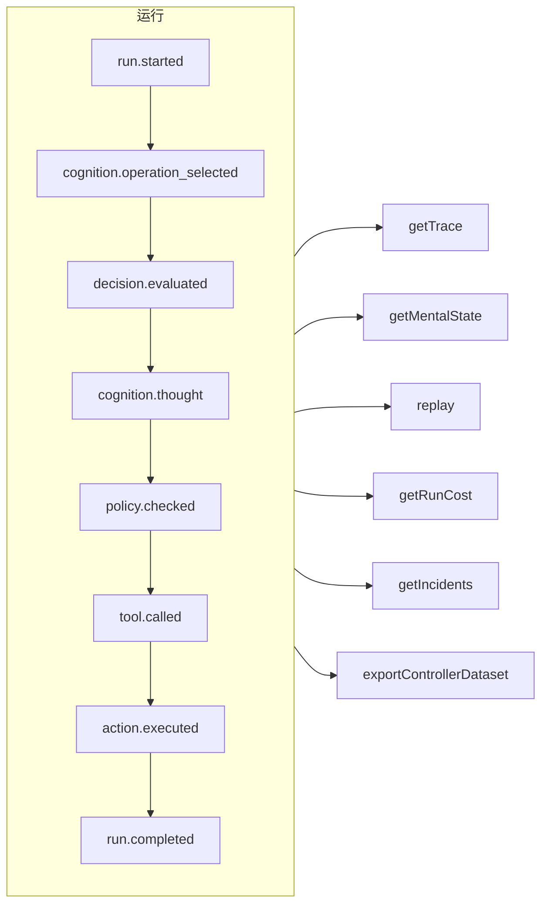

# 可追溯性与回放

每一次运行——受治理的、认知的、直接的类型化决策，或者一次 MCP 工具调用——都是一份**只追加的事件日志**。没有任何事情会在记录之外发生，其他一切都由它推导而来。



## 存储 {#stores}

| 存储 | 适用场景 |
| --- | --- |
| `FileEventStore`（默认） | 开发环境、单进程——每次运行一个 JSON 文件 |
| `SQLiteEventStore` | 支持查询的本地持久化 |
| `PostgreSQLEventStore` | 生产环境：带索引的查询、聚合、备份与恢复 |

::: code-group

```ts [File]
import { createSDK, FileEventStore } from '@sdk-ai-agents/core';

const sdk = createSDK({ apiKey, eventStore: new FileEventStore('./events') });
```

```ts [SQLite]
import Database from 'better-sqlite3';
import { createSDK, SQLiteEventStore } from '@sdk-ai-agents/core';

const sdk = createSDK({ apiKey, eventStore: new SQLiteEventStore({ db: new Database('events.db') }) });
```

```ts [PostgreSQL]
import pg from 'pg';
import { createSDK, PostgreSQLEventStore } from '@sdk-ai-agents/core';

const pool = new pg.Pool({ connectionString: process.env.DATABASE_URL });
const sdk = createSDK({ apiKey, eventStore: new PostgreSQLEventStore({ pool }) });
```

:::

存储都实现了 `IEventStore`；你可以自己编写一个，以对接任何数据库。文件存储会缓冲事件，每 100 毫秒刷新一次；请在关闭时调用 `await store.destroy()`，把尚未写入的内容写下来。日志的读取方（心智状态重建、成本、数据集）会忽略以相同 id 重复出现的事件。

## 读取一次运行 {#read-a-run}

```ts
const trace = await sdk.getTrace(runId);          // status, timeline, summary
const text = await sdk.exportTrace(runId, 'text'); // human-readable timeline
const events = await sdk.getEvents(runId, { type: ['tool.called', 'policy.violated'] });
const state = await sdk.getMentalState(runId);    // cognitive runs
```

一次运行的状态由**最后一个生命周期事件**（`run.completed`、`run.failed`、`run.cancelled`）决定。之后追加的事件——反馈、事故报告——永远不会让它重新打开。

## 实时进度 {#live-progress}

事件也会在**运行进行期间**到达你的代码，只要存储接受了它们就会送达：可以用来在界面中显示进度、把它们流式发送给客户端，或者为仪表盘提供数据。MCP 客户端会以[进度通知](./mcp-deploy#progress-notifications)的形式收到它们。

```ts
const result = await agent.run({
  message: 'Refund order 1234',
  onEvent: (event) => console.log(event.type),
});

const answer = await cognitiveAgent.think({ problem, onEvent: (event) => socket.send(JSON.stringify(event)) });
const replay = await sdk.replay(runId, undefined, { onEvent: (event) => console.log(event.type) });

// Every run of the SDK, for as long as you listen
const unsubscribe = sdk.subscribe((event) => dashboard.push(event), { types: ['run.failed', 'approval.requested'] });
unsubscribe();
```

| 位置 | 监听器收到什么 |
| --- | --- |
| `run({ onEvent })`、`think({ onEvent })` | 这次运行的每一个事件 |
| `replay(runId, modifications, { onEvent })` | 这次回放的每一个事件 |
| `executeTool(name, params, { onEvent })` | 这次调用的事件，以及它的工具所启动的那次智能体运行的事件（`governedAgentTool`、`cognitiveAgentTool`），只跟随一层：不包括该智能体再启动的运行 |
| `sdk.subscribe(listener, { runId?, agentId?, types?, maxQueued? })` | 与过滤条件匹配的每一次运行的每一个事件，直到你调用它返回的函数为止 |

有哪些保证：

- **只有存储接受了的事件。** 监听器会在存储的 `append` 成功之后被调用，对于存储拒绝的事件则永远不会被调用。使用 SQL 存储时，这一行已经提交；使用文件存储时，事件位于它的缓冲区中：`getEvents` 会立即返回它，并且它会在 100 毫秒内写入磁盘（在这之间发生崩溃会丢失它）。
- **按顺序。** 一次运行的事件按照它们被记录的顺序到达；不同运行的事件会相互交错。
- **一次一个事件，而且运行从不等待。** 当你的监听器返回一个 promise 时，它的下一个事件会等到这个 promise 完成之后才送达，所以异步监听器无法打乱事件的顺序。与此同时，运行会继续进行：慢的监听器会落在后面，但不会拖慢智能体。同步监听器会在该事件的 `append` 返回之前被调用：请让它保持快速。
- **调用会等待监听器，直到运行被中断。** 运行结束后，`run()`、`think()`、`replay()` 和 `executeTool()` 会等到它们的 `onEvent` 处理完每一个事件之后才返回结果，所以当它们返回时，你已经看到了全部事件。在以下情况下，等待会提前结束：运行被停止或被取消，或者它的 `signal` 被中止（调用方放弃了）；对于认知运行，`limits.timeoutMs` 也会把这段等待计算在内。此时监听器会被取消订阅：它尚未收到的事件会被丢弃。回放无法被取消，所以它总是会等待。除此之外，一个永远不会完成的 promise 会让调用无法返回：对于发出后不必等待的工作，不要返回这个 promise（`onEvent: (event) => { void save(event); }`）。
- **有界队列。** 最多有 `maxQueued` 个事件（默认 10 000 个）可以排队等待一个仍在处理先前事件的监听器；超过之后，发给这个监听器的新事件会被丢弃。当监听器赶上来之后，这次丢弃会以一个 `LiveEventsDroppedError` 报告出来，其中说明丢弃了多少个事件。
- **错误不会进入运行。** 抛出异常或返回被拒绝的 promise 的监听器会被报告到标准错误（`console.error`），并且仍然会收到后续的事件；被丢弃的事件也会这样报告。要自己处理错误，请在监听器中捕获它们；要同时处理错误和被丢弃的事件，请用 `eventStore: new ObservedEventStore(store, { onListenerError })` 创建 SDK。
- **一份副本。** 每个监听器都会得到事件的一份属于自己的副本，也就是存储读回的样子：修改它不会改变日志中的任何内容。
- **取消订阅立即生效。** 调用 `sdk.subscribe` 返回的函数之后，监听器就不会再被调用，即使是对已经在等待的事件也不会；这个函数也可以在监听器内部调用。

`agentId` 过滤条件匹配的是每个事件的 `metadata.agentId`：少数事件不带智能体（`provider.retry`、回放的结束、不带 `agentId` 发起的 `sdk.decisions` 调用的 `decision.evaluated`），要得到它们，请按运行过滤。恢复的备份不会被送达。`incidents` 产生的事故报告会被送达；对于你自己构建的 `MonitoredEventStore`，请把它构建在一个 `ObservedEventStore` 之上（`new MonitoredEventStore(new ObservedEventStore(store), options)`），否则它的报告会被记录下来，但不会被实时送达。对于在你自己的存储上手动组装的智能体（`new AgentImpl(…)`），要使用 `onEvent`，请把存储包装在一个 `ObservedEventStore` 中；`createSDK` 会替你做这件事。而在智能体工具背后，存储没有被包装的智能体不会失败，而是会在没有调用方监听器的情况下运行。

## 不经过 LLM 的回放 {#replay-without-the-llm}

```ts
const replay = await sdk.replay(runId);
```

回放会通过动作引擎重新执行记录下来的意图——包括策略——**而不调用 LLM**。可以带修改进行回放，以测试“如果……会怎样”的场景，例如在修改了某个策略之后。

回放会真的再次运行工具。对于标记了 `requiresApproval` 的工具，回放只会重复原始运行中经人**批准**过的调用——同一个工具、同样的参数——而不会再次询问；被拒绝、被取消或从未获得批准的调用会被拒绝，不会运行。由*策略*要求的审批仍然适用，并会等待决定。

## 理解决策 {#understand-decisions}

| 方法 | 你会得到什么 |
| --- | --- |
| `getReasoningGraph(runId)` / `exportReasoningGraph(runId, 'graphviz')` | 以图的形式呈现的“意图 → 策略 → 动作”链条 |
| `getAlternatives(runId)` | 智能体考虑过的备选方案 |
| `getDecisionPatterns(filters)` | 跨多次运行反复出现的决策模式 |
| `getTraceVisualization(runId)` | 分组好的、可直接用于界面时间线的结构 |
| `getPolicyAuditTrail(runId)` | 每一次策略评估及其结果 |

## 像测试代码一样测试智能体 {#test-agents-like-code}

把一次良好的运行变成**黄金追踪记录**，然后用它来验证新的运行：

```ts
const golden = await sdk.createGoldenTrace(runId, { name: 'refund flow', description: 'Expected behavior' });
const validation = await sdk.validateAgainstGoldenTrace(newRunId, golden.id);
const regressions = await sdk.detectRegressions(newRunId, golden.id);
```

运行按照事件的含义来比较，即类型、顺序、工具、参数和结果，从不按每次运行都会更新的事件 id 比较；时间和 token 数量也不参与比较。再次做同样事情的运行会通过；用别的参数调用的工具会在调用发生的位置被报告。

### 在 CI 中运行回归测试套件 {#regression-suites-in-ci}

先把黄金追踪记录组合成一个套件，然后在 CI 中运行它：

```ts
// Once, after recording the good runs
await sdk.createRegressionTestSuite('support-agent', {
  name: 'refunds',
  goldenTraces: [{ goldenTraceId: golden.id, name: 'refund flow' }],
});

// In CI: the same agent, created again
sdk.createAgent({ name: 'support-agent', model: 'gpt-4o', tools });
const { results, exitCode } = await sdk.runRegressionTestsForCI('support-agent', {
  detection: { tolerance: { ignoreEventTypes: ['intention.generated'], ignoreDataFields: ['output'] } },
});
await sdk.exportTestResults(results, 'junit', { outputPath: 'regressions.xml' });
process.exitCode = exitCode;
```

套件通过**名称**认出它的智能体，因为智能体的 id 在每个进程中都是新的。该智能体的所有套件都会按从旧到新的顺序运行：每个测试把参照运行的输入发给智能体，并把新的运行与黄金追踪记录比较。所有测试通过时退出码为 0，有测试发现回归时为 1，有测试无法运行时为 2。真实的模型每次运行的措辞都会不同：上面的 `detection` 排除了模型的文本和最终回答，但仍会检查每一次工具调用及其参数。

针对运行事件的断言、两次运行的比较、智能体新版本的影响以及跨所有运行的查询，请参见 [SDK API](../reference/sdk-api#assertions)。
