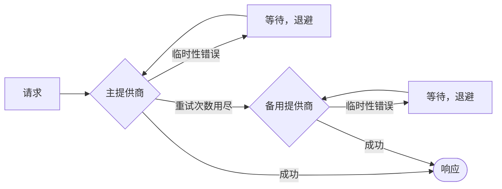

# 重试与回退

网络会出故障，提供商会限流，工具会超时。SDK 会重试可以重试的，对无法重试的进行故障转移，并且**把每一次重试都写进运行记录**，不隐瞒任何事情。



## LLM 提供商 {#llm-providers}

重试策略**在任何回退之前，分别**应用于每个提供商：

```ts
const sdk = createSDK({
  apiKey: process.env.OPENAI_API_KEY,
  fallbackProviders: [{ provider: 'anthropic', config: { apiKey: process.env.ANTHROPIC_API_KEY } }],
  retry: { maxRetries: 3, initialDelayMs: 500, maxDelayMs: 8_000 },
});
```

| 选项 | 默认值 | |
| --- | --- | --- |
| `maxRetries` | `2` | 首次尝试之后的重试次数 |
| `initialDelayMs` | `500` | 每次重试时翻倍（`multiplier`） |
| `maxDelayMs` | `8000` | 单次退避等待的上限 |
| `maxRetryAfterMs` | `60000` | 遵循的最长 `retry-after`（存在备用提供商时为 `maxDelayMs`） |
| `jitter` | `true` | 让每次等待在 [delay/2, delay] 范围内随机化 |
| `retryOn` | `isTransientError` | 你自己的判断函数 |

只有**临时性**错误才会重试：408、409、425、429、5xx、529、连接失败和超时——包括 OpenAI 和 Anthropic 的连接错误，它们按类以及其 `cause` 上的网络错误码来识别。身份认证、验证和策略错误会立即失败，表示账户额度或配额已经用完的 429（`insufficient_quota`、`credit_balance_exhausted`……）也是如此：等待并不能让额度回来。错误消息中带有厂商给出的解释。当提供商发送 `retry-after-ms` 或 `retry-after` 时，SDK 会按这个时长等待，而不是使用它自己的退避时间，最长为 `maxRetryAfterMs`（默认 60 秒）。当配置了 `fallbackProviders` 时，这个上限会降低到 `maxDelayMs`：一个要求长时间暂停的提供商会被留给备用提供商处理，而不是让运行卡住。如果要求等待的时间比这更长，重试就此结束。

当 SDK 的重试策略生效时，OpenAI 和 Anthropic 客户端自带的重试会被禁用——**重试永远不会叠加**。每一次重试都会被记录为一个 `provider.retry` 事件，包含提供商、模型、尝试次数、延迟和错误。传入 `retry: false` 可以改为保留厂商的默认设置。

你通过 `llmProvider` 注入的提供商会按原样使用，除非你显式设置了 `retry`；`FallbackProvider` 永远不会被包装，这样它的故障转移在追踪记录中始终可见。

## 工具 {#tools}

把幂等的工具标记为可重试：

```ts
sdk.defineTool({
  name: 'lookup_metric',
  description: 'Reads a metric',
  schema: z.object({ metric: z.string() }),
  retry: { maxRetries: 2, initialDelayMs: 200 },
  handler: async ({ metric }) => warehouse.read(metric),
});
```

只有工具失败才会重试——策略拒绝或验证错误永远不会重试。每一次重试都是一个 `tool.retry` 事件。

## 类型化决策 {#typed-decisions}

Jev 客户端会对 408、429、5xx 和 529 响应以及网络错误进行重试，**并遵循 `retry-after`**，默认使用 SDK 的重试策略（`jev.maxRetries` 可以覆盖它）。与 LLM 提供商不同，它会重试每一个 429，无论原因是什么，直到达到 `maxRetries`。

## 其他任何地方 {#anywhere-else}

`withRetry` 被导出，供你自己的代码使用：

```ts
import { withRetry, DEFAULT_RETRY_POLICY } from '@sdk-ai-agents/core';

const data = await withRetry(() => fetchPartnerFeed(), DEFAULT_RETRY_POLICY, {
  onRetry: ({ retry, delayMs, error }) => logger.warn({ retry, delayMs, error }),
});
```
